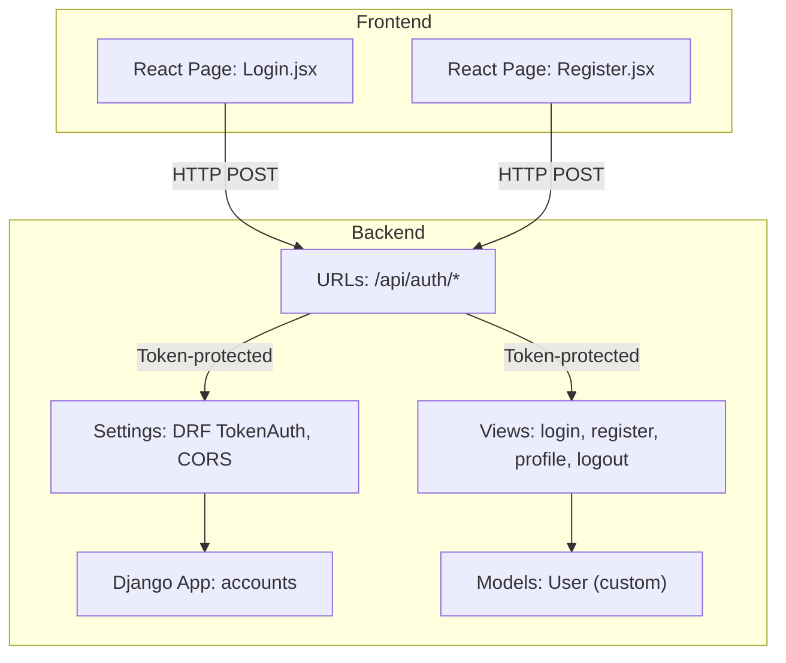
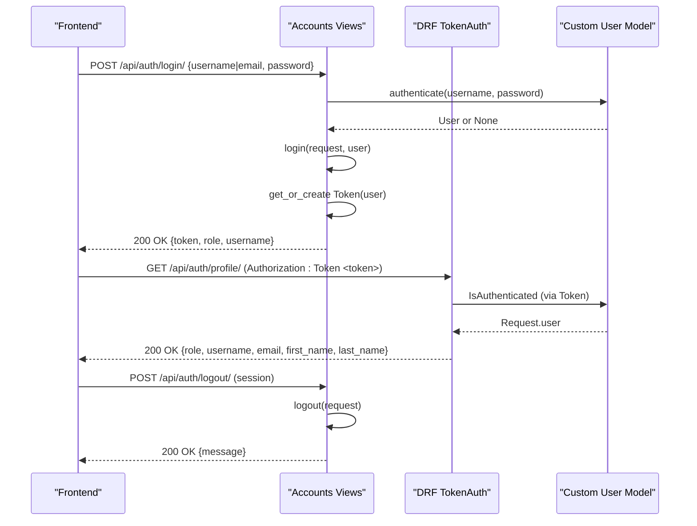
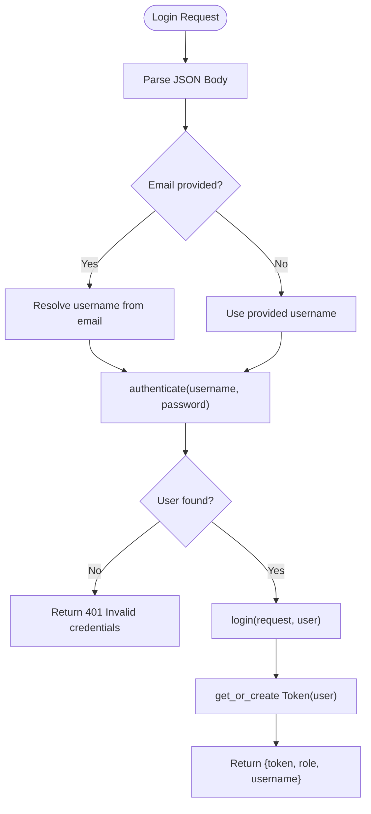
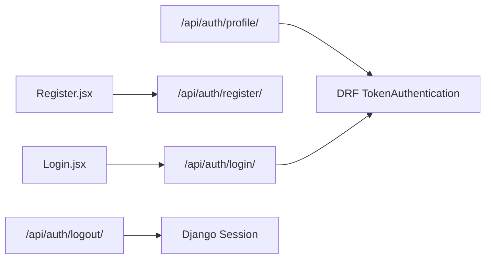

# Authentication APIs

<cite>
**Referenced Files in This Document**
- [views.py](file://backend/accounts/views.py)
- [urls.py](file://backend/accounts/urls.py)
- [models.py](file://backend/accounts/models.py)
- [settings.py](file://backend/backend/settings.py)
- [0001_initial.py](file://backend/accounts/migrations/0001_initial.py)
- [backend urls.py](file://backend/backend/urls.py)
- [Login.jsx](file://frontend/src/Pages/Public/Login.jsx)
- [Register.jsx](file://frontend/src/Pages/Public/Register.jsx)
</cite>

## Table of Contents
1. [Introduction](#introduction)
2. [Project Structure](#project-structure)
3. [Core Components](#core-components)
4. [Architecture Overview](#architecture-overview)
5. [Detailed Component Analysis](#detailed-component-analysis)
6. [Dependency Analysis](#dependency-analysis)
7. [Performance Considerations](#performance-considerations)
8. [Troubleshooting Guide](#troubleshooting-guide)
9. [Conclusion](#conclusion)

## Introduction
This document provides comprehensive API documentation for the authentication endpoints in the TPO Portal. It covers login, registration, logout, and profile retrieval, detailing HTTP methods, URL patterns, request/response schemas, authentication requirements, and the token-based authentication flow. It also explains dual login support (username or email), error responses, validation rules, and security considerations. Practical examples and integration patterns for frontend applications are included.

## Project Structure
The authentication APIs are implemented in the accounts app and exposed under the /api/auth/ route. The backend uses Django with Django REST Framework (DRF) token authentication. The frontend integrates with these endpoints via fetch requests and stores tokens in localStorage.

**Diagram sources**
- [backend urls.py:4-10](file://backend/backend/urls.py#L4-L10)
- [urls.py:4-9](file://backend/accounts/urls.py#L4-L9)
- [views.py:13-94](file://backend/accounts/views.py#L13-L94)
- [models.py:4-25](file://backend/accounts/models.py#L4-L25)
- [settings.py:19-44](file://backend/backend/settings.py#L19-L44)

**Section sources**
- [backend urls.py:4-10](file://backend/backend/urls.py#L4-L10)
- [urls.py:4-9](file://backend/accounts/urls.py#L4-L9)
- [settings.py:19-44](file://backend/backend/settings.py#L19-L44)

## Core Components
- Authentication endpoints
  - POST /api/auth/login/
  - POST /api/auth/register/
  - GET /api/auth/profile/ (protected)
  - POST /api/auth/logout/ (session-based)
- Token-based authentication
  - DRF TokenAuthentication with Token model
  - Token returned on successful login
  - Protected routes require Authorization: Token <token> header
- Dual login support
  - Accepts either username or email in login payload
  - Email-based login resolves to username internally
- User roles
  - Role field supports student, recruiter, and tpo (admin)

**Section sources**
- [views.py:13-94](file://backend/accounts/views.py#L13-L94)
- [models.py:4-25](file://backend/accounts/models.py#L4-L25)
- [settings.py:42-44](file://backend/backend/settings.py#L42-L44)

## Architecture Overview
The authentication flow uses Django sessions for login/logout and DRF token authentication for protected endpoints. The frontend sends credentials to login, receives a token, and uses it for subsequent protected requests.

**Diagram sources**
- [views.py:13-94](file://backend/accounts/views.py#L13-L94)
- [models.py:4-25](file://backend/accounts/models.py#L4-L25)
- [settings.py:42-44](file://backend/backend/settings.py#L42-L44)

## Detailed Component Analysis

### Endpoint: POST /api/auth/login/
- Purpose: Authenticate user and issue a token
- Authentication: No prior authentication required
- Request body (JSON)
  - username: string (alternative to email)
  - email: string (alternative to username)
  - password: string
  - Either username or email must be provided
- Success response (200 OK)
  - message: string
  - role: string (student, recruiter, tpo)
  - username: string
  - token: string
- Error responses
  - 400 Bad Request: Invalid JSON
  - 401 Unauthorized: Invalid credentials
  - 405 Method Not Allowed: Non-POST requests
- Security and behavior
  - Supports dual login: if email is provided, resolves to username before authenticate
  - Uses Django authenticate with username/password
  - On success, creates or retrieves a DRF Token and starts a session
- Frontend integration example
  - Sends POST with username/email and password
  - Stores token and role in localStorage
  - Immediately fetches profile with Authorization header

**Section sources**
- [views.py:13-45](file://backend/accounts/views.py#L13-L45)
- [Login.jsx:17-55](file://frontend/src/Pages/Public/Login.jsx#L17-L55)

### Endpoint: POST /api/auth/register/
- Purpose: Create a new user account
- Authentication: No prior authentication required
- Request body (JSON)
  - first_name: string
  - last_name: string
  - username: string (required)
  - email: string
  - password: string (required)
  - role: string (student, recruiter, tpo)
- Success response (201 Created)
  - message: string
- Error responses
  - 400 Bad Request: Username already taken or validation error
  - 405 Method Not Allowed: Non-POST requests
- Validation rules
  - Username uniqueness enforced
  - Uses Django’s built-in password validators (configured in settings)
- Frontend integration example
  - Sends POST with form fields
  - On success, navigates to login page

**Section sources**
- [views.py:48-75](file://backend/accounts/views.py#L48-L75)
- [Register.jsx:20-40](file://frontend/src/Pages/Public/Register.jsx#L20-L40)
- [settings.py:92-105](file://backend/backend/settings.py#L92-L105)

### Endpoint: GET /api/auth/profile/
- Purpose: Retrieve authenticated user’s profile
- Authentication: Required (TokenAuthentication)
- Headers
  - Authorization: Token <token>
- Success response (200 OK)
  - first_name: string
  - last_name: string
  - username: string
  - email: string
  - role: string
- Error responses
  - 401 Unauthorized: Missing or invalid token
- Frontend integration example
  - After login, fetches profile using the received token
  - Stores profile in localStorage for dashboard usage

**Section sources**
- [views.py:78-89](file://backend/accounts/views.py#L78-L89)
- [Login.jsx:37-44](file://frontend/src/Pages/Public/Login.jsx#L37-L44)

### Endpoint: POST /api/auth/logout/
- Purpose: End current session
- Authentication: Session-based logout (no token required)
- Success response (200 OK)
  - message: string
- Notes
  - Does not invalidate the DRF token; consider token invalidation if needed
  - Clears Django session

**Section sources**
- [views.py:92-94](file://backend/accounts/views.py#L92-L94)

### Token-Based Authentication Flow
- Token generation
  - Occurs on successful login via authenticate and get_or_create Token
- Token usage
  - Send Authorization: Token <token> header for protected endpoints
  - DRF TokenAuthentication validates the token and enforces IsAuthenticated
- Token lifecycle
  - Tokens persist until manually deleted or cleared by logout
  - Consider implementing token refresh or expiration for production

**Diagram sources**
- [views.py:13-45](file://backend/accounts/views.py#L13-L45)

## Dependency Analysis
- Backend dependencies
  - Django REST Framework token authentication
  - Custom User model with role field
  - CORS configuration for frontend origin
- URL routing
  - Root includes accounts URLs under /api/auth/
- Frontend dependencies
  - React pages submit credentials and handle responses
  - Stores token and user info in localStorage

**Diagram sources**
- [Login.jsx:17-55](file://frontend/src/Pages/Public/Login.jsx#L17-L55)
- [Register.jsx:20-40](file://frontend/src/Pages/Public/Register.jsx#L20-L40)
- [urls.py:4-9](file://backend/accounts/urls.py#L4-L9)
- [views.py:78-94](file://backend/accounts/views.py#L78-L94)
- [settings.py:42-44](file://backend/backend/settings.py#L42-L44)

**Section sources**
- [urls.py:4-9](file://backend/accounts/urls.py#L4-L9)
- [settings.py:19-44](file://backend/backend/settings.py#L19-L44)

## Performance Considerations
- Token lookup is O(1) with database indexing on token key
- Avoid excessive profile fetches; cache user data after first retrieval
- Consider rate limiting login attempts to mitigate brute-force attacks
- Use HTTPS in production to protect tokens and credentials

## Troubleshooting Guide
- 400 Bad Request on login
  - Ensure JSON is valid and includes username or email and password
- 401 Unauthorized on login
  - Verify credentials; ensure dual-login email resolution is handled
- 401 Unauthorized on profile
  - Confirm Authorization header is present and correct
  - Ensure token matches the logged-in user
- 405 Method Not Allowed
  - Only POST is accepted for login/register; GET for profile
- CORS errors
  - Ensure frontend origin is configured in CORS_ALLOWED_ORIGINS

**Section sources**
- [views.py:13-45](file://backend/accounts/views.py#L13-L45)
- [views.py:48-75](file://backend/accounts/views.py#L48-L75)
- [views.py:78-89](file://backend/accounts/views.py#L78-L89)
- [settings.py:19-22](file://backend/backend/settings.py#L19-L22)

## Conclusion
The TPO Portal authentication system provides a straightforward token-based flow with dual login support. The backend endpoints are simple to integrate, and the frontend demonstrates typical usage patterns. For production, consider adding token expiration, refresh mechanisms, CSRF protection for sensitive endpoints, and stricter CORS policies.