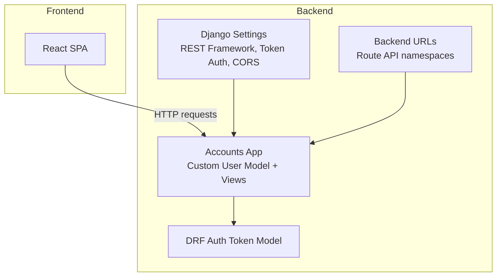
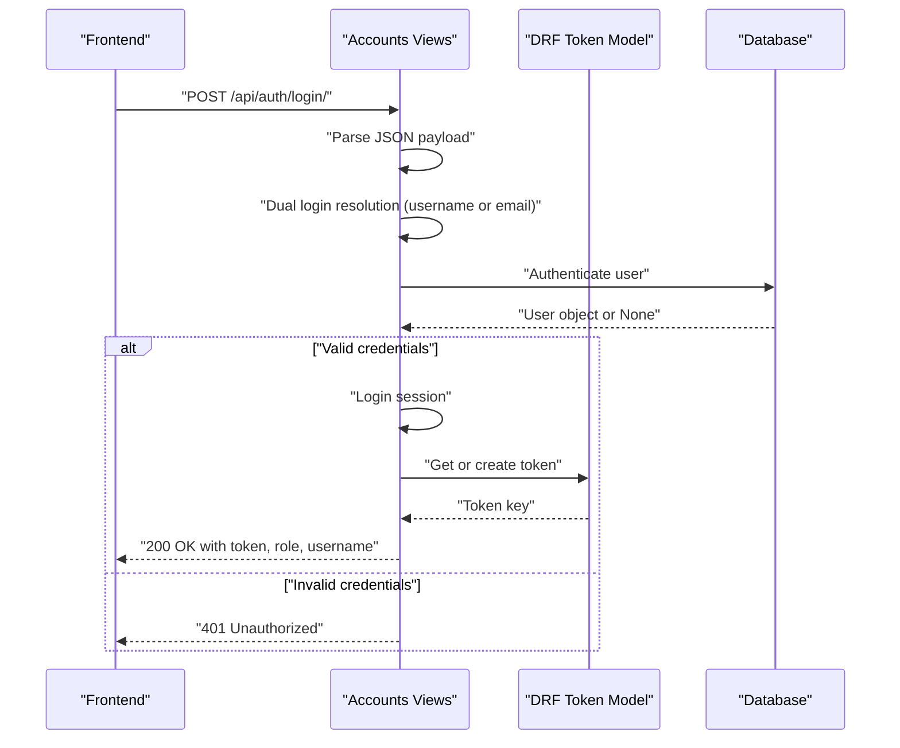
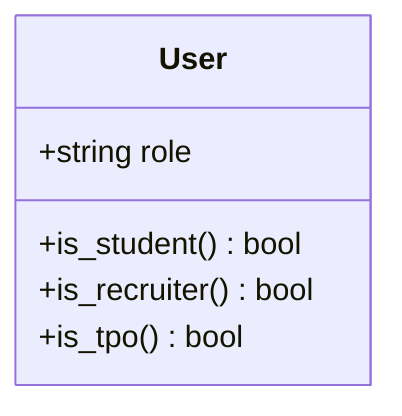
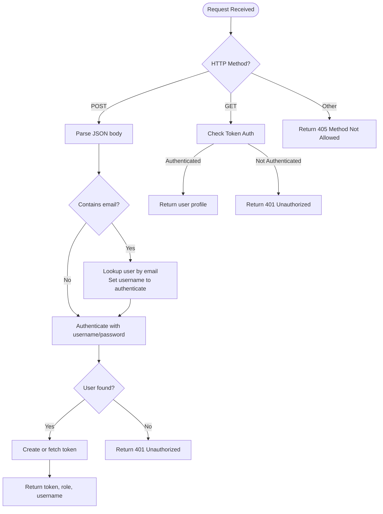
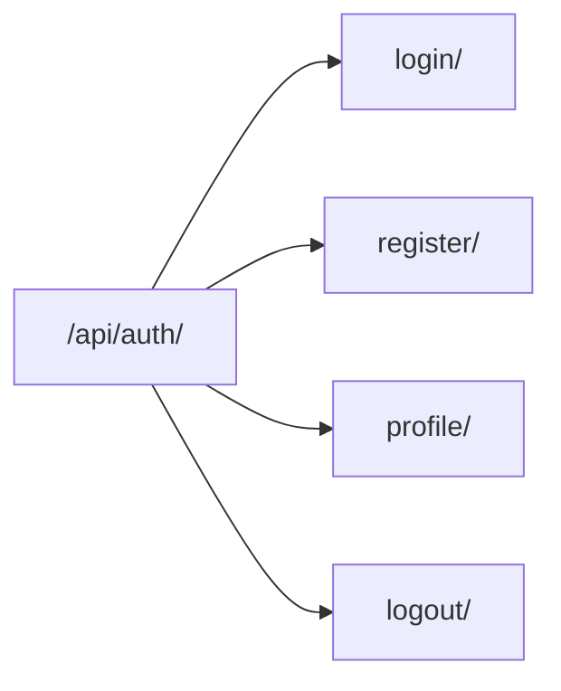
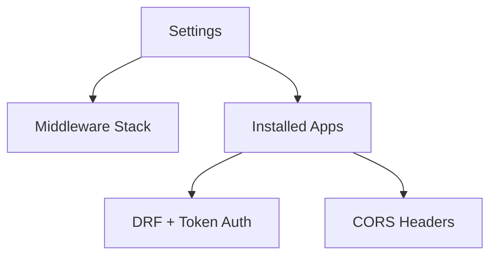

# Authentication System

<cite>
**Referenced Files in This Document**
- [accounts/models.py](file://backend/accounts/models.py)
- [accounts/views.py](file://backend/accounts/views.py)
- [accounts/urls.py](file://backend/accounts/urls.py)
- [backend/settings.py](file://backend/settings.py)
- [backend/urls.py](file://backend/urls.py)
</cite>

## Table of Contents
1. [Introduction](#introduction)
2. [Project Structure](#project-structure)
3. [Core Components](#core-components)
4. [Architecture Overview](#architecture-overview)
5. [Detailed Component Analysis](#detailed-component-analysis)
6. [Dependency Analysis](#dependency-analysis)
7. [Performance Considerations](#performance-considerations)
8. [Troubleshooting Guide](#troubleshooting-guide)
9. [Conclusion](#conclusion)
10. [Appendices](#appendices)

## Introduction
This document explains the authentication system for the TPO Portal, focusing on the custom user model with role-based permissions and token-based authentication using Django REST Framework. It covers login and registration flows, dual login support (username or email), protected endpoints, logout, and CORS configuration. It also outlines frontend integration patterns and security considerations.

## Project Structure
The authentication system spans the backend Django application and is exposed via REST endpoints under the API namespace. The accounts app defines the custom user model and authentication endpoints. The backend settings configure REST Framework, token authentication, and CORS.

**Diagram sources**
- [backend/settings.py:19-44](file://backend/settings.py#L19-L44)
- [backend/urls.py:4-10](file://backend/urls.py#L4-L10)
- [accounts/views.py:13-95](file://backend/accounts/views.py#L13-L95)

**Section sources**
- [backend/settings.py:19-44](file://backend/settings.py#L19-L44)
- [backend/urls.py:4-10](file://backend/urls.py#L4-L10)

## Core Components
- Custom User Model with Roles
  - Role choices include student, recruiter, and TPO admin.
  - Helper methods expose role checks for downstream logic.
- Token-Based Authentication
  - Uses Django REST Framework TokenAuthentication.
  - Tokens are created per user upon successful login.
- Authentication Endpoints
  - Login supports username or email (dual login).
  - Registration creates a new user with a chosen role.
  - Profile endpoint requires a valid token.
  - Logout endpoint clears session state.

**Section sources**
- [accounts/models.py:4-25](file://backend/accounts/models.py#L4-L25)
- [accounts/views.py:13-95](file://backend/accounts/views.py#L13-L95)
- [accounts/urls.py:4-9](file://backend/accounts/urls.py#L4-L9)

## Architecture Overview
The authentication flow integrates Django’s authentication backend with DRF token authentication. The frontend sends HTTP requests to the backend, which validates credentials, issues tokens, and enforces protected routes.

**Diagram sources**
- [accounts/views.py:13-45](file://backend/accounts/views.py#L13-L45)

## Detailed Component Analysis

### Custom User Model
The custom user model extends Django’s AbstractUser and adds a role field with predefined choices. It exposes convenience methods to check roles.

**Diagram sources**
- [accounts/models.py:4-25](file://backend/accounts/models.py#L4-L25)

**Section sources**
- [accounts/models.py:4-25](file://backend/accounts/models.py#L4-L25)

### Authentication Endpoints
- Login
  - Accepts either username or email.
  - On success, logs in the user and returns a token.
- Registration
  - Creates a new user with provided details and role.
- Profile
  - Protected endpoint requiring a valid DRF token.
- Logout
  - Clears the current session.

**Diagram sources**
- [accounts/views.py:13-95](file://backend/accounts/views.py#L13-L95)

**Section sources**
- [accounts/views.py:13-45](file://backend/accounts/views.py#L13-L45)
- [accounts/views.py:48-76](file://backend/accounts/views.py#L48-L76)
- [accounts/views.py:78-95](file://backend/accounts/views.py#L78-L95)

### URL Routing
Authentication endpoints are mounted under the API namespace.

**Diagram sources**
- [accounts/urls.py:4-9](file://backend/accounts/urls.py#L4-L9)
- [backend/urls.py:6](file://backend/urls.py#L6)

**Section sources**
- [accounts/urls.py:4-9](file://backend/accounts/urls.py#L4-L9)
- [backend/urls.py:6](file://backend/urls.py#L6)

## Dependency Analysis
- Settings
  - Configures REST Framework, token authentication, CORS, and the custom user model.
- Middleware
  - Includes CORS middleware and authentication middleware to enable cross-origin requests and session-based auth.
- Installed Apps
  - Includes accounts, student, recruiter, tpo_admin, rest_framework, rest_framework.authtoken, and corsheaders.

**Diagram sources**
- [backend/settings.py:27-44](file://backend/settings.py#L27-L44)
- [backend/settings.py:47-56](file://backend/settings.py#L47-L56)

**Section sources**
- [backend/settings.py:27-44](file://backend/settings.py#L27-L44)
- [backend/settings.py:47-56](file://backend/settings.py#L47-L56)

## Performance Considerations
- Token lookup occurs per request for protected endpoints; caching tokens client-side avoids repeated logins.
- Email-to-username resolution performs a database lookup only when an email is provided; otherwise, it authenticates directly by username.
- Consider rate limiting login attempts at the network level to mitigate brute-force attacks.

## Troubleshooting Guide
- 401 Unauthorized on profile or protected endpoints
  - Ensure the Authorization header includes the token issued during login.
- 400 Bad Request on login/register
  - Verify the request body is valid JSON and includes required fields.
- CORS errors in the browser
  - Confirm the frontend origin is included in the configured CORS allowed origins.
- User enumeration concerns
  - The login flow intentionally delays failure outcomes to avoid leaking whether an email exists; do not rely on response timing for security-sensitive logic.

**Section sources**
- [accounts/views.py:13-45](file://backend/accounts/views.py#L13-L45)
- [accounts/views.py:48-76](file://backend/accounts/views.py#L48-L76)
- [backend/settings.py:18-22](file://backend/settings.py#L18-L22)

## Conclusion
The TPO Portal authentication system leverages a custom user model with role-based permissions and DRF token authentication. It supports flexible login (username or email), secure protected endpoints, and straightforward registration and logout flows. Proper CORS configuration and middleware ensure seamless integration with the React frontend.

## Appendices

### Endpoint Reference
- POST /api/auth/login/
  - Payload: username or email, password
  - Success: token, role, username
  - Failure: 401 Unauthorized
- POST /api/auth/register/
  - Payload: first_name, last_name, username, password, email, role
  - Success: 201 Created
  - Failure: 400 Bad Request
- GET /api/auth/profile/
  - Requires: DRF Token in Authorization header
  - Success: user profile fields
  - Failure: 401 Unauthorized
- POST /api/auth/logout/
  - Success: 200 OK

**Section sources**
- [accounts/urls.py:4-9](file://backend/accounts/urls.py#L4-L9)
- [accounts/views.py:13-95](file://backend/accounts/views.py#L13-L95)

### Frontend Integration Patterns
- Store the token in secure HTTP-only cookies or local storage after login.
- Attach the token to all authenticated requests using the Authorization header.
- Protect routes by checking token validity and user role before rendering.
- Implement automatic token renewal by attempting a silent re-authentication before expiration.

[No sources needed since this section provides general guidance]