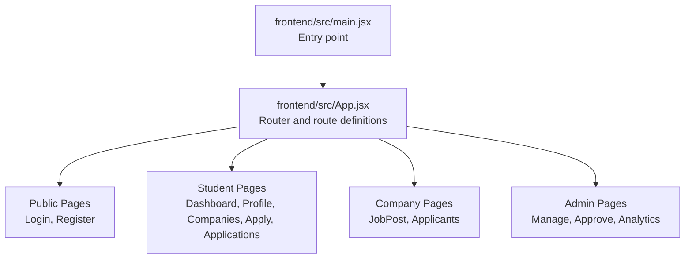
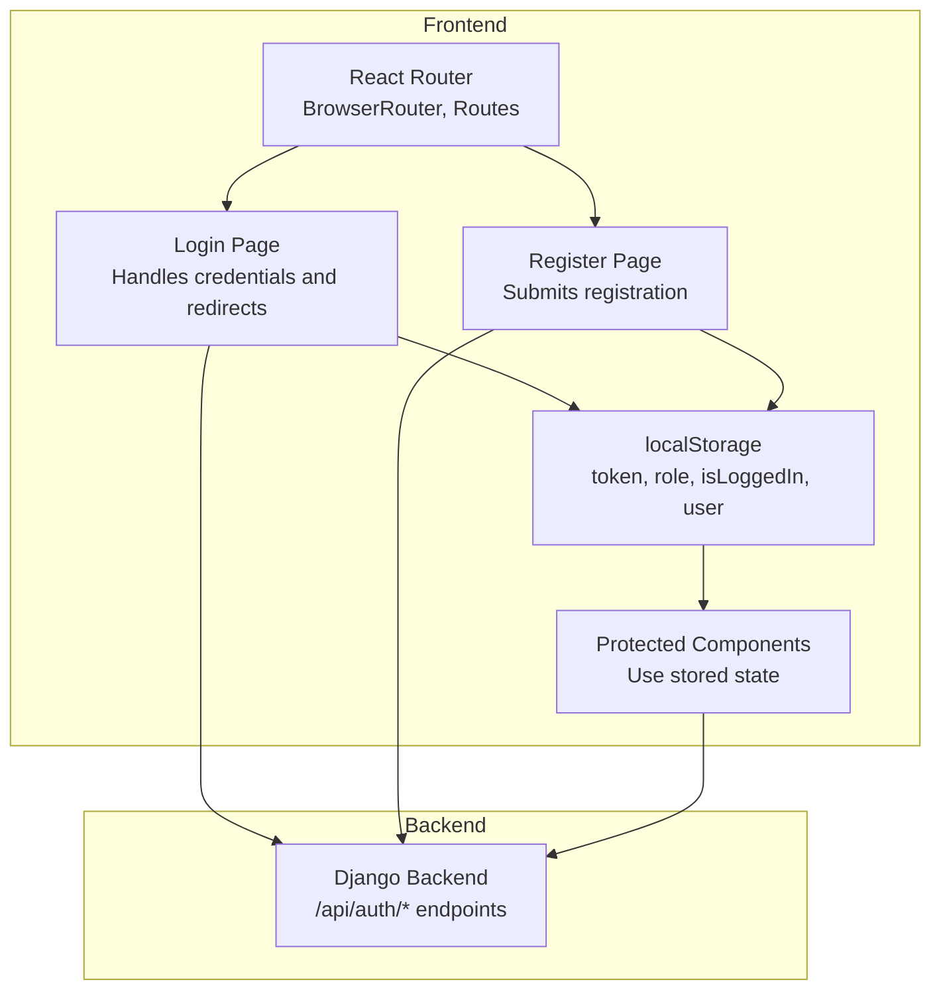
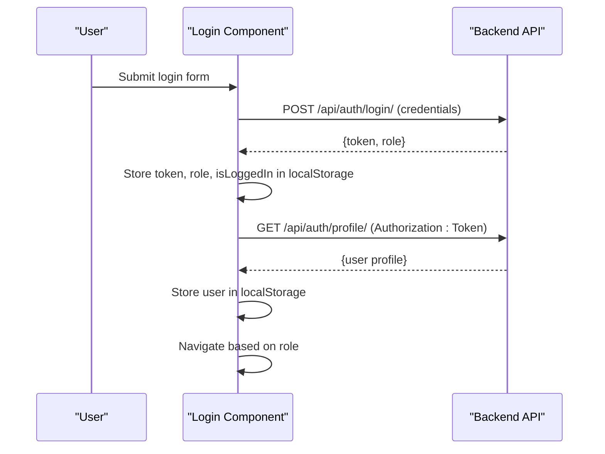
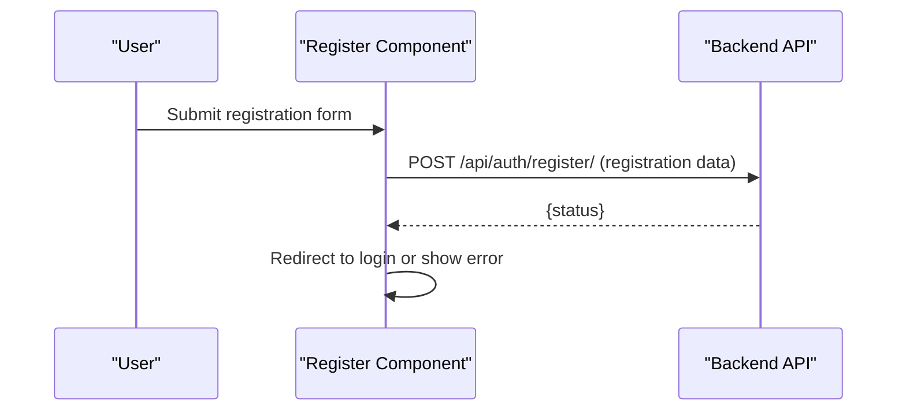
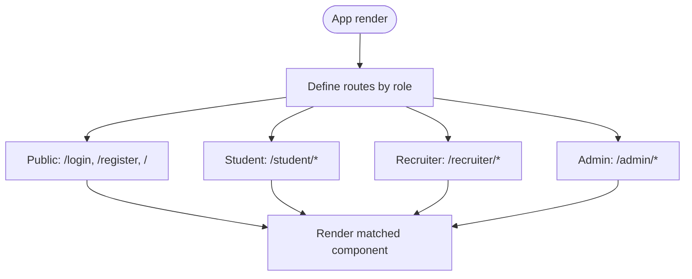
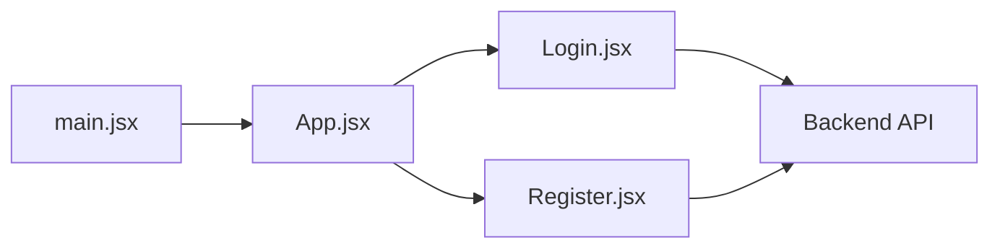

# Frontend Authentication Integration

<cite>
**Referenced Files in This Document**
- [main.jsx](file://frontend/src/main.jsx)
- [App.jsx](file://frontend/src/App.jsx)
- [Login.jsx](file://frontend/src/Pages/Public/Login.jsx)
- [Register.jsx](file://frontend/src/Pages/Public/Register.jsx)
- [ApplicationTracker.jsx](file://frontend/src/Pages/Student/ApplicationTracker.jsx)
- [Apply.jsx](file://frontend/src/Pages/Student/Apply.jsx)
</cite>

## Table of Contents
1. [Introduction](#introduction)
2. [Project Structure](#project-structure)
3. [Core Components](#core-components)
4. [Architecture Overview](#architecture-overview)
5. [Detailed Component Analysis](#detailed-component-analysis)
6. [Dependency Analysis](#dependency-analysis)
7. [Performance Considerations](#performance-considerations)
8. [Troubleshooting Guide](#troubleshooting-guide)
9. [Conclusion](#conclusion)

## Introduction
This document explains the frontend authentication integration for the TPO Portal. It covers how users log in, how authentication state is maintained via localStorage, how routes are organized by role, and how authenticated API calls are made. The current implementation uses React Router for client-side routing and vanilla fetch for HTTP requests. There is no dedicated authentication service module or React Context-based state management in the provided code; instead, authentication state is persisted in localStorage and used across components.

## Project Structure
The frontend is structured around pages organized by role and a central App component that defines routes. The main entry point renders the App component inside a strict mode wrapper.

**Diagram sources**
- [main.jsx:1-11](file://frontend/src/main.jsx#L1-L11)
- [App.jsx:1-55](file://frontend/src/App.jsx#L1-L55)

**Section sources**
- [main.jsx:1-11](file://frontend/src/main.jsx#L1-L11)
- [App.jsx:1-55](file://frontend/src/App.jsx#L1-L55)

## Core Components
- Authentication flow: Login and registration pages submit credentials to backend endpoints and persist tokens and user info in localStorage.
- Protected routing: Routes are defined per role; navigation depends on the stored role.
- State persistence: Authentication state (token, role, user) is stored in localStorage and retrieved by components.
- API communication: Components use fetch with Authorization headers when available.

Key implementation patterns:
- Token storage and retrieval using localStorage keys: token, role, isLoggedIn, user.
- Role-based navigation after successful login.
- Manual logout by removing localStorage entries.

**Section sources**
- [Login.jsx:17-55](file://frontend/src/Pages/Public/Login.jsx#L17-L55)
- [Register.jsx:22-40](file://frontend/src/Pages/Public/Register.jsx#L22-L40)
- [ApplicationTracker.jsx:147-150](file://frontend/src/Pages/Student/ApplicationTracker.jsx#L147-L150)
- [Apply.jsx:130-133](file://frontend/src/Pages/Student/Apply.jsx#L130-L133)

## Architecture Overview
The authentication architecture consists of:
- Client-side routing with React Router.
- Login and registration pages that communicate with backend authentication endpoints.
- LocalStorage for token and user state persistence.
- Role-based route rendering and navigation.

**Diagram sources**
- [App.jsx:1-55](file://frontend/src/App.jsx#L1-L55)
- [Login.jsx:17-55](file://frontend/src/Pages/Public/Login.jsx#L17-L55)
- [Register.jsx:22-40](file://frontend/src/Pages/Public/Register.jsx#L22-L40)

## Detailed Component Analysis

### Login Component
The Login component manages form state, submits credentials to the backend, stores authentication data in localStorage, fetches the user profile, and navigates based on role.

**Diagram sources**
- [Login.jsx:17-55](file://frontend/src/Pages/Public/Login.jsx#L17-L55)

**Section sources**
- [Login.jsx:17-55](file://frontend/src/Pages/Public/Login.jsx#L17-L55)

### Registration Component
The Register component submits registration data to the backend and follows similar localStorage persistence patterns.

**Diagram sources**
- [Register.jsx:22-40](file://frontend/src/Pages/Public/Register.jsx#L22-L40)

**Section sources**
- [Register.jsx:22-40](file://frontend/src/Pages/Public/Register.jsx#L22-L40)

### Protected Route Configuration
Routes are defined per role in the App component. Navigation is handled client-side via react-router-dom. There is no explicit route guard component in the provided code; navigation depends on the stored role and the presence of a token.

**Diagram sources**
- [App.jsx:25-51](file://frontend/src/App.jsx#L25-L51)

**Section sources**
- [App.jsx:25-51](file://frontend/src/App.jsx#L25-L51)

### Authentication State Management
Authentication state is managed using localStorage keys:
- token: JWT or session token
- role: user role (student, recruiter, admin)
- isLoggedIn: boolean flag
- user: serialized user profile

Components retrieve this state to personalize UI and decide behavior.

**Section sources**
- [Login.jsx:33-35](file://frontend/src/Pages/Public/Login.jsx#L33-L35)
- [ApplicationTracker.jsx:12](file://frontend/src/Pages/Student/ApplicationTracker.jsx#L12)
- [Apply.jsx:40](file://frontend/src/Pages/Student/Apply.jsx#L40)

### Logout Handling
Logout removes all authentication-related items from localStorage, effectively clearing the login state.

**Section sources**
- [ApplicationTracker.jsx:147-150](file://frontend/src/Pages/Student/ApplicationTracker.jsx#L147-L150)
- [Apply.jsx:130-133](file://frontend/src/Pages/Student/Apply.jsx#L130-L133)

### Authenticated API Calls
Authenticated requests are performed using fetch with Authorization headers when a token exists. The Login component demonstrates fetching the profile endpoint using the returned token.

**Section sources**
- [Login.jsx:37-44](file://frontend/src/Pages/Public/Login.jsx#L37-L44)

## Dependency Analysis
- main.jsx depends on App.jsx to render the application shell.
- App.jsx defines routes and imports page components for each role.
- Login.jsx and Register.jsx depend on the backend authentication endpoints.
- Protected components depend on localStorage for authentication state.

**Diagram sources**
- [main.jsx:1-11](file://frontend/src/main.jsx#L1-L11)
- [App.jsx:1-55](file://frontend/src/App.jsx#L1-L55)
- [Login.jsx:17-55](file://frontend/src/Pages/Public/Login.jsx#L17-L55)
- [Register.jsx:22-40](file://frontend/src/Pages/Public/Register.jsx#L22-L40)

**Section sources**
- [main.jsx:1-11](file://frontend/src/main.jsx#L1-L11)
- [App.jsx:1-55](file://frontend/src/App.jsx#L1-L55)
- [Login.jsx:17-55](file://frontend/src/Pages/Public/Login.jsx#L17-L55)
- [Register.jsx:22-40](file://frontend/src/Pages/Public/Register.jsx#L22-L40)

## Performance Considerations
- Using localStorage for state management avoids unnecessary network requests but requires careful cleanup on logout.
- Fetch is lightweight but does not include automatic retry or interceptor-based header injection. Consider adding an HTTP client with interceptors for consistent token handling across all requests.
- Profile fetching on login reduces duplication of user data in memory.

## Troubleshooting Guide
Common issues and resolutions:
- Login fails: Verify backend endpoint availability and credential correctness. Check error messages returned by the server and confirm localStorage entries are written.
- Navigation incorrect: Ensure role is correctly stored and that the route path matches the stored role.
- Not redirected to dashboard: Confirm that the role-based redirect logic executes after login.
- Logout not effective: Ensure all localStorage keys are removed during logout.

**Section sources**
- [Login.jsx:51-54](file://frontend/src/Pages/Public/Login.jsx#L51-L54)
- [ApplicationTracker.jsx:147-150](file://frontend/src/Pages/Student/ApplicationTracker.jsx#L147-L150)
- [Apply.jsx:130-133](file://frontend/src/Pages/Student/Apply.jsx#L130-L133)

## Conclusion
The TPO Portal frontend implements authentication using React Router for routing and vanilla fetch for HTTP requests. Authentication state is persisted in localStorage and used to drive role-based navigation. While functional, the current implementation lacks centralized HTTP interceptors and shared authentication state management. Enhancing it with an Axios-based HTTP client and a dedicated authentication context would improve maintainability, reduce duplication, and enable advanced features like automatic token refresh and centralized error handling.