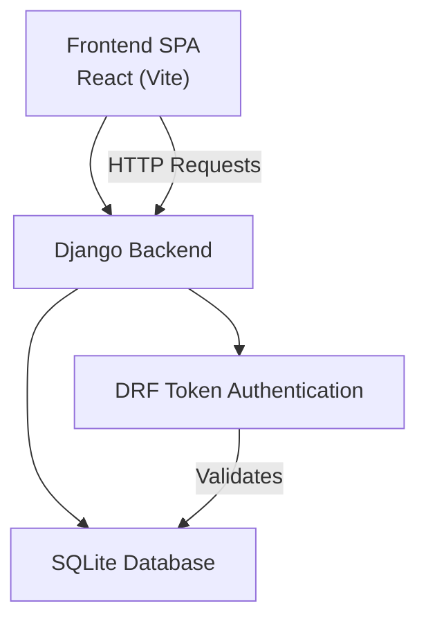
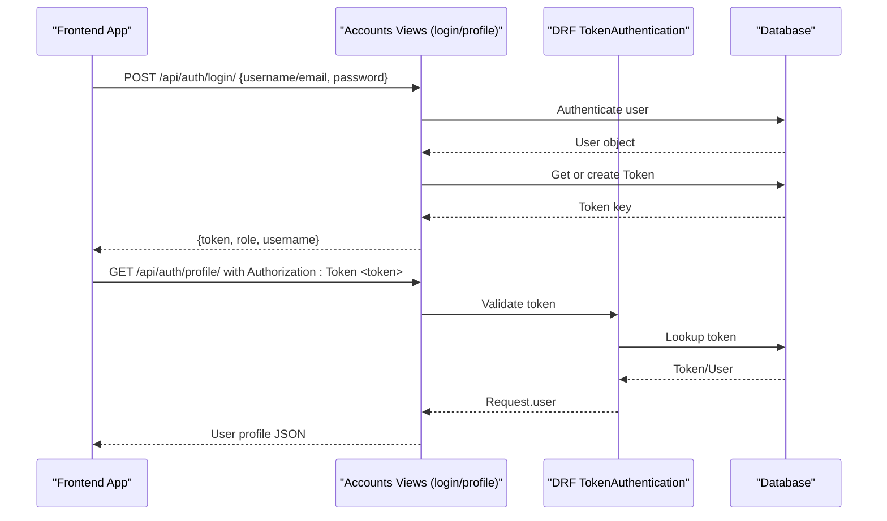
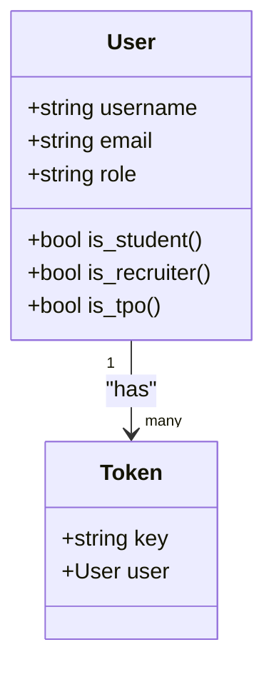
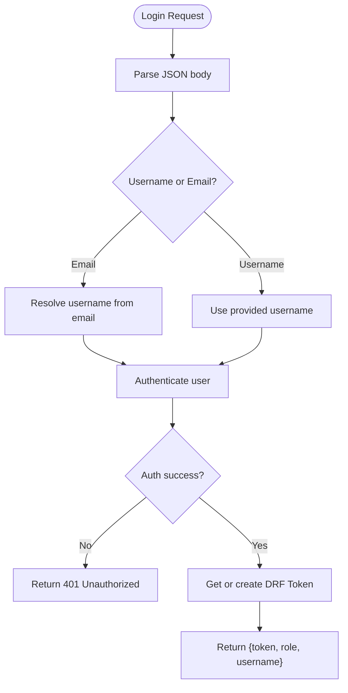
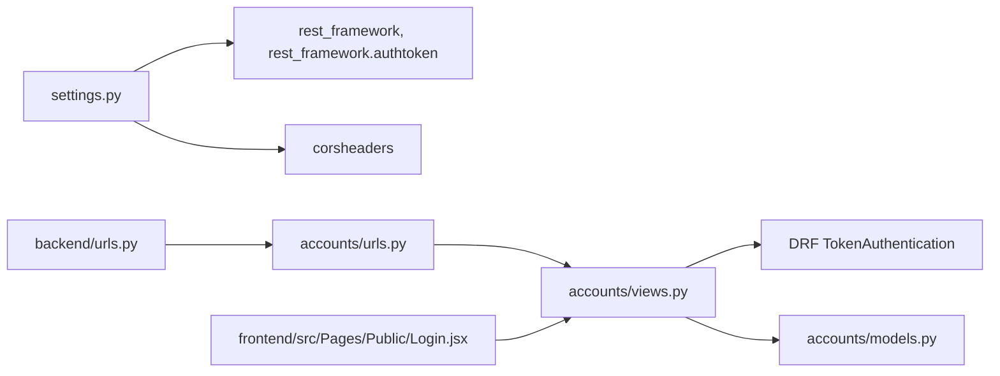

# Token Management

<cite>
**Referenced Files in This Document**
- [settings.py](file://backend/backend/settings.py)
- [urls.py](file://backend/backend/urls.py)
- [accounts/urls.py](file://backend/accounts/urls.py)
- [accounts/views.py](file://backend/accounts/views.py)
- [accounts/models.py](file://backend/accounts/models.py)
- [accounts/migrations/0001_initial.py](file://backend/accounts/migrations/0001_initial.py)
- [student/views.py](file://backend/student/views.py)
- [recruiter/views.py](file://backend/recruiter/views.py)
- [tpo_admin/views.py](file://backend/tpo_admin/views.py)
- [frontend/src/Pages/Public/Login.jsx](file://frontend/src/Pages/Public/Login.jsx)
- [frontend/src/App.jsx](file://frontend/src/App.jsx)
</cite>

## Table of Contents
1. [Introduction](#introduction)
2. [Project Structure](#project-structure)
3. [Core Components](#core-components)
4. [Architecture Overview](#architecture-overview)
5. [Detailed Component Analysis](#detailed-component-analysis)
6. [Dependency Analysis](#dependency-analysis)
7. [Performance Considerations](#performance-considerations)
8. [Troubleshooting Guide](#troubleshooting-guide)
9. [Conclusion](#conclusion)
10. [Appendices](#appendices)

## Introduction
This document explains the token-based authentication system in the TPO Portal. It covers how tokens are generated during login, validated for protected endpoints, and transmitted securely. It also documents the Django REST Framework (DRF) token authentication setup, CORS configuration for cross-origin requests, token storage strategies in the frontend, and the token lifecycle from creation to logout. Guidance is included for extending the system with refresh tokens and additional security controls.

## Project Structure
The authentication system spans the backend Django application and the frontend React SPA:
- Backend exposes authentication endpoints under /api/auth/.
- DRF token authentication is enabled and configured globally.
- Frontend sends credentials to the login endpoint, stores the token, and attaches it to subsequent protected requests.

**Diagram sources**
- [settings.py:18-22](file://backend/backend/settings.py#L18-L22)
- [settings.py:42-44](file://backend/backend/settings.py#L42-L44)
- [backend/urls.py:6](file://backend/backend/urls.py#L6)
- [accounts/urls.py:4-9](file://backend/accounts/urls.py#L4-L9)

**Section sources**
- [settings.py:18-22](file://backend/backend/settings.py#L18-L22)
- [settings.py:42-44](file://backend/backend/settings.py#L42-L44)
- [backend/urls.py:6](file://backend/backend/urls.py#L6)
- [accounts/urls.py:4-9](file://backend/accounts/urls.py#L4-L9)

## Core Components
- Token generation and login:
  - On successful authentication, a DRF Token is created or retrieved for the user and returned to the client.
- Protected endpoints:
  - DRF’s TokenAuthentication enforces authentication for decorated endpoints.
- CORS configuration:
  - Allows cross-origin requests from the frontend origin.
- Frontend token handling:
  - Stores token in local storage and includes it in Authorization headers for protected requests.

Key implementation references:
- Token creation and dual-login support: [accounts/views.py:13-45](file://backend/accounts/views.py#L13-L45)
- Protected profile endpoint: [accounts/views.py:78-89](file://backend/accounts/views.py#L78-L89)
- DRF token app and middleware: [settings.py:42-44](file://backend/backend/settings.py#L42-L44)
- CORS origins: [settings.py:18-22](file://backend/backend/settings.py#L18-L22)
- Frontend login and token usage: [frontend/src/Pages/Public/Login.jsx:17-55](file://frontend/src/Pages/Public/Login.jsx#L17-L55)

**Section sources**
- [accounts/views.py:13-45](file://backend/accounts/views.py#L13-L45)
- [accounts/views.py:78-89](file://backend/accounts/views.py#L78-L89)
- [settings.py:18-22](file://backend/backend/settings.py#L18-L22)
- [settings.py:42-44](file://backend/backend/settings.py#L42-L44)
- [frontend/src/Pages/Public/Login.jsx:17-55](file://frontend/src/Pages/Public/Login.jsx#L17-L55)

## Architecture Overview
The authentication flow integrates Django’s authentication with DRF token authentication and the frontend’s token storage and transmission.

**Diagram sources**
- [accounts/views.py:13-45](file://backend/accounts/views.py#L13-L45)
- [accounts/views.py:78-89](file://backend/accounts/views.py#L78-L89)
- [settings.py:42-44](file://backend/backend/settings.py#L42-L44)

## Detailed Component Analysis

### Backend Authentication Setup
- DRF token authentication is enabled via installed apps and middleware.
- TokenAuthentication is applied to protected endpoints.
- The AUTH_USER_MODEL points to the custom User model.

Implementation highlights:
- Installed apps include rest_framework and rest_framework.authtoken: [settings.py:42-44](file://backend/backend/settings.py#L42-L44)
- Middleware stack includes corsheaders: [settings.py:47-56](file://backend/backend/settings.py#L47-L56)
- Protected endpoint decorator chain: [accounts/views.py:78-89](file://backend/accounts/views.py#L78-L89)
- Custom User model with role field: [accounts/models.py:4-25](file://backend/accounts/models.py#L4-L25)

**Diagram sources**
- [accounts/models.py:4-25](file://backend/accounts/models.py#L4-L25)
- [accounts/migrations/0001_initial.py:18-44](file://backend/accounts/migrations/0001_initial.py#L18-L44)

**Section sources**
- [settings.py:42-44](file://backend/backend/settings.py#L42-L44)
- [settings.py:47-56](file://backend/backend/settings.py#L47-L56)
- [accounts/views.py:78-89](file://backend/accounts/views.py#L78-L89)
- [accounts/models.py:4-25](file://backend/accounts/models.py#L4-L25)
- [accounts/migrations/0001_initial.py:18-44](file://backend/accounts/migrations/0001_initial.py#L18-L44)

### Token Generation and Validation
- Login flow:
  - Accepts either username or email.
  - Authenticates the user and logs them in.
  - Retrieves or creates a DRF Token for the user and returns it to the client.
- Protected endpoints:
  - TokenAuthentication validates incoming Authorization: Token <key>.
  - IsAuthenticated ensures only authenticated users can access.

References:
- Login view and token retrieval: [accounts/views.py:13-45](file://backend/accounts/views.py#L13-L45)
- Protected profile view: [accounts/views.py:78-89](file://backend/accounts/views.py#L78-L89)
- DRF token app enabled: [settings.py:42-44](file://backend/backend/settings.py#L42-L44)

**Diagram sources**
- [accounts/views.py:13-45](file://backend/accounts/views.py#L13-L45)

**Section sources**
- [accounts/views.py:13-45](file://backend/accounts/views.py#L13-L45)
- [accounts/views.py:78-89](file://backend/accounts/views.py#L78-L89)
- [settings.py:42-44](file://backend/backend/settings.py#L42-L44)

### CORS Configuration and Cross-Origin Requests
- CORS_ALLOWED_ORIGINS permits requests from the frontend origin.
- The frontend makes requests to http://localhost:8000/api/auth/.

References:
- CORS origins: [settings.py:18-22](file://backend/backend/settings.py#L18-L22)
- Frontend login target: [frontend/src/Pages/Public/Login.jsx:20](file://frontend/src/Pages/Public/Login.jsx#L20)
- Frontend profile fetch: [frontend/src/Pages/Public/Login.jsx:38](file://frontend/src/Pages/Public/Login.jsx#L38)

**Section sources**
- [settings.py:18-22](file://backend/backend/settings.py#L18-L22)
- [frontend/src/Pages/Public/Login.jsx:20](file://frontend/src/Pages/Public/Login.jsx#L20)
- [frontend/src/Pages/Public/Login.jsx:38](file://frontend/src/Pages/Public/Login.jsx#L38)

### Frontend Token Storage and Transmission
- On successful login, the frontend stores:
  - role
  - isLoggedIn
  - token
  - user profile (after fetching with token)
- Subsequent requests to protected endpoints include Authorization: Token <token>.

References:
- Token storage and profile fetch: [frontend/src/Pages/Public/Login.jsx:33-44](file://frontend/src/Pages/Public/Login.jsx#L33-L44)
- Protected request header: [frontend/src/Pages/Public/Login.jsx:39](file://frontend/src/Pages/Public/Login.jsx#L39)

**Section sources**
- [frontend/src/Pages/Public/Login.jsx:33-44](file://frontend/src/Pages/Public/Login.jsx#L33-L44)
- [frontend/src/Pages/Public/Login.jsx:39](file://frontend/src/Pages/Public/Login.jsx#L39)

### Token Lifecycle and Cleanup
- Creation:
  - Occurs on successful login via Token.objects.get_or_create(user=user).
- Usage:
  - Sent in Authorization: Token <key> header for protected endpoints.
- Expiration:
  - DRF tokens do not expire by default; they persist until manually deleted.
- Logout:
  - The logout endpoint invalidates the session but does not delete the token.
  - To enforce immediate invalidation, delete the token on logout.

References:
- Token creation: [accounts/views.py:33](file://backend/accounts/views.py#L33)
- Logout view: [accounts/views.py:92-94](file://backend/accounts/views.py#L92-L94)

**Section sources**
- [accounts/views.py:33](file://backend/accounts/views.py#L33)
- [accounts/views.py:92-94](file://backend/accounts/views.py#L92-L94)

### Extending to Refresh Tokens
The current implementation uses long-lived DRF tokens without refresh tokens. To add refresh tokens:
- Add a separate RefreshToken model and issue both Access and Refresh tokens on login.
- Store RefreshToken securely (e.g., HttpOnly cookie) and use Access token in Authorization header.
- Implement a refresh endpoint that validates RefreshToken and issues a new Access token.
- Rotate tokens periodically and invalidate old ones on logout.

[No sources needed since this section provides general guidance]

## Dependency Analysis
- Accounts app depends on:
  - Django auth for authenticate/login/logout.
  - DRF authtoken for token management.
  - Custom User model for role-based routing.
- URLs route /api/auth/* to accounts views.
- Frontend depends on backend endpoints and CORS configuration.

**Diagram sources**
- [settings.py:42-44](file://backend/backend/settings.py#L42-L44)
- [settings.py:47-56](file://backend/backend/settings.py#L47-L56)
- [backend/urls.py:6](file://backend/backend/urls.py#L6)
- [accounts/urls.py:4-9](file://backend/accounts/urls.py#L4-L9)
- [accounts/views.py:78-89](file://backend/accounts/views.py#L78-L89)
- [accounts/models.py:4-25](file://backend/accounts/models.py#L4-L25)
- [frontend/src/Pages/Public/Login.jsx:17-55](file://frontend/src/Pages/Public/Login.jsx#L17-L55)

**Section sources**
- [settings.py:42-44](file://backend/backend/settings.py#L42-L44)
- [settings.py:47-56](file://backend/backend/settings.py#L47-L56)
- [backend/urls.py:6](file://backend/backend/urls.py#L6)
- [accounts/urls.py:4-9](file://backend/accounts/urls.py#L4-L9)
- [accounts/views.py:78-89](file://backend/accounts/views.py#L78-L89)
- [accounts/models.py:4-25](file://backend/accounts/models.py#L4-L25)
- [frontend/src/Pages/Public/Login.jsx:17-55](file://frontend/src/Pages/Public/Login.jsx#L17-L55)

## Performance Considerations
- Token lookup overhead:
  - Each protected request triggers a database lookup for the token. Caching token-to-user mappings can reduce latency.
- Token count growth:
  - Long-lived tokens accumulate in the database. Periodic cleanup of unused tokens can reduce bloat.
- CORS preflight:
  - Ensure OPTIONS preflight caching is configured appropriately to avoid redundant requests.

[No sources needed since this section provides general guidance]

## Troubleshooting Guide
Common issues and resolutions:
- 401 Unauthorized on protected endpoints:
  - Ensure Authorization: Token <key> header is present and matches a valid token.
  - Verify the token was issued by the login endpoint and not expired (tokens do not expire by default).
- CORS errors:
  - Confirm frontend origin is listed in CORS_ALLOWED_ORIGINS and requests are sent to http://localhost:8000.
- Token not invalidated after logout:
  - The current logout endpoint does not delete the token. Implement token deletion on logout to enforce immediate invalidation.
- Dual login with email:
  - The login view resolves email to username internally. If the email does not correspond to a user, authentication fails silently to prevent enumeration.

References:
- Protected endpoint decorator: [accounts/views.py:78-89](file://backend/accounts/views.py#L78-L89)
- CORS origins: [settings.py:18-22](file://backend/backend/settings.py#L18-L22)
- Token creation: [accounts/views.py:33](file://backend/accounts/views.py#L33)
- Logout behavior: [accounts/views.py:92-94](file://backend/accounts/views.py#L92-L94)

**Section sources**
- [accounts/views.py:78-89](file://backend/accounts/views.py#L78-L89)
- [settings.py:18-22](file://backend/backend/settings.py#L18-L22)
- [accounts/views.py:33](file://backend/accounts/views.py#L33)
- [accounts/views.py:92-94](file://backend/accounts/views.py#L92-L94)

## Conclusion
The TPO Portal implements a straightforward token-based authentication system using DRF’s built-in token authentication. Tokens are created on login and validated on protected endpoints, with CORS configured for the frontend origin. While the current setup is functional, consider adding token rotation and refresh tokens for stronger security and improved UX. Implement token deletion on logout to ensure immediate invalidation.

## Appendices

### Endpoint Reference
- POST /api/auth/login/
  - Body: { username or email, password }
  - Response: { token, role, username }
- POST /api/auth/register/
  - Body: { first_name, last_name, username, password, email, role }
  - Response: { message }
- GET /api/auth/profile/
  - Header: Authorization: Token <token>
  - Response: { first_name, last_name, username, email, role }

**Section sources**
- [accounts/urls.py:4-9](file://backend/accounts/urls.py#L4-L9)
- [accounts/views.py:13-45](file://backend/accounts/views.py#L13-L45)
- [accounts/views.py:48-75](file://backend/accounts/views.py#L48-L75)
- [accounts/views.py:78-89](file://backend/accounts/views.py#L78-L89)