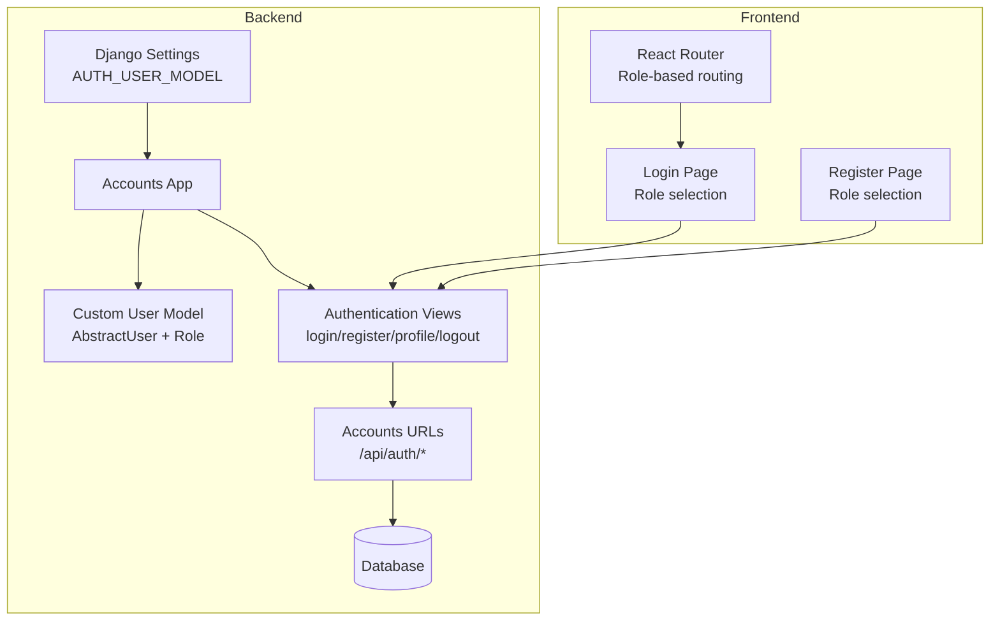
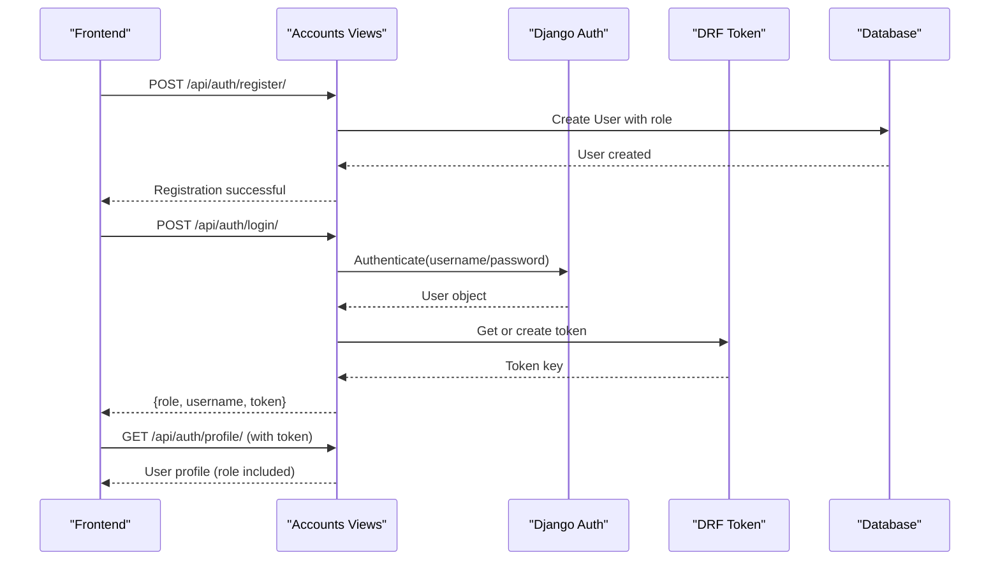
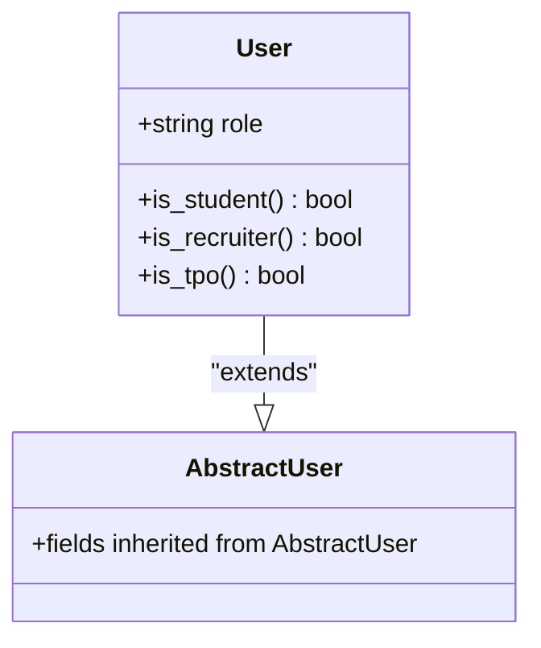
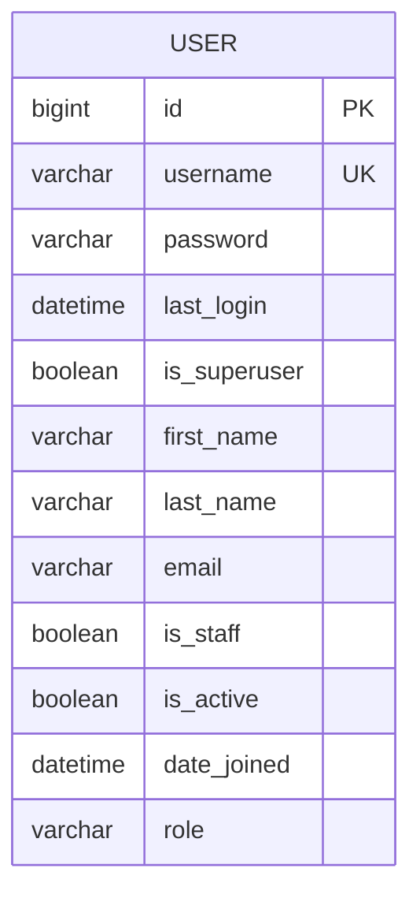
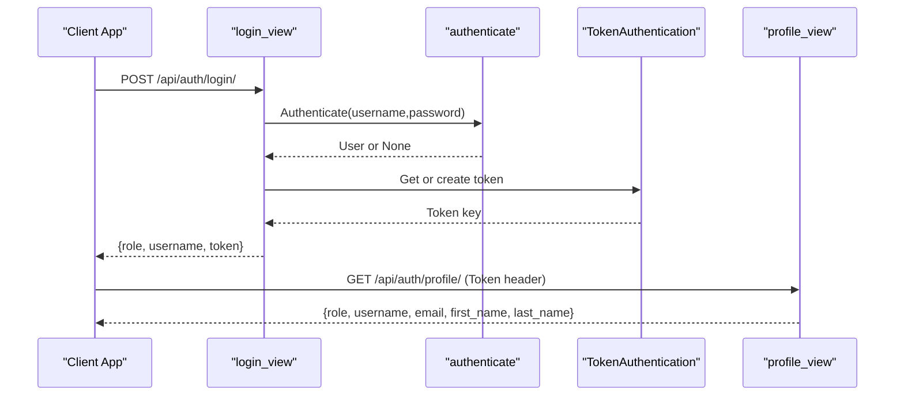
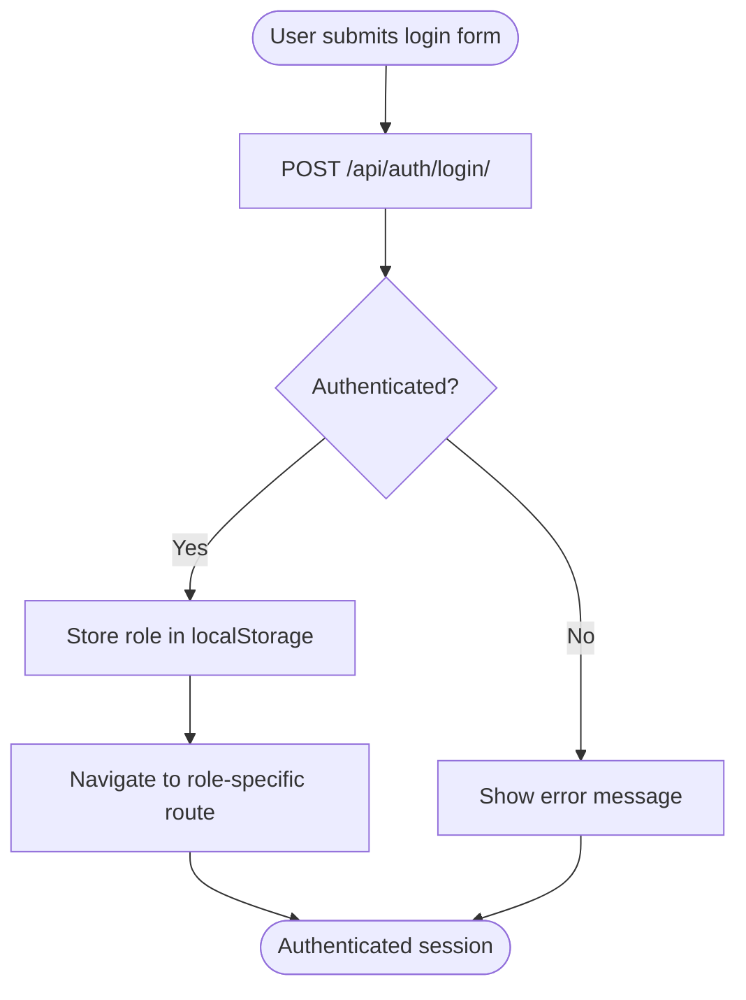
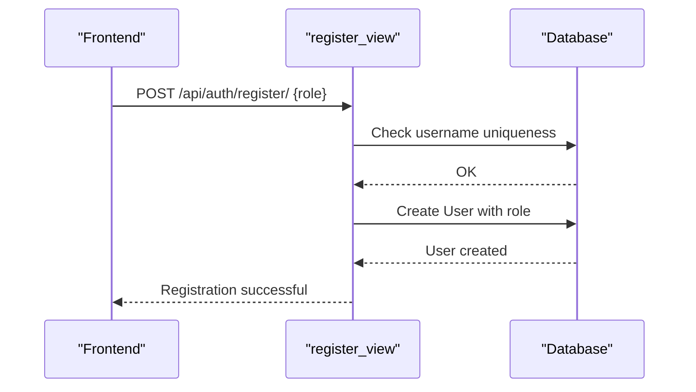
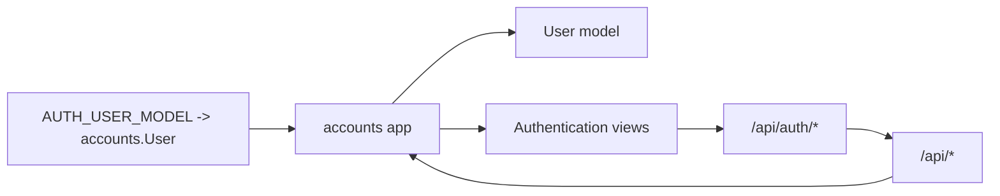

# User Model & Roles

<cite>
**Referenced Files in This Document**
- [models.py](file://backend/accounts/models.py)
- [0001_initial.py](file://backend/accounts/migrations/0001_initial.py)
- [settings.py](file://backend/backend/settings.py)
- [views.py](file://backend/accounts/views.py)
- [urls.py](file://backend/accounts/urls.py)
- [backend urls.py](file://backend/backend/urls.py)
- [Login.jsx](file://frontend/src/Pages/Public/Login.jsx)
- [Register.jsx](file://frontend/src/Pages/Public/Register.jsx)
</cite>

## Table of Contents
1. [Introduction](#introduction)
2. [Project Structure](#project-structure)
3. [Core Components](#core-components)
4. [Architecture Overview](#architecture-overview)
5. [Detailed Component Analysis](#detailed-component-analysis)
6. [Dependency Analysis](#dependency-analysis)
7. [Performance Considerations](#performance-considerations)
8. [Troubleshooting Guide](#troubleshooting-guide)
9. [Conclusion](#conclusion)

## Introduction
This document explains the custom User model implementation in the TPO Portal and its role-based permission system. The project extends Django's built-in user system using AbstractUser to add a role field and helper methods for authorization checks. Three user types are supported: student, recruiter, and TPO admin. The document covers the model definition, database schema, role storage, validation logic, and practical usage patterns for user creation, role assignment, and role-based access control.

## Project Structure
The user model and authentication-related logic are centralized in the accounts app. The backend integrates the custom user model via Django settings, and the frontend interacts with the authentication endpoints to perform login, registration, and role-aware navigation.

**Diagram sources**
- [settings.py:119](file://backend/backend/settings.py#L119)
- [models.py:4-24](file://backend/accounts/models.py#L4-L24)
- [views.py:13-94](file://backend/accounts/views.py#L13-L94)
- [urls.py:4-9](file://backend/accounts/urls.py#L4-L9)
- [backend urls.py:6](file://backend/backend/urls.py#L6)
- [Login.jsx:20-55](file://frontend/src/Pages/Public/Login.jsx#L20-L55)
- [Register.jsx:23-40](file://frontend/src/Pages/Public/Register.jsx#L23-L40)

**Section sources**
- [settings.py:119](file://backend/backend/settings.py#L119)
- [models.py:4-24](file://backend/accounts/models.py#L4-L24)
- [views.py:13-94](file://backend/accounts/views.py#L13-L94)
- [urls.py:4-9](file://backend/accounts/urls.py#L4-L9)
- [backend urls.py:6](file://backend/backend/urls.py#L6)
- [Login.jsx:20-55](file://frontend/src/Pages/Public/Login.jsx#L20-L55)
- [Register.jsx:23-40](file://frontend/src/Pages/Public/Register.jsx#L23-L40)

## Core Components
- Custom User model extending AbstractUser with a role field and helper methods for authorization checks.
- Django settings pointing to the custom user model.
- Authentication endpoints for login, registration, profile retrieval, and logout.
- Frontend pages that collect role during registration and route users after login.

Key implementation references:
- Custom User model and role helpers: [models.py:4-24](file://backend/accounts/models.py#L4-L24)
- AUTH_USER_MODEL setting: [settings.py:119](file://backend/backend/settings.py#L119)
- Authentication endpoints: [views.py:13-94](file://backend/accounts/views.py#L13-L94)
- Accounts URLs: [urls.py:4-9](file://backend/accounts/urls.py#L4-L9)
- Backend integration: [backend urls.py:6](file://backend/backend/urls.py#L6)

**Section sources**
- [models.py:4-24](file://backend/accounts/models.py#L4-L24)
- [settings.py:119](file://backend/backend/settings.py#L119)
- [views.py:13-94](file://backend/accounts/views.py#L13-L94)
- [urls.py:4-9](file://backend/accounts/urls.py#L4-L9)
- [backend urls.py:6](file://backend/backend/urls.py#L6)

## Architecture Overview
The system uses a custom user model with a role field to differentiate user types. Authentication endpoints handle dual-login (username or email), token generation, and role-aware responses. The frontend stores the returned role and navigates users to role-specific dashboards.

**Diagram sources**
- [views.py:48-75](file://backend/accounts/views.py#L48-L75)
- [views.py:13-45](file://backend/accounts/views.py#L13-L45)
- [views.py:78-89](file://backend/accounts/views.py#L78-L89)
- [Register.jsx:23-40](file://frontend/src/Pages/Public/Register.jsx#L23-L40)
- [Login.jsx:20-55](file://frontend/src/Pages/Public/Login.jsx#L20-L55)

## Detailed Component Analysis

### Custom User Model
The User model extends Django’s AbstractUser to add a role field and helper methods for authorization checks. It defines:
- Constants for role identifiers.
- ROLE_CHOICES enumeration for database storage and form validation.
- A CharField role with choices and default value.
- Helper methods is_student, is_recruiter, and is_tpo for role checks.

**Diagram sources**
- [models.py:4-24](file://backend/accounts/models.py#L4-L24)

**Section sources**
- [models.py:4-24](file://backend/accounts/models.py#L4-L24)

### Database Schema and Field Definitions
The initial migration creates the User model with standard AbstractUser fields plus the role field. The role field is a CharField with predefined choices and a default value.

**Diagram sources**
- [0001_initial.py:18-44](file://backend/accounts/migrations/0001_initial.py#L18-L44)

**Section sources**
- [0001_initial.py:18-44](file://backend/accounts/migrations/0001_initial.py#L18-L44)

### Role Validation Logic
The role is validated against ROLE_CHOICES during model creation and updates. The choices restrict values to student, recruiter, or tpo. The helper methods compare the stored role to the constants defined on the model.

Validation references:
- ROLE_CHOICES definition: [models.py:9-13](file://backend/accounts/models.py#L9-L13)
- Role field definition: [models.py:15](file://backend/accounts/models.py#L15)
- Initial migration choices: [0001_initial.py:32](file://backend/accounts/migrations/0001_initial.py#L32)
- Helper methods: [models.py:17-24](file://backend/accounts/models.py#L17-L24)

**Section sources**
- [models.py:9-13](file://backend/accounts/models.py#L9-L13)
- [models.py:15](file://backend/accounts/models.py#L15)
- [0001_initial.py:32](file://backend/accounts/migrations/0001_initial.py#L32)
- [models.py:17-24](file://backend/accounts/models.py#L17-L24)

### Authentication Endpoints and Authorization Flow
The accounts app exposes endpoints for login, registration, profile retrieval, and logout. The login endpoint supports dual-login (username or email), authenticates the user, generates a token, and returns the user’s role. The profile endpoint requires a valid token and returns user details including role.

**Diagram sources**
- [views.py:13-45](file://backend/accounts/views.py#L13-L45)
- [views.py:78-89](file://backend/accounts/views.py#L78-L89)

**Section sources**
- [views.py:13-45](file://backend/accounts/views.py#L13-L45)
- [views.py:78-89](file://backend/accounts/views.py#L78-L89)

### Role-Based Access Patterns
After login, the frontend stores the returned role and navigates users to role-specific dashboards. The frontend collects role during registration and sends it to the backend. The backend enforces role-aware routing by responding with the user’s role upon successful login.

**Diagram sources**
- [Login.jsx:20-55](file://frontend/src/Pages/Public/Login.jsx#L20-L55)
- [Register.jsx:23-40](file://frontend/src/Pages/Public/Register.jsx#L23-L40)
- [views.py:13-45](file://backend/accounts/views.py#L13-L45)

**Section sources**
- [Login.jsx:20-55](file://frontend/src/Pages/Public/Login.jsx#L20-L55)
- [Register.jsx:23-40](file://frontend/src/Pages/Public/Register.jsx#L23-L40)
- [views.py:13-45](file://backend/accounts/views.py#L13-L45)

### User Creation and Role Assignment
Users are created via the registration endpoint. The endpoint accepts user details and role, validates uniqueness, and creates a user with the specified role using Django’s create_user manager method.

**Diagram sources**
- [views.py:48-75](file://backend/accounts/views.py#L48-L75)
- [Register.jsx:23-40](file://frontend/src/Pages/Public/Register.jsx#L23-L40)

**Section sources**
- [views.py:48-75](file://backend/accounts/views.py#L48-L75)
- [Register.jsx:23-40](file://frontend/src/Pages/Public/Register.jsx#L23-L40)

## Dependency Analysis
The system depends on Django’s built-in authentication and the custom user model. The accounts app integrates with the backend URLs under /api/auth/, and the frontend consumes these endpoints.

**Diagram sources**
- [settings.py:119](file://backend/backend/settings.py#L119)
- [backend urls.py:6](file://backend/backend/urls.py#L6)
- [urls.py:4-9](file://backend/accounts/urls.py#L4-L9)

**Section sources**
- [settings.py:119](file://backend/backend/settings.py#L119)
- [backend urls.py:6](file://backend/backend/urls.py#L6)
- [urls.py:4-9](file://backend/accounts/urls.py#L4-L9)

## Performance Considerations
- Role checks are constant-time string comparisons against stored role values.
- Using choices ensures minimal storage overhead and efficient indexing.
- Token-based authentication avoids repeated password verification for protected endpoints.

## Troubleshooting Guide
Common issues and resolutions:
- Invalid role value: Ensure the role is one of the allowed values from ROLE_CHOICES.
- Username conflicts: The registration endpoint checks for existing usernames before creating a user.
- Authentication failures: The login endpoint supports dual-login (username or email) and returns standardized error messages.
- Token errors: Protected endpoints require a valid token; missing or invalid tokens result in unauthorized responses.

**Section sources**
- [models.py:9-13](file://backend/accounts/models.py#L9-L13)
- [views.py:60-61](file://backend/accounts/views.py#L60-L61)
- [views.py:42-43](file://backend/accounts/views.py#L42-L43)
- [views.py:80-81](file://backend/accounts/views.py#L80-L81)

## Conclusion
The TPO Portal’s custom User model extends Django’s AbstractUser to support role-based access control with three user types: student, recruiter, and TPO admin. The model defines a role field with validated choices and helper methods for authorization checks. Authentication endpoints integrate with token-based authentication and return the user’s role to enable role-aware routing in the frontend. This design provides a clean, extensible foundation for managing user roles and access patterns.