# Admin Endpoints

<cite>
**Referenced Files in This Document**
- [backend/tpo_admin/views.py](file://backend/tpo_admin/views.py)
- [backend/tpo_admin/urls.py](file://backend/tpo_admin/urls.py)
- [backend/accounts/views.py](file://backend/accounts/views.py)
- [backend/accounts/models.py](file://backend/accounts/models.py)
- [backend/backend/urls.py](file://backend/backend/urls.py)
- [frontend/src/App.jsx](file://frontend/src/App.jsx)
- [frontend/src/Pages/Public/Login.jsx](file://frontend/src/Pages/Public/Login.jsx)
- [frontend/src/Pages/TPOAdmin/Manage.jsx](file://frontend/src/Pages/TPOAdmin/Manage.jsx)
- [frontend/src/Pages/TPOAdmin/Approve.jsx](file://frontend/src/Pages/TPOAdmin/Approve.jsx)
- [frontend/src/Pages/TPOAdmin/Analytics.jsx](file://frontend/src/Pages/TPOAdmin/Analytics.jsx)
</cite>

## Table of Contents
1. [Introduction](#introduction)
2. [Project Structure](#project-structure)
3. [Core Components](#core-components)
4. [Architecture Overview](#architecture-overview)
5. [Detailed Component Analysis](#detailed-component-analysis)
6. [Dependency Analysis](#dependency-analysis)
7. [Performance Considerations](#performance-considerations)
8. [Troubleshooting Guide](#troubleshooting-guide)
9. [Conclusion](#conclusion)

## Introduction
This document provides comprehensive API documentation for administrative endpoints in the TPO portal. It covers:
- Company management endpoints for approving, modifying, and monitoring registered companies
- Drive approval endpoints for reviewing and approving campus drive schedules with timing coordination
- Analytics endpoints for generating placement statistics, company performance reports, and student placement metrics
- User management endpoints for administrative user operations and system monitoring
- Reporting endpoints for comprehensive analytics dashboards and data export capabilities

Administrative access is role-based, with TPO Admin users granted elevated permissions. Authentication is handled via token-based authentication, and the frontend integrates with the backend to route TPO users to admin dashboards.

## Project Structure
The administrative endpoints are exposed under the /api/admin/ namespace and are composed of:
- URL routing that maps admin endpoints to views
- Views that currently return placeholder responses
- Token-authenticated account endpoints for login, registration, profile retrieval, and logout
- Frontend routes that render admin dashboards for managing companies, approving drives, and viewing analytics

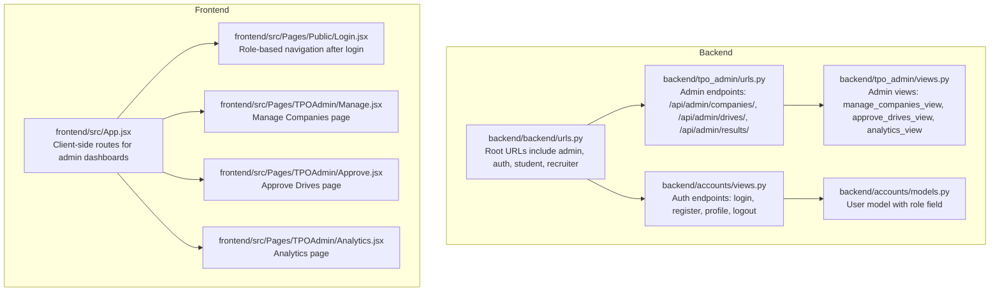

**Diagram sources**
- [backend/backend/urls.py:1-11](file://backend/backend/urls.py#L1-L11)
- [backend/tpo_admin/urls.py:1-9](file://backend/tpo_admin/urls.py#L1-L9)
- [backend/tpo_admin/views.py:1-11](file://backend/tpo_admin/views.py#L1-L11)
- [backend/accounts/views.py:1-95](file://backend/accounts/views.py#L1-L95)
- [backend/accounts/models.py:1-25](file://backend/accounts/models.py#L1-L25)
- [frontend/src/App.jsx:1-55](file://frontend/src/App.jsx#L1-L55)
- [frontend/src/Pages/Public/Login.jsx:37-71](file://frontend/src/Pages/Public/Login.jsx#L37-L71)
- [frontend/src/Pages/TPOAdmin/Manage.jsx:1-11](file://frontend/src/Pages/TPOAdmin/Manage.jsx#L1-L11)
- [frontend/src/Pages/TPOAdmin/Approve.jsx:1-11](file://frontend/src/Pages/TPOAdmin/Approve.jsx#L1-L11)
- [frontend/src/Pages/TPOAdmin/Analytics.jsx:1-15](file://frontend/src/Pages/TPOAdmin/Analytics.jsx#L1-L15)

**Section sources**
- [backend/backend/urls.py:1-11](file://backend/backend/urls.py#L1-L11)
- [backend/tpo_admin/urls.py:1-9](file://backend/tpo_admin/urls.py#L1-L9)
- [backend/tpo_admin/views.py:1-11](file://backend/tpo_admin/views.py#L1-L11)
- [backend/accounts/views.py:1-95](file://backend/accounts/views.py#L1-L95)
- [backend/accounts/models.py:1-25](file://backend/accounts/models.py#L1-L25)
- [frontend/src/App.jsx:1-55](file://frontend/src/App.jsx#L1-L55)
- [frontend/src/Pages/Public/Login.jsx:37-71](file://frontend/src/Pages/Public/Login.jsx#L37-L71)
- [frontend/src/Pages/TPOAdmin/Manage.jsx:1-11](file://frontend/src/Pages/TPOAdmin/Manage.jsx#L1-L11)
- [frontend/src/Pages/TPOAdmin/Approve.jsx:1-11](file://frontend/src/Pages/TPOAdmin/Approve.jsx#L1-L11)
- [frontend/src/Pages/TPOAdmin/Analytics.jsx:1-15](file://frontend/src/Pages/TPOAdmin/Analytics.jsx#L1-L15)

## Core Components
- Admin endpoints
  - GET /api/admin/companies/
  - GET /api/admin/drives/
  - GET /api/admin/results/
- Authentication and user management
  - POST /api/auth/login/
  - POST /api/auth/register/
  - GET /api/auth/profile/ (token-protected)
  - POST /api/auth/logout/

These endpoints form the backbone of administrative operations, enabling TPO administrators to oversee company registrations, review and approve campus drives, generate analytics, and manage users.

**Section sources**
- [backend/tpo_admin/urls.py:4-8](file://backend/tpo_admin/urls.py#L4-L8)
- [backend/tpo_admin/views.py:3-10](file://backend/tpo_admin/views.py#L3-L10)
- [backend/accounts/views.py:13-94](file://backend/accounts/views.py#L13-L94)

## Architecture Overview
The admin architecture follows a layered design:
- URL routing exposes admin endpoints under /api/admin/
- Views handle requests and return JSON responses
- Token-based authentication secures sensitive endpoints
- Frontend routes render admin dashboards and integrate with backend APIs

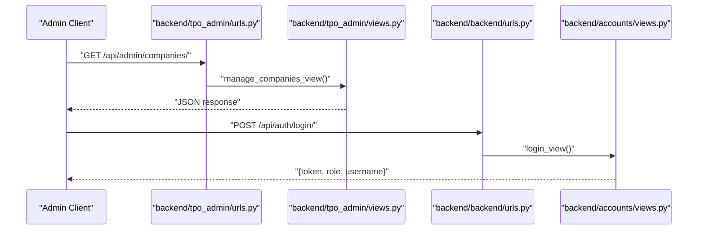

**Diagram sources**
- [backend/tpo_admin/urls.py:4-8](file://backend/tpo_admin/urls.py#L4-L8)
- [backend/tpo_admin/views.py:3-4](file://backend/tpo_admin/views.py#L3-L4)
- [backend/backend/urls.py:6-9](file://backend/backend/urls.py#L6-L9)
- [backend/accounts/views.py:13-45](file://backend/accounts/views.py#L13-L45)

**Section sources**
- [backend/tpo_admin/urls.py:4-8](file://backend/tpo_admin/urls.py#L4-L8)
- [backend/tpo_admin/views.py:3-10](file://backend/tpo_admin/views.py#L3-L10)
- [backend/backend/urls.py:4-10](file://backend/backend/urls.py#L4-L10)
- [backend/accounts/views.py:13-94](file://backend/accounts/views.py#L13-L94)

## Detailed Component Analysis

### Admin Endpoints

#### GET /api/admin/companies/
- Purpose: Retrieve a list of companies registered in the system for administrative oversight
- Authentication: Token required (via Authorization header)
- Request headers:
  - Authorization: Token <your_token>
- Response:
  - 200 OK: JSON payload with a message indicating the list of companies
- Practical example:
  - curl -H "Authorization: Token <your_token>" https://example.com/api/admin/companies/

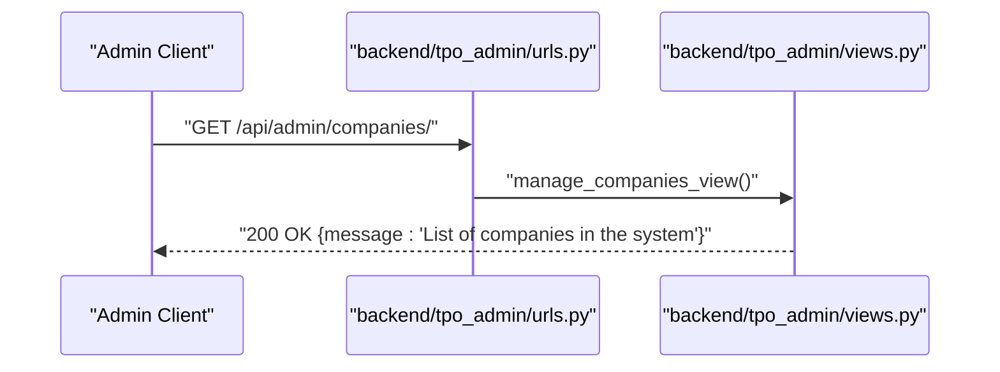

**Diagram sources**
- [backend/tpo_admin/urls.py:5](file://backend/tpo_admin/urls.py#L5)
- [backend/tpo_admin/views.py:3-4](file://backend/tpo_admin/views.py#L3-L4)

**Section sources**
- [backend/tpo_admin/urls.py:5](file://backend/tpo_admin/urls.py#L5)
- [backend/tpo_admin/views.py:3-4](file://backend/tpo_admin/views.py#L3-L4)

#### GET /api/admin/drives/
- Purpose: Retrieve a list of placement drives pending approval for scheduling and timing coordination
- Authentication: Token required (via Authorization header)
- Request headers:
  - Authorization: Token <your_token>
- Response:
  - 200 OK: JSON payload with a message indicating the list of drives pending approval
- Practical example:
  - curl -H "Authorization: Token <your_token>" https://example.com/api/admin/drives/

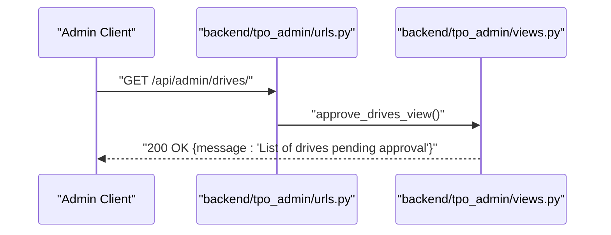

**Diagram sources**
- [backend/tpo_admin/urls.py:6](file://backend/tpo_admin/urls.py#L6)
- [backend/tpo_admin/views.py:6-7](file://backend/tpo_admin/views.py#L6-L7)

**Section sources**
- [backend/tpo_admin/urls.py:6](file://backend/tpo_admin/urls.py#L6)
- [backend/tpo_admin/views.py:6-7](file://backend/tpo_admin/views.py#L6-L7)

#### GET /api/admin/results/
- Purpose: Retrieve placement analytics and results for generating reports and dashboards
- Authentication: Token required (via Authorization header)
- Request headers:
  - Authorization: Token <your_token>
- Response:
  - 200 OK: JSON payload with a message indicating placement analytics and results
- Practical example:
  - curl -H "Authorization: Token <your_token>" https://example.com/api/admin/results/

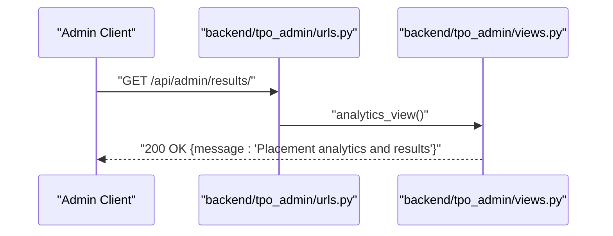

**Diagram sources**
- [backend/tpo_admin/urls.py:7](file://backend/tpo_admin/urls.py#L7)
- [backend/tpo_admin/views.py:9-10](file://backend/tpo_admin/views.py#L9-L10)

**Section sources**
- [backend/tpo_admin/urls.py:7](file://backend/tpo_admin/urls.py#L7)
- [backend/tpo_admin/views.py:9-10](file://backend/tpo_admin/views.py#L9-L10)

### Authentication and User Management Endpoints

#### POST /api/auth/login/
- Purpose: Authenticate users and issue a token for subsequent admin requests
- Authentication: No authentication required
- Request body:
  - username or email (string)
  - password (string)
- Response:
  - 200 OK: {message, role, username, token}
  - 401 Unauthorized: {message: "Invalid credentials"}
  - 400 Bad Request: {message: "Invalid JSON"}
  - 405 Method Not Allowed: {message: "Login endpoint allows POST only"}
- Practical example:
  - curl -X POST https://example.com/api/auth/login/ -H "Content-Type: application/json" -d '{"username":"admin","password":"secure"}'

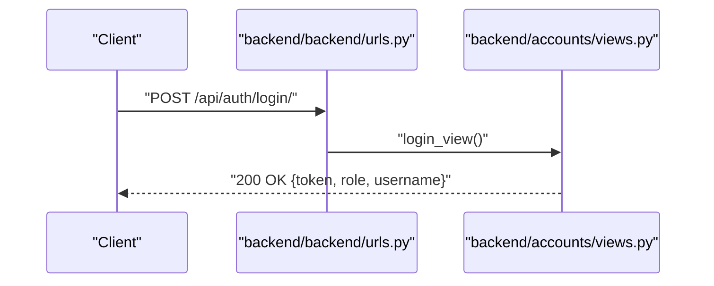

**Diagram sources**
- [backend/backend/urls.py:6](file://backend/backend/urls.py#L6)
- [backend/accounts/views.py:13-45](file://backend/accounts/views.py#L13-L45)

**Section sources**
- [backend/backend/urls.py:6](file://backend/backend/urls.py#L6)
- [backend/accounts/views.py:13-45](file://backend/accounts/views.py#L13-L45)

#### POST /api/auth/register/
- Purpose: Register new users (students, recruiters, TPO admins)
- Authentication: No authentication required
- Request body:
  - first_name (string)
  - last_name (string)
  - username (string)
  - password (string)
  - email (string)
  - role (string): "student", "recruiter", or "tpo"
- Response:
  - 201 Created: {message: "Registration successful"}
  - 400 Bad Request: {message: "Username already taken"} or error details
  - 405 Method Not Allowed: {message: "Register endpoint allows POST only"}
- Practical example:
  - curl -X POST https://example.com/api/auth/register/ -H "Content-Type: application/json" -d '{"first_name":"John","last_name":"Doe","username":"johndoe","password":"pass","email":"john@example.com","role":"tpo"}'

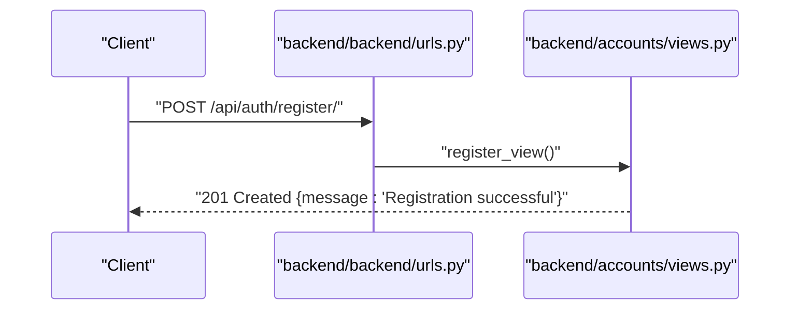

**Diagram sources**
- [backend/backend/urls.py:6](file://backend/backend/urls.py#L6)
- [backend/accounts/views.py:48-75](file://backend/accounts/views.py#L48-L75)

**Section sources**
- [backend/backend/urls.py:6](file://backend/backend/urls.py#L6)
- [backend/accounts/views.py:48-75](file://backend/accounts/views.py#L48-L75)

#### GET /api/auth/profile/ (Token-Protected)
- Purpose: Retrieve current user profile details
- Authentication: Token required (via Authorization header)
- Request headers:
  - Authorization: Token <your_token>
- Response:
  - 200 OK: {first_name, last_name, username, email, role}
  - 401 Unauthorized: DRF returns 401 automatically if no valid token is provided
- Practical example:
  - curl -H "Authorization: Token <your_token>" https://example.com/api/auth/profile/

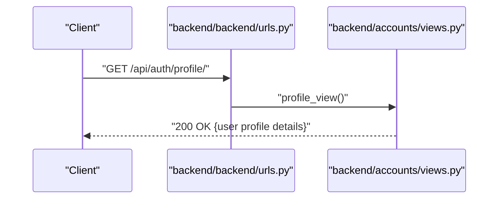

**Diagram sources**
- [backend/backend/urls.py:6](file://backend/backend/urls.py#L6)
- [backend/accounts/views.py:78-89](file://backend/accounts/views.py#L78-L89)

**Section sources**
- [backend/backend/urls.py:6](file://backend/backend/urls.py#L6)
- [backend/accounts/views.py:78-89](file://backend/accounts/views.py#L78-L89)

#### POST /api/auth/logout/
- Purpose: Log out the current user session
- Authentication: No authentication required
- Response:
  - 200 OK: {message: "Logged out successfully"}
- Practical example:
  - curl -X POST https://example.com/api/auth/logout/

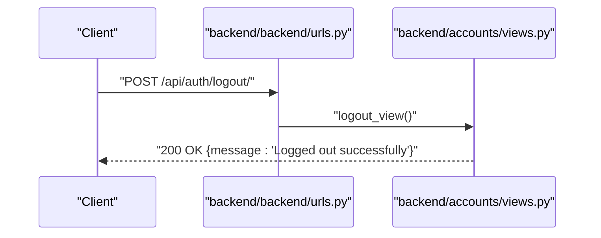

**Diagram sources**
- [backend/backend/urls.py:6](file://backend/backend/urls.py#L6)
- [backend/accounts/views.py:92-94](file://backend/accounts/views.py#L92-L94)

**Section sources**
- [backend/backend/urls.py:6](file://backend/backend/urls.py#L6)
- [backend/accounts/views.py:92-94](file://backend/accounts/views.py#L92-L94)

### Administrative Authentication Requirements
- Role-based access control:
  - TPO Admin users are identified by role "tpo" in the User model
  - Frontend navigates TPO users to admin dashboards after login
- Token-based authentication:
  - All admin endpoints require a valid token passed in the Authorization header
  - Tokens are issued upon successful login and can be used for subsequent admin requests

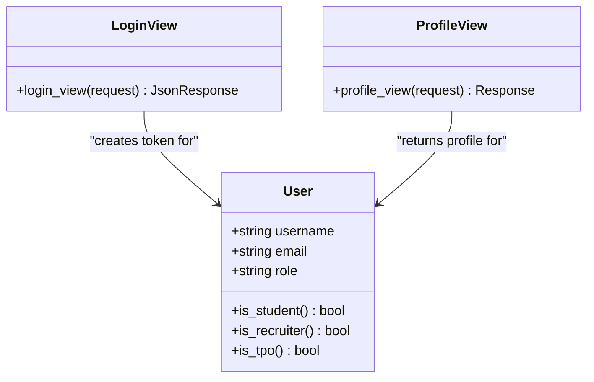

**Diagram sources**
- [backend/accounts/models.py:4-25](file://backend/accounts/models.py#L4-L25)
- [backend/accounts/views.py:13-89](file://backend/accounts/views.py#L13-L89)

**Section sources**
- [backend/accounts/models.py:4-25](file://backend/accounts/models.py#L4-L25)
- [backend/accounts/views.py:13-89](file://backend/accounts/views.py#L13-L89)
- [frontend/src/Pages/Public/Login.jsx:37-71](file://frontend/src/Pages/Public/Login.jsx#L37-L71)

### Frontend Integration for Admin Dashboards
- Client-side routing:
  - Admin routes are defined in the frontend router and render dedicated pages for managing companies, approving drives, and viewing analytics
- Navigation after login:
  - On successful login, the frontend redirects users based on role, sending TPO users to the analytics dashboard

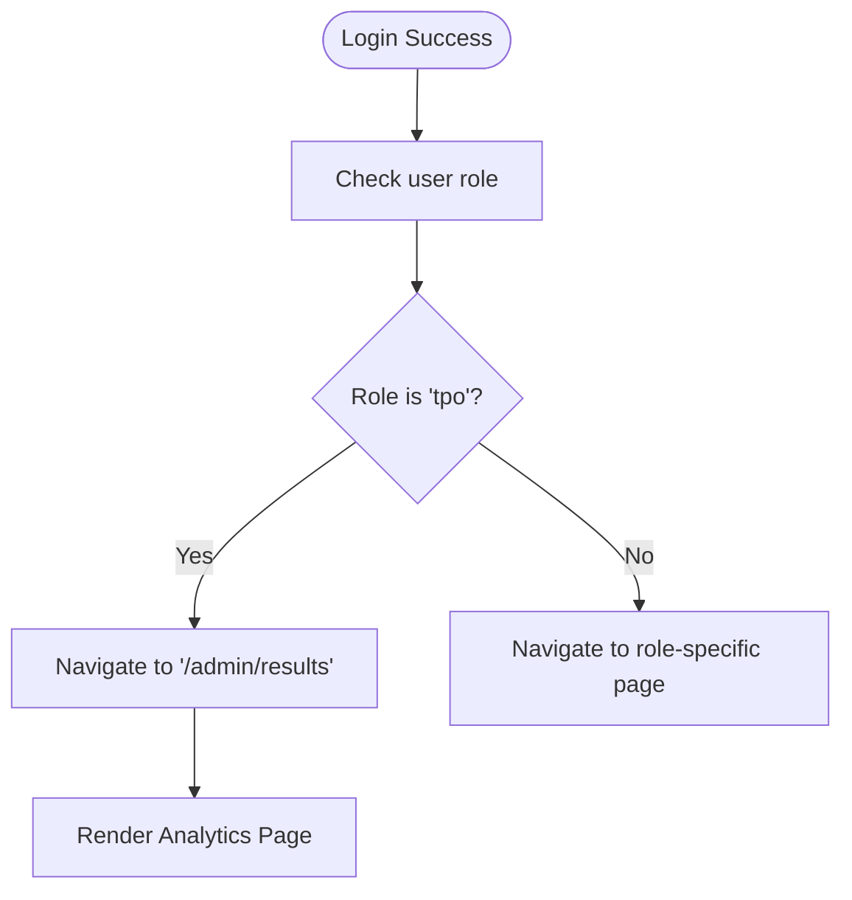

**Diagram sources**
- [frontend/src/Pages/Public/Login.jsx:37-71](file://frontend/src/Pages/Public/Login.jsx#L37-L71)
- [frontend/src/App.jsx:45-48](file://frontend/src/App.jsx#L45-L48)
- [frontend/src/Pages/TPOAdmin/Analytics.jsx:1-15](file://frontend/src/Pages/TPOAdmin/Analytics.jsx#L1-L15)

**Section sources**
- [frontend/src/App.jsx:45-48](file://frontend/src/App.jsx#L45-L48)
- [frontend/src/Pages/Public/Login.jsx:37-71](file://frontend/src/Pages/Public/Login.jsx#L37-L71)
- [frontend/src/Pages/TPOAdmin/Manage.jsx:1-11](file://frontend/src/Pages/TPOAdmin/Manage.jsx#L1-L11)
- [frontend/src/Pages/TPOAdmin/Approve.jsx:1-11](file://frontend/src/Pages/TPOAdmin/Approve.jsx#L1-L11)
- [frontend/src/Pages/TPOAdmin/Analytics.jsx:1-15](file://frontend/src/Pages/TPOAdmin/Analytics.jsx#L1-L15)

## Dependency Analysis
- URL composition:
  - Root URLs include admin, auth, student, and recruiter namespaces
  - Admin endpoints are grouped under /api/admin/
- View-to-model relationships:
  - Authentication endpoints rely on the User model for role and token management
- Frontend-backend coupling:
  - Admin dashboards depend on backend endpoints for data and actions
  - Role-based navigation ensures TPO users reach admin pages seamlessly

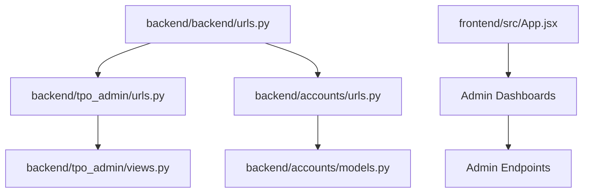

**Diagram sources**
- [backend/backend/urls.py:4-10](file://backend/backend/urls.py#L4-L10)
- [backend/tpo_admin/urls.py:1-9](file://backend/tpo_admin/urls.py#L1-L9)
- [backend/accounts/views.py:1-95](file://backend/accounts/views.py#L1-L95)
- [backend/accounts/models.py:1-25](file://backend/accounts/models.py#L1-L25)
- [frontend/src/App.jsx:1-55](file://frontend/src/App.jsx#L1-L55)

**Section sources**
- [backend/backend/urls.py:4-10](file://backend/backend/urls.py#L4-L10)
- [backend/tpo_admin/urls.py:1-9](file://backend/tpo_admin/urls.py#L1-L9)
- [backend/accounts/views.py:1-95](file://backend/accounts/views.py#L1-L95)
- [backend/accounts/models.py:1-25](file://backend/accounts/models.py#L1-L25)
- [frontend/src/App.jsx:1-55](file://frontend/src/App.jsx#L1-L55)

## Performance Considerations
- Token-based authentication reduces database load by avoiding repeated credential checks for protected endpoints
- Placeholder responses in admin views indicate room for optimization; future implementations should paginate lists and cache frequently accessed analytics data
- Minimizing frontend re-renders by leveraging efficient state management can improve dashboard responsiveness

## Troubleshooting Guide
- Authentication failures:
  - Ensure the Authorization header includes a valid token for admin endpoints
  - Verify the token was issued during login and has not expired
- Role redirection issues:
  - Confirm the user role stored in the backend matches "tpo" for TPO Admin access
  - Check frontend navigation logic to ensure TPO users are routed to admin dashboards
- Endpoint errors:
  - For login/register, confirm the request method and JSON payload format
  - For profile, ensure the token is present and correctly formatted

**Section sources**
- [backend/accounts/views.py:13-94](file://backend/accounts/views.py#L13-L94)
- [frontend/src/Pages/Public/Login.jsx:37-71](file://frontend/src/Pages/Public/Login.jsx#L37-L71)

## Conclusion
The administrative endpoints provide a foundation for TPO oversight of company registrations, drive approvals, and analytics generation. By integrating token-based authentication and role-aware navigation, the system supports secure and efficient administrative workflows. Future enhancements should focus on implementing robust data retrieval, pagination, caching, and comprehensive analytics exports to meet the needs of TPO administrators and placement officers.