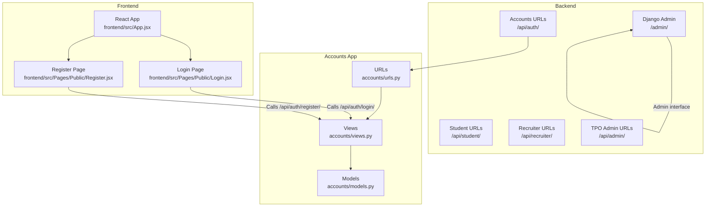
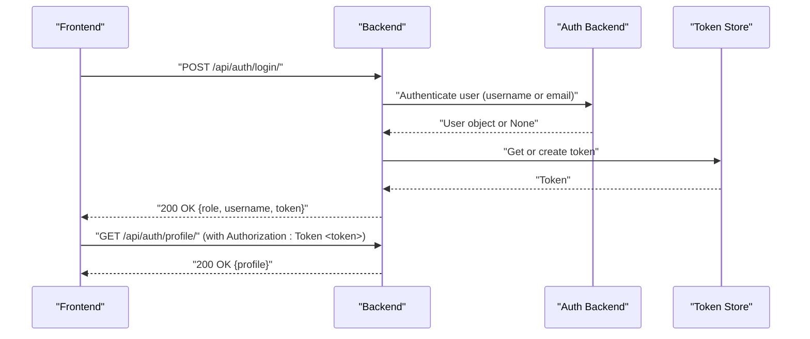
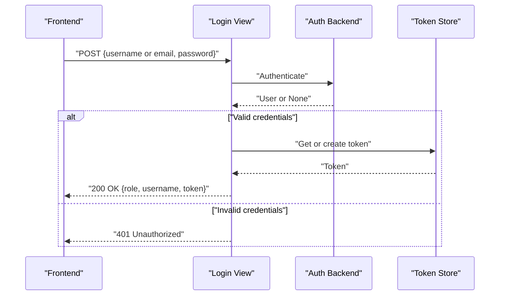
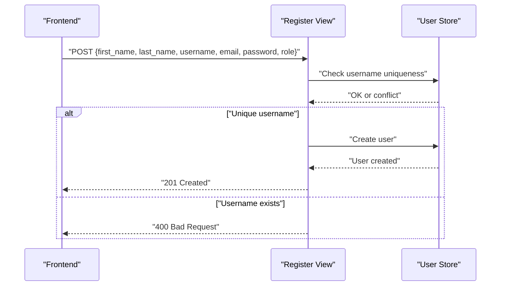
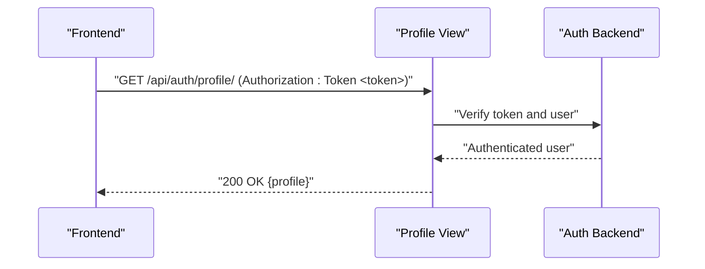
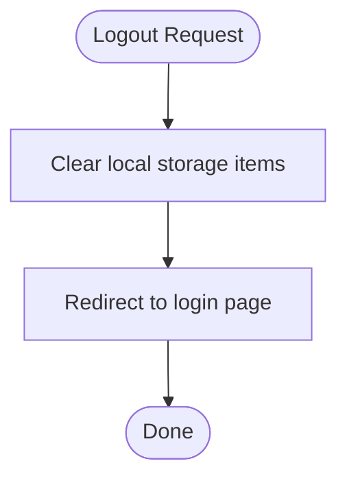
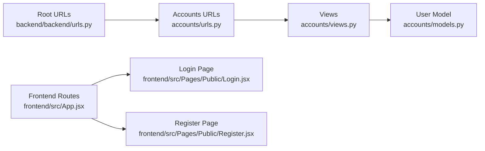

# Authentication Endpoints

<cite>
**Referenced Files in This Document**
- [backend/accounts/views.py](file://backend/accounts/views.py)
- [backend/accounts/urls.py](file://backend/accounts/urls.py)
- [backend/backend/urls.py](file://backend/backend/urls.py)
- [backend/accounts/models.py](file://backend/accounts/models.py)
- [frontend/src/Pages/Public/Login.jsx](file://frontend/src/Pages/Public/Login.jsx)
- [frontend/src/Pages/Public/Register.jsx](file://frontend/src/Pages/Public/Register.jsx)
- [frontend/src/App.jsx](file://frontend/src/App.jsx)
</cite>

## Table of Contents
1. [Introduction](#introduction)
2. [Project Structure](#project-structure)
3. [Core Components](#core-components)
4. [Architecture Overview](#architecture-overview)
5. [Detailed Component Analysis](#detailed-component-analysis)
6. [Dependency Analysis](#dependency-analysis)
7. [Performance Considerations](#performance-considerations)
8. [Troubleshooting Guide](#troubleshooting-guide)
9. [Conclusion](#conclusion)
10. [Appendices](#appendices)

## Introduction
This document provides comprehensive API documentation for the authentication endpoints used by the portal. It covers the login, registration, profile retrieval, and logout flows. It also documents request/response schemas, HTTP methods, authentication headers, error codes, and security considerations. Practical integration examples for frontend applications are included to help developers implement robust authentication flows.

## Project Structure
The authentication endpoints are implemented in the Django backend under the accounts app and exposed via Django URLs. The frontend integrates with these endpoints using React and client-side routing.

**Diagram sources**
- [backend/backend/urls.py:1-11](file://backend/backend/urls.py#L1-L11)
- [backend/accounts/urls.py:1-10](file://backend/accounts/urls.py#L1-L10)
- [backend/accounts/views.py:1-95](file://backend/accounts/views.py#L1-L95)
- [backend/accounts/models.py:1-25](file://backend/accounts/models.py#L1-L25)
- [frontend/src/App.jsx:1-55](file://frontend/src/App.jsx#L1-L55)
- [frontend/src/Pages/Public/Login.jsx:1-160](file://frontend/src/Pages/Public/Login.jsx#L1-L160)
- [frontend/src/Pages/Public/Register.jsx:1-172](file://frontend/src/Pages/Public/Register.jsx#L1-L172)

**Section sources**
- [backend/backend/urls.py:1-11](file://backend/backend/urls.py#L1-L11)
- [backend/accounts/urls.py:1-10](file://backend/accounts/urls.py#L1-L10)
- [frontend/src/App.jsx:1-55](file://frontend/src/App.jsx#L1-L55)

## Core Components
- Authentication Views
  - Login: Accepts username or email and password, performs dual-login resolution, authenticates the user, creates or retrieves a token, and returns user role, username, and token.
  - Registration: Creates a new user with provided personal details, role, and credentials.
  - Profile: Returns the authenticated user’s profile using token authentication.
  - Logout: Logs out the current session.
- URL Routing
  - Exposes endpoints under /api/auth/.
- User Model
  - Extends AbstractUser with role choices and convenience methods.

**Section sources**
- [backend/accounts/views.py:1-95](file://backend/accounts/views.py#L1-L95)
- [backend/accounts/urls.py:1-10](file://backend/accounts/urls.py#L1-L10)
- [backend/accounts/models.py:1-25](file://backend/accounts/models.py#L1-L25)

## Architecture Overview
The authentication flow spans the frontend and backend. The frontend sends HTTP requests to the backend endpoints, which use Django’s authentication and REST framework token mechanisms to manage sessions and tokens.

**Diagram sources**
- [backend/accounts/views.py:13-45](file://backend/accounts/views.py#L13-L45)
- [backend/accounts/views.py:78-89](file://backend/accounts/views.py#L78-L89)
- [backend/accounts/urls.py:1-10](file://backend/accounts/urls.py#L1-L10)

## Detailed Component Analysis

### Login Endpoint
- Path: /api/auth/login/
- Method: POST
- Purpose: Authenticate a user with username or email and password, returning a token and user role.
- Request Body
  - username: string (alternative to email)
  - email: string (alternative to username)
  - password: string
  - Note: Either username or email must be provided; both are accepted.
- Response Body (Success)
  - message: string
  - role: string (one of student, recruiter, tpo)
  - username: string
  - token: string
- Response Body (Errors)
  - message: string
- Status Codes
  - 200 OK: Successful login
  - 400 Bad Request: Invalid JSON or missing fields
  - 401 Unauthorized: Invalid credentials
  - 405 Method Not Allowed: Non-POST requests
- Security Notes
  - Accepts either username or email for convenience; email is normalized to username internally for authentication.
  - Token is created or reused per user.
- Frontend Integration
  - Sends credentials and stores token and role in local storage.
  - Uses Authorization header for subsequent protected requests.

**Diagram sources**
- [backend/accounts/views.py:13-45](file://backend/accounts/views.py#L13-L45)
- [frontend/src/Pages/Public/Login.jsx:17-55](file://frontend/src/Pages/Public/Login.jsx#L17-L55)

**Section sources**
- [backend/accounts/views.py:13-45](file://backend/accounts/views.py#L13-L45)
- [frontend/src/Pages/Public/Login.jsx:17-55](file://frontend/src/Pages/Public/Login.jsx#L17-L55)

### Registration Endpoint
- Path: /api/auth/register/
- Method: POST
- Purpose: Create a new user with provided details and role.
- Request Body
  - first_name: string
  - last_name: string
  - username: string
  - email: string
  - password: string
  - role: string (default student; allowed values include student, recruiter, tpo)
- Response Body (Success)
  - message: string
- Response Body (Errors)
  - message: string
- Status Codes
  - 201 Created: Successful registration
  - 400 Bad Request: Username taken or validation errors
  - 405 Method Not Allowed: Non-POST requests
- Security Notes
  - Role defaults to student if not provided.
  - Username uniqueness is enforced.
- Frontend Integration
  - Collects form fields and submits to the endpoint; navigates to login on success.

**Diagram sources**
- [backend/accounts/views.py:48-75](file://backend/accounts/views.py#L48-L75)
- [frontend/src/Pages/Public/Register.jsx:20-40](file://frontend/src/Pages/Public/Register.jsx#L20-L40)

**Section sources**
- [backend/accounts/views.py:48-75](file://backend/accounts/views.py#L48-L75)
- [frontend/src/Pages/Public/Register.jsx:20-40](file://frontend/src/Pages/Public/Register.jsx#L20-L40)

### Profile Endpoint
- Path: /api/auth/profile/
- Method: GET
- Purpose: Retrieve authenticated user’s profile.
- Authentication
  - Requires a valid DRF token via Authorization header: Token <token>.
- Response Body
  - first_name: string
  - last_name: string
  - username: string
  - email: string
  - role: string
- Status Codes
  - 200 OK: Profile returned
  - 401 Unauthorized: Missing or invalid token
- Security Notes
  - Protected by DRF TokenAuthentication and IsAuthenticated.
- Frontend Integration
  - Used after login to fetch full profile and store it locally.

**Diagram sources**
- [backend/accounts/views.py:78-89](file://backend/accounts/views.py#L78-L89)
- [frontend/src/Pages/Public/Login.jsx:37-44](file://frontend/src/Pages/Public/Login.jsx#L37-L44)

**Section sources**
- [backend/accounts/views.py:78-89](file://backend/accounts/views.py#L78-L89)
- [frontend/src/Pages/Public/Login.jsx:37-44](file://frontend/src/Pages/Public/Login.jsx#L37-L44)

### Logout Endpoint
- Path: /api/auth/logout/
- Method: GET (as implemented)
- Purpose: Invalidate the current session.
- Notes
  - The backend clears the session; no token revocation is performed server-side.
- Frontend Integration
  - Clears local storage items related to authentication and redirects to login.

**Diagram sources**
- [backend/accounts/views.py:92-94](file://backend/accounts/views.py#L92-L94)
- [frontend/src/Pages/Public/Login.jsx:17-55](file://frontend/src/Pages/Public/Login.jsx#L17-L55)

**Section sources**
- [backend/accounts/views.py:92-94](file://backend/accounts/views.py#L92-L94)
- [frontend/src/Pages/Public/Login.jsx:17-55](file://frontend/src/Pages/Public/Login.jsx#L17-L55)

## Dependency Analysis
- Backend URL Composition
  - Root URL patterns include /api/auth/, which routes to accounts/urls.py.
- Accounts URL Mapping
  - /api/auth/login/, /api/auth/register/, /api/auth/profile/, /api/auth/logout/ map to views.
- View Dependencies
  - Views rely on Django authentication, REST framework token model, and the custom User model.
- Frontend Routing
  - React routes define public pages and navigation; authentication state is managed by storing tokens and roles in local storage.

**Diagram sources**
- [backend/backend/urls.py:1-11](file://backend/backend/urls.py#L1-L11)
- [backend/accounts/urls.py:1-10](file://backend/accounts/urls.py#L1-L10)
- [backend/accounts/views.py:1-95](file://backend/accounts/views.py#L1-L95)
- [backend/accounts/models.py:1-25](file://backend/accounts/models.py#L1-L25)
- [frontend/src/App.jsx:1-55](file://frontend/src/App.jsx#L1-L55)
- [frontend/src/Pages/Public/Login.jsx:1-160](file://frontend/src/Pages/Public/Login.jsx#L1-L160)
- [frontend/src/Pages/Public/Register.jsx:1-172](file://frontend/src/Pages/Public/Register.jsx#L1-L172)

**Section sources**
- [backend/backend/urls.py:1-11](file://backend/backend/urls.py#L1-L11)
- [backend/accounts/urls.py:1-10](file://backend/accounts/urls.py#L1-L10)
- [frontend/src/App.jsx:1-55](file://frontend/src/App.jsx#L1-L55)

## Performance Considerations
- Token Retrieval
  - Using get_or_create ensures minimal overhead for existing users.
- Authentication Lookup
  - Email-to-username normalization avoids early exits that could leak information; authentication proceeds uniformly.
- Network Calls
  - Fetch calls are synchronous per action; consider batching or caching profile data client-side to reduce repeated network requests.

## Troubleshooting Guide
- Login Issues
  - Ensure either username or email is provided in the request body.
  - Verify password correctness; invalid credentials return 401.
  - Confirm the endpoint is called via POST.
- Registration Issues
  - Username must be unique; duplicates return 400.
  - Ensure all required fields are present.
- Profile Access
  - Include Authorization: Token <token> header; missing or invalid tokens return 401.
- Logout Behavior
  - Session is cleared; ensure client-side state is also cleared to avoid stale data.

**Section sources**
- [backend/accounts/views.py:13-45](file://backend/accounts/views.py#L13-L45)
- [backend/accounts/views.py:48-75](file://backend/accounts/views.py#L48-L75)
- [backend/accounts/views.py:78-89](file://backend/accounts/views.py#L78-L89)
- [backend/accounts/views.py:92-94](file://backend/accounts/views.py#L92-L94)

## Conclusion
The authentication endpoints provide a straightforward, token-based mechanism for login, registration, profile access, and logout. The backend enforces token-based protection for the profile endpoint, while the frontend manages authentication state client-side. Following the documented request/response formats and headers will ensure reliable integration for frontend applications.

## Appendices

### Endpoint Reference Summary
- Login
  - Method: POST
  - Path: /api/auth/login/
  - Headers: Content-Type: application/json
  - Body: username or email, password
  - Response: role, username, token
  - Errors: 400, 401, 405
- Register
  - Method: POST
  - Path: /api/auth/register/
  - Headers: Content-Type: application/json
  - Body: first_name, last_name, username, email, password, role
  - Response: message
  - Errors: 400, 405
- Profile
  - Method: GET
  - Path: /api/auth/profile/
  - Headers: Authorization: Token <token>
  - Response: first_name, last_name, username, email, role
  - Errors: 401
- Logout
  - Method: GET
  - Path: /api/auth/logout/
  - Response: message
  - Errors: None (assumes success)

### Frontend Integration Patterns
- Login Flow
  - Submit credentials to /api/auth/login/.
  - On success, store token and role in local storage.
  - Fetch profile with Authorization header and store user data.
  - Redirect based on role.
- Registration Flow
  - Submit registration form to /api/auth/register/.
  - On success, redirect to login.
- Token Management
  - Use Authorization: Token <token> for protected endpoints.
  - Clear local storage on logout to prevent stale state.

**Section sources**
- [frontend/src/Pages/Public/Login.jsx:17-55](file://frontend/src/Pages/Public/Login.jsx#L17-L55)
- [frontend/src/Pages/Public/Register.jsx:20-40](file://frontend/src/Pages/Public/Register.jsx#L20-L40)
- [backend/accounts/views.py:78-89](file://backend/accounts/views.py#L78-L89)