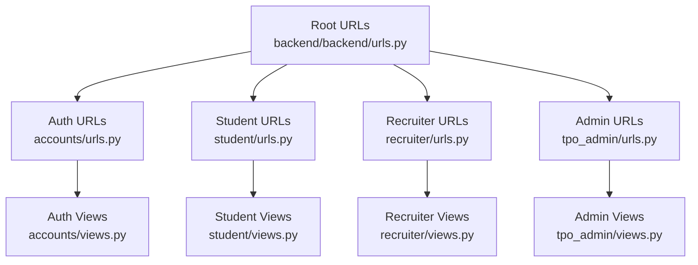
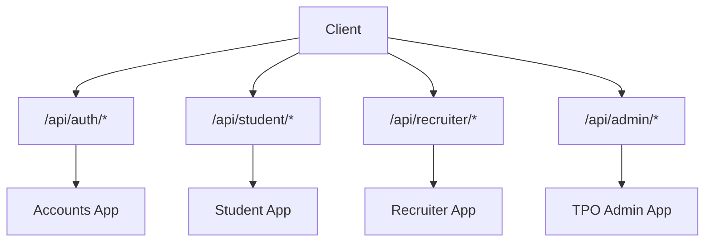
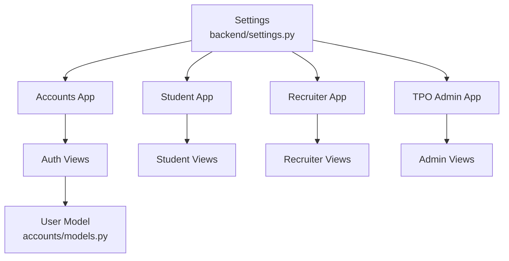

# Backend API Reference

<cite>
**Referenced Files in This Document**
- [backend/urls.py](file://backend/backend/urls.py)
- [accounts/urls.py](file://backend/accounts/urls.py)
- [accounts/views.py](file://backend/accounts/views.py)
- [accounts/models.py](file://backend/accounts/models.py)
- [student/urls.py](file://backend/student/urls.py)
- [student/views.py](file://backend/student/views.py)
- [recruiter/urls.py](file://backend/recruiter/urls.py)
- [recruiter/views.py](file://backend/recruiter/views.py)
- [tpo_admin/urls.py](file://backend/tpo_admin/urls.py)
- [tpo_admin/views.py](file://backend/tpo_admin/views.py)
- [backend/settings.py](file://backend/backend/settings.py)
</cite>

## Table of Contents
1. [Introduction](#introduction)
2. [Project Structure](#project-structure)
3. [Core Components](#core-components)
4. [Architecture Overview](#architecture-overview)
5. [Detailed Component Analysis](#detailed-component-analysis)
6. [Dependency Analysis](#dependency-analysis)
7. [Performance Considerations](#performance-considerations)
8. [Troubleshooting Guide](#troubleshooting-guide)
9. [Conclusion](#conclusion)
10. [Appendices](#appendices)

## Introduction
This document provides comprehensive API documentation for the TPO Portal Django REST API. It covers authentication endpoints, student-specific endpoints, recruiter endpoints, and admin endpoints. For each endpoint, you will find HTTP methods, URL patterns, request/response formats, authentication requirements, and error responses. Practical usage examples and integration patterns are included, along with considerations for rate limiting, pagination, and API versioning.

## Project Structure
The API is organized by domain modules under the backend directory. The root URL router includes four primary namespaces:
- Authentication: /api/auth/
- Student: /api/student/
- Recruiter: /api/recruiter/
- TPO Admin: /api/admin/

**Diagram sources**
- [backend/urls.py:4-10](file://backend/backend/urls.py#L4-L10)
- [accounts/urls.py:4-9](file://backend/accounts/urls.py#L4-L9)
- [student/urls.py:4-7](file://backend/student/urls.py#L4-L7)
- [recruiter/urls.py:4-7](file://backend/recruiter/urls.py#L4-L7)
- [tpo_admin/urls.py:4-8](file://backend/tpo_admin/urls.py#L4-L8)

**Section sources**
- [backend/urls.py:4-10](file://backend/backend/urls.py#L4-L10)

## Core Components
- Authentication system built on Django’s User model extended by the accounts app. Token-based authentication is supported via Django REST Framework tokens.
- Role-based access control is implemented via a role field on the User model with three roles: student, recruiter, and TPO admin.
- Cross-Origin Resource Sharing (CORS) is configured to allow requests from local development origins.

Key configuration highlights:
- Custom user model: AUTH_USER_MODEL = accounts.User
- REST framework apps: rest_framework, rest_framework.authtoken
- CORS origins configured for local development

**Section sources**
- [accounts/models.py:4-25](file://backend/accounts/models.py#L4-L25)
- [backend/settings.py:19-22](file://backend/backend/settings.py#L19-L22)
- [backend/settings.py:27-44](file://backend/backend/settings.py#L27-L44)
- [backend/settings.py:119-119](file://backend/backend/settings.py#L119-L119)

## Architecture Overview
The API follows a modular structure with separate apps for each stakeholder group. Authentication endpoints are centralized under /api/auth/, while functional endpoints are grouped under domain-specific namespaces.

[No sources needed since this diagram shows conceptual workflow, not actual code structure]

## Detailed Component Analysis

### Authentication Endpoints
All authentication endpoints are defined under /api/auth/.

- Base URL: /api/auth/
- Authentication: Token-based for protected endpoints; CSRF is disabled for login/register to support browser-based clients.

Endpoints:
- POST /api/auth/login/
  - Purpose: Authenticate user and issue a token.
  - Request body: username or email, password
  - Success response: message, role, username, token
  - Error responses: Invalid credentials (401), Invalid JSON (400), Method not allowed (405)
  - Notes: Supports dual login using either username or email.

- POST /api/auth/register/
  - Purpose: Create a new user account.
  - Request body: first_name, last_name, username, password, email, role (defaults to student)
  - Success response: message
  - Error responses: Username taken (400), Bad request (400)
  - Notes: Role determines access to student/recruiter/admin endpoints.

- GET /api/auth/profile/
  - Purpose: Retrieve authenticated user profile.
  - Authentication: Requires a valid DRF token.
  - Success response: first_name, last_name, username, email, role
  - Error responses: Unauthorized (401) if token missing/invalid.

- POST /api/auth/logout/
  - Purpose: Logout current session.
  - Success response: message
  - Notes: Session is cleared server-side.

Example usage patterns:
- Login and store token:
  - Send POST /api/auth/login/ with username/email and password.
  - On success, save the returned token and include it in Authorization header for subsequent requests requiring authentication.

- Access protected student endpoint:
  - Include Authorization: Token <your_token> header when calling /api/student/dashboard/ or /api/student/applications/.

- Register a new user:
  - Send POST /api/auth/register/ with required fields. Role can be set to student, recruiter, or tpo.

Common integration tips:
- Always handle 401 Unauthorized responses by prompting re-login.
- For registration, validate that usernames are unique before sending the request.
- Use HTTPS in production to protect tokens and sensitive data.

**Section sources**
- [accounts/urls.py:4-9](file://backend/accounts/urls.py#L4-L9)
- [accounts/views.py:13-45](file://backend/accounts/views.py#L13-L45)
- [accounts/views.py:48-75](file://backend/accounts/views.py#L48-L75)
- [accounts/views.py:78-89](file://backend/accounts/views.py#L78-L89)
- [accounts/views.py:92-95](file://backend/accounts/views.py#L92-L95)
- [accounts/models.py:4-25](file://backend/accounts/models.py#L4-L25)

### Student Endpoints
Student endpoints are under /api/student/.

- Base URL: /api/student/
- Authentication: Protected by DRF token for profile-related operations; current implementation returns generic messages.

Endpoints:
- GET /api/student/dashboard/
  - Purpose: Retrieve student dashboard data.
  - Authentication: Requires a valid DRF token.
  - Response: message indicating dashboard data availability.

- GET /api/student/applications/
  - Purpose: List student applications.
  - Authentication: Requires a valid DRF token.
  - Response: message indicating application list availability.

Integration notes:
- Use Authorization: Token <your_token> header for both endpoints.
- Current responses are placeholder messages; future versions may include structured data.

**Section sources**
- [student/urls.py:4-7](file://backend/student/urls.py#L4-L7)
- [student/views.py:3-7](file://backend/student/views.py#L3-L7)

### Recruiter Endpoints
Recruiter endpoints are under /api/recruiter/.

- Base URL: /api/recruiter/
- Authentication: Not explicitly protected in current implementation.

Endpoints:
- POST /api/recruiter/post-job/
  - Purpose: Post a new job.
  - Authentication: No explicit token requirement in current implementation.
  - Success response: message indicating successful job posting.
  - Notes: Supports POST; other methods return informational message.

- GET /api/recruiter/applicants/
  - Purpose: List applicants for posted jobs.
  - Authentication: No explicit token requirement in current implementation.
  - Response: message indicating applicant list availability.

Integration notes:
- For production, consider adding token-based authentication to recruiter endpoints.
- Use appropriate HTTP methods (POST for creation, GET for retrieval).

**Section sources**
- [recruiter/urls.py:4-7](file://backend/recruiter/urls.py#L4-L7)
- [recruiter/views.py:4-11](file://backend/recruiter/views.py#L4-L11)

### Admin Endpoints
Admin endpoints are under /api/admin/.

- Base URL: /api/admin/
- Authentication: Not explicitly protected in current implementation.

Endpoints:
- GET /api/admin/companies/
  - Purpose: List companies in the system.
  - Authentication: No explicit token requirement in current implementation.
  - Response: message indicating company list availability.

- GET /api/admin/drives/
  - Purpose: List drives pending approval.
  - Authentication: No explicit token requirement in current implementation.
  - Response: message indicating pending drives list availability.

- GET /api/admin/results/
  - Purpose: View placement analytics and results.
  - Authentication: No explicit token requirement in current implementation.
  - Response: message indicating analytics/results availability.

Integration notes:
- For production, enforce admin-only access using token-based authentication and role checks.
- Use Authorization: Token <admin_token> header for protected admin actions.

**Section sources**
- [tpo_admin/urls.py:4-8](file://backend/tpo_admin/urls.py#L4-L8)
- [tpo_admin/views.py:3-10](file://backend/tpo_admin/views.py#L3-L10)

## Dependency Analysis
The API modules are loosely coupled and depend on shared configuration and authentication mechanisms.

**Diagram sources**
- [backend/settings.py:27-44](file://backend/backend/settings.py#L27-L44)
- [accounts/views.py:1-10](file://backend/accounts/views.py#L1-L10)
- [accounts/models.py:4-25](file://backend/accounts/models.py#L4-L25)

**Section sources**
- [backend/settings.py:27-44](file://backend/backend/settings.py#L27-L44)
- [accounts/models.py:4-25](file://backend/accounts/models.py#L4-L25)

## Performance Considerations
- Token-based authentication is efficient but requires secure storage on the client side.
- Current endpoints return simple JSON messages; consider implementing pagination for lists (e.g., applications, applicants, companies) as data grows.
- Rate limiting is not configured in the current settings; consider integrating Django-Rate-Limit or similar for production environments.
- API versioning is not implemented; consider adding version prefixes (e.g., /api/v1/) to facilitate future breaking changes.

[No sources needed since this section provides general guidance]

## Troubleshooting Guide
Common issues and resolutions:
- 401 Unauthorized on protected endpoints:
  - Cause: Missing or invalid DRF token.
  - Resolution: Re-authenticate via /api/auth/login/ and include the returned token in the Authorization header.

- 400 Bad Request during login/register:
  - Cause: Malformed JSON or missing required fields.
  - Resolution: Validate request payload structure and required keys.

- 405 Method Not Allowed:
  - Cause: Using incorrect HTTP method for an endpoint.
  - Resolution: Follow the documented HTTP methods for each endpoint.

- CORS errors in development:
  - Cause: Origin not permitted by CORS configuration.
  - Resolution: Ensure the client runs on http://localhost:5173 or http://127.0.0.1:5173 as configured.

**Section sources**
- [accounts/views.py:42-45](file://backend/accounts/views.py#L42-L45)
- [accounts/views.py:72-75](file://backend/accounts/views.py#L72-L75)
- [accounts/views.py:92-95](file://backend/accounts/views.py#L92-L95)
- [backend/settings.py:19-22](file://backend/backend/settings.py#L19-L22)

## Conclusion
The TPO Portal API provides a clear, role-based structure with centralized authentication and domain-specific endpoints. While current implementations return simple messages, the foundation supports robust expansion with structured data, pagination, rate limiting, and API versioning. Adopt token-based authentication consistently across all endpoints and enforce role-based access for recruiter and admin functionalities.

[No sources needed since this section summarizes without analyzing specific files]

## Appendices

### Endpoint Reference Summary
- Authentication
  - POST /api/auth/login/ (username/email, password)
  - POST /api/auth/register/ (first_name, last_name, username, password, email, role)
  - GET /api/auth/profile/ (DRF token required)
  - POST /api/auth/logout/

- Student
  - GET /api/student/dashboard/ (DRF token required)
  - GET /api/student/applications/ (DRF token required)

- Recruiter
  - POST /api/recruiter/post-job/
  - GET /api/recruiter/applicants/

- Admin
  - GET /api/admin/companies/
  - GET /api/admin/drives/
  - GET /api/admin/results/

[No sources needed since this section doesn't analyze specific source files]