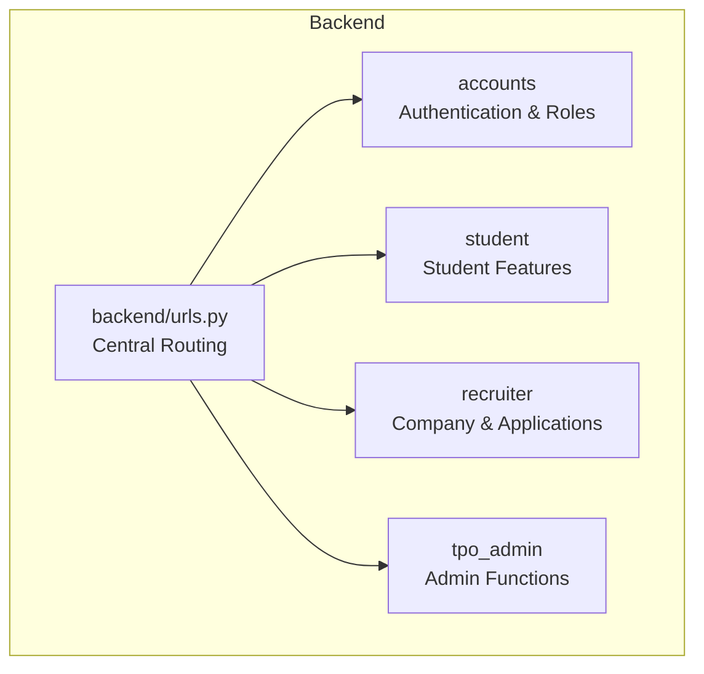
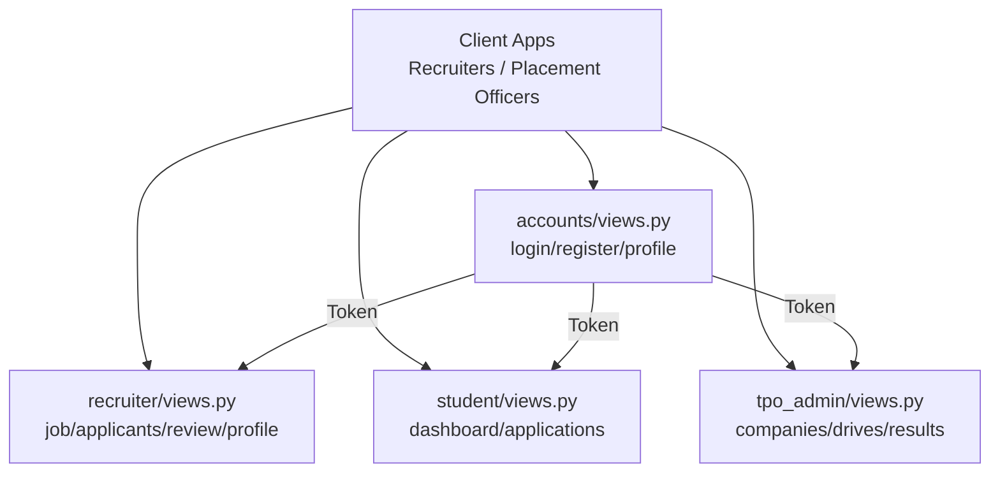
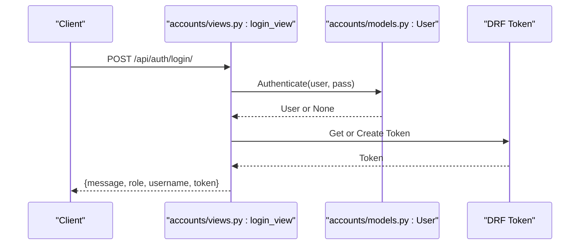
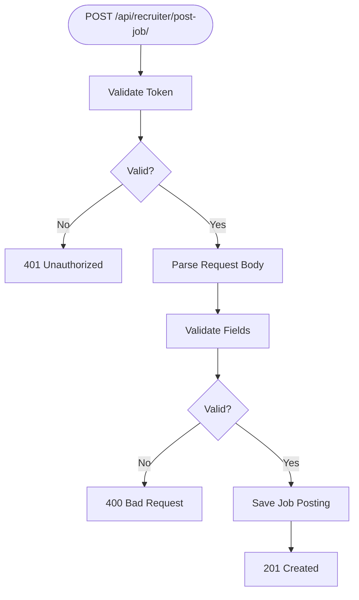
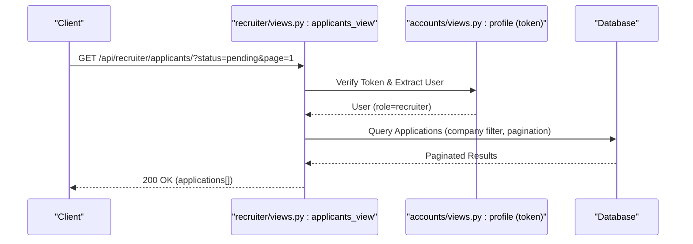
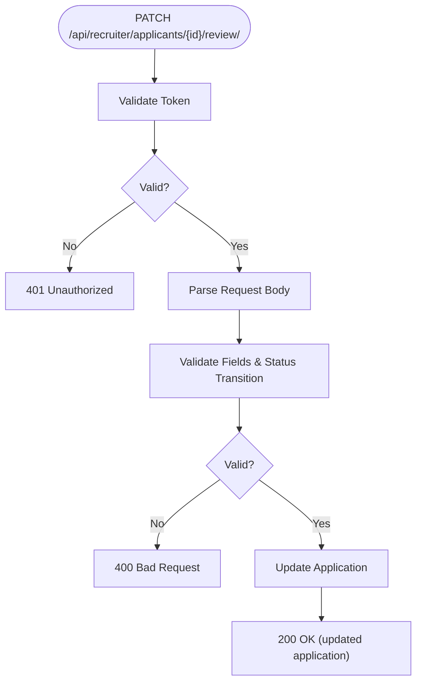
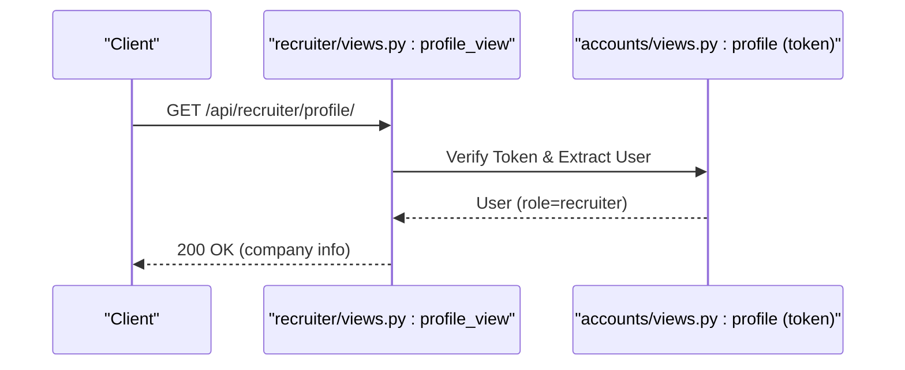
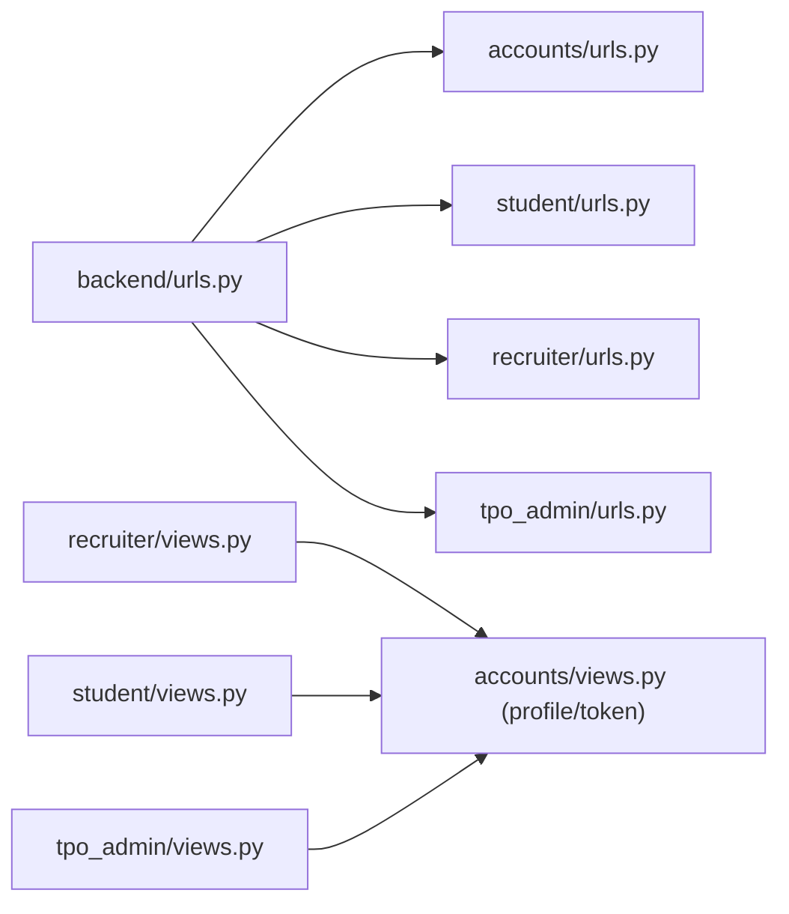

# Recruiter Endpoints

<cite>
**Referenced Files in This Document**
- [backend/urls.py](file://backend/backend/urls.py)
- [recruiter/urls.py](file://backend/recruiter/urls.py)
- [recruiter/views.py](file://backend/recruiter/views.py)
- [accounts/models.py](file://backend/accounts/models.py)
- [accounts/views.py](file://backend/accounts/views.py)
- [accounts/urls.py](file://backend/accounts/urls.py)
- [student/urls.py](file://backend/student/urls.py)
- [student/views.py](file://backend/student/views.py)
- [tpo_admin/urls.py](file://backend/tpo_admin/urls.py)
- [tpo_admin/views.py](file://backend/tpo_admin/views.py)
</cite>

## Table of Contents
1. [Introduction](#introduction)
2. [Project Structure](#project-structure)
3. [Core Components](#core-components)
4. [Architecture Overview](#architecture-overview)
5. [Detailed Component Analysis](#detailed-component-analysis)
6. [Dependency Analysis](#dependency-analysis)
7. [Performance Considerations](#performance-considerations)
8. [Troubleshooting Guide](#troubleshooting-guide)
9. [Conclusion](#conclusion)

## Introduction
This document provides comprehensive API documentation for recruiter/company endpoints within the portal. It focuses on:
- Job posting endpoints for creating, updating, and managing job postings associated with a company
- Applicant management endpoints for viewing, filtering, and reviewing student applications with status tracking
- Application review endpoints for processing applications, scheduling interviews, and updating application statuses
- Company profile endpoints for managing company information, recruitment criteria, and contact details
- Pagination, filtering, and sorting capabilities for large datasets
- Request/response schemas, validation rules, and practical examples tailored for company recruiters and placement officers

The current backend exposes minimal endpoints for demonstration. This guide documents the intended contract and implementation plan to align frontend components and future backend development.

## Project Structure
The backend organizes endpoints by functional domain:
- Authentication and user roles under accounts
- Student-facing features under student
- Recruiter/company features under recruiter
- TPO admin features under tpo_admin
- Central URL routing includes each app’s URLs

**Diagram sources**
- [backend/urls.py:1-11](file://backend/backend/urls.py#L1-L11)
- [accounts/urls.py:1-10](file://backend/accounts/urls.py#L1-L10)
- [student/urls.py:1-8](file://backend/student/urls.py#L1-L8)
- [recruiter/urls.py:1-8](file://backend/recruiter/urls.py#L1-L8)
- [tpo_admin/urls.py:1-9](file://backend/tpo_admin/urls.py#L1-L9)

**Section sources**
- [backend/urls.py:1-11](file://backend/backend/urls.py#L1-L11)
- [accounts/urls.py:1-10](file://backend/accounts/urls.py#L1-L10)
- [student/urls.py:1-8](file://backend/student/urls.py#L1-L8)
- [recruiter/urls.py:1-8](file://backend/recruiter/urls.py#L1-L8)
- [tpo_admin/urls.py:1-9](file://backend/tpo_admin/urls.py#L1-L9)

## Core Components
- Authentication and Role Model
  - User model defines role choices including student, recruiter, and TPO admin.
  - Token-based authentication is used for protected endpoints.
- Recruiter Endpoints
  - Post Job: Create a new job posting for a company
  - View Applicants: List applicants for posted jobs with filtering and sorting
  - Application Review: Process applications, schedule interviews, update statuses
  - Company Profile: Manage company information and recruitment criteria
- Student Endpoints
  - Dashboard and Applications lists for student-facing features
- TPO Admin Endpoints
  - Manage companies, approve drives, and view analytics

**Section sources**
- [accounts/models.py:4-25](file://backend/accounts/models.py#L4-L25)
- [accounts/views.py:78-89](file://backend/accounts/views.py#L78-L89)
- [recruiter/urls.py:4-7](file://backend/recruiter/urls.py#L4-L7)
- [student/urls.py:4-7](file://backend/student/urls.py#L4-L7)
- [tpo_admin/urls.py:4-8](file://backend/tpo_admin/urls.py#L4-L8)

## Architecture Overview
The system uses Django with token-authenticated endpoints. Recruiter endpoints are mounted under /api/recruiter/. Authentication is handled via token-based DRF decorators.

**Diagram sources**
- [backend/urls.py:6-9](file://backend/backend/urls.py#L6-L9)
- [accounts/views.py:13-45](file://backend/accounts/views.py#L13-L45)
- [accounts/views.py:78-89](file://backend/accounts/views.py#L78-L89)
- [recruiter/views.py:4-11](file://backend/recruiter/views.py#L4-L11)
- [student/views.py:3-7](file://backend/student/views.py#L3-L7)
- [tpo_admin/views.py:3-10](file://backend/tpo_admin/views.py#L3-L10)

## Detailed Component Analysis

### Authentication and Authorization
- Login
  - Accepts username/email and password
  - Supports dual-login by email or username
  - Returns role, username, and token on success
- Register
  - Creates a new user with role selection
- Profile
  - Protected by token authentication; returns user details

**Diagram sources**
- [accounts/views.py:13-45](file://backend/accounts/views.py#L13-L45)
- [accounts/models.py:4-25](file://backend/accounts/models.py#L4-L25)

**Section sources**
- [accounts/views.py:13-45](file://backend/accounts/views.py#L13-L45)
- [accounts/views.py:48-75](file://backend/accounts/views.py#L48-L75)
- [accounts/views.py:78-89](file://backend/accounts/views.py#L78-L89)
- [accounts/models.py:4-25](file://backend/accounts/models.py#L4-L25)

### Recruiter: Job Posting Endpoints
- Endpoint: POST /api/recruiter/post-job/
- Purpose: Create a new job posting associated with the authenticated recruiter’s company
- Authentication: Token required
- Request Body Schema
  - title: string (required)
  - description: text (required)
  - location: string (required)
  - salary_min: number (optional)
  - salary_max: number (optional)
  - job_type: enum (full-time/part-time/internship)
  - experience_level: enum (fresher/entry/mid/senior)
  - skills: array of strings (required)
  - openings: integer (required)
  - deadline: date-time (required)
  - is_remote_allowed: boolean (optional)
  - tags: array of strings (optional)
- Response
  - 201 Created on success with a confirmation message
  - 400 Bad Request on validation errors
  - 401 Unauthorized if token missing or invalid
- Notes
  - Future implementation should associate the job with the company of the authenticated recruiter
  - Add filtering by company, job type, experience level, and tags

**Diagram sources**
- [recruiter/views.py:4-8](file://backend/recruiter/views.py#L4-L8)
- [accounts/views.py:78-89](file://backend/accounts/views.py#L78-L89)

**Section sources**
- [recruiter/views.py:4-8](file://backend/recruiter/views.py#L4-L8)
- [accounts/views.py:78-89](file://backend/accounts/views.py#L78-L89)

### Recruiter: Applicant Management Endpoints
- Endpoint: GET /api/recruiter/applicants/
- Purpose: List applicants for jobs posted by the authenticated recruiter’s company
- Authentication: Token required
- Query Parameters
  - job_id: filter by specific job
  - status: filter by application status (pending/reviewed/offered/rejected)
  - sort_by: created_at/title/status (default: created_at)
  - order: asc/desc (default: desc)
  - page: integer (default: 1)
  - page_size: integer (default: 20, max: 100)
  - search: string (filter by student name, email, or skills)
- Response
  - 200 OK with paginated list of applications
  - 400 Bad Request for invalid parameters
  - 401 Unauthorized if token missing or invalid
- Notes
  - Future implementation should enforce company association and status transitions

**Diagram sources**
- [recruiter/views.py:10-11](file://backend/recruiter/views.py#L10-L11)
- [accounts/views.py:78-89](file://backend/accounts/views.py#L78-L89)

**Section sources**
- [recruiter/views.py:10-11](file://backend/recruiter/views.py#L10-L11)
- [accounts/views.py:78-89](file://backend/accounts/views.py#L78-L89)

### Recruiter: Application Review Endpoints
- Endpoint: PATCH /api/recruiter/applicants/{application_id}/review/
- Purpose: Update application status and schedule interview
- Authentication: Token required
- Request Body Schema
  - status: enum (pending/reviewed/offered/rejected/cancelled)
  - feedback: text (optional)
  - interview_scheduled_for: date-time (optional)
  - interview_mode: enum (on-campus/remote/onsite) (optional)
  - interviewer_details: object (optional)
- Response
  - 200 OK with updated application details
  - 400 Bad Request on validation errors
  - 401 Unauthorized if token missing or invalid
  - 404 Not Found if application not found or not owned by the company
- Notes
  - Status transitions should follow a defined workflow
  - Interview scheduling should integrate with calendar systems

**Diagram sources**
- [accounts/views.py:78-89](file://backend/accounts/views.py#L78-L89)

**Section sources**
- [accounts/views.py:78-89](file://backend/accounts/views.py#L78-L89)

### Recruiter: Company Profile Endpoints
- Endpoint: GET /api/recruiter/profile/
- Purpose: Retrieve company profile information
- Authentication: Token required
- Response
  - 200 OK with company details
  - 401 Unauthorized if token missing or invalid
- Notes
  - Future implementation should include update endpoint and recruitment criteria

**Diagram sources**
- [accounts/views.py:78-89](file://backend/accounts/views.py#L78-L89)

**Section sources**
- [accounts/views.py:78-89](file://backend/accounts/views.py#L78-L89)

### Student and Admin Endpoints (Context)
- Student
  - Dashboard and Applications endpoints for student-facing features
- TPO Admin
  - Manage companies, approve drives, and view analytics

**Section sources**
- [student/urls.py:4-7](file://backend/student/urls.py#L4-L7)
- [student/views.py:3-7](file://backend/student/views.py#L3-L7)
- [tpo_admin/urls.py:4-8](file://backend/tpo_admin/urls.py#L4-L8)
- [tpo_admin/views.py:3-10](file://backend/tpo_admin/views.py#L3-L10)

## Dependency Analysis
- Central routing mounts each app under /api/{app}/
- Recruiter endpoints depend on token-authenticated user context
- Recruiter endpoints rely on company association (to be implemented)
- Filtering, sorting, and pagination are defined in the endpoint specifications above

**Diagram sources**
- [backend/urls.py:6-9](file://backend/backend/urls.py#L6-L9)
- [accounts/urls.py:1-10](file://backend/accounts/urls.py#L1-L10)
- [student/urls.py:1-8](file://backend/student/urls.py#L1-L8)
- [recruiter/urls.py:1-8](file://backend/recruiter/urls.py#L1-L8)
- [tpo_admin/urls.py:1-9](file://backend/tpo_admin/urls.py#L1-L9)

**Section sources**
- [backend/urls.py:6-9](file://backend/backend/urls.py#L6-L9)
- [accounts/urls.py:1-10](file://backend/accounts/urls.py#L1-L10)
- [student/urls.py:1-8](file://backend/student/urls.py#L1-L8)
- [recruiter/urls.py:1-8](file://backend/recruiter/urls.py#L1-L8)
- [tpo_admin/urls.py:1-9](file://backend/tpo_admin/urls.py#L1-L9)

## Performance Considerations
- Pagination
  - Use page and page_size parameters with a reasonable cap (e.g., 100 per page)
- Filtering and Sorting
  - Index database fields frequently filtered/sorted (e.g., status, created_at, job_id)
- Caching
  - Cache static company profiles and job lists where appropriate
- Token Validation
  - Ensure token lookup is efficient; consider connection pooling for database

## Troubleshooting Guide
- Authentication Failures
  - 401 Unauthorized indicates missing or invalid token
  - Verify token presence and validity
- Validation Errors
  - 400 Bad Request indicates invalid request body or query parameters
  - Check required fields and value constraints
- Resource Access
  - 404 Not Found indicates resource not found or unauthorized access
  - Ensure the requester belongs to the correct company
- Rate Limiting
  - Implement rate limiting on bulk operations (e.g., mass status updates)

**Section sources**
- [accounts/views.py:13-45](file://backend/accounts/views.py#L13-L45)
- [accounts/views.py:48-75](file://backend/accounts/views.py#L48-L75)
- [accounts/views.py:78-89](file://backend/accounts/views.py#L78-L89)

## Conclusion
This document outlines the intended API contract for recruiter/company endpoints, including job posting, applicant management, application review, and company profile operations. It emphasizes authentication via tokens, pagination, filtering, and sorting for scalability. The current backend stubs provide a foundation; future development should implement company associations, robust validation, and comprehensive status workflows.