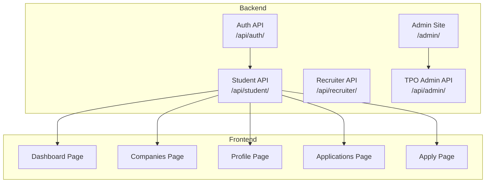
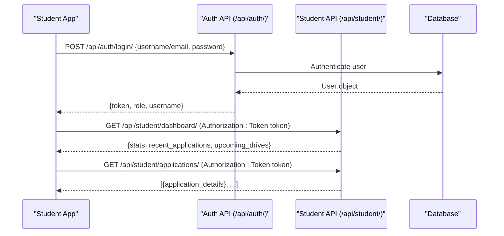
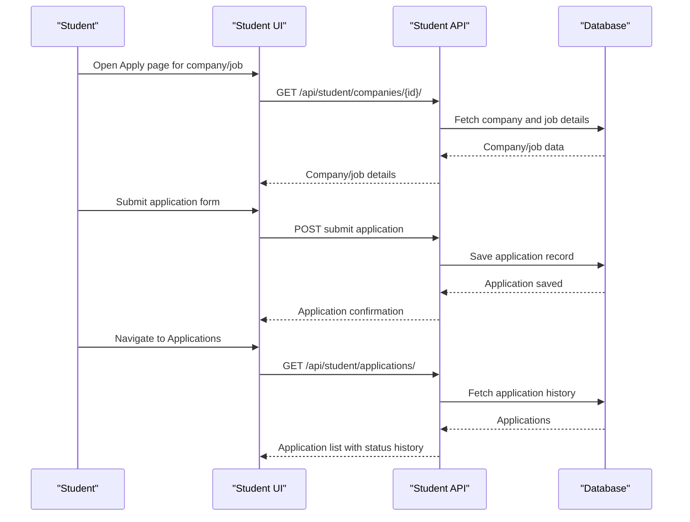
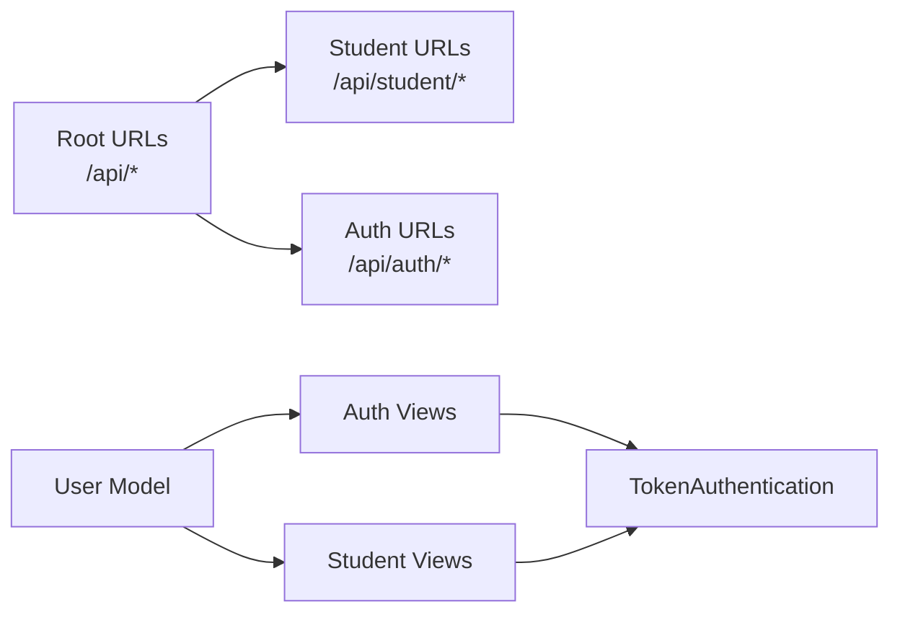

# Student Endpoints

<cite>
**Referenced Files in This Document**
- [backend\backend\urls.py](file://backend/backend/urls.py)
- [backend\student\urls.py](file://backend/student/urls.py)
- [backend\student\views.py](file://backend/student/views.py)
- [backend\accounts\urls.py](file://backend/accounts/urls.py)
- [backend\accounts\views.py](file://backend/accounts/views.py)
- [backend\accounts\models.py](file://backend/accounts/models.py)
- [backend\accounts\migrations\0001_initial.py](file://backend/accounts/migrations/0001_initial.py)
- [frontend\src\Pages\Student\Dashboard.jsx](file://frontend/src/Pages/Student/Dashboard.jsx)
- [frontend\src\Pages\Student\Companies.jsx](file://frontend/src/Pages/Student/Companies.jsx)
- [frontend\src\Pages\Student\Profile.jsx](file://frontend/src/Pages/Student/Profile.jsx)
- [frontend\src\Pages\Student\ApplicationTracker.jsx](file://frontend/src/Pages/Student/ApplicationTracker.jsx)
- [frontend\src\Pages\Student\Apply.jsx](file://frontend/src/Pages/Student/Apply.jsx)
</cite>

## Table of Contents
1. [Introduction](#introduction)
2. [Project Structure](#project-structure)
3. [Core Components](#core-components)
4. [Architecture Overview](#architecture-overview)
5. [Detailed Component Analysis](#detailed-component-analysis)
6. [Dependency Analysis](#dependency-analysis)
7. [Performance Considerations](#performance-considerations)
8. [Troubleshooting Guide](#troubleshooting-guide)
9. [Conclusion](#conclusion)
10. [Appendices](#appendices)

## Introduction
This document provides comprehensive API documentation for student-specific endpoints in the portal. It covers:
- Dashboard endpoints for retrieving student overview data including application statistics and upcoming drives
- Profile management endpoints for CRUD operations on student information, education details, and personal data
- Company browsing endpoints for searching, filtering, and viewing company information with pagination support
- Job application endpoints for submitting applications, tracking application status, and managing application history
- Company-specific endpoints for viewing job postings and application requirements

The documentation includes request/response schemas, authentication requirements, parameter specifications, and practical usage examples. Where applicable, diagrams illustrate the flow of requests and responses.

## Project Structure
The backend exposes REST endpoints via Django and Django REST Framework. Student endpoints are mounted under the base path /api/student/. Authentication is handled via token-based authentication.

**Diagram sources**
- [backend\backend\urls.py:4-10](file://backend/backend/urls.py#L4-L10)
- [backend\student\urls.py:4-7](file://backend/student/urls.py#L4-L7)

**Section sources**
- [backend\backend\urls.py:4-10](file://backend/backend/urls.py#L4-L10)
- [backend\student\urls.py:4-7](file://backend/student/urls.py#L4-L7)

## Core Components
- Authentication and Authorization
  - Token-based authentication is used for protected endpoints. The accounts app provides login, registration, profile retrieval, and logout endpoints.
  - Students are identified by the role field in the User model.

- Student Endpoints
  - Currently implemented endpoints:
    - GET /api/student/dashboard/
    - GET /api/student/applications/

- Frontend Integration
  - The frontend pages demonstrate how the UI interacts with the backend, including profile editing, company browsing, application tracking, and applying to jobs.

**Section sources**
- [backend\accounts\views.py:78-89](file://backend/accounts/views.py#L78-L89)
- [backend\accounts\models.py:4-24](file://backend/accounts/models.py#L4-L24)
- [backend\student\views.py:3-7](file://backend/student/views.py#L3-L7)
- [frontend\src\Pages\Student\Dashboard.jsx:36-58](file://frontend/src/Pages/Student/Dashboard.jsx#L36-L58)
- [frontend\src\Pages\Student\ApplicationTracker.jsx:21-96](file://frontend/src/Pages/Student/ApplicationTracker.jsx#L21-L96)

## Architecture Overview
The system follows a layered architecture:
- Frontend (React SPA) communicates with backend APIs
- Backend routes are defined in Django URLs and mapped to views
- Authentication is enforced using DRF TokenAuthentication
- Data models are defined in Django models

**Diagram sources**
- [backend\accounts\views.py:13-45](file://backend/accounts/views.py#L13-L45)
- [backend\student\views.py:3-7](file://backend/student/views.py#L3-L7)
- [backend\backend\urls.py:6-9](file://backend/backend/urls.py#L6-L9)

## Detailed Component Analysis

### Authentication and Authorization
- Purpose: Provide secure access to protected endpoints using token-based authentication.
- Endpoints:
  - POST /api/auth/login/
    - Request body: { username or email, password }
    - Response body: { message, role, username, token }
    - Status codes: 200 on success, 401 on invalid credentials, 400 on invalid JSON, 405 on method not allowed
  - POST /api/auth/register/
    - Request body: { first_name, last_name, username, password, email, role }
    - Response body: { message }
    - Status codes: 201 on success, 400 on validation errors
  - GET /api/auth/profile/
    - Requires: Authorization header with Token
    - Response body: { first_name, last_name, username, email, role }
    - Status codes: 200 on success, 401 if unauthorized
  - POST /api/auth/logout/
    - Response body: { message }
    - Status codes: 200 on success

- Role-based Access
  - The User model defines role choices including student, recruiter, and TPO admin. Student endpoints are intended for users with role student.

**Section sources**
- [backend\accounts\views.py:13-45](file://backend/accounts/views.py#L13-L45)
- [backend\accounts\views.py:48-75](file://backend/accounts/views.py#L48-L75)
- [backend\accounts\views.py:78-89](file://backend/accounts/views.py#L78-L89)
- [backend\accounts\views.py:92-95](file://backend/accounts/views.py#L92-L95)
- [backend\accounts\models.py:4-24](file://backend/accounts/models.py#L4-L24)
- [backend\accounts\migrations\0001_initial.py:18-44](file://backend/accounts/migrations/0001_initial.py#L18-L44)

### Dashboard Endpoints
- Endpoint: GET /api/student/dashboard/
- Authentication: Required (TokenAuthentication)
- Description: Returns student overview data including application statistics and upcoming drives.
- Request
  - Headers:
    - Authorization: Token token
- Response
  - Body: { stats, recent_applications, upcoming_drives }
    - stats: { totalApplications, shortlisted, offers, pending }
    - recent_applications: array of application objects with fields like companyId, companyName, jobRole, status, appliedDate
    - upcoming_drives: array of drive objects with fields like id, companyName, driveDate, jobRole, location
- Example usage
  - curl -H "Authorization: Token <token>" https://<host>/api/student/dashboard/

**Section sources**
- [backend\student\views.py:3-4](file://backend/student/views.py#L3-L4)
- [frontend\src\Pages\Student\Dashboard.jsx:36-58](file://frontend/src/Pages/Student/Dashboard.jsx#L36-L58)

### Profile Management Endpoints
- Endpoint: GET /api/student/profile/ (conceptual)
- Authentication: Required (TokenAuthentication)
- Description: Retrieve and update student profile information including personal details, education, skills, certifications, projects, and work experience.
- Request
  - Headers:
    - Authorization: Token token
- Response
  - Body: { personalInfo, education, skills, certifications, projects, workExperience, resume, gradeCard }
    - personalInfo: { firstName, lastName, email, phone, dateOfBirth, gender, address, city, state, pincode, linkedin, github, portfolio }
    - education: { tenth, twelfth, graduation }
      - tenth/twelfth: { board, school, percentage, yearOfPassing }
      - graduation: { degree, branch, college, university, cgpa, currentYear, expectedGraduation, backlogCount }
    - skills: array of strings
    - certifications: array of objects with fields like name, issuer, year
    - projects: array of objects with fields like title, description, technologies, link
    - workExperience: array of objects with fields like company, role, duration, description
    - resume, gradeCard: file references or URLs
- Notes
  - Current backend stub returns a placeholder response. Implementations should persist data to the database and enforce validation.

**Section sources**
- [backend\student\views.py:3-4](file://backend/student/views.py#L3-L4)
- [frontend\src\Pages\Student\Profile.jsx:10-49](file://frontend/src/Pages/Student/Profile.jsx#L10-L49)
- [frontend\src\Pages\Student\Profile.jsx:65-94](file://frontend/src/Pages/Student/Profile.jsx#L65-L94)

### Company Browsing Endpoints
- Endpoint: GET /api/student/companies/ (conceptual)
- Authentication: Required (TokenAuthentication)
- Description: Retrieve paginated list of companies with optional filters for search term, job type, CTC range, and eligibility.
- Request
  - Headers:
    - Authorization: Token token
  - Query parameters:
    - search: string (optional)
    - jobType: enum (full-time, internship, part-time, all)
    - ctcRange: enum (0-8, 8-12, 12-16, 16-100, all)
    - eligibleOnly: boolean
    - page: integer (default 1)
    - pageSize: integer (default 10)
- Response
  - Body: { count, next, previous, results: [company] }
    - company: { id, name, logo, industry, description, website, location, jobRole, jobType, ctc, deadline, eligibility }
      - eligibility: { cgpa, tenth, twelfth, backlog }
- Notes
  - Current frontend uses sample data. Implement backend to return filtered and paginated results.

**Section sources**
- [backend\student\views.py:3-4](file://backend/student/views.py#L3-L4)
- [frontend\src\Pages\Student\Companies.jsx:10-14](file://frontend/src/Pages/Student/Companies.jsx#L10-L14)
- [frontend\src\Pages\Student\Companies.jsx:25-332](file://frontend/src/Pages/Student/Companies.jsx#L25-L332)

### Job Application Endpoints
- Endpoint: GET /api/student/applications/ (conceptual)
- Authentication: Required (TokenAuthentication)
- Description: Retrieve application history for the logged-in student.
- Request
  - Headers:
    - Authorization: Token token
- Response
  - Body: array of application objects with fields like id, companyId, companyName, jobRole, appliedDate, status, statusHistory, nextRound, nextRoundDate, location, ctc
- Notes
  - Current backend stub returns a placeholder response. Implement backend to filter by current user and return detailed status history.

**Section sources**
- [backend\student\views.py:6-7](file://backend/student/views.py#L6-L7)
- [frontend\src\Pages\Student\ApplicationTracker.jsx:21-96](file://frontend/src/Pages/Student/ApplicationTracker.jsx#L21-L96)

### Company-Specific Endpoints
- Endpoint: GET /api/student/companies/{id}/ (conceptual)
- Authentication: Required (TokenAuthentication)
- Description: Retrieve detailed information about a specific company and its job postings.
- Request
  - Path parameters:
    - id: integer (company identifier)
  - Headers:
    - Authorization: Token token
- Response
  - Body: { id, name, logo, industry, description, website, location, jobPostings: [{ id, role, type, ctc, deadline, eligibility }] }
    - eligibility: { cgpa, tenth, twelfth, backlog }
- Notes
  - Current frontend uses sample data. Implement backend to return company details and associated job postings.

**Section sources**
- [backend\student\views.py:3-4](file://backend/student/views.py#L3-L4)
- [frontend\src\Pages\Student\Apply.jsx:108-124](file://frontend/src/Pages/Student/Apply.jsx#L108-L124)

### Application Submission Flow
- Workflow
  1. Student selects a company and job posting.
  2. Student fills application form (preferences, references).
  3. Student submits application.
  4. System updates application status and history.
  5. Student can track status via Applications page.

**Diagram sources**
- [frontend\src\Pages\Student\Apply.jsx:108-124](file://frontend/src/Pages/Student/Apply.jsx#L108-L124)
- [frontend\src\Pages\Student\Apply.jsx:138-140](file://frontend/src/Pages/Student/Apply.jsx#L138-L140)
- [frontend\src\Pages\Student\ApplicationTracker.jsx:21-96](file://frontend/src/Pages/Student/ApplicationTracker.jsx#L21-L96)

## Dependency Analysis
- URL Routing
  - Root URLs include student, accounts, recruiter, and admin namespaces.
  - Student URLs define dashboard and applications endpoints.

- Authentication Dependencies
  - TokenAuthentication and IsAuthenticated permission classes protect student endpoints.
  - Accounts views implement login, registration, profile retrieval, and logout.

- Model Dependencies
  - User model defines role choices and helper methods to identify roles.

**Diagram sources**
- [backend\backend\urls.py:4-10](file://backend/backend/urls.py#L4-L10)
- [backend\student\urls.py:4-7](file://backend/student/urls.py#L4-L7)
- [backend\accounts\views.py:78-89](file://backend/accounts/views.py#L78-L89)
- [backend\accounts\models.py:4-24](file://backend/accounts/models.py#L4-L24)

**Section sources**
- [backend\backend\urls.py:4-10](file://backend/backend/urls.py#L4-L10)
- [backend\student\urls.py:4-7](file://backend/student/urls.py#L4-L7)
- [backend\accounts\views.py:78-89](file://backend/accounts/views.py#L78-L89)
- [backend\accounts\models.py:4-24](file://backend/accounts/models.py#L4-L24)

## Performance Considerations
- Pagination
  - Use page and pageSize query parameters for company browsing to limit response size.
- Filtering
  - Apply filters server-side to reduce payload size and improve responsiveness.
- Caching
  - Consider caching company listings and static data to reduce database load.
- Token Validation
  - Ensure token lookup is efficient; avoid unnecessary database queries per request.

## Troubleshooting Guide
- Authentication Issues
  - Ensure Authorization header includes a valid token.
  - Verify the token matches a user in the database.
- Endpoint Not Found
  - Confirm the endpoint path matches the URL configuration.
- CORS Errors
  - Configure CORS settings in Django to allow frontend origin.
- JSON Parsing Errors
  - Validate request bodies conform to expected schemas.

**Section sources**
- [backend\accounts\views.py:13-45](file://backend/accounts/views.py#L13-L45)
- [backend\accounts\views.py:48-75](file://backend/accounts/views.py#L48-L75)
- [backend\accounts\views.py:78-89](file://backend/accounts/views.py#L78-L89)

## Conclusion
This documentation outlines the current and planned student endpoints, including authentication, dashboard, profile management, company browsing, and application tracking. While the backend currently provides minimal stubs, the frontend demonstrates expected data structures and flows. Implementing the backend endpoints will enable full functionality for students to manage profiles, browse companies, apply to jobs, and track application status.

## Appendices

### Endpoint Reference Summary
- Authentication
  - POST /api/auth/login/ - Login with username/email and password
  - POST /api/auth/register/ - Register a new user
  - GET /api/auth/profile/ - Get authenticated user profile
  - POST /api/auth/logout/ - Logout the current session

- Student
  - GET /api/student/dashboard/ - Retrieve dashboard overview data
  - GET /api/student/applications/ - Retrieve application history

- Company
  - GET /api/student/companies/ - List companies with filters and pagination
  - GET /api/student/companies/{id}/ - Get company details and job postings

- Application
  - POST /api/student/applications/ - Submit a new application (conceptual)
  - GET /api/student/applications/{id}/ - Get application details (conceptual)

### Request/Response Schemas

- Login Request
  - {
    - username: string (optional if email provided)
    - email: string (optional if username provided)
    - password: string
  - }

- Login Response
  - {
    - message: string
    - role: string
    - username: string
    - token: string
  - }

- Register Request
  - {
    - first_name: string
    - last_name: string
    - username: string
    - password: string
    - email: string
    - role: string (default: student)
  - }

- Profile Response
  - {
    - first_name: string
    - last_name: string
    - username: string
    - email: string
    - role: string
  - }

- Dashboard Response
  - {
    - stats: {
      - totalApplications: number
      - shortlisted: number
      - offers: number
      - pending: number
    - recent_applications: array
    - upcoming_drives: array
  - }

- Applications Response (array of objects)
  - [
    - {
      - id: number
      - companyId: number
      - companyName: string
      - jobRole: string
      - appliedDate: string (ISO 8601)
      - status: string
      - statusHistory: array of { status: string, date: string, note: string }
      - nextRound: string or null
      - nextRoundDate: string or null
      - location: string
      - ctc: string
    - }
  - ]

- Companies Response (paginated)
  - {
    - count: number
    - next: string or null
    - previous: string or null
    - results: array of {
      - id: number
      - name: string
      - logo: string
      - industry: string
      - description: string
      - website: string
      - location: string
      - jobRole: string
      - jobType: string
      - ctc: string
      - deadline: string (ISO 8601)
      - eligibility: { cgpa: number, tenth: number, twelfth: number, backlog: number }
    - }
  - }

- Company Details Response
  - {
    - id: number
    - name: string
    - logo: string
    - industry: string
    - description: string
    - website: string
    - location: string
    - jobPostings: array of {
      - id: number
      - role: string
      - type: string
      - ctc: string
      - deadline: string (ISO 8601)
      - eligibility: { cgpa: number, tenth: number, twelfth: number, backlog: number }
    - }
  - }