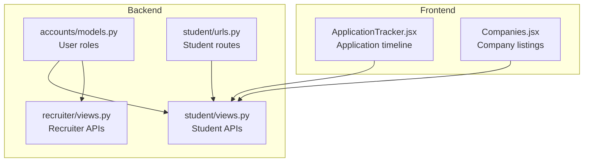
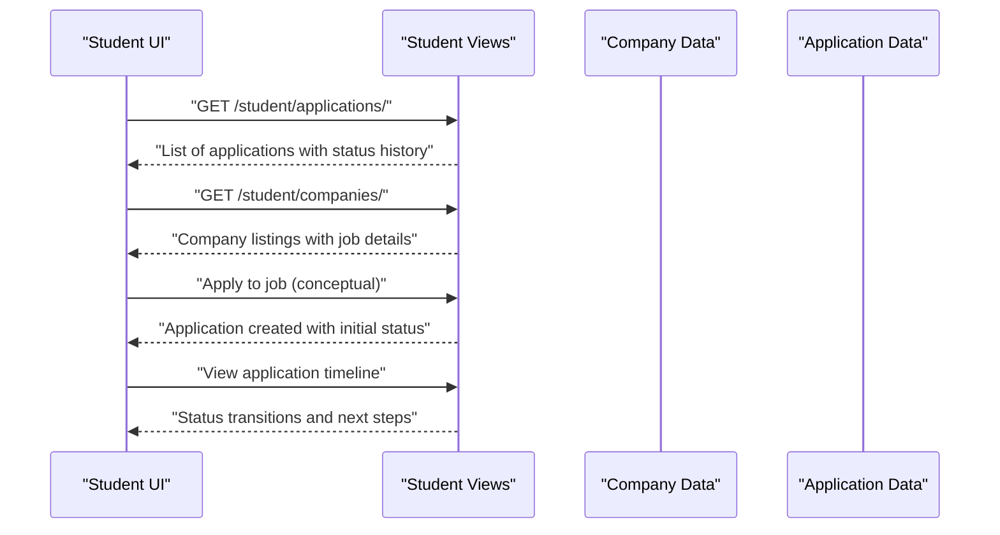
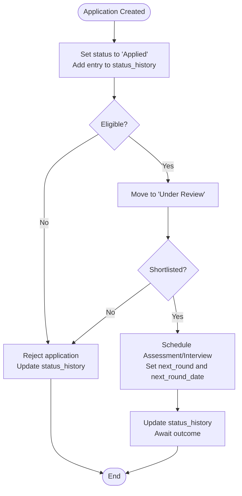
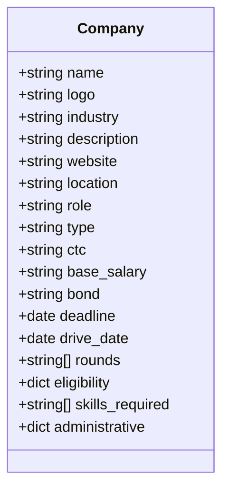
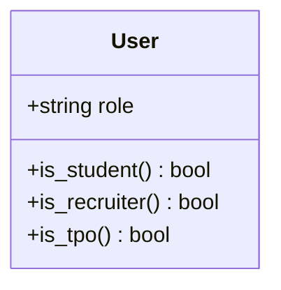
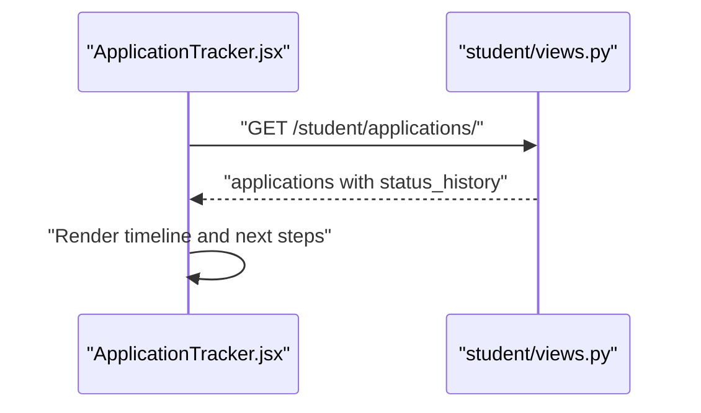
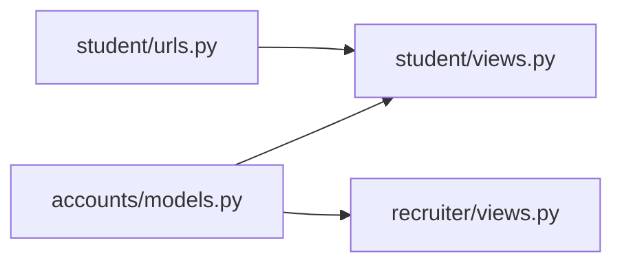

# Application & Company Models

<cite>
**Referenced Files in This Document**
- [accounts/models.py](file://backend/accounts/models.py)
- [student/views.py](file://backend/student/views.py)
- [student/urls.py](file://backend/student/urls.py)
- [recruiter/views.py](file://backend/recruiter/views.py)
- [ApplicationTracker.jsx](file://frontend/src/Pages/Student/ApplicationTracker.jsx)
- [Companies.jsx](file://frontend/src/Pages/Student/Companies.jsx)
</cite>

## Table of Contents
1. [Introduction](#introduction)
2. [Project Structure](#project-structure)
3. [Core Components](#core-components)
4. [Architecture Overview](#architecture-overview)
5. [Detailed Component Analysis](#detailed-component-analysis)
6. [Dependency Analysis](#dependency-analysis)
7. [Performance Considerations](#performance-considerations)
8. [Troubleshooting Guide](#troubleshooting-guide)
9. [Conclusion](#conclusion)

## Introduction
This document describes the conceptual Application and Company models for a campus placement portal. It focuses on how applications connect students to companies, tracks application status and interview scheduling, and outlines company profiles, job postings, and administrative workflows. The document also explains the relationships among Student, Company, and Application entities, application lifecycle management, status transitions, and reporting capabilities for placement analytics.

## Project Structure
The backend is organized into Django app modules:
- accounts: Shared user roles and authentication abstractions
- student: Student-facing APIs and UI integration
- recruiter: Company-side job posting and applicant management APIs
- tpo_admin: Administrative approvals and analytics

The frontend pages demonstrate how application tracking and company browsing are presented to users.

**Diagram sources**
- [accounts/models.py:1-25](file://backend/accounts/models.py#L1-L25)
- [student/views.py:1-8](file://backend/student/views.py#L1-L8)
- [student/urls.py:1-8](file://backend/student/urls.py#L1-L8)
- [recruiter/views.py:1-12](file://backend/recruiter/views.py#L1-L12)
- [ApplicationTracker.jsx:1-569](file://frontend/src/Pages/Student/ApplicationTracker.jsx#L1-L569)
- [Companies.jsx:127-564](file://frontend/src/Pages/Student/Companies.jsx#L127-L564)

**Section sources**
- [accounts/models.py:1-25](file://backend/accounts/models.py#L1-L25)
- [student/views.py:1-8](file://backend/student/views.py#L1-L8)
- [student/urls.py:1-8](file://backend/student/urls.py#L1-L8)
- [recruiter/views.py:1-12](file://backend/recruiter/views.py#L1-L12)
- [ApplicationTracker.jsx:1-569](file://frontend/src/Pages/Student/ApplicationTracker.jsx#L1-L569)
- [Companies.jsx:127-564](file://frontend/src/Pages/Student/Companies.jsx#L127-L564)

## Core Components
This section defines the conceptual models and their relationships, focusing on fields, workflows, and integrations visible in the frontend and backend stubs.

- Student (via User)
  - Role-based identity with role choices for student, recruiter, and TPO admin
  - Used as the creator of Applications and viewer of Company job postings

- Company
  - Company profile fields: name, logo/initials, industry, description, website, location
  - Job posting fields: role, type, CTC, base salary, bond, deadline, drive date, rounds
  - Eligibility criteria: CGPA threshold, academic thresholds, backlog limits
  - Skills required and administrative metadata

- Application
  - Links a Student to a Company via foreign keys
  - Tracks application status history with timestamps and notes
  - Stores next round information and scheduled interview date/time
  - Supports filtering by status and other criteria for analytics

**Section sources**
- [accounts/models.py:4-24](file://backend/accounts/models.py#L4-L24)
- [ApplicationTracker.jsx:21-96](file://frontend/src/Pages/Student/ApplicationTracker.jsx#L21-L96)
- [ApplicationTracker.jsx:457-527](file://frontend/src/Pages/Student/ApplicationTracker.jsx#L457-L527)
- [Companies.jsx:127-153](file://frontend/src/Pages/Student/Companies.jsx#L127-L153)
- [Companies.jsx:527-547](file://frontend/src/Pages/Student/Companies.jsx#L527-L547)

## Architecture Overview
The system integrates frontend UI pages with backend endpoints. Students apply to companies, receive status updates, and view timelines. Recruiters post jobs and manage applicants. TPO admin handles approvals and analytics.

**Diagram sources**
- [student/views.py:6-7](file://backend/student/views.py#L6-L7)
- [student/urls.py:5-7](file://backend/student/urls.py#L5-L7)
- [ApplicationTracker.jsx:21-96](file://frontend/src/Pages/Student/ApplicationTracker.jsx#L21-L96)
- [Companies.jsx:127-153](file://frontend/src/Pages/Student/Companies.jsx#L127-L153)

## Detailed Component Analysis

### Application Model
The Application model represents the relationship between a Student and a Company, capturing the application lifecycle.

- Fields
  - student_id: Foreign key to Student/User
  - company_id: Foreign key to Company
  - applied_date: Timestamp when the application was submitted
  - status: Current stage in the hiring pipeline
  - status_history: Array of status entries with timestamps and notes
  - next_round: Upcoming interview/test name
  - next_round_date: Scheduled date/time for the next step
  - metadata: Optional fields for additional tracking

- Lifecycle Management
  - Initial state: Applied
  - Transitions: Under Review → Shortlisted → Assessment → Interview → Offer/Reject
  - Each transition updates status and appends a history entry with a note
  - Next round and scheduled date update when a new stage is confirmed

- Automated Workflow Triggers
  - Deadline checks to prevent late applications
  - Eligibility validation against student profile and company criteria
  - Email/SMS notifications on status change and interview scheduling

- Query Patterns and Filtering
  - Filter by student_id, company_id, status, applied_date range
  - Sort by applied_date or next_round_date
  - Aggregate counts per status for analytics dashboards

- Reporting Capabilities
  - Placement funnel: Applied → Shortlisted → Offered
  - Average time-to-interview per company
  - Offer acceptance rate by department/criteria

**Section sources**
- [ApplicationTracker.jsx:21-96](file://frontend/src/Pages/Student/ApplicationTracker.jsx#L21-L96)
- [ApplicationTracker.jsx:457-527](file://frontend/src/Pages/Student/ApplicationTracker.jsx#L457-L527)

### Company Model
The Company model stores organizational and job posting details, along with eligibility and administrative metadata.

- Fields
  - profile: name, logo/initials, industry, description, website, location
  - job_posting: role, type, CTC, base salary, bond, deadline, drive_date, selection rounds
  - eligibility: CGPA threshold, academic thresholds, backlog limit
  - skills_required: list of required technical skills
  - administrative: approval status, TPO admin notes, creation/update timestamps

- Recruitment Criteria
  - Academic thresholds validated during application eligibility checks
  - Skills matched against student profiles
  - Backlog policy enforced across applications

- Administrative Approval Workflows
  - TPO admin review and approval of job postings
  - Approval status tracked in administrative metadata
  - Notifications to recruiters upon approval/rejection

- Query Patterns and Filtering
  - Filter by industry, location, CTC band, deadline
  - Search by company name and skills
  - Eligibility-based filtering for student-facing UI

- Reporting Capabilities
  - Job posting volume by month/industry
  - Average CTC per company and department
  - Participation rates by company and campus drive

**Section sources**
- [Companies.jsx:127-153](file://frontend/src/Pages/Student/Companies.jsx#L127-L153)
- [Companies.jsx:527-547](file://frontend/src/Pages/Student/Companies.jsx#L527-L547)

### Student Model (via User)
The User model supports role-based access and acts as the Student entity for applications.

- Role Choices: student, recruiter, tpo
- Helper methods to check roles
- Used as the foreign key for Application.student_id

**Section sources**
- [accounts/models.py:4-24](file://backend/accounts/models.py#L4-L24)

### Frontend Integration
- ApplicationTracker displays application status, timeline, and next steps
- Companies page lists companies, job details, eligibility, and required skills
- Both pages rely on backend endpoints for data (currently stubbed)

**Diagram sources**
- [ApplicationTracker.jsx:21-96](file://frontend/src/Pages/Student/ApplicationTracker.jsx#L21-L96)
- [student/views.py:6-7](file://backend/student/views.py#L6-L7)

**Section sources**
- [ApplicationTracker.jsx:21-96](file://frontend/src/Pages/Student/ApplicationTracker.jsx#L21-L96)
- [student/views.py:6-7](file://backend/student/views.py#L6-L7)

## Dependency Analysis
- Backend routing directs student requests to student views
- Student views currently return stub responses; they will integrate with Application and Company models
- Recruiter views handle job posting and applicant listing
- User roles from accounts inform access control and model relationships

**Diagram sources**
- [student/urls.py:1-8](file://backend/student/urls.py#L1-L8)
- [student/views.py:1-8](file://backend/student/views.py#L1-L8)
- [accounts/models.py:1-25](file://backend/accounts/models.py#L1-L25)
- [recruiter/views.py:1-12](file://backend/recruiter/views.py#L1-L12)

**Section sources**
- [student/urls.py:1-8](file://backend/student/urls.py#L1-L8)
- [student/views.py:1-8](file://backend/student/views.py#L1-L8)
- [accounts/models.py:1-25](file://backend/accounts/models.py#L1-L25)
- [recruiter/views.py:1-12](file://backend/recruiter/views.py#L1-L12)

## Performance Considerations
- Index application status and applied_date for efficient filtering and sorting
- Paginate application lists and company listings for large datasets
- Cache frequently accessed company details and student eligibility calculations
- Use database aggregation queries for placement analytics to avoid client-side computation

## Troubleshooting Guide
- If application status does not update, verify that status_history entries are appended on each transition
- If eligibility filters appear incorrect, validate that student profile data aligns with company eligibility criteria
- If interview scheduling fails, confirm that next_round and next_round_date are set consistently
- For reporting discrepancies, ensure that aggregation queries filter by correct date ranges and statuses

## Conclusion
The Application and Company models form the core of the placement portal’s data layer. Together with the Student/User model and frontend UIs, they enable end-to-end application tracking, eligibility validation, interview scheduling, and placement analytics. As the backend evolves, these models will be integrated with database-backed implementations and robust workflow automation.