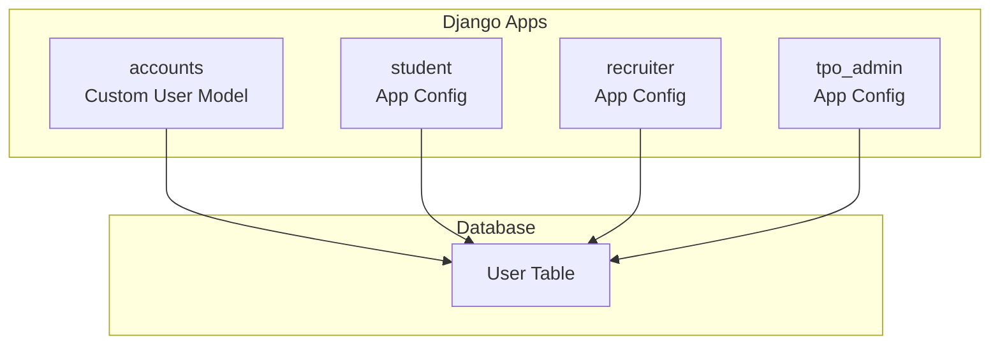
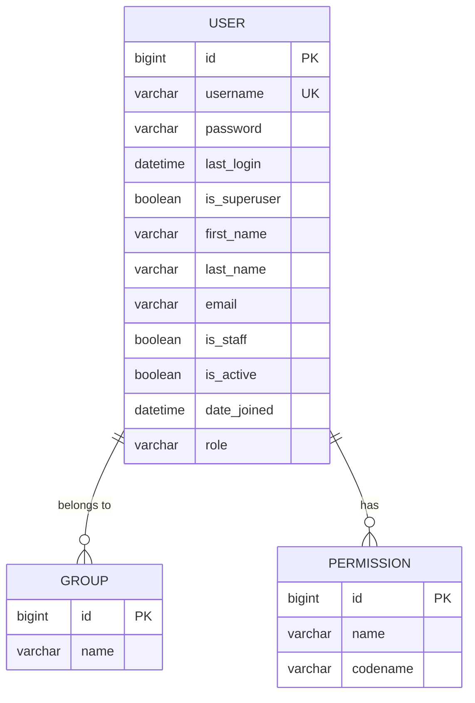
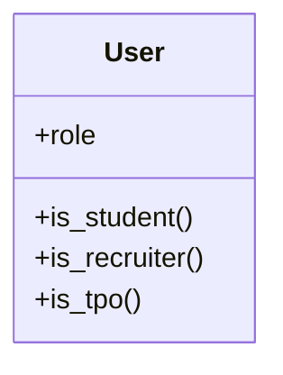
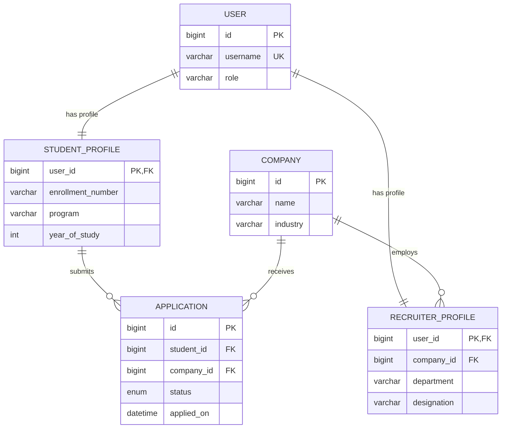
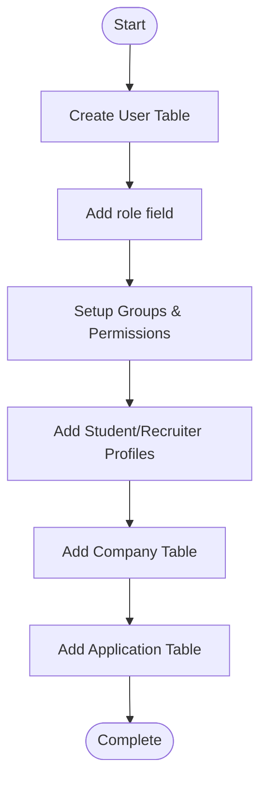
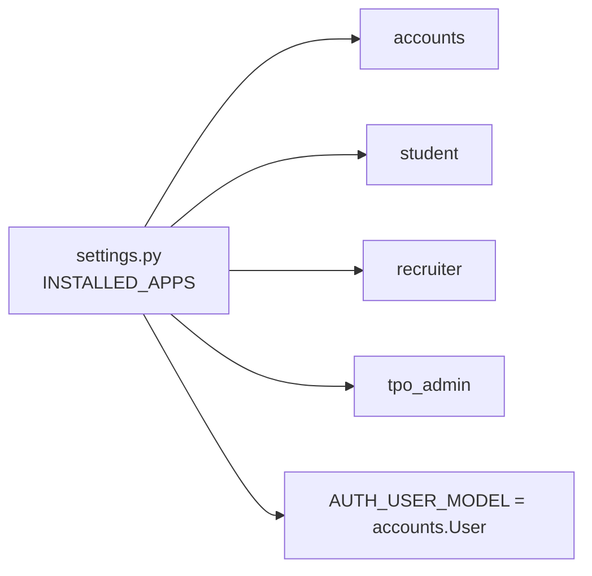

# Database Design

<cite>
**Referenced Files in This Document**
- [models.py](file://backend/accounts/models.py)
- [0001_initial.py](file://backend/accounts/migrations/0001_initial.py)
- [settings.py](file://backend/backend/settings.py)
- [apps.py (Student)](file://backend/student/apps.py)
- [apps.py (Recruiter)](file://backend/recruiter/apps.py)
- [apps.py (TPO Admin)](file://backend/tpo_admin/apps.py)
</cite>

## Table of Contents
1. [Introduction](#introduction)
2. [Project Structure](#project-structure)
3. [Core Components](#core-components)
4. [Architecture Overview](#architecture-overview)
5. [Detailed Component Analysis](#detailed-component-analysis)
6. [Dependency Analysis](#dependency-analysis)
7. [Performance Considerations](#performance-considerations)
8. [Troubleshooting Guide](#troubleshooting-guide)
9. [Conclusion](#conclusion)
10. [Appendices](#appendices)

## Introduction
This document describes the database design for the TPO Portal with a focus on the custom user model and the foundational schema. It defines the entity-relationship model for User, and outlines the intended relationships with Student, Recruiter, Company, and Application entities. It also documents field definitions, constraints, indexing strategies, validation rules, migration patterns, and operational considerations such as performance, backups, and security.

## Project Structure
The database schema is primarily defined by the custom User model and its initial migration. Supporting applications (student, recruiter, tpo_admin) are registered in Django settings but do not yet define their own models in the provided context.

**Diagram sources**
- [settings.py:27-45](file://backend/backend/settings.py#L27-L45)
- [apps.py (Student):1-7](file://backend/student/apps.py#L1-L7)
- [apps.py (Recruiter):1-7](file://backend/recruiter/apps.py#L1-L7)
- [apps.py (TPO Admin):1-7](file://backend/tpo_admin/apps.py#L1-L7)

**Section sources**
- [settings.py:27-45](file://backend/backend/settings.py#L27-L45)
- [apps.py (Student):1-7](file://backend/student/apps.py#L1-L7)
- [apps.py (Recruiter):1-7](file://backend/recruiter/apps.py#L1-L7)
- [apps.py (TPO Admin):1-7](file://backend/tpo_admin/apps.py#L1-L7)

## Core Components
- Custom User Model
  - Role-based identity with three roles: Student, Recruiter, TPO Admin.
  - Inherits from Django’s AbstractUser to reuse built-in authentication fields and permissions.
  - Stores role as a character field with predefined choices and default value.
  - Provides convenience methods to check roles.

- Initial Migration
  - Creates the User table with standard Django user fields plus the role column.
  - Includes ManyToMany relationships to Django’s Group and Permission models.
  - Uses Django’s UserManager via the migration.

- Authentication Settings
  - AUTH_USER_MODEL points to the custom User model.
  - SQLite is configured as the default database engine.

**Section sources**
- [models.py:4-25](file://backend/accounts/models.py#L4-L25)
- [0001_initial.py:18-44](file://backend/accounts/migrations/0001_initial.py#L18-L44)
- [settings.py:119](file://backend/backend/settings.py#L119)
- [settings.py:81-86](file://backend/backend/settings.py#L81-L86)

## Architecture Overview
The database architecture centers on a single User table that encapsulates authentication and role-based access. The student, recruiter, and tpo_admin apps are registered and ready to extend functionality, but their models are not present in the current codebase snapshot.

**Diagram sources**
- [0001_initial.py:20-35](file://backend/accounts/migrations/0001_initial.py#L20-L35)

**Section sources**
- [0001_initial.py:18-44](file://backend/accounts/migrations/0001_initial.py#L18-L44)

## Detailed Component Analysis

### User Entity
- Purpose: Central authentication and authorization entity with role-based access.
- Fields and Constraints:
  - Identity: auto-incrementing integer primary key.
  - Credentials: username (unique), password, email (optional).
  - Metadata: first_name, last_name, date_joined, last_login.
  - Permissions: is_staff, is_superuser, is_active.
  - Role: role with choices and default.
  - Groups and Permissions: ManyToMany to Django’s Group and Permission models.
- Validation and Security:
  - Username uniqueness enforced at the database level.
  - Built-in Django validators and password validators apply.
  - Passwords hashed by Django’s authentication backend.
- Access Control:
  - Role determines eligibility for Student, Recruiter, or TPO Admin features.
  - Convenience methods enable role checks in views and middleware.

**Diagram sources**
- [models.py:4-25](file://backend/accounts/models.py#L4-L25)

**Section sources**
- [models.py:4-25](file://backend/accounts/models.py#L4-L25)
- [0001_initial.py:20-35](file://backend/accounts/migrations/0001_initial.py#L20-L35)
- [settings.py:92-105](file://backend/backend/settings.py#L92-L105)

### Intended Entities and Relationships
Note: The following entities and relationships are defined conceptually for the TPO Portal. Their models are not present in the current code snapshot; they represent the planned schema.

- Student
  - Relationship: One-to-one with User (via a profile model).
  - Typical fields: enrollment_number, program, year_of_study, resume_link, skills.
- Recruiter
  - Relationship: One-to-one with User (via a profile model).
  - Typical fields: company_id (foreign key to Company), department, designation.
- Company
  - Relationship: One-to-many with Recruiter (many recruiters per company).
  - Typical fields: name, description, industry, location, contact_person, email.
- Application
  - Relationship: Many-to-one with Student and JobPosting; many-to-one with Company.
  - Typical fields: student_id, job_posting_id, company_id, status, applied_on, documents.

[No sources needed since this diagram shows conceptual relationships not present in the current codebase]

### Migration and Version Management
- Initial Schema Creation:
  - The initial migration creates the User table with standard fields and the role column.
  - It configures the custom manager and sets up ManyToMany relationships to Group and Permission.
- Subsequent Migrations:
  - Add new fields to existing tables or introduce new entities (Student, Recruiter, Company, Application).
  - Maintain referential integrity via foreign keys and constraints.
- Version Control:
  - Keep migrations under version control alongside application code.
  - Use atomic operations to avoid partial schema updates.

[No sources needed since this diagram shows conceptual migration flow]

**Section sources**
- [0001_initial.py:9-46](file://backend/accounts/migrations/0001_initial.py#L9-L46)

### Data Seeding Strategies
- Roles:
  - Seed initial roles via fixtures or a management command.
- Superuser:
  - Create a superuser account programmatically during setup.
- Test Data:
  - Use factories or fixtures for Students, Companies, and Applications in test environments.

[No sources needed since this section provides general guidance]

## Dependency Analysis
- App Registration:
  - The student, recruiter, and tpo_admin apps are registered in INSTALLED_APPS.
- Custom User Model:
  - AUTH_USER_MODEL points to accounts.User, ensuring all auth-related models use the custom user.
- Database Engine:
  - SQLite is configured as the default database; consider PostgreSQL for production.

**Diagram sources**
- [settings.py:27-45](file://backend/backend/settings.py#L27-L45)
- [settings.py:119](file://backend/backend/settings.py#L119)

**Section sources**
- [settings.py:27-45](file://backend/backend/settings.py#L27-L45)
- [settings.py:119](file://backend/backend/settings.py#L119)

## Performance Considerations
- Indexing
  - Ensure unique indexes on username and email for fast lookups.
  - Add indexes on role for filtering users by role.
- Queries
  - Use select_related and prefetch_related to minimize N+1 queries when fetching profiles and related entities.
  - Denormalize frequently accessed fields (e.g., role) to reduce joins.
- Caching
  - Cache role checks and permission sets at the session level.
- Storage
  - Prefer SSD storage for SQLite in development; migrate to a robust RDBMS for production.

[No sources needed since this section provides general guidance]

## Troubleshooting Guide
- Authentication Failures
  - Verify AUTH_USER_MODEL setting points to accounts.User.
  - Confirm the custom User model is migrated and the database is up to date.
- Role-Based Access Issues
  - Ensure role values match the predefined choices.
  - Check that convenience methods are invoked correctly in views and middleware.
- Database Integrity
  - Run migrations to ensure all tables and constraints are created.
  - Validate unique constraints on username and email.

**Section sources**
- [settings.py:119](file://backend/backend/settings.py#L119)
- [models.py:9-13](file://backend/accounts/models.py#L9-L13)

## Conclusion
The TPO Portal’s database design centers on a flexible, role-based User model that leverages Django’s built-in authentication while extending it for Student, Recruiter, and TPO Admin use cases. The current codebase establishes the foundation with the custom User table and initial migration. Future development should introduce Student and Recruiter profile models, Company and Application entities, and implement robust indexing, validation, and migration strategies to support scalable operations.

## Appendices

### Field Reference for User Table (as generated by initial migration)
- id: Auto-incrementing integer primary key.
- username: Unique character field.
- password: Character field for hashed passwords.
- last_login: DateTime field for tracking last login.
- is_superuser: Boolean flag for superuser status.
- first_name: Optional character field.
- last_name: Optional character field.
- email: Optional email field.
- is_staff: Boolean flag for admin site access.
- is_active: Boolean flag for active status.
- date_joined: DateTime field for account creation.
- role: Character field with predefined choices and default.

**Section sources**
- [0001_initial.py:20-35](file://backend/accounts/migrations/0001_initial.py#L20-L35)