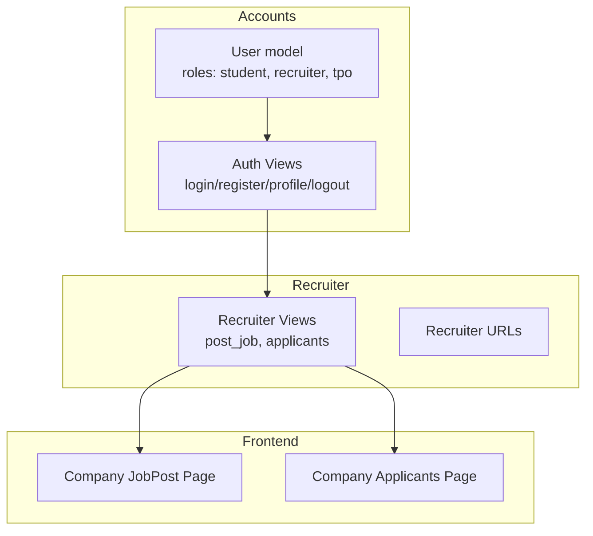
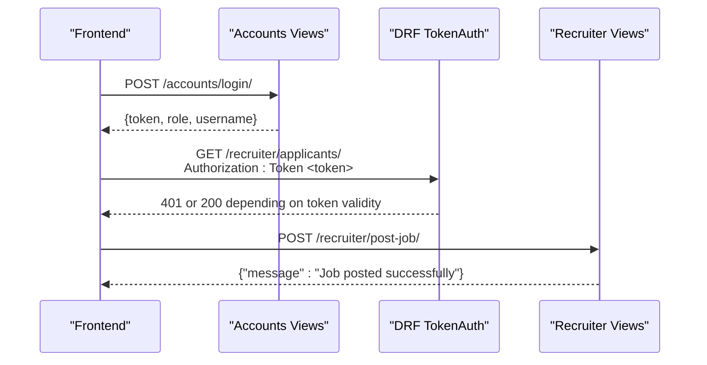
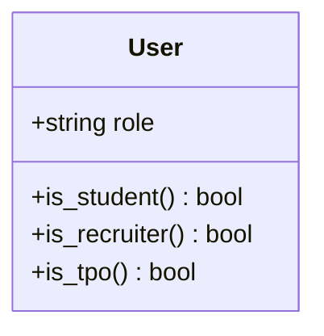
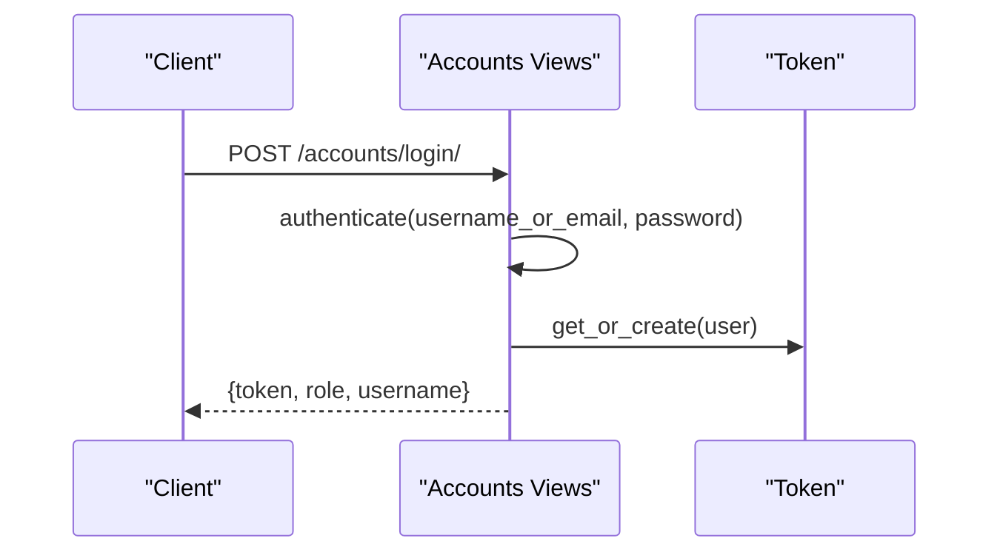
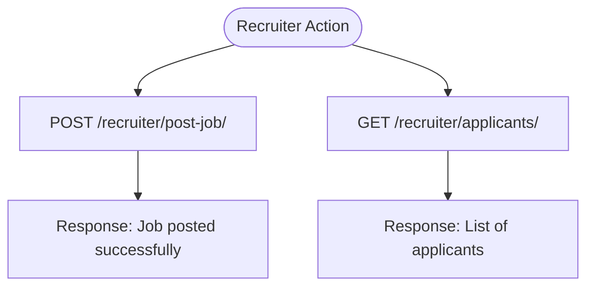
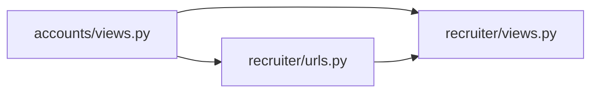

# Recruiter Model

<cite>
**Referenced Files in This Document**
- [accounts/models.py](file://backend/accounts/models.py)
- [accounts/views.py](file://backend/accounts/views.py)
- [accounts/urls.py](file://backend/accounts/urls.py)
- [recruiter/models.py](file://backend/recruiter/models.py)
- [recruiter/views.py](file://backend/recruiter/views.py)
- [recruiter/urls.py](file://backend/recruiter/urls.py)
- [recruiter/admin.py](file://backend/recruiter/admin.py)
- [accounts/migrations/0001_initial.py](file://backend/accounts/migrations/0001_initial.py)
- [frontend/src/Pages/Company/JobPost.jsx](file://frontend/src/Pages/Company/JobPost.jsx)
- [frontend/src/Pages/Company/Applicants.jsx](file://frontend/src/Pages/Company/Applicants.jsx)
</cite>

## Table of Contents
1. [Introduction](#introduction)
2. [Project Structure](#project-structure)
3. [Core Components](#core-components)
4. [Architecture Overview](#architecture-overview)
5. [Detailed Component Analysis](#detailed-component-analysis)
6. [Dependency Analysis](#dependency-analysis)
7. [Performance Considerations](#performance-considerations)
8. [Troubleshooting Guide](#troubleshooting-guide)
9. [Conclusion](#conclusion)

## Introduction
This document describes the Recruiter model and the associated company management system. It focuses on the roles and relationships between the User model and the Recruiter domain, the current state of company-related functionality, and the integration points for job posting and applicant management. It also documents authentication and authorization mechanisms, validation rules, and business logic constraints present in the codebase.

## Project Structure
The system is organized into Django applications:
- accounts: Provides the User model with role-based authentication and token-based authorization.
- recruiter: Provides endpoints for job posting and viewing applicants, intended for recruiter workflows.
- student: Contains student-facing pages and components (not part of the recruiter model but relevant for context).
- tpo_admin: Contains TPO admin functionality (not part of the recruiter model but relevant for context).

**Diagram sources**
- [accounts/models.py:4-24](file://backend/accounts/models.py#L4-L24)
- [accounts/views.py:13-94](file://backend/accounts/views.py#L13-L94)
- [recruiter/views.py:1-12](file://backend/recruiter/views.py#L1-L12)
- [recruiter/urls.py:1-8](file://backend/recruiter/urls.py#L1-L8)
- [frontend/src/Pages/Company/JobPost.jsx:1-15](file://frontend/src/Pages/Company/JobPost.jsx#L1-L15)
- [frontend/src/Pages/Company/Applicants.jsx:1-11](file://frontend/src/Pages/Company/Applicants.jsx#L1-L11)

**Section sources**
- [accounts/models.py:4-24](file://backend/accounts/models.py#L4-L24)
- [accounts/views.py:13-94](file://backend/accounts/views.py#L13-L94)
- [recruiter/views.py:1-12](file://backend/recruiter/views.py#L1-L12)
- [recruiter/urls.py:1-8](file://backend/recruiter/urls.py#L1-L8)
- [frontend/src/Pages/Company/JobPost.jsx:1-15](file://frontend/src/Pages/Company/JobPost.jsx#L1-L15)
- [frontend/src/Pages/Company/Applicants.jsx:1-11](file://frontend/src/Pages/Company/Applicants.jsx#L1-L11)

## Core Components
- User model with role field and convenience methods to check roles.
- Token-based authentication via DRF with TokenAuthentication and IsAuthenticated.
- Recruiter endpoints for job posting and listing applicants.
- Frontend pages for job posting and applicants.

Key observations:
- The Recruiter domain currently defines endpoints and URLs but does not define a separate Recruiter model in the models file.
- Company profile and job posting logic are not implemented in the backend; the recruiter endpoints are placeholders.
- The frontend pages for company operations are present and route to the recruiter endpoints.

**Section sources**
- [accounts/models.py:4-24](file://backend/accounts/models.py#L4-L24)
- [accounts/views.py:78-89](file://backend/accounts/views.py#L78-L89)
- [recruiter/views.py:1-12](file://backend/recruiter/views.py#L1-L12)
- [recruiter/urls.py:1-8](file://backend/recruiter/urls.py#L1-L8)
- [frontend/src/Pages/Company/JobPost.jsx:1-15](file://frontend/src/Pages/Company/JobPost.jsx#L1-L15)
- [frontend/src/Pages/Company/Applicants.jsx:1-11](file://frontend/src/Pages/Company/Applicants.jsx#L1-L11)

## Architecture Overview
The system uses a role-based access control pattern:
- Users are authenticated and issued tokens.
- Role checks determine access to features.
- Recruiter endpoints are exposed under the recruiter app and consumed by frontend pages.

**Diagram sources**
- [accounts/views.py:13-45](file://backend/accounts/views.py#L13-L45)
- [accounts/views.py:78-89](file://backend/accounts/views.py#L78-L89)
- [recruiter/views.py:4-8](file://backend/recruiter/views.py#L4-L8)
- [recruiter/views.py:10-11](file://backend/recruiter/views.py#L10-L11)

## Detailed Component Analysis

### User Model and Roles
The User model extends Django’s AbstractUser and adds a role field with three choices: student, recruiter, and tpo. Convenience methods are provided to check roles.

**Diagram sources**
- [accounts/models.py:4-24](file://backend/accounts/models.py#L4-L24)

**Section sources**
- [accounts/models.py:4-24](file://backend/accounts/models.py#L4-L24)
- [accounts/migrations/0001_initial.py:31](file://backend/accounts/migrations/0001_initial.py#L31)

### Authentication and Authorization
- Login supports both username and email and returns a token upon success.
- Registration creates a user with a specified role.
- Protected profile endpoint requires a valid token.
- Recruiter endpoints are decorated to exempt CSRF and rely on token-based auth at the frontend level.

**Diagram sources**
- [accounts/views.py:13-45](file://backend/accounts/views.py#L13-L45)

**Section sources**
- [accounts/views.py:13-45](file://backend/accounts/views.py#L13-L45)
- [accounts/views.py:48-75](file://backend/accounts/views.py#L48-L75)
- [accounts/views.py:78-89](file://backend/accounts/views.py#L78-L89)

### Recruiter Endpoints and Frontend Integration
- post-job endpoint returns a placeholder success message.
- applicants endpoint lists applicants for posted jobs.
- Frontend pages for job posting and applicants are present and route to these endpoints.

**Diagram sources**
- [recruiter/views.py:4-8](file://backend/recruiter/views.py#L4-L8)
- [recruiter/views.py:10-11](file://backend/recruiter/views.py#L10-L11)

**Section sources**
- [recruiter/views.py:1-12](file://backend/recruiter/views.py#L1-L12)
- [recruiter/urls.py:1-8](file://backend/recruiter/urls.py#L1-L8)
- [frontend/src/Pages/Company/JobPost.jsx:1-15](file://frontend/src/Pages/Company/JobPost.jsx#L1-L15)
- [frontend/src/Pages/Company/Applicants.jsx:1-11](file://frontend/src/Pages/Company/Applicants.jsx#L1-L11)

### Company Management and Job Posting
- Current backend state: No dedicated company or job models exist in the recruiter app. The endpoints are placeholders.
- Frontend pages indicate intended functionality for job posting and applicant viewing.

Recommendations for implementation:
- Define a Company model with fields for company profile data.
- Define a Job model with fields for job details, criteria, and approval status.
- Add foreign key relationships linking jobs to companies and applications to students and jobs.
- Implement validation rules for job posting and approval workflows.
- Integrate frontend pages with backend APIs for CRUD operations.

[No sources needed since this section proposes future implementation based on current gaps]

## Dependency Analysis
- Recruiter views depend on Django’s CSRF exemption and rely on DRF token-based auth at the client level.
- Accounts views provide authentication and token creation.
- URLs route requests to respective views.

**Diagram sources**
- [accounts/views.py:13-94](file://backend/accounts/views.py#L13-L94)
- [recruiter/views.py:1-12](file://backend/recruiter/views.py#L1-L12)
- [recruiter/urls.py:1-8](file://backend/recruiter/urls.py#L1-L8)

**Section sources**
- [accounts/views.py:13-94](file://backend/accounts/views.py#L13-L94)
- [recruiter/views.py:1-12](file://backend/recruiter/views.py#L1-L12)
- [recruiter/urls.py:1-8](file://backend/recruiter/urls.py#L1-L8)

## Performance Considerations
- Token-based authentication avoids session overhead and scales well for API workloads.
- Placeholder endpoints should be optimized with pagination and filtering for large datasets.
- Consider caching for frequently accessed company/job listings.

[No sources needed since this section provides general guidance]

## Troubleshooting Guide
Common issues and resolutions:
- Invalid credentials during login: Ensure username or email and password match a registered user.
- Token missing or invalid: Use a valid token for protected endpoints; regenerate if expired.
- CSRF errors: Recruiter endpoints are CSRF-exempt; ensure frontend sends proper Authorization headers.
- Role mismatches: Verify user role is recruiter for accessing recruiter endpoints.

**Section sources**
- [accounts/views.py:13-45](file://backend/accounts/views.py#L13-L45)
- [accounts/views.py:78-89](file://backend/accounts/views.py#L78-L89)
- [recruiter/views.py:4-8](file://backend/recruiter/views.py#L4-L8)

## Conclusion
The Recruiter model relies on the User model’s role field and token-based authentication. The recruiter app exposes endpoints for job posting and applicant listing, while the frontend pages guide recruiters through these actions. The current backend lacks a dedicated company or job model; implementing these models and integrating them with the existing authentication and routing will complete the company management system.