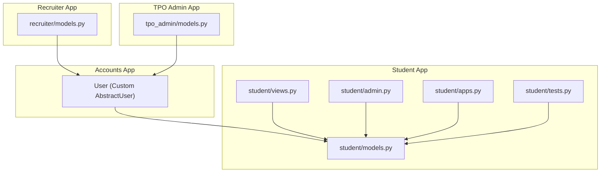
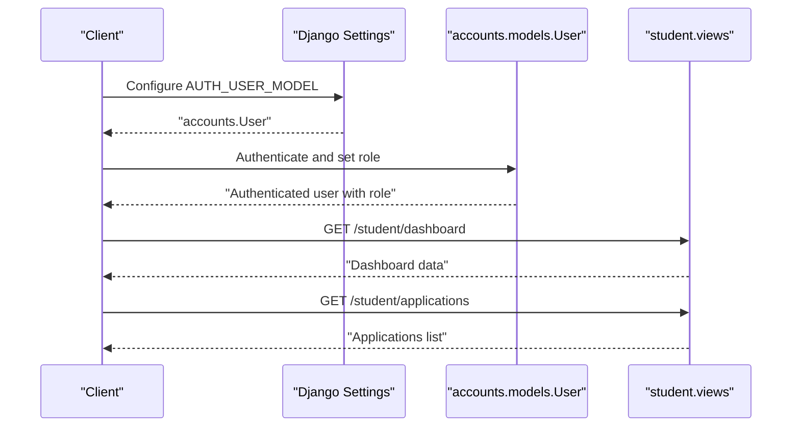
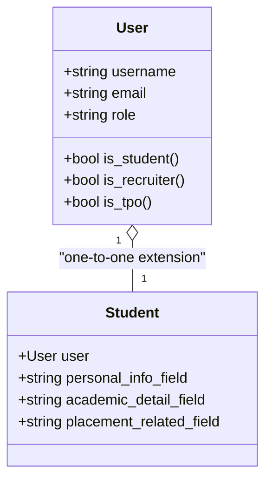
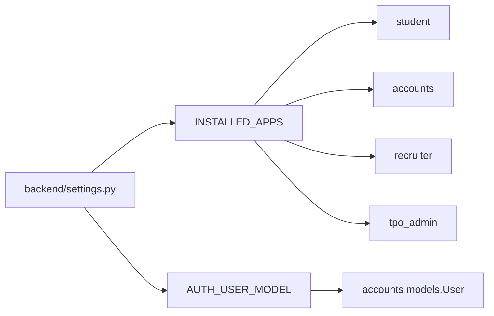

# Student Model

<cite>
**Referenced Files in This Document**
- [accounts/models.py](file://backend/accounts/models.py)
- [accounts/migrations/0001_initial.py](file://backend/accounts/migrations/0001_initial.py)
- [backend/settings.py](file://backend/backend/settings.py)
- [student/models.py](file://backend/student/models.py)
- [student/views.py](file://backend/student/views.py)
- [student/admin.py](file://backend/student/admin.py)
- [student/tests.py](file://backend/student/tests.py)
- [student/apps.py](file://backend/student/apps.py)
- [tpo_admin/models.py](file://backend/tpo_admin/models.py)
- [recruiter/models.py](file://backend/recruiter/models.py)
</cite>

## Table of Contents
1. [Introduction](#introduction)
2. [Project Structure](#project-structure)
3. [Core Components](#core-components)
4. [Architecture Overview](#architecture-overview)
5. [Detailed Component Analysis](#detailed-component-analysis)
6. [Dependency Analysis](#dependency-analysis)
7. [Performance Considerations](#performance-considerations)
8. [Troubleshooting Guide](#troubleshooting-guide)
9. [Conclusion](#conclusion)
10. [Appendices](#appendices)

## Introduction
This document provides comprehensive documentation for the Student model within the portal’s backend. It explains how student profiles extend the base user account, outlines the fields and constraints associated with student records, and describes relationships with other models such as User, Recruiter, and TPO Admin. It also covers application and placement-related workflows, privacy considerations, and operational guidance derived from the existing codebase.

## Project Structure
The project follows a modular Django layout with separate apps for accounts, student, recruiter, and tpo_admin. The User model is customized in the accounts app and serves as the base for all roles, including students. The student app currently defines minimal scaffolding and exposes basic views for dashboard and applications.

**Diagram sources**
- [accounts/models.py:1-25](file://backend/accounts/models.py#L1-L25)
- [student/models.py:1-4](file://backend/student/models.py#L1-L4)
- [student/views.py:1-8](file://backend/student/views.py#L1-L8)
- [student/admin.py:1-4](file://backend/student/admin.py#L1-L4)
- [student/apps.py:1-6](file://backend/student/apps.py#L1-L6)
- [student/tests.py:1-4](file://backend/student/tests.py#L1-L4)
- [recruiter/models.py:1-4](file://backend/recruiter/models.py#L1-L4)
- [tpo_admin/models.py:1-4](file://backend/tpo_admin/models.py#L1-L4)

**Section sources**
- [backend/settings.py:27-45](file://backend/backend/settings.py#L27-L45)
- [backend/settings.py:119](file://backend/backend/settings.py#L119)

## Core Components
- Base User model: A custom AbstractUser with role-based identity (student, recruiter, tpo). The role field determines access and behavior across the system.
- Student app: Contains minimal model scaffolding and exposes two student-specific views for dashboard and applications.
- Other apps: Recruiter and TPO Admin apps are placeholders in the current codebase.

Key observations:
- The Student model is not yet defined in the student app’s models file.
- The User model defines role enumeration and convenience methods to check roles.
- The AUTH_USER_MODEL setting points to the custom User model in the accounts app.

**Section sources**
- [accounts/models.py:4-25](file://backend/accounts/models.py#L4-L25)
- [backend/settings.py:119](file://backend/backend/settings.py#L119)
- [student/models.py:1-4](file://backend/student/models.py#L1-L4)
- [student/views.py:1-8](file://backend/student/views.py#L1-L8)

## Architecture Overview
The system uses a shared User model to unify authentication and role-based access. Students are identified by the role field and can leverage the base user fields (username, email, etc.) while extending functionality via the student app. The student app’s views expose endpoints for dashboard and applications, indicating future integration points for student-centric features.

**Diagram sources**
- [backend/settings.py:119](file://backend/backend/settings.py#L119)
- [accounts/models.py:4-25](file://backend/accounts/models.py#L4-L25)
- [student/views.py:3-7](file://backend/student/views.py#L3-L7)

## Detailed Component Analysis

### User Model (Base for Student Identity)
The User model extends Django’s AbstractUser and adds:
- Role enumeration with three choices: student, recruiter, tpo.
- Convenience methods to check the current user’s role.
- Standard user fields inherited from AbstractUser (username, email, etc.).

Constraints and behaviors:
- Role is stored as a character field with predefined choices and a default value.
- The model remains abstract for the purpose of the migration, but is concretized by Django’s manager.

Implications for Student:
- Students are represented as Users with role set to student.
- Access control and permissions can be derived from the role field.
- Extending the Student model would create a one-to-one relationship with User.

**Section sources**
- [accounts/models.py:4-25](file://backend/accounts/models.py#L4-L25)
- [accounts/migrations/0001_initial.py:18-44](file://backend/accounts/migrations/0001_initial.py#L18-L44)

### Student App Models
Current state:
- The student models file is empty, indicating the Student model is not yet defined.
- The student app is registered in INSTALLED_APPS and configured as a Django app.

Operational impact:
- Without a Student model, there is no explicit extension of the User record with student-specific fields.
- The student views return placeholder JSON responses, suggesting that student-specific data retrieval and updates are pending implementation.

**Section sources**
- [student/models.py:1-4](file://backend/student/models.py#L1-L4)
- [backend/settings.py:37](file://backend/backend/settings.py#L37)
- [student/views.py:1-8](file://backend/student/views.py#L1-L8)

### Student Views
The student app exposes two endpoints:
- GET /student/dashboard: Returns a JSON response with a dashboard message.
- GET /student/applications: Returns a JSON response listing student applications.

These endpoints indicate the intended scope of student-facing functionality and can be extended to serve real data once the Student model and related entities are implemented.

**Section sources**
- [student/views.py:3-7](file://backend/student/views.py#L3-L7)

### Admin and Tests
- Admin registration: The student admin file is empty, meaning no custom admin interface is configured for the student app at this time.
- Tests: The student test file is empty, indicating no unit tests exist for the student app yet.

**Section sources**
- [student/admin.py:1-4](file://backend/student/admin.py#L1-L4)
- [student/tests.py:1-4](file://backend/student/tests.py#L1-L4)

### Conceptual Model Relationships
Given the current codebase, the most likely relationship between User and Student is a one-to-one extension. The following conceptual diagram illustrates how a Student profile could extend the base User account.

[No sources needed since this diagram shows conceptual relationships not present in the codebase]

## Dependency Analysis
- Installed apps: The student app is included in INSTALLED_APPS alongside accounts, recruiter, and tpo_admin.
- AUTH_USER_MODEL: Points to accounts.User, ensuring all role-based logic relies on the custom User model.
- App registration: The student app is configured as a standard Django app with default auto field settings.

**Diagram sources**
- [backend/settings.py:27-45](file://backend/backend/settings.py#L27-L45)
- [backend/settings.py:119](file://backend/backend/settings.py#L119)

**Section sources**
- [backend/settings.py:27-45](file://backend/backend/settings.py#L27-L45)
- [backend/settings.py:119](file://backend/backend/settings.py#L119)

## Performance Considerations
- Role checks: Using the role field for access control is efficient and avoids heavy joins.
- One-to-one extension: If a Student model is introduced, a one-to-one relationship with User ensures O(1) lookup performance for student-specific data.
- View simplicity: Current student views return lightweight JSON responses suitable for early-stage APIs.

[No sources needed since this section provides general guidance]

## Troubleshooting Guide
- Empty student models: If queries for student data fail, confirm that the Student model is defined and migrated.
- Role-based access: Verify that the role field is correctly set for student users and that role-check methods are used consistently.
- App registration: Ensure the student app is included in INSTALLED_APPS and that migrations are applied.
- Placeholder views: Confirm that student endpoints return expected data after implementing the Student model and related logic.

**Section sources**
- [backend/settings.py:37](file://backend/backend/settings.py#L37)
- [accounts/models.py:17-24](file://backend/accounts/models.py#L17-L24)
- [student/models.py:1-4](file://backend/student/models.py#L1-L4)

## Conclusion
The current codebase establishes a robust foundation for student identity through the custom User model with role-based identification. While the Student model is not yet defined, the architecture supports a clean extension pattern that leverages the existing User infrastructure. The student app’s views and settings indicate future integration points for student dashboards and application management. As the system evolves, implementing the Student model and aligning it with the User base will enable comprehensive student profile management, application workflows, and placement-related features.

## Appendices
- Migration details: The initial User model migration includes standard user fields and the role field, confirming the baseline schema for role-based access.
- App configuration: The student app is registered and ready for model and view extensions.

**Section sources**
- [accounts/migrations/0001_initial.py:18-44](file://backend/accounts/migrations/0001_initial.py#L18-L44)
- [student/apps.py:4-6](file://backend/student/apps.py#L4-L6)