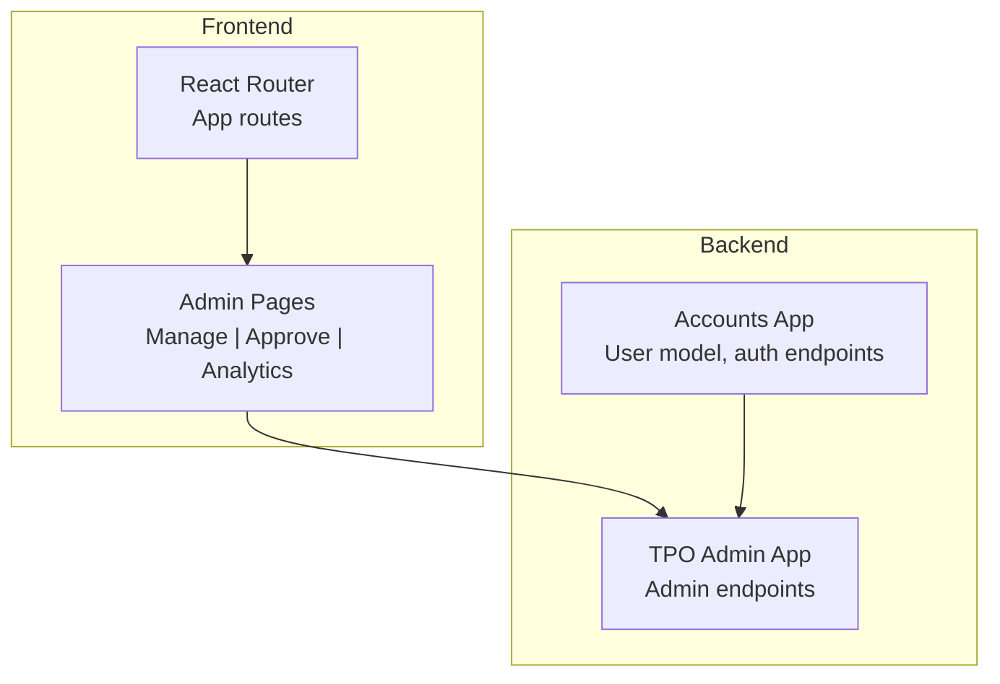
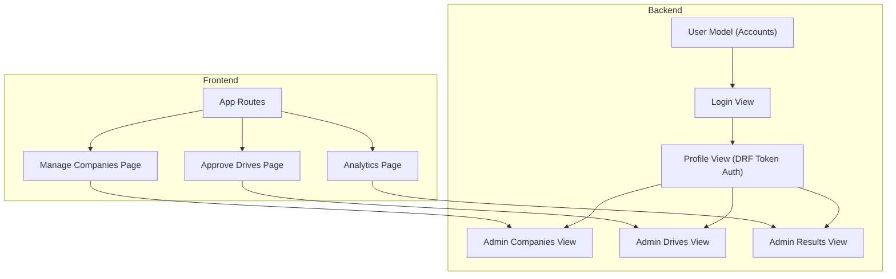
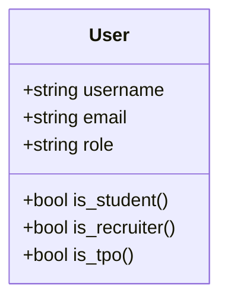
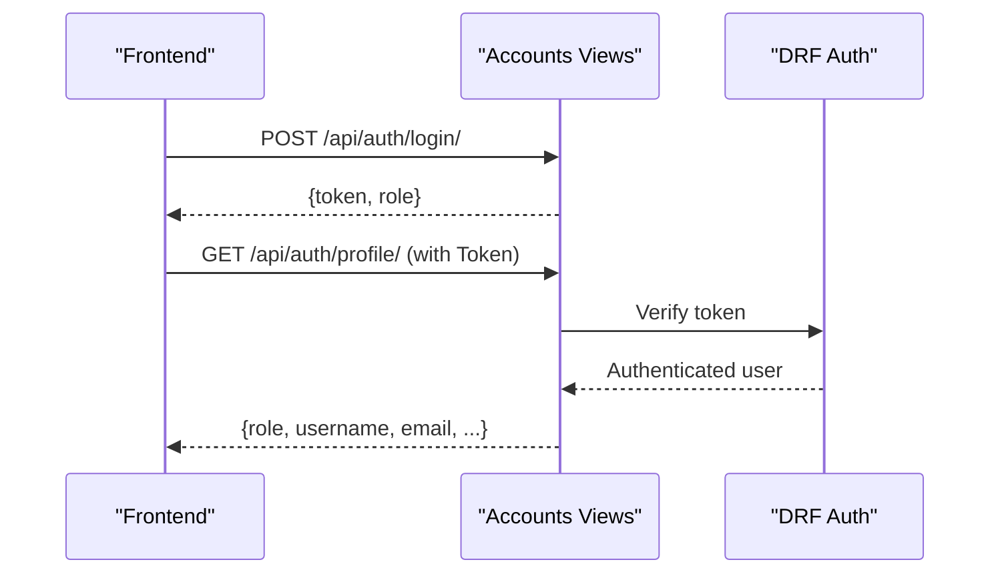
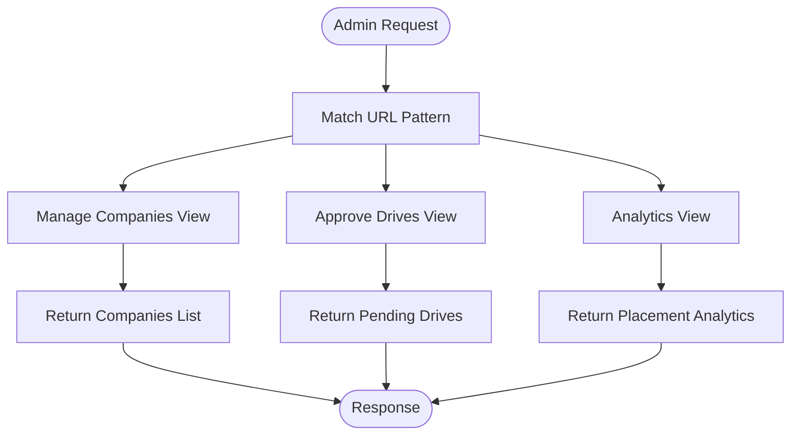
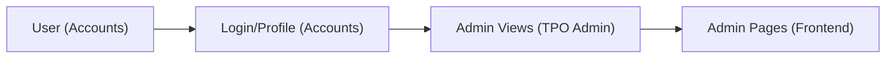

# TPO Admin Model

<cite>
**Referenced Files in This Document**
- [backend/tpo_admin/models.py](file://backend/tpo_admin/models.py)
- [backend/tpo_admin/views.py](file://backend/tpo_admin/views.py)
- [backend/tpo_admin/urls.py](file://backend/tpo_admin/urls.py)
- [backend/accounts/models.py](file://backend/accounts/models.py)
- [backend/accounts/migrations/0001_initial.py](file://backend/accounts/migrations/0001_initial.py)
- [backend/accounts/views.py](file://backend/accounts/views.py)
- [frontend/src/App.jsx](file://frontend/src/App.jsx)
- [frontend/src/Pages/Public/Login.jsx](file://frontend/src/Pages/Public/Login.jsx)
- [frontend/src/Pages/TPOAdmin/Manage.jsx](file://frontend/src/Pages/TPOAdmin/Manage.jsx)
- [frontend/src/Pages/TPOAdmin/Approve.jsx](file://frontend/src/Pages/TPOAdmin/Approve.jsx)
- [frontend/src/Pages/TPOAdmin/Analytics.jsx](file://frontend/src/Pages/TPOAdmin/Analytics.jsx)
</cite>

## Table of Contents
1. [Introduction](#introduction)
2. [Project Structure](#project-structure)
3. [Core Components](#core-components)
4. [Architecture Overview](#architecture-overview)
5. [Detailed Component Analysis](#detailed-component-analysis)
6. [Dependency Analysis](#dependency-analysis)
7. [Performance Considerations](#performance-considerations)
8. [Troubleshooting Guide](#troubleshooting-guide)
9. [Conclusion](#conclusion)

## Introduction
This document describes the TPO Admin model and administrative functions within the portal. It focuses on the administrative roles, permissions, and workflows for managing companies, approving placement drives, and generating analytics. It also documents the integration with the shared user model, authentication and authorization boundaries, and the current state of administrative endpoints and frontend pages.

## Project Structure
The TPO Admin functionality spans backend Django applications and frontend React pages:
- Backend:
  - Accounts app defines the shared user model and authentication endpoints.
  - TPO Admin app defines administrative endpoints for company management, drive approvals, and analytics.
- Frontend:
  - React routes and pages for TPO Admin dashboards and navigation.

**Section sources**
- [backend/tpo_admin/urls.py:1-9](file://backend/tpo_admin/urls.py#L1-L9)
- [frontend/src/App.jsx:18-48](file://frontend/src/App.jsx#L18-L48)

## Core Components
- User model with role field supporting three roles: student, recruiter, and TPO Admin.
- TPO Admin endpoints for:
  - Managing companies
  - Approving drives
  - Viewing analytics
- Frontend pages for TPO Admin dashboards.

Key observations:
- The TPO Admin model currently has an empty models file, indicating administrative models are not yet defined in the backend.
- Administrative endpoints are placeholders returning static messages.
- Authentication uses token-based DRF authentication for protected endpoints.

**Section sources**
- [backend/accounts/models.py:1-25](file://backend/accounts/models.py#L1-L25)
- [backend/accounts/migrations/0001_initial.py:18-44](file://backend/accounts/migrations/0001_initial.py#L18-L44)
- [backend/tpo_admin/models.py:1-4](file://backend/tpo_admin/models.py#L1-L4)
- [backend/tpo_admin/views.py:1-11](file://backend/tpo_admin/views.py#L1-L11)

## Architecture Overview
The TPO Admin architecture integrates a shared user model with role-based access and dedicated administrative endpoints. The frontend routes map to TPO Admin pages that consume these endpoints.

**Diagram sources**
- [frontend/src/App.jsx:18-48](file://frontend/src/App.jsx#L18-L48)
- [backend/accounts/views.py:13-94](file://backend/accounts/views.py#L13-L94)
- [backend/tpo_admin/views.py:1-11](file://backend/tpo_admin/views.py#L1-L11)

## Detailed Component Analysis

### User Model and Roles
The shared User model supports role-based access control:
- Role choices include student, recruiter, and TPO Admin.
- Helper methods indicate role membership.
- The migration creates the role field and assigns default values.

Administrative integration points:
- TPO Admin role enables access to admin routes and endpoints.
- Token-based authentication secures admin endpoints.

**Diagram sources**
- [backend/accounts/models.py:4-25](file://backend/accounts/models.py#L4-L25)
- [backend/accounts/migrations/0001_initial.py:18-44](file://backend/accounts/migrations/0001_initial.py#L18-L44)

**Section sources**
- [backend/accounts/models.py:1-25](file://backend/accounts/models.py#L1-L25)
- [backend/accounts/migrations/0001_initial.py:18-44](file://backend/accounts/migrations/0001_initial.py#L18-L44)

### Authentication and Authorization
- Login supports username or email and returns a token upon success.
- Profile endpoint requires a valid DRF token.
- Admin endpoints are intended to be protected by token authentication.

**Diagram sources**
- [backend/accounts/views.py:13-94](file://backend/accounts/views.py#L13-L94)

**Section sources**
- [backend/accounts/views.py:13-94](file://backend/accounts/views.py#L13-L94)

### TPO Admin Endpoints
Current state:
- Admin endpoints return placeholder responses.
- URL patterns define routes for companies, drives, and results.

Future development suggestions:
- Implement company management CRUD operations.
- Add drive approval workflows with status transitions.
- Integrate analytics queries for placement statistics.

**Diagram sources**
- [backend/tpo_admin/urls.py:4-8](file://backend/tpo_admin/urls.py#L4-L8)
- [backend/tpo_admin/views.py:3-10](file://backend/tpo_admin/views.py#L3-L10)

**Section sources**
- [backend/tpo_admin/urls.py:1-9](file://backend/tpo_admin/urls.py#L1-L9)
- [backend/tpo_admin/views.py:1-11](file://backend/tpo_admin/views.py#L1-L11)

### Frontend Admin Pages
- Manage Companies page: placeholder layout for company administration.
- Approve Drives page: placeholder layout for drive approvals.
- Analytics page: placeholder layout for placement analytics.

Routing:
- Admin routes are defined in the main App router and map to respective pages.

**Section sources**
- [frontend/src/Pages/TPOAdmin/Manage.jsx:1-11](file://frontend/src/Pages/TPOAdmin/Manage.jsx#L1-L11)
- [frontend/src/Pages/TPOAdmin/Approve.jsx:1-11](file://frontend/src/Pages/TPOAdmin/Approve.jsx#L1-L11)
- [frontend/src/Pages/TPOAdmin/Analytics.jsx:1-15](file://frontend/src/Pages/TPOAdmin/Analytics.jsx#L1-L15)
- [frontend/src/App.jsx:18-48](file://frontend/src/App.jsx#L18-L48)

## Dependency Analysis
- The TPO Admin endpoints depend on the shared User model for role checks and on token authentication for authorization.
- Frontend routes depend on backend endpoints for data and state.
- Current admin endpoints are decoupled from persistent models, focusing on API scaffolding.

**Diagram sources**
- [backend/accounts/models.py:4-25](file://backend/accounts/models.py#L4-L25)
- [backend/accounts/views.py:13-94](file://backend/accounts/views.py#L13-L94)
- [backend/tpo_admin/views.py:1-11](file://backend/tpo_admin/views.py#L1-L11)

**Section sources**
- [backend/accounts/models.py:1-25](file://backend/accounts/models.py#L1-L25)
- [backend/accounts/views.py:13-94](file://backend/accounts/views.py#L13-L94)
- [backend/tpo_admin/views.py:1-11](file://backend/tpo_admin/views.py#L1-L11)

## Performance Considerations
- Token-based authentication is lightweight and suitable for admin dashboards.
- Placeholder endpoints should be optimized to avoid unnecessary database queries until models and logic are implemented.
- Pagination and filtering should be introduced for analytics and company listings when data grows.

## Troubleshooting Guide
Common issues and resolutions:
- Authentication failures:
  - Ensure the token header is included for protected admin endpoints.
  - Verify the token exists and is not expired.
- Role redirection:
  - Confirm the user role returned during login matches expectations.
  - Adjust frontend navigation logic accordingly.
- Endpoint errors:
  - Check HTTP status codes returned by admin endpoints.
  - Validate request payloads and headers.

**Section sources**
- [backend/accounts/views.py:13-94](file://backend/accounts/views.py#L13-L94)
- [frontend/src/Pages/Public/Login.jsx:17-55](file://frontend/src/Pages/Public/Login.jsx#L17-L55)

## Conclusion
The TPO Admin module currently provides role-based access via the shared User model and token authentication, along with placeholder endpoints and frontend pages for administrative tasks. To realize full administrative capabilities, implement persistent models for companies and drives, integrate approval workflows, and populate analytics endpoints with real-time data. Establish strict authorization boundaries, enforce segregation of duties, and introduce validation and audit controls as the system evolves.