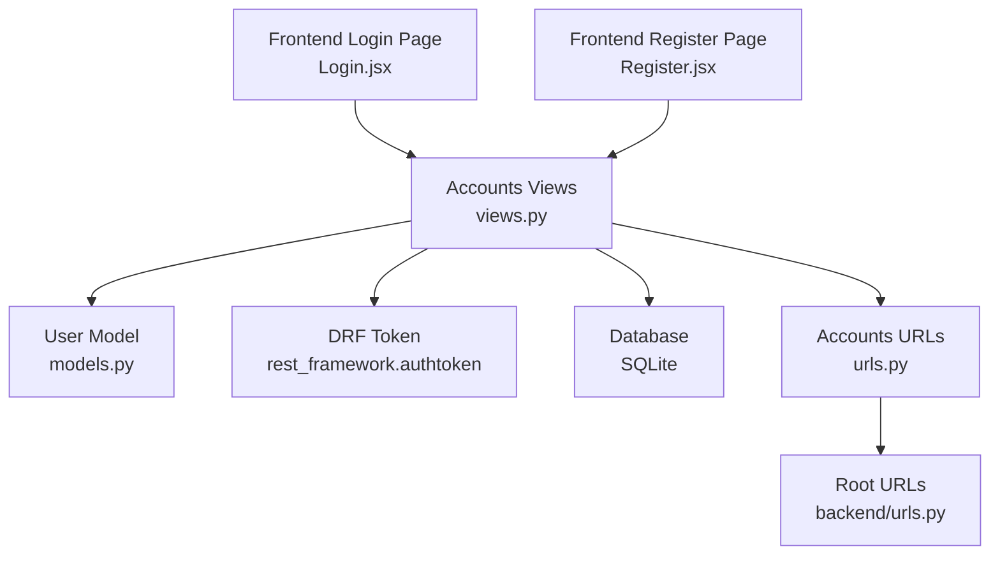
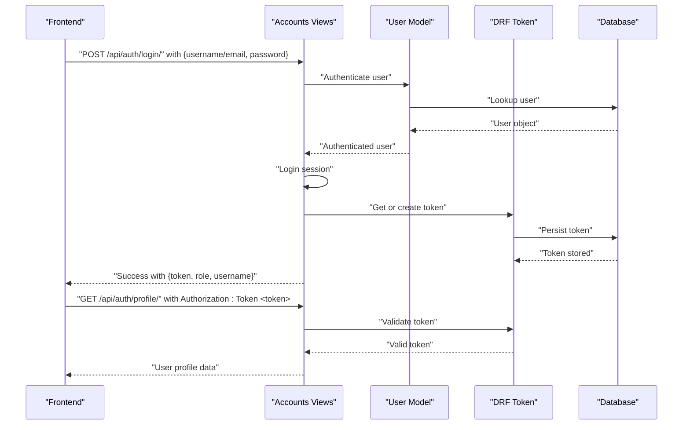
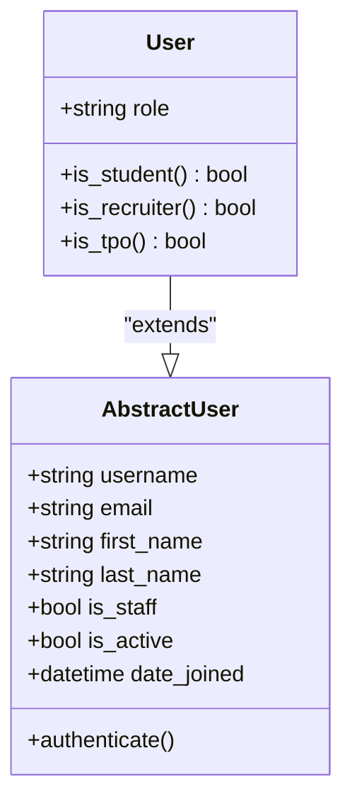
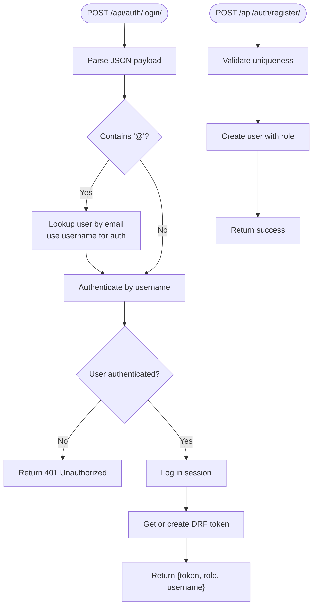
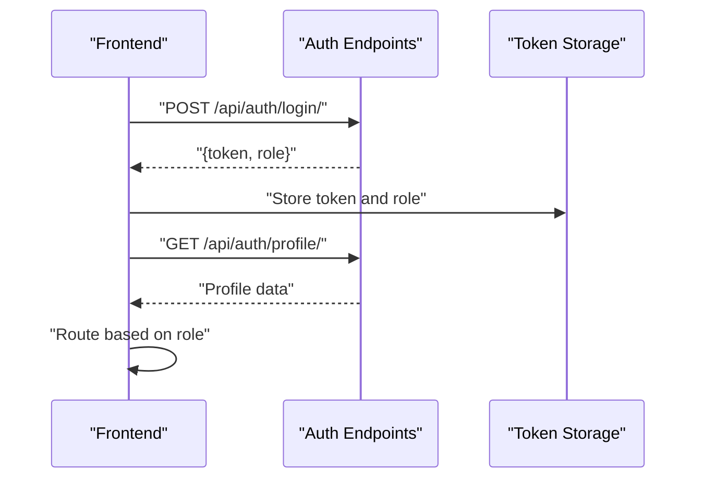
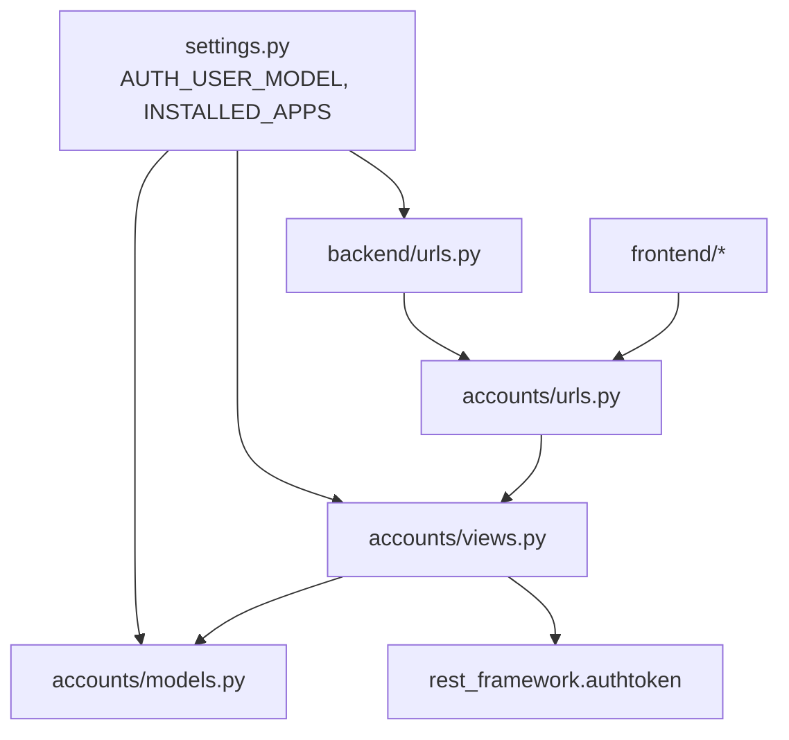

# User Model & Authentication

<cite>
**Referenced Files in This Document**
- [models.py](file://backend/accounts/models.py)
- [views.py](file://backend/accounts/views.py)
- [urls.py](file://backend/accounts/urls.py)
- [0001_initial.py](file://backend/accounts/migrations/0001_initial.py)
- [settings.py](file://backend/backend/settings.py)
- [urls.py](file://backend/backend/urls.py)
- [Login.jsx](file://frontend/src/Pages/Public/Login.jsx)
- [Register.jsx](file://frontend/src/Pages/Public/Register.jsx)
</cite>

## Table of Contents
1. [Introduction](#introduction)
2. [Project Structure](#project-structure)
3. [Core Components](#core-components)
4. [Architecture Overview](#architecture-overview)
5. [Detailed Component Analysis](#detailed-component-analysis)
6. [Dependency Analysis](#dependency-analysis)
7. [Performance Considerations](#performance-considerations)
8. [Troubleshooting Guide](#troubleshooting-guide)
9. [Conclusion](#conclusion)

## Introduction
This document explains the User model and authentication system used in the portal. It covers the custom AbstractUser inheritance pattern, role-based permissions via role constants and helpers, field definitions and validation, the authentication flow, token-based authorization, and security considerations. It also clarifies the current relationship between the User model and role-specific applications.

## Project Structure
The authentication system spans the backend accounts app and the frontend pages:
- Backend: accounts app defines the User model and exposes login/register/profile/logout endpoints.
- Frontend: Login and Register pages submit credentials to the backend and manage tokens and routing based on roles.

**Diagram sources**
- [Login.jsx:17-55](file://frontend/src/Pages/Public/Login.jsx#L17-L55)
- [Register.jsx:20-40](file://frontend/src/Pages/Public/Register.jsx#L20-L40)
- [views.py:13-94](file://backend/accounts/views.py#L13-L94)
- [models.py:4-24](file://backend/accounts/models.py#L4-L24)
- [urls.py:1-10](file://backend/accounts/urls.py#L1-L10)
- [urls.py:6](file://backend/backend/urls.py#L6)

**Section sources**
- [settings.py:27-45](file://backend/backend/settings.py#L27-L45)
- [urls.py:6](file://backend/backend/urls.py#L6)

## Core Components
- Custom User model extending Django’s AbstractUser with a role field and helper methods.
- DRF-based authentication using token-based sessions.
- Endpoints for login, registration, profile retrieval, and logout.

Key elements:
- Role constants and choices define three roles: student, recruiter, and TPO admin.
- Boolean helper methods simplify role checks in views and templates.
- Token creation on successful login and protected profile endpoint.

**Section sources**
- [models.py:4-24](file://backend/accounts/models.py#L4-L24)
- [views.py:13-94](file://backend/accounts/views.py#L13-L94)
- [0001_initial.py:32](file://backend/accounts/migrations/0001_initial.py#L32)
- [settings.py:119](file://backend/backend/settings.py#L119)

## Architecture Overview
The authentication flow integrates frontend submission, backend validation, token issuance, and protected resource access.

**Diagram sources**
- [views.py:13-45](file://backend/accounts/views.py#L13-L45)
- [views.py:78-89](file://backend/accounts/views.py#L78-L89)
- [models.py:4-24](file://backend/accounts/models.py#L4-L24)
- [urls.py:5-8](file://backend/accounts/urls.py#L5-L8)

## Detailed Component Analysis

### User Model
The User model extends Django’s AbstractUser to add a role field and convenience methods for role checks.

- Role constants and choices:
  - Constants: student, recruiter, TPO admin
  - Choices: tuples of internal value and human-readable label
- Field: role is a CharField with limited choices and a default value.
- Helper methods: is_student, is_recruiter, is_tpo returning boolean checks against the role field.

**Diagram sources**
- [models.py:4-24](file://backend/accounts/models.py#L4-L24)

**Section sources**
- [models.py:4-24](file://backend/accounts/models.py#L4-L24)
- [0001_initial.py:32](file://backend/accounts/migrations/0001_initial.py#L32)

### Authentication Endpoints
- Login endpoint accepts either username or email and password, performs dual-login lookup, authenticates, logs in the session, and creates/returns a token.
- Registration endpoint validates uniqueness and creates a user with the provided role.
- Profile endpoint requires a valid token and returns user details including role.
- Logout endpoint clears the session.

**Diagram sources**
- [views.py:13-45](file://backend/accounts/views.py#L13-L45)
- [views.py:48-75](file://backend/accounts/views.py#L48-L75)

**Section sources**
- [views.py:13-45](file://backend/accounts/views.py#L13-L45)
- [views.py:48-75](file://backend/accounts/views.py#L48-L75)
- [views.py:78-89](file://backend/accounts/views.py#L78-L89)
- [urls.py:5-8](file://backend/accounts/urls.py#L5-L8)

### Frontend Integration
- Login page sends credentials to the backend, stores token and role in local storage, fetches profile, and routes based on role.
- Register page submits registration data and navigates to login on success.

**Diagram sources**
- [Login.jsx:17-55](file://frontend/src/Pages/Public/Login.jsx#L17-L55)
- [Register.jsx:20-40](file://frontend/src/Pages/Public/Register.jsx#L20-L40)

**Section sources**
- [Login.jsx:17-55](file://frontend/src/Pages/Public/Login.jsx#L17-L55)
- [Register.jsx:20-40](file://frontend/src/Pages/Public/Register.jsx#L20-L40)

## Dependency Analysis
- Settings configure the custom user model and enable DRF token authentication.
- Root URLs route API endpoints under /api/auth/.
- Accounts views depend on the User model and DRF token models.
- Frontend depends on backend endpoints and token storage.

**Diagram sources**
- [settings.py:119](file://backend/backend/settings.py#L119)
- [settings.py:27-45](file://backend/backend/settings.py#L27-L45)
- [urls.py:6](file://backend/backend/urls.py#L6)
- [urls.py:1-10](file://backend/accounts/urls.py#L1-L10)

**Section sources**
- [settings.py:119](file://backend/backend/settings.py#L119)
- [urls.py:6](file://backend/backend/urls.py#L6)

## Performance Considerations
- Token lookup is O(1) after creation; ensure token storage is efficient and avoid unnecessary re-creation.
- Authentication queries are minimal; ensure database indexes on username and email if scaling.
- Keep payload sizes small for login/register to reduce network overhead.
- Consider rate limiting on authentication endpoints to mitigate brute-force attempts.

## Troubleshooting Guide
Common issues and resolutions:
- Invalid credentials: Verify username/email and password match; ensure dual-login logic handles email fallback.
- Token errors: Confirm Authorization header format and token validity; DRF returns 401 for invalid tokens.
- Role routing failures: Ensure frontend reads role from login response and routes accordingly.
- User enumeration concerns: The login flow avoids leaking whether an email exists by falling back to authentication if lookup fails.

**Section sources**
- [views.py:13-45](file://backend/accounts/views.py#L13-L45)
- [views.py:78-89](file://backend/accounts/views.py#L78-L89)
- [Login.jsx:17-55](file://frontend/src/Pages/Public/Login.jsx#L17-L55)

## Conclusion
The User model extends Django’s built-in authentication with a simple role field and helper methods, enabling straightforward role-based routing in the frontend. The authentication system uses DRF token authentication, providing a secure and scalable foundation. While the current implementation centralizes user data in the User model, role-specific features can be introduced later via separate models or permissions without changing the core authentication flow.