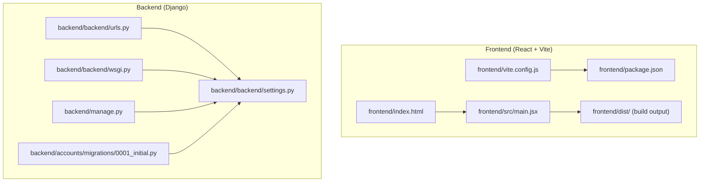
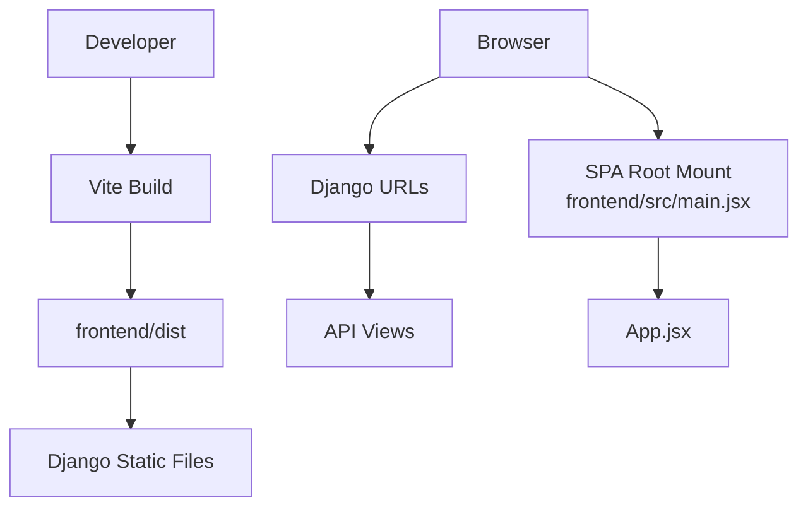
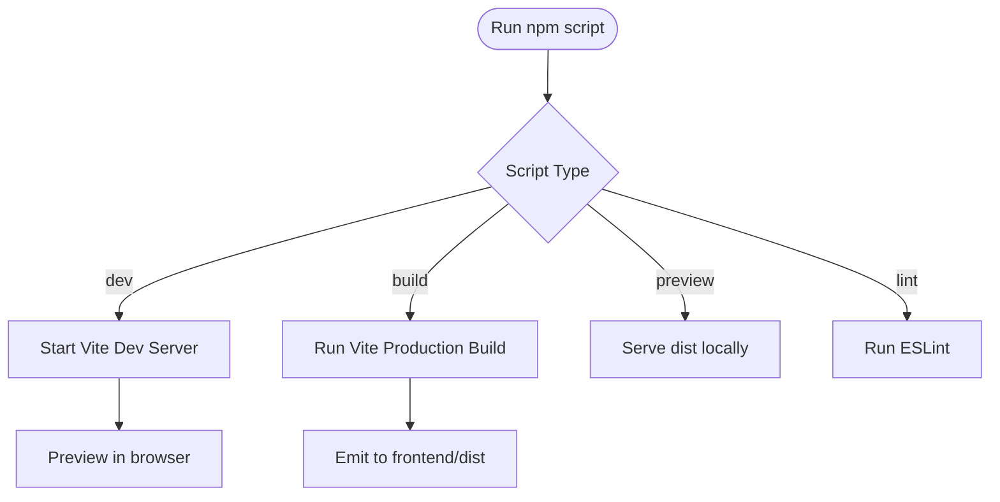
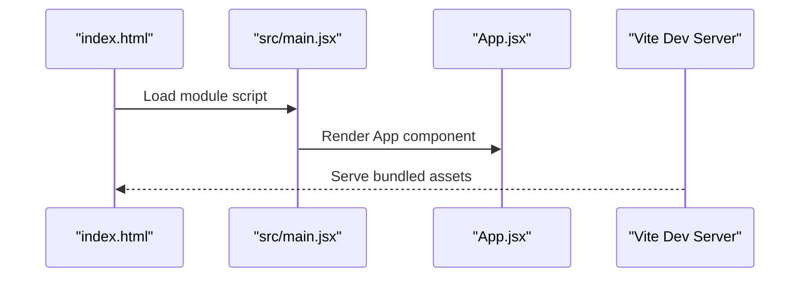
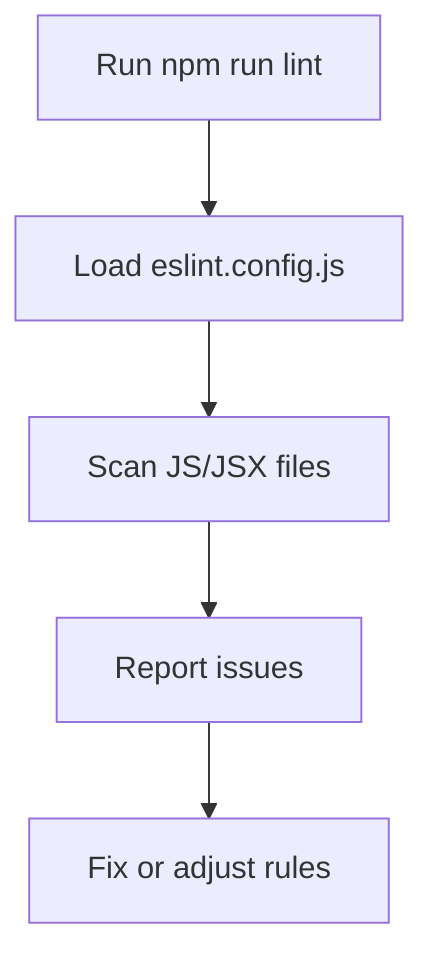
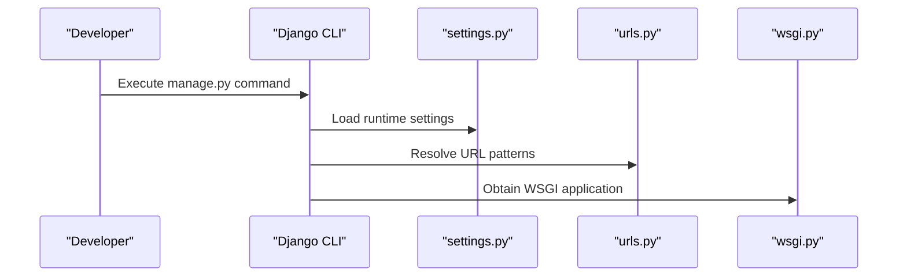
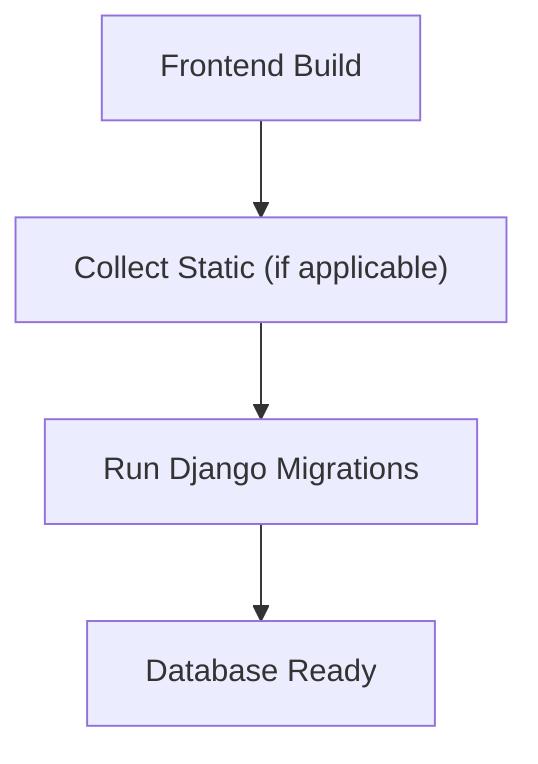
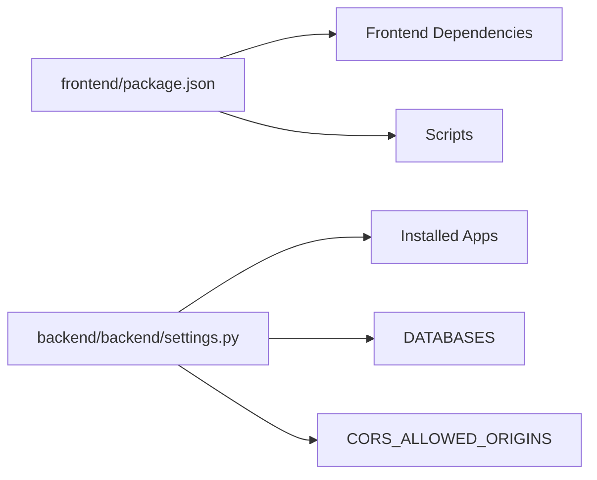

# Build Process

<cite>
**Referenced Files in This Document**
- [vite.config.js](file://frontend/vite.config.js)
- [package.json](file://frontend/package.json)
- [eslint.config.js](file://frontend/eslint.config.js)
- [index.html](file://frontend/index.html)
- [main.jsx](file://frontend/src/main.jsx)
- [settings.py](file://backend/backend/settings.py)
- [urls.py](file://backend/backend/urls.py)
- [wsgi.py](file://backend/backend/wsgi.py)
- [manage.py](file://backend/manage.py)
- [0001_initial.py](file://backend/accounts/migrations/0001_initial.py)
</cite>

## Table of Contents
1. [Introduction](#introduction)
2. [Project Structure](#project-structure)
3. [Core Components](#core-components)
4. [Architecture Overview](#architecture-overview)
5. [Detailed Component Analysis](#detailed-component-analysis)
6. [Dependency Analysis](#dependency-analysis)
7. [Performance Considerations](#performance-considerations)
8. [Troubleshooting Guide](#troubleshooting-guide)
9. [Conclusion](#conclusion)
10. [Appendices](#appendices)

## Introduction
This document describes the complete build process for the TPO Portal, covering frontend and backend systems. It explains how the frontend is built with Vite, how the backend is prepared for deployment, and how static assets produced by the frontend are integrated into the Django application. It also documents environment-specific configurations, linting and quality checks, and practical guidance for troubleshooting and performance optimization.

## Project Structure
The build system spans two primary areas:
- Frontend: React application built with Vite, producing optimized assets under the frontend/dist directory.
- Backend: Django application serving the API and serving the single-page application’s static assets.

Key build artifacts and configuration locations:
- Frontend build output: frontend/dist
- Frontend build configuration: frontend/vite.config.js
- Frontend scripts and dependencies: frontend/package.json
- Frontend linting configuration: frontend/eslint.config.js
- Backend runtime configuration: backend/backend/settings.py
- Backend URL routing: backend/backend/urls.py
- Backend WSGI entrypoint: backend/backend/wsgi.py
- Backend management entrypoint: backend/manage.py
- Initial database migration: backend/accounts/migrations/0001_initial.py

**Diagram sources**
- [vite.config.js:1-9](file://frontend/vite.config.js#L1-L9)
- [package.json:1-34](file://frontend/package.json#L1-L34)
- [index.html:1-14](file://frontend/index.html#L1-L14)
- [main.jsx:1-11](file://frontend/src/main.jsx#L1-L11)
- [settings.py:1-126](file://backend/backend/settings.py#L1-L126)
- [urls.py:1-11](file://backend/backend/urls.py#L1-L11)
- [wsgi.py:1-17](file://backend/backend/wsgi.py#L1-L17)
- [manage.py:1-23](file://backend/manage.py#L1-L23)
- [0001_initial.py:1-46](file://backend/accounts/migrations/0001_initial.py#L1-L46)

**Section sources**
- [vite.config.js:1-9](file://frontend/vite.config.js#L1-L9)
- [package.json:1-34](file://frontend/package.json#L1-L34)
- [index.html:1-14](file://frontend/index.html#L1-L14)
- [main.jsx:1-11](file://frontend/src/main.jsx#L1-L11)
- [settings.py:1-126](file://backend/backend/settings.py#L1-L126)
- [urls.py:1-11](file://backend/backend/urls.py#L1-L11)
- [wsgi.py:1-17](file://backend/backend/wsgi.py#L1-L17)
- [manage.py:1-23](file://backend/manage.py#L1-L23)
- [0001_initial.py:1-46](file://backend/accounts/migrations/0001_initial.py#L1-L46)

## Core Components
- Frontend build pipeline powered by Vite with React and Tailwind CSS plugins.
- Linting via ESLint with a flat config.
- Backend Django settings enabling static files and CORS for local development.
- Django URL routing exposing API endpoints and integrating the SPA.
- Database initialized with an initial migration for the accounts app.

**Section sources**
- [vite.config.js:1-9](file://frontend/vite.config.js#L1-L9)
- [package.json:6-11](file://frontend/package.json#L6-L11)
- [eslint.config.js:1-30](file://frontend/eslint.config.js#L1-L30)
- [settings.py:18-22](file://backend/backend/settings.py#L18-L22)
- [urls.py:4-10](file://backend/backend/urls.py#L4-L10)
- [0001_initial.py:9-45](file://backend/accounts/migrations/0001_initial.py#L9-L45)

## Architecture Overview
The build architecture connects the frontend and backend as follows:
- Vite compiles the React application and emits static assets to frontend/dist.
- Django serves the SPA via its static file configuration and routes API traffic to respective apps.
- The frontend’s index.html mounts the React root, which renders the application.

**Diagram sources**
- [vite.config.js:1-9](file://frontend/vite.config.js#L1-L9)
- [package.json:6-11](file://frontend/package.json#L6-L11)
- [index.html:9-12](file://frontend/index.html#L9-L12)
- [main.jsx:1-11](file://frontend/src/main.jsx#L1-L11)
- [settings.py:122-126](file://backend/backend/settings.py#L122-L126)
- [urls.py:4-10](file://backend/backend/urls.py#L4-L10)

## Detailed Component Analysis

### Frontend Build Configuration (Vite)
- Plugins: React refresh and Tailwind CSS integration are enabled.
- Scripts: Development server, production build, preview, and lint commands are exposed via package.json.
- Asset output: Vite writes compiled assets to frontend/dist, including index.html and hashed assets.

**Diagram sources**
- [vite.config.js:1-9](file://frontend/vite.config.js#L1-L9)
- [package.json:6-11](file://frontend/package.json#L6-L11)

**Section sources**
- [vite.config.js:1-9](file://frontend/vite.config.js#L1-L9)
- [package.json:6-11](file://frontend/package.json#L6-L11)

### Frontend Asset Pipeline and Entry Points
- Entry point: frontend/src/main.jsx creates the React root and mounts App.jsx.
- HTML template: frontend/index.html defines the DOM container and loads the module entry.
- Tailwind CSS: configured via @tailwindcss/vite plugin; no explicit postcss/tailwind config files are present in the repository snapshot.

**Diagram sources**
- [index.html:9-12](file://frontend/index.html#L9-L12)
- [main.jsx:1-11](file://frontend/src/main.jsx#L1-L11)

**Section sources**
- [index.html:1-14](file://frontend/index.html#L1-L14)
- [main.jsx:1-11](file://frontend/src/main.jsx#L1-L11)

### Frontend Quality Assurance and Linting
- ESLint configuration uses a flat config with recommended rules, React hooks, and React Refresh presets.
- Ignores the dist directory to avoid linting generated assets.
- Provides a lint script in package.json.

**Diagram sources**
- [eslint.config.js:1-30](file://frontend/eslint.config.js#L1-L30)
- [package.json:9-9](file://frontend/package.json#L9-L9)

**Section sources**
- [eslint.config.js:1-30](file://frontend/eslint.config.js#L1-L30)
- [package.json:9-9](file://frontend/package.json#L9-L9)

### Backend Build and Runtime Preparation
- Settings: Enables CORS for local Vite dev server origins, configures SQLite as the default database, and sets static files URL.
- URL routing: Exposes API endpoints under /api/ paths.
- WSGI: Provides the WSGI application entrypoint for deployment servers.
- Management: Provides the manage.py entrypoint to run Django commands.

**Diagram sources**
- [manage.py:7-18](file://backend/manage.py#L7-L18)
- [settings.py:18-22](file://backend/backend/settings.py#L18-L22)
- [urls.py:4-10](file://backend/backend/urls.py#L4-L10)
- [wsgi.py:10-16](file://backend/backend/wsgi.py#L10-L16)

**Section sources**
- [settings.py:18-22](file://backend/backend/settings.py#L18-L22)
- [settings.py:81-86](file://backend/backend/settings.py#L81-L86)
- [settings.py:122-126](file://backend/backend/settings.py#L122-L126)
- [urls.py:4-10](file://backend/backend/urls.py#L4-L10)
- [wsgi.py:10-16](file://backend/backend/wsgi.py#L10-L16)
- [manage.py:7-18](file://backend/manage.py#L7-L18)

### Database Preparation and Migrations
- Initial migration: Creates the User model with role choices and related fields.
- Typical workflow: After building the frontend, run Django migrations to prepare the database.

**Diagram sources**
- [0001_initial.py:18-44](file://backend/accounts/migrations/0001_initial.py#L18-L44)

**Section sources**
- [0001_initial.py:1-46](file://backend/accounts/migrations/0001_initial.py#L1-L46)

## Dependency Analysis
- Frontend dependencies include React, React Router, Axios, Tailwind CSS, and Vite with React/Tailwind plugins.
- Backend depends on Django, Django REST Framework, and CORS headers for local development.
- No explicit environment-specific overrides are shown in the repository snapshot.

**Diagram sources**
- [package.json:12-32](file://frontend/package.json#L12-L32)
- [settings.py:27-45](file://backend/backend/settings.py#L27-L45)
- [settings.py:81-86](file://backend/backend/settings.py#L81-L86)
- [settings.py:18-22](file://backend/backend/settings.py#L18-L22)

**Section sources**
- [package.json:12-32](file://frontend/package.json#L12-L32)
- [settings.py:27-45](file://backend/backend/settings.py#L27-L45)
- [settings.py:81-86](file://backend/backend/settings.py#L81-L86)
- [settings.py:18-22](file://backend/backend/settings.py#L18-L22)

## Performance Considerations
- Frontend
  - Prefer tree-shaking and code splitting via Vite defaults.
  - Minimize heavy third-party dependencies; monitor bundle size after adding new packages.
  - Use Tailwind CSS efficiently; avoid unused utilities in production builds.
- Backend
  - Keep DEBUG disabled in production environments.
  - Configure a proper static files handler in the web server (e.g., Nginx) to serve frontend/dist directly.
  - Use a production WSGI server (e.g., Gunicorn) behind a reverse proxy.

[No sources needed since this section provides general guidance]

## Troubleshooting Guide
- Frontend
  - Vite dev server not starting: Verify Node.js and npm versions meet plugin requirements; check port conflicts.
  - Tailwind CSS not applied: Confirm Tailwind plugin is loaded; ensure Tailwind directives are present in CSS.
  - Build fails: Inspect lint errors reported by npm run lint; resolve TypeScript/ESLint issues.
- Backend
  - CORS errors in development: Ensure CORS_ALLOWED_ORIGINS includes the frontend origin.
  - Static files not served: Confirm STATIC_URL and static file configuration; collect static if needed.
  - Database errors: Run migrations using the Django management command; verify DATABASES settings.
- General
  - Environment variables: Set DJANGO_SETTINGS_MODULE appropriately when invoking Django commands.
  - Package lock integrity: If dependency resolution issues occur, synchronize with package-lock.json.

**Section sources**
- [vite.config.js:1-9](file://frontend/vite.config.js#L1-L9)
- [package.json:6-11](file://frontend/package.json#L6-L11)
- [eslint.config.js:1-30](file://frontend/eslint.config.js#L1-L30)
- [settings.py:18-22](file://backend/backend/settings.py#L18-L22)
- [settings.py:122-126](file://backend/backend/settings.py#L122-L126)
- [manage.py:7-18](file://backend/manage.py#L7-L18)
- [0001_initial.py:1-46](file://backend/accounts/migrations/0001_initial.py#L1-L46)

## Conclusion
The TPO Portal build process combines a modern frontend built with Vite and React and a robust backend powered by Django. The frontend build produces optimized assets that integrate seamlessly with Django’s static file serving. By following the documented scripts, configurations, and quality checks, teams can reliably develop, test, and deploy the application across environments.

[No sources needed since this section summarizes without analyzing specific files]

## Appendices
- Build Commands Reference
  - Frontend
    - Development: npm run dev
    - Production build: npm run build
    - Preview: npm run preview
    - Lint: npm run lint
  - Backend
    - Migrate: python backend/manage.py migrate
    - Run server: python backend/manage.py runserver

**Section sources**
- [package.json:6-11](file://frontend/package.json#L6-L11)
- [manage.py:7-18](file://backend/manage.py#L7-L18)