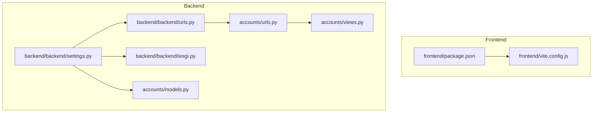
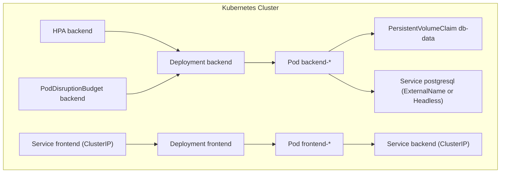
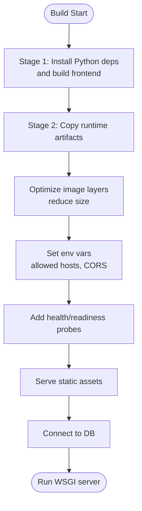
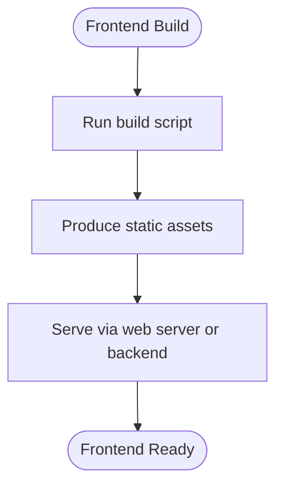
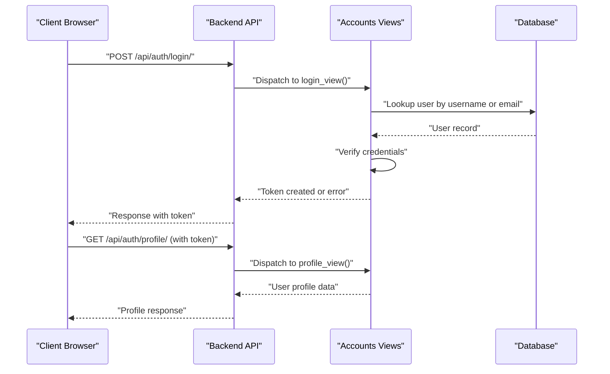
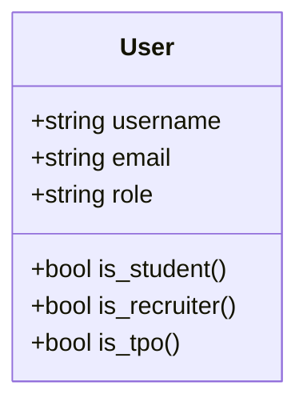
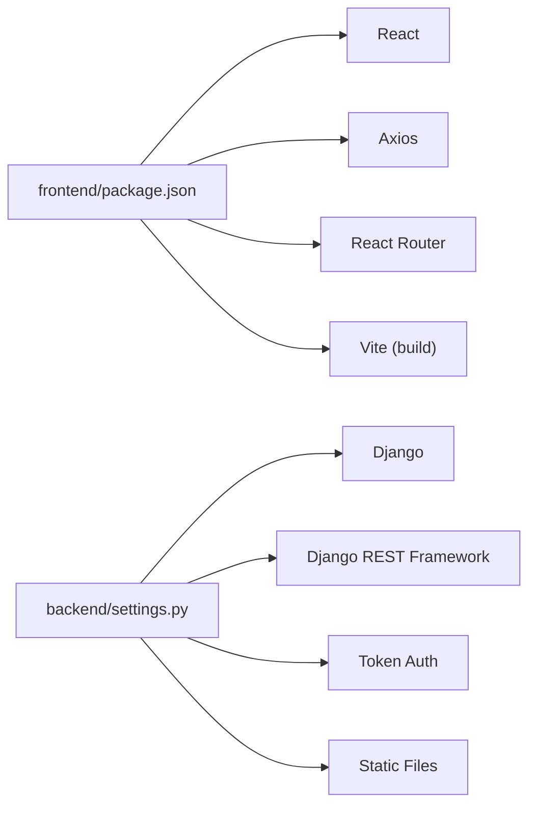

# Containerization & Scaling

<cite>
**Referenced Files in This Document**
- [backend/settings.py](file://backend/backend/settings.py)
- [backend/urls.py](file://backend/backend/urls.py)
- [backend/wsgi.py](file://backend/backend/wsgi.py)
- [backend/manage.py](file://backend/manage.py)
- [accounts/views.py](file://backend/accounts/views.py)
- [accounts/urls.py](file://backend/accounts/urls.py)
- [accounts/models.py](file://backend/accounts/models.py)
- [frontend/package.json](file://frontend/package.json)
- [frontend/vite.config.js](file://frontend/vite.config.js)
</cite>

## Table of Contents
1. [Introduction](#introduction)
2. [Project Structure](#project-structure)
3. [Core Components](#core-components)
4. [Architecture Overview](#architecture-overview)
5. [Detailed Component Analysis](#detailed-component-analysis)
6. [Dependency Analysis](#dependency-analysis)
7. [Performance Considerations](#performance-considerations)
8. [Troubleshooting Guide](#troubleshooting-guide)
9. [Conclusion](#conclusion)
10. [Appendices](#appendices)

## Introduction
This document provides containerization and scaling guidance for the TPO Portal, covering both frontend and backend services. It outlines Docker strategies (including multi-stage builds and image optimization), Kubernetes deployment configurations, service orchestration, auto-scaling policies, networking, volumes, inter-service communication, container registry practices, image versioning, rollout strategies, horizontal scaling, load balancing, and monitoring approaches tailored for production workloads.

## Project Structure
The TPO Portal consists of:
- A Django-based backend exposing REST APIs under a unified URL namespace.
- A React-based frontend built via Vite and served statically by the backend.

Key runtime characteristics:
- Backend runs a WSGI application with Django REST Framework and token-based authentication.
- Frontend is a static SPA built during CI/CD and served by the backend’s static files pipeline.

**Diagram sources**
- [backend/backend/settings.py:1-126](file://backend/backend/settings.py#L1-L126)
- [backend/backend/urls.py:1-11](file://backend/backend/urls.py#L1-L11)
- [backend/backend/wsgi.py:1-17](file://backend/backend/wsgi.py#L1-L17)
- [backend/accounts/views.py:1-95](file://backend/accounts/views.py#L1-L95)
- [backend/accounts/urls.py:1-10](file://backend/accounts/urls.py#L1-L10)
- [backend/accounts/models.py:1-25](file://backend/accounts/models.py#L1-L25)
- [frontend/package.json:1-34](file://frontend/package.json#L1-L34)
- [frontend/vite.config.js:1-9](file://frontend/vite.config.js#L1-L9)

**Section sources**
- [backend/backend/settings.py:1-126](file://backend/backend/settings.py#L1-L126)
- [backend/backend/urls.py:1-11](file://backend/backend/urls.py#L1-L11)
- [backend/backend/wsgi.py:1-17](file://backend/backend/wsgi.py#L1-L17)
- [backend/accounts/views.py:1-95](file://backend/accounts/views.py#L1-L95)
- [backend/accounts/urls.py:1-10](file://backend/accounts/urls.py#L1-L10)
- [backend/accounts/models.py:1-25](file://backend/accounts/models.py#L1-L25)
- [frontend/package.json:1-34](file://frontend/package.json#L1-L34)
- [frontend/vite.config.js:1-9](file://frontend/vite.config.js#L1-L9)

## Core Components
- Backend service
  - Django WSGI application configured for REST APIs and token authentication.
  - URL routing aggregates app-specific namespaces.
  - Static files configured for serving frontend assets.
- Authentication service
  - Token-based login, registration, profile retrieval, and logout endpoints.
  - Supports dual-login via username or email.
- Frontend service
  - React SPA built with Vite and served as static assets by the backend.

Operational implications for containerization:
- Backend container must expose the WSGI application port and serve static assets.
- Frontend build artifacts are produced during CI/CD and consumed by the backend container.
- Authentication endpoints require a persistent database for user records and tokens.

**Section sources**
- [backend/backend/settings.py:1-126](file://backend/backend/settings.py#L1-L126)
- [backend/backend/urls.py:1-11](file://backend/backend/urls.py#L1-L11)
- [backend/accounts/views.py:1-95](file://backend/accounts/views.py#L1-L95)
- [frontend/package.json:1-34](file://frontend/package.json#L1-L34)

## Architecture Overview
The TPO Portal follows a classic monolith backend with a separate SPA frontend. For containerized deployments:
- Backend container serves both REST APIs and static assets.
- Frontend build is integrated into the backend image or mounted as a volume.
- Optional external database container or managed service for production.

[No sources needed since this diagram shows conceptual workflow, not actual code structure]

## Detailed Component Analysis

### Backend Containerization Strategy
- Base image selection
  - Use a minimal Python base image for the backend container.
- Multi-stage build
  - Stage 1: Install Python dependencies and build frontend assets.
  - Stage 2: Copy only runtime artifacts into a clean final image to reduce attack surface.
- Environment configuration
  - Set Django settings module and runtime variables via environment variables.
  - Configure allowed hosts and CORS origins for containerized environments.
- Health checks
  - Add readiness/liveness probes targeting a lightweight internal endpoint.
- Static assets
  - Serve built frontend from backend static directory.
- Database connectivity
  - Configure database host/port via environment variables; mount persistent volumes for local SQLite or connect to managed PostgreSQL.

[No sources needed since this diagram shows conceptual workflow, not actual code structure]

**Section sources**
- [backend/backend/settings.py:1-126](file://backend/backend/settings.py#L1-L126)
- [backend/backend/wsgi.py:1-17](file://backend/backend/wsgi.py#L1-L17)
- [frontend/package.json:1-34](file://frontend/package.json#L1-L34)

### Frontend Containerization Strategy
- Build phase
  - Use a Node.js base image to run the build script and produce static assets.
- Runtime phase
  - Serve static assets from a lightweight web server or directly from the backend container.
- Optimization
  - Minimize bundle size and enable gzip/brotli compression.
- Versioning
  - Tag images with semantic versions and commit hashes.

[No sources needed since this diagram shows conceptual workflow, not actual code structure]

**Section sources**
- [frontend/package.json:1-34](file://frontend/package.json#L1-L34)
- [frontend/vite.config.js:1-9](file://frontend/vite.config.js#L1-L9)

### Authentication Flow (Containerized)

**Diagram sources**
- [accounts/views.py:1-95](file://backend/accounts/views.py#L1-L95)
- [accounts/urls.py:1-10](file://backend/accounts/urls.py#L1-L10)
- [backend/backend/urls.py:1-11](file://backend/backend/urls.py#L1-L11)

**Section sources**
- [accounts/views.py:1-95](file://backend/accounts/views.py#L1-L95)
- [accounts/urls.py:1-10](file://backend/accounts/urls.py#L1-L10)
- [backend/backend/urls.py:1-11](file://backend/backend/urls.py#L1-L11)

### Database Model Overview

**Diagram sources**
- [accounts/models.py:1-25](file://backend/accounts/models.py#L1-L25)

**Section sources**
- [accounts/models.py:1-25](file://backend/accounts/models.py#L1-L25)

## Dependency Analysis
Runtime dependencies and their impact on containerization:
- Backend depends on Django, Django REST Framework, and token authentication.
- Frontend depends on React, React Router, Axios, and Vite for building.
- Static asset delivery requires backend static file configuration.

**Diagram sources**
- [frontend/package.json:1-34](file://frontend/package.json#L1-L34)
- [backend/backend/settings.py:1-126](file://backend/backend/settings.py#L1-L126)

**Section sources**
- [frontend/package.json:1-34](file://frontend/package.json#L1-L34)
- [backend/backend/settings.py:1-126](file://backend/backend/settings.py#L1-L126)

## Performance Considerations
- Image size and startup time
  - Use multi-stage builds to minimize final image size.
  - Pin dependency versions to improve reproducibility and cache hits.
- Static asset delivery
  - Enable compression and caching headers in the web server or backend.
- Database performance
  - Use connection pooling and appropriate database sizing for production.
- Horizontal scaling
  - Stateless backend pods scale horizontally behind a load balancer.
  - Persistent volumes for databases and shared caches.

[No sources needed since this section provides general guidance]

## Troubleshooting Guide
Common containerization and scaling issues:
- Port exposure and service discovery
  - Ensure the backend container exposes the WSGI port and that Kubernetes Services target the correct ports.
- CORS and allowed hosts
  - Update allowed hosts and CORS origins for containerized environments.
- Static assets not loading
  - Verify static file configuration and that the frontend build artifacts are present in the backend container.
- Authentication failures
  - Confirm token creation and retrieval endpoints are reachable and that the database is initialized.
- Database connectivity
  - Validate environment variables for database host, port, and credentials; ensure PVCs or external services are reachable.

**Section sources**
- [backend/backend/settings.py:1-126](file://backend/backend/settings.py#L1-L126)
- [backend/accounts/views.py:1-95](file://backend/accounts/views.py#L1-L95)

## Conclusion
By adopting multi-stage Docker builds, optimizing images, and leveraging Kubernetes primitives (Deployments, Services, HPA, PDB, PVCs), the TPO Portal can achieve reliable, scalable, and secure containerized operations. Proper configuration of networking, volumes, and authentication ensures smooth production deployments and efficient horizontal scaling.

[No sources needed since this section summarizes without analyzing specific files]

## Appendices

### Kubernetes Deployment Checklist
- Define backend and frontend Deployments with resource requests/limits.
- Expose Services (ClusterIP/LoadBalancer) and configure DNS/ingress.
- Set up HPA based on CPU/memory or custom metrics.
- Configure PodDisruptionBudgets for high availability.
- Provision PVCs for databases and backups.
- Implement rolling updates with safe rollback strategies.
- Add monitoring and logging integrations.

[No sources needed since this section provides general guidance]