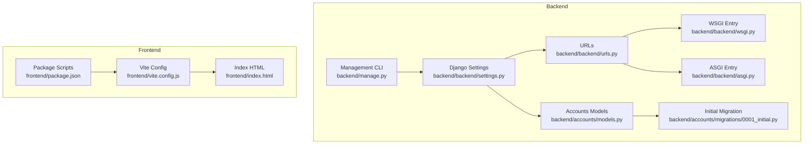
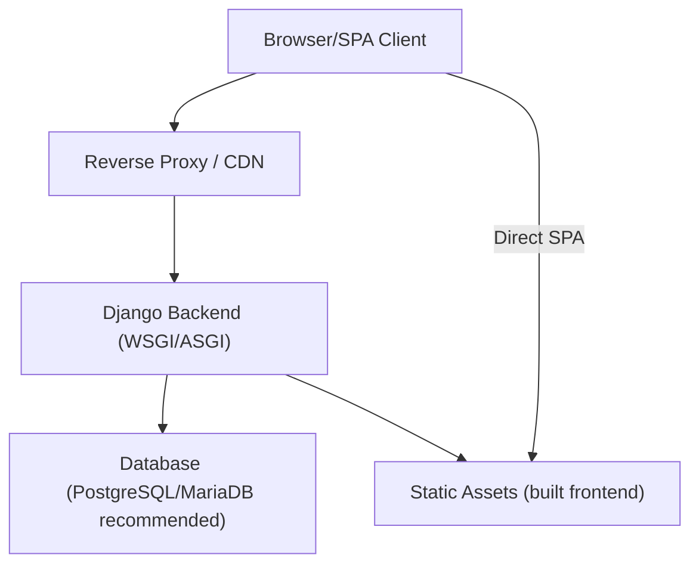
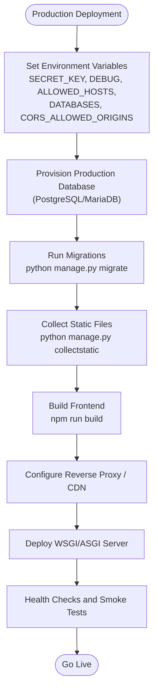
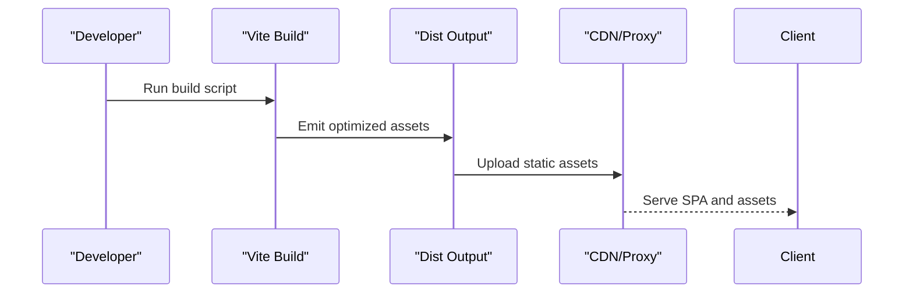
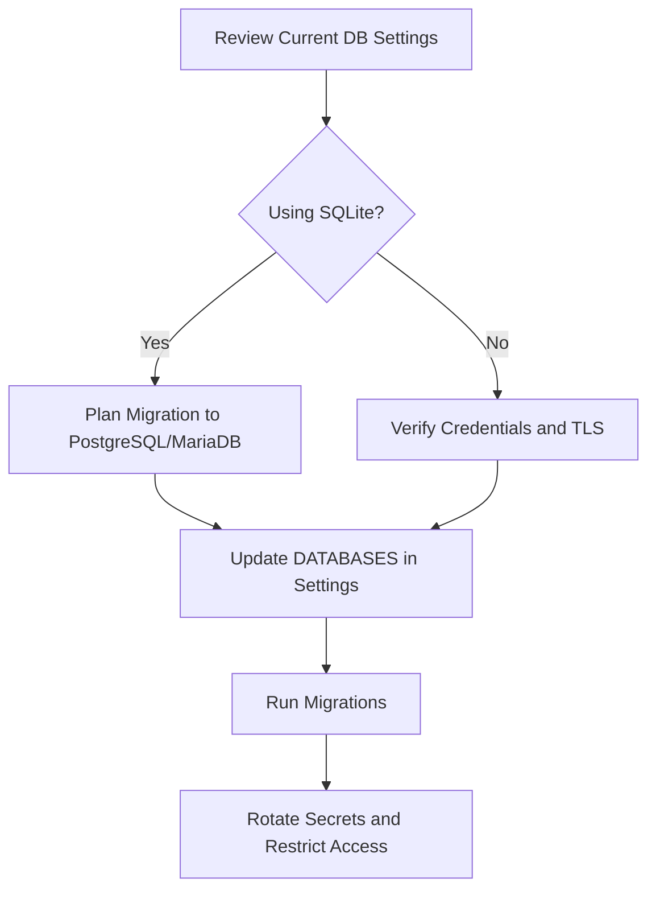
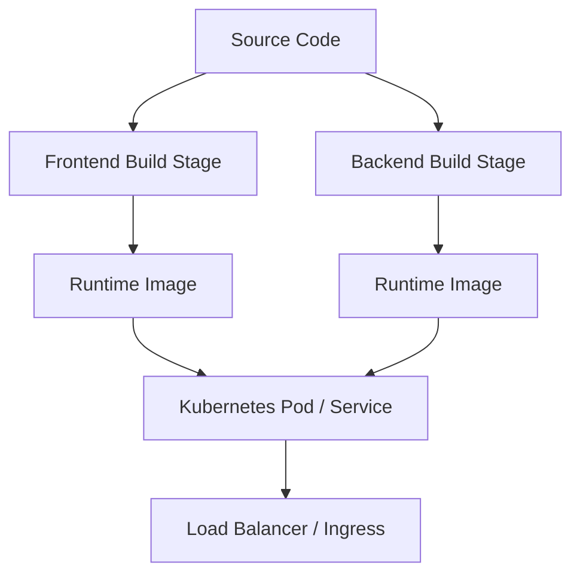
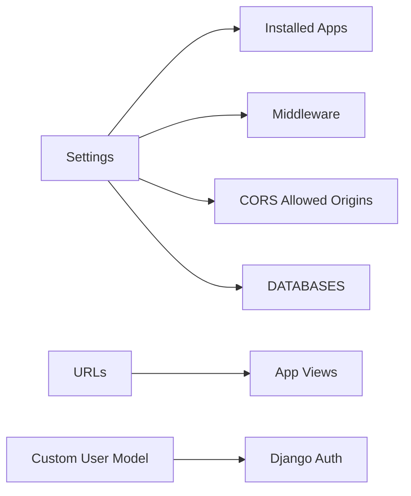

# Deployment & Production

<cite>
**Referenced Files in This Document**
- [backend/backend/settings.py](file://backend/backend/settings.py)
- [backend/backend/urls.py](file://backend/backend/urls.py)
- [backend/backend/wsgi.py](file://backend/backend/wsgi.py)
- [backend/backend/asgi.py](file://backend/backend/asgi.py)
- [backend/manage.py](file://backend/manage.py)
- [backend/accounts/models.py](file://backend/accounts/models.py)
- [backend/accounts/migrations/0001_initial.py](file://backend/accounts/migrations/0001_initial.py)
- [frontend/package.json](file://frontend/package.json)
- [frontend/vite.config.js](file://frontend/vite.config.js)
- [frontend/index.html](file://frontend/index.html)
</cite>

## Table of Contents
1. [Introduction](#introduction)
2. [Project Structure](#project-structure)
3. [Core Components](#core-components)
4. [Architecture Overview](#architecture-overview)
5. [Detailed Component Analysis](#detailed-component-analysis)
6. [Dependency Analysis](#dependency-analysis)
7. [Performance Considerations](#performance-considerations)
8. [Troubleshooting Guide](#troubleshooting-guide)
9. [Conclusion](#conclusion)
10. [Appendices](#appendices)

## Introduction
This document provides comprehensive deployment guidance for the TPO Portal, covering production environment setup, build processes for frontend and backend, environment configuration, containerization, cloud deployment, CI/CD, monitoring/logging, backups, disaster recovery, performance optimization, scaling, and production maintenance. It synthesizes the current repository configuration and maps practical deployment steps to the existing codebase.

## Project Structure
The TPO Portal consists of:
- Backend: Django application with multiple apps (accounts, student, recruiter, tpo_admin), REST framework, and CORS support.
- Frontend: Vite-powered React application with Tailwind CSS and React Router.

**Diagram sources**
- [backend/backend/settings.py:1-126](file://backend/backend/settings.py#L1-L126)
- [backend/backend/urls.py:1-11](file://backend/backend/urls.py#L1-L11)
- [backend/backend/wsgi.py:1-17](file://backend/backend/wsgi.py#L1-L17)
- [backend/backend/asgi.py:1-17](file://backend/backend/asgi.py#L1-L17)
- [backend/manage.py:1-23](file://backend/manage.py#L1-L23)
- [backend/accounts/models.py:1-25](file://backend/accounts/models.py#L1-L25)
- [backend/accounts/migrations/0001_initial.py:1-46](file://backend/accounts/migrations/0001_initial.py#L1-L46)
- [frontend/package.json:1-34](file://frontend/package.json#L1-L34)
- [frontend/vite.config.js:1-9](file://frontend/vite.config.js#L1-L9)
- [frontend/index.html:1-14](file://frontend/index.html#L1-L14)

**Section sources**
- [backend/backend/settings.py:1-126](file://backend/backend/settings.py#L1-L126)
- [backend/backend/urls.py:1-11](file://backend/backend/urls.py#L1-L11)
- [backend/backend/wsgi.py:1-17](file://backend/backend/wsgi.py#L1-L17)
- [backend/backend/asgi.py:1-17](file://backend/backend/asgi.py#L1-L17)
- [backend/manage.py:1-23](file://backend/manage.py#L1-L23)
- [backend/accounts/models.py:1-25](file://backend/accounts/models.py#L1-L25)
- [backend/accounts/migrations/0001_initial.py:1-46](file://backend/accounts/migrations/0001_initial.py#L1-L46)
- [frontend/package.json:1-34](file://frontend/package.json#L1-L34)
- [frontend/vite.config.js:1-9](file://frontend/vite.config.js#L1-L9)
- [frontend/index.html:1-14](file://frontend/index.html#L1-L14)

## Core Components
- Backend runtime and configuration:
  - WSGI entry for production servers.
  - ASGI entry for async-capable deployments.
  - Centralized settings for apps, middleware, CORS, static files, and database.
  - URL routing that mounts API endpoints per app.
  - Management script to run Django commands.
- Accounts model and initial migration:
  - Custom user model extending AbstractUser with role enumeration.
  - Initial migration defining the User table and constraints.
- Frontend build and dev toolchain:
  - Vite configuration with React and Tailwind plugins.
  - Package scripts for dev, build, lint, and preview.
  - Index HTML template for the SPA entry point.

Key deployment implications:
- The backend currently uses SQLite by default, suitable for development but not recommended for production.
- CORS is configured for local development origins; production origins must be set explicitly.
- Static files are served via Django’s static serving; in production, serve built frontend assets via a CDN or reverse proxy.

**Section sources**
- [backend/backend/wsgi.py:1-17](file://backend/backend/wsgi.py#L1-L17)
- [backend/backend/asgi.py:1-17](file://backend/backend/asgi.py#L1-L17)
- [backend/backend/settings.py:1-126](file://backend/backend/settings.py#L1-L126)
- [backend/backend/urls.py:1-11](file://backend/backend/urls.py#L1-L11)
- [backend/manage.py:1-23](file://backend/manage.py#L1-L23)
- [backend/accounts/models.py:1-25](file://backend/accounts/models.py#L1-L25)
- [backend/accounts/migrations/0001_initial.py:1-46](file://backend/accounts/migrations/0001_initial.py#L1-L46)
- [frontend/package.json:1-34](file://frontend/package.json#L1-L34)
- [frontend/vite.config.js:1-9](file://frontend/vite.config.js#L1-L9)
- [frontend/index.html:1-14](file://frontend/index.html#L1-L14)

## Architecture Overview
The TPO Portal follows a classic web application architecture:
- Frontend (React/Vite) builds a static SPA.
- Backend (Django) serves REST APIs and optionally serves the SPA in production.
- Database: SQLite in current settings; replace with a production-grade database for production.
- Reverse proxy or CDN serves static assets and routes API requests to the backend.

[No sources needed since this diagram shows conceptual workflow, not actual code structure]

## Detailed Component Analysis

### Backend Deployment Configuration
- Environment variables and secrets:
  - Set SECRET_KEY via environment variable in production.
  - Configure DEBUG to False and set ALLOWED_HOSTS to production domains.
  - Define production DATABASES configuration (PostgreSQL/MariaDB recommended).
  - Configure CORS_ALLOWED_ORIGINS for production frontend origin(s).
- WSGI/ASGI deployment:
  - Use the WSGI entry for WSGI servers (e.g., Gunicorn/uWSGI behind Nginx).
  - Use the ASGI entry for async-capable deployments (e.g., Daphne/uvicorn with ASGI server).
- Static files:
  - Collect static files after building the frontend.
  - Serve static files via reverse proxy or CDN in production.
- Authentication and sessions:
  - Ensure HTTPS termination at the proxy and secure cookie settings.
  - Configure session and CSRF settings for HTTPS-only cookies.

**Section sources**
- [backend/backend/settings.py:1-126](file://backend/backend/settings.py#L1-L126)
- [backend/backend/wsgi.py:1-17](file://backend/backend/wsgi.py#L1-L17)
- [backend/backend/asgi.py:1-17](file://backend/backend/asgi.py#L1-L17)
- [backend/manage.py:1-23](file://backend/manage.py#L1-L23)

### Frontend Build and Asset Optimization
- Build process:
  - Use the build script to produce optimized static assets in the frontend dist folder.
  - Ensure environment-specific base paths and asset URLs are configured for CDN delivery.
- Asset optimization:
  - Leverage Vite’s production bundling and minification.
  - Integrate CDN for static assets and cache headers.
- SPA routing:
  - Configure the reverse proxy to route unmatched paths to the SPA index to support client-side routing.

**Section sources**
- [frontend/package.json:1-34](file://frontend/package.json#L1-L34)
- [frontend/vite.config.js:1-9](file://frontend/vite.config.js#L1-L9)
- [frontend/index.html:1-14](file://frontend/index.html#L1-L14)

### Database Setup and Security Hardening
- Current state:
  - SQLite is configured by default; not suitable for production.
- Production recommendation:
  - Replace DATABASES with PostgreSQL or MariaDB credentials.
  - Enforce strong passwords, network-level access restrictions, and TLS encryption.
  - Use dedicated database users per environment and least-privilege access.
- Django settings:
  - Set AUTH_USER_MODEL to the custom User model.
  - Keep default password validators enabled for security.

**Section sources**
- [backend/backend/settings.py:78-86](file://backend/backend/settings.py#L78-L86)
- [backend/accounts/models.py:1-25](file://backend/accounts/models.py#L1-L25)
- [backend/accounts/migrations/0001_initial.py:1-46](file://backend/accounts/migrations/0001_initial.py#L1-L46)

### CORS and Security Headers
- Current configuration:
  - CORS_ALLOWED_ORIGINS lists localhost origins for development.
- Production hardening:
  - Limit CORS_ALLOWED_ORIGINS to production frontend domains.
  - Add security middleware headers (HTTPS enforcement, HSTS, X-Content-Type-Options, X-Frame-Options).
  - Ensure CSRF_COOKIE_SECURE and SESSION_COOKIE_SECURE are enabled under HTTPS.

**Section sources**
- [backend/backend/settings.py:18-22](file://backend/backend/settings.py#L18-L22)
- [backend/backend/settings.py:47-56](file://backend/backend/settings.py#L47-L56)

### Containerization with Docker
- Multi-stage build strategy:
  - Build frontend in a Node stage and copy dist artifacts to a lightweight runtime image.
  - Build backend Python dependencies in a separate stage and install production server packages.
- Runtime images:
  - Use a minimal base image for the backend (e.g., python:3.x-slim).
  - Serve static assets via a reverse proxy or CDN; mount collected static files if serving via backend.
- Environment injection:
  - Pass SECRET_KEY, DATABASES connection string, ALLOWED_HOSTS, and CORS_ALLOWED_ORIGINS via environment variables.
- Health checks:
  - Expose a readiness/liveness endpoint for orchestration.

[No sources needed since this diagram shows conceptual workflow, not actual code structure]

### Cloud Deployment Platforms
- Recommended platforms:
  - Platform-as-a-Service: Managed Kubernetes (EKS/GKE/AKS) or platform with containerized workloads.
  - Infrastructure: Provision a managed database (RDS/Azure DB/Cloud SQL) and CDN.
- Configuration:
  - Store secrets in platform-native secret managers.
  - Use environment variables for configuration and rotate keys regularly.
  - Enable autoscaling for pods and horizontal scaling for stateless backend.

[No sources needed since this section provides general guidance]

### CI/CD Pipeline Setup
- Typical stages:
  - Lint and test (frontend and backend).
  - Build and push container images.
  - Deploy to staging with automated smoke tests.
  - Promote to production with manual approval or canary rollout.
- Artifacts:
  - Store frontend dist artifacts and backend wheels/packages.
- Rollback:
  - Maintain immutable tags and enable quick rollbacks to previous versions.

[No sources needed since this section provides general guidance]

### Monitoring and Logging
- Backend:
  - Use structured logging and export logs to centralized systems (e.g., ELK, Cloud Logging).
  - Monitor health endpoints and response metrics.
- Frontend:
  - Track error boundaries and report client-side errors to a logging service.
- Observability:
  - Add APM (Application Performance Monitoring) and distributed tracing.

[No sources needed since this section provides general guidance]

### Backup and Disaster Recovery
- Database:
  - Schedule regular logical backups and test restore procedures.
  - Use point-in-time recovery where supported.
- Static assets:
  - Back up CDN-managed assets or maintain versioned copies.
- DR plan:
  - Define RTO/RPO targets, failover procedures, and cross-region replication.

[No sources needed since this section provides general guidance]

## Dependency Analysis
- Internal dependencies:
  - URLs include app-specific namespaces for auth, student, recruiter, and admin APIs.
  - Middleware stack includes CORS, security, session, CSRF, and clickjacking protections.
  - Custom User model integrates with Django auth and is referenced by settings.
- External dependencies:
  - Frontend depends on React, React Router, Axios, Tailwind CSS, and Vite toolchain.
  - Backend depends on Django, REST framework, and CORS headers.

**Diagram sources**
- [backend/backend/settings.py:27-45](file://backend/backend/settings.py#L27-L45)
- [backend/backend/urls.py:4-10](file://backend/backend/urls.py#L4-L10)
- [backend/accounts/models.py:1-25](file://backend/accounts/models.py#L1-L25)

**Section sources**
- [backend/backend/urls.py:1-11](file://backend/backend/urls.py#L1-L11)
- [backend/backend/settings.py:27-45](file://backend/backend/settings.py#L27-L45)
- [backend/accounts/models.py:1-25](file://backend/accounts/models.py#L1-L25)

## Performance Considerations
- Database:
  - Use connection pooling and optimize queries; add indexes for frequent filters.
- Backend:
  - Enable caching (e.g., Redis) for repeated API responses.
  - Use asynchronous workers for long-running tasks.
- Frontend:
  - Bundle splitting, lazy loading, and code splitting via Vite.
  - Minimize payload sizes and leverage browser caching.
- Infrastructure:
  - Scale horizontally with load balancers and auto-scaling.
  - Use CDN for global distribution of static assets.

[No sources needed since this section provides general guidance]

## Troubleshooting Guide
- Common production issues:
  - CORS errors: Verify CORS_ALLOWED_ORIGINS matches the deployed frontend domain.
  - Static files not served: Confirm collectstatic ran and reverse proxy routes static paths correctly.
  - Database connectivity: Validate DATABASES credentials and network access.
  - Session/cookie issues: Ensure HTTPS termination and secure cookie flags are configured.
- Debugging steps:
  - Review backend logs and enable debug only in controlled environments.
  - Validate environment variables during startup.
  - Use health checks to confirm service readiness.

**Section sources**
- [backend/backend/settings.py:18-22](file://backend/backend/settings.py#L18-L22)
- [backend/backend/settings.py:78-86](file://backend/backend/settings.py#L78-L86)
- [backend/manage.py:1-23](file://backend/manage.py#L1-L23)

## Conclusion
This guide outlines a pragmatic path to deploy the TPO Portal in production. It emphasizes replacing development defaults with production-grade configurations, securing the application, containerizing the stack, and establishing robust monitoring, backups, and CI/CD practices. By following these recommendations, teams can achieve reliable, scalable, and maintainable deployments.

## Appendices
- Environment variable checklist:
  - SECRET_KEY
  - DEBUG (should be False in production)
  - ALLOWED_HOSTS
  - DATABASES (connection string)
  - CORS_ALLOWED_ORIGINS
  - HTTPS-related cookie flags (if applicable)
- Post-deployment verification:
  - API health checks
  - SPA routing validation
  - Static asset availability
  - Database connectivity and migrations

[No sources needed since this section provides general guidance]