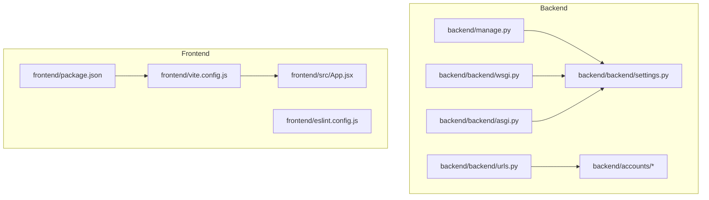
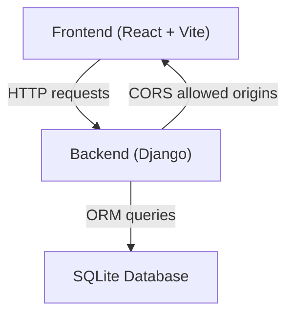
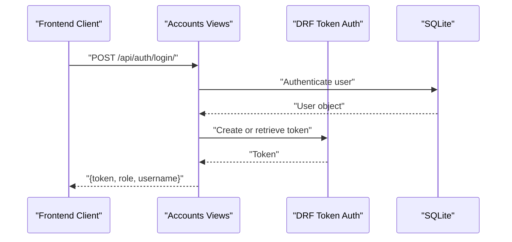
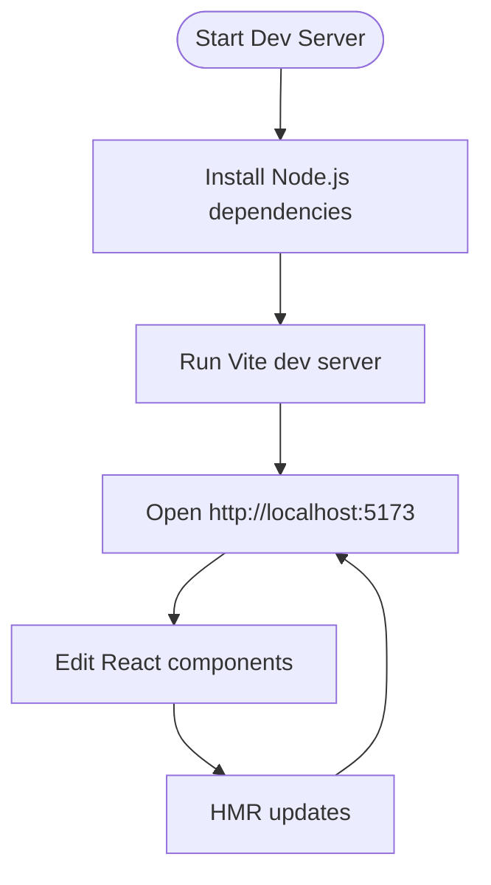
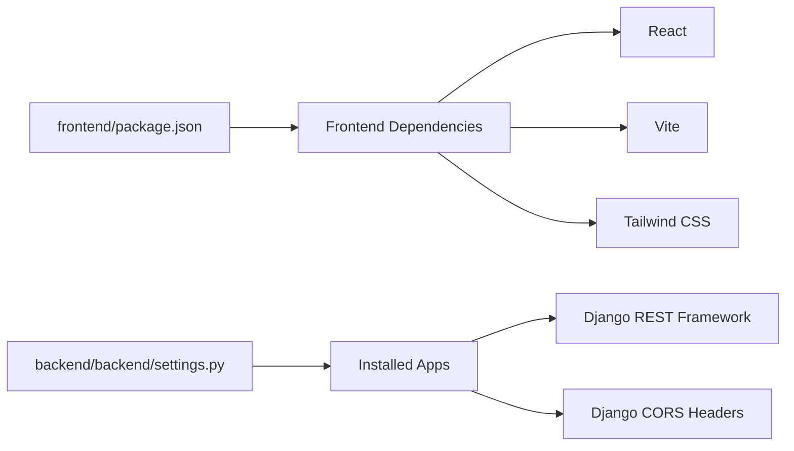

# Environment Setup

<cite>
**Referenced Files in This Document**
- [backend/settings.py](file://backend/backend/settings.py)
- [backend/urls.py](file://backend/backend/urls.py)
- [backend/manage.py](file://backend/manage.py)
- [backend/wsgi.py](file://backend/backend/wsgi.py)
- [backend/asgi.py](file://backend/backend/asgi.py)
- [backend/accounts/models.py](file://backend/accounts/models.py)
- [backend/accounts/views.py](file://backend/accounts/views.py)
- [backend/accounts/urls.py](file://backend/accounts/urls.py)
- [frontend/package.json](file://frontend/package.json)
- [frontend/vite.config.js](file://frontend/vite.config.js)
- [frontend/eslint.config.js](file://frontend/eslint.config.js)
- [frontend/README.md](file://frontend/README.md)
- [frontend/src/App.jsx](file://frontend/src/App.jsx)
</cite>

## Table of Contents
1. [Introduction](#introduction)
2. [Project Structure](#project-structure)
3. [Core Components](#core-components)
4. [Architecture Overview](#architecture-overview)
5. [Detailed Component Analysis](#detailed-component-analysis)
6. [Dependency Analysis](#dependency-analysis)
7. [Performance Considerations](#performance-considerations)
8. [Troubleshooting Guide](#troubleshooting-guide)
9. [Conclusion](#conclusion)
10. [Appendices](#appendices)

## Introduction
This document provides a complete environment setup guide for the TPO Portal. It covers system requirements, development environment configuration, environment variable configuration for both frontend and backend, IDE setup recommendations, debugging configurations, development workflow optimization, troubleshooting, and verification steps to ensure a properly configured environment.

## Project Structure
The TPO Portal follows a clear separation of concerns:
- Backend: Django application under backend/backend with multiple Django apps (accounts, student, recruiter, tpo_admin).
- Frontend: React + Vite application under frontend with routing and UI components.

**Diagram sources**
- [backend/backend/settings.py:1-126](file://backend/backend/settings.py#L1-L126)
- [backend/backend/urls.py:1-11](file://backend/backend/urls.py#L1-L11)
- [backend/manage.py:1-23](file://backend/manage.py#L1-L23)
- [backend/backend/wsgi.py:1-16](file://backend/backend/wsgi.py#L1-L16)
- [backend/backend/asgi.py:1-16](file://backend/backend/asgi.py#L1-L16)
- [frontend/package.json:1-34](file://frontend/package.json#L1-L34)
- [frontend/vite.config.js:1-9](file://frontend/vite.config.js#L1-L9)
- [frontend/src/App.jsx:1-55](file://frontend/src/App.jsx#L1-L55)

**Section sources**
- [backend/backend/settings.py:1-126](file://backend/backend/settings.py#L1-L126)
- [backend/backend/urls.py:1-11](file://backend/backend/urls.py#L1-L11)
- [frontend/package.json:1-34](file://frontend/package.json#L1-L34)
- [frontend/vite.config.js:1-9](file://frontend/vite.config.js#L1-L9)
- [frontend/src/App.jsx:1-55](file://frontend/src/App.jsx#L1-L55)

## Core Components
- Backend Django settings define the database engine, middleware stack, installed apps, and CORS configuration. The default database is SQLite, and the project uses Django’s built-in user model extended via a custom User model.
- Frontend package.json defines scripts for development, building, and linting, along with dependencies such as React, React Router, Axios, Tailwind CSS, and Vite.
- The backend manages authentication endpoints and integrates with Django REST Framework for token-based authentication.

Key implementation references:
- Backend database and CORS configuration: [backend/backend/settings.py:78-86](file://backend/backend/settings.py#L78-L86), [backend/backend/settings.py:18-22](file://backend/backend/settings.py#L18-L22)
- Backend installed apps and middleware: [backend/backend/settings.py:27-56](file://backend/backend/settings.py#L27-L56)
- Frontend scripts and dependencies: [frontend/package.json:6-18](file://frontend/package.json#L6-L18)
- Authentication endpoints: [backend/accounts/urls.py:1-10](file://backend/accounts/urls.py#L1-L10), [backend/accounts/views.py:13-45](file://backend/accounts/views.py#L13-L45), [backend/accounts/views.py:48-75](file://backend/accounts/views.py#L48-L75), [backend/accounts/views.py:78-89](file://backend/accounts/views.py#L78-L89)

**Section sources**
- [backend/backend/settings.py:18-86](file://backend/backend/settings.py#L18-L86)
- [backend/backend/settings.py:27-56](file://backend/backend/settings.py#L27-L56)
- [frontend/package.json:6-18](file://frontend/package.json#L6-L18)
- [backend/accounts/urls.py:1-10](file://backend/accounts/urls.py#L1-L10)
- [backend/accounts/views.py:13-45](file://backend/accounts/views.py#L13-L45)
- [backend/accounts/views.py:48-89](file://backend/accounts/views.py#L48-L89)

## Architecture Overview
The system architecture consists of:
- Frontend React application served by Vite during development.
- Backend Django application exposing REST endpoints for authentication and protected routes.
- SQLite database for local development.
- CORS configuration allowing connections from the frontend origin.

**Diagram sources**
- [backend/backend/settings.py:18-22](file://backend/backend/settings.py#L18-L22)
- [backend/backend/settings.py:78-86](file://backend/backend/settings.py#L78-L86)
- [frontend/vite.config.js:1-9](file://frontend/vite.config.js#L1-L9)

**Section sources**
- [backend/backend/settings.py:18-22](file://backend/backend/settings.py#L18-L22)
- [backend/backend/settings.py:78-86](file://backend/backend/settings.py#L78-L86)
- [frontend/vite.config.js:1-9](file://frontend/vite.config.js#L1-L9)

## Detailed Component Analysis

### Backend Environment Configuration
- Database: SQLite is configured by default. No external database is required for local development.
- Middleware and apps: Ensure the required Django apps and third-party packages are installed and configured.
- CORS: Configure allowed origins to match the frontend development server.

Implementation references:
- Database configuration: [backend/backend/settings.py:81-86](file://backend/backend/settings.py#L81-L86)
- Installed apps and third-party integrations: [backend/backend/settings.py:27-45](file://backend/backend/settings.py#L27-L45)
- CORS configuration: [backend/backend/settings.py:18-22](file://backend/backend/settings.py#L18-L22)
- URL routing for API endpoints: [backend/backend/urls.py:4-10](file://backend/backend/urls.py#L4-L10)
- Authentication endpoints: [backend/accounts/urls.py:4-9](file://backend/accounts/urls.py#L4-L9), [backend/accounts/views.py:13-45](file://backend/accounts/views.py#L13-L45), [backend/accounts/views.py:48-75](file://backend/accounts/views.py#L48-L75), [backend/accounts/views.py:78-89](file://backend/accounts/views.py#L78-L89)

**Diagram sources**
- [backend/accounts/views.py:13-45](file://backend/accounts/views.py#L13-L45)
- [backend/accounts/views.py:32-39](file://backend/accounts/views.py#L32-L39)
- [backend/accounts/urls.py:4-9](file://backend/accounts/urls.py#L4-L9)

**Section sources**
- [backend/backend/settings.py:18-22](file://backend/backend/settings.py#L18-L22)
- [backend/backend/settings.py:27-45](file://backend/backend/settings.py#L27-L45)
- [backend/backend/settings.py:81-86](file://backend/backend/settings.py#L81-L86)
- [backend/backend/urls.py:4-10](file://backend/backend/urls.py#L4-L10)
- [backend/accounts/urls.py:4-9](file://backend/accounts/urls.py#L4-L9)
- [backend/accounts/views.py:13-45](file://backend/accounts/views.py#L13-L45)
- [backend/accounts/views.py:32-39](file://backend/accounts/views.py#L32-L39)

### Frontend Environment Configuration
- Scripts: Development, build, lint, and preview commands are defined in package.json.
- Plugins: Vite is configured with React and Tailwind CSS plugins.
- Routing: Client-side routing is handled by React Router DOM.

Implementation references:
- Scripts and dependencies: [frontend/package.json:6-18](file://frontend/package.json#L6-L18)
- Vite configuration: [frontend/vite.config.js:5-8](file://frontend/vite.config.js#L5-L8)
- Routing configuration: [frontend/src/App.jsx:25-51](file://frontend/src/App.jsx#L25-L51)

**Diagram sources**
- [frontend/package.json:6-11](file://frontend/package.json#L6-L11)
- [frontend/vite.config.js:5-8](file://frontend/vite.config.js#L5-L8)
- [frontend/src/App.jsx:25-51](file://frontend/src/App.jsx#L25-L51)

**Section sources**
- [frontend/package.json:6-18](file://frontend/package.json#L6-L18)
- [frontend/vite.config.js:5-8](file://frontend/vite.config.js#L5-L8)
- [frontend/src/App.jsx:25-51](file://frontend/src/App.jsx#L25-L51)

### Environment Variables
- Backend: The Django settings module sets the default database and CORS origins. No environment variables are defined in the provided settings file for local development. If you choose to externalize configuration, set DJANGO_SETTINGS_MODULE appropriately and define environment-specific overrides.
- Frontend: The Vite configuration does not require environment variables for basic development. If you introduce environment-specific configuration, place it under Vite’s supported mechanisms.

References:
- Backend settings module and environment variable usage: [backend/manage.py:9-9](file://backend/manage.py#L9-L9), [backend/backend/wsgi.py:14-14](file://backend/backend/wsgi.py#L14-L14), [backend/backend/asgi.py:14-14](file://backend/backend/asgi.py#L14-L14)
- Frontend Vite configuration: [frontend/vite.config.js:5-8](file://frontend/vite.config.js#L5-L8)

**Section sources**
- [backend/manage.py:9-9](file://backend/manage.py#L9-L9)
- [backend/backend/wsgi.py:14-14](file://backend/backend/wsgi.py#L14-L14)
- [backend/backend/asgi.py:14-14](file://backend/backend/asgi.py#L14-L14)
- [frontend/vite.config.js:5-8](file://frontend/vite.config.js#L5-L8)

## Dependency Analysis
- Backend dependencies include Django, Django REST Framework, and Django CORS Headers. These are declared in the backend settings and installed via pip.
- Frontend dependencies include React, React Router, Axios, Tailwind CSS, and Vite. These are declared in package.json and installed via npm.

**Diagram sources**
- [frontend/package.json:12-18](file://frontend/package.json#L12-L18)
- [backend/backend/settings.py:27-45](file://backend/backend/settings.py#L27-L45)

**Section sources**
- [frontend/package.json:12-18](file://frontend/package.json#L12-L18)
- [backend/backend/settings.py:27-45](file://backend/backend/settings.py#L27-L45)

## Performance Considerations
- Use SQLite for local development to minimize setup overhead.
- Keep frontend dependencies lean; avoid unnecessary plugins.
- Enable hot module replacement (HMR) in Vite for fast iteration.
- Use production builds for performance testing after local development.

## Troubleshooting Guide
Common setup issues and resolutions:
- Django import errors during development: Ensure the virtual environment is activated and Django is installed. The manage.py script raises explicit guidance if Django is missing.
  - Reference: [backend/manage.py:10-17](file://backend/manage.py#L10-L17)
- CORS errors in browser console: Verify that the frontend origin is included in CORS_ALLOWED_ORIGINS in settings.py.
  - Reference: [backend/backend/settings.py:18-22](file://backend/backend/settings.py#L18-L22)
- SQLite database connection issues: Confirm the database path resolves correctly and the file is writable.
  - Reference: [backend/backend/settings.py:81-86](file://backend/backend/settings.py#L81-L86)
- Frontend build failures: Ensure Node.js and npm are installed and up to date. Reinstall dependencies if necessary.
  - References: [frontend/package.json:1-34](file://frontend/package.json#L1-L34), [frontend/README.md:1-17](file://frontend/README.md#L1-L17)

Verification steps:
- Backend: Run migrations and start the development server using the manage.py script.
  - Reference: [backend/manage.py:7-18](file://backend/manage.py#L7-L18)
- Frontend: Start the Vite dev server and confirm the UI loads at the expected port.
  - Reference: [frontend/package.json:6-11](file://frontend/package.json#L6-L11), [frontend/vite.config.js:5-8](file://frontend/vite.config.js#L5-L8)

**Section sources**
- [backend/manage.py:10-17](file://backend/manage.py#L10-L17)
- [backend/backend/settings.py:18-22](file://backend/backend/settings.py#L18-L22)
- [backend/backend/settings.py:81-86](file://backend/backend/settings.py#L81-L86)
- [frontend/package.json:1-34](file://frontend/package.json#L1-L34)
- [frontend/README.md:1-17](file://frontend/README.md#L1-L17)
- [frontend/package.json:6-11](file://frontend/package.json#L6-L11)
- [frontend/vite.config.js:5-8](file://frontend/vite.config.js#L5-L8)

## Conclusion
The TPO Portal requires a modern Python environment for the backend and a recent Node.js environment for the frontend. SQLite is sufficient for local development, and CORS is preconfigured for the default development origin. Following the steps in this document will ensure a smooth setup and development experience.

## Appendices

### System Requirements
- Python: 3.8 or higher
- Node.js: 16 or higher
- Database: SQLite (included with Django)

References:
- Backend database configuration: [backend/backend/settings.py:81-86](file://backend/backend/settings.py#L81-L86)
- Frontend package dependencies: [frontend/package.json:12-18](file://frontend/package.json#L12-L18)

**Section sources**
- [backend/backend/settings.py:81-86](file://backend/backend/settings.py#L81-L86)
- [frontend/package.json:12-18](file://frontend/package.json#L12-L18)

### Development Environment Setup Checklist
- Backend
  - Create and activate a Python virtual environment.
  - Install backend dependencies using pip.
  - Run Django migrations to initialize the database.
  - Start the Django development server.
  - References: [backend/manage.py:7-18](file://backend/manage.py#L7-L18), [backend/backend/settings.py:81-86](file://backend/backend/settings.py#L81-L86)
- Frontend
  - Install Node.js dependencies using npm.
  - Start the Vite development server.
  - Access the application at the expected port.
  - References: [frontend/package.json:6-11](file://frontend/package.json#L6-L11), [frontend/vite.config.js:5-8](file://frontend/vite.config.js#L5-L8)

**Section sources**
- [backend/manage.py:7-18](file://backend/manage.py#L7-L18)
- [backend/backend/settings.py:81-86](file://backend/backend/settings.py#L81-L86)
- [frontend/package.json:6-11](file://frontend/package.json#L6-L11)
- [frontend/vite.config.js:5-8](file://frontend/vite.config.js#L5-L8)

### IDE Setup Recommendations
- Backend
  - Use an IDE with Python interpreter pointing to the virtual environment.
  - Enable Django-specific extensions for better navigation and linting.
  - Configure the Django project root and settings module.
  - References: [backend/manage.py:9-9](file://backend/manage.py#L9-L9), [backend/backend/wsgi.py:14-14](file://backend/backend/wsgi.py#L14-L14)
- Frontend
  - Use an IDE with JavaScript/TypeScript support.
  - Enable ESLint integration and React-related plugins.
  - Configure Vite’s plugin chain for accurate linting and formatting.
  - References: [frontend/eslint.config.js:1-30](file://frontend/eslint.config.js#L1-L30), [frontend/vite.config.js:5-8](file://frontend/vite.config.js#L5-L8)

**Section sources**
- [backend/manage.py:9-9](file://backend/manage.py#L9-L9)
- [backend/backend/wsgi.py:14-14](file://backend/backend/wsgi.py#L14-L14)
- [frontend/eslint.config.js:1-30](file://frontend/eslint.config.js#L1-L30)
- [frontend/vite.config.js:5-8](file://frontend/vite.config.js#L5-L8)

### Debugging Configurations
- Backend
  - Set breakpoints in Django views and use the built-in development server.
  - Inspect request/response objects and authentication flow.
  - References: [backend/accounts/views.py:13-45](file://backend/accounts/views.py#L13-L45), [backend/accounts/views.py:48-75](file://backend/accounts/views.py#L48-L75)
- Frontend
  - Use browser developer tools to inspect network requests and React component state.
  - Leverage ESLint and Vite’s HMR for rapid feedback.
  - References: [frontend/src/App.jsx:25-51](file://frontend/src/App.jsx#L25-L51), [frontend/eslint.config.js:1-30](file://frontend/eslint.config.js#L1-L30)

**Section sources**
- [backend/accounts/views.py:13-45](file://backend/accounts/views.py#L13-L45)
- [backend/accounts/views.py:48-75](file://backend/accounts/views.py#L48-L75)
- [frontend/src/App.jsx:25-51](file://frontend/src/App.jsx#L25-L51)
- [frontend/eslint.config.js:1-30](file://frontend/eslint.config.js#L1-L30)

### Verification Steps
- Backend
  - Confirm the database file exists and is accessible.
  - Test authentication endpoints using a client or curl.
  - References: [backend/backend/settings.py:81-86](file://backend/backend/settings.py#L81-L86), [backend/accounts/urls.py:4-9](file://backend/accounts/urls.py#L4-L9), [backend/accounts/views.py:13-45](file://backend/accounts/views.py#L13-L45)
- Frontend
  - Verify the UI renders at the development server address.
  - Check that routing works across different pages.
  - References: [frontend/src/App.jsx:25-51](file://frontend/src/App.jsx#L25-L51), [frontend/package.json:6-11](file://frontend/package.json#L6-L11)

**Section sources**
- [backend/backend/settings.py:81-86](file://backend/backend/settings.py#L81-L86)
- [backend/accounts/urls.py:4-9](file://backend/accounts/urls.py#L4-L9)
- [backend/accounts/views.py:13-45](file://backend/accounts/views.py#L13-L45)
- [frontend/src/App.jsx:25-51](file://frontend/src/App.jsx#L25-L51)
- [frontend/package.json:6-11](file://frontend/package.json#L6-L11)