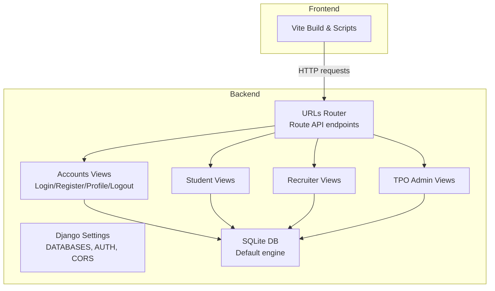
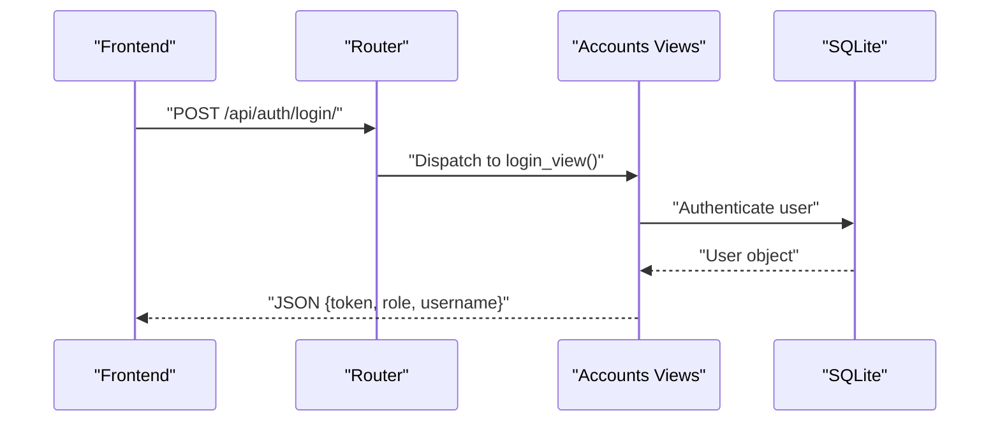
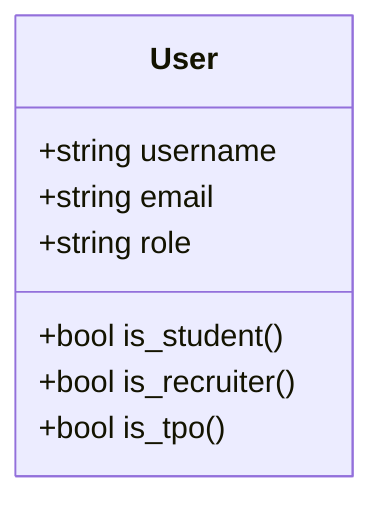
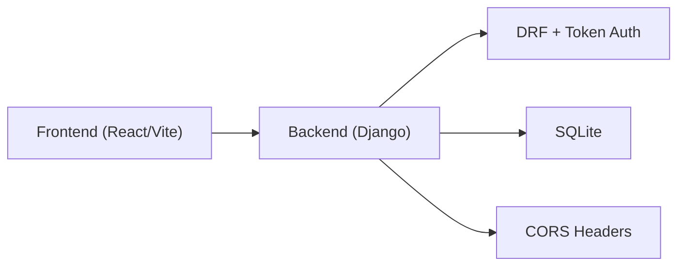
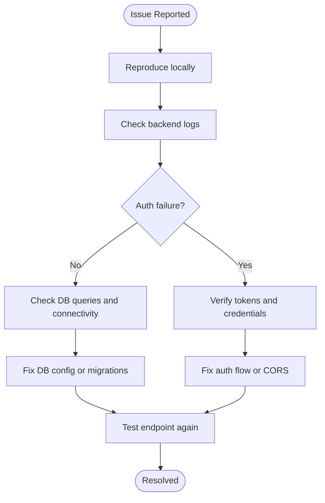
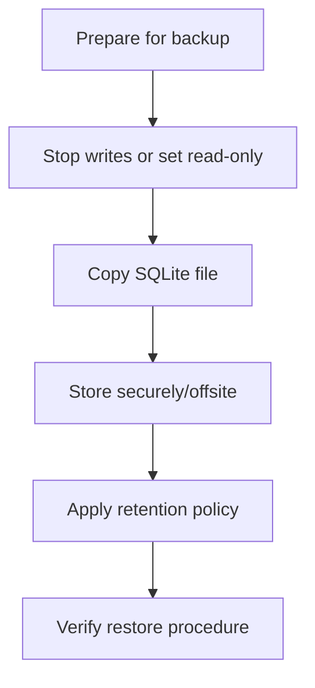

# Maintenance & Operations

<cite>
**Referenced Files in This Document**
- [settings.py](file://backend/backend/settings.py)
- [urls.py](file://backend/backend/urls.py)
- [manage.py](file://backend/manage.py)
- [accounts/views.py](file://backend/accounts/views.py)
- [accounts/urls.py](file://backend/accounts/urls.py)
- [accounts/models.py](file://backend/accounts/models.py)
- [accounts/migrations/0001_initial.py](file://backend/accounts/migrations/0001_initial.py)
- [recruiter/views.py](file://backend/recruiter/views.py)
- [student/views.py](file://backend/student/views.py)
- [tpo_admin/views.py](file://backend/tpo_admin/views.py)
- [package.json](file://frontend/package.json)
</cite>

## Table of Contents
1. [Introduction](#introduction)
2. [Project Structure](#project-structure)
3. [Core Components](#core-components)
4. [Architecture Overview](#architecture-overview)
5. [Detailed Component Analysis](#detailed-component-analysis)
6. [Dependency Analysis](#dependency-analysis)
7. [Performance Considerations](#performance-considerations)
8. [Troubleshooting Guide](#troubleshooting-guide)
9. [Backup & Disaster Recovery](#backup--disaster-recovery)
10. [Monitoring & Alerting](#monitoring--alerting)
11. [Incident Response Procedures](#incident-response-procedures)
12. [Maintenance Scheduling & Updates](#maintenance-scheduling--updates)
13. [Operational Best Practices](#operational-best-practices)
14. [Conclusion](#conclusion)

## Introduction
This document provides comprehensive maintenance and operations guidance for the TPO Portal. It covers routine maintenance procedures (log rotation, database cleanup, security updates), backup and disaster recovery strategies, monitoring and alerting, incident response, troubleshooting workflows, maintenance scheduling, update procedures, and operational best practices tailored to the current codebase.

## Project Structure
The TPO Portal consists of:
- A Django backend serving APIs for authentication, student, recruiter, and TPO admin features.
- A React-based frontend built with Vite and packaged via npm scripts.
- SQLite as the default database engine.

**Diagram sources**
- [settings.py:81-86](file://backend/backend/settings.py#L81-L86)
- [urls.py:4-10](file://backend/backend/urls.py#L4-L10)
- [accounts/views.py:13-95](file://backend/accounts/views.py#L13-L95)
- [student/views.py:1-8](file://backend/student/views.py#L1-L8)
- [recruiter/views.py:1-12](file://backend/recruiter/views.py#L1-L12)
- [tpo_admin/views.py:1-11](file://backend/tpo_admin/views.py#L1-L11)

**Section sources**
- [settings.py:1-126](file://backend/backend/settings.py#L1-L126)
- [urls.py:1-11](file://backend/backend/urls.py#L1-L11)
- [manage.py:1-23](file://backend/manage.py#L1-L23)
- [package.json:1-34](file://frontend/package.json#L1-L34)

## Core Components
- Authentication and user roles: Centralized in the accounts app with a custom User model and token-based authentication.
- API routing: URLs route to dedicated apps for accounts, student, recruiter, and TPO admin.
- Database: SQLite configured by default; suitable for development and small-scale deployments.
- Frontend build pipeline: Vite-based with npm scripts for dev, build, lint, and preview.

Key operational implications:
- Token-based authentication simplifies sessionless API access and enables straightforward audit logging.
- SQLite’s single-file database requires careful backup and migration strategies for production use.
- CORS is configured for local development; adjust for production environments.

**Section sources**
- [accounts/models.py:1-25](file://backend/accounts/models.py#L1-L25)
- [accounts/migrations/0001_initial.py:18-45](file://backend/accounts/migrations/0001_initial.py#L18-L45)
- [accounts/views.py:13-95](file://backend/accounts/views.py#L13-L95)
- [urls.py:4-10](file://backend/backend/urls.py#L4-L10)
- [settings.py:81-86](file://backend/backend/settings.py#L81-L86)
- [package.json:6-11](file://frontend/package.json#L6-L11)

## Architecture Overview
The backend exposes REST endpoints grouped under API namespaces. Requests flow from the frontend through the router to app-specific views, which interact with the database.

**Diagram sources**
- [urls.py:4-10](file://backend/backend/urls.py#L4-L10)
- [accounts/urls.py:4-9](file://backend/accounts/urls.py#L4-L9)
- [accounts/views.py:13-45](file://backend/accounts/views.py#L13-L45)

## Detailed Component Analysis

### Accounts App: Authentication and User Management
- Responsibilities: Login, registration, profile retrieval, logout.
- Security: Token-based authentication; CSRF exemptions for API endpoints; password validators enabled.
- Data model: Custom User with role choices and helper methods.

Operational notes:
- Token creation occurs per login; consider token lifecycle policies.
- Role-based routing is handled by the client; ensure server-side checks where sensitive actions are performed.

**Section sources**
- [accounts/views.py:13-95](file://backend/accounts/views.py#L13-L95)
- [accounts/urls.py:4-9](file://backend/accounts/urls.py#L4-L9)
- [accounts/models.py:1-25](file://backend/accounts/models.py#L1-L25)
- [accounts/migrations/0001_initial.py:18-45](file://backend/accounts/migrations/0001_initial.py#L18-L45)

### API Routing and Namespacing
- Admin: /api/admin/
- Recruiter: /api/recruiter/
- Student: /api/student/
- Accounts: /api/auth/

Operational notes:
- Keep endpoint names stable; introduce versioning if evolving rapidly.
- Centralize shared middleware and CORS configuration in settings.

**Section sources**
- [urls.py:4-10](file://backend/backend/urls.py#L4-L10)

### Database Model Overview
The accounts app defines a custom User model extending Django’s AbstractUser. This model is referenced by AUTH_USER_MODEL and includes role-based fields.

**Diagram sources**
- [accounts/models.py:4-25](file://backend/accounts/models.py#L4-L25)

**Section sources**
- [accounts/models.py:1-25](file://backend/accounts/models.py#L1-L25)
- [accounts/migrations/0001_initial.py:18-45](file://backend/accounts/migrations/0001_initial.py#L18-L45)
- [settings.py:119](file://backend/backend/settings.py#L119)

### Frontend Build and Scripts
- Scripts include dev, build, lint, and preview.
- Dependencies include React, React Router DOM, Axios, Tailwind, and Vite.

Operational notes:
- Use build artifacts for production deployment.
- Linting and type checking improve code quality and reduce runtime errors.

**Section sources**
- [package.json:6-11](file://frontend/package.json#L6-L11)
- [package.json:12-32](file://frontend/package.json#L12-L32)

## Dependency Analysis
- Backend depends on Django, Django REST Framework, and sqlite3.
- Frontend depends on React ecosystem and Vite toolchain.
- Accounts app centralizes authentication and user roles.

**Diagram sources**
- [settings.py:27-45](file://backend/backend/settings.py#L27-L45)
- [settings.py:81-86](file://backend/backend/settings.py#L81-L86)
- [package.json:12-32](file://frontend/package.json#L12-L32)

**Section sources**
- [settings.py:27-45](file://backend/backend/settings.py#L27-L45)
- [settings.py:81-86](file://backend/backend/settings.py#L81-L86)
- [package.json:12-32](file://frontend/package.json#L12-L32)

## Performance Considerations
- Database scaling: SQLite is file-based and single-writer. For higher concurrency, migrate to PostgreSQL or MySQL and configure connection pooling.
- Caching: Introduce Redis or cache headers for read-heavy endpoints.
- Static assets: Serve via CDN and enable compression.
- Background tasks: Offload heavy work to async workers (e.g., Celery) and queues.
- Monitoring: Track latency, throughput, error rates, and resource utilization.

[No sources needed since this section provides general guidance]

## Troubleshooting Guide
Common operational issues and resolutions:
- Authentication failures: Verify credentials, token validity, and CORS configuration.
- Registration conflicts: Username uniqueness enforced; handle duplicate usernames gracefully.
- Endpoint method errors: Ensure correct HTTP methods for endpoints (e.g., POST for login/register).
- Database connectivity: Confirm DATABASES configuration and file permissions.

**Section sources**
- [accounts/views.py:13-95](file://backend/accounts/views.py#L13-L95)
- [settings.py:81-86](file://backend/backend/settings.py#L81-L86)

## Backup & Disaster Recovery
Current state:
- SQLite database file location is defined in settings.
- No automated backup scripts or external storage integration are present in the repository.

Recommended backup strategy:
- Schedule periodic backups of the SQLite file while the service is offline or in read-only mode.
- Store backups offsite or in cloud storage with retention policies.
- Validate backups regularly by restoring to a staging environment.

Disaster recovery steps:
- Restore the latest clean backup.
- Re-run migrations if necessary.
- Restart services and validate endpoints.

**Section sources**
- [settings.py:81-86](file://backend/backend/settings.py#L81-L86)

## Monitoring & Alerting
Monitoring checklist:
- Health checks: Expose a lightweight health endpoint returning service status.
- Metrics: Track request latency, error rates, active sessions, and DB connections.
- Logs: Centralize application logs and set up log rotation.
- Alerts: Notify on high error rates, low availability, and disk pressure.

[No sources needed since this section provides general guidance]

## Incident Response Procedures
Incident workflow:
- Detection: Automated alerts or manual monitoring.
- Containment: Isolate affected services, disable problematic features if needed.
- Eradication: Identify root cause, apply fixes, re-validate.
- Recovery: Gradually resume normal operations, monitor closely.
- Postmortem: Document findings, update runbooks, prevent recurrence.

[No sources needed since this section provides general guidance]

## Maintenance Scheduling & Updates
Routine maintenance tasks:
- Weekly: Review logs, rotate logs, validate backups.
- Monthly: Update dependencies, review security patches, test disaster recovery.
- Quarterly: Audit database growth, optimize queries, scale infrastructure as needed.

Update procedures:
- Staging: Apply changes to a staging environment first.
- Rollout: Perform zero-downtime deployments where possible; otherwise schedule maintenance windows.
- Rollback: Keep previous artifact and database backup ready.

[No sources needed since this section provides general guidance]

## Operational Best Practices
- Environment separation: Keep separate settings for development, staging, and production.
- Secrets management: Externalize secrets (e.g., SECRET_KEY, database credentials) and avoid committing them.
- Network security: Restrict ALLOWED_HOSTS and configure HTTPS; harden CORS origins.
- Database hygiene: Periodically vacuum/analyze (for PostgreSQL/MySQL) and prune stale data as appropriate.
- Frontend builds: Use production builds and secure hosting; enable caching and compression.

[No sources needed since this section provides general guidance]

## Conclusion
The TPO Portal operates with a simple, maintainable stack. Strengthen operations by adopting automated backups, robust monitoring/alerting, standardized incident response, and disciplined maintenance schedules. As the system grows, consider migrating from SQLite to a managed relational database, introducing caching and async workers, and hardening security configurations for production.