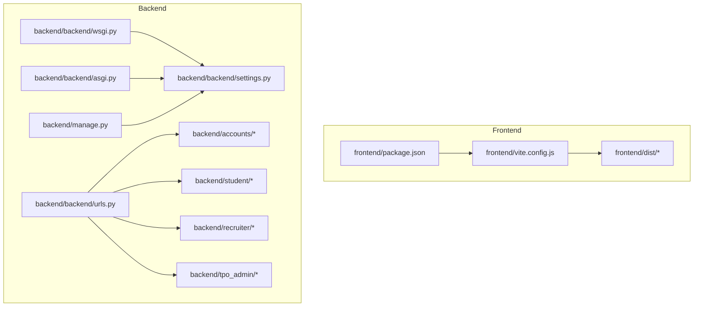
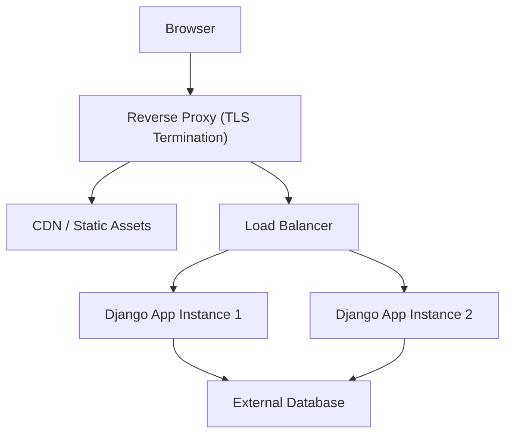
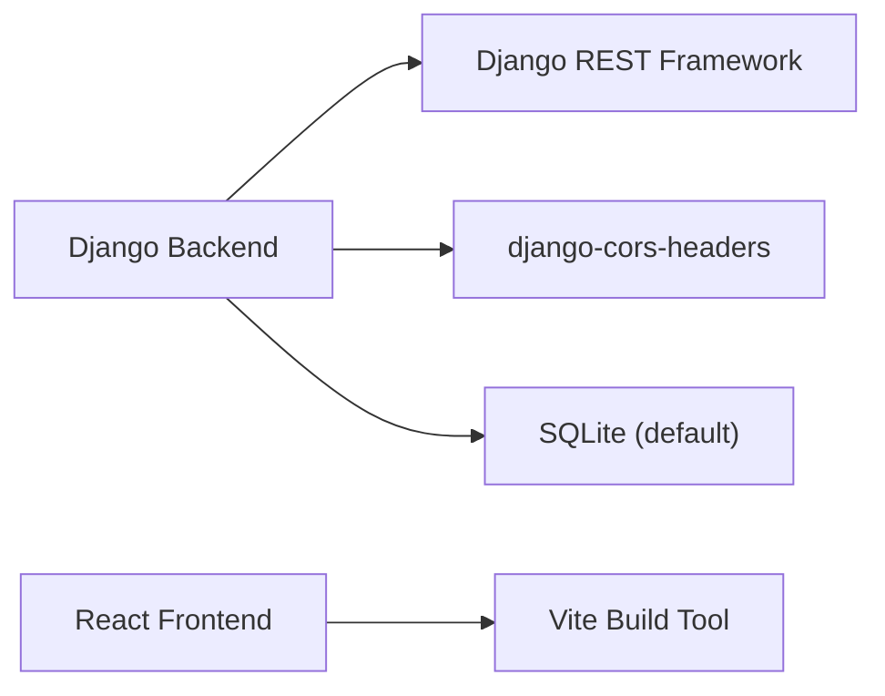

# Production Deployment

<cite>
**Referenced Files in This Document**
- [settings.py](file://backend/backend/settings.py)
- [urls.py](file://backend/backend/urls.py)
- [wsgi.py](file://backend/backend/wsgi.py)
- [asgi.py](file://backend/backend/asgi.py)
- [manage.py](file://backend/manage.py)
- [accounts/models.py](file://backend/accounts/models.py)
- [accounts/migrations/0001_initial.py](file://backend/accounts/migrations/0001_initial.py)
- [accounts/urls.py](file://backend/accounts/urls.py)
- [student/urls.py](file://backend/student/urls.py)
- [recruiter/urls.py](file://backend/recruiter/urls.py)
- [package.json](file://frontend/package.json)
- [vite.config.js](file://frontend/vite.config.js)
</cite>

## Table of Contents
1. [Introduction](#introduction)
2. [Project Structure](#project-structure)
3. [Core Components](#core-components)
4. [Architecture Overview](#architecture-overview)
5. [Detailed Component Analysis](#detailed-component-analysis)
6. [Dependency Analysis](#dependency-analysis)
7. [Performance Considerations](#performance-considerations)
8. [Troubleshooting Guide](#troubleshooting-guide)
9. [Conclusion](#conclusion)
10. [Appendices](#appendices)

## Introduction
This document provides production-grade deployment guidance for the TPO Portal. It covers server requirements, security hardening, production-ready configurations, deployment strategies (manual and CI/CD), reverse proxy and SSL setup, load balancing, database migration strategies, static asset serving, environment variable management, monitoring/logging, and performance optimization. The goal is to enable reliable, secure, and scalable operation of the platform in production environments.

## Project Structure
The TPO Portal consists of:
- A Django backend with modular apps (accounts, student, recruiter, tpo_admin) and REST APIs.
- A React frontend built with Vite, producing static assets.
- A SQLite database by default, suitable for development; replace with a production-grade database for production.

**Diagram sources**
- [settings.py:1-126](file://backend/backend/settings.py#L1-L126)
- [urls.py:1-11](file://backend/backend/urls.py#L1-L11)
- [wsgi.py:1-17](file://backend/backend/wsgi.py#L1-L17)
- [asgi.py:1-17](file://backend/backend/asgi.py#L1-L17)
- [manage.py:1-23](file://backend/manage.py#L1-L23)
- [package.json:1-34](file://frontend/package.json#L1-L34)
- [vite.config.js:1-9](file://frontend/vite.config.js#L1-L9)

**Section sources**
- [settings.py:1-126](file://backend/backend/settings.py#L1-L126)
- [urls.py:1-11](file://backend/backend/urls.py#L1-L11)
- [wsgi.py:1-17](file://backend/backend/wsgi.py#L1-L17)
- [asgi.py:1-17](file://backend/backend/asgi.py#L1-L17)
- [manage.py:1-23](file://backend/manage.py#L1-L23)
- [package.json:1-34](file://frontend/package.json#L1-L34)
- [vite.config.js:1-9](file://frontend/vite.config.js#L1-L9)

## Core Components
- Django settings: Defines security, middleware, apps, database, static files, and CORS.
- URL routing: Centralized routing for admin and API namespaces.
- WSGI/ASGI: Application entry points for production servers.
- Frontend build: Vite-based React app generating static assets for production serving.

Key production readiness items derived from current configuration:
- Security settings (secret key, debug, allowed hosts) require overrides in production.
- CORS origins must reflect production frontend origin(s).
- Database defaults to SQLite; replace with PostgreSQL or MySQL for production.
- Static files served via Django; for scale, serve static assets via CDN or reverse proxy.

**Section sources**
- [settings.py:10-16](file://backend/backend/settings.py#L10-L16)
- [settings.py:18-22](file://backend/backend/settings.py#L18-L22)
- [settings.py:78-86](file://backend/backend/settings.py#L78-L86)
- [settings.py:122-126](file://backend/backend/settings.py#L122-L126)
- [urls.py:4-10](file://backend/backend/urls.py#L4-L10)
- [wsgi.py:10-16](file://backend/backend/wsgi.py#L10-L16)
- [asgi.py:10-16](file://backend/backend/asgi.py#L10-L16)
- [manage.py:9-18](file://backend/manage.py#L9-L18)
- [package.json:6-11](file://frontend/package.json#L6-L11)
- [vite.config.js:5-8](file://frontend/vite.config.js#L5-L8)

## Architecture Overview
The production architecture typically comprises:
- Reverse Proxy (e.g., Nginx) terminating TLS, caching static assets, and proxying dynamic requests.
- Application Servers (WSGI/ASGI) running the Django backend.
- Database (PostgreSQL/MySQL) managed externally.
- CDN for static assets.
- Optional load balancer distributing traffic across multiple app instances.

[No sources needed since this diagram shows conceptual workflow, not actual code structure]

## Detailed Component Analysis

### Backend Settings and Security Hardening
Production-grade adjustments required:
- Secret key: Replace with a securely generated, environment-backed value.
- Debug mode: Disable in production.
- Allowed hosts: Set to production domain(s).
- CORS origins: Restrict to production frontend origins.
- Database: Switch from SQLite to PostgreSQL or MySQL.
- Static files: Configure collectstatic and CDN delivery.
- Middleware: Ensure CSRF and security middleware are enabled and configured appropriately.

Operational implications:
- Environment variables should supply sensitive settings (e.g., SECRET_KEY, DATABASE_URL).
- Use a dedicated production settings module or environment-specific settings loader.

**Section sources**
- [settings.py:10-16](file://backend/backend/settings.py#L10-L16)
- [settings.py:18-22](file://backend/backend/settings.py#L18-L22)
- [settings.py:78-86](file://backend/backend/settings.py#L78-L86)
- [settings.py:122-126](file://backend/backend/settings.py#L122-L126)

### URL Routing and API Exposure
The backend exposes:
- Admin interface under /admin/.
- API namespaces for accounts, student, recruiter, and tpo_admin.

Production considerations:
- Ensure reverse proxy routes align with these URL patterns.
- Implement rate limiting and request size limits at the proxy level.
- Consider API versioning and deprecation policies.

**Section sources**
- [urls.py:4-10](file://backend/backend/urls.py#L4-L10)

### Authentication Model and Token Management
The accounts app defines a custom User model with roles and integrates DRF token authentication. In production:
- Enforce strong password policies and optional MFA.
- Rotate tokens periodically and invalidate on logout.
- Use HTTPS-only cookies and CSRF protection.
- Implement session security (SameSite, Secure, HttpOnly).

**Section sources**
- [accounts/models.py:1-25](file://backend/accounts/models.py#L1-L25)
- [accounts/urls.py:4-9](file://backend/accounts/urls.py#L4-L9)

### Database Migration Strategies
Current state:
- Initial migration present for the accounts app’s User model.

Production guidance:
- Use separate migration files for each app and apply them in order during deployments.
- For zero-downtime migrations, prefer additive-only schema changes and background jobs for data transformations.
- Back up the database before applying migrations in production.
- Use atomic transactions and dry-run checks where applicable.

**Section sources**
- [accounts/migrations/0001_initial.py:9-45](file://backend/accounts/migrations/0001_initial.py#L9-L45)

### Static File Serving
Current state:
- Django serves static files via STATIC_URL.

Production guidance:
- Collect static files to a single directory and serve via CDN or reverse proxy.
- Configure cache headers and fingerprinting for long-term caching.
- Separate media uploads to object storage (e.g., S3) and serve via signed URLs.

**Section sources**
- [settings.py:122-126](file://backend/backend/settings.py#L122-L126)

### Reverse Proxy and SSL Configuration
Recommended steps:
- Terminate TLS at the reverse proxy (e.g., Nginx) with strong ciphers and modern protocols.
- Serve frontend static assets directly from the reverse proxy or CDN.
- Proxy dynamic requests to Django WSGI/ASGI workers.
- Set security headers (HSTS, CSP, X-Frame-Options).
- Enable gzip/brotli compression for static assets.

[No sources needed since this section provides general guidance]

### Load Balancing Considerations
- Use a load balancer to distribute traffic across multiple Django instances.
- Configure health checks and sticky sessions if required by session storage.
- Ensure shared session storage or stateless sessions when scaling horizontally.

[No sources needed since this section provides general guidance]

### Environment Variable Management
Critical variables to externalize:
- DJANGO_SETTINGS_MODULE
- SECRET_KEY
- DATABASE_URL
- ALLOWED_HOSTS
- CORS_ALLOWED_ORIGINS
- DEBUG
- FRONTEND_URL

Implementation tips:
- Use a secrets manager or environment injection at runtime.
- Keep a template file with defaults for local development and override in production.

**Section sources**
- [manage.py:9-18](file://backend/manage.py#L9-L18)
- [settings.py:10-16](file://backend/backend/settings.py#L10-L16)
- [settings.py:18-22](file://backend/backend/settings.py#L18-L22)

### Monitoring and Logging
- Application logs: Capture structured logs (JSON) and forward to centralized logging (e.g., ELK, Loki).
- Health endpoints: Expose readiness/liveness probes at the reverse proxy or application level.
- Metrics: Export metrics via Prometheus and scrape from a dedicated endpoint.
- Alerting: Configure alerts for error rates, latency, and resource utilization.

[No sources needed since this section provides general guidance]

### Performance Optimization Techniques
- Database: Use connection pooling, read replicas, and query optimization.
- Caching: Introduce Redis/Memcached for session and API caching.
- CDN: Offload static assets and compress on the fly.
- Gunicorn/uWSGI: Tune worker processes and threads for CPU-bound vs I/O-bound workloads.
- Frontend: Bundle splitting, lazy loading, and preloading critical resources.

[No sources needed since this section provides general guidance]

## Dependency Analysis
The backend depends on Django, DRF, and CORS packages. The frontend depends on React, React Router, Axios, and Vite. These dependencies influence deployment packaging and runtime requirements.

**Diagram sources**
- [settings.py:27-45](file://backend/backend/settings.py#L27-L45)
- [package.json:12-18](file://frontend/package.json#L12-L18)

**Section sources**
- [settings.py:27-45](file://backend/backend/settings.py#L27-L45)
- [package.json:12-18](file://frontend/package.json#L12-L18)

## Performance Considerations
- Database: Prefer PostgreSQL/MySQL with connection pooling and read replicas.
- Caching: Use Redis for sessions and API caching.
- Static assets: Serve via CDN with compression and cache headers.
- Workers: Scale Django workers horizontally behind a load balancer.
- Frontend: Optimize bundle size and leverage browser caching.

[No sources needed since this section provides general guidance]

## Troubleshooting Guide
Common production issues and resolutions:
- 403 CSRF or CORS errors: Verify ALLOWED_HOSTS and CORS_ALLOWED_ORIGINS match production domains.
- 500 Internal Server Errors: Check application logs and ensure SECRET_KEY and DATABASE_URL are set.
- Static assets missing: Confirm collectstatic ran and reverse proxy serves static files from the configured directory.
- Database connectivity: Validate DATABASE_URL format and network access to the database host.

**Section sources**
- [settings.py:10-16](file://backend/backend/settings.py#L10-L16)
- [settings.py:18-22](file://backend/backend/settings.py#L18-L22)
- [settings.py:78-86](file://backend/backend/settings.py#L78-L86)
- [settings.py:122-126](file://backend/backend/settings.py#L122-L126)

## Conclusion
Deploying the TPO Portal in production requires replacing development defaults with hardened, environment-driven configurations, selecting a production-grade database, and implementing robust reverse proxy, SSL/TLS, load balancing, and monitoring. By following the strategies outlined here—security hardening, CI/CD-aligned deployments, CDN/static asset optimization, and comprehensive observability—you can achieve a reliable, scalable, and secure platform.

[No sources needed since this section summarizes without analyzing specific files]

## Appendices

### Appendix A: Production Checklist
- Replace SECRET_KEY with environment-backed value.
- Set ALLOWED_HOSTS to production domains.
- Configure CORS_ALLOWED_ORIGINS to frontend origin(s).
- Switch DATABASES to PostgreSQL/MySQL and configure DATABASE_URL.
- Enable production logging and metrics.
- Deploy reverse proxy with TLS termination and security headers.
- Configure CDN for static assets and media.
- Set up CI/CD pipeline with automated testing and migrations.
- Plan rollout strategy (blue/green or rolling updates) and rollback plan.

[No sources needed since this section provides general guidance]