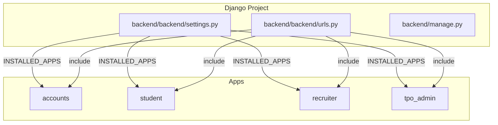
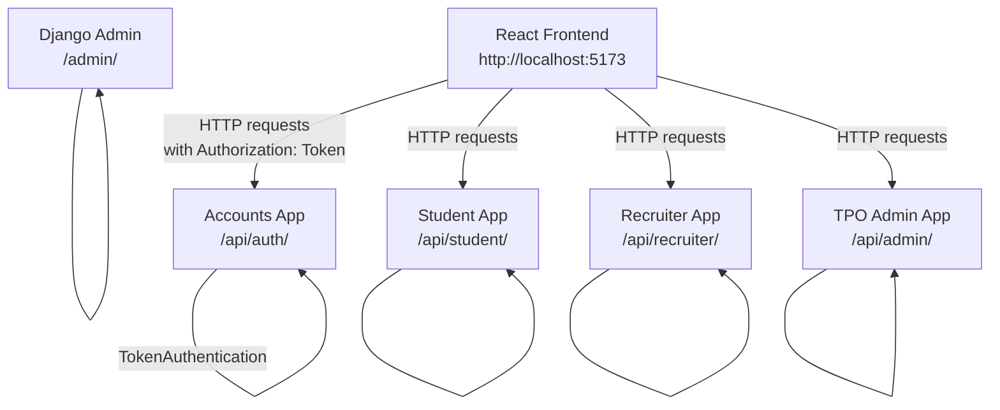
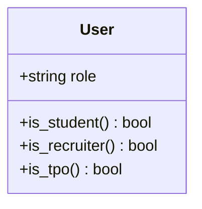
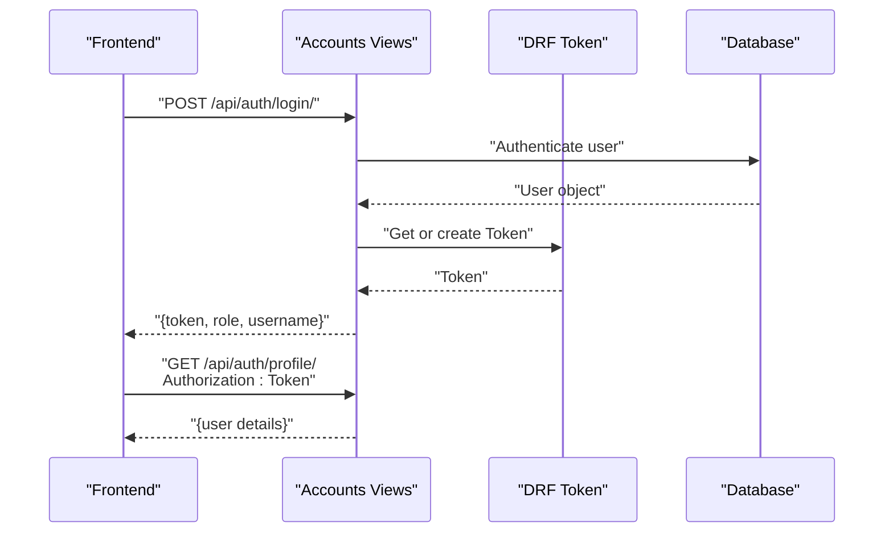
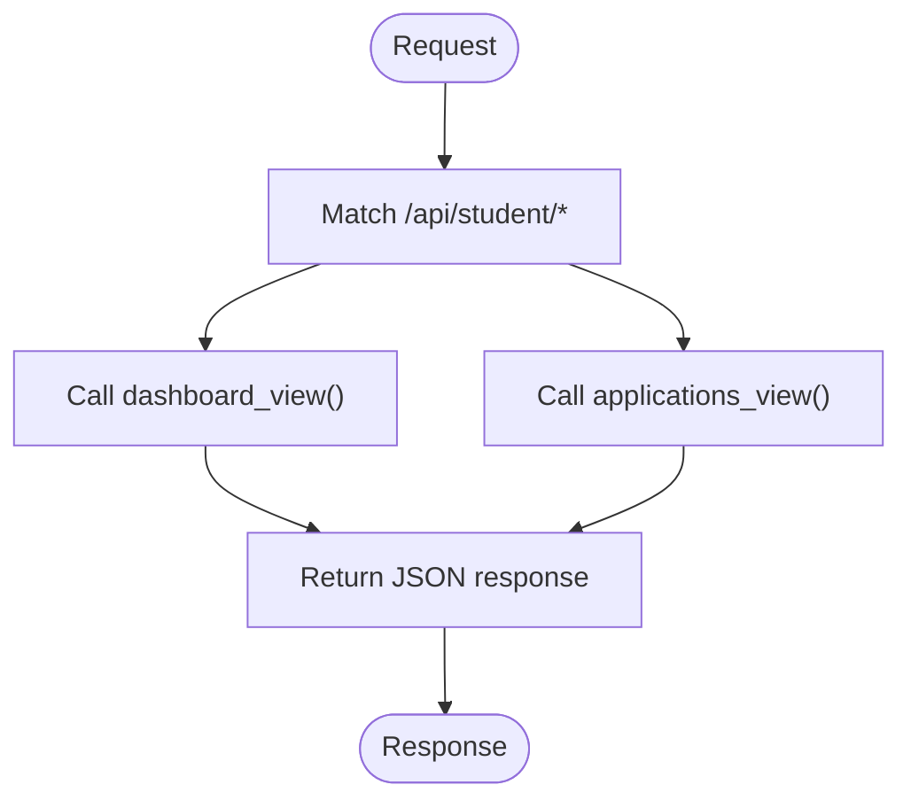
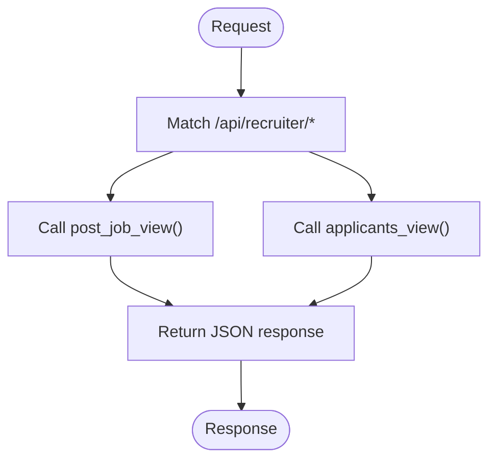
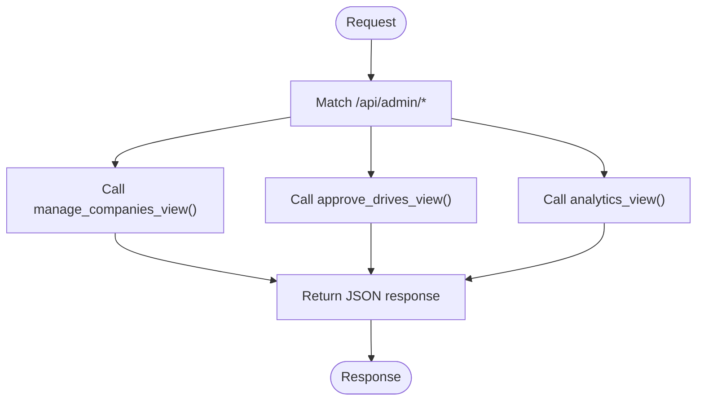
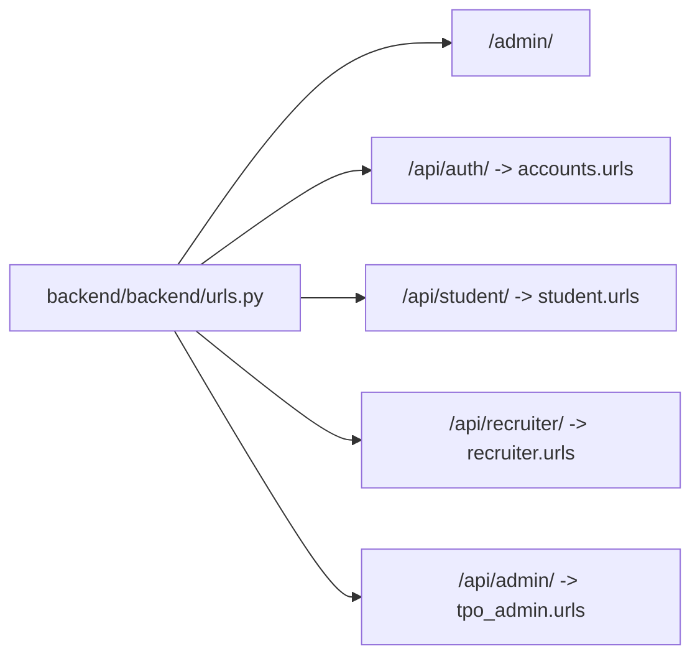
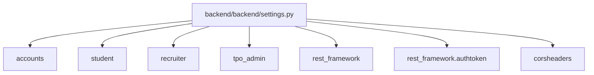

# Backend Development

<cite>
**Referenced Files in This Document**
- [settings.py](file://backend/backend/settings.py)
- [urls.py](file://backend/backend/urls.py)
- [manage.py](file://backend/manage.py)
- [models.py](file://backend/accounts/models.py)
- [views.py](file://backend/accounts/views.py)
- [urls.py](file://backend/accounts/urls.py)
- [models.py](file://backend/student/models.py)
- [views.py](file://backend/student/views.py)
- [urls.py](file://backend/student/urls.py)
- [models.py](file://backend/recruiter/models.py)
- [views.py](file://backend/recruiter/views.py)
- [urls.py](file://backend/recruiter/urls.py)
- [models.py](file://backend/tpo_admin/models.py)
- [views.py](file://backend/tpo_admin/views.py)
- [urls.py](file://backend/tpo_admin/urls.py)
- [admin.py](file://backend/accounts/admin.py)
- [admin.py](file://backend/student/admin.py)
- [admin.py](file://backend/recruiter/admin.py)
- [admin.py](file://backend/tpo_admin/admin.py)
</cite>

## Table of Contents
1. [Introduction](#introduction)
2. [Project Structure](#project-structure)
3. [Core Components](#core-components)
4. [Architecture Overview](#architecture-overview)
5. [Detailed Component Analysis](#detailed-component-analysis)
6. [Dependency Analysis](#dependency-analysis)
7. [Performance Considerations](#performance-considerations)
8. [Troubleshooting Guide](#troubleshooting-guide)
9. [Conclusion](#conclusion)
10. [Appendices](#appendices)

## Introduction
This document provides comprehensive backend development documentation for the Django-based TPO Portal API. It explains the project layout, app organization, URL routing, custom user model and authentication, permissions, and current API endpoints. It also outlines recommended patterns for adding new apps, models, views, serializers, and URL configurations, along with migration strategies, data integrity constraints, logging, error handling, and performance optimization.

## Project Structure
The backend is organized as a standard Django project with multiple apps:
- accounts: Central authentication and user management
- student: Student-facing features
- recruiter: Recruiter-facing features
- tpo_admin: TPO administrator features

Key configuration files:
- Settings define installed apps, middleware, CORS, authentication backend, and static/media paths.
- Root URL configuration wires app-specific URLs under API prefixes.
- Management script sets the Django settings module.

**Diagram sources**
- [settings.py](file://backend/backend/settings.py)
- [urls.py](file://backend/backend/urls.py)

**Section sources**
- [settings.py](file://backend/backend/settings.py)
- [urls.py](file://backend/backend/urls.py)
- [manage.py](file://backend/manage.py)

## Core Components
- Custom User Model: Extends AbstractUser with a role field and convenience methods to check roles.
- Authentication Views: Login, registration, profile retrieval, and logout endpoints.
- App-Specific Views: Placeholder endpoints for student, recruiter, and admin features.
- URL Routing: API endpoints grouped by app under dedicated prefixes.

**Section sources**
- [models.py](file://backend/accounts/models.py)
- [views.py](file://backend/accounts/views.py)
- [urls.py](file://backend/accounts/urls.py)
- [views.py](file://backend/student/views.py)
- [urls.py](file://backend/student/urls.py)
- [views.py](file://backend/recruiter/views.py)
- [urls.py](file://backend/recruiter/urls.py)
- [views.py](file://backend/tpo_admin/views.py)
- [urls.py](file://backend/tpo_admin/urls.py)

## Architecture Overview
The backend uses Django with Django REST Framework for token-based authentication and a simple token header scheme. CORS is configured to allow the local frontend origin. Middleware stack includes CORS, session, CSRF, and authentication middleware.

**Diagram sources**
- [settings.py](file://backend/backend/settings.py)
- [urls.py](file://backend/backend/urls.py)
- [urls.py](file://backend/accounts/urls.py)
- [urls.py](file://backend/student/urls.py)
- [urls.py](file://backend/recruiter/urls.py)
- [urls.py](file://backend/tpo_admin/urls.py)

## Detailed Component Analysis

### Accounts App: Custom User Model and Authentication
- Custom User Model:
  - Inherits from AbstractUser.
  - Adds a role field with predefined choices and convenience methods to check roles.
- Authentication Views:
  - Login supports username or email and returns a DRF Token.
  - Registration creates a new user with provided details.
  - Profile endpoint requires a valid token and returns user info.
  - Logout clears the session.

**Diagram sources**
- [models.py](file://backend/accounts/models.py)

**Diagram sources**
- [views.py](file://backend/accounts/views.py)
- [urls.py](file://backend/accounts/urls.py)

**Section sources**
- [models.py](file://backend/accounts/models.py)
- [views.py](file://backend/accounts/views.py)
- [urls.py](file://backend/accounts/urls.py)

### Student App
- Endpoints:
  - GET /api/student/dashboard/
  - GET /api/student/applications/

**Diagram sources**
- [views.py](file://backend/student/views.py)
- [urls.py](file://backend/student/urls.py)

**Section sources**
- [views.py](file://backend/student/views.py)
- [urls.py](file://backend/student/urls.py)

### Recruiter App
- Endpoints:
  - POST /api/recruiter/post-job/ (CSRF-exempt)
  - GET /api/recruiter/applicants/

**Diagram sources**
- [views.py](file://backend/recruiter/views.py)
- [urls.py](file://backend/recruiter/urls.py)

**Section sources**
- [views.py](file://backend/recruiter/views.py)
- [urls.py](file://backend/recruiter/urls.py)

### TPO Admin App
- Endpoints:
  - GET /api/admin/companies/
  - GET /api/admin/drives/
  - GET /api/admin/results/

**Diagram sources**
- [views.py](file://backend/tpo_admin/views.py)
- [urls.py](file://backend/tpo_admin/urls.py)

**Section sources**
- [views.py](file://backend/tpo_admin/views.py)
- [urls.py](file://backend/tpo_admin/urls.py)

### URL Routing Configuration
- Root URL patterns include:
  - Admin: /admin/
  - Accounts: /api/auth/
  - Student: /api/student/
  - Recruiter: /api/recruiter/
  - TPO Admin: /api/admin/

**Diagram sources**
- [urls.py](file://backend/backend/urls.py)

**Section sources**
- [urls.py](file://backend/backend/urls.py)

## Dependency Analysis
- Installed Apps:
  - Core Django apps plus accounts, student, recruiter, tpo_admin.
  - Third-party: djangorestframework, rest_framework.authtoken, corsheaders.
- Middleware:
  - CORS middleware included early.
  - Session, CSRF, Authentication, Messages, Security, XFrameOptions.
- Authentication:
  - AUTH_USER_MODEL set to accounts.User.
  - TokenAuthentication used for protected endpoints.

**Diagram sources**
- [settings.py](file://backend/backend/settings.py)

**Section sources**
- [settings.py](file://backend/backend/settings.py)

## Performance Considerations
- Use pagination for list endpoints.
- Add database indexes on frequently filtered fields.
- Minimize N+1 queries via select_related and prefetch_related.
- Cache infrequent reports and analytics.
- Keep serializers lean; avoid over-fetching related objects.
- Use streaming responses for large datasets when appropriate.
- Monitor slow SQL queries and optimize with EXPLAIN plans.

## Troubleshooting Guide
- Authentication failures:
  - Ensure Authorization header includes a valid token for protected endpoints.
  - Verify the token exists and is not expired.
- CORS errors:
  - Confirm frontend origin is included in CORS_ALLOWED_ORIGINS.
- Role checks:
  - Use the custom user role helpers to gate endpoints.
- CSRF for form submissions:
  - Endpoints that accept form posts are CSRF-exempt; avoid mixing with DRF token-authenticated endpoints.

**Section sources**
- [settings.py](file://backend/backend/settings.py)
- [views.py](file://backend/accounts/views.py)

## Conclusion
The TPO Portal backend follows a clean, modular Django structure with a custom user model and token-based authentication. URL routing is organized by functional domain, and the project is ready to integrate serializers and models for richer functionality. The recommendations in this guide will help maintain consistency, security, and performance as the system evolves.

## Appendices

### Creating New Django Apps
- Create the app directory and register it in INSTALLED_APPS.
- Define models with appropriate constraints and relationships.
- Create views (function-based or class-based) and map them to URLs.
- Add serializers for DRF endpoints.
- Configure permissions and authentication decorators.
- Run migrations after model changes.

**Section sources**
- [settings.py](file://backend/backend/settings.py)

### Adding Models and Migrations
- Extend the base User model for role-specific profiles if needed.
- Use ForeignKey/M2M relationships to connect role-specific models.
- Add validators and constraints at the model level.
- Generate and apply migrations after changes.

**Section sources**
- [models.py](file://backend/accounts/models.py)

### Serializers and API Endpoints
- Use serializers to validate and transform request/response data.
- For DRF, decorate views with authentication_classes and permission_classes.
- Return Response objects for consistent status codes and serialization.

[No sources needed since this section provides general guidance]

### Middleware and Security
- Keep CORS allowed origins minimal and precise.
- Use TokenAuthentication for stateless APIs.
- Enforce IsAuthenticated for protected routes.
- Review CSRF exemptions carefully.

**Section sources**
- [settings.py](file://backend/backend/settings.py)

### Admin Registration
- Register models in admin.py for each app to enable Django Admin management.

**Section sources**
- [admin.py](file://backend/accounts/admin.py)
- [admin.py](file://backend/student/admin.py)
- [admin.py](file://backend/recruiter/admin.py)
- [admin.py](file://backend/tpo_admin/admin.py)