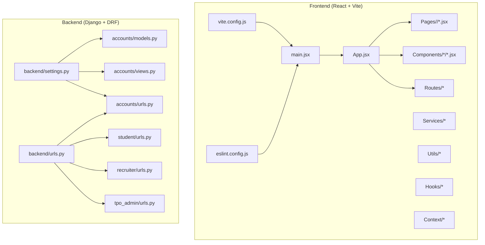
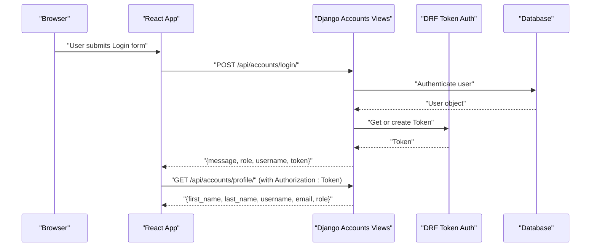
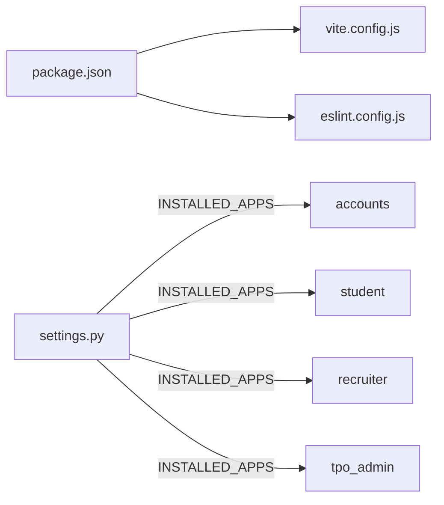

# Code Standards & Conventions

<cite>
**Referenced Files in This Document**
- [package.json](file://frontend/package.json)
- [eslint.config.js](file://frontend/eslint.config.js)
- [vite.config.js](file://frontend/vite.config.js)
- [App.jsx](file://frontend/src/App.jsx)
- [main.jsx](file://frontend/src/main.jsx)
- [Login.jsx](file://frontend/src/Pages/Public/Login.jsx)
- [Dashboard.jsx](file://frontend/src/Pages/Student/Dashboard.jsx)
- [settings.py](file://backend/backend/settings.py)
- [models.py](file://backend/accounts/models.py)
- [views.py](file://backend/accounts/views.py)
- [urls.py](file://backend/accounts/urls.py)
- [student.urls.py](file://backend/student/urls.py)
- [recruiter.urls.py](file://backend/recruiter/urls.py)
- [tpo_admin.urls.py](file://backend/tpo_admin/urls.py)
</cite>

## Table of Contents
1. [Introduction](#introduction)
2. [Project Structure](#project-structure)
3. [Core Components](#core-components)
4. [Architecture Overview](#architecture-overview)
5. [Detailed Component Analysis](#detailed-component-analysis)
6. [Dependency Analysis](#dependency-analysis)
7. [Performance Considerations](#performance-considerations)
8. [Troubleshooting Guide](#troubleshooting-guide)
9. [Conclusion](#conclusion)
10. [Appendices](#appendices)

## Introduction
This document defines code standards and conventions for the TPO Portal project across frontend (React + Vite) and backend (Django + Django REST Framework). It consolidates current patterns observed in the codebase and provides prescriptive guidelines for React component naming, file organization, component composition, ESLint configuration, formatting, variable naming, Django app structure, model naming, view organization, API endpoint conventions, parameter naming, response formats, commit messages, branch naming, code review practices, documentation standards, comment practices, readability requirements, performance, security, accessibility, and examples of well-structured components, models, and endpoints.

## Project Structure
The project follows a clear separation of concerns:
- Frontend: React application bootstrapped with Vite, organized under src with feature-based grouping (Components, Pages, Services, Utils, Hooks, Context, Routes).
- Backend: Django project with modular apps (accounts, student, recruiter, tpo_admin), each containing models, views, URLs, admin, migrations, and tests.

**Diagram sources**
- [main.jsx:1-11](file://frontend/src/main.jsx#L1-L11)
- [App.jsx:1-55](file://frontend/src/App.jsx#L1-L55)
- [vite.config.js:1-9](file://frontend/vite.config.js#L1-L9)
- [eslint.config.js:1-30](file://frontend/eslint.config.js#L1-L30)
- [settings.py:1-126](file://backend/backend/settings.py#L1-L126)
- [models.py:1-25](file://backend/accounts/models.py#L1-L25)
- [views.py:1-95](file://backend/accounts/views.py#L1-L95)
- [urls.py:1-10](file://backend/accounts/urls.py#L1-L10)
- [student.urls.py:1-8](file://backend/student/urls.py#L1-L8)
- [recruiter.urls.py:1-8](file://backend/recruiter/urls.py#L1-L8)
- [tpo_admin.urls.py:1-9](file://backend/tpo_admin/urls.py#L1-L9)

**Section sources**
- [main.jsx:1-11](file://frontend/src/main.jsx#L1-L11)
- [App.jsx:1-55](file://frontend/src/App.jsx#L1-L55)
- [vite.config.js:1-9](file://frontend/vite.config.js#L1-L9)
- [eslint.config.js:1-30](file://frontend/eslint.config.js#L1-L30)
- [settings.py:1-126](file://backend/backend/settings.py#L1-L126)
- [models.py:1-25](file://backend/accounts/models.py#L1-L25)
- [views.py:1-95](file://backend/accounts/views.py#L1-L95)
- [urls.py:1-10](file://backend/accounts/urls.py#L1-L10)
- [student.urls.py:1-8](file://backend/student/urls.py#L1-L8)
- [recruiter.urls.py:1-8](file://backend/recruiter/urls.py#L1-L8)
- [tpo_admin.urls.py:1-9](file://backend/tpo_admin/urls.py#L1-L9)

## Core Components
- React application entrypoint initializes the root and mounts App.
- App configures routes for Public, Student, Recruiter, and Admin pages.
- ESLint is configured via flat config with recommended rules and React-specific plugins.
- Django settings centralize installed apps, middleware, CORS, and static files.
- Accounts app defines a custom User model and authentication endpoints.
- Each app exposes a dedicated URL namespace via its own urls.py.

Key conventions derived from the codebase:
- React component naming: PascalCase for components; filename matches component name.
- File organization: Feature-based grouping under src (Pages, Components, Services, Utils, Hooks, Context, Routes).
- Component composition: Functional components with hooks; minimal inline styles; centralized routing.
- ESLint: Flat config with recommended base rules, React hooks plugin, React refresh plugin, and a single rule allowing uppercase-ignored unused vars.
- Django: Modular apps per role; explicit URL namespaces; DRF decorators for authentication and permissions; token-based auth for protected endpoints.

**Section sources**
- [main.jsx:1-11](file://frontend/src/main.jsx#L1-L11)
- [App.jsx:1-55](file://frontend/src/App.jsx#L1-L55)
- [eslint.config.js:1-30](file://frontend/eslint.config.js#L1-L30)
- [settings.py:1-126](file://backend/backend/settings.py#L1-L126)
- [models.py:1-25](file://backend/accounts/models.py#L1-L25)
- [views.py:1-95](file://backend/accounts/views.py#L1-L95)
- [urls.py:1-10](file://backend/accounts/urls.py#L1-L10)

## Architecture Overview
High-level flow:
- Frontend boots via main.jsx and renders App.jsx, which defines routes for role-specific pages.
- Authentication requests hit accounts endpoints (login, register, profile, logout).
- Protected endpoints require DRF token authentication.

**Diagram sources**
- [Login.jsx:17-55](file://frontend/src/Pages/Public/Login.jsx#L17-L55)
- [views.py:13-89](file://backend/accounts/views.py#L13-L89)
- [urls.py:4-9](file://backend/accounts/urls.py#L4-L9)

**Section sources**
- [Login.jsx:17-55](file://frontend/src/Pages/Public/Login.jsx#L17-L55)
- [views.py:13-89](file://backend/accounts/views.py#L13-L89)
- [urls.py:4-9](file://backend/accounts/urls.py#L4-L9)

## Detailed Component Analysis

### React Component Naming, File Organization, and Composition Guidelines
- Naming: Components are PascalCase; filenames match component names.
- File organization: Feature-based grouping under src (Pages, Components, Services, Utils, Hooks, Context, Routes).
- Composition: Prefer functional components with hooks; avoid heavy inline styles; keep presentational logic minimal.
- Routing: Centralized in App.jsx with route guards and navigation helpers.

Example references:
- Component declaration and exports: [Login.jsx:4-55](file://frontend/src/Pages/Public/Login.jsx#L4-L55)
- Routing configuration: [App.jsx:25-52](file://frontend/src/App.jsx#L25-L52)

**Section sources**
- [Login.jsx:4-55](file://frontend/src/Pages/Public/Login.jsx#L4-L55)
- [App.jsx:25-52](file://frontend/src/App.jsx#L25-L52)

### ESLint Configuration Rules and Formatting Standards
- Configuration: Flat config with recommended base rules, React hooks plugin, and React refresh plugin.
- Language options: ECMAScript 2020, JSX enabled, module source type.
- Rule: Disallow unused vars but ignore vars matching uppercase underscore pattern (suitable for constants).

Recommendations:
- Enforce consistent formatting via Prettier or similar formatter integrated with ESLint.
- Add rules for import order, no-console in production, and explicit return types for TS if adopted later.
- Keep the current vars-ignore pattern for constants while ensuring local variables remain lint-clean.

**Section sources**
- [eslint.config.js:1-30](file://frontend/eslint.config.js#L1-L30)

### Variable Naming Conventions
- Constants: Uppercase with underscores (e.g., IS_STUDENT).
- Variables and functions: camelCase.
- Props and event handlers: camelCase; event handlers prefixed with handle.
- State objects: descriptive nouns (e.g., form, stats).

Examples:
- Constants and roles: [models.py:5-13](file://backend/accounts/models.py#L5-L13)
- Event handler naming: [Login.jsx:13-15](file://frontend/src/Pages/Public/Login.jsx#L13-L15)
- State naming: [Dashboard.jsx:9-18](file://frontend/src/Pages/Student/Dashboard.jsx#L9-L18)

**Section sources**
- [models.py:5-13](file://backend/accounts/models.py#L5-L13)
- [Login.jsx:13-15](file://frontend/src/Pages/Public/Login.jsx#L13-L15)
- [Dashboard.jsx:9-18](file://frontend/src/Pages/Student/Dashboard.jsx#L9-L18)

### Django App Structure Conventions, Model Naming Patterns, and View Function Organization
- App structure: Each role has its own app with models.py, views.py, urls.py, admin.py, migrations/, tests.py.
- Model naming: Singular, PascalCase; related fields and choices clearly defined.
- View organization: Separate endpoints per action; use DRF decorators for authentication and permissions; return structured JSON.

Examples:
- Custom User model with role choices: [models.py:4-24](file://backend/accounts/models.py#L4-L24)
- Endpoint organization and decorators: [views.py:13-89](file://backend/accounts/views.py#L13-L89)
- URL namespaces per app: [urls.py:4-9](file://backend/accounts/urls.py#L4-L9), [student.urls.py:4-7](file://backend/student/urls.py#L4-L7), [recruiter.urls.py:4-7](file://backend/recruiter/urls.py#L4-L7), [tpo_admin.urls.py:4-8](file://backend/tpo_admin/urls.py#L4-L8)

**Section sources**
- [models.py:4-24](file://backend/accounts/models.py#L4-L24)
- [views.py:13-89](file://backend/accounts/views.py#L13-L89)
- [urls.py:4-9](file://backend/accounts/urls.py#L4-L9)
- [student.urls.py:4-7](file://backend/student/urls.py#L4-L7)
- [recruiter.urls.py:4-7](file://backend/recruiter/urls.py#L4-L7)
- [tpo_admin.urls.py:4-8](file://backend/tpo_admin/urls.py#L4-L8)

### API Endpoint Naming Conventions, Parameter Naming, and Response Format Standards
- Endpoint naming: Use plural nouns for resources; kebab-case for paths; consistent with URL patterns.
- Parameter naming: Use snake_case for JSON payload keys; mirror database field names where appropriate.
- Response format: Standardize success and error responses; include message and relevant data; maintain consistent HTTP status codes.

Examples:
- Login endpoint accepts username/email and password; returns token and role: [views.py:13-45](file://backend/accounts/views.py#L13-L45)
- Registration endpoint validates uniqueness and creates user: [views.py:48-75](file://backend/accounts/views.py#L48-L75)
- Protected profile endpoint returns user details: [views.py:78-89](file://backend/accounts/views.py#L78-L89)
- URL patterns for endpoints: [urls.py:4-9](file://backend/accounts/urls.py#L4-L9)

**Section sources**
- [views.py:13-89](file://backend/accounts/views.py#L13-L89)
- [urls.py:4-9](file://backend/accounts/urls.py#L4-L9)

### Commit Message Conventions, Branch Naming Strategies, and Code Review Guidelines
Commit message conventions:
- Use imperative mood: "Add feature", "Fix bug", "Refactor component".
- Prefix with scope: feat(accounts): add login view, fix(student): resolve dashboard layout.
- Keep subject concise (< 50 chars), separate body with blank line.

Branch naming:
- feature/short-description
- fix/issue-number-short-description
- refactor/module-name
- docs/readme-updates

Code review guidelines:
- Ensure all new components follow naming and composition guidelines.
- Verify ESLint passes locally before opening PR.
- Confirm backend endpoints return consistent JSON and use proper HTTP status codes.
- Validate URL namespaces and route paths align with frontend navigation.

[No sources needed since this section provides general guidance]

### Documentation Standards, Comment Practices, and Code Readability Requirements
Documentation standards:
- Document public APIs with request/response schemas.
- Maintain inline comments for complex logic; avoid redundant comments for obvious code.

Comment practices:
- Use // for inline explanations; /* */ for temporary blocks during debugging.
- Keep comments concise and focused on intent, not mechanics.

Readability requirements:
- Prefer small, focused functions and components.
- Use consistent indentation and spacing.
- Group related imports and constants.

[No sources needed since this section provides general guidance]

### Performance Coding Standards
- Frontend: Lazy-load heavy components; minimize re-renders with memoization; avoid unnecessary state updates.
- Backend: Use select_related/ prefetch_related; cache frequently accessed data; paginate large lists.

[No sources needed since this section provides general guidance]

### Security Coding Practices
- CSRF: Use Django CSRF middleware; avoid csrf_exempt unless absolutely necessary.
- Authentication: Use DRF token authentication for protected endpoints; validate tokens server-side.
- Input validation: Sanitize and validate inputs; avoid exposing internal errors to clients.
- CORS: Configure allowed origins carefully; restrict to development and production domains.

**Section sources**
- [settings.py:18-22](file://backend/backend/settings.py#L18-L22)
- [views.py:13-89](file://backend/accounts/views.py#L13-L89)

### Accessibility Implementation Guidelines
- Use semantic HTML and ARIA attributes where needed.
- Ensure sufficient color contrast and keyboard navigability.
- Provide meaningful alt text for images and icons.
- Test with screen readers and keyboard-only navigation.

[No sources needed since this section provides general guidance]

## Dependency Analysis
Frontend dependencies and dev dependencies are declared in package.json. Vite is configured with React and Tailwind plugins. Django settings define installed apps, middleware, and CORS.

**Diagram sources**
- [package.json:1-34](file://frontend/package.json#L1-L34)
- [vite.config.js:1-9](file://frontend/vite.config.js#L1-L9)
- [eslint.config.js:1-30](file://frontend/eslint.config.js#L1-L30)
- [settings.py:27-45](file://backend/backend/settings.py#L27-L45)

**Section sources**
- [package.json:1-34](file://frontend/package.json#L1-L34)
- [vite.config.js:1-9](file://frontend/vite.config.js#L1-L9)
- [eslint.config.js:1-30](file://frontend/eslint.config.js#L1-L30)
- [settings.py:27-45](file://backend/backend/settings.py#L27-L45)

## Performance Considerations
- Frontend: Split large components into smaller ones; leverage React.lazy and Suspense for code splitting; optimize rendering with useMemo/useCallback where appropriate.
- Backend: Use database indexing on frequently queried fields; implement pagination; cache token lookups; avoid N+1 queries.

[No sources needed since this section provides general guidance]

## Troubleshooting Guide
Common issues and resolutions:
- ESLint failures: Run lint script and fix reported issues; ensure no-unused-vars rule is satisfied.
- CORS errors: Verify allowed origins in settings and ensure frontend runs on configured ports.
- Authentication failures: Confirm token presence and validity; check DRF authentication classes.

**Section sources**
- [package.json:6-11](file://frontend/package.json#L6-L11)
- [settings.py:18-22](file://backend/backend/settings.py#L18-L22)
- [views.py:78-89](file://backend/accounts/views.py#L78-L89)

## Conclusion
These standards consolidate current patterns and establish a foundation for consistent development across the TPO Portal. By adhering to the naming, organization, composition, linting, Django app structure, endpoint conventions, and security/accessibility practices outlined here, contributors can maintain a clean, readable, and secure codebase.

[No sources needed since this section summarizes without analyzing specific files]

## Appendices

### Example: Well-Structured React Component
- Component: Login page with controlled form state, async login flow, and role-based navigation.
- Reference: [Login.jsx:4-55](file://frontend/src/Pages/Public/Login.jsx#L4-L55)

**Section sources**
- [Login.jsx:4-55](file://frontend/src/Pages/Public/Login.jsx#L4-L55)

### Example: Well-Structured Django Model
- Model: Custom User with role choices and helper methods.
- Reference: [models.py:4-24](file://backend/accounts/models.py#L4-L24)

**Section sources**
- [models.py:4-24](file://backend/accounts/models.py#L4-L24)

### Example: Well-Structured Django View and URL
- View: Login, register, profile, and logout endpoints with proper decorators and JSON responses.
- URL: Namespaced endpoints per app.
- References:
  - [views.py:13-89](file://backend/accounts/views.py#L13-L89)
  - [urls.py:4-9](file://backend/accounts/urls.py#L4-L9)
  - [student.urls.py:4-7](file://backend/student/urls.py#L4-L7)
  - [recruiter.urls.py:4-7](file://backend/recruiter/urls.py#L4-L7)
  - [tpo_admin.urls.py:4-8](file://backend/tpo_admin/urls.py#L4-L8)

**Section sources**
- [views.py:13-89](file://backend/accounts/views.py#L13-L89)
- [urls.py:4-9](file://backend/accounts/urls.py#L4-L9)
- [student.urls.py:4-7](file://backend/student/urls.py#L4-L7)
- [recruiter.urls.py:4-7](file://backend/recruiter/urls.py#L4-L7)
- [tpo_admin.urls.py:4-8](file://backend/tpo_admin/urls.py#L4-L8)