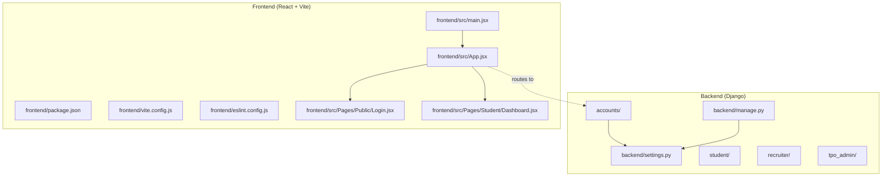
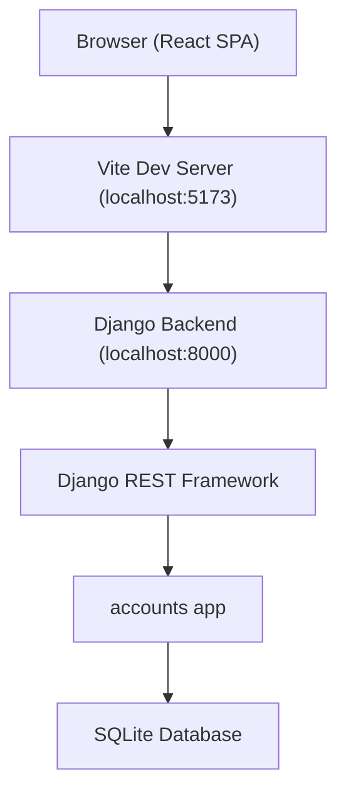
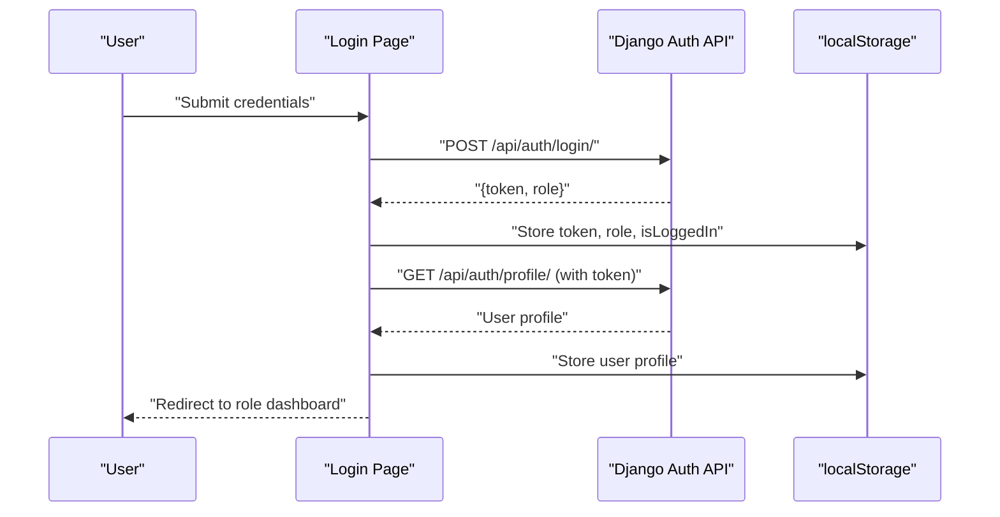
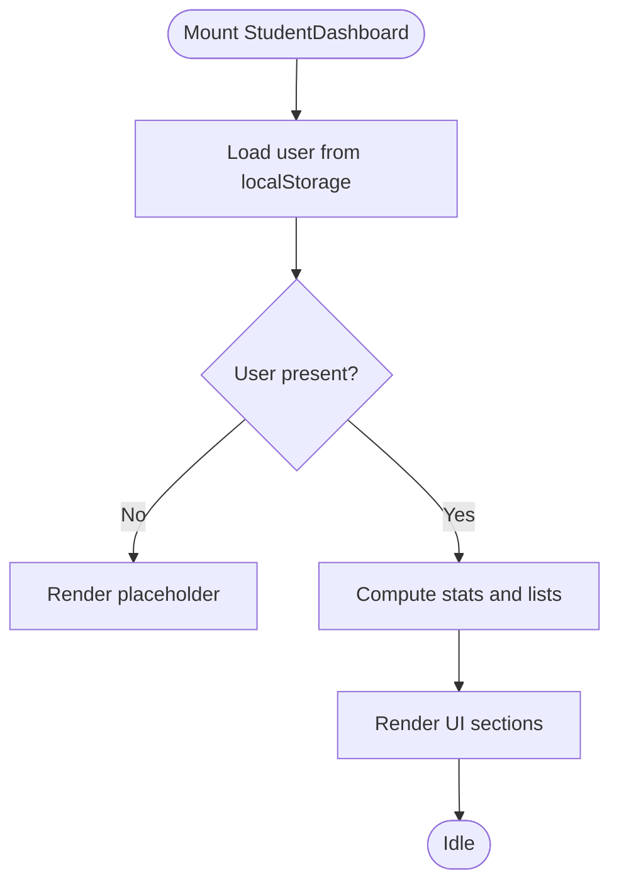
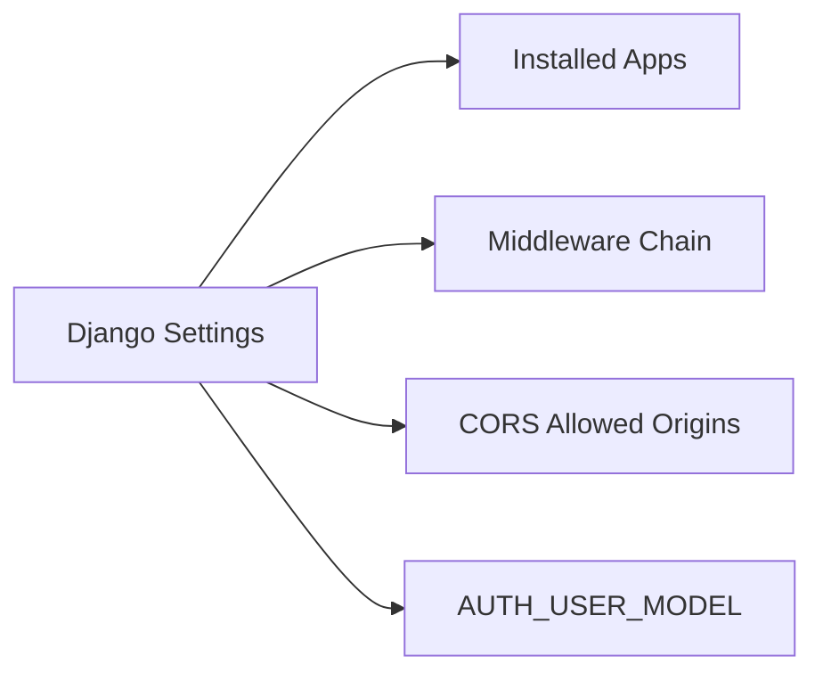
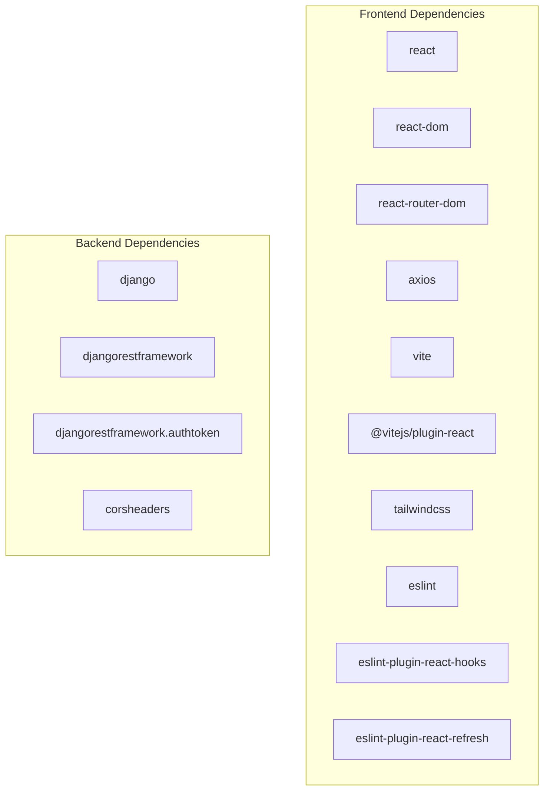

# Development Guide

<cite>
**Referenced Files in This Document**
- [settings.py](file://backend/backend/settings.py)
- [manage.py](file://backend/manage.py)
- [urls.py](file://backend/accounts/urls.py)
- [views.py](file://backend/accounts/views.py)
- [models.py](file://backend/accounts/models.py)
- [package.json](file://frontend/package.json)
- [vite.config.js](file://frontend/vite.config.js)
- [eslint.config.js](file://frontend/eslint.config.js)
- [main.jsx](file://frontend/src/main.jsx)
- [App.jsx](file://frontend/src/App.jsx)
- [Login.jsx](file://frontend/src/Pages/Public/Login.jsx)
- [Dashboard.jsx](file://frontend/src/Pages/Student/Dashboard.jsx)
</cite>

## Table of Contents
1. [Introduction](#introduction)
2. [Project Structure](#project-structure)
3. [Core Components](#core-components)
4. [Architecture Overview](#architecture-overview)
5. [Detailed Component Analysis](#detailed-component-analysis)
6. [Dependency Analysis](#dependency-analysis)
7. [Performance Considerations](#performance-considerations)
8. [Troubleshooting Guide](#troubleshooting-guide)
9. [Conclusion](#conclusion)
10. [Appendices](#appendices)

## Introduction
This development guide provides a comprehensive overview of the TPO Portal project’s architecture, coding standards, and development workflow. It covers frontend and backend conventions, component organization, build and linting configurations, API endpoint patterns, testing and debugging strategies, and maintenance practices. The guide is designed to help contributors adopt consistent patterns and maintain high-quality code across the stack.

## Project Structure
The project follows a clear separation between a Django backend and a Vite-powered React frontend. The backend exposes REST endpoints via Django REST Framework and serves static assets for the React SPA. The frontend is organized by feature-based folders for pages, components, contexts, hooks, services, and utilities.

**Diagram sources**
- [settings.py:1-126](file://backend/backend/settings.py#L1-L126)
- [manage.py:1-23](file://backend/manage.py#L1-L23)
- [package.json:1-34](file://frontend/package.json#L1-L34)
- [vite.config.js:1-9](file://frontend/vite.config.js#L1-L9)
- [eslint.config.js:1-30](file://frontend/eslint.config.js#L1-L30)
- [main.jsx:1-11](file://frontend/src/main.jsx#L1-L11)
- [App.jsx:1-55](file://frontend/src/App.jsx#L1-L55)
- [Login.jsx:1-160](file://frontend/src/Pages/Public/Login.jsx#L1-L160)
- [Dashboard.jsx:1-456](file://frontend/src/Pages/Student/Dashboard.jsx#L1-L456)

**Section sources**
- [settings.py:1-126](file://backend/backend/settings.py#L1-L126)
- [manage.py:1-23](file://backend/manage.py#L1-L23)
- [package.json:1-34](file://frontend/package.json#L1-L34)
- [vite.config.js:1-9](file://frontend/vite.config.js#L1-L9)
- [eslint.config.js:1-30](file://frontend/eslint.config.js#L1-L30)
- [main.jsx:1-11](file://frontend/src/main.jsx#L1-L11)
- [App.jsx:1-55](file://frontend/src/App.jsx#L1-L55)

## Core Components
- Backend Django settings define installed apps, middleware, CORS, authentication model, and static files. These settings enable REST Framework, token authentication, and cross-origin requests from the local Vite dev server.
- Frontend package scripts define development, build, lint, and preview commands. Vite is configured with React and Tailwind plugins. ESLint is configured with recommended rules and React-specific plugins.

Key conventions observed:
- Naming: Feature folders (e.g., Accounts, Student, Recruiter, TPOAdmin) align with domain roles.
- Routing: Centralized routing in the React app with route guards and role-aware navigation.
- Authentication: Token-based authentication with localStorage persisted tokens and profile caching.

**Section sources**
- [settings.py:1-126](file://backend/backend/settings.py#L1-L126)
- [package.json:1-34](file://frontend/package.json#L1-L34)
- [vite.config.js:1-9](file://frontend/vite.config.js#L1-L9)
- [eslint.config.js:1-30](file://frontend/eslint.config.js#L1-L30)

## Architecture Overview
The system integrates a React SPA served by Vite with a Django backend exposing REST endpoints. The frontend consumes endpoints for authentication and navigates based on user roles. The backend uses Django REST Framework and token authentication, with CORS configured for the development server origin.

**Diagram sources**
- [settings.py:18-22](file://backend/backend/settings.py#L18-L22)
- [Login.jsx:20-44](file://frontend/src/Pages/Public/Login.jsx#L20-L44)
- [Dashboard.jsx:22-29](file://frontend/src/Pages/Student/Dashboard.jsx#L22-L29)

## Detailed Component Analysis

### Frontend: Authentication Flow
The login page demonstrates a typical token-based authentication flow:
- Collects credentials and role selection.
- Posts to the backend login endpoint.
- On success, stores role, isLoggedIn flag, and token.
- Fetches the user profile using the token.
- Navigates to role-specific dashboards.

**Diagram sources**
- [Login.jsx:17-55](file://frontend/src/Pages/Public/Login.jsx#L17-L55)

**Section sources**
- [Login.jsx:1-160](file://frontend/src/Pages/Public/Login.jsx#L1-L160)

### Frontend: Dashboard Composition
The student dashboard composes multiple UI sections:
- Navigation bar with logout.
- Stats cards for application metrics.
- Quick actions to related pages.
- Profile completion progress.
- Recent applications and upcoming drives.

Patterns:
- Composition via functional components and local state.
- Conditional rendering and computed stats.
- Role-aware navigation and localStorage usage.

**Diagram sources**
- [Dashboard.jsx:22-71](file://frontend/src/Pages/Student/Dashboard.jsx#L22-L71)

**Section sources**
- [Dashboard.jsx:1-456](file://frontend/src/Pages/Student/Dashboard.jsx#L1-L456)

### Backend: Settings and Middleware
Backend settings configure:
- Installed apps including accounts, student, recruiter, tpo_admin, REST Framework, token auth, and CORS headers.
- Middleware chain including CORS, session, CSRF, and auth middleware.
- CORS allowed origins for the Vite dev server.
- AUTH_USER_MODEL pointing to the custom User model in the accounts app.

**Diagram sources**
- [settings.py:27-45](file://backend/backend/settings.py#L27-L45)
- [settings.py:47-56](file://backend/backend/settings.py#L47-L56)
- [settings.py:19-22](file://backend/backend/settings.py#L19-L22)
- [settings.py:119-119](file://backend/backend/settings.py#L119-L119)

**Section sources**
- [settings.py:1-126](file://backend/backend/settings.py#L1-L126)

### Backend: Management Entrypoint
The Django management script sets the settings module and executes commands, enabling local development and migrations.

**Section sources**
- [manage.py:1-23](file://backend/manage.py#L1-L23)

## Dependency Analysis
Frontend dependencies include React, React Router DOM, Axios, Tailwind CSS, and Vite with React plugin. ESLint is configured with React hooks and refresh plugins. Backend relies on Django, REST Framework, token authentication, and CORS headers.

**Diagram sources**
- [package.json:12-32](file://frontend/package.json#L12-L32)
- [settings.py:42-44](file://backend/backend/settings.py#L42-L44)

**Section sources**
- [package.json:1-34](file://frontend/package.json#L1-L34)
- [settings.py:27-45](file://backend/backend/settings.py#L27-L45)

## Performance Considerations
- Frontend
  - Prefer lazy loading for heavy routes and images.
  - Minimize re-renders by using stable references and memoization where appropriate.
  - Keep localStorage usage minimal and structured to avoid large payloads.
  - Use CSS-in-JS sparingly; leverage Tailwind for rapid iteration.
- Backend
  - Use pagination for list endpoints.
  - Cache frequently accessed data with appropriate invalidation.
  - Optimize database queries and avoid N+1 issues.
  - Monitor CORS configuration to prevent unnecessary preflight overhead.

## Troubleshooting Guide
Common issues and resolutions:
- Authentication failures
  - Verify token storage and Authorization header usage in requests.
  - Confirm backend CORS origins include the Vite dev server origin.
- Routing issues
  - Ensure routes are registered in the central router and match the intended paths.
- Build errors
  - Run lint checks and fix ESLint violations before committing.
  - Reinstall node modules if dependency mismatches occur.
- Backend startup
  - Set the correct settings module and ensure SQLite database exists.

**Section sources**
- [Login.jsx:38-44](file://frontend/src/Pages/Public/Login.jsx#L38-L44)
- [App.jsx:25-52](file://frontend/src/App.jsx#L25-L52)
- [settings.py:19-22](file://backend/backend/settings.py#L19-L22)
- [eslint.config.js:1-30](file://frontend/eslint.config.js#L1-L30)
- [package.json:6-11](file://frontend/package.json#L6-L11)
- [manage.py:9-9](file://backend/manage.py#L9-L9)

## Conclusion
The TPO Portal follows a clean, layered architecture with a React SPA frontend and a Django backend. Consistent use of token-based authentication, centralized routing, and feature-based folder organization supports maintainability. Adhering to the coding standards, linting rules, and testing strategies outlined here will help sustain code quality and accelerate development.

## Appendices

### Coding Standards and Naming Conventions
- File naming
  - PascalCase for React components (e.g., LoginPage, Dashboard).
  - camelCase for utility functions and hooks (e.g., useAuth, formatDate).
- Folder organization
  - Feature-based grouping under src (Pages, Components, Context, Hooks, Services, Utils).
- Imports
  - Group external libraries, internal modules, and styles; sort alphabetically where possible.
- Styling
  - Prefer Tailwind utility classes for rapid UI development; avoid excessive inline styles.
- Hooks
  - Custom hooks start with usePrefix and encapsulate reusable logic.
- Components
  - Stateless functional components where possible; use hooks for state and effects.

### Component Composition Patterns
- Compose pages from smaller UI components.
- Pass data down via props; lift shared state to nearest common ancestor.
- Use React Router for navigation and conditional rendering based on user roles.

### Frontend Build and Development Workflow
- Development server
  - Start with the dev script; Vite provides fast HMR.
- Building for production
  - Use the build script to generate optimized assets.
- Linting
  - Run the lint script to enforce style and React-specific rules.
- Preview
  - Use the preview script to test the production build locally.

**Section sources**
- [package.json:6-11](file://frontend/package.json#L6-L11)
- [vite.config.js:1-9](file://frontend/vite.config.js#L1-L9)
- [eslint.config.js:1-30](file://frontend/eslint.config.js#L1-L30)

### Backend Development Practices
- App organization
  - Each role has its own Django app with models, views, URLs, and tests.
- API endpoint creation
  - Define URL patterns per app and map to views.
  - Use REST Framework serializers and permission classes.
- Authentication
  - Use token authentication; ensure proper headers and CORS configuration.
- Migrations
  - Run migrations after model changes; keep migrations small and descriptive.

**Section sources**
- [urls.py](file://backend/accounts/urls.py)
- [views.py](file://backend/accounts/views.py)
- [models.py](file://backend/accounts/models.py)
- [settings.py:42-44](file://backend/backend/settings.py#L42-L44)

### Testing Strategies
- Frontend
  - Add unit tests for components and hooks using a testing framework.
  - Mock API calls to isolate component behavior.
- Backend
  - Write tests for views and serializers; use Django’s test client.
  - Test authentication flows and permissions.

### Debugging Techniques
- Frontend
  - Use browser devtools; inspect network requests and localStorage.
  - Add console logs temporarily; remove before committing.
- Backend
  - Enable DEBUG mode during development; check logs for errors.
  - Validate request/response payloads and headers.

### Performance Optimization Approaches
- Frontend
  - Defer non-critical resources; split bundles with dynamic imports.
  - Optimize images and fonts; leverage CDN if needed.
- Backend
  - Use database indexes; optimize ORM queries.
  - Implement pagination and filtering for list endpoints.

### Code Review Processes and Contribution Guidelines
- Branching
  - Use feature branches; keep commits focused and atomic.
- Pull Requests
  - Include a summary, rationale, and screenshots for UI changes.
  - Ensure tests pass and linting is clean.
- Reviews
  - Focus on correctness, readability, and adherence to conventions.
- Maintenance
  - Keep dependencies updated; address deprecations promptly.