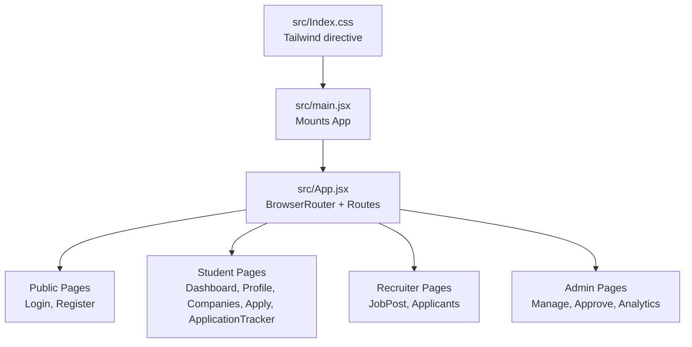
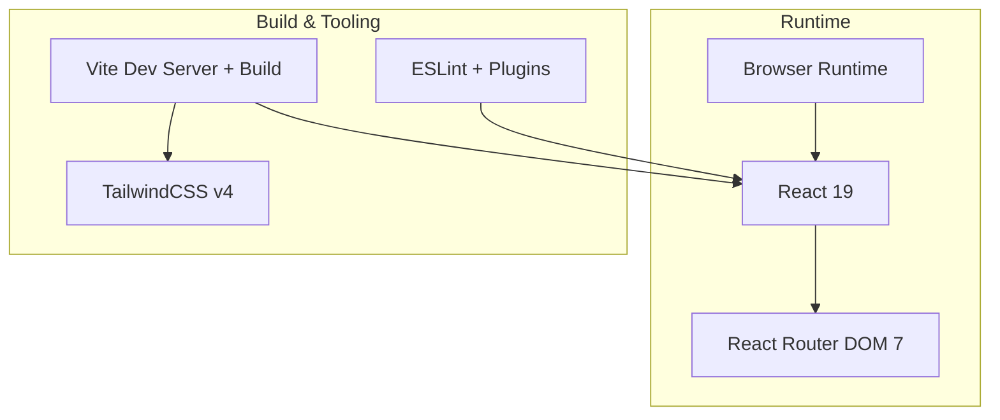
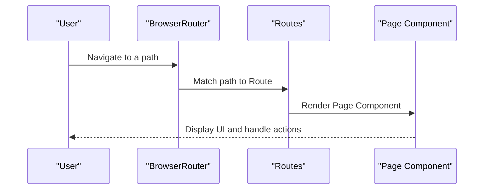
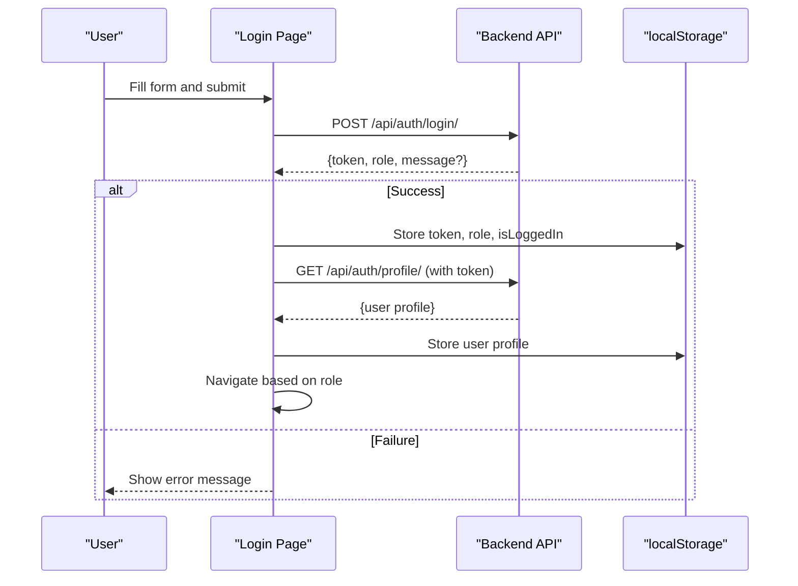
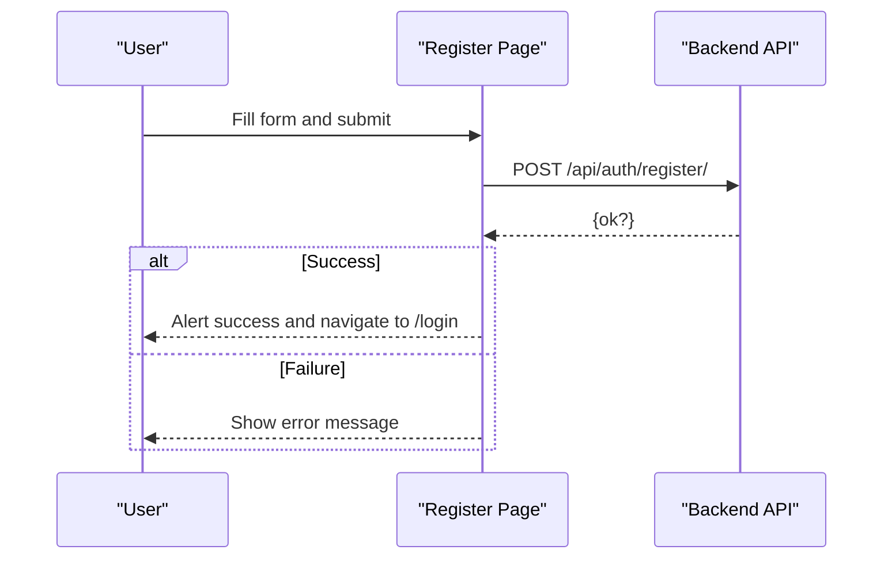
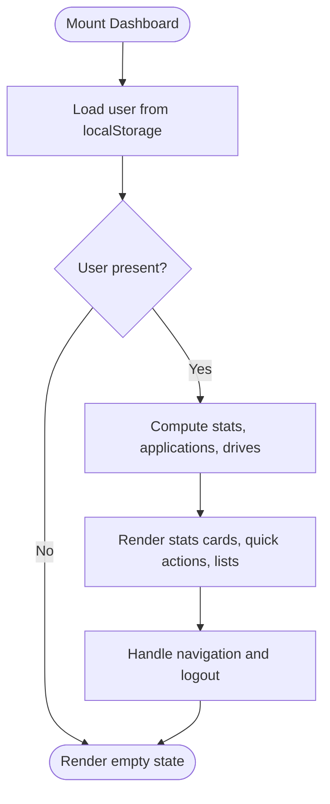
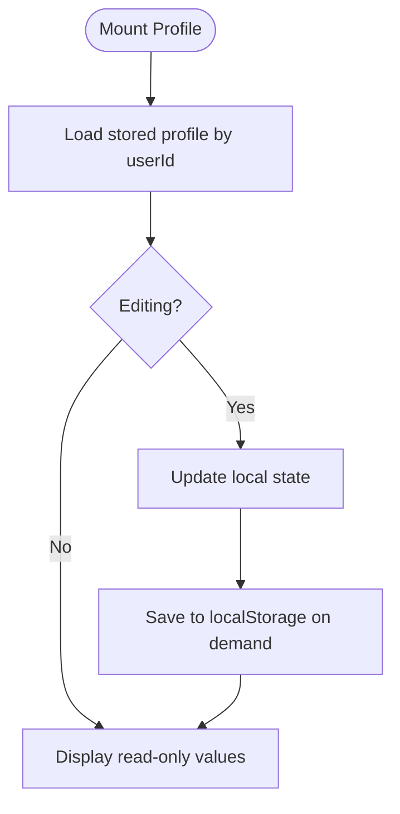
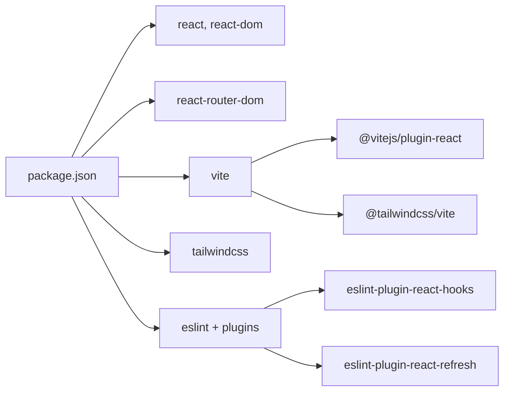

# Frontend Development

<cite>
**Referenced Files in This Document**
- [package.json](file://frontend/package.json)
- [vite.config.js](file://frontend/vite.config.js)
- [eslint.config.js](file://frontend/eslint.config.js)
- [src/main.jsx](file://frontend/src/main.jsx)
- [src/App.jsx](file://frontend/src/App.jsx)
- [src/Index.css](file://frontend/src/Index.css)
- [src/Pages/Public/Login.jsx](file://frontend/src/Pages/Public/Login.jsx)
- [src/Pages/Public/Register.jsx](file://frontend/src/Pages/Public/Register.jsx)
- [src/Pages/Student/Dashboard.jsx](file://frontend/src/Pages/Student/Dashboard.jsx)
- [src/Pages/Student/Profile.jsx](file://frontend/src/Pages/Student/Profile.jsx)
</cite>

## Table of Contents
1. [Introduction](#introduction)
2. [Project Structure](#project-structure)
3. [Core Components](#core-components)
4. [Architecture Overview](#architecture-overview)
5. [Detailed Component Analysis](#detailed-component-analysis)
6. [Dependency Analysis](#dependency-analysis)
7. [Performance Considerations](#performance-considerations)
8. [Troubleshooting Guide](#troubleshooting-guide)
9. [Conclusion](#conclusion)
10. [Appendices](#appendices)

## Introduction
This document provides comprehensive frontend development guidance for the TPO Portal React application. It covers the React component architecture, file structure conventions, Vite build configuration and development server setup, ESLint configuration for code quality, component composition and state management, routing and navigation, styling with TailwindCSS, responsive design and accessibility, testing strategies, debugging techniques, and performance optimization approaches tailored to the React frontend.

## Project Structure
The frontend is organized around a clear feature-based structure with dedicated folders for pages, components, contexts, hooks, services, and utilities. The application bootstraps via a root entry point that mounts the React application and applies global styles.

Key characteristics:
- Root entry initializes React and mounts the top-level App component.
- App defines client-side routes for public, student, recruiter, and admin areas.
- Pages are grouped by feature and role, enabling scalable organization.
- Global CSS integrates Tailwind directives for utility-first styling.

**Diagram sources**
- [src/main.jsx:1-11](file://frontend/src/main.jsx#L1-L11)
- [src/App.jsx:1-55](file://frontend/src/App.jsx#L1-L55)
- [src/Index.css:1-1](file://frontend/src/Index.css#L1-L1)

**Section sources**
- [src/main.jsx:1-11](file://frontend/src/main.jsx#L1-L11)
- [src/App.jsx:1-55](file://frontend/src/App.jsx#L1-L55)
- [src/Index.css:1-1](file://frontend/src/Index.css#L1-L1)

## Core Components
This section outlines the primary building blocks of the frontend and how they collaborate.

- Application shell and routing:
  - The top-level App component wraps the application with BrowserRouter and defines all routes for public, student, recruiter, and admin domains.
  - Default route directs unauthenticated users to the login page.

- Authentication pages:
  - Login and Register pages manage form state, handle submission, and coordinate navigation based on role and API responses.

- Student dashboard and profile:
  - Dashboard aggregates stats, upcoming drives, recent applications, and profile completion metrics, and orchestrates navigation to related pages.
  - Profile supports multi-tab editing of personal info, education, skills, certifications, projects, and work experience, persisting data locally.

- Styling and theme:
  - Global CSS imports Tailwind directives, enabling utility-first styling across components.

**Section sources**
- [src/App.jsx:1-55](file://frontend/src/App.jsx#L1-L55)
- [src/Pages/Public/Login.jsx:1-160](file://frontend/src/Pages/Public/Login.jsx#L1-L160)
- [src/Pages/Public/Register.jsx:1-172](file://frontend/src/Pages/Public/Register.jsx#L1-L172)
- [src/Pages/Student/Dashboard.jsx:1-456](file://frontend/src/Pages/Student/Dashboard.jsx#L1-L456)
- [src/Pages/Student/Profile.jsx:1-800](file://frontend/src/Pages/Student/Profile.jsx#L1-L800)
- [src/Index.css:1-1](file://frontend/src/Index.css#L1-L1)

## Architecture Overview
The frontend follows a modular React architecture with:
- Feature-based routing under a single App component.
- Local storage for lightweight state persistence during development.
- TailwindCSS for responsive and accessible UI primitives.
- Vite for fast development and optimized builds.

**Diagram sources**
- [package.json:1-34](file://frontend/package.json#L1-L34)
- [vite.config.js:1-9](file://frontend/vite.config.js#L1-L9)
- [eslint.config.js:1-30](file://frontend/eslint.config.js#L1-L30)

## Detailed Component Analysis

### Routing and Navigation
The App component centralizes routing using BrowserRouter and Routes. It defines:
- Public routes for login and registration.
- Student routes for dashboard, profile, companies, application tracking, and apply with dynamic parameters.
- Recruiter routes for job posting and applicant management.
- Admin routes for company management, drive approvals, and analytics.

**Diagram sources**
- [src/App.jsx:25-51](file://frontend/src/App.jsx#L25-L51)

**Section sources**
- [src/App.jsx:1-55](file://frontend/src/App.jsx#L1-L55)

### Authentication Flow (Login)
The Login page manages form state, submits credentials to the backend, persists tokens and user data in local storage, and navigates based on role.

**Diagram sources**
- [src/Pages/Public/Login.jsx:17-55](file://frontend/src/Pages/Public/Login.jsx#L17-L55)

**Section sources**
- [src/Pages/Public/Login.jsx:1-160](file://frontend/src/Pages/Public/Login.jsx#L1-L160)

### Registration Flow (Register)
The Register page handles form submission and redirects to the login page upon success.

**Diagram sources**
- [src/Pages/Public/Register.jsx:20-40](file://frontend/src/Pages/Public/Register.jsx#L20-L40)

**Section sources**
- [src/Pages/Public/Register.jsx:1-172](file://frontend/src/Pages/Public/Register.jsx#L1-L172)

### Student Dashboard
The Student Dashboard component:
- Reads user profile from local storage on mount.
- Computes stats, recent applications, and upcoming drives.
- Provides quick action buttons and navigation to related pages.
- Implements logout by clearing auth-related entries from local storage.

**Diagram sources**
- [src/Pages/Student/Dashboard.jsx:20-82](file://frontend/src/Pages/Student/Dashboard.jsx#L20-L82)

**Section sources**
- [src/Pages/Student/Dashboard.jsx:1-456](file://frontend/src/Pages/Student/Dashboard.jsx#L1-L456)

### Student Profile
The Profile component:
- Manages multi-tab editing state for personal info, education, skills, certifications, projects, and work experience.
- Persists data to local storage per user ID.
- Supports adding/removing items and file selection placeholders.
- Integrates with navigation and logout.

**Diagram sources**
- [src/Pages/Student/Profile.jsx:55-94](file://frontend/src/Pages/Student/Profile.jsx#L55-L94)

**Section sources**
- [src/Pages/Student/Profile.jsx:1-800](file://frontend/src/Pages/Student/Profile.jsx#L1-L800)

## Dependency Analysis
The frontend relies on React, React Router DOM, and Vite for development and build. TailwindCSS is integrated via a Vite plugin. ESLint enforces recommended rules and React-specific hooks and refresh rules.

**Diagram sources**
- [package.json:12-32](file://frontend/package.json#L12-L32)
- [vite.config.js:1-9](file://frontend/vite.config.js#L1-L9)
- [eslint.config.js:1-30](file://frontend/eslint.config.js#L1-L30)

**Section sources**
- [package.json:1-34](file://frontend/package.json#L1-L34)
- [vite.config.js:1-9](file://frontend/vite.config.js#L1-L9)
- [eslint.config.js:1-30](file://frontend/eslint.config.js#L1-L30)

## Performance Considerations
- Prefer local storage for lightweight state during development; avoid heavy synchronous operations on render.
- Defer expensive computations to memoized selectors or derived state updates.
- Keep components pure and minimize re-renders by structuring props and state efficiently.
- Use Tailwind utilities to reduce custom CSS overhead and improve maintainability.
- Leverage Vite’s built-in optimizations for production builds.

## Troubleshooting Guide
Common issues and resolutions:
- Build failures due to missing Tailwind config:
  - Ensure Tailwind is configured via the Vite plugin and global CSS imports Tailwind directives.
- ESLint errors:
  - Run lint checks and fix violations flagged by recommended rules, React hooks rules, and refresh rules.
- Hot reload not working:
  - Confirm Vite dev script is running and that file changes are detected; check for syntax errors blocking HMR.
- Styling inconsistencies:
  - Verify Tailwind directives are imported globally and that utility classes are applied consistently.

**Section sources**
- [eslint.config.js:1-30](file://frontend/eslint.config.js#L1-L30)
- [vite.config.js:1-9](file://frontend/vite.config.js#L1-L9)
- [src/Index.css:1-1](file://frontend/src/Index.css#L1-L1)

## Conclusion
The TPO Portal frontend is structured for scalability and maintainability, with clear separation of concerns across pages and roles, robust routing, and modern tooling for development and quality assurance. By adhering to the outlined patterns for component composition, state management, styling, and performance, contributors can extend functionality while preserving consistency and reliability.

## Appendices

### Vite Configuration and Development Server
- Vite is configured with React and TailwindCSS plugins.
- Scripts include dev, build, lint, and preview commands.

**Section sources**
- [vite.config.js:1-9](file://frontend/vite.config.js#L1-L9)
- [package.json:6-11](file://frontend/package.json#L6-L11)

### ESLint Configuration
- Extends recommended JS rules, React hooks rules, and React refresh rules.
- Enables browser globals and JSX parsing for modern React development.

**Section sources**
- [eslint.config.js:1-30](file://frontend/eslint.config.js#L1-L30)

### TailwindCSS Integration
- Global CSS imports Tailwind directives to enable utility classes across components.
- Use responsive utilities and component variants to achieve responsive design.

**Section sources**
- [src/Index.css:1-1](file://frontend/src/Index.css#L1-L1)

### Component Composition Patterns
- Prefer small, focused components with explicit props and minimal internal state.
- Use local storage for temporary persistence during development; replace with backend services in production.
- Centralize navigation via React Router and keep route definitions in a single location.

**Section sources**
- [src/App.jsx:1-55](file://frontend/src/App.jsx#L1-L55)
- [src/Pages/Student/Dashboard.jsx:1-456](file://frontend/src/Pages/Student/Dashboard.jsx#L1-L456)
- [src/Pages/Student/Profile.jsx:1-800](file://frontend/src/Pages/Student/Profile.jsx#L1-L800)

### Accessibility Considerations
- Use semantic HTML and ARIA attributes where appropriate.
- Ensure sufficient color contrast and keyboard navigability.
- Provide meaningful labels for interactive elements and form controls.

[No sources needed since this section provides general guidance]

### Testing Strategies
- Unit test components using a testing framework compatible with React and Vite.
- Mock API interactions and localStorage for isolated tests.
- Focus on rendering, user interactions, and state transitions.

[No sources needed since this section provides general guidance]