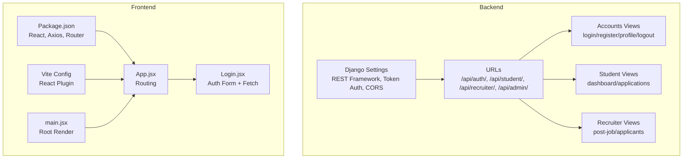
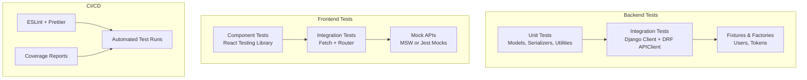
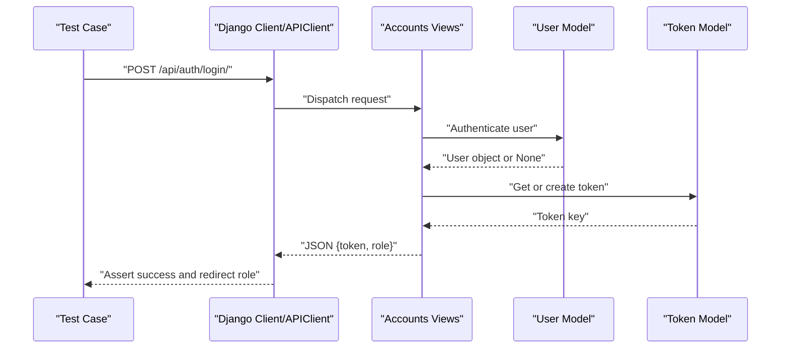
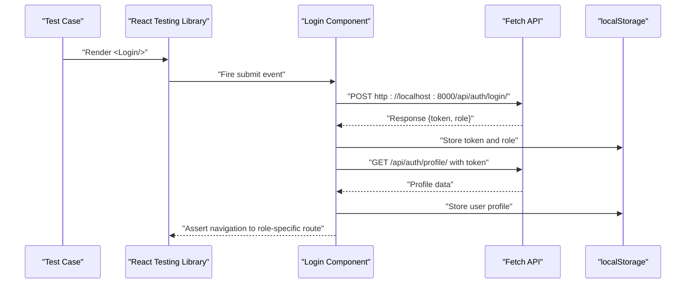
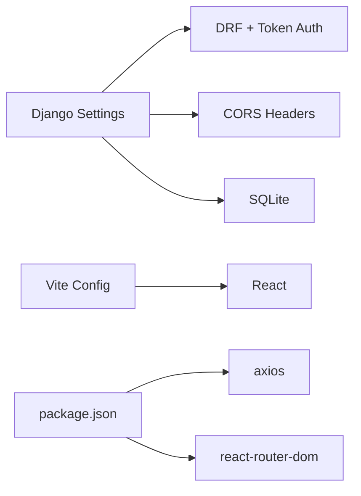

# Testing Strategy

<cite>
**Referenced Files in This Document**
- [manage.py](file://backend/manage.py)
- [settings.py](file://backend/backend/settings.py)
- [urls.py](file://backend/backend/urls.py)
- [accounts/views.py](file://backend/accounts/views.py)
- [student/views.py](file://backend/student/views.py)
- [recruiter/views.py](file://backend/recruiter/views.py)
- [accounts/tests.py](file://backend/accounts/tests.py)
- [student/tests.py](file://backend/student/tests.py)
- [recruiter/tests.py](file://backend/recruiter/tests.py)
- [tpo_admin/tests.py](file://backend/tpo_admin/tests.py)
- [package.json](file://frontend/package.json)
- [vite.config.js](file://frontend/vite.config.js)
- [App.jsx](file://frontend/src/App.jsx)
- [main.jsx](file://frontend/src/main.jsx)
- [Login.jsx](file://frontend/src/Pages/Public/Login.jsx)
</cite>

## Table of Contents
1. [Introduction](#introduction)
2. [Project Structure](#project-structure)
3. [Core Components](#core-components)
4. [Architecture Overview](#architecture-overview)
5. [Detailed Component Analysis](#detailed-component-analysis)
6. [Dependency Analysis](#dependency-analysis)
7. [Performance Considerations](#performance-considerations)
8. [Troubleshooting Guide](#troubleshooting-guide)
9. [Conclusion](#conclusion)
10. [Appendices](#appendices)

## Introduction
This document defines a comprehensive testing strategy for the TPO Portal full-stack application. It covers backend Django testing (unit and integration), frontend React testing (component and integration), API contract testing, authentication flows, form validation, database operations, CI/CD testing, debugging, performance, and coverage measurement. The goal is to ensure reliable, maintainable, and secure delivery across all layers.

## Project Structure
The repository follows a clear separation of concerns:
- Backend: Django application exposing REST endpoints under /api/* routes.
- Frontend: React SPA using Vite, with client-side routing via react-router-dom.

Key runtime and configuration files:
- Backend Django settings enable REST framework, token authentication, CORS, and SQLite for local development.
- Frontend package.json lists React, axios, and react-router-dom; Vite config enables React plugin.

**Diagram sources**
- [settings.py:1-126](file://backend/backend/settings.py#L1-L126)
- [urls.py:1-11](file://backend/backend/urls.py#L1-L11)
- [accounts/views.py:1-95](file://backend/accounts/views.py#L1-L95)
- [student/views.py:1-8](file://backend/student/views.py#L1-L8)
- [recruiter/views.py:1-12](file://backend/recruiter/views.py#L1-L12)
- [vite.config.js:1-9](file://frontend/vite.config.js#L1-L9)
- [package.json:1-34](file://frontend/package.json#L1-L34)
- [App.jsx:1-55](file://frontend/src/App.jsx#L1-L55)
- [main.jsx:1-11](file://frontend/src/main.jsx#L1-L11)
- [Login.jsx:1-160](file://frontend/src/Pages/Public/Login.jsx#L1-L160)

**Section sources**
- [settings.py:1-126](file://backend/backend/settings.py#L1-L126)
- [urls.py:1-11](file://backend/backend/urls.py#L1-L11)
- [vite.config.js:1-9](file://frontend/vite.config.js#L1-L9)
- [package.json:1-34](file://frontend/package.json#L1-L34)
- [App.jsx:1-55](file://frontend/src/App.jsx#L1-L55)
- [main.jsx:1-11](file://frontend/src/main.jsx#L1-L11)

## Core Components
- Authentication service endpoints:
  - POST /api/auth/login/ (supports username/email and password)
  - POST /api/auth/register/ (creates user with role)
  - GET /api/auth/profile/ (token-protected)
  - POST /api/auth/logout/ (session-based)
- Student module endpoints:
  - GET /api/student/dashboard/
  - GET /api/student/applications/
- Recruiter module endpoints:
  - POST /api/recruiter/post-job/
  - GET /api/recruiter/applicants/
- TPO Admin module endpoints:
  - Placeholder tests exist for future admin endpoints

Backend testing scaffolding exists under each app’s tests.py. Frontend testing is not yet configured in the repository snapshot.

**Section sources**
- [accounts/views.py:1-95](file://backend/accounts/views.py#L1-L95)
- [student/views.py:1-8](file://backend/student/views.py#L1-L8)
- [recruiter/views.py:1-12](file://backend/recruiter/views.py#L1-L12)
- [accounts/tests.py:1-4](file://backend/accounts/tests.py#L1-L4)
- [student/tests.py](file://backend/student/tests.py)
- [recruiter/tests.py](file://backend/recruiter/tests.py)
- [tpo_admin/tests.py](file://backend/tpo_admin/tests.py)

## Architecture Overview
The testing architecture spans three layers:
- Unit tests for backend business logic and serializers.
- Integration tests for Django views and REST endpoints.
- Frontend component and integration tests for UI flows and API interactions.

[No sources needed since this diagram shows conceptual workflow, not actual code structure]

## Detailed Component Analysis

### Backend Testing Strategy (Django)
- Test runner and invocation:
  - Use Django’s manage.py to run tests via the standard test command.
- Test organization:
  - Place unit and integration tests alongside each app under tests.py.
  - Use Django’s TestCase and TransactionTestCase for database-backed tests.
- Authentication flow testing:
  - Simulate login with username/email and password; assert token creation and role routing.
  - Verify profile retrieval with proper token authentication.
  - Validate logout clears session.
- API endpoint testing:
  - Use Django’s Client for basic requests and REST framework APIClient for token-authenticated endpoints.
  - Mock external dependencies (e.g., third-party integrations) with unittest.mock.
- Fixtures and factories:
  - Create reusable user fixtures and tokens for repeated scenarios.
  - Use Django’s built-in User model and Token model for realistic setups.
- Naming conventions:
  - Prefix test methods with test_ and describe intent (e.g., test_login_success, test_profile_requires_token).
- Coverage:
  - Integrate coverage.py or pytest-cov to measure Python coverage.

**Diagram sources**
- [accounts/views.py:13-45](file://backend/accounts/views.py#L13-L45)
- [accounts/views.py:78-89](file://backend/accounts/views.py#L78-L89)

**Section sources**
- [manage.py:1-23](file://backend/manage.py#L1-L23)
- [accounts/tests.py:1-4](file://backend/accounts/tests.py#L1-L4)
- [accounts/views.py:1-95](file://backend/accounts/views.py#L1-L95)

### Frontend Testing Strategy (React)
- Tooling:
  - Configure React Testing Library with Vite using @vitejs/plugin-react.
  - Add test scripts to package.json for running tests.
- Component testing:
  - Test Login.jsx behavior: form state updates, submission flow, error handling, and navigation.
  - Mock fetch using global fetch overrides or libraries like vitest/fetch-mock.
- Integration testing:
  - Simulate API responses for login and profile endpoints.
  - Verify localStorage writes and redirects per role.
- Routing:
  - Wrap tests with MemoryRouter or render the full App with Router to validate route transitions.
- Mock data:
  - Define reusable mock user profiles and tokens for different roles.
- Naming conventions:
  - Use descriptive filenames (e.g., Login.test.jsx) and test names aligned with user stories (e.g., "renders form fields", "handles login failure").
- Coverage:
  - Use Vitest with coverage enabled to measure frontend coverage.

**Diagram sources**
- [Login.jsx:17-55](file://frontend/src/Pages/Public/Login.jsx#L17-L55)

**Section sources**
- [vite.config.js:1-9](file://frontend/vite.config.js#L1-L9)
- [package.json:1-34](file://frontend/package.json#L1-L34)
- [Login.jsx:1-160](file://frontend/src/Pages/Public/Login.jsx#L1-L160)

### API Contract Testing
- Define expected request/response shapes for each endpoint.
- Validate status codes, headers (e.g., Authorization), and payload fields.
- Use tools like Postman/Newman or curl scripts for manual verification during CI.
- For automated contract tests, consider OpenAPI/Swagger-based generators or REST Assured-style assertions in CI.

[No sources needed since this section provides general guidance]

### Authentication Flow Testing
- Positive flows:
  - Successful login with valid credentials and role-based redirect.
  - Profile retrieval with a valid token.
- Negative flows:
  - Invalid credentials, malformed JSON, missing token, expired token.
- Security:
  - Ensure CSRF exemptions are intentional for auth endpoints.
  - Validate that protected endpoints reject unauthenticated requests.

**Section sources**
- [accounts/views.py:13-45](file://backend/accounts/views.py#L13-L45)
- [accounts/views.py:78-89](file://backend/accounts/views.py#L78-L89)

### Form Validation Testing
- Frontend:
  - Assert required field validation, controlled component updates, and error messaging.
- Backend:
  - Validate serializer-level constraints and model validations.
  - Test boundary conditions (empty strings, max lengths, invalid emails).

**Section sources**
- [Login.jsx:7-15](file://frontend/src/Pages/Public/Login.jsx#L7-L15)
- [accounts/views.py:49-75](file://backend/accounts/views.py#L49-L75)

### Database Operations Testing
- Use TransactionTestCase or override atomicity to test rollback behavior.
- Create fixtures for Users and Tokens to avoid repeated setup.
- Test cascading deletes, unique constraints, and role-specific permissions.

**Section sources**
- [accounts/models.py](file://backend/accounts/models.py)
- [settings.py:119-126](file://backend/backend/settings.py#L119-L126)

## Dependency Analysis
- Backend depends on:
  - Django REST Framework for API views and token authentication.
  - sqlite3 for local development database.
  - CORSHeaders for cross-origin allowance.
- Frontend depends on:
  - React, react-router-dom for routing, axios for HTTP requests.
  - Vite for bundling and dev server.

**Diagram sources**
- [settings.py:1-126](file://backend/backend/settings.py#L1-L126)
- [vite.config.js:1-9](file://frontend/vite.config.js#L1-L9)
- [package.json:1-34](file://frontend/package.json#L1-L34)

**Section sources**
- [settings.py:1-126](file://backend/backend/settings.py#L1-L126)
- [package.json:1-34](file://frontend/package.json#L1-L34)

## Performance Considerations
- Backend:
  - Use database transaction tests judiciously; prefer in-memory SQLite for speed.
  - Minimize external network calls in tests; mock or use local services.
- Frontend:
  - Keep DOM queries minimal; prefer querying by test-id attributes.
  - Avoid heavy rendering in unit tests; use shallow rendering where appropriate.
- CI:
  - Parallelize test suites by layer (Python vs JS).
  - Cache dependencies and node_modules to reduce CI time.

[No sources needed since this section provides general guidance]

## Troubleshooting Guide
- Django test failures:
  - Verify settings.DEBUG and ALLOWED_HOSTS for test runs.
  - Ensure DATABASES default points to a test-friendly backend.
  - Confirm REST framework APIClient is used for token-protected endpoints.
- Frontend test failures:
  - Mock global fetch or use a testing fetch library.
  - Ensure React Testing Library renders are wrapped in appropriate providers (Router, Theme).
- Authentication issues:
  - Confirm token presence in localStorage and Authorization header format.
  - Validate CORS settings for localhost origins.
- Coverage gaps:
  - Run coverage reports and focus on untested branches and edge cases.

**Section sources**
- [settings.py:13-22](file://backend/backend/settings.py#L13-L22)
- [Login.jsx:17-55](file://frontend/src/Pages/Public/Login.jsx#L17-L55)

## Conclusion
A robust testing strategy for TPO Portal requires coordinated backend and frontend efforts. Backend tests should validate authentication, API contracts, and database integrity. Frontend tests should simulate user interactions and API responses. CI should automate linting, unit/integration tests, and coverage reporting. By following the outlined patterns and conventions, the project can achieve high reliability and maintainability.

[No sources needed since this section summarizes without analyzing specific files]

## Appendices

### Test Suite Structure and Naming Conventions
- Backend:
  - apps/accounts/tests.py, apps/student/tests.py, apps/recruiter/tests.py, apps/tpo_admin/tests.py
  - Method names: test_<scenario>_<expected_outcome>
- Frontend:
  - src/Pages/Public/Login.test.jsx
  - Component files: *.test.jsx

**Section sources**
- [accounts/tests.py:1-4](file://backend/accounts/tests.py#L1-L4)
- [student/tests.py](file://backend/student/tests.py)
- [recruiter/tests.py](file://backend/recruiter/tests.py)
- [tpo_admin/tests.py](file://backend/tpo_admin/tests.py)
- [Login.jsx:1-160](file://frontend/src/Pages/Public/Login.jsx#L1-L160)

### Continuous Integration Testing and Quality Assurance
- Pipelines should:
  - Install Python and Node dependencies.
  - Run Python tests with coverage.
  - Run ESLint and frontend tests with coverage.
  - Publish coverage reports.
- Secrets:
  - Store Django SECRET_KEY and database credentials in CI secrets.
- Artifacts:
  - Archive coverage reports and test logs.

[No sources needed since this section provides general guidance]