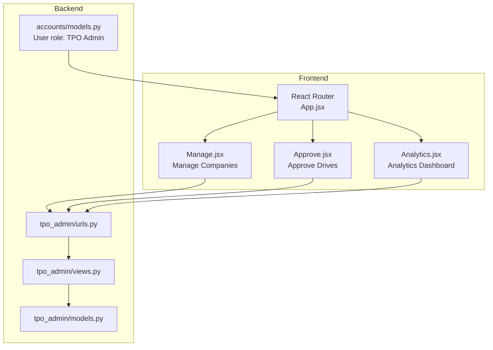
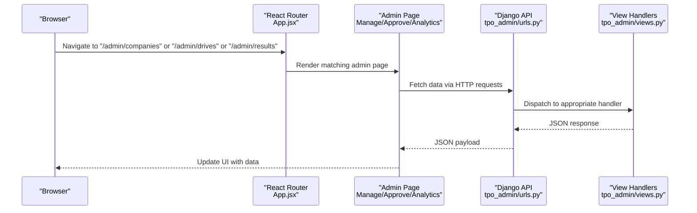
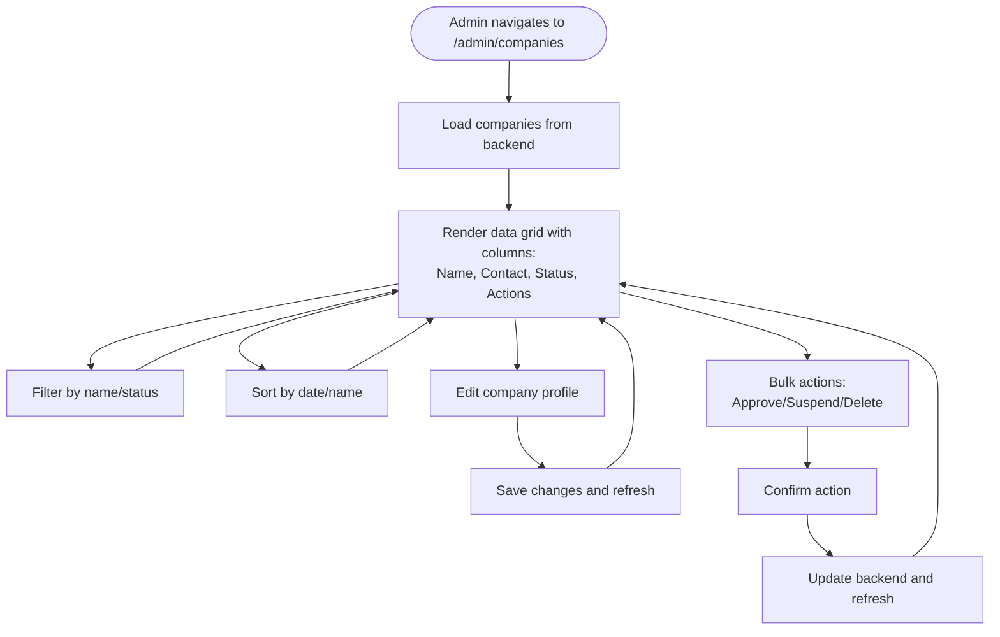
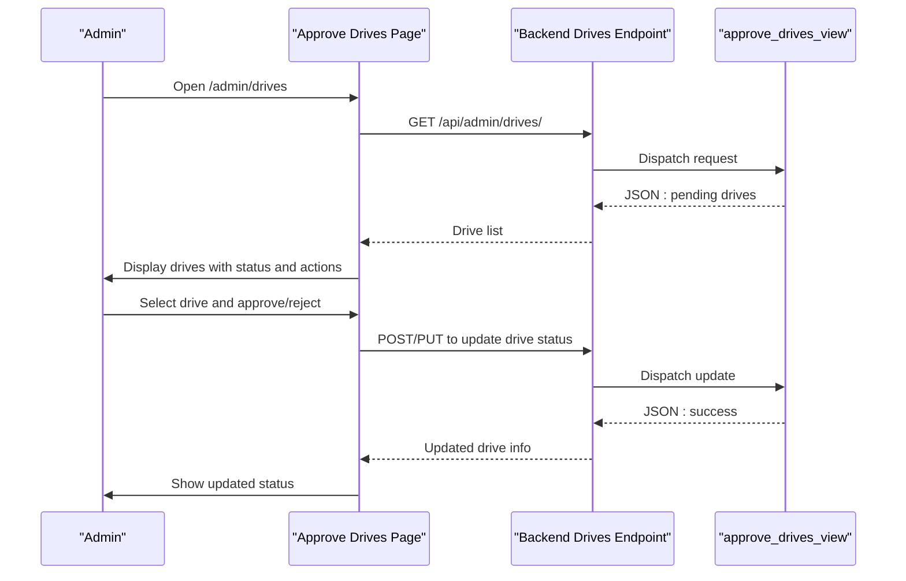
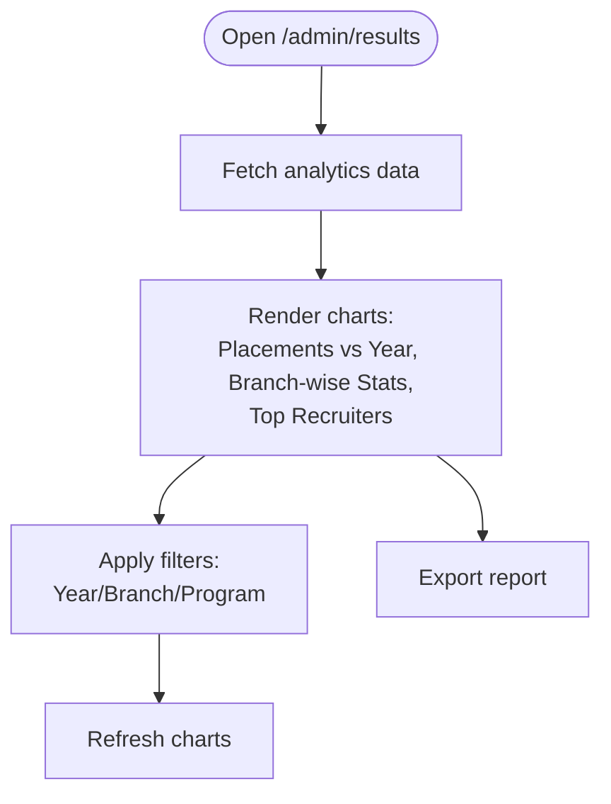
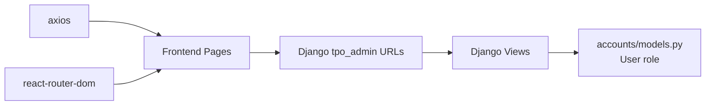

# Admin Portal

<cite>
**Referenced Files in This Document**
- [App.jsx](file://frontend/src/App.jsx)
- [Manage.jsx](file://frontend/src/Pages/TPOAdmin/Manage.jsx)
- [Approve.jsx](file://frontend/src/Pages/TPOAdmin/Approve.jsx)
- [Analytics.jsx](file://frontend/src/Pages/TPOAdmin/Analytics.jsx)
- [urls.py](file://backend/tpo_admin/urls.py)
- [views.py](file://backend/tpo_admin/views.py)
- [models.py](file://backend/tpo_admin/models.py)
- [accounts/models.py](file://backend/accounts/models.py)
- [package.json](file://frontend/package.json)
</cite>

## Table of Contents
1. [Introduction](#introduction)
2. [Project Structure](#project-structure)
3. [Core Components](#core-components)
4. [Architecture Overview](#architecture-overview)
5. [Detailed Component Analysis](#detailed-component-analysis)
6. [Dependency Analysis](#dependency-analysis)
7. [Performance Considerations](#performance-considerations)
8. [Troubleshooting Guide](#troubleshooting-guide)
9. [Conclusion](#conclusion)

## Introduction
This document describes the Admin Portal features in the TPO Portal React application. It focuses on three primary admin capabilities:
- Company Management: Overseeing registered companies and maintaining institutional data integrity
- Drive Approval: Reviewing and approving campus placement drives, managing scheduling conflicts, and coordinating with stakeholders
- Analytics Dashboard: Generating placement statistics, monitoring trends, and providing institutional insights

It also documents the component architecture, routing, and integration points with backend APIs. The current implementation exposes placeholder pages and basic backend endpoints; future work will involve connecting these pages to services and implementing data visualization.

## Project Structure
The Admin Portal spans the frontend React application and the Django backend:
- Frontend routes define the admin pages under /admin/*
- Backend tpo_admin module defines API endpoints for admin operations
- Authentication roles include a TPO Admin role for access control

**Diagram sources**
- [App.jsx:25-52](file://frontend/src/App.jsx#L25-L52)
- [Manage.jsx:1-11](file://frontend/src/Pages/TPOAdmin/Manage.jsx#L1-L11)
- [Approve.jsx:1-11](file://frontend/src/Pages/TPOAdmin/Approve.jsx#L1-L11)
- [Analytics.jsx:1-15](file://frontend/src/Pages/TPOAdmin/Analytics.jsx#L1-L15)
- [urls.py:1-9](file://backend/tpo_admin/urls.py#L1-L9)
- [views.py:1-11](file://backend/tpo_admin/views.py#L1-L11)
- [models.py:1-4](file://backend/tpo_admin/models.py#L1-L4)
- [accounts/models.py:1-25](file://backend/accounts/models.py#L1-L25)

**Section sources**
- [App.jsx:18-48](file://frontend/src/App.jsx#L18-L48)
- [urls.py:4-8](file://backend/tpo_admin/urls.py#L4-L8)
- [accounts/models.py:4-24](file://backend/accounts/models.py#L4-L24)

## Core Components
- Manage Companies Page: Placeholder page for company oversight and profile management
- Approve Drives Page: Placeholder page for reviewing and approving placement drives
- Analytics Dashboard Page: Placeholder page for placement statistics and insights

These pages are wired into the router under /admin/* and currently render static content. They serve as entry points for future development of data grids, filters, sorting, and analytics visualizations.

**Section sources**
- [Manage.jsx:1-11](file://frontend/src/Pages/TPOAdmin/Manage.jsx#L1-L11)
- [Approve.jsx:1-11](file://frontend/src/Pages/TPOAdmin/Approve.jsx#L1-L11)
- [Analytics.jsx:1-15](file://frontend/src/Pages/TPOAdmin/Analytics.jsx#L1-L15)
- [App.jsx:45-48](file://frontend/src/App.jsx#L45-L48)

## Architecture Overview
The Admin Portal follows a clean separation of concerns:
- Routing: React Router defines admin routes and renders the respective pages
- Backend: Django tpo_admin module exposes endpoints for companies, drives, and analytics
- Authentication: User model includes a role field with a dedicated TPO Admin option

**Diagram sources**
- [App.jsx:25-52](file://frontend/src/App.jsx#L25-L52)
- [urls.py:4-8](file://backend/tpo_admin/urls.py#L4-L8)
- [views.py:3-10](file://backend/tpo_admin/views.py#L3-L10)

## Detailed Component Analysis

### Company Management Interface
Purpose:
- Provide an administrative interface to oversee registered companies
- Enable company profile maintenance and data integrity checks

Current state:
- Placeholder page exists under /admin/companies
- No data fetching, filtering, sorting, or bulk operations implemented

Recommended enhancements:
- Integrate with backend endpoint for company listings
- Implement data grid with filtering/sorting controls
- Add bulk actions (approve, suspend, delete)
- Include company profile editing and audit logs

**Section sources**
- [Manage.jsx:1-11](file://frontend/src/Pages/TPOAdmin/Manage.jsx#L1-L11)
- [urls.py:5](file://backend/tpo_admin/urls.py#L5)
- [views.py:3-4](file://backend/tpo_admin/views.py#L3-L4)

### Drive Approval System
Purpose:
- Review and approve campus placement drives
- Manage scheduling conflicts and stakeholder coordination

Current state:
- Placeholder page exists under /admin/drives
- No drive listing, conflict detection, or approval workflow implemented

Recommended enhancements:
- Connect to backend endpoint for pending drives
- Build a calendar or timeline view for scheduling
- Implement conflict detection against existing drives
- Add approval/rejection actions with notifications

**Diagram sources**
- [Approve.jsx:1-11](file://frontend/src/Pages/TPOAdmin/Approve.jsx#L1-L11)
- [urls.py:6](file://backend/tpo_admin/urls.py#L6)
- [views.py:6-7](file://backend/tpo_admin/views.py#L6-L7)

**Section sources**
- [Approve.jsx:1-11](file://frontend/src/Pages/TPOAdmin/Approve.jsx#L1-L11)
- [urls.py:6](file://backend/tpo_admin/urls.py#L6)
- [views.py:6-7](file://backend/tpo_admin/views.py#L6-L7)

### Analytics Dashboard
Purpose:
- Generate placement statistics and monitor trends
- Provide institutional insights for decision-making

Current state:
- Placeholder page exists under /admin/results
- No analytics data or visualizations implemented

Recommended enhancements:
- Connect to backend analytics endpoint
- Implement charts for placement metrics, trends, and distribution
- Add filters for academic year, branch, and placement type
- Export reports to PDF/Excel

**Section sources**
- [Analytics.jsx:1-15](file://frontend/src/Pages/TPOAdmin/Analytics.jsx#L1-L15)
- [urls.py:7](file://backend/tpo_admin/urls.py#L7)
- [views.py:9-10](file://backend/tpo_admin/views.py#L9-L10)

## Dependency Analysis
Frontend dependencies relevant to admin functionality:
- axios: HTTP client for API communication
- react-router-dom: Client-side routing for admin pages
- tailwindcss: Styling framework for responsive UI

Backend dependencies:
- Django: Web framework hosting admin endpoints
- tpo_admin app: Dedicated module for admin APIs
- accounts app: Provides User model with role enumeration

**Diagram sources**
- [package.json:12-18](file://frontend/package.json#L12-L18)
- [urls.py:1-9](file://backend/tpo_admin/urls.py#L1-L9)
- [views.py:1-11](file://backend/tpo_admin/views.py#L1-L11)
- [accounts/models.py:4-24](file://backend/accounts/models.py#L4-L24)

**Section sources**
- [package.json:12-18](file://frontend/package.json#L12-L18)
- [accounts/models.py:4-24](file://backend/accounts/models.py#L4-L24)

## Performance Considerations
- Lazy load analytics charts to reduce initial bundle size
- Paginate company and drive listings to avoid large DOM rendering
- Debounce filter inputs to minimize frequent API calls
- Cache frequently accessed analytics data with short TTL
- Use virtualized lists for large datasets

## Troubleshooting Guide
Common issues and resolutions:
- 404 Not Found on admin routes: Verify routes are defined in App.jsx and base URL matches deployment
- CORS errors: Ensure backend allows frontend origin and sets proper headers
- Empty data in admin pages: Confirm backend endpoints return JSON and status codes are 2xx
- Role-based access: Ensure User role is set to TPO Admin for accessing admin pages

**Section sources**
- [App.jsx:25-52](file://frontend/src/App.jsx#L25-L52)
- [accounts/models.py:4-24](file://backend/accounts/models.py#L4-L24)

## Conclusion
The Admin Portal currently provides foundational routing and placeholder pages for company management, drive approval, and analytics. The next phase should focus on integrating these pages with backend services, implementing robust data grids with filtering/sorting/bulk operations, building analytics visualizations, and establishing secure role-based access. The modular structure supports incremental development while maintaining clear separation between frontend presentation and backend data services.