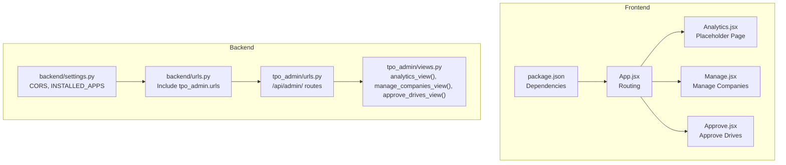
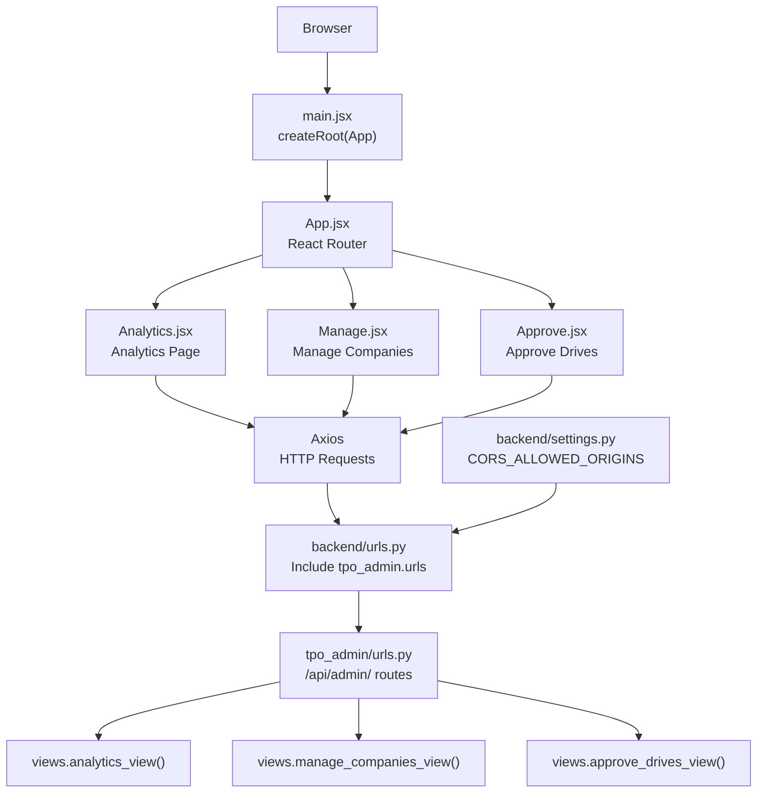
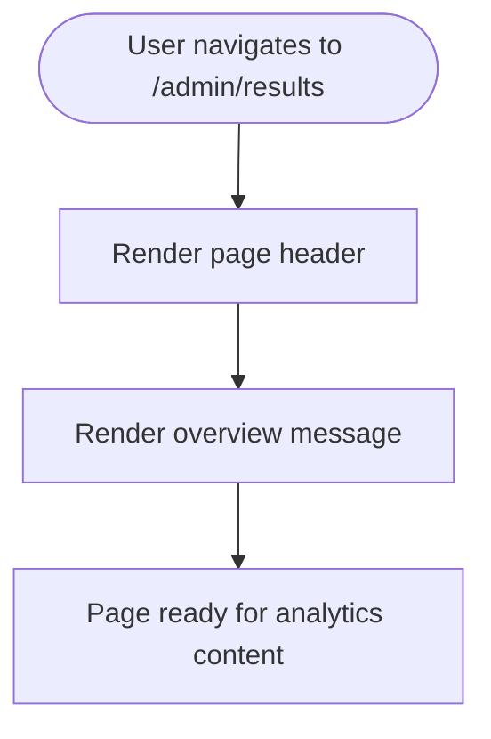
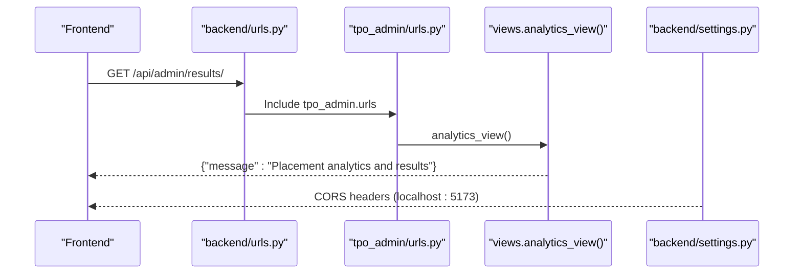
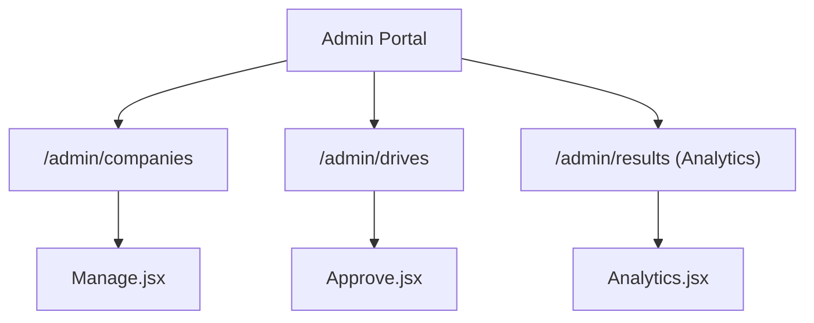
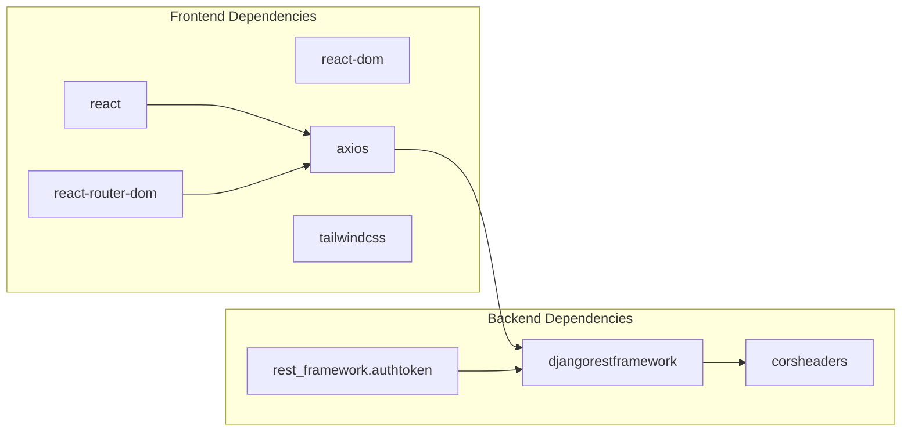

# Analytics Dashboard

<cite>
**Referenced Files in This Document**
- [Analytics.jsx](file://frontend/src/Pages/TPOAdmin/Analytics.jsx)
- [Manage.jsx](file://frontend/src/Pages/TPOAdmin/Manage.jsx)
- [Approve.jsx](file://frontend/src/Pages/TPOAdmin/Approve.jsx)
- [App.jsx](file://frontend/src/App.jsx)
- [main.jsx](file://frontend/src/main.jsx)
- [package.json](file://frontend/package.json)
- [urls.py](file://backend/backend/urls.py)
- [urls.py](file://backend/tpo_admin/urls.py)
- [views.py](file://backend/tpo_admin/views.py)
- [settings.py](file://backend/backend/settings.py)
</cite>

## Table of Contents
1. [Introduction](#introduction)
2. [Project Structure](#project-structure)
3. [Core Components](#core-components)
4. [Architecture Overview](#architecture-overview)
5. [Detailed Component Analysis](#detailed-component-analysis)
6. [Dependency Analysis](#dependency-analysis)
7. [Performance Considerations](#performance-considerations)
8. [Troubleshooting Guide](#troubleshooting-guide)
9. [Conclusion](#conclusion)

## Introduction
This document describes the Analytics Dashboard in the TPO Admin Portal. The dashboard is designed to present placement statistics, monitor institutional trends, and provide administrative insights for placement officers. It integrates frontend React components with Django backend endpoints under the /api/admin/ namespace. The current implementation includes routing and placeholder pages for analytics, company management, and drive approvals. The analytics page currently displays a placeholder message and serves as the foundation for future data visualization components.

## Project Structure
The Analytics Dashboard spans both frontend and backend layers:
- Frontend: React-based single-page application with routing and placeholder pages for admin features.
- Backend: Django application exposing REST endpoints under /api/admin/.

**Diagram sources**
- [App.jsx:1-55](file://frontend/src/App.jsx#L1-L55)
- [Analytics.jsx:1-15](file://frontend/src/Pages/TPOAdmin/Analytics.jsx#L1-L15)
- [Manage.jsx:1-11](file://frontend/src/Pages/TPOAdmin/Manage.jsx#L1-L11)
- [Approve.jsx:1-11](file://frontend/src/Pages/TPOAdmin/Approve.jsx#L1-L11)
- [package.json:1-34](file://frontend/package.json#L1-L34)
- [urls.py:1-11](file://backend/backend/urls.py#L1-L11)
- [urls.py:1-9](file://backend/tpo_admin/urls.py#L1-L9)
- [views.py:1-11](file://backend/tpo_admin/views.py#L1-L11)
- [settings.py:1-126](file://backend/backend/settings.py#L1-L126)

**Section sources**
- [App.jsx:1-55](file://frontend/src/App.jsx#L1-L55)
- [Analytics.jsx:1-15](file://frontend/src/Pages/TPOAdmin/Analytics.jsx#L1-L15)
- [Manage.jsx:1-11](file://frontend/src/Pages/TPOAdmin/Manage.jsx#L1-L11)
- [Approve.jsx:1-11](file://frontend/src/Pages/TPOAdmin/Approve.jsx#L1-L11)
- [package.json:1-34](file://frontend/package.json#L1-L34)
- [urls.py:1-11](file://backend/backend/urls.py#L1-L11)
- [urls.py:1-9](file://backend/tpo_admin/urls.py#L1-L9)
- [views.py:1-11](file://backend/tpo_admin/views.py#L1-L11)
- [settings.py:1-126](file://backend/backend/settings.py#L1-L126)

## Core Components
- Analytics Page (placeholder): Displays a header and overview message indicating the page’s purpose. This is the entry point for the analytics dashboard under the admin route.
- Manage Companies Page: Placeholder page for managing companies within the portal.
- Approve Drives Page: Placeholder page for reviewing and approving placement drives.
- Routing: Client-side routing configured via React Router to navigate between public, student, recruiter, and admin pages, including the analytics route.

Key implementation references:
- Analytics page component and placeholder content.
- Admin routes including /admin/results linking to the analytics page.
- Backend URL configuration including /api/admin/ and analytics endpoint.

**Section sources**
- [Analytics.jsx:1-15](file://frontend/src/Pages/TPOAdmin/Analytics.jsx#L1-L15)
- [App.jsx:45-48](file://frontend/src/App.jsx#L45-L48)
- [urls.py:4-8](file://backend/tpo_admin/urls.py#L4-L8)

## Architecture Overview
The analytics dashboard follows a standard frontend-backend split:
- Frontend: React SPA handles navigation and renders admin pages. It uses Axios for HTTP requests and Tailwind CSS for styling.
- Backend: Django REST endpoints serve analytics data under /api/admin/. CORS is enabled for local development.

**Diagram sources**
- [main.jsx:1-11](file://frontend/src/main.jsx#L1-L11)
- [App.jsx:1-55](file://frontend/src/App.jsx#L1-L55)
- [Analytics.jsx:1-15](file://frontend/src/Pages/TPOAdmin/Analytics.jsx#L1-L15)
- [Manage.jsx:1-11](file://frontend/src/Pages/TPOAdmin/Manage.jsx#L1-L11)
- [Approve.jsx:1-11](file://frontend/src/Pages/TPOAdmin/Approve.jsx#L1-L11)
- [urls.py:1-11](file://backend/backend/urls.py#L1-L11)
- [urls.py:1-9](file://backend/tpo_admin/urls.py#L1-L9)
- [views.py:1-11](file://backend/tpo_admin/views.py#L1-L11)
- [settings.py:18-22](file://backend/backend/settings.py#L18-L22)

## Detailed Component Analysis

### Analytics Page Component
Purpose:
- Acts as the landing page for the analytics dashboard within the admin portal.
- Provides a structured layout for future data visualization components.

Current behavior:
- Renders a main heading identifying the page.
- Displays a brief overview message indicating that placement activity insights will be shown.

Integration points:
- Route mapping: /admin/results → Analytics page.
- Backend endpoint: /api/admin/results → analytics_view().

**Diagram sources**
- [App.jsx:45-48](file://frontend/src/App.jsx#L45-L48)
- [Analytics.jsx:1-15](file://frontend/src/Pages/TPOAdmin/Analytics.jsx#L1-L15)
- [urls.py:7-7](file://backend/tpo_admin/urls.py#L7-L7)
- [views.py:9-10](file://backend/tpo_admin/views.py#L9-L10)

**Section sources**
- [Analytics.jsx:1-15](file://frontend/src/Pages/TPOAdmin/Analytics.jsx#L1-L15)
- [App.jsx:45-48](file://frontend/src/App.jsx#L45-L48)
- [urls.py:7-7](file://backend/tpo_admin/urls.py#L7-L7)
- [views.py:9-10](file://backend/tpo_admin/views.py#L9-L10)

### Backend Analytics Endpoint
Purpose:
- Expose a REST endpoint for analytics data retrieval under /api/admin/results/.
- Serve as the integration point for the frontend analytics page.

Current behavior:
- Returns a JSON response indicating placement analytics and results.
- Uses Django’s JsonResponse for standardized API responses.

**Diagram sources**
- [urls.py:9-9](file://backend/backend/urls.py#L9-L9)
- [urls.py:7-7](file://backend/tpo_admin/urls.py#L7-L7)
- [views.py:9-10](file://backend/tpo_admin/views.py#L9-L10)
- [settings.py:18-22](file://backend/backend/settings.py#L18-L22)

**Section sources**
- [views.py:9-10](file://backend/tpo_admin/views.py#L9-L10)
- [urls.py:7-7](file://backend/tpo_admin/urls.py#L7-L7)
- [settings.py:18-22](file://backend/backend/settings.py#L18-L22)

### Admin Navigation and Related Pages
Purpose:
- Provide navigation among admin features including analytics, company management, and drive approvals.

Current behavior:
- Routes configured for /admin/companies, /admin/drives, and /admin/results.
- Placeholder pages render headers and overview messages.

**Diagram sources**
- [App.jsx:45-48](file://frontend/src/App.jsx#L45-L48)
- [Manage.jsx:1-11](file://frontend/src/Pages/TPOAdmin/Manage.jsx#L1-L11)
- [Approve.jsx:1-11](file://frontend/src/Pages/TPOAdmin/Approve.jsx#L1-L11)
- [Analytics.jsx:1-15](file://frontend/src/Pages/TPOAdmin/Analytics.jsx#L1-L15)

**Section sources**
- [App.jsx:45-48](file://frontend/src/App.jsx#L45-L48)
- [Manage.jsx:1-11](file://frontend/src/Pages/TPOAdmin/Manage.jsx#L1-L11)
- [Approve.jsx:1-11](file://frontend/src/Pages/TPOAdmin/Approve.jsx#L1-L11)
- [Analytics.jsx:1-15](file://frontend/src/Pages/TPOAdmin/Analytics.jsx#L1-L15)

## Dependency Analysis
Frontend dependencies relevant to the analytics dashboard:
- react, react-dom: Core framework for building UI components.
- react-router-dom: Enables client-side routing.
- axios: Used for making HTTP requests to backend endpoints.
- @tailwindcss/vite, tailwindcss: Styling and design system.

Backend dependencies and configuration:
- Django REST Framework and authtoken: Support REST API development and token-based authentication.
- corsheaders: Enable Cross-Origin Resource Sharing for local development.
- Installed apps include accounts, student, recruiter, and tpo_admin.

**Diagram sources**
- [package.json:12-32](file://frontend/package.json#L12-L32)
- [settings.py:42-44](file://backend/backend/settings.py#L42-L44)

**Section sources**
- [package.json:12-32](file://frontend/package.json#L12-L32)
- [settings.py:42-44](file://backend/backend/settings.py#L42-L44)

## Performance Considerations
- Network latency: Minimize payload sizes by requesting only necessary analytics data and paginating large datasets.
- Caching: Implement client-side caching for static or slowly changing metrics to reduce repeated network calls.
- Rendering: Defer heavy computations until data is available; use skeleton loaders for improved perceived performance.
- CORS: Keep CORS origins minimal and specific during development; ensure secure configurations in production.

## Troubleshooting Guide
Common issues and resolutions:
- CORS errors: Verify that frontend origin matches backend CORS_ALLOWED_ORIGINS.
- Route mismatches: Confirm that the analytics route /admin/results is mapped in App.jsx and the backend endpoint /api/admin/results exists in tpo_admin/urls.py.
- Empty responses: Ensure the analytics endpoint returns a valid JSON response and that the frontend makes requests after the page mounts.

**Section sources**
- [settings.py:18-22](file://backend/backend/settings.py#L18-L22)
- [App.jsx:45-48](file://frontend/src/App.jsx#L45-L48)
- [urls.py:7-7](file://backend/tpo_admin/urls.py#L7-L7)
- [views.py:9-10](file://backend/tpo_admin/views.py#L9-L10)

## Conclusion
The Analytics Dashboard in the TPO Admin Portal currently provides a foundational structure with routing and a placeholder analytics page. The backend exposes a dedicated analytics endpoint under /api/admin/results/, enabling future integration with data visualization components. By leveraging the existing frontend and backend infrastructure, teams can progressively implement charts, filters, and export capabilities to support placement officers’ strategic decision-making.