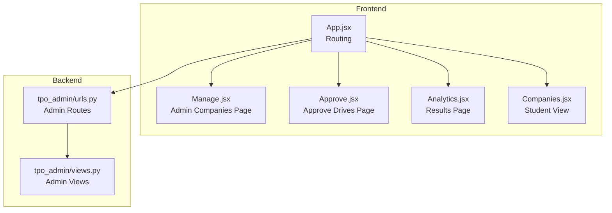
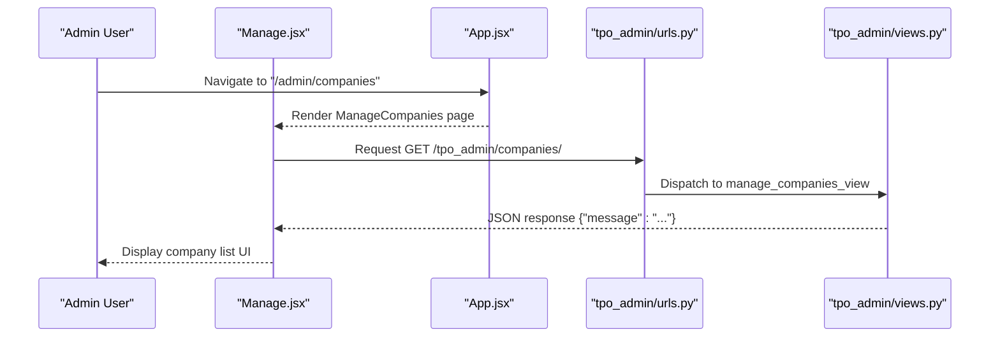
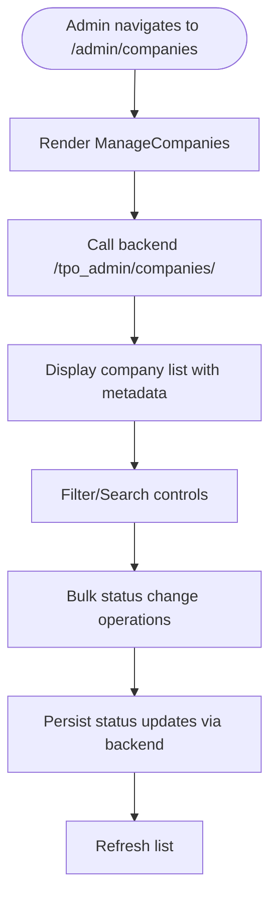
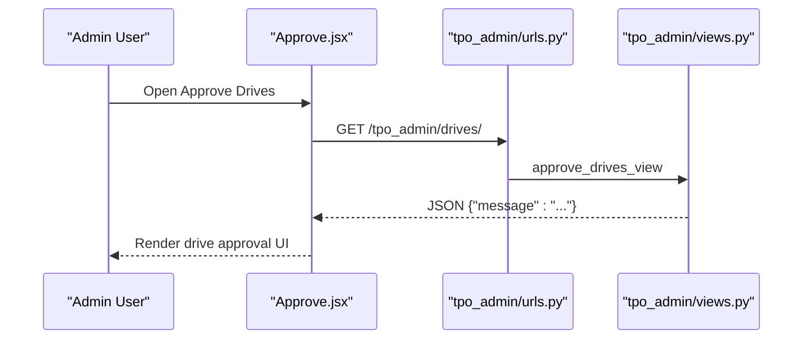
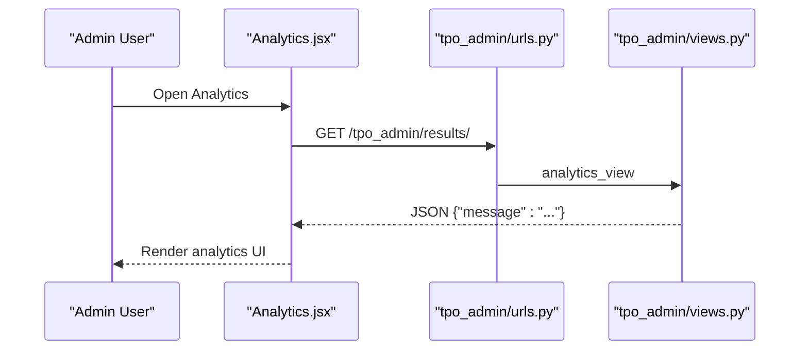
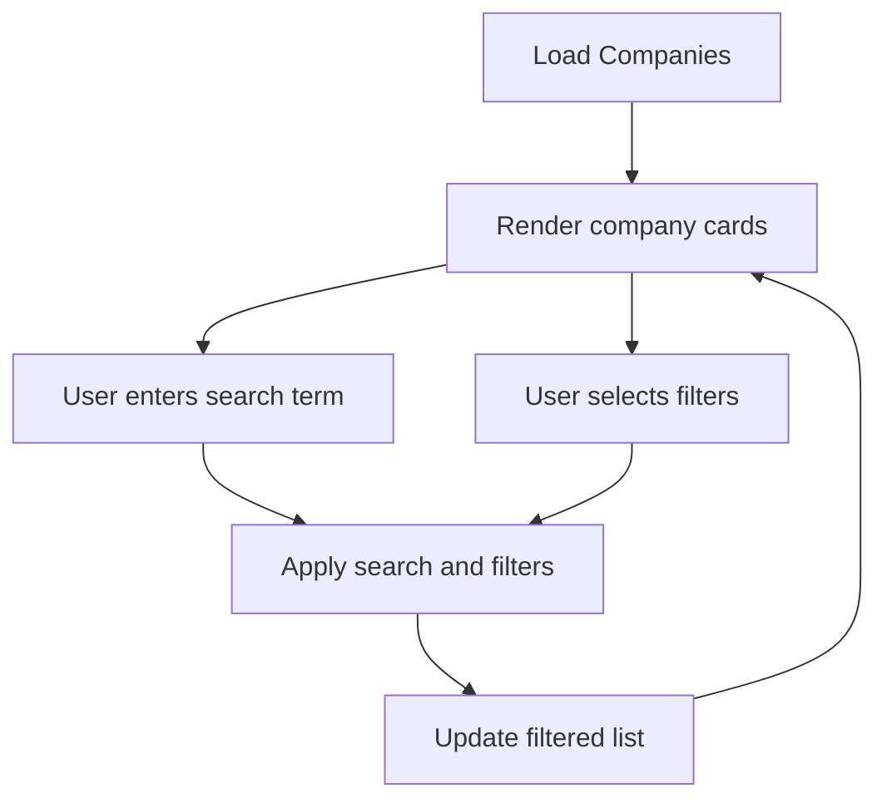
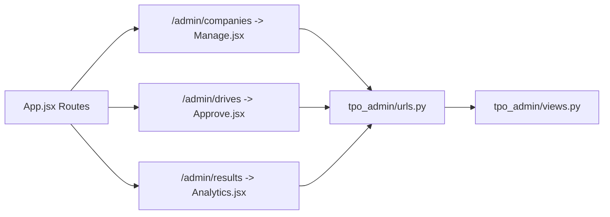

# Company Management

<cite>
**Referenced Files in This Document**
- [App.jsx](file://frontend/src/App.jsx)
- [Manage.jsx](file://frontend/src/Pages/TPOAdmin/Manage.jsx)
- [Approve.jsx](file://frontend/src/Pages/TPOAdmin/Approve.jsx)
- [Analytics.jsx](file://frontend/src/Pages/TPOAdmin/Analytics.jsx)
- [Companies.jsx](file://frontend/src/Pages/Student/Companies.jsx)
- [urls.py](file://backend/tpo_admin/urls.py)
- [views.py](file://backend/tpo_admin/views.py)
</cite>

## Table of Contents
1. [Introduction](#introduction)
2. [Project Structure](#project-structure)
3. [Core Components](#core-components)
4. [Architecture Overview](#architecture-overview)
5. [Detailed Component Analysis](#detailed-component-analysis)
6. [Dependency Analysis](#dependency-analysis)
7. [Performance Considerations](#performance-considerations)
8. [Troubleshooting Guide](#troubleshooting-guide)
9. [Conclusion](#conclusion)

## Introduction
This document describes the Company Management feature in the Admin Portal. It covers the administrative interface for overseeing companies, including company listing, profile management, institutional data maintenance, filtering and search, and integration with backend APIs. It also outlines admin workflows for verifying company information, approving company profiles, and maintaining data integrity. Where applicable, it references the current implementation state and highlights areas requiring backend model definitions and API endpoints.

## Project Structure
The Company Management feature spans frontend pages under the TPO Admin namespace and backend routes under the tpo_admin app. Routing is configured in the main application router, and backend endpoints are defined in the tpo_admin URLs and views.

**Diagram sources**
- [App.jsx:25-51](file://frontend/src/App.jsx#L25-L51)
- [Manage.jsx:1-10](file://frontend/src/Pages/TPOAdmin/Manage.jsx#L1-L10)
- [Approve.jsx:1-10](file://frontend/src/Pages/TPOAdmin/Approve.jsx#L1-L10)
- [Analytics.jsx](file://frontend/src/Pages/TPOAdmin/Analytics.jsx)
- [Companies.jsx:1-646](file://frontend/src/Pages/Student/Companies.jsx#L1-L646)
- [urls.py:1-9](file://backend/tpo_admin/urls.py#L1-L9)
- [views.py:1-11](file://backend/tpo_admin/views.py#L1-L11)

**Section sources**
- [App.jsx:25-51](file://frontend/src/App.jsx#L25-L51)
- [urls.py:1-9](file://backend/tpo_admin/urls.py#L1-L9)

## Core Components
- Admin Company Management Page: Placeholder page for managing companies under the "/admin/companies" route.
- Admin Drive Approval Page: Placeholder page for reviewing and approving placement drives under "/admin/drives".
- Admin Analytics Page: Placeholder page for viewing placement analytics under "/admin/results".
- Student Companies Listing: Full-featured listing page with search and filter controls, used by students to discover and apply to companies.

Key responsibilities:
- Present company listings and metadata to administrators.
- Provide filtering/search mechanisms for efficient navigation.
- Integrate with backend endpoints for CRUD operations and status updates.
- Support administrative actions such as verification, approval, and data maintenance.

**Section sources**
- [Manage.jsx:1-10](file://frontend/src/Pages/TPOAdmin/Manage.jsx#L1-L10)
- [Approve.jsx:1-10](file://frontend/src/Pages/TPOAdmin/Approve.jsx#L1-L10)
- [Analytics.jsx](file://frontend/src/Pages/TPOAdmin/Analytics.jsx)
- [Companies.jsx:1-646](file://frontend/src/Pages/Student/Companies.jsx#L1-L646)

## Architecture Overview
The Admin Portal’s Company Management feature follows a clear separation of concerns:
- Frontend pages define the UI and user interactions.
- Backend routes expose endpoints for administrative operations.
- Routing connects frontend pages to backend endpoints.

**Diagram sources**
- [App.jsx:45-48](file://frontend/src/App.jsx#L45-L48)
- [Manage.jsx:1-10](file://frontend/src/Pages/TPOAdmin/Manage.jsx#L1-L10)
- [urls.py:5](file://backend/tpo_admin/urls.py#L5)
- [views.py:3-4](file://backend/tpo_admin/views.py#L3-L4)

## Detailed Component Analysis

### Admin Company Management Page
- Purpose: Central administrative hub for managing companies.
- Current state: Minimal placeholder rendering company header and description.
- Next steps:
  - Connect to backend endpoints for fetching company data.
  - Implement filtering and search controls aligned with backend capabilities.
  - Add bulk operations for status changes (approve, reject, suspend).
  - Provide inline editing for institutional data fields.

**Diagram sources**
- [Manage.jsx:1-10](file://frontend/src/Pages/TPOAdmin/Manage.jsx#L1-L10)
- [urls.py:5](file://backend/tpo_admin/urls.py#L5)
- [views.py:3-4](file://backend/tpo_admin/views.py#L3-L4)

**Section sources**
- [Manage.jsx:1-10](file://frontend/src/Pages/TPOAdmin/Manage.jsx#L1-L10)

### Admin Drive Approval Page
- Purpose: Review and approve placement drives.
- Current state: Minimal placeholder page.
- Next steps:
  - Fetch pending drives from backend.
  - Implement approval/rejection actions.
  - Track analytics and results after approvals.

**Diagram sources**
- [Approve.jsx:1-10](file://frontend/src/Pages/TPOAdmin/Approve.jsx#L1-L10)
- [urls.py:6](file://backend/tpo_admin/urls.py#L6)
- [views.py:6-7](file://backend/tpo_admin/views.py#L6-L7)

**Section sources**
- [Approve.jsx:1-10](file://frontend/src/Pages/TPOAdmin/Approve.jsx#L1-L10)

### Admin Analytics Page
- Purpose: Display placement analytics and results.
- Current state: Minimal placeholder page.
- Next steps:
  - Fetch analytics data from backend.
  - Visualize metrics and KPIs for admin review.

**Diagram sources**
- [Analytics.jsx](file://frontend/src/Pages/TPOAdmin/Analytics.jsx)
- [urls.py:7](file://backend/tpo_admin/urls.py#L7)
- [views.py:9-10](file://backend/tpo_admin/views.py#L9-L10)

**Section sources**
- [Analytics.jsx](file://frontend/src/Pages/TPOAdmin/Analytics.jsx)

### Student Companies Listing (Reference)
Although not part of the Admin Portal, the student-facing Companies page demonstrates search and filtering patterns that align with the Admin’s intended capabilities.

Highlights:
- Search by company name, role, or skills.
- Filter by job type and CTC range.
- Display company cards with metadata and eligibility criteria.
- Modal-based details view.

**Diagram sources**
- [Companies.jsx:17-182](file://frontend/src/Pages/Student/Companies.jsx#L17-L182)

**Section sources**
- [Companies.jsx:1-646](file://frontend/src/Pages/Student/Companies.jsx#L1-L646)

## Dependency Analysis
- Frontend routing depends on App.jsx to mount Admin pages under "/admin/*".
- Admin pages currently depend on backend routes defined in tpo_admin/urls.py.
- Backend views return placeholder JSON responses; actual company data and CRUD operations are not yet implemented.

**Diagram sources**
- [App.jsx:45-48](file://frontend/src/App.jsx#L45-L48)
- [urls.py:1-9](file://backend/tpo_admin/urls.py#L1-L9)
- [views.py:1-11](file://backend/tpo_admin/views.py#L1-L11)

**Section sources**
- [App.jsx:25-51](file://frontend/src/App.jsx#L25-L51)
- [urls.py:1-9](file://backend/tpo_admin/urls.py#L1-L9)
- [views.py:1-11](file://backend/tpo_admin/views.py#L1-L11)

## Performance Considerations
- Client-side filtering in the student Companies page is acceptable for small datasets but should be offloaded to the backend for large-scale company lists.
- Pagination and server-side search/filtering should be implemented to maintain responsiveness.
- Debounce search inputs to reduce unnecessary re-renders and API calls.
- Lazy-load images and modal content to minimize initial payload.

## Troubleshooting Guide
- Endpoint not found: Verify backend URL patterns and ensure tpo_admin URLs are included in the project-wide URL configuration.
- CORS errors: Confirm backend allows requests from the frontend origin and CSRF handling is appropriate for admin endpoints.
- Empty lists: Confirm backend endpoints return valid JSON and the frontend handles loading and empty states gracefully.
- Routing issues: Ensure Admin routes are mounted under "/admin" and match the frontend navigation.

**Section sources**
- [urls.py:1-9](file://backend/tpo_admin/urls.py#L1-L9)
- [views.py:1-11](file://backend/tpo_admin/views.py#L1-L11)
- [App.jsx:45-48](file://frontend/src/App.jsx#L45-L48)

## Conclusion
The Company Management feature in the Admin Portal is currently in early stages, with frontend pages and backend routes present but minimal functionality. The next phase should focus on:
- Defining backend models for companies and institutional data.
- Implementing CRUD endpoints and status management workflows.
- Integrating filtering, search, and bulk operations in the Admin UI.
- Establishing robust admin workflows for verification, approval, and data integrity.