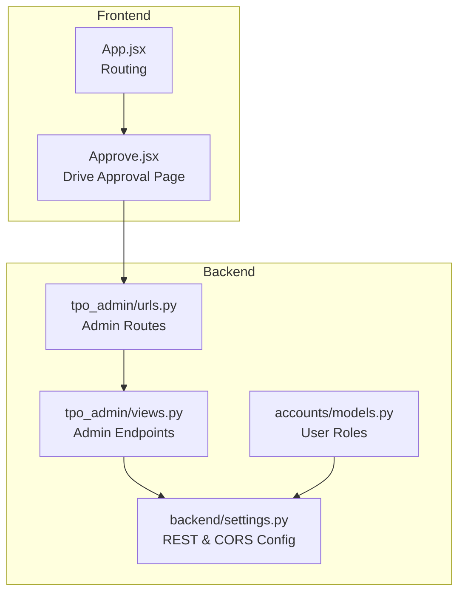
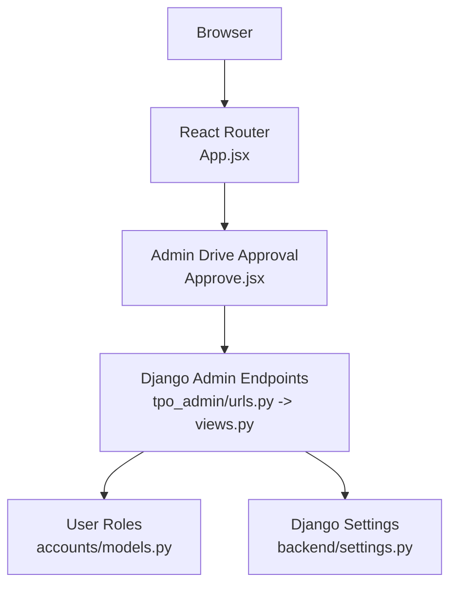
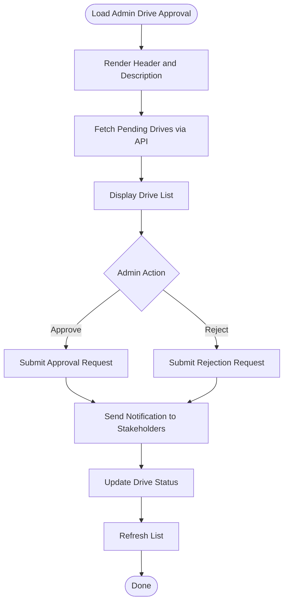
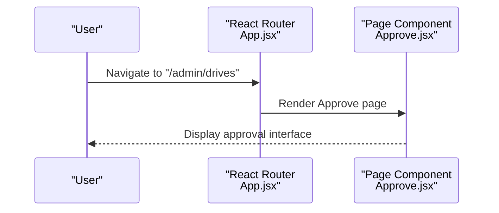
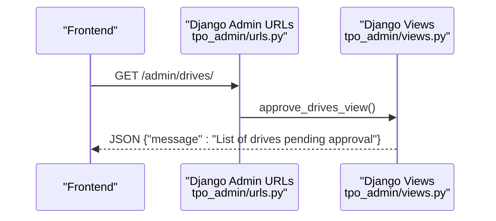
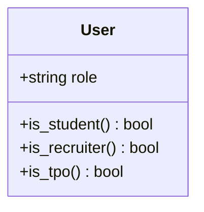
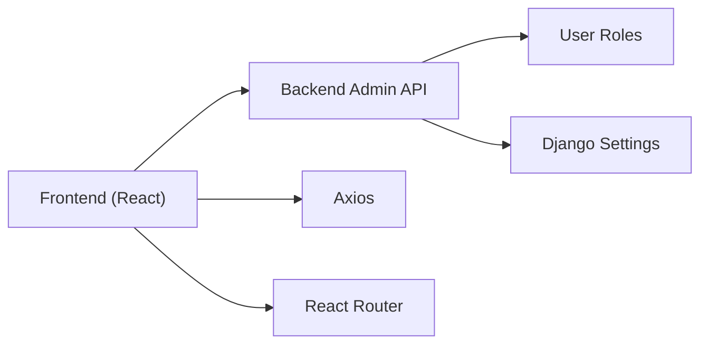

# Drive Approval System

<cite>
**Referenced Files in This Document**
- [Approve.jsx](file://frontend/src/Pages/TPOAdmin/Approve.jsx)
- [App.jsx](file://frontend/src/App.jsx)
- [urls.py](file://backend/tpo_admin/urls.py)
- [views.py](file://backend/tpo_admin/views.py)
- [settings.py](file://backend/backend/settings.py)
- [accounts/models.py](file://backend/accounts/models.py)
- [package.json](file://frontend/package.json)
</cite>

## Table of Contents
1. [Introduction](#introduction)
2. [Project Structure](#project-structure)
3. [Core Components](#core-components)
4. [Architecture Overview](#architecture-overview)
5. [Detailed Component Analysis](#detailed-component-analysis)
6. [Dependency Analysis](#dependency-analysis)
7. [Performance Considerations](#performance-considerations)
8. [Troubleshooting Guide](#troubleshooting-guide)
9. [Conclusion](#conclusion)

## Introduction
This document describes the Drive Approval System in the Admin Portal. It focuses on the placement drive review interface for evaluating and approving campus recruitment drives, managing scheduling conflicts, and coordinating stakeholder approvals. The documentation covers the component architecture for displaying drive requests, approval workflows, and status management, along with backend API integrations for drive data retrieval, approval processing, and notifications. Administrative decision-making, conflict resolution mechanisms, and approval criteria are explained with practical examples.

## Project Structure
The system comprises:
- Frontend (React) routes and pages under frontend/src
- Backend (Django) admin module under backend/tpo_admin
- Shared configuration for Django REST framework and CORS under backend/backend/settings.py
- Authentication model under backend/accounts/models.py

**Diagram sources**
- [App.jsx:1-55](file://frontend/src/App.jsx#L1-L55)
- [Approve.jsx:1-11](file://frontend/src/Pages/TPOAdmin/Approve.jsx#L1-L11)
- [urls.py:1-9](file://backend/tpo_admin/urls.py#L1-L9)
- [views.py:1-11](file://backend/tpo_admin/views.py#L1-L11)
- [settings.py:1-126](file://backend/backend/settings.py#L1-L126)
- [accounts/models.py:1-25](file://backend/accounts/models.py#L1-L25)

**Section sources**
- [App.jsx:1-55](file://frontend/src/App.jsx#L1-L55)
- [Approve.jsx:1-11](file://frontend/src/Pages/TPOAdmin/Approve.jsx#L1-L11)
- [urls.py:1-9](file://backend/tpo_admin/urls.py#L1-L9)
- [views.py:1-11](file://backend/tpo_admin/views.py#L1-L11)
- [settings.py:1-126](file://backend/backend/settings.py#L1-L126)
- [accounts/models.py:1-25](file://backend/accounts/models.py#L1-L25)

## Core Components
- Admin Drive Approval Page: A placeholder page for reviewing and approving placement drives.
- Routing: Client-side routes connect the Admin Portal to the approval page.
- Backend Admin Endpoints: Placeholder endpoints for company management, drive approval, and analytics.
- Authentication Model: Defines roles including TPO Admin, used to authorize access to admin features.
- CORS and REST Settings: Enables cross-origin requests from the frontend dev server and REST framework integration.

Key responsibilities:
- Present pending drives awaiting approval
- Allow admin actions to approve/reject drives
- Integrate with backend APIs for data retrieval and updates
- Coordinate with stakeholders (companies, students) via notifications

**Section sources**
- [Approve.jsx:1-11](file://frontend/src/Pages/TPOAdmin/Approve.jsx#L1-L11)
- [App.jsx:1-55](file://frontend/src/App.jsx#L1-L55)
- [urls.py:1-9](file://backend/tpo_admin/urls.py#L1-L9)
- [views.py:1-11](file://backend/tpo_admin/views.py#L1-L11)
- [accounts/models.py:1-25](file://backend/accounts/models.py#L1-L25)
- [settings.py:1-126](file://backend/backend/settings.py#L1-L126)

## Architecture Overview
The system follows a standard MERN-like split:
- Frontend: React SPA with client-side routing
- Backend: Django REST endpoints for admin operations
- Authentication: Role-based access control via the User model
- Communication: HTTP requests from frontend to backend admin endpoints

**Diagram sources**
- [App.jsx:1-55](file://frontend/src/App.jsx#L1-L55)
- [Approve.jsx:1-11](file://frontend/src/Pages/TPOAdmin/Approve.jsx#L1-L11)
- [urls.py:1-9](file://backend/tpo_admin/urls.py#L1-L9)
- [views.py:1-11](file://backend/tpo_admin/views.py#L1-L11)
- [accounts/models.py:1-25](file://backend/accounts/models.py#L1-L25)
- [settings.py:1-126](file://backend/backend/settings.py#L1-L126)

## Detailed Component Analysis

### Admin Drive Approval Page
Purpose:
- Serve as the landing page for reviewing and approving placement drives
- Provide controls for approving or rejecting drives
- Display lists of pending drives and their metadata
- Integrate with backend APIs for fetching drive data and submitting approvals

Current state:
- Minimal placeholder rendering with title and description
- Ready to integrate with backend APIs and UI components

**Diagram sources**
- [Approve.jsx:1-11](file://frontend/src/Pages/TPOAdmin/Approve.jsx#L1-L11)

**Section sources**
- [Approve.jsx:1-11](file://frontend/src/Pages/TPOAdmin/Approve.jsx#L1-L11)

### Routing and Navigation
Purpose:
- Define client-side routes for the Admin Portal
- Expose the Drive Approval page at a dedicated path

Behavior:
- Routes include public pages, student pages, recruiter pages, and admin pages
- The admin/drives route renders the Drive Approval page

**Diagram sources**
- [App.jsx:1-55](file://frontend/src/App.jsx#L1-L55)
- [Approve.jsx:1-11](file://frontend/src/Pages/TPOAdmin/Approve.jsx#L1-L11)

**Section sources**
- [App.jsx:1-55](file://frontend/src/App.jsx#L1-L55)

### Backend Admin Endpoints
Endpoints:
- GET /admin/companies/ → List of companies in the system
- GET /admin/drives/ → List of drives pending approval
- GET /admin/results/ → Placement analytics and results

Current behavior:
- Endpoints return placeholder JSON responses
- Ready to be extended with real data retrieval and approval logic

**Diagram sources**
- [urls.py:1-9](file://backend/tpo_admin/urls.py#L1-L9)
- [views.py:1-11](file://backend/tpo_admin/views.py#L1-L11)

**Section sources**
- [urls.py:1-9](file://backend/tpo_admin/urls.py#L1-L9)
- [views.py:1-11](file://backend/tpo_admin/views.py#L1-L11)

### Authentication and Authorization
Role model:
- User model defines roles including student, recruiter, and TPO Admin
- Used to restrict access to admin features

Integration:
- Configure AUTH_USER_MODEL to use the custom User model
- Enable REST framework and token authentication for secure API access

**Diagram sources**
- [accounts/models.py:1-25](file://backend/accounts/models.py#L1-L25)

**Section sources**
- [accounts/models.py:1-25](file://backend/accounts/models.py#L1-L25)
- [settings.py:1-126](file://backend/backend/settings.py#L1-L126)

### Frontend Dependencies and Build
- React and React Router DOM for UI and routing
- Axios for HTTP requests to backend APIs
- Tailwind CSS for styling

These dependencies support building the Drive Approval interface and connecting to backend endpoints.

**Section sources**
- [package.json:1-34](file://frontend/package.json#L1-L34)

## Dependency Analysis
High-level dependencies:
- Frontend depends on backend endpoints for data and actions
- Backend endpoints depend on Django settings for CORS and REST configuration
- Authentication model underpins role-based access control

**Diagram sources**
- [App.jsx:1-55](file://frontend/src/App.jsx#L1-L55)
- [Approve.jsx:1-11](file://frontend/src/Pages/TPOAdmin/Approve.jsx#L1-L11)
- [urls.py:1-9](file://backend/tpo_admin/urls.py#L1-L9)
- [views.py:1-11](file://backend/tpo_admin/views.py#L1-L11)
- [settings.py:1-126](file://backend/backend/settings.py#L1-L126)
- [accounts/models.py:1-25](file://backend/accounts/models.py#L1-L25)
- [package.json:1-34](file://frontend/package.json#L1-L34)

**Section sources**
- [App.jsx:1-55](file://frontend/src/App.jsx#L1-L55)
- [urls.py:1-9](file://backend/tpo_admin/urls.py#L1-L9)
- [views.py:1-11](file://backend/tpo_admin/views.py#L1-L11)
- [settings.py:1-126](file://backend/backend/settings.py#L1-L126)
- [accounts/models.py:1-25](file://backend/accounts/models.py#L1-L25)
- [package.json:1-34](file://frontend/package.json#L1-L34)

## Performance Considerations
- Minimize payload sizes by requesting only required fields for drive listings
- Paginate drive lists to avoid large response bodies
- Cache frequently accessed static data (e.g., company lists) on the frontend
- Debounce search/filter inputs to reduce unnecessary API calls
- Use optimistic UI updates for approval actions with rollback on failure

## Troubleshooting Guide
Common issues and resolutions:
- CORS errors when calling backend endpoints from localhost:5173
  - Ensure frontend origin is included in CORS_ALLOWED_ORIGINS
  - Verify backend middleware stack includes corsheaders
- Authentication failures
  - Confirm AUTH_USER_MODEL points to the custom User model
  - Ensure REST framework and token auth are enabled
- Endpoint returns placeholder data
  - Extend views.py to fetch real drive data and implement approval logic
  - Wire up database models and serializers as needed

**Section sources**
- [settings.py:1-126](file://backend/backend/settings.py#L1-L126)
- [accounts/models.py:1-25](file://backend/accounts/models.py#L1-L25)
- [views.py:1-11](file://backend/tpo_admin/views.py#L1-L11)

## Conclusion
The Drive Approval System in the Admin Portal currently provides a foundation with routing, a placeholder approval page, and basic backend endpoints. To implement a full solution, extend the backend with real data retrieval, approval processing, and notification hooks, and enrich the frontend with drive listing, filtering, conflict detection, and action controls. Integrate the User role model to enforce admin-only access and leverage CORS/REST settings for secure communication.