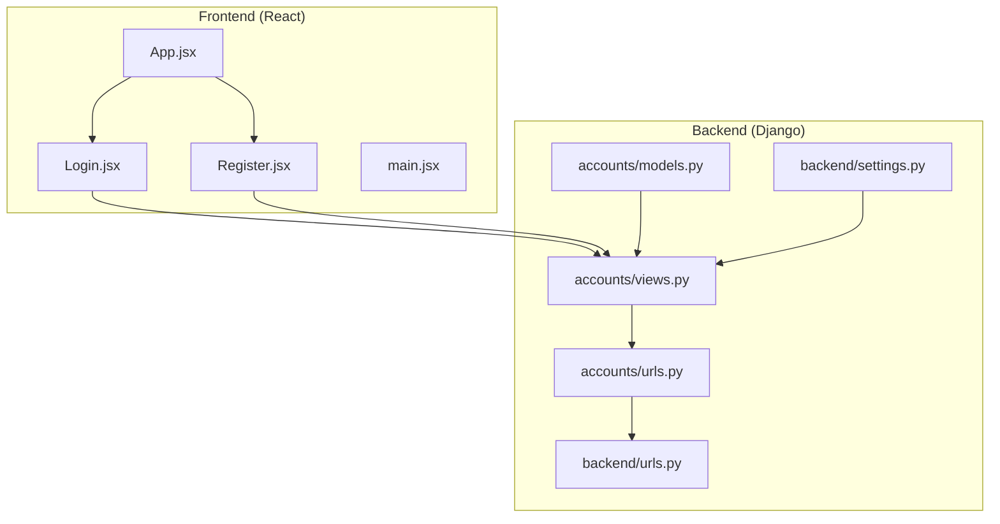
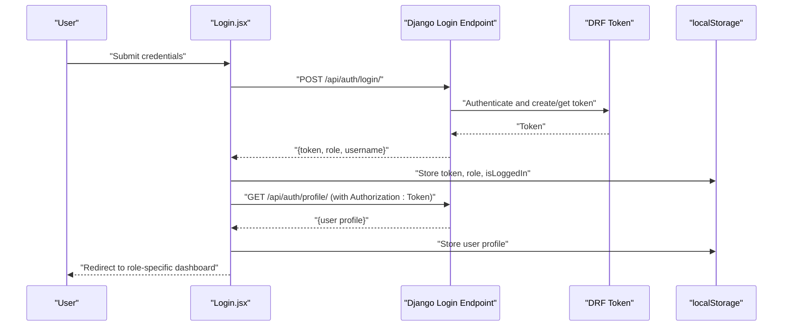
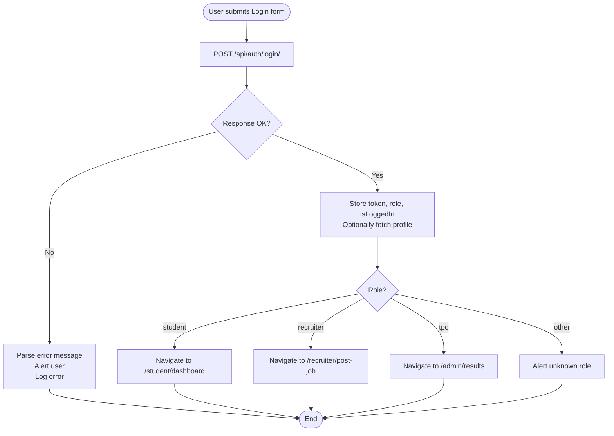
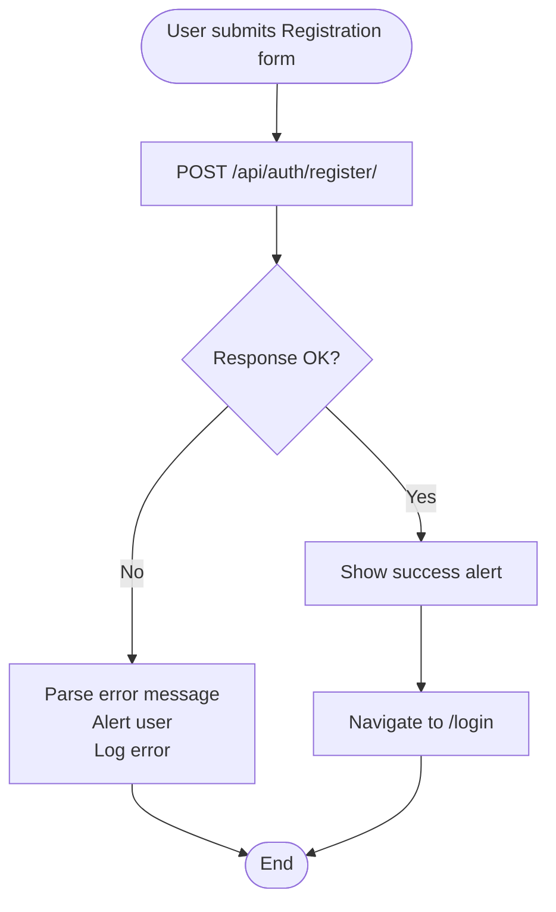
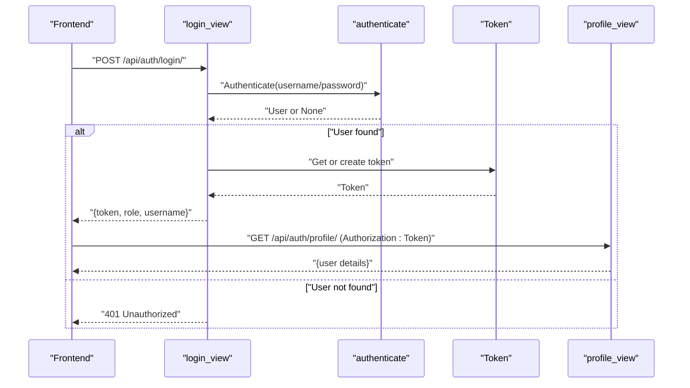
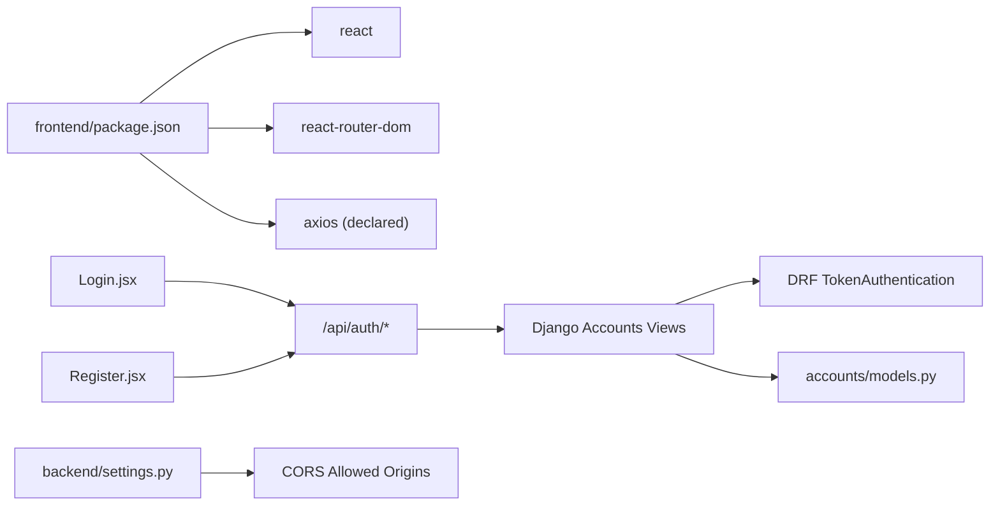

# Authentication Pages

<cite>
**Referenced Files in This Document**
- [Login.jsx](file://frontend/src/Pages/Public/Login.jsx)
- [Register.jsx](file://frontend/src/Pages/Public/Register.jsx)
- [App.jsx](file://frontend/src/App.jsx)
- [main.jsx](file://frontend/src/main.jsx)
- [views.py](file://backend/accounts/views.py)
- [urls.py](file://backend/accounts/urls.py)
- [backend urls.py](file://backend/backend/urls.py)
- [models.py](file://backend/accounts/models.py)
- [settings.py](file://backend/backend/settings.py)
- [package.json](file://frontend/package.json)
</cite>

## Table of Contents
1. [Introduction](#introduction)
2. [Project Structure](#project-structure)
3. [Core Components](#core-components)
4. [Architecture Overview](#architecture-overview)
5. [Detailed Component Analysis](#detailed-component-analysis)
6. [Dependency Analysis](#dependency-analysis)
7. [Performance Considerations](#performance-considerations)
8. [Troubleshooting Guide](#troubleshooting-guide)
9. [Conclusion](#conclusion)

## Introduction
This document provides comprehensive documentation for the authentication pages in the TPO Portal React application. It covers the login and registration components, form handling, validation, error handling, user feedback, and the end-to-end authentication flow. It also explains the integration with the Django backend authentication API, token-based session management, responsive design, accessibility considerations, and security measures. The goal is to help developers and stakeholders understand how authentication works from user entry to successful login and registration, and how to maintain and troubleshoot the system effectively.

## Project Structure
The authentication functionality spans two primary areas:
- Frontend (React): Public login and registration pages, routing, and local storage-based session persistence.
- Backend (Django + DRF): Token-based authentication endpoints for login, registration, profile retrieval, and logout.

Key files involved:
- Frontend pages: Login.jsx, Register.jsx
- Routing: App.jsx
- Backend endpoints: accounts/views.py, accounts/urls.py, backend/urls.py
- User model and settings: accounts/models.py, backend/settings.py
- Dependencies: frontend/package.json

**Diagram sources**
- [Login.jsx:1-160](file://frontend/src/Pages/Public/Login.jsx#L1-L160)
- [Register.jsx:1-172](file://frontend/src/Pages/Public/Register.jsx#L1-L172)
- [App.jsx:1-55](file://frontend/src/App.jsx#L1-L55)
- [main.jsx:1-11](file://frontend/src/main.jsx#L1-L11)
- [views.py:1-95](file://backend/accounts/views.py#L1-L95)
- [urls.py:1-10](file://backend/accounts/urls.py#L1-L10)
- [backend urls.py:1-11](file://backend/backend/urls.py#L1-L11)
- [models.py:1-25](file://backend/accounts/models.py#L1-L25)
- [settings.py:1-126](file://backend/backend/settings.py#L1-L126)

**Section sources**
- [Login.jsx:1-160](file://frontend/src/Pages/Public/Login.jsx#L1-L160)
- [Register.jsx:1-172](file://frontend/src/Pages/Public/Register.jsx#L1-L172)
- [App.jsx:1-55](file://frontend/src/App.jsx#L1-L55)
- [main.jsx:1-11](file://frontend/src/main.jsx#L1-L11)
- [views.py:1-95](file://backend/accounts/views.py#L1-L95)
- [urls.py:1-10](file://backend/accounts/urls.py#L1-L10)
- [backend urls.py:1-11](file://backend/backend/urls.py#L1-L11)
- [models.py:1-25](file://backend/accounts/models.py#L1-L25)
- [settings.py:1-126](file://backend/backend/settings.py#L1-L126)

## Core Components
- Login page (Login.jsx)
  - State management for username/email, password, and role selection.
  - Form submission handler that posts credentials to the backend login endpoint.
  - Token storage and redirection based on role.
  - Optional profile fetch using the returned token.
- Registration page (Register.jsx)
  - State management for personal and account details.
  - Form submission handler that posts registration data to the backend register endpoint.
  - Success feedback and navigation to the login page.
- Routing (App.jsx)
  - Declares routes for public pages (login, register) and protected routes for roles.
- Backend authentication endpoints (accounts/views.py)
  - Login: dual-login support (username or email), token creation, role and username return.
  - Registration: user creation with role and validation.
  - Profile: token-protected endpoint returning user details.
  - Logout: session termination.

**Section sources**
- [Login.jsx:1-160](file://frontend/src/Pages/Public/Login.jsx#L1-L160)
- [Register.jsx:1-172](file://frontend/src/Pages/Public/Register.jsx#L1-L172)
- [App.jsx:1-55](file://frontend/src/App.jsx#L1-L55)
- [views.py:1-95](file://backend/accounts/views.py#L1-L95)

## Architecture Overview
The authentication flow integrates React frontend with Django backend using token-based authentication. The frontend collects user input, submits it to backend endpoints, stores tokens locally, and navigates to role-specific dashboards. The backend authenticates users, manages tokens, and exposes a protected profile endpoint.

**Diagram sources**
- [Login.jsx:17-55](file://frontend/src/Pages/Public/Login.jsx#L17-L55)
- [views.py:13-45](file://backend/accounts/views.py#L13-L45)
- [urls.py:4-8](file://backend/accounts/urls.py#L4-L8)

**Section sources**
- [Login.jsx:17-55](file://frontend/src/Pages/Public/Login.jsx#L17-L55)
- [views.py:13-45](file://backend/accounts/views.py#L13-L45)
- [urls.py:4-8](file://backend/accounts/urls.py#L4-L8)

## Detailed Component Analysis

### Login Page (Login.jsx)
- State and handlers
  - Manages form state for username/email, password, and role.
  - Handles input changes and form submission.
- Submission flow
  - Posts credentials to the backend login endpoint.
  - On success, stores role, token, and isLoggedIn in localStorage.
  - Optionally fetches user profile using the token and stores it.
  - Redirects to role-specific route.
- Error handling
  - Catches network and server errors, logs them, and alerts the user.
- Styling and UX
  - Uses inline styles for dark theme and responsive layout.
  - Role-dependent button color.
  - Provides quick navigation to the registration page.

**Diagram sources**
- [Login.jsx:17-55](file://frontend/src/Pages/Public/Login.jsx#L17-L55)

**Section sources**
- [Login.jsx:1-160](file://frontend/src/Pages/Public/Login.jsx#L1-L160)

### Registration Page (Register.jsx)
- State and handlers
  - Manages form state for personal and account details.
  - Handles input changes and form submission.
- Submission flow
  - Posts registration data to the backend register endpoint.
  - On success, shows a success alert and navigates to the login page.
- Error handling
  - Catches network and server errors, logs them, and alerts the user.
- Styling and UX
  - Uses inline styles for dark theme and responsive layout.
  - Provides quick navigation to the login page.

**Diagram sources**
- [Register.jsx:20-40](file://frontend/src/Pages/Public/Register.jsx#L20-L40)

**Section sources**
- [Register.jsx:1-172](file://frontend/src/Pages/Public/Register.jsx#L1-L172)

### Backend Authentication Endpoints (Django)
- Login endpoint
  - Accepts username or email and password.
  - Supports dual-login by resolving email to username.
  - Authenticates via Django’s authenticate, creates or retrieves DRF Token, and returns token, role, and username.
- Registration endpoint
  - Validates uniqueness of username and creates a new user with provided details and role.
- Profile endpoint
  - Protected by DRF TokenAuthentication and IsAuthenticated; returns current user details.
- Logout endpoint
  - Logs out the current session.

**Diagram sources**
- [views.py:13-45](file://backend/accounts/views.py#L13-L45)
- [views.py:48-75](file://backend/accounts/views.py#L48-L75)
- [views.py:78-89](file://backend/accounts/views.py#L78-L89)

**Section sources**
- [views.py:1-95](file://backend/accounts/views.py#L1-L95)
- [urls.py:1-10](file://backend/accounts/urls.py#L1-L10)
- [backend urls.py:1-11](file://backend/backend/urls.py#L1-L11)

### Routing and Navigation (App.jsx)
- Declares routes for:
  - Public: /login, /register, default to /login.
  - Student: /student/dashboard, /student/profile, /student/companies, /student/apply/:companyId, /student/applications.
  - Recruiter: /recruiter/post-job, /recruiter/applicants.
  - Admin: /admin/companies, /admin/drives, /admin/results.
- Ensures proper navigation after authentication.

**Section sources**
- [App.jsx:1-55](file://frontend/src/App.jsx#L1-L55)

## Dependency Analysis
- Frontend dependencies
  - React and react-router-dom for UI and routing.
  - Axios is declared but not used in the provided authentication pages; the login and registration components use native fetch.
- Backend dependencies
  - Django REST Framework for token authentication and protected endpoints.
  - Django CORS headers configured for React dev origin.
- Internal dependencies
  - Frontend pages depend on backend endpoints under /api/auth/.
  - Backend endpoints depend on the custom User model with role choices.

**Diagram sources**
- [package.json:12-32](file://frontend/package.json#L12-L32)
- [Login.jsx:17-24](file://frontend/src/Pages/Public/Login.jsx#L17-L24)
- [Register.jsx:20-27](file://frontend/src/Pages/Public/Register.jsx#L20-L27)
- [views.py:1-10](file://backend/accounts/views.py#L1-L10)
- [models.py:1-25](file://backend/accounts/models.py#L1-L25)
- [settings.py:18-22](file://backend/backend/settings.py#L18-L22)

**Section sources**
- [package.json:1-34](file://frontend/package.json#L1-L34)
- [Login.jsx:17-24](file://frontend/src/Pages/Public/Login.jsx#L17-L24)
- [Register.jsx:20-27](file://frontend/src/Pages/Public/Register.jsx#L20-L27)
- [views.py:1-10](file://backend/accounts/views.py#L1-L10)
- [models.py:1-25](file://backend/accounts/models.py#L1-L25)
- [settings.py:18-22](file://backend/backend/settings.py#L18-L22)

## Performance Considerations
- Network requests
  - Minimize extra requests by fetching the profile only when necessary; the current implementation fetches profile after login.
- Token storage
  - Using localStorage is simple but not ideal for production due to XSS risks; consider httpOnly cookies with CSRF protection for production.
- Rendering
  - Inline styles are fine for small components; for larger apps, extract styles to CSS modules or styled-components for maintainability.
- Validation
  - Add client-side validation (e.g., password length, email format) to reduce unnecessary backend calls.

## Troubleshooting Guide
- Login fails with invalid credentials
  - Verify username/email and password match backend expectations.
  - Check backend response messages and ensure CORS is configured for the frontend origin.
- Token missing or expired
  - Confirm token is stored in localStorage after login.
  - Ensure Authorization header is included for protected endpoints.
- Profile fetch fails
  - Verify the Authorization header format and token validity.
- Cross-Origin errors
  - Ensure backend CORS settings allow the frontend origin.
- Route navigation issues
  - Confirm routes are defined in App.jsx and match the redirect destinations after login.

Common checks:
- Backend login endpoint reachable at /api/auth/login/.
- Backend register endpoint reachable at /api/auth/register/.
- Backend profile endpoint protected and reachable at /api/auth/profile/.
- Frontend fetch URLs match backend base URL and endpoints.

**Section sources**
- [Login.jsx:17-55](file://frontend/src/Pages/Public/Login.jsx#L17-L55)
- [Register.jsx:20-40](file://frontend/src/Pages/Public/Register.jsx#L20-L40)
- [views.py:13-45](file://backend/accounts/views.py#L13-L45)
- [views.py:48-75](file://backend/accounts/views.py#L48-L75)
- [views.py:78-89](file://backend/accounts/views.py#L78-L89)
- [settings.py:18-22](file://backend/backend/settings.py#L18-L22)

## Conclusion
The TPO Portal’s authentication system combines simple React pages with Django backend endpoints to deliver a functional login and registration experience. The frontend handles form state, submission, token storage, and navigation, while the backend provides secure token-based authentication, user creation, and protected profile access. For production, consider enhancing security (httpOnly cookies, CSRF), improving validation, and centralizing API calls with a dedicated service module.