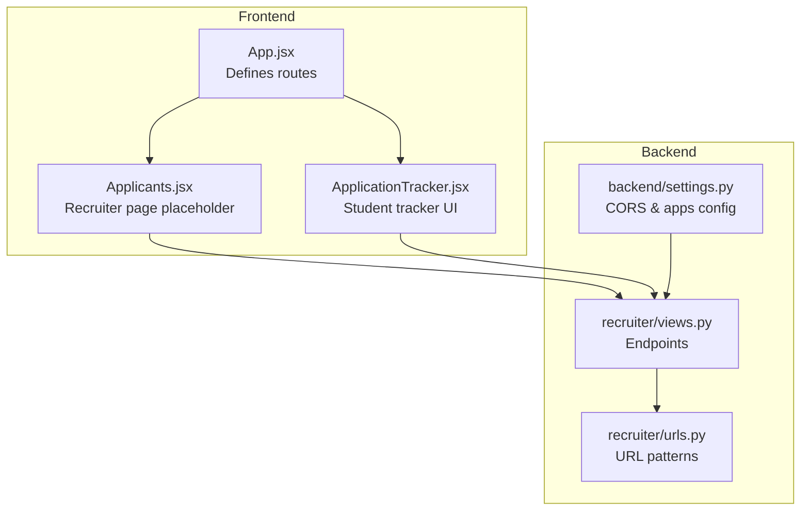
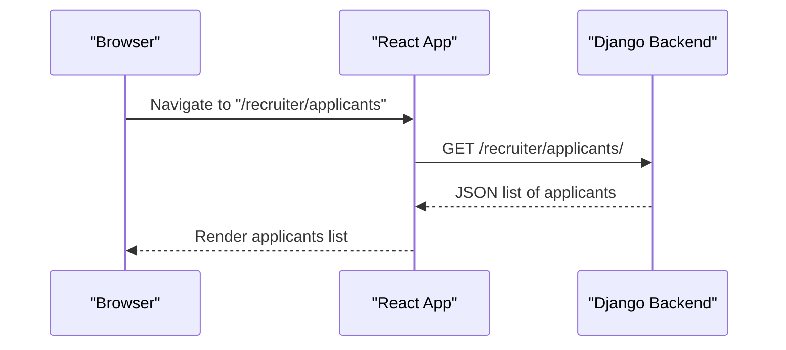
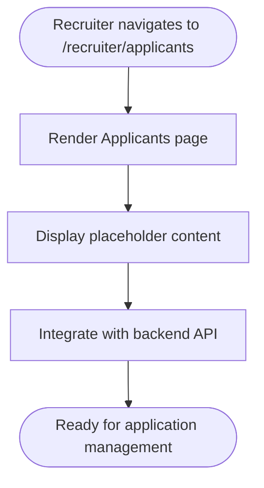
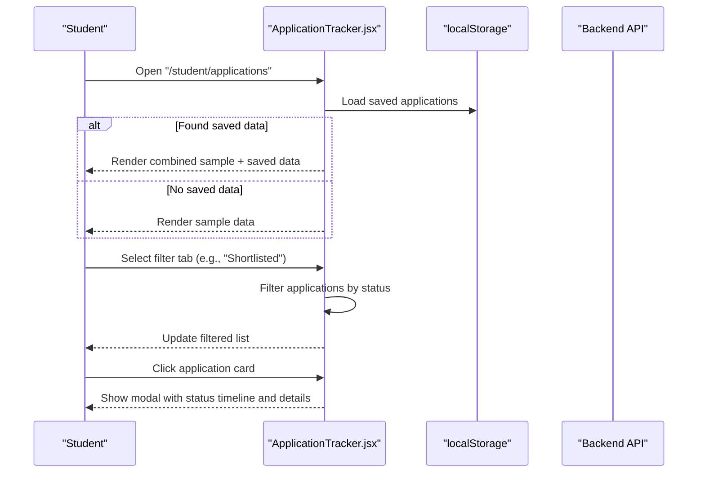
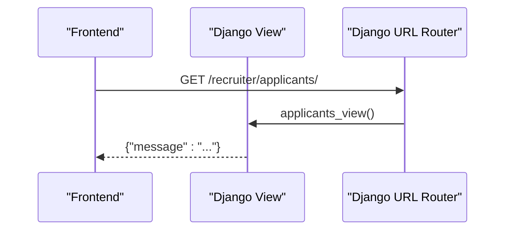
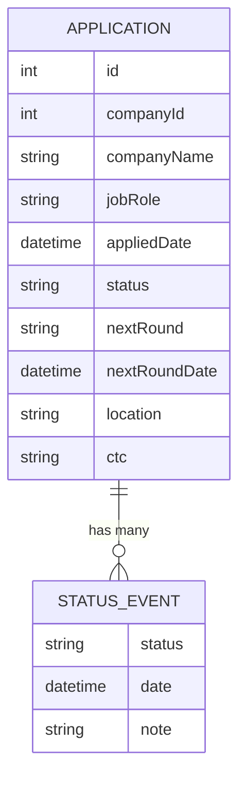
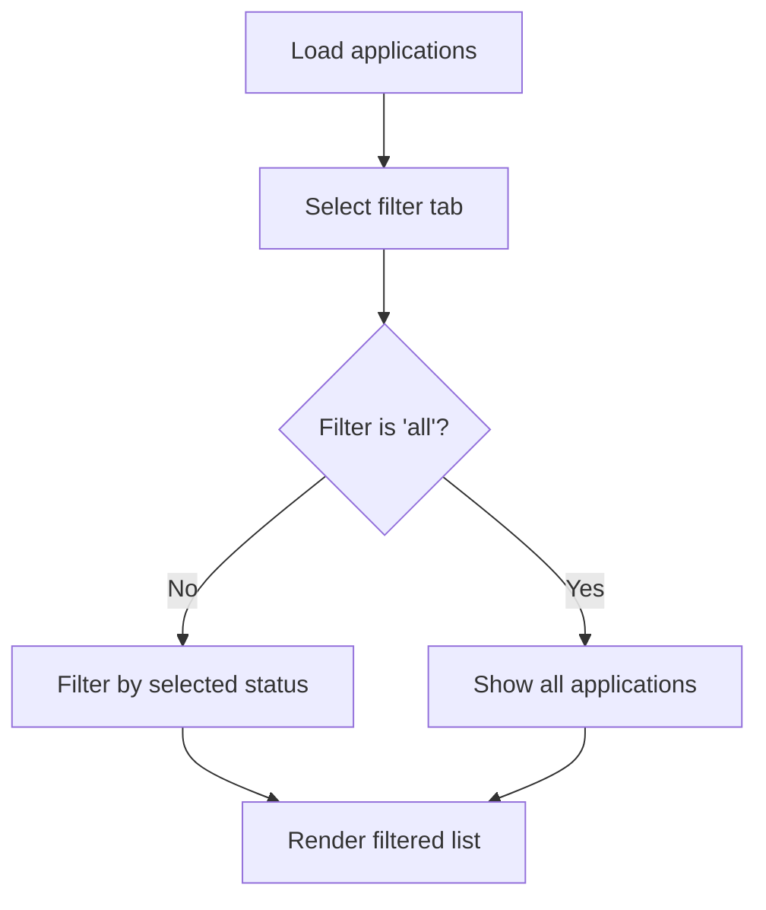
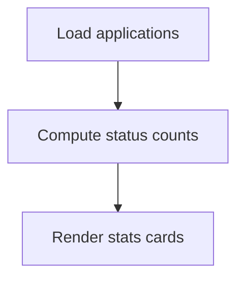
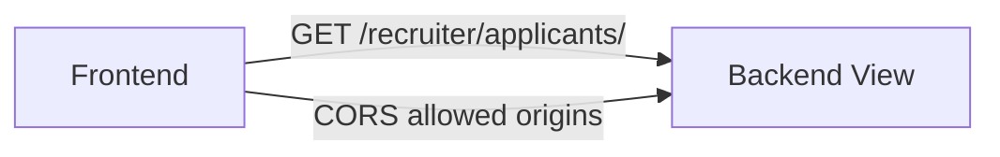
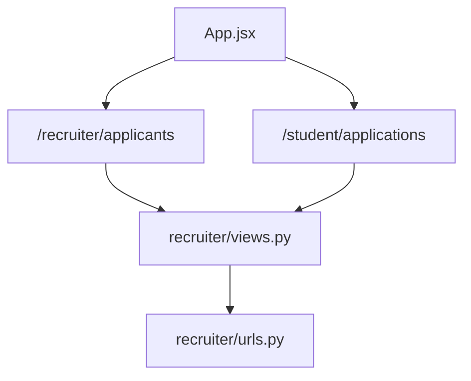

# Applicant Management

<cite>
**Referenced Files in This Document**
- [App.jsx](file://frontend/src/App.jsx)
- [Applicants.jsx](file://frontend/src/Pages/Company/Applicants.jsx)
- [ApplicationTracker.jsx](file://frontend/src/Pages/Student/ApplicationTracker.jsx)
- [views.py](file://backend/recruiter/views.py)
- [urls.py](file://backend/recruiter/urls.py)
- [settings.py](file://backend/backend/settings.py)
</cite>

## Table of Contents
1. [Introduction](#introduction)
2. [Project Structure](#project-structure)
3. [Core Components](#core-components)
4. [Architecture Overview](#architecture-overview)
5. [Detailed Component Analysis](#detailed-component-analysis)
6. [Dependency Analysis](#dependency-analysis)
7. [Performance Considerations](#performance-considerations)
8. [Troubleshooting Guide](#troubleshooting-guide)
9. [Conclusion](#conclusion)

## Introduction
This document describes the Applicant Management component for the campus placement portal. It focuses on how recruiters view and manage applications received from students, how candidates track their own applications, and how the frontend integrates with the backend APIs. The component supports:
- Viewing application listings
- Filtering and sorting applications by status
- Displaying candidate information panels and status timelines
- Initiating status updates and communication actions
- Visualizing application statistics
- Export functionality (conceptual)
- Backend API integration for retrieving and updating application data

## Project Structure
The Applicant Management feature spans frontend pages and backend endpoints:
- Frontend routes define the UI surfaces for recruiters and students.
- The frontend currently simulates application data storage locally; in a production system, it would fetch from backend endpoints.
- Backend exposes endpoints for job posting and retrieving applicants.

**Diagram sources**
- [App.jsx:1-55](file://frontend/src/App.jsx#L1-L55)
- [Applicants.jsx:1-11](file://frontend/src/Pages/Company/Applicants.jsx#L1-L11)
- [ApplicationTracker.jsx:1-570](file://frontend/src/Pages/Student/ApplicationTracker.jsx#L1-L570)
- [views.py:1-12](file://backend/recruiter/views.py#L1-L12)
- [urls.py:1-8](file://backend/recruiter/urls.py#L1-L8)
- [settings.py:1-126](file://backend/backend/settings.py#L1-L126)

**Section sources**
- [App.jsx:1-55](file://frontend/src/App.jsx#L1-L55)
- [Applicants.jsx:1-11](file://frontend/src/Pages/Company/Applicants.jsx#L1-L11)
- [ApplicationTracker.jsx:1-570](file://frontend/src/Pages/Student/ApplicationTracker.jsx#L1-L570)
- [views.py:1-12](file://backend/recruiter/views.py#L1-L12)
- [urls.py:1-8](file://backend/recruiter/urls.py#L1-L8)
- [settings.py:1-126](file://backend/backend/settings.py#L1-L126)

## Core Components
- Recruiter Applicants Page: Placeholder page for viewing applications for posted jobs.
- Student Application Tracker: Full-featured UI for tracking applications, filtering by status, viewing details, and visualizing status history.
- Backend API Endpoints: Recruiter endpoints for job posting and retrieving applicants.

Key responsibilities:
- Recruiter Applicants Page: Surface for managing applications (placeholder).
- Student Application Tracker: Fetch and render application data, apply filters, show status timelines, and present statistics.
- Backend Integration: Expose endpoints for retrieving applicants and job-related data.

**Section sources**
- [Applicants.jsx:1-11](file://frontend/src/Pages/Company/Applicants.jsx#L1-L11)
- [ApplicationTracker.jsx:1-570](file://frontend/src/Pages/Student/ApplicationTracker.jsx#L1-L570)
- [views.py:1-12](file://backend/recruiter/views.py#L1-L12)

## Architecture Overview
The system follows a client-server pattern:
- Frontend (React) renders the UI and manages local state for application data during development.
- Backend (Django) exposes REST-style endpoints for recruiters to interact with application data.
- CORS is configured to allow the frontend origin to communicate with the backend.

**Diagram sources**
- [App.jsx:42-43](file://frontend/src/App.jsx#L42-L43)
- [views.py:10-11](file://backend/recruiter/views.py#L10-L11)
- [urls.py](file://backend/recruiter/urls.py#L6)

**Section sources**
- [App.jsx:42-43](file://frontend/src/App.jsx#L42-L43)
- [views.py:10-11](file://backend/recruiter/views.py#L10-L11)
- [urls.py](file://backend/recruiter/urls.py#L6)
- [settings.py:18-22](file://backend/backend/settings.py#L18-L22)

## Detailed Component Analysis

### Recruiter Applicants Page
- Purpose: Provide a dedicated surface for recruiters to view and manage applications for their posted jobs.
- Current state: Placeholder page with basic layout and messaging.
- Next steps: Integrate with backend endpoints to fetch and display application data, implement filtering/sorting, and add status update controls.

**Diagram sources**
- [App.jsx:42-43](file://frontend/src/App.jsx#L42-L43)
- [Applicants.jsx:1-11](file://frontend/src/Pages/Company/Applicants.jsx#L1-L11)

**Section sources**
- [App.jsx:42-43](file://frontend/src/App.jsx#L42-L43)
- [Applicants.jsx:1-11](file://frontend/src/Pages/Company/Applicants.jsx#L1-L11)

### Student Application Tracker
- Purpose: Allow students to view, filter, and track their job applications.
- Features:
  - Loads application data from local storage (development mode) or backend (production).
  - Filters applications by status with a tabbed interface.
  - Displays application cards with company info, role, applied date, current status, and next steps.
  - Shows a modal with a detailed timeline of status changes and next steps.
  - Provides statistics cards for quick overview of application distribution.
  - Navigation to browse companies when no applications match the current filter.

**Diagram sources**
- [ApplicationTracker.jsx:12-136](file://frontend/src/Pages/Student/ApplicationTracker.jsx#L12-L136)
- [ApplicationTracker.jsx:138-145](file://frontend/src/Pages/Student/ApplicationTracker.jsx#L138-L145)
- [ApplicationTracker.jsx:300-384](file://frontend/src/Pages/Student/ApplicationTracker.jsx#L300-L384)
- [ApplicationTracker.jsx:409-564](file://frontend/src/Pages/Student/ApplicationTracker.jsx#L409-L564)

**Section sources**
- [ApplicationTracker.jsx:1-570](file://frontend/src/Pages/Student/ApplicationTracker.jsx#L1-L570)

### Backend API Endpoints for Applicants
- Endpoint: GET /recruiter/applicants/
- Behavior: Returns a JSON response indicating the list of applicants for posted jobs.
- Notes: CSRF exemption is enabled for development convenience; in production, secure authentication and CSRF protection should be enforced.

**Diagram sources**
- [views.py:10-11](file://backend/recruiter/views.py#L10-L11)
- [urls.py](file://backend/recruiter/urls.py#L6)

**Section sources**
- [views.py:1-12](file://backend/recruiter/views.py#L1-L12)
- [urls.py:1-8](file://backend/recruiter/urls.py#L1-L8)

### Data Model for Applications
The application data structure used by the frontend includes:
- id: Unique identifier for the application
- companyId: Identifier of the company
- companyName: Name of the company
- jobRole: Role applied for
- appliedDate: ISO date/time when the application was submitted
- status: Current status (e.g., Applied, Under Review, Shortlisted, Online Assessment, Technical Interview, HR Interview, Offer Extended, Offer Accepted, Rejected)
- statusHistory: Array of status change events with status, date, and note
- nextRound: Name of the next round (optional)
- nextRoundDate: ISO date/time for the next round (optional)
- location: Comma-separated locations
- ctc: Compensation range string

**Diagram sources**
- [ApplicationTracker.jsx:27-76](file://frontend/src/Pages/Student/ApplicationTracker.jsx#L27-L76)
- [ApplicationTracker.jsx:82-131](file://frontend/src/Pages/Student/ApplicationTracker.jsx#L82-L131)

**Section sources**
- [ApplicationTracker.jsx:27-131](file://frontend/src/Pages/Student/ApplicationTracker.jsx#L27-L131)

### Filtering and Sorting Capabilities
- Filtering: Implemented via tabs for statuses including "all", "Applied", "Shortlisted", "Online Assessment", "Technical Interview", "HR Interview", "Offer Extended", "Rejected".
- Sorting: Not implemented in the current UI; applications are displayed in the order loaded.
- Future enhancements: Add sorting by applied date, company name, or status.

**Diagram sources**
- [ApplicationTracker.jsx:138-145](file://frontend/src/Pages/Student/ApplicationTracker.jsx#L138-L145)

**Section sources**
- [ApplicationTracker.jsx:138-145](file://frontend/src/Pages/Student/ApplicationTracker.jsx#L138-L145)

### Bulk Operations
- Current state: No bulk operations are implemented in the UI.
- Recommended future features: Select multiple applications and perform actions such as bulk status updates, exports, or mass notifications.

[No sources needed since this section provides conceptual guidance]

### Communication Between Recruiters and Candidates
- Current state: The UI displays status timelines and next steps but does not implement direct messaging or interview scheduling within the tracked application view.
- Suggested enhancements: Add action buttons to schedule interviews, send messages, or update status, with backend endpoints to persist changes.

[No sources needed since this section provides conceptual guidance]

### Data Visualization for Application Statistics
- Implemented: Five statistics cards showing total applications, applied, shortlisted, offers, and rejected counts.
- Implementation: Aggregates counts from the loaded application list.

**Diagram sources**
- [ApplicationTracker.jsx:188-197](file://frontend/src/Pages/Student/ApplicationTracker.jsx#L188-L197)

**Section sources**
- [ApplicationTracker.jsx:188-197](file://frontend/src/Pages/Student/ApplicationTracker.jsx#L188-L197)

### Export Functionality
- Current state: No export feature is implemented.
- Suggested enhancement: Provide CSV or Excel export of filtered application lists for offline review.

[No sources needed since this section provides conceptual guidance]

### Backend API Integration Notes
- CORS: Configured to allow requests from the frontend origin.
- Authentication: CSRF is disabled for endpoints in development; production requires proper authentication and CSRF protection.
- Routing: The recruiter app defines the applicants endpoint.

**Diagram sources**
- [settings.py:18-22](file://backend/backend/settings.py#L18-L22)
- [views.py:10-11](file://backend/recruiter/views.py#L10-L11)
- [urls.py](file://backend/recruiter/urls.py#L6)

**Section sources**
- [settings.py:18-22](file://backend/backend/settings.py#L18-L22)
- [views.py:1-12](file://backend/recruiter/views.py#L1-L12)
- [urls.py:1-8](file://backend/recruiter/urls.py#L1-L8)

## Dependency Analysis
- Frontend routing depends on React Router to mount the appropriate page for recruiters and students.
- The recruiter applicants page is routed under the recruiter namespace.
- The student application tracker is routed under the student namespace.
- Backend endpoints are defined under the recruiter app and exposed via Django URLs.

**Diagram sources**
- [App.jsx:42-43](file://frontend/src/App.jsx#L42-L43)
- [App.jsx](file://frontend/src/App.jsx#L39)
- [views.py:10-11](file://backend/recruiter/views.py#L10-L11)
- [urls.py](file://backend/recruiter/urls.py#L6)

**Section sources**
- [App.jsx:42-43](file://frontend/src/App.jsx#L42-L43)
- [views.py:1-12](file://backend/recruiter/views.py#L1-L12)
- [urls.py:1-8](file://backend/recruiter/urls.py#L1-L8)

## Performance Considerations
- Local storage usage: The student tracker loads data from local storage during development. In production, fetching from backend should be paginated and cached appropriately.
- Rendering: Large application lists can impact rendering performance; consider virtualized lists or pagination.
- Filtering: Filtering is O(n) per click; caching filtered results can improve responsiveness.
- Network requests: Minimize redundant requests and implement request deduplication.

[No sources needed since this section provides general guidance]

## Troubleshooting Guide
- CORS errors: Ensure the frontend origin is included in CORS_ALLOWED_ORIGINS.
- CSRF issues: CSRF is disabled for endpoints in development; enable proper CSRF handling and authentication in production.
- Empty application lists: Verify that local storage contains saved applications or that backend endpoints return data.
- Route mismatches: Confirm that routes in the frontend match backend URL patterns.

**Section sources**
- [settings.py:18-22](file://backend/backend/settings.py#L18-L22)
- [views.py:1-12](file://backend/recruiter/views.py#L1-L12)
- [urls.py:1-8](file://backend/recruiter/urls.py#L1-L8)

## Conclusion
The Applicant Management component currently provides a foundation for recruiters and students to engage with application data. The student tracker demonstrates robust UI patterns for filtering, visualization, and detailed status tracking. The backend exposes a starting point for retrieving applicants. To reach full functionality, integrate backend APIs for data retrieval and updates, implement authentication and CSRF protection, add bulk operations, and introduce communication features such as scheduling and status updates.