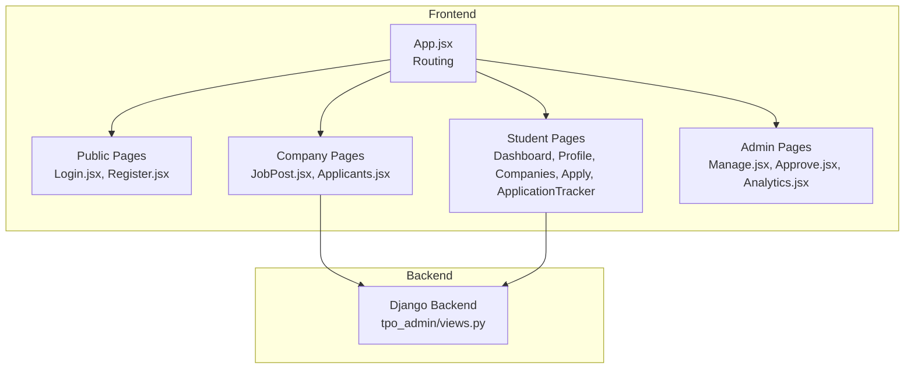
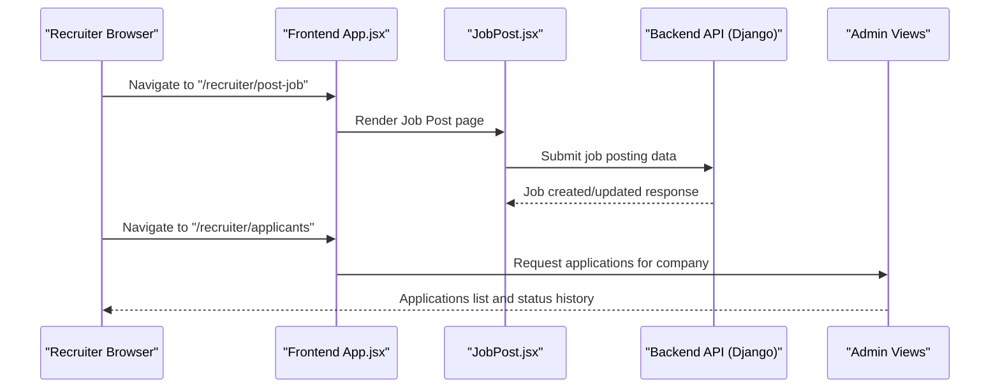
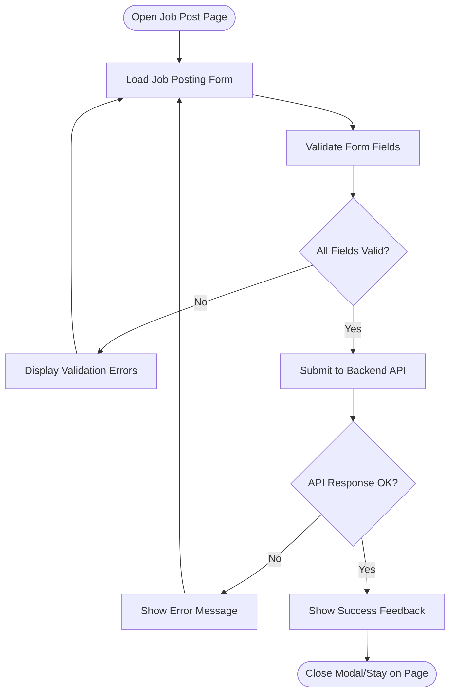
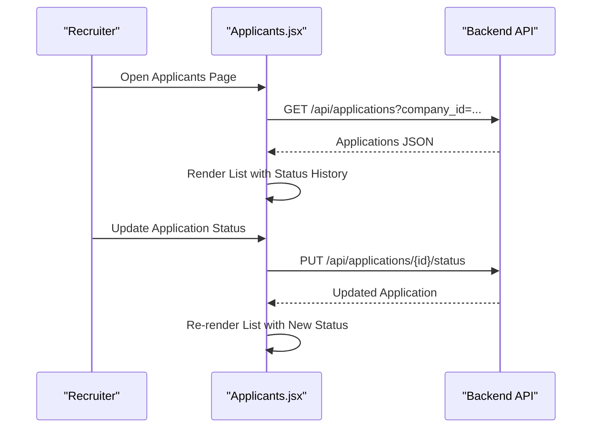
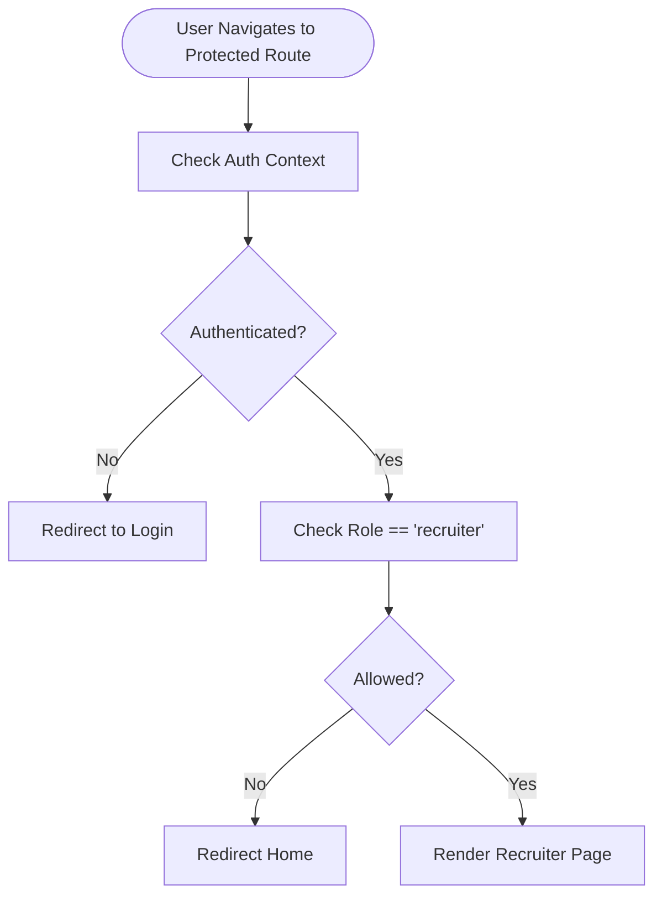
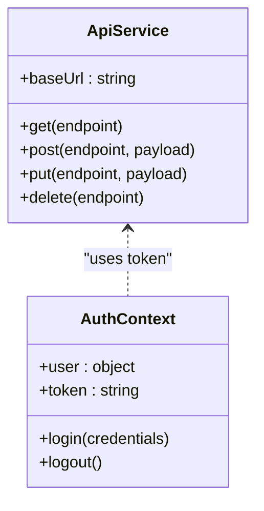
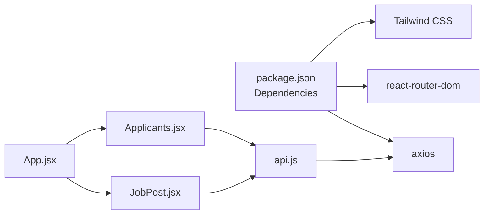
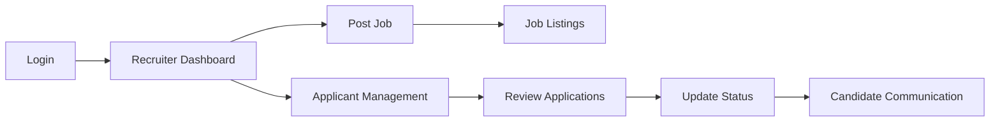

# Company/Recruiter Portal

<cite>
**Referenced Files in This Document**
- [App.jsx](file://frontend/src/App.jsx)
- [JobPost.jsx](file://frontend/src/Pages/Company/JobPost.jsx)
- [Applicants.jsx](file://frontend/src/Pages/Company/Applicants.jsx)
- [Login.jsx](file://frontend/src/Pages/Public/Login.jsx)
- [Register.jsx](file://frontend/src/Pages/Public/Register.jsx)
- [package.json](file://frontend/package.json)
- [api.js](file://frontend/src/Services/api.js)
- [AuthContext.jsx](file://frontend/src/Context/AuthContext.jsx)
- [Apply.jsx](file://frontend/src/Pages/Student/Apply.jsx)
- [ApplicationTracker.jsx](file://frontend/src/Pages/Student/ApplicationTracker.jsx)
- [Companies.jsx](file://frontend/src/Pages/Student/Companies.jsx)
- [Approve.jsx](file://frontend/src/Pages/TPOAdmin/Approve.jsx)
- [Manage.jsx](file://frontend/src/Pages/TPOAdmin/Manage.jsx)
- [views.py](file://backend/tpo_admin/views.py)
</cite>

## Table of Contents
1. [Introduction](#introduction)
2. [Project Structure](#project-structure)
3. [Core Components](#core-components)
4. [Architecture Overview](#architecture-overview)
5. [Detailed Component Analysis](#detailed-component-analysis)
6. [Dependency Analysis](#dependency-analysis)
7. [Performance Considerations](#performance-considerations)
8. [Troubleshooting Guide](#troubleshooting-guide)
9. [Conclusion](#conclusion)
10. [Appendices](#appendices)

## Introduction
This document describes the Company/Recruiter Portal features in the TPO Portal React application. It focuses on the job posting system, company information management, and the applicant management interface. It also covers component architecture, state management patterns, routing, and integration points with backend APIs. The documentation includes form handling patterns, user interaction flows, responsive design, error handling strategies, and accessibility considerations. The goal is to provide a clear understanding of the current implementation and highlight areas for enhancement to support a production-ready job posting and applicant management workflow.

## Project Structure
The frontend is a React application configured with Vite and Tailwind CSS. Routing is handled via react-router-dom. The application defines routes for public pages (login/register), student-facing pages, company/recruiter pages, and TPO admin pages. The Company/Recruiter area currently includes two pages: Job Post and Applicants. These pages are placeholders and require further development to implement job posting forms, validation, and applicant review interfaces.

**Diagram sources**
- [App.jsx:25-52](file://frontend/src/App.jsx#L25-L52)
- [Login.jsx](file://frontend/src/Pages/Public/Login.jsx)
- [Register.jsx](file://frontend/src/Pages/Public/Register.jsx)
- [JobPost.jsx:1-15](file://frontend/src/Pages/Company/JobPost.jsx#L1-L15)
- [Applicants.jsx:1-11](file://frontend/src/Pages/Company/Applicants.jsx#L1-L11)
- [Manage.jsx](file://frontend/src/Pages/TPOAdmin/Manage.jsx)
- [Approve.jsx](file://frontend/src/Pages/TPOAdmin/Approve.jsx)
- [views.py:1-10](file://backend/tpo_admin/views.py#L1-L10)

**Section sources**
- [App.jsx:1-55](file://frontend/src/App.jsx#L1-L55)
- [package.json:1-34](file://frontend/package.json#L1-L34)

## Core Components
- Recruiter Dashboard Page (Job Post): Placeholder page welcoming recruiters and indicating redirection success. It needs to host the job posting form and validation logic.
- Applicant Management Page: Placeholder page for viewing applicants and managing interactions. It requires integration with backend APIs to retrieve and update application statuses.
- Authentication and Navigation: Public login/register pages and routing configuration define the entry points and navigation structure for the recruiter portal.

Key responsibilities:
- Job Post page: Render form UI, validate inputs, and submit job data to backend APIs.
- Applicants page: Fetch and display applications, allow status updates, and facilitate communication with candidates.
- Routing: Define protected routes and navigation for recruiter workflows.

**Section sources**
- [JobPost.jsx:1-15](file://frontend/src/Pages/Company/JobPost.jsx#L1-L15)
- [Applicants.jsx:1-11](file://frontend/src/Pages/Company/Applicants.jsx#L1-L11)
- [App.jsx:41-44](file://frontend/src/App.jsx#L41-L44)

## Architecture Overview
The system follows a client-server architecture:
- Frontend (React): Handles UI rendering, state management, form validation, and API interactions.
- Backend (Django): Provides REST endpoints for company and application data, admin management, and drive approvals.

**Diagram sources**
- [App.jsx:41-44](file://frontend/src/App.jsx#L41-L44)
- [JobPost.jsx:1-15](file://frontend/src/Pages/Company/JobPost.jsx#L1-L15)
- [views.py:1-10](file://backend/tpo_admin/views.py#L1-L10)

## Detailed Component Analysis

### Recruiter Dashboard (Job Post)
Current state:
- Renders a welcome message and indicates successful redirect.
- Requires a form component for job posting, including company information and job details.
- Needs validation logic for mandatory fields and data types.
- Requires submission to backend endpoints for creating/updating job listings.

Recommended enhancements:
- Introduce a form component with controlled inputs for job details (role, location, CTC, deadline, eligibility criteria).
- Implement validation using a library or custom validators to ensure data integrity.
- Integrate with backend APIs to persist job postings and handle errors gracefully.
- Add real-time feedback for validation errors and submission status.

**Diagram sources**
- [JobPost.jsx:1-15](file://frontend/src/Pages/Company/JobPost.jsx#L1-L15)

**Section sources**
- [JobPost.jsx:1-15](file://frontend/src/Pages/Company/JobPost.jsx#L1-L15)

### Applicant Management (Applicants)
Current state:
- Displays a placeholder header and description.
- Requires integration with backend APIs to fetch applications for the logged-in company.
- Needs UI to display application details, status history, and actions to update status.

Recommended enhancements:
- Fetch applications for the current company using backend endpoints.
- Render a table/list of applications with status badges and action buttons.
- Implement status update handlers and real-time updates where applicable.
- Provide filtering/sorting capabilities for application lists.

**Diagram sources**
- [Applicants.jsx:1-11](file://frontend/src/Pages/Company/Applicants.jsx#L1-L11)
- [views.py:1-10](file://backend/tpo_admin/views.py#L1-L10)

**Section sources**
- [Applicants.jsx:1-11](file://frontend/src/Pages/Company/Applicants.jsx#L1-L11)

### Authentication and Navigation
- Public pages: Login and Register provide initial access for recruiters and students.
- Routing: App.jsx defines routes for public, student, company, and admin sections.
- Authentication context: AuthContext.jsx is present but empty; it should manage user session state and role-based routing.

Recommendations:
- Implement AuthContext to store user, role, and token.
- Protect routes by checking authentication and role before rendering pages.
- Redirect unauthenticated users to login and enforce role-based access to recruiter/admin pages.

**Diagram sources**
- [AuthContext.jsx:1-1](file://frontend/src/Context/AuthContext.jsx#L1-L1)
- [App.jsx:41-44](file://frontend/src/App.jsx#L41-L44)

**Section sources**
- [Login.jsx](file://frontend/src/Pages/Public/Login.jsx)
- [Register.jsx](file://frontend/src/Pages/Public/Register.jsx)
- [AuthContext.jsx:1-1](file://frontend/src/Context/AuthContext.jsx#L1-L1)
- [App.jsx:41-44](file://frontend/src/App.jsx#L41-L44)

### API Integration and Services
- API service: api.js is present but empty; it should encapsulate HTTP requests using axios.
- Dependencies: package.json includes axios for HTTP requests and react-router-dom for routing.

Recommendations:
- Implement API service methods for job posting, application retrieval, and status updates.
- Centralize error handling and response parsing.
- Use environment variables for base URLs and feature flags.

**Diagram sources**
- [api.js:1-1](file://frontend/src/Services/api.js#L1-L1)
- [AuthContext.jsx:1-1](file://frontend/src/Context/AuthContext.jsx#L1-L1)

**Section sources**
- [api.js:1-1](file://frontend/src/Services/api.js#L1-L1)
- [package.json:12-18](file://frontend/package.json#L12-L18)

### Student Application Workflow (Reference)
While not part of the recruiter portal, the student application flow demonstrates form handling and state management patterns that can inform the job posting form design:
- Multi-step form with controlled inputs and nested arrays (references).
- Local storage simulation for profile and application data.
- Conditional rendering and validation feedback.

These patterns can be adapted for the job posting form to ensure robustness and user experience.

**Section sources**
- [Apply.jsx:1-631](file://frontend/src/Pages/Student/Apply.jsx#L1-L631)
- [ApplicationTracker.jsx:21-96](file://frontend/src/Pages/Student/ApplicationTracker.jsx#L21-L96)

## Dependency Analysis
External dependencies:
- React and ReactDOM for UI rendering.
- react-router-dom for client-side routing.
- axios for HTTP requests.
- Tailwind CSS for styling.

Internal dependencies:
- App.jsx orchestrates routing and imports page components.
- Pages depend on shared services and contexts for API and auth.

Potential issues:
- Missing form components and services.
- Empty context and API files requiring implementation.
- Placeholder pages need dynamic data fetching and state updates.

**Diagram sources**
- [package.json:12-18](file://frontend/package.json#L12-L18)
- [App.jsx:14-16](file://frontend/src/App.jsx#L14-L16)
- [JobPost.jsx:1-15](file://frontend/src/Pages/Company/JobPost.jsx#L1-L15)
- [Applicants.jsx:1-11](file://frontend/src/Pages/Company/Applicants.jsx#L1-L11)
- [api.js:1-1](file://frontend/src/Services/api.js#L1-L1)

**Section sources**
- [package.json:12-18](file://frontend/package.json#L12-L18)
- [App.jsx:14-16](file://frontend/src/App.jsx#L14-L16)

## Performance Considerations
- Lazy loading: Defer heavy components until needed.
- Virtualization: For long applicant lists, consider virtualized lists.
- Debounced searches: If implementing filters, debounce input to reduce API calls.
- Caching: Cache company and job data to minimize repeated requests.
- Bundle optimization: Use tree-shaking and code splitting to reduce bundle size.

## Troubleshooting Guide
Common issues and resolutions:
- Authentication failures: Verify AuthContext stores token and user correctly; ensure protected routes check authentication before rendering.
- API errors: Implement centralized error handling in api.js; display user-friendly messages and retry logic where appropriate.
- Form validation errors: Provide inline validation feedback and prevent submission until all required fields are valid.
- Routing problems: Confirm routes are defined correctly in App.jsx and match navigation calls.
- Styling inconsistencies: Ensure Tailwind classes are applied consistently and media queries are used for responsiveness.

## Conclusion
The Company/Recruiter Portal currently provides basic routing and placeholder pages for job posting and applicant management. To achieve a production-ready solution, implement:
- A comprehensive job posting form with validation and backend integration.
- An applicant management interface with application retrieval, status updates, and communication tools.
- Robust authentication and authorization using AuthContext.
- Centralized API service with error handling and response normalization.
- Responsive design and accessibility improvements across all components.

## Appendices

### Recruiter Workflow Summary
- Login → Recruiter Dashboard → Post Job → View Applicants → Manage Applications → Communicate with Candidates

[No sources needed since this diagram shows conceptual workflow, not actual code structure]