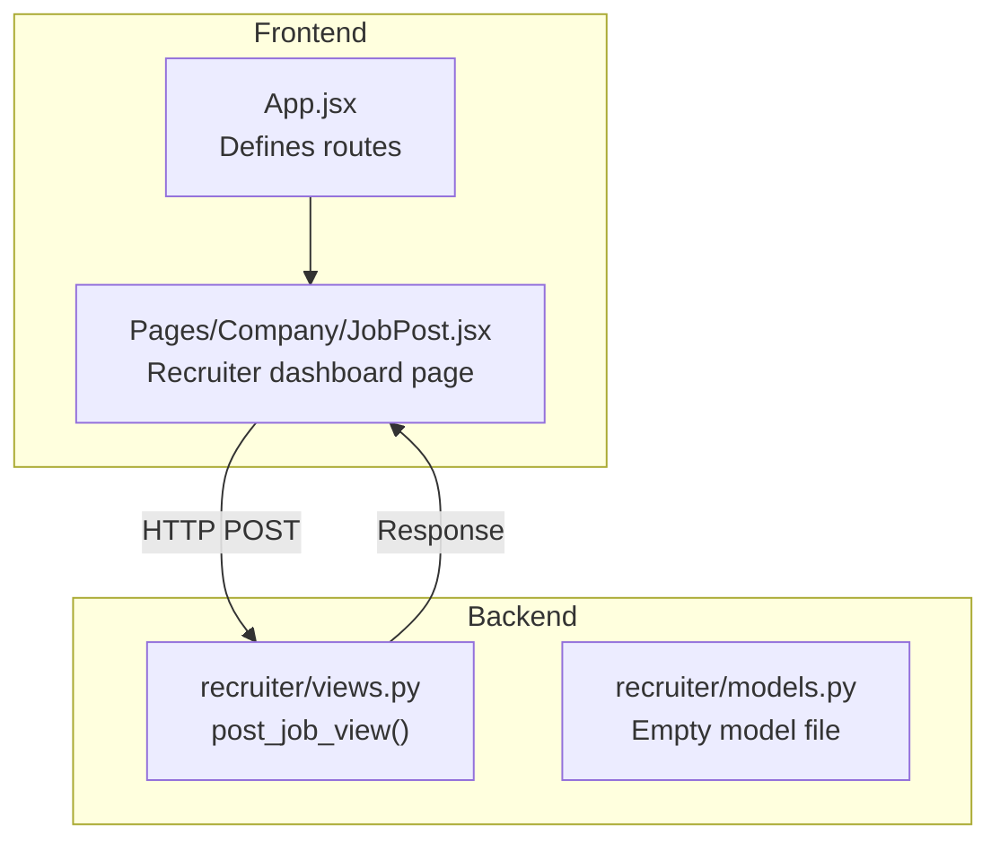
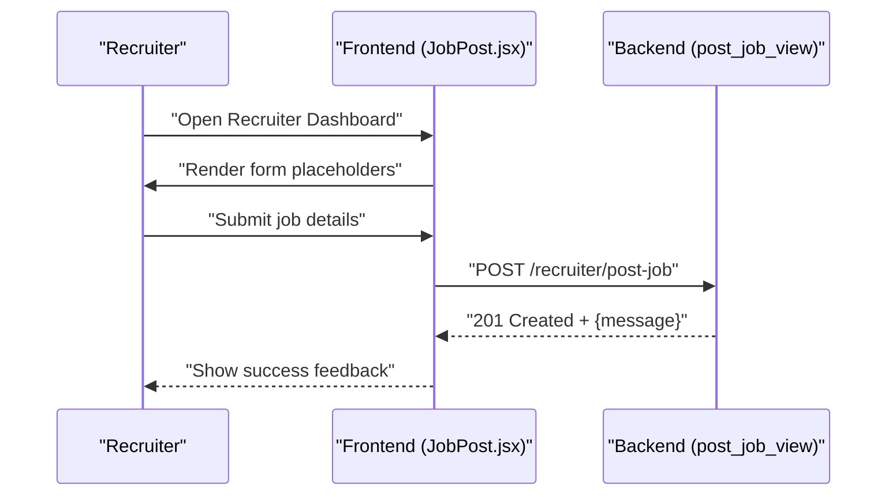
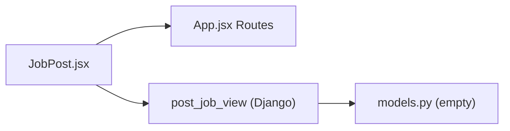

# Job Posting System

<cite>
**Referenced Files in This Document**
- [JobPost.jsx](file://frontend/src/Pages/Company/JobPost.jsx)
- [App.jsx](file://frontend/src/App.jsx)
- [views.py](file://backend/recruiter/views.py)
- [models.py](file://backend/recruiter/models.py)
</cite>

## Table of Contents
1. [Introduction](#introduction)
2. [Project Structure](#project-structure)
3. [Core Components](#core-components)
4. [Architecture Overview](#architecture-overview)
5. [Detailed Component Analysis](#detailed-component-analysis)
6. [Dependency Analysis](#dependency-analysis)
7. [Performance Considerations](#performance-considerations)
8. [Troubleshooting Guide](#troubleshooting-guide)
9. [Conclusion](#conclusion)

## Introduction
This document describes the Job Posting System component of the portal. It focuses on the recruiter-facing job creation workflow, including the current page structure, routing, and the backend endpoint for job posting. The document outlines the intended form fields, validation rules, submission processing, and integration points with the backend API. It also covers UI design considerations, responsive layout, accessibility, and error/success feedback mechanisms.

## Project Structure
The Job Posting System spans the frontend React application and the backend Django service. The frontend defines the recruiter dashboard page and routes, while the backend exposes a dedicated endpoint for job creation.

**Diagram sources**
- [App.jsx:25-51](file://frontend/src/App.jsx#L25-L51)
- [JobPost.jsx:3-14](file://frontend/src/Pages/Company/JobPost.jsx#L3-L14)
- [views.py:4-8](file://backend/recruiter/views.py#L4-L8)
- [models.py:1-4](file://backend/recruiter/models.py#L1-L4)

**Section sources**
- [App.jsx:25-51](file://frontend/src/App.jsx#L25-L51)
- [JobPost.jsx:3-14](file://frontend/src/Pages/Company/JobPost.jsx#L3-L14)
- [views.py:4-8](file://backend/recruiter/views.py#L4-L8)
- [models.py:1-4](file://backend/recruiter/models.py#L1-L4)

## Core Components
- Recruiter Dashboard Page: Presents the landing page for recruiters to post jobs. It currently displays a welcome message and a brief description of the job posting area.
- Routing: The frontend router maps the "/recruiter/post-job" path to the JobPost page.
- Backend Endpoint: The backend exposes a CSRF-exempt POST endpoint for job creation, returning a success message upon successful POST.

Key responsibilities:
- Frontend: Render the dashboard UI, collect user input, validate form data, and submit to the backend.
- Backend: Accept job creation requests and return appropriate HTTP responses.

**Section sources**
- [JobPost.jsx:3-14](file://frontend/src/Pages/Company/JobPost.jsx#L3-L14)
- [App.jsx:42-43](file://frontend/src/App.jsx#L42-L43)
- [views.py:4-8](file://backend/recruiter/views.py#L4-L8)

## Architecture Overview
The system follows a simple client-server pattern:
- The frontend renders the recruiter dashboard and collects job details.
- On submission, the frontend sends an HTTP POST request to the backend endpoint.
- The backend responds with a JSON message and status code.

**Diagram sources**
- [JobPost.jsx:3-14](file://frontend/src/Pages/Company/JobPost.jsx#L3-L14)
- [views.py:4-8](file://backend/recruiter/views.py#L4-L8)

## Detailed Component Analysis

### Recruiter Dashboard Page (JobPost)
- Purpose: Landing page for recruiters to post new jobs.
- Current behavior: Displays a heading, a success indicator, and a short description of the job posting area.
- Future enhancements: Integrate a form component, state management, validation, and submission logic.

UI considerations:
- Typography and spacing are handled via Tailwind classes.
- The page is wrapped in a padded container for readability.

Accessibility and responsiveness:
- Use semantic headings and concise text.
- Maintain sufficient color contrast and readable font sizes.
- Ensure interactive elements are keyboard accessible.

**Section sources**
- [JobPost.jsx:3-14](file://frontend/src/Pages/Company/JobPost.jsx#L3-L14)

### Routing (App.jsx)
- Defines the route for the recruiter’s job posting page.
- Ensures the "/recruiter/post-job" path renders the JobPost component.

Best practices:
- Keep route definitions centralized.
- Use descriptive paths aligned with role-based navigation.

**Section sources**
- [App.jsx:42-43](file://frontend/src/App.jsx#L42-L43)

### Backend Job Creation Endpoint (views.py)
- Endpoint: POST /recruiter/post-job
- Behavior:
  - On POST: Returns a success message with HTTP 201.
  - On GET: Returns a descriptive message with HTTP 200.
- Security: CSRF is disabled for this endpoint.

Notes:
- The endpoint currently returns a generic success message. In a production system, it should parse the request body, validate inputs, persist the job record, and return structured success/error responses.

**Section sources**
- [views.py:4-8](file://backend/recruiter/views.py#L4-L8)

### Backend Model Layer (models.py)
- The model file exists but is currently empty.
- Planning: Define a Job model with fields for company, role, location, CTC, deadlines, and other relevant attributes.

**Section sources**
- [models.py:1-4](file://backend/recruiter/models.py#L1-L4)

## Dependency Analysis
The Job Posting System has minimal runtime dependencies:
- Frontend depends on the router to render the dashboard page.
- The dashboard page depends on the backend endpoint for job creation.
- Backend depends on Django’s request/response handling.

**Diagram sources**
- [JobPost.jsx:3-14](file://frontend/src/Pages/Company/JobPost.jsx#L3-L14)
- [App.jsx:42-43](file://frontend/src/App.jsx#L42-L43)
- [views.py:4-8](file://backend/recruiter/views.py#L4-L8)
- [models.py:1-4](file://backend/recruiter/models.py#L1-L4)

**Section sources**
- [App.jsx:42-43](file://frontend/src/App.jsx#L42-L43)
- [JobPost.jsx:3-14](file://frontend/src/Pages/Company/JobPost.jsx#L3-L14)
- [views.py:4-8](file://backend/recruiter/views.py#L4-L8)
- [models.py:1-4](file://backend/recruiter/models.py#L1-L4)

## Performance Considerations
- Network latency: Minimize payload size by sending only required fields.
- Validation: Perform client-side validation to reduce unnecessary server requests.
- Caching: Avoid caching sensitive form data; clear form state on success.
- Rendering: Keep the dashboard lightweight until the form component is integrated.

## Troubleshooting Guide
Common issues and resolutions:
- Empty backend response: Ensure the frontend sends a proper POST request body and handles CSRF appropriately.
- Incorrect routing: Verify the route definition for "/recruiter/post-job" matches the frontend navigation.
- Model persistence: Confirm that the backend creates a Job model and persists data before responding.

Debugging tips:
- Inspect network requests in the browser’s developer tools.
- Log request payloads and response statuses on the backend.
- Validate form state before submission.

**Section sources**
- [views.py:4-8](file://backend/recruiter/views.py#L4-L8)
- [App.jsx:42-43](file://frontend/src/App.jsx#L42-L43)

## Conclusion
The Job Posting System currently provides a basic recruiter dashboard page and a backend endpoint for job creation. To complete the system, integrate a form component with robust validation, implement state management for form inputs, and connect the frontend to the backend with structured request/response handling. Plan the backend model for job records and enhance the endpoint to support full CRUD operations. Focus on responsive design, accessibility, and clear success/error feedback to deliver a smooth user experience.