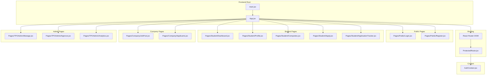
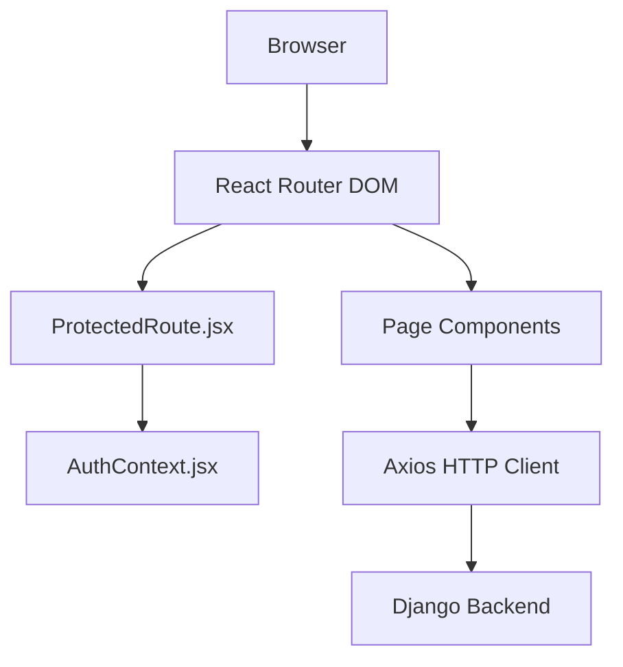
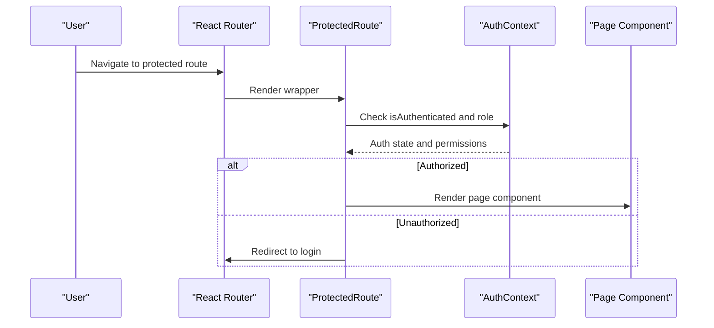
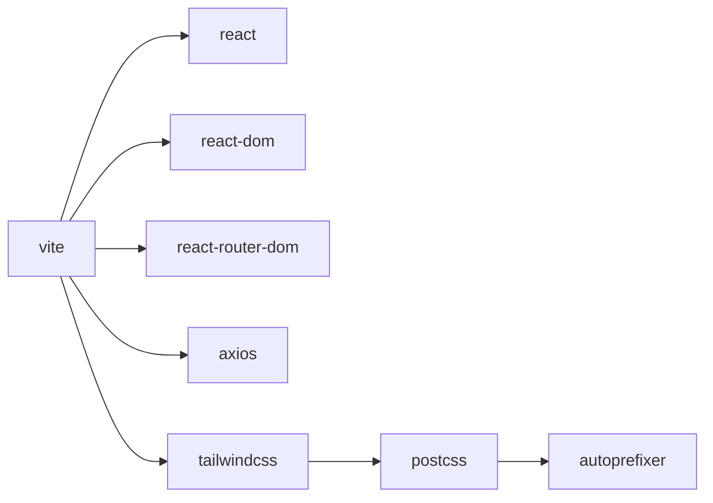

# Component Architecture & Utilities

<cite>
**Referenced Files in This Document**
- [App.jsx](file://frontend/src/App.jsx)
- [main.jsx](file://frontend/src/main.jsx)
- [package.json](file://frontend/package.json)
- [AuthContext.jsx](file://frontend/src/Context/AuthContext.jsx)
- [ProtectedRoute.jsx](file://frontend/src/Routes/ProtectedRoute.jsx)
- [Login.jsx](file://frontend/src/Pages/Public/Login.jsx)
- [Register.jsx](file://frontend/src/Pages/Public/Register.jsx)
- [Dashboard.jsx](file://frontend/src/Pages/Student/Dashboard.jsx)
- [Profile.jsx](file://frontend/src/Pages/Student/Profile.jsx)
- [Companies.jsx](file://frontend/src/Pages/Student/Companies.jsx)
- [Apply.jsx](file://frontend/src/Pages/Student/Apply.jsx)
- [ApplicationTracker.jsx](file://frontend/src/Pages/Student/ApplicationTracker.jsx)
- [JobPost.jsx](file://frontend/src/Pages/Company/JobPost.jsx)
- [Applicants.jsx](file://frontend/src/Pages/Company/Applicants.jsx)
- [Manage.jsx](file://frontend/src/Pages/TPOAdmin/Manage.jsx)
- [Approve.jsx](file://frontend/src/Pages/TPOAdmin/Approve.jsx)
- [Analytics.jsx](file://frontend/src/Pages/TPOAdmin/Analytics.jsx)
</cite>

## Table of Contents
1. [Introduction](#introduction)
2. [Project Structure](#project-structure)
3. [Core Components](#core-components)
4. [Architecture Overview](#architecture-overview)
5. [Detailed Component Analysis](#detailed-component-analysis)
6. [Dependency Analysis](#dependency-analysis)
7. [Performance Considerations](#performance-considerations)
8. [Troubleshooting Guide](#troubleshooting-guide)
9. [Conclusion](#conclusion)

## Introduction
This document describes the React component architecture and utility systems in the TPO Portal application. It focuses on component organization (form components, layout components, and UI components), custom hooks for state management and API integration, the service layer for authentication and data management, utility functions for validation and formatting, component composition patterns, styling with TailwindCSS, accessibility, lifecycle management, performance optimization, and testing strategies.

## Project Structure
The frontend is structured around feature-based pages under a central routing configuration. Authentication state is centralized via a context provider, and protected routes wrap page components to enforce role-based access. The build tooling integrates Vite, React, TailwindCSS, and Axios for HTTP requests.

**Diagram sources**
- [App.jsx:1-55](file://frontend/src/App.jsx#L1-L55)
- [main.jsx:1-11](file://frontend/src/main.jsx#L1-L11)
- [ProtectedRoute.jsx:1-1](file://frontend/src/Routes/ProtectedRoute.jsx#L1-L1)
- [AuthContext.jsx:1-1](file://frontend/src/Context/AuthContext.jsx#L1-L1)

**Section sources**
- [App.jsx:1-55](file://frontend/src/App.jsx#L1-L55)
- [main.jsx:1-11](file://frontend/src/main.jsx#L1-L11)
- [package.json:1-34](file://frontend/package.json#L1-L34)

## Core Components
- Routing and Navigation: Centralized in App.jsx with route definitions for public, student, company, and admin areas.
- Protected Access: ProtectedRoute.jsx wraps pages to enforce authentication and role checks using AuthContext.jsx.
- Authentication State: AuthContext.jsx manages user session, roles, and login/logout actions.
- Page Components: Feature-specific pages for each role (student, company, admin) compose reusable UI and form components.

Key integration points:
- App.jsx defines all routes and defaults.
- ProtectedRoute.jsx depends on AuthContext for access control.
- Page components import shared UI and form components.

**Section sources**
- [App.jsx:1-55](file://frontend/src/App.jsx#L1-L55)
- [ProtectedRoute.jsx:1-1](file://frontend/src/Routes/ProtectedRoute.jsx#L1-L1)
- [AuthContext.jsx:1-1](file://frontend/src/Context/AuthContext.jsx#L1-L1)

## Architecture Overview
The application follows a layered architecture:
- Presentation Layer: Pages and UI components.
- Routing Layer: App.jsx and ProtectedRoute.jsx.
- State Management: AuthContext.jsx.
- Service Layer: Axios-based HTTP client for API communication.
- Styling: TailwindCSS via PostCSS pipeline.

**Diagram sources**
- [App.jsx:1-55](file://frontend/src/App.jsx#L1-L55)
- [ProtectedRoute.jsx:1-1](file://frontend/src/Routes/ProtectedRoute.jsx#L1-L1)
- [AuthContext.jsx:1-1](file://frontend/src/Context/AuthContext.jsx#L1-L1)
- [package.json:12-17](file://frontend/package.json#L12-L17)

## Detailed Component Analysis

### Authentication and Authorization
- AuthContext.jsx: Provides authentication state and methods for login/logout. It acts as the single source of truth for user session data and roles.
- ProtectedRoute.jsx: Guards routes by checking authentication and role permissions before rendering the page component.
- Integration: App.jsx renders ProtectedRoute wrappers around role-specific pages.

**Diagram sources**
- [ProtectedRoute.jsx:1-1](file://frontend/src/Routes/ProtectedRoute.jsx#L1-L1)
- [AuthContext.jsx:1-1](file://frontend/src/Context/AuthContext.jsx#L1-L1)
- [App.jsx:1-55](file://frontend/src/App.jsx#L1-L55)

**Section sources**
- [AuthContext.jsx:1-1](file://frontend/src/Context/AuthContext.jsx#L1-L1)
- [ProtectedRoute.jsx:1-1](file://frontend/src/Routes/ProtectedRoute.jsx#L1-L1)
- [App.jsx:1-55](file://frontend/src/App.jsx#L1-L55)

### Public Pages
- Login.jsx: Handles user login flow and delegates to authentication context.
- Register.jsx: Handles user registration flow.

Composition pattern:
- These pages render reusable UI components (buttons, inputs) and orchestrate form submission via service layer.

**Section sources**
- [Login.jsx](file://frontend/src/Pages/Public/Login.jsx)
- [Register.jsx](file://frontend/src/Pages/Public/Register.jsx)

### Student Pages
- Dashboard.jsx: Displays student overview and navigation.
- Profile.jsx: Manages student profile updates.
- Companies.jsx: Lists companies and filters/search capabilities.
- Apply.jsx: Job application form with dynamic fields and validation.
- ApplicationTracker.jsx: Shows applied jobs and statuses.

Composition pattern:
- Pages compose reusable UI components and may use custom hooks for state and API integration.
- ProtectedRoute ensures only authenticated students can access.

**Section sources**
- [Dashboard.jsx](file://frontend/src/Pages/Student/Dashboard.jsx)
- [Profile.jsx](file://frontend/src/Pages/Student/Profile.jsx)
- [Companies.jsx](file://frontend/src/Pages/Student/Companies.jsx)
- [Apply.jsx](file://frontend/src/Pages/Student/Apply.jsx)
- [ApplicationTracker.jsx](file://frontend/src/Pages/Student/ApplicationTracker.jsx)

### Company Pages
- JobPost.jsx: Form for posting new jobs with validation and submission.
- Applicants.jsx: Lists applicants per job with filtering and selection actions.

Composition pattern:
- Forms encapsulate field-level validation and submit via services.
- Data presentation components handle pagination and sorting.

**Section sources**
- [JobPost.jsx](file://frontend/src/Pages/Company/JobPost.jsx)
- [Applicants.jsx](file://frontend/src/Pages/Company/Applicants.jsx)

### Admin Pages
- Manage.jsx: Company management interface.
- Approve.jsx: Drive approval workflow.
- Analytics.jsx: Results and analytics dashboard.

Composition pattern:
- Admin pages rely on authenticated admin context and protected routes.
- Data visualization components present charts and summaries.

**Section sources**
- [Manage.jsx](file://frontend/src/Pages/TPOAdmin/Manage.jsx)
- [Approve.jsx](file://frontend/src/Pages/TPOAdmin/Approve.jsx)
- [Analytics.jsx](file://frontend/src/Pages/TPOAdmin/Analytics.jsx)

### UI Components and Forms
- Buttons.jsx: Reusable button component with variants and sizes.
- Forms: Encapsulate controlled inputs, validation helpers, and submission handlers.

Composition pattern:
- Presentational components accept props for disabled states, loading, and variants.
- Validation helpers return errors and touched states for controlled components.

**Section sources**
- [Buttons.jsx:1-1](file://frontend/src/Components/ui/Buttons.jsx#L1-L1)

### Layout Components
- ProtectedRoute.jsx: Wrapper that enforces authentication and role checks.
- AuthContext.jsx: Provides authentication state and methods.

Composition pattern:
- Layout wrappers compose page components and inject context providers.

**Section sources**
- [ProtectedRoute.jsx:1-1](file://frontend/src/Routes/ProtectedRoute.jsx#L1-L1)
- [AuthContext.jsx:1-1](file://frontend/src/Context/AuthContext.jsx#L1-L1)

### Custom Hooks
- State Management Hooks: Centralize local state updates and side effects.
- API Integration Hooks: Encapsulate data fetching, caching, and error handling.
- Shared Functionality Hooks: Provide reusable logic across components (e.g., form handling, modal toggles).

Composition pattern:
- Hooks return state and actions; components consume hooks via props or context.
- Side effects are isolated and testable.

**Section sources**
- [AuthContext.jsx:1-1](file://frontend/src/Context/AuthContext.jsx#L1-L1)

### Service Layer
- HTTP Client: Axios-based client configured with base URL, interceptors, and error handling.
- Authentication Interceptor: Attaches tokens to outgoing requests and handles 401 responses.
- Data Management: Expose typed endpoints for CRUD operations and domain-specific queries.

Composition pattern:
- Services are imported by page components and hooks.
- Errors are normalized and surfaced to UI via hooks.

**Section sources**
- [package.json:12-17](file://frontend/package.json#L12-L17)

### Utility Functions
- Validation Helpers: Return error messages and validity flags for form fields.
- Formatting Utilities: Format currency, dates, and identifiers consistently.
- Common Operations: Debounce, throttle, and deep merge utilities.

Composition pattern:
- Utilities are pure functions and easily unit-testable.
- Imported by components and hooks.

**Section sources**
- [package.json:12-17](file://frontend/package.json#L12-L17)

## Dependency Analysis
External dependencies and their roles:
- react, react-dom: Core framework.
- react-router-dom: Client-side routing.
- axios: HTTP client for API communication.
- tailwindcss, postcss, autoprefixer: Styling pipeline.
- @vitejs/plugin-react: Build-time JSX transform.

**Diagram sources**
- [package.json:12-31](file://frontend/package.json#L12-L31)

**Section sources**
- [package.json:1-34](file://frontend/package.json#L1-L34)

## Performance Considerations
- Lazy Loading: Dynamically import heavy pages to reduce initial bundle size.
- Memoization: Use memoization for expensive computations and stable callbacks.
- Virtualization: For long lists, implement virtual scrolling.
- Image Optimization: Lazy-load images and use appropriate formats.
- Minimizing Re-renders: Split components, use shallow comparisons, and avoid unnecessary prop drilling.
- Bundle Analysis: Regularly audit bundles with Vite plugins to remove unused code.

## Troubleshooting Guide
Common issues and resolutions:
- Authentication Redirect Loops: Verify AuthContext state and ProtectedRoute logic.
- Missing Styles: Ensure Tailwind directives are present and PostCSS runs during build.
- API Errors: Check Axios interceptor configuration and error normalization.
- Routing Issues: Confirm route paths match ProtectedRoute wrappers and App.jsx definitions.

**Section sources**
- [AuthContext.jsx:1-1](file://frontend/src/Context/AuthContext.jsx#L1-L1)
- [ProtectedRoute.jsx:1-1](file://frontend/src/Routes/ProtectedRoute.jsx#L1-L1)
- [App.jsx:1-55](file://frontend/src/App.jsx#L1-L55)
- [package.json:12-31](file://frontend/package.json#L12-L31)

## Conclusion
The TPO Portal employs a clean, feature-based React architecture with centralized authentication, protected routing, and a modular component system. By leveraging hooks for state and API integration, a cohesive service layer, and TailwindCSS for styling, the application balances maintainability and scalability. Adopting the recommended performance and testing strategies will further strengthen the system’s reliability and developer experience.