# Frontend Features

<cite>
**Referenced Files in This Document**
- [App.jsx](file://frontend/src/App.jsx)
- [main.jsx](file://frontend/src/main.jsx)
- [package.json](file://frontend/package.json)
- [vite.config.js](file://frontend/vite.config.js)
- [Login.jsx](file://frontend/src/Pages/Public/Login.jsx)
- [Register.jsx](file://frontend/src/Pages/Public/Register.jsx)
- [Dashboard.jsx](file://frontend/src/Pages/Student/Dashboard.jsx)
- [Companies.jsx](file://frontend/src/Pages/Student/Companies.jsx)
- [Profile.jsx](file://frontend/src/Pages/Student/Profile.jsx)
- [Apply.jsx](file://frontend/src/Pages/Student/Apply.jsx)
- [ApplicationTracker.jsx](file://frontend/src/Pages/Student/ApplicationTracker.jsx)
- [JobPost.jsx](file://frontend/src/Pages/Company/JobPost.jsx)
- [Applicants.jsx](file://frontend/src/Pages/Company/Applicants.jsx)
</cite>

## Table of Contents
1. [Introduction](#introduction)
2. [Project Structure](#project-structure)
3. [Core Components](#core-components)
4. [Architecture Overview](#architecture-overview)
5. [Detailed Component Analysis](#detailed-component-analysis)
6. [Dependency Analysis](#dependency-analysis)
7. [Performance Considerations](#performance-considerations)
8. [Troubleshooting Guide](#troubleshooting-guide)
9. [Conclusion](#conclusion)
10. [Appendices](#appendices)

## Introduction
This document describes the frontend features of the TPO Portal React application. It focuses on the multi-role user interfaces for students, recruiters (companies), and administrators, covering component architecture, state management patterns, routing, form handling, API integration, responsive design, reusability, and UX flows from registration to portal usage. Accessibility and cross-browser compatibility considerations are also addressed.

## Project Structure
The frontend is a Vite-powered React application with:
- Routing via react-router-dom
- Styling via TailwindCSS (configured through @tailwindcss/vite)
- Minimal external dependencies (axios is present but not used in the current codebase)
- Pages organized by role under src/Pages

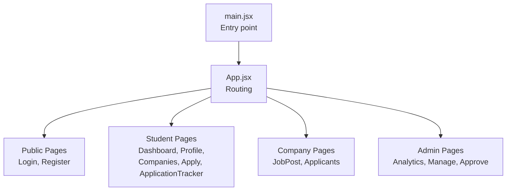

**Diagram sources**
- [main.jsx:1-11](file://frontend/src/main.jsx#L1-L11)
- [App.jsx:1-55](file://frontend/src/App.jsx#L1-L55)

**Section sources**
- [main.jsx:1-11](file://frontend/src/main.jsx#L1-L11)
- [App.jsx:1-55](file://frontend/src/App.jsx#L1-L55)
- [package.json:12-32](file://frontend/package.json#L12-L32)
- [vite.config.js:1-9](file://frontend/vite.config.js#L1-L9)

## Core Components
- Routing and navigation are centralized in App.jsx with route guards implicitly handled by redirecting to role-specific dashboards after login.
- Authentication state is persisted in localStorage (role, isLoggedIn, token, user) and cleared on logout.
- Public pages (Login, Register) provide role selection and integrate with backend authentication endpoints.
- Student dashboard aggregates profile completion, application statistics, upcoming drives, and quick actions.
- Company pages currently serve as placeholders for future job posting and applicant management.
- Admin pages are placeholders for analytics, company management, and drive approvals.

Key patterns:
- Inline styles are used for most components; Tailwind utility classes are present but not consistently applied.
- LocalStorage is used for persistence of user profiles, applications, and partial application data.
- Form handling uses controlled components with useState and event handlers.

**Section sources**
- [App.jsx:25-52](file://frontend/src/App.jsx#L25-L52)
- [Login.jsx:17-55](file://frontend/src/Pages/Public/Login.jsx#L17-L55)
- [Register.jsx:20-40](file://frontend/src/Pages/Public/Register.jsx#L20-L40)
- [Dashboard.jsx:22-71](file://frontend/src/Pages/Student/Dashboard.jsx#L22-L71)
- [Companies.jsx:25-156](file://frontend/src/Pages/Student/Companies.jsx#L25-L156)
- [Profile.jsx:65-94](file://frontend/src/Pages/Student/Profile.jsx#L65-L94)
- [Apply.jsx:50-69](file://frontend/src/Pages/Student/Apply.jsx#L50-L69)
- [ApplicationTracker.jsx:21-136](file://frontend/src/Pages/Student/ApplicationTracker.jsx#L21-L136)

## Architecture Overview
The frontend follows a client-side routing model with role-based navigation. Authentication is handled via a login form that posts credentials to backend endpoints and stores tokens and user metadata in localStorage. Students primarily interact with job discovery, application submission, and tracking. Recruiters and admins have placeholder pages awaiting backend integration.

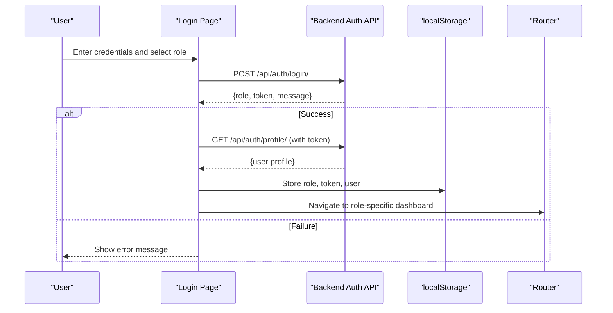

**Diagram sources**
- [Login.jsx:17-55](file://frontend/src/Pages/Public/Login.jsx#L17-L55)

**Section sources**
- [Login.jsx:17-55](file://frontend/src/Pages/Public/Login.jsx#L17-L55)
- [App.jsx:25-52](file://frontend/src/App.jsx#L25-L52)

## Detailed Component Analysis

### Public Authentication Pages
- Login.jsx
  - Controlled form with role selection (student/recruiter/admin).
  - Posts to backend login endpoint and fetches profile with token.
  - Stores role, token, and user in localStorage; navigates to role-specific route.
  - Error handling via try/catch and alert messages.
- Register.jsx
  - Controlled form for new user registration.
  - Posts to backend register endpoint and redirects to login on success.

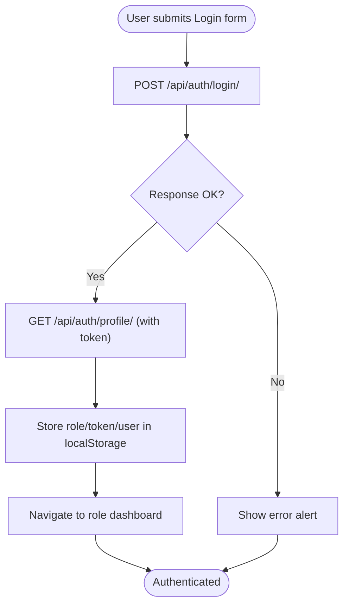

**Diagram sources**
- [Login.jsx:17-55](file://frontend/src/Pages/Public/Login.jsx#L17-L55)

**Section sources**
- [Login.jsx:1-160](file://frontend/src/Pages/Public/Login.jsx#L1-L160)
- [Register.jsx:1-172](file://frontend/src/Pages/Public/Register.jsx#L1-L172)

### Student Dashboard
- Loads user profile from localStorage on mount.
- Aggregates application stats, recent applications, upcoming drives, and profile completion.
- Provides quick action buttons to navigate to profile, companies, and applications.
- Logout clears all auth-related localStorage entries and returns to login.

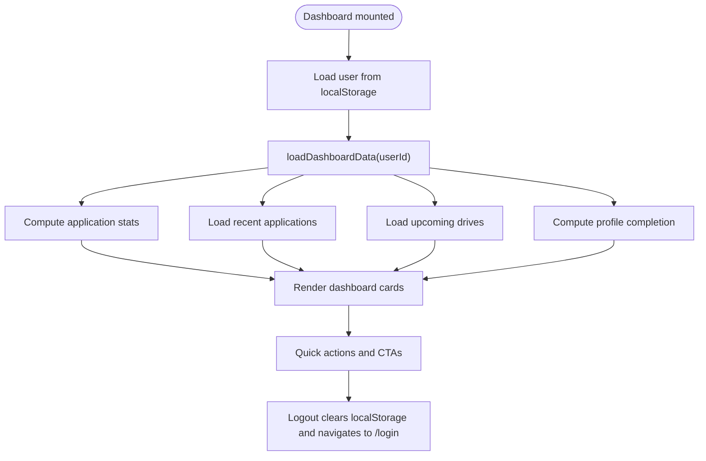

**Diagram sources**
- [Dashboard.jsx:22-71](file://frontend/src/Pages/Student/Dashboard.jsx#L22-L71)

**Section sources**
- [Dashboard.jsx:1-456](file://frontend/src/Pages/Student/Dashboard.jsx#L1-L456)

### Student Companies Browser
- Displays a grid of companies with logos, roles, locations, CTC, deadlines, and selection rounds.
- Supports search by name/role/skill and filtering by job type, CTC range, and eligibility toggle.
- Clicking a company opens a modal with detailed information and an apply button.
- Logout clears localStorage and navigates to login.

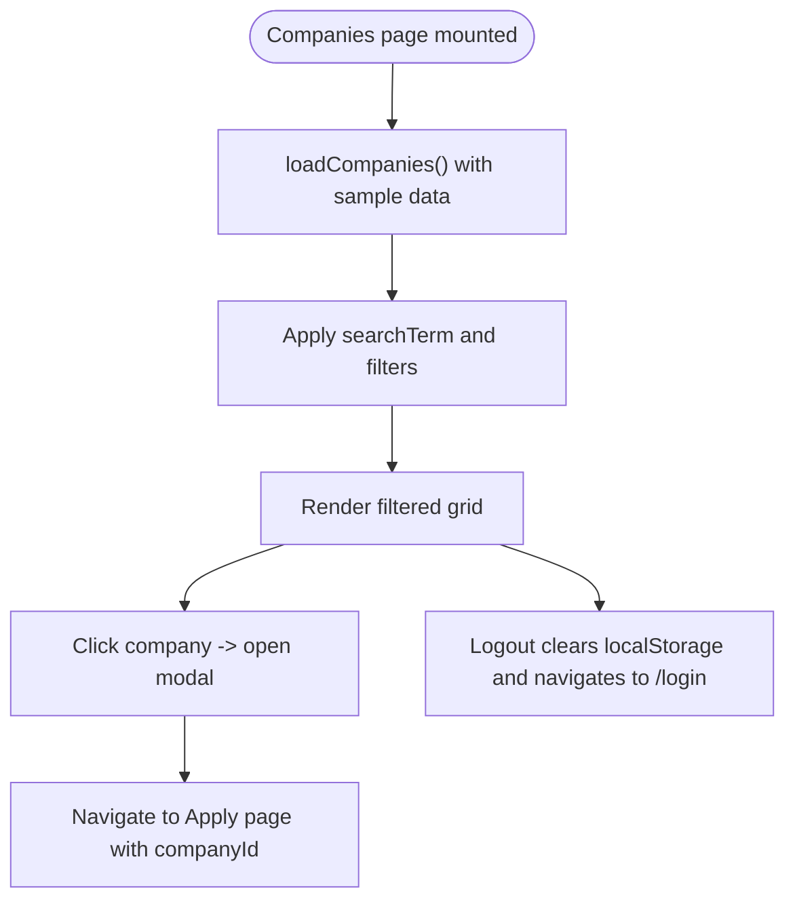

**Diagram sources**
- [Companies.jsx:25-156](file://frontend/src/Pages/Student/Companies.jsx#L25-L156)

**Section sources**
- [Companies.jsx:1-646](file://frontend/src/Pages/Student/Companies.jsx#L1-L646)

### Student Profile Management
- Tabbed interface for personal info, education, skills, certifications, projects, and work experience.
- Controlled inputs for editing; saves to localStorage under profile_{userId}.
- Supports adding/removing skills, certifications, projects, and work experiences.
- File upload fields for resume and grade card (UI present; actual upload logic not implemented).

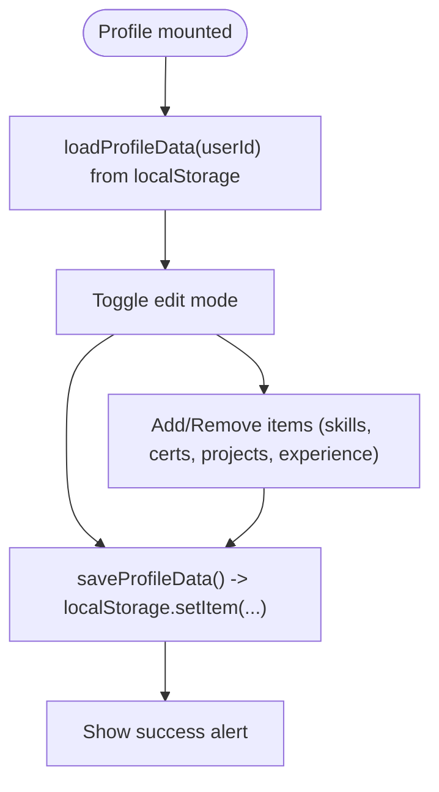

**Diagram sources**
- [Profile.jsx:65-94](file://frontend/src/Pages/Student/Profile.jsx#L65-L94)

**Section sources**
- [Profile.jsx:1-800](file://frontend/src/Pages/Student/Profile.jsx#L1-L800)

### Student Application Flow (Multi-step)
- Multi-step wizard with four steps: Verify Profile, Application Details, References, Review & Submit.
- Verifies profile completeness and eligibility against company criteria.
- Collects preferences (location, CTC, joining date), cover letter, additional info, and optional references.
- Submits application by saving to localStorage and displaying a success screen with navigation options.

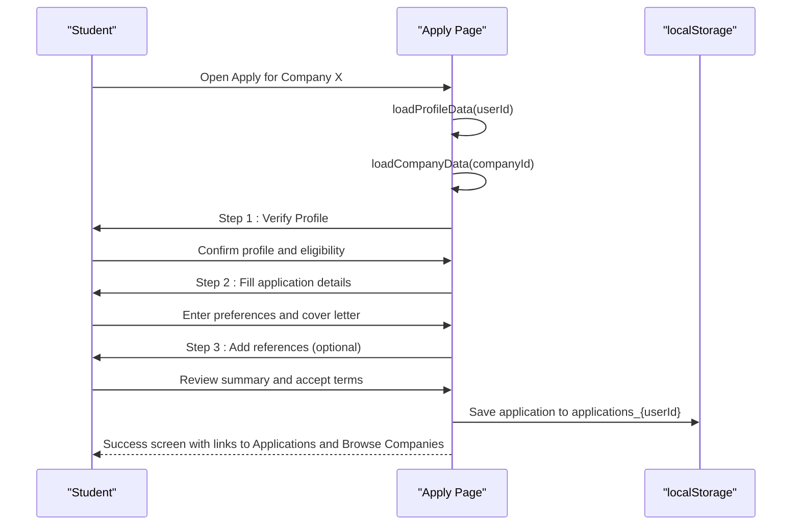

**Diagram sources**
- [Apply.jsx:50-69](file://frontend/src/Pages/Student/Apply.jsx#L50-L69)
- [Apply.jsx:160-180](file://frontend/src/Pages/Student/Apply.jsx#L160-L180)

**Section sources**
- [Apply.jsx:1-800](file://frontend/src/Pages/Student/Apply.jsx#L1-L800)

### Student Application Tracker
- Loads applications from localStorage and augments with sample data.
- Displays status cards and a filterable timeline of application statuses.
- Shows detailed modal with status history, next steps, and application metadata.
- Provides navigation back to dashboard and company browser.

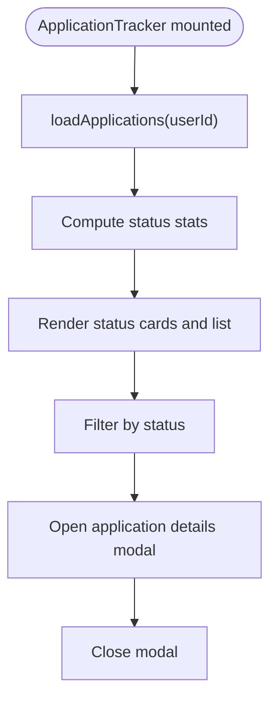

**Diagram sources**
- [ApplicationTracker.jsx:21-136](file://frontend/src/Pages/Student/ApplicationTracker.jsx#L21-L136)

**Section sources**
- [ApplicationTracker.jsx:1-570](file://frontend/src/Pages/Student/ApplicationTracker.jsx#L1-L570)

### Company Pages (Recruiter)
- JobPost.jsx: Placeholder page welcoming recruiters and indicating future job posting capabilities.
- Applicants.jsx: Placeholder page for viewing applicants.

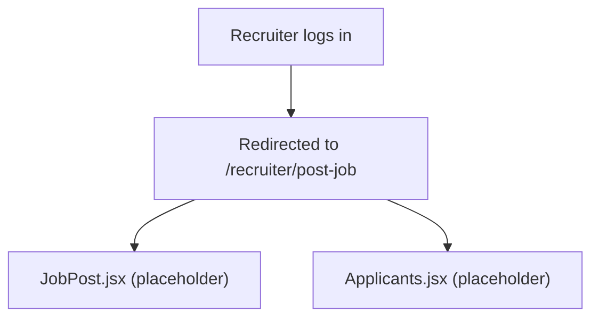

**Diagram sources**
- [App.jsx:41-44](file://frontend/src/App.jsx#L41-L44)
- [JobPost.jsx:1-15](file://frontend/src/Pages/Company/JobPost.jsx#L1-L15)
- [Applicants.jsx:1-11](file://frontend/src/Pages/Company/Applicants.jsx#L1-L11)

**Section sources**
- [App.jsx:41-44](file://frontend/src/App.jsx#L41-L44)
- [JobPost.jsx:1-15](file://frontend/src/Pages/Company/JobPost.jsx#L1-L15)
- [Applicants.jsx:1-11](file://frontend/src/Pages/Company/Applicants.jsx#L1-L11)

### Admin Pages (TPO Admin)
- Analytics.jsx: Placeholder for analytics dashboard.
- Manage.jsx: Placeholder for managing companies.
- Approve.jsx: Placeholder for approving drives.

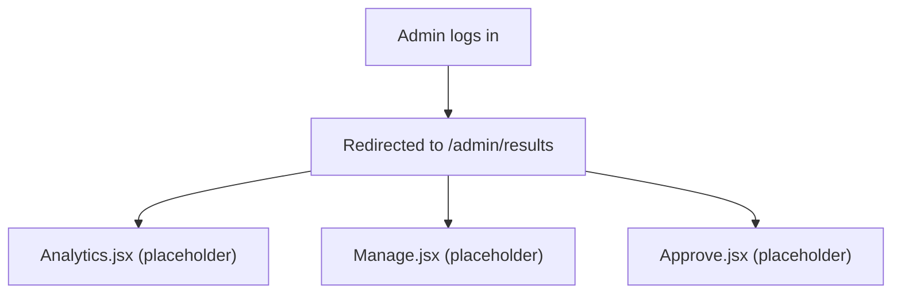

**Diagram sources**
- [App.jsx:45-49](file://frontend/src/App.jsx#L45-L49)

**Section sources**
- [App.jsx:45-49](file://frontend/src/App.jsx#L45-L49)

## Dependency Analysis
- Routing: react-router-dom defines routes and navigations.
- Styling: TailwindCSS configured via @tailwindcss/vite plugin; utility classes are present but not consistently used across components.
- HTTP: axios is declared but not used; fetch is used for authentication and application persistence.
- Build: Vite manages bundling and dev server.

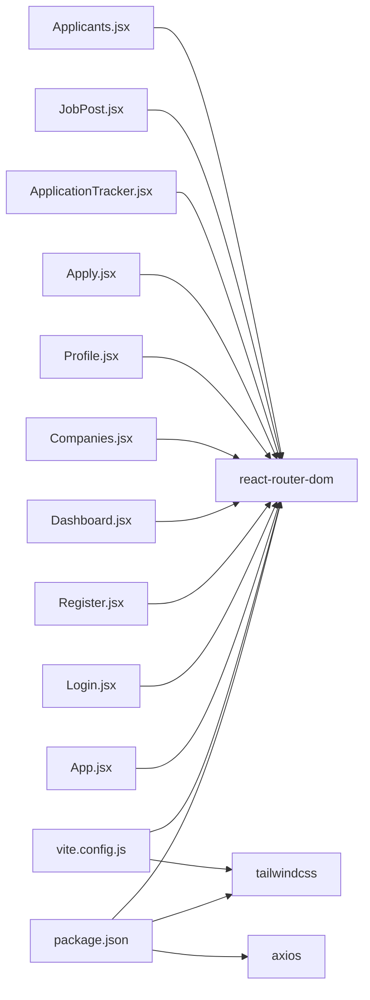

**Diagram sources**
- [package.json:12-32](file://frontend/package.json#L12-L32)
- [vite.config.js:1-9](file://frontend/vite.config.js#L1-L9)
- [App.jsx:1-55](file://frontend/src/App.jsx#L1-L55)

**Section sources**
- [package.json:12-32](file://frontend/package.json#L12-L32)
- [vite.config.js:1-9](file://frontend/vite.config.js#L1-L9)
- [App.jsx:1-55](file://frontend/src/App.jsx#L1-L55)

## Performance Considerations
- LocalStorage usage for profile and applications avoids network requests during browsing but can lead to large payloads; consider pagination or server-side storage for scalability.
- Inline styles are used extensively; extracting reusable styled components and adopting Tailwind utilities could improve maintainability and reduce render overhead.
- The application uses a single-page architecture; lazy-loading route components would reduce initial bundle size.

## Troubleshooting Guide
Common issues and remedies:
- Login failures: Check backend endpoints and network connectivity; ensure token and user are stored in localStorage.
- Navigation loops: Verify role-based redirects and localStorage presence for role/isLoggedIn/token.
- Form submission errors: Confirm localStorage availability and that required profile sections are filled before applying.
- Styling inconsistencies: Prefer Tailwind utility classes over inline styles for consistency and responsiveness.

**Section sources**
- [Login.jsx:51-55](file://frontend/src/Pages/Public/Login.jsx#L51-L55)
- [Register.jsx:36-40](file://frontend/src/Pages/Public/Register.jsx#L36-L40)
- [Apply.jsx:160-180](file://frontend/src/Pages/Student/Apply.jsx#L160-L180)

## Conclusion
The TPO Portal frontend provides a functional, role-based interface with clear navigation and state persistence via localStorage. While the UI is basic and relies on inline styles, the routing and form handling patterns are straightforward and extensible. Adopting Tailwind utilities, implementing lazy-loaded routes, and integrating backend APIs would significantly enhance maintainability, performance, and user experience.

## Appendices

### User Experience Flow (End-to-End)
- Registration: New users complete the Register form and are redirected to Login.
- Login: Users select role, submit credentials, and are redirected to the appropriate dashboard.
- Student Dashboard: Overview of applications, upcoming drives, and profile completion.
- Browse Companies: Search and filter jobs; view details and apply.
- Apply: Multi-step wizard to verify profile, enter preferences, add references, and review submission.
- Application Tracker: View status history, next steps, and manage applications.
- Logout: Clears authentication state and returns to Login.

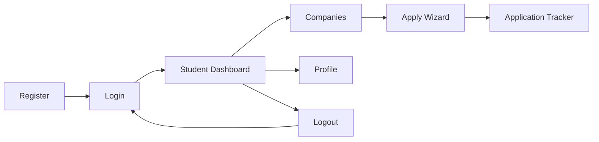

[No sources needed since this diagram shows conceptual workflow, not actual code structure]

### Accessibility and Cross-Browser Compatibility
- Accessibility: Replace inline styles with semantic HTML and Tailwind utilities; ensure focus management and keyboard navigation in modals and forms.
- Cross-browser: Use Tailwind’s preflight reset and avoid vendor-prefixed CSS; test on major browsers; polyfill fetch if targeting older environments.

[No sources needed since this section provides general guidance]