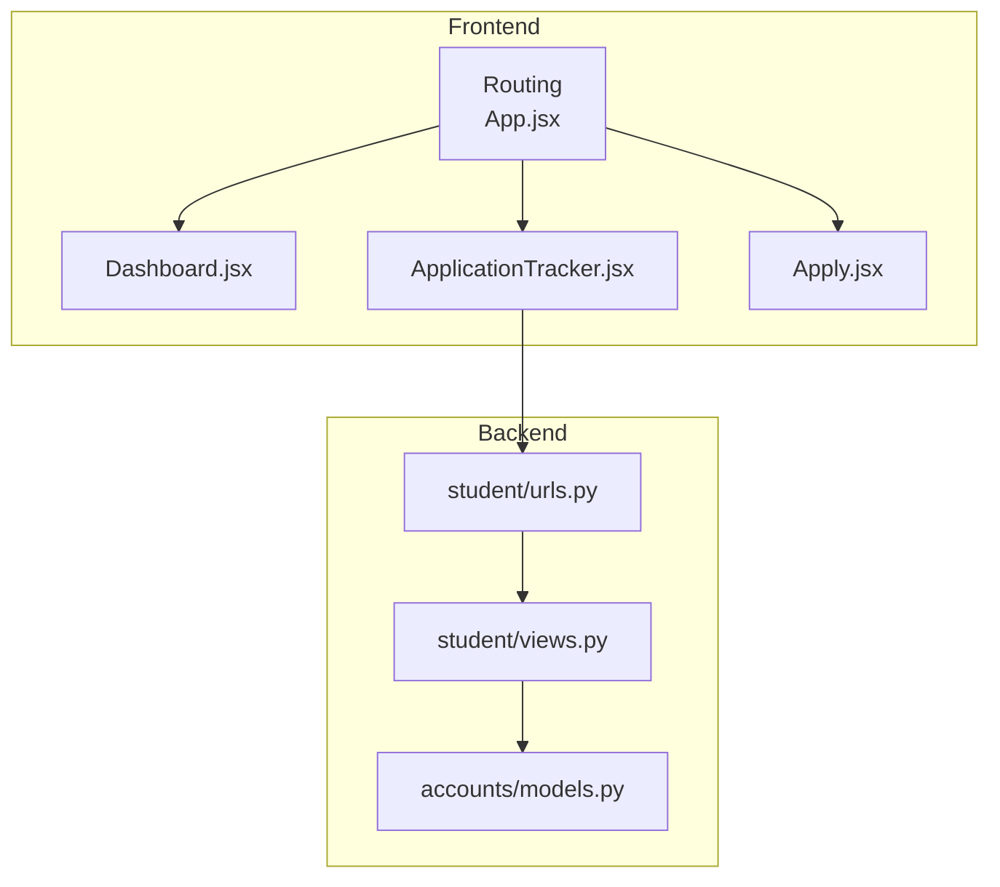
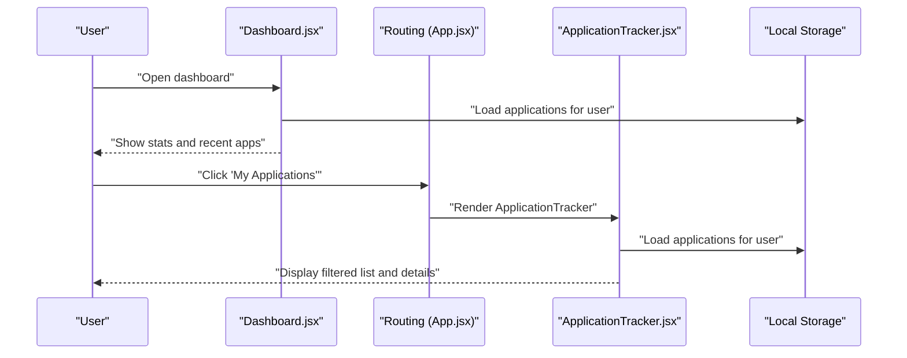
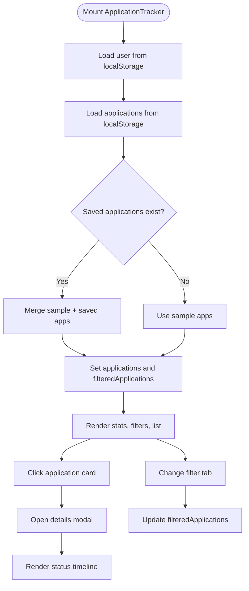
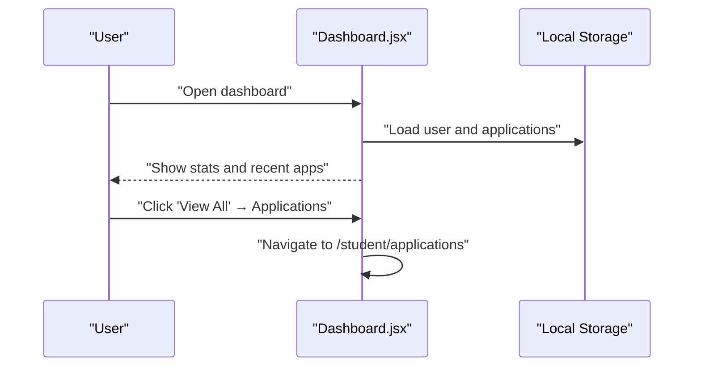
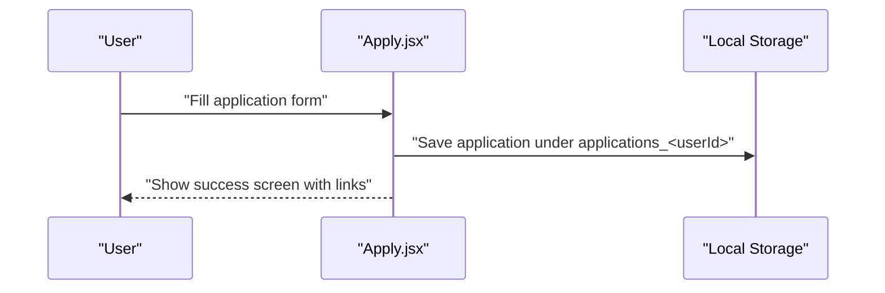
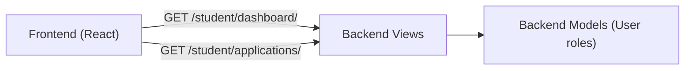
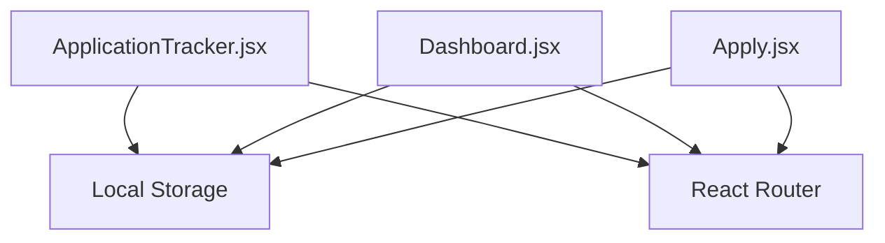

# Application Tracking

<cite>
**Referenced Files in This Document**
- [ApplicationTracker.jsx](file://frontend/src/Pages/Student/ApplicationTracker.jsx)
- [Dashboard.jsx](file://frontend/src/Pages/Student/Dashboard.jsx)
- [Apply.jsx](file://frontend/src/Pages/Student/Apply.jsx)
- [App.jsx](file://frontend/src/App.jsx)
- [main.jsx](file://frontend/src/main.jsx)
- [student/views.py](file://backend/student/views.py)
- [student/urls.py](file://backend/student/urls.py)
- [accounts/models.py](file://backend/accounts/models.py)
</cite>

## Table of Contents
1. [Introduction](#introduction)
2. [Project Structure](#project-structure)
3. [Core Components](#core-components)
4. [Architecture Overview](#architecture-overview)
5. [Detailed Component Analysis](#detailed-component-analysis)
6. [Dependency Analysis](#dependency-analysis)
7. [Performance Considerations](#performance-considerations)
8. [Troubleshooting Guide](#troubleshooting-guide)
9. [Conclusion](#conclusion)

## Introduction
This document explains the Application Tracking system for students, focusing on how application statuses are monitored, visualized, and managed. It covers:
- Application status monitoring interface and status timeline visualization
- Company and position information display
- Filtering by status and date
- Color-coded status indicators and progress visualization
- Local storage persistence for application history
- User interactions for checking progress and navigating the system
- Notifications and alerts for status changes
- Integration points with backend data sources and routing

## Project Structure
The Application Tracking feature spans the frontend React application and the Django backend:
- Frontend pages: ApplicationTracker, Dashboard, Apply, routing configuration
- Backend endpoints: student dashboard and applications endpoints
- Authentication model: user roles and permissions

**Diagram sources**
- [App.jsx:25-52](file://frontend/src/App.jsx#L25-L52)
- [ApplicationTracker.jsx:1-569](file://frontend/src/Pages/Student/ApplicationTracker.jsx#L1-L569)
- [Dashboard.jsx:1-456](file://frontend/src/Pages/Student/Dashboard.jsx#L1-L456)
- [Apply.jsx:1-800](file://frontend/src/Pages/Student/Apply.jsx#L1-L800)
- [student/urls.py:1-8](file://backend/student/urls.py#L1-L8)
- [student/views.py:1-8](file://backend/student/views.py#L1-L8)
- [accounts/models.py:1-25](file://backend/accounts/models.py#L1-L25)

**Section sources**
- [App.jsx:1-55](file://frontend/src/App.jsx#L1-L55)
- [student/urls.py:1-8](file://backend/student/urls.py#L1-L8)
- [student/views.py:1-8](file://backend/student/views.py#L1-L8)
- [accounts/models.py:1-25](file://backend/accounts/models.py#L1-L25)

## Core Components
- ApplicationTracker: Central UI for viewing applications, filtering by status, and inspecting status timelines.
- Dashboard: Overview of application statistics and quick links to applications.
- Apply: Submission flow that persists applications to local storage.
- Routing: Navigation between pages and deep linking to the tracker.

Key capabilities:
- Load applications from local storage with fallback sample data
- Filter applications by status via tabs
- Open a modal to view detailed status history and next steps
- Display color-coded status badges and formatted dates
- Navigate to Companies and Apply from the dashboard

**Section sources**
- [ApplicationTracker.jsx:1-569](file://frontend/src/Pages/Student/ApplicationTracker.jsx#L1-L569)
- [Dashboard.jsx:1-456](file://frontend/src/Pages/Student/Dashboard.jsx#L1-L456)
- [Apply.jsx:160-180](file://frontend/src/Pages/Student/Apply.jsx#L160-L180)
- [App.jsx:34-40](file://frontend/src/App.jsx#L34-L40)

## Architecture Overview
The system follows a frontend-first approach with local storage for persistence during development. Backend endpoints are defined for future integration.

**Diagram sources**
- [Dashboard.jsx:22-71](file://frontend/src/Pages/Student/Dashboard.jsx#L22-L71)
- [ApplicationTracker.jsx:12-136](file://frontend/src/Pages/Student/ApplicationTracker.jsx#L12-L136)
- [App.jsx:34-40](file://frontend/src/App.jsx#L34-L40)

## Detailed Component Analysis

### ApplicationTracker Component
Responsibilities:
- Load user and applications from local storage
- Compute and display application statistics
- Filter applications by status
- Render application cards with company and position info
- Show status timeline in a modal
- Provide navigation and logout actions

State management:
- user: logged-in student profile
- applications: full list loaded from local storage
- filteredApplications: list filtered by selected status
- filterStatus: currently selected filter
- selectedApplication: modal detail view

Status visualization:
- Color-coded badges per status
- Timeline visualization with dots and connecting lines
- Formatted applied date and next round details

Filtering:
- Tabs for "All Applications" and each status
- Filter logic updates filteredApplications

Notifications and alerts:
- No runtime notifications are implemented in the current code
- The modal displays the last updated timestamp for transparency

Real-time updates:
- No WebSocket or polling is implemented
- Updates occur on reload or when new applications are added locally

**Diagram sources**
- [ApplicationTracker.jsx:12-145](file://frontend/src/Pages/Student/ApplicationTracker.jsx#L12-L145)
- [ApplicationTracker.jsx:252-397](file://frontend/src/Pages/Student/ApplicationTracker.jsx#L252-L397)
- [ApplicationTracker.jsx:408-564](file://frontend/src/Pages/Student/ApplicationTracker.jsx#L408-L564)

**Section sources**
- [ApplicationTracker.jsx:1-569](file://frontend/src/Pages/Student/ApplicationTracker.jsx#L1-L569)

### Dashboard Component
Responsibilities:
- Display application statistics (total, shortlisted, offers, pending)
- Show recent applications preview
- Provide quick actions to profile, companies, and applications
- Calculate profile completion percentage

Integration with ApplicationTracker:
- Links to the applications page for deeper tracking

**Diagram sources**
- [Dashboard.jsx:22-71](file://frontend/src/Pages/Student/Dashboard.jsx#L22-L71)
- [Dashboard.jsx:341-398](file://frontend/src/Pages/Student/Dashboard.jsx#L341-L398)

**Section sources**
- [Dashboard.jsx:1-456](file://frontend/src/Pages/Student/Dashboard.jsx#L1-L456)

### Apply Component
Responsibilities:
- Collect application preferences and references
- Verify profile completeness
- Persist application submission to local storage
- Provide a success screen with navigation

Submission flow:
- Validates profile completeness
- Saves application record under the user’s key in local storage
- Sets status to "Applied" and includes application data

**Diagram sources**
- [Apply.jsx:160-180](file://frontend/src/Pages/Student/Apply.jsx#L160-L180)

**Section sources**
- [Apply.jsx:1-800](file://frontend/src/Pages/Student/Apply.jsx#L1-L800)

### Backend Integration Points
Current state:
- Backend student endpoints exist for dashboard and applications
- Authentication model defines user roles
- Frontend currently uses local storage for application data

Future integration:
- Replace local storage loading with backend API calls
- Use backend endpoints for retrieving and updating application records
- Secure routes and authentication checks

**Diagram sources**
- [student/urls.py:4-7](file://backend/student/urls.py#L4-L7)
- [student/views.py:3-7](file://backend/student/views.py#L3-L7)
- [accounts/models.py:4-25](file://backend/accounts/models.py#L4-L25)

**Section sources**
- [student/urls.py:1-8](file://backend/student/urls.py#L1-L8)
- [student/views.py:1-8](file://backend/student/views.py#L1-L8)
- [accounts/models.py:1-25](file://backend/accounts/models.py#L1-L25)

## Dependency Analysis
- ApplicationTracker depends on:
  - Local storage for application persistence
  - React Router for navigation
  - Utility functions for date formatting and status colors
- Dashboard depends on:
  - Local storage for application data
  - Navigation to ApplicationTracker
- Apply depends on:
  - Local storage for saving submissions
  - Navigation to success screen and Applications page

**Diagram sources**
- [ApplicationTracker.jsx:1-569](file://frontend/src/Pages/Student/ApplicationTracker.jsx#L1-L569)
- [Dashboard.jsx:1-456](file://frontend/src/Pages/Student/Dashboard.jsx#L1-L456)
- [Apply.jsx:1-800](file://frontend/src/Pages/Student/Apply.jsx#L1-L800)
- [App.jsx:1-55](file://frontend/src/App.jsx#L1-L55)

**Section sources**
- [ApplicationTracker.jsx:1-569](file://frontend/src/Pages/Student/ApplicationTracker.jsx#L1-L569)
- [Dashboard.jsx:1-456](file://frontend/src/Pages/Student/Dashboard.jsx#L1-L456)
- [Apply.jsx:1-800](file://frontend/src/Pages/Student/Apply.jsx#L1-L800)
- [App.jsx:1-55](file://frontend/src/App.jsx#L1-L55)

## Performance Considerations
- Local storage reads/writes are synchronous and can block the UI for large datasets. Consider:
  - Pagination or virtualization for long lists
  - Debounced filtering for smoother interactions
  - Background workers or service workers for caching
- Rendering many timeline entries can be heavy; consider:
  - Lazy rendering of timeline items
  - Memoization of computed styles and formatted dates
- Backend integration should use efficient queries and caching to avoid repeated network overhead.

## Troubleshooting Guide
Common issues and resolutions:
- No applications displayed
  - Cause: No saved applications for the user
  - Resolution: Submit an application via the Apply page; data will be persisted under the user’s key
- Filters not working
  - Cause: Incorrect filter state handling
  - Resolution: Ensure the filter handler updates filteredApplications correctly
- Modal not opening
  - Cause: selectedApplication not set
  - Resolution: Click a card to set selectedApplication and open the modal
- Dates appear incorrect
  - Cause: Date parsing/formatting errors
  - Resolution: Use provided formatting helpers consistently
- Backend integration gaps
  - Symptom: Tracker shows sample data instead of server data
  - Resolution: Implement API calls to backend endpoints and replace local storage logic

**Section sources**
- [ApplicationTracker.jsx:12-145](file://frontend/src/Pages/Student/ApplicationTracker.jsx#L12-L145)
- [ApplicationTracker.jsx:408-564](file://frontend/src/Pages/Student/ApplicationTracker.jsx#L408-L564)
- [Apply.jsx:160-180](file://frontend/src/Pages/Student/Apply.jsx#L160-L180)

## Conclusion
The Application Tracking system provides a clear, color-coded view of a student’s job applications, with filtering, timeline visualization, and quick navigation. While the current implementation relies on local storage for persistence, the architecture supports seamless integration with backend APIs. Enhancements such as real-time updates, notifications, and backend-driven filtering would further improve the user experience.