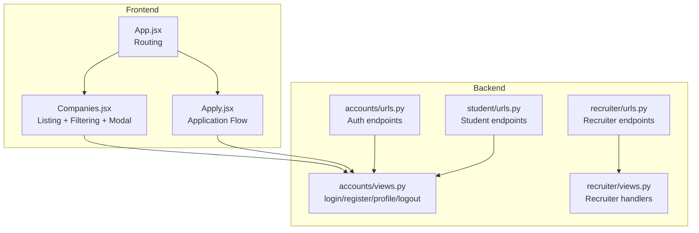
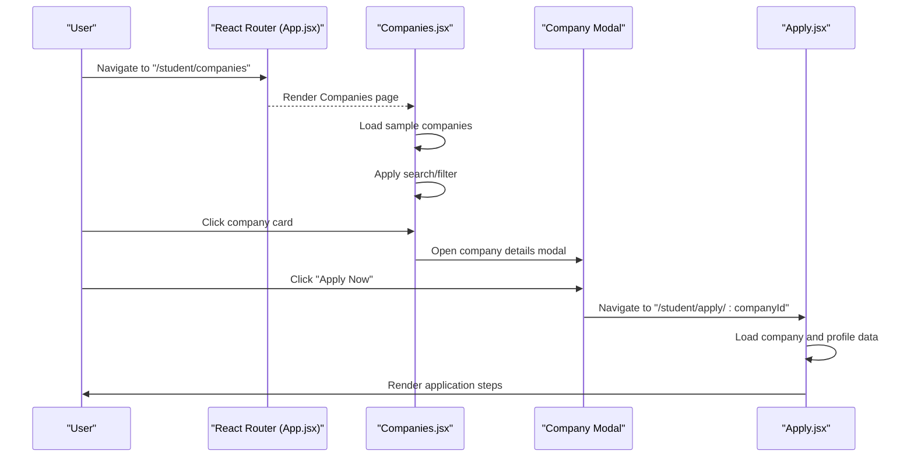
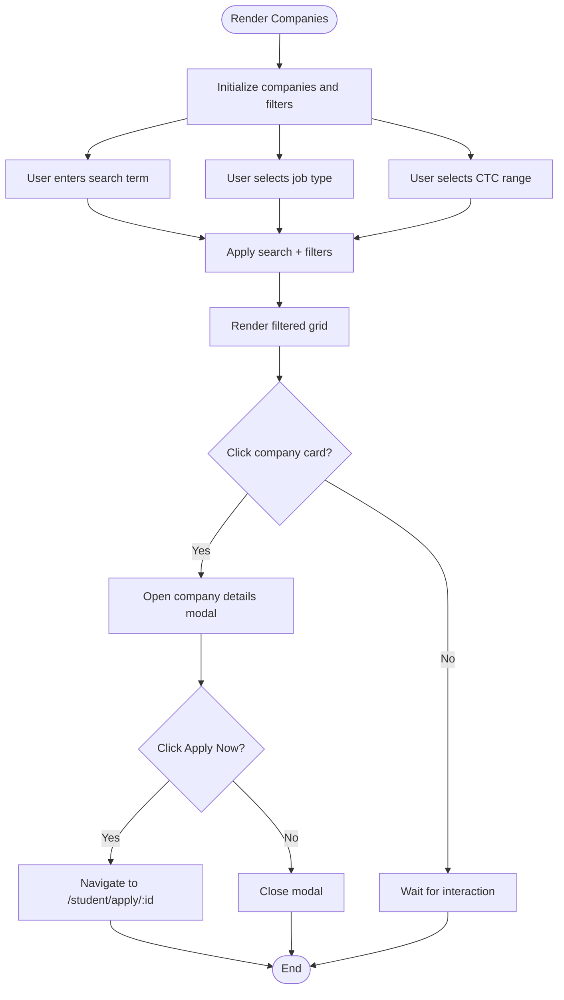
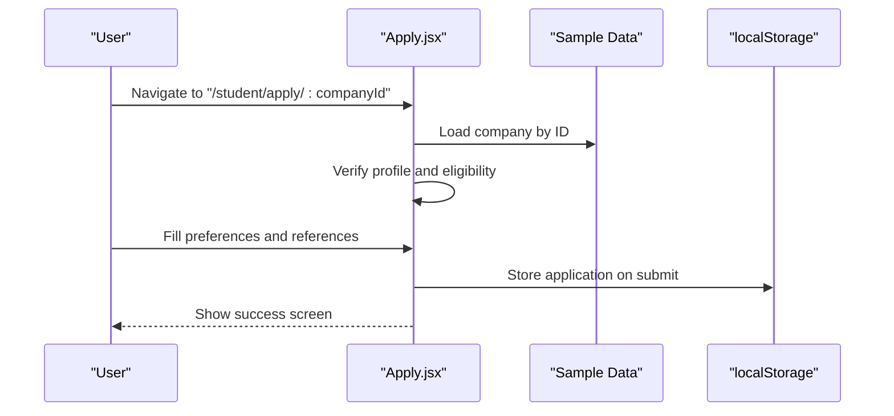
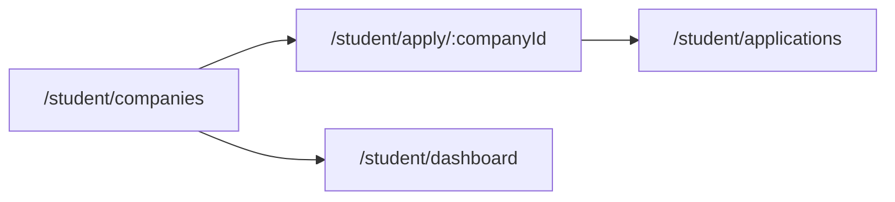
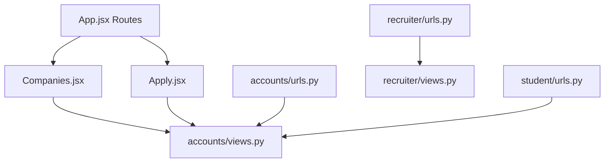

# Company Browsing

<cite>
**Referenced Files in This Document**
- [Companies.jsx](file://frontend/src/Pages/Student/Companies.jsx)
- [Apply.jsx](file://frontend/src/Pages/Student/Apply.jsx)
- [App.jsx](file://frontend/src/App.jsx)
- [accounts/views.py](file://backend/accounts/views.py)
- [accounts/urls.py](file://backend/accounts/urls.py)
- [recruiter/urls.py](file://backend/recruiter/urls.py)
- [recruiter/views.py](file://backend/recruiter/views.py)
- [student/urls.py](file://backend/student/urls.py)
</cite>

## Table of Contents
1. [Introduction](#introduction)
2. [Project Structure](#project-structure)
3. [Core Components](#core-components)
4. [Architecture Overview](#architecture-overview)
5. [Detailed Component Analysis](#detailed-component-analysis)
6. [Dependency Analysis](#dependency-analysis)
7. [Performance Considerations](#performance-considerations)
8. [Troubleshooting Guide](#troubleshooting-guide)
9. [Conclusion](#conclusion)

## Introduction
This document describes the Company Browsing interface for students, focusing on how company listings are displayed, filtered, searched, and previewed. It explains the interactive elements for viewing company details, the modal-based company information card, and the navigation flow from the company listing page to the application process. It also outlines the current data-fetching pattern (sample data), the absence of pagination or infinite scroll, and the planned integration points with backend APIs for retrieving company and job data.

## Project Structure
The Company Browsing feature spans the frontend React pages and routes, and integrates with backend endpoints for authentication and potential future data retrieval.

**Diagram sources**
- [App.jsx:1-55](file://frontend/src/App.jsx#L1-L55)
- [Companies.jsx:1-646](file://frontend/src/Pages/Student/Companies.jsx#L1-L646)
- [Apply.jsx:1-893](file://frontend/src/Pages/Student/Apply.jsx#L1-L893)
- [accounts/views.py:1-95](file://backend/accounts/views.py#L1-L95)
- [accounts/urls.py:1-10](file://backend/accounts/urls.py#L1-L10)
- [recruiter/urls.py:1-8](file://backend/recruiter/urls.py#L1-L8)
- [recruiter/views.py:1-12](file://backend/recruiter/views.py#L1-L12)
- [student/urls.py:1-8](file://backend/student/urls.py#L1-L8)

**Section sources**
- [App.jsx:1-55](file://frontend/src/App.jsx#L1-L55)
- [Companies.jsx:1-646](file://frontend/src/Pages/Student/Companies.jsx#L1-L646)
- [Apply.jsx:1-893](file://frontend/src/Pages/Student/Apply.jsx#L1-L893)
- [accounts/views.py:1-95](file://backend/accounts/views.py#L1-L95)
- [accounts/urls.py:1-10](file://backend/accounts/urls.py#L1-L10)
- [recruiter/urls.py:1-8](file://backend/recruiter/urls.py#L1-L8)
- [recruiter/views.py:1-12](file://backend/recruiter/views.py#L1-L12)
- [student/urls.py:1-8](file://backend/student/urls.py#L1-L8)

## Core Components
- Company Listing Page (Student): Displays a responsive grid of company cards with search and filter controls. Includes a modal for detailed company information and an “Apply Now” action.
- Application Page (Student): Handles multi-step application after selecting a company, including profile verification, preferences, references, and submission.
- Routing: Defines routes for the listing, application, and related pages.

Key behaviors:
- Search: Filters by company name, job role, and skills.
- Filters: Job type and CTC range.
- Sorting: Not implemented in the current code.
- Pagination/Infinite Scroll: Not implemented; all companies are rendered.
- Responsive Grid: Uses CSS grid with automatic column sizing.

**Section sources**
- [Companies.jsx:1-646](file://frontend/src/Pages/Student/Companies.jsx#L1-L646)
- [Apply.jsx:1-893](file://frontend/src/Pages/Student/Apply.jsx#L1-L893)
- [App.jsx:1-55](file://frontend/src/App.jsx#L1-L55)

## Architecture Overview
The Company Browsing feature is primarily a client-side rendering experience with sample data. Navigation is handled via React Router. Authentication is supported by backend endpoints, which can be integrated for secure data access.

**Diagram sources**
- [App.jsx:1-55](file://frontend/src/App.jsx#L1-L55)
- [Companies.jsx:1-646](file://frontend/src/Pages/Student/Companies.jsx#L1-L646)
- [Apply.jsx:1-893](file://frontend/src/Pages/Student/Apply.jsx#L1-L893)

## Detailed Component Analysis

### Company Listing Page (Student)
Responsibilities:
- Fetch or initialize company data (currently sample data).
- Provide search input and filter dropdowns.
- Render a responsive grid of company cards with hover effects.
- Open a modal with detailed company information.
- Navigate to the application page when “Apply Now” is clicked.

Data fetching pattern:
- Loads sample companies on mount and sets both the raw and filtered lists.
- No pagination or infinite scroll is implemented.

Filtering and search:
- Search term matches company name, job role, or any skill.
- Filter by job type and CTC range using numeric thresholds derived from the first number in the CTC string.

Sorting:
- Not implemented.

Responsive grid:
- CSS grid with automatic column sizing and fixed minimum width per card.

Interactive elements:
- Hover animations on cards.
- Clicking a card opens the modal.
- Clicking “Apply Now” navigates to the application page.

Navigation:
- Back to dashboard and logout actions.
- Navigates to application page with company ID.

Modal details:
- Displays company description, job details, eligibility criteria, required skills, selection rounds, and apply/close actions.

**Diagram sources**
- [Companies.jsx:1-646](file://frontend/src/Pages/Student/Companies.jsx#L1-L646)

**Section sources**
- [Companies.jsx:1-646](file://frontend/src/Pages/Student/Companies.jsx#L1-L646)

### Application Page (Student)
Responsibilities:
- Load company data for the selected company ID.
- Verify profile completeness and eligibility against company criteria.
- Collect application preferences, references, and summary.
- Submit application and persist to local storage.

Data fetching pattern:
- Loads sample company data by ID; in a real app, this would call a backend endpoint.

Profile verification:
- Checks presence of personal info and education details; documents status is indicated conceptually.

Submission:
- Simulates an async submission and stores the application locally.

**Diagram sources**
- [Apply.jsx:1-893](file://frontend/src/Pages/Student/Apply.jsx#L1-L893)

**Section sources**
- [Apply.jsx:1-893](file://frontend/src/Pages/Student/Apply.jsx#L1-L893)

### Routing and Navigation
- Routes define the listing page, application page, and related pages.
- Navigation between listing and application is handled via route parameters.

**Diagram sources**
- [App.jsx:1-55](file://frontend/src/App.jsx#L1-L55)

**Section sources**
- [App.jsx:1-55](file://frontend/src/App.jsx#L1-L55)

## Dependency Analysis
- Frontend depends on React Router for navigation and on internal sample data for rendering.
- Backend provides authentication endpoints that can be used to secure data access and user sessions.
- Recruiter endpoints exist for job posting and applicant listing.
- Student endpoints exist for dashboard and applications.

**Diagram sources**
- [App.jsx:1-55](file://frontend/src/App.jsx#L1-L55)
- [Companies.jsx:1-646](file://frontend/src/Pages/Student/Companies.jsx#L1-L646)
- [Apply.jsx:1-893](file://frontend/src/Pages/Student/Apply.jsx#L1-L893)
- [accounts/views.py:1-95](file://backend/accounts/views.py#L1-L95)
- [accounts/urls.py:1-10](file://backend/accounts/urls.py#L1-L10)
- [recruiter/urls.py:1-8](file://backend/recruiter/urls.py#L1-L8)
- [recruiter/views.py:1-12](file://backend/recruiter/views.py#L1-L12)
- [student/urls.py:1-8](file://backend/student/urls.py#L1-L8)

**Section sources**
- [App.jsx:1-55](file://frontend/src/App.jsx#L1-L55)
- [Companies.jsx:1-646](file://frontend/src/Pages/Student/Companies.jsx#L1-L646)
- [Apply.jsx:1-893](file://frontend/src/Pages/Student/Apply.jsx#L1-L893)
- [accounts/views.py:1-95](file://backend/accounts/views.py#L1-L95)
- [accounts/urls.py:1-10](file://backend/accounts/urls.py#L1-L10)
- [recruiter/urls.py:1-8](file://backend/recruiter/urls.py#L1-L8)
- [recruiter/views.py:1-12](file://backend/recruiter/views.py#L1-L12)
- [student/urls.py:1-8](file://backend/student/urls.py#L1-L8)

## Performance Considerations
- Current implementation renders all companies at once; consider lazy-loading or pagination/infinite scroll for large datasets.
- Filtering runs on the client; for large datasets, consider server-side filtering and search.
- Modal rendering is straightforward; avoid heavy computations inside modal open/close handlers.
- Debounce search input to reduce re-filtering frequency.

## Troubleshooting Guide
Common issues and resolutions:
- Empty results after filtering: Verify that the search term and filters match available data. Confirm that CTC range parsing uses the expected format.
- Apply button disabled: Eligibility checks are simplified; ensure the eligibility criteria are met or adjust the eligibility logic.
- Navigation issues: Confirm routes are defined and the company ID is present in the URL.
- Authentication errors: If integrating backend authentication, ensure tokens are attached to requests and endpoints are protected.

**Section sources**
- [Companies.jsx:1-646](file://frontend/src/Pages/Student/Companies.jsx#L1-L646)
- [Apply.jsx:1-893](file://frontend/src/Pages/Student/Apply.jsx#L1-L893)
- [accounts/views.py:1-95](file://backend/accounts/views.py#L1-L95)

## Conclusion
The Company Browsing interface currently provides a responsive, interactive listing experience with search and filter capabilities, a detailed modal view, and a multi-step application flow. While the current data-fetching pattern uses sample data, the component structure and routing are ready for integration with backend APIs. Future enhancements should focus on pagination, server-side filtering, and robust error handling to improve scalability and reliability.