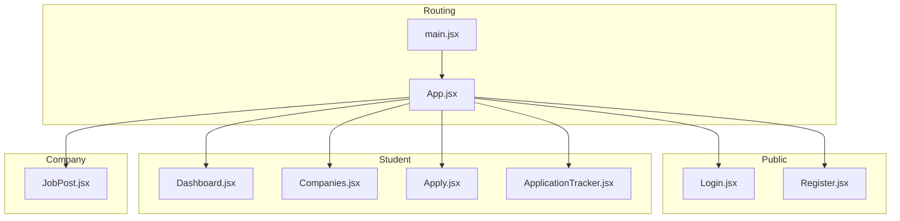
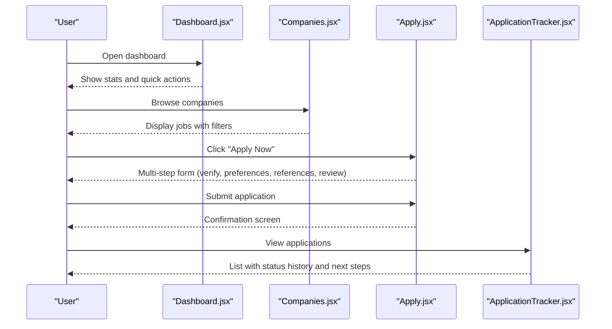
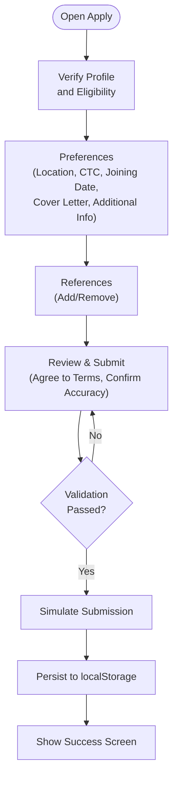
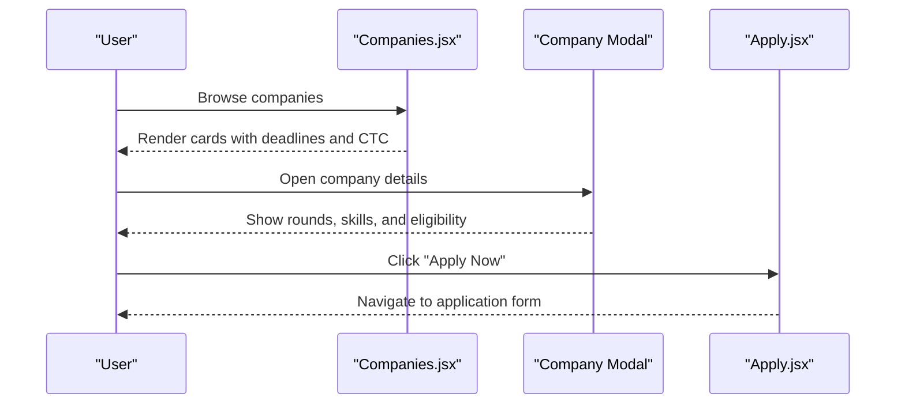
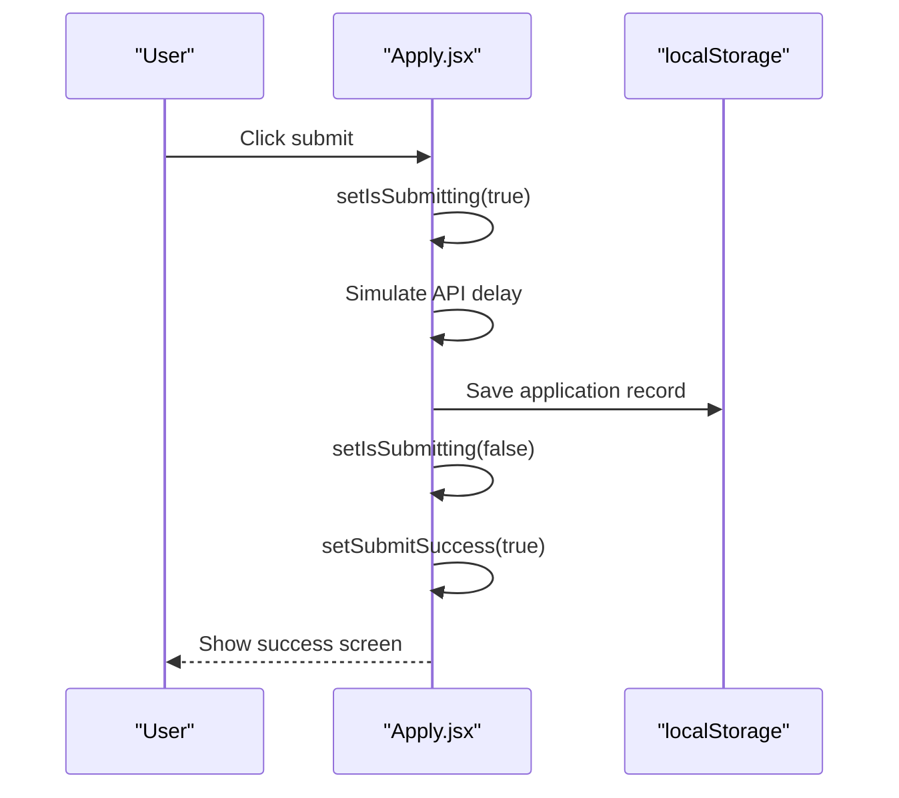
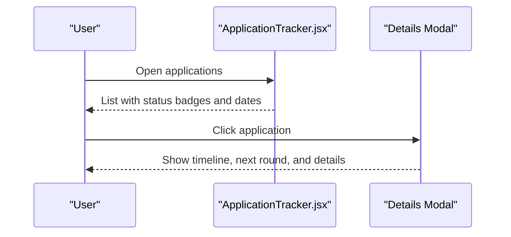
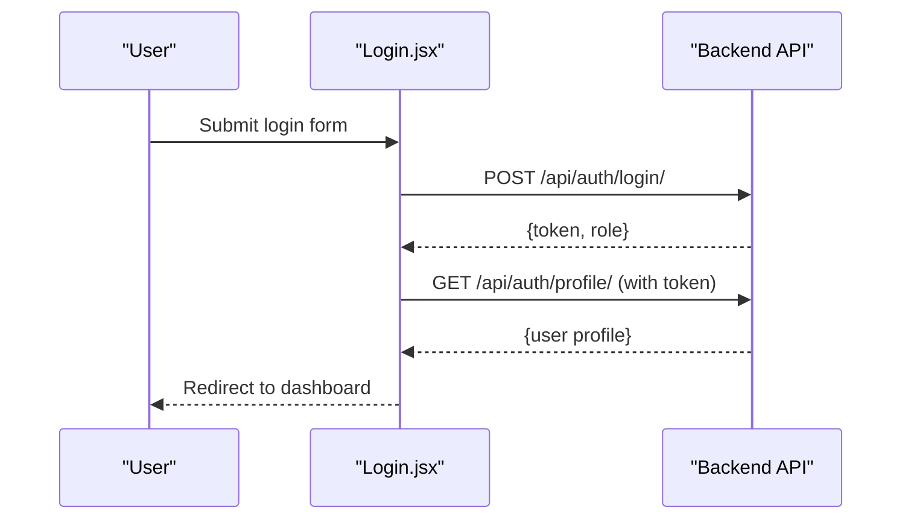
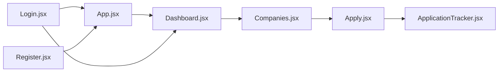

# Job Application Process

<cite>
**Referenced Files in This Document**
- [Apply.jsx](file://frontend/src/Pages/Student/Apply.jsx)
- [ApplicationTracker.jsx](file://frontend/src/Pages/Student/ApplicationTracker.jsx)
- [Companies.jsx](file://frontend/src/Pages/Student/Companies.jsx)
- [Dashboard.jsx](file://frontend/src/Pages/Student/Dashboard.jsx)
- [Login.jsx](file://frontend/src/Pages/Public/Login.jsx)
- [Register.jsx](file://frontend/src/Pages/Public/Register.jsx)
- [App.jsx](file://frontend/src/App.jsx)
- [main.jsx](file://frontend/src/main.jsx)
- [JobPost.jsx](file://frontend/src/Pages/Company/JobPost.jsx)
</cite>

## Table of Contents
1. [Introduction](#introduction)
2. [Project Structure](#project-structure)
3. [Core Components](#core-components)
4. [Architecture Overview](#architecture-overview)
5. [Detailed Component Analysis](#detailed-component-analysis)
6. [Dependency Analysis](#dependency-analysis)
7. [Performance Considerations](#performance-considerations)
8. [Troubleshooting Guide](#troubleshooting-guide)
9. [Conclusion](#conclusion)

## Introduction
This document explains the Job Application system end-to-end, covering the application form interface, job details display, application submission workflow, and confirmation handling. It also details form validation patterns, required field handling, file upload capabilities for resumes/documents, error handling strategies, backend integration points, success/error state management, user feedback mechanisms, application status tracking, previous application history display, and the complete user journey from job selection to submission. Accessibility and responsive design considerations are included for mobile users.

## Project Structure
The frontend is a React application structured by feature pages under the Student, Public, Company, and TPO Admin domains. Routing is configured via React Router. Authentication integrates with backend endpoints for login and profile retrieval.

**Diagram sources**
- [App.jsx:25-51](file://frontend/src/App.jsx#L25-L51)
- [main.jsx:6-10](file://frontend/src/main.jsx#L6-L10)

**Section sources**
- [App.jsx:25-51](file://frontend/src/App.jsx#L25-L51)
- [main.jsx:6-10](file://frontend/src/main.jsx#L6-L10)

## Core Components
- Student Dashboard: Entry point for students; shows stats, quick actions, profile completion, recent applications, and upcoming drives.
- Companies Listing: Displays available jobs with filters, search, and eligibility checks; navigates to the application form.
- Application Form (Apply): Multi-step wizard for profile verification, preferences, references, and review/submit.
- Application Tracker: Lists previous applications, filters by status, shows status timeline, and next steps.
- Authentication: Login and Registration pages integrate with backend APIs for token-based auth and profile retrieval.

Key responsibilities:
- State management for form data, verification status, and submission flow.
- Local storage persistence for user profiles and applications during demo mode.
- Navigation between steps and confirmation screen upon successful submission.
- Status rendering and filtering for application history.

**Section sources**
- [Dashboard.jsx:31-71](file://frontend/src/Pages/Student/Dashboard.jsx#L31-L71)
- [Companies.jsx:25-156](file://frontend/src/Pages/Student/Companies.jsx#L25-L156)
- [Apply.jsx:40-128](file://frontend/src/Pages/Student/Apply.jsx#L40-L128)
- [ApplicationTracker.jsx:21-136](file://frontend/src/Pages/Student/ApplicationTracker.jsx#L21-L136)
- [Login.jsx:17-55](file://frontend/src/Pages/Public/Login.jsx#L17-L55)

## Architecture Overview
The application follows a client-side routing model with React Router. Authentication is handled via external backend endpoints. During demo mode, application data is persisted in localStorage. The Apply page simulates submission and persists applications locally, while the tracker reads from localStorage to present status history.

**Diagram sources**
- [Dashboard.jsx:31-71](file://frontend/src/Pages/Student/Dashboard.jsx#L31-L71)
- [Companies.jsx:192-194](file://frontend/src/Pages/Student/Companies.jsx#L192-L194)
- [Apply.jsx:160-180](file://frontend/src/Pages/Student/Apply.jsx#L160-L180)
- [ApplicationTracker.jsx:21-136](file://frontend/src/Pages/Student/ApplicationTracker.jsx#L21-L136)

## Detailed Component Analysis

### Application Form (Apply)
The Apply component implements a four-step wizard:
- Step 1: Profile verification and eligibility check against company criteria.
- Step 2: Application preferences (location, expected CTC, joining date), cover letter, and additional info.
- Step 3: Optional references management (add/remove entries).
- Step 4: Summary review and legal checkboxes (terms and accuracy confirmation).

Submission flow:
- Validates required fields (references and checkboxes).
- Simulates an API call delay.
- Persists application to localStorage under a user-specific key.
- Navigates to a success confirmation screen.

**Diagram sources**
- [Apply.jsx:630-635](file://frontend/src/Pages/Student/Apply.jsx#L630-L635)
- [Apply.jsx:160-180](file://frontend/src/Pages/Student/Apply.jsx#L160-L180)

Key implementation highlights:
- Form state management for applicationData and references.
- Verification status computed from local profile data.
- Step navigation and progress indicators.
- Checkbox validations enforced before submission.

**Section sources**
- [Apply.jsx:14-32](file://frontend/src/Pages/Student/Apply.jsx#L14-L32)
- [Apply.jsx:182-363](file://frontend/src/Pages/Student/Apply.jsx#L182-L363)
- [Apply.jsx:365-555](file://frontend/src/Pages/Student/Apply.jsx#L365-L555)
- [Apply.jsx:557-628](file://frontend/src/Pages/Student/Apply.jsx#L557-L628)
- [Apply.jsx:160-180](file://frontend/src/Pages/Student/Apply.jsx#L160-L180)

### Job Details Display (Companies)
The Companies page lists available jobs with:
- Search by company, role, or skills.
- Filters for job type and CTC range.
- Eligibility checks and apply button state.
- Detailed modal with company description, rounds, and selection criteria.

**Diagram sources**
- [Companies.jsx:158-182](file://frontend/src/Pages/Student/Companies.jsx#L158-L182)
- [Companies.jsx:192-194](file://frontend/src/Pages/Student/Companies.jsx#L192-L194)
- [Companies.jsx:438-641](file://frontend/src/Pages/Student/Companies.jsx#L438-L641)

**Section sources**
- [Companies.jsx:25-156](file://frontend/src/Pages/Student/Companies.jsx#L25-L156)
- [Companies.jsx:158-182](file://frontend/src/Pages/Student/Companies.jsx#L158-L182)
- [Companies.jsx:438-641](file://frontend/src/Pages/Student/Companies.jsx#L438-L641)

### Application Submission Workflow
Submission is simulated with a timeout and writes to localStorage. The success screen provides navigation to applications and browsing more companies.

**Diagram sources**
- [Apply.jsx:160-180](file://frontend/src/Pages/Student/Apply.jsx#L160-L180)

**Section sources**
- [Apply.jsx:160-180](file://frontend/src/Pages/Student/Apply.jsx#L160-L180)

### Confirmation Handling
After submission, the success screen displays:
- Confirmation icon and message.
- Links to view applications and browse more companies.

**Section sources**
- [Apply.jsx:637-693](file://frontend/src/Pages/Student/Apply.jsx#L637-L693)

### Application Status Tracking
The ApplicationTracker page:
- Loads applications from localStorage (with sample data fallback).
- Provides status filtering and statistics.
- Shows detailed modal with status history, next steps, and formatted timestamps.

**Diagram sources**
- [ApplicationTracker.jsx:21-136](file://frontend/src/Pages/Student/ApplicationTracker.jsx#L21-L136)
- [ApplicationTracker.jsx:409-564](file://frontend/src/Pages/Student/ApplicationTracker.jsx#L409-L564)

**Section sources**
- [ApplicationTracker.jsx:21-136](file://frontend/src/Pages/Student/ApplicationTracker.jsx#L21-L136)
- [ApplicationTracker.jsx:409-564](file://frontend/src/Pages/Student/ApplicationTracker.jsx#L409-L564)

### Previous Application History Display
The tracker aggregates stats and supports filtering by status. It renders a list of applications with:
- Company branding and role.
- Current status badge with color coding.
- Applied date and optional next round info.

**Section sources**
- [ApplicationTracker.jsx:188-197](file://frontend/src/Pages/Student/ApplicationTracker.jsx#L188-L197)
- [ApplicationTracker.jsx:299-384](file://frontend/src/Pages/Student/ApplicationTracker.jsx#L299-L384)

### Backend Integration and Authentication
Authentication integrates with backend endpoints:
- Login posts credentials and stores role, isLoggedIn, and token.
- Profile retrieval fetches user details using the token.
- Navigation routes differ by role.

**Diagram sources**
- [Login.jsx:17-55](file://frontend/src/Pages/Public/Login.jsx#L17-L55)

**Section sources**
- [Login.jsx:17-55](file://frontend/src/Pages/Public/Login.jsx#L17-L55)
- [Register.jsx:20-40](file://frontend/src/Pages/Public/Register.jsx#L20-L40)
- [App.jsx:25-51](file://frontend/src/App.jsx#L25-L51)

### Recruiter Job Posting Page
The JobPost page serves as the recruiter’s entry point after login, indicating successful redirect and future job posting capabilities.

**Section sources**
- [JobPost.jsx:3-14](file://frontend/src/Pages/Company/JobPost.jsx#L3-L14)

## Dependency Analysis
- Apply depends on Companies for job selection and uses localStorage for profile and application persistence.
- ApplicationTracker depends on localStorage for application history and provides filtering and modal details.
- Authentication pages depend on backend endpoints for login/profile retrieval and set localStorage for session state.
- Routing is centralized in App.jsx with route guards implied by role-based navigation.

**Diagram sources**
- [App.jsx:25-51](file://frontend/src/App.jsx#L25-L51)
- [Login.jsx:17-55](file://frontend/src/Pages/Public/Login.jsx#L17-L55)

**Section sources**
- [App.jsx:25-51](file://frontend/src/App.jsx#L25-L51)
- [Login.jsx:17-55](file://frontend/src/Pages/Public/Login.jsx#L17-L55)

## Performance Considerations
- Client-side simulation of submission reduces network overhead; in production, replace with actual API calls.
- Filtering and search in Companies are computed client-side; consider pagination or server-side filtering for large datasets.
- Local storage usage avoids frequent network requests but can become a bottleneck with very large histories; consider pagination or indexedDB for scalability.
- Rendering large lists in ApplicationTracker can be optimized with virtualization libraries.

## Troubleshooting Guide
Common issues and remedies:
- Login failures: Verify backend endpoint availability and credentials; check error messages returned by the API.
- Missing profile data: Ensure profile is fetched and stored in localStorage after login.
- Applications not appearing: Confirm localStorage keys for applications and user ID alignment.
- Navigation errors: Ensure routes are correctly defined and companyId parameters are passed in URLs.

**Section sources**
- [Login.jsx:26-29](file://frontend/src/Pages/Public/Login.jsx#L26-L29)
- [Login.jsx:41-44](file://frontend/src/Pages/Public/Login.jsx#L41-L44)
- [Apply.jsx:166-176](file://frontend/src/Pages/Student/Apply.jsx#L166-L176)
- [ApplicationTracker.jsx:23-25](file://frontend/src/Pages/Student/ApplicationTracker.jsx#L23-L25)

## Conclusion
The Job Application system provides a complete student-centric workflow from job discovery to application submission and status tracking. The Apply wizard enforces required fields and presents a clear confirmation flow, while the tracker offers visibility into application timelines and next steps. Authentication integrates with backend endpoints, and routing ensures seamless navigation across roles. For production, replace localStorage persistence with backend APIs, implement robust validation, and enhance accessibility and responsiveness for diverse devices.