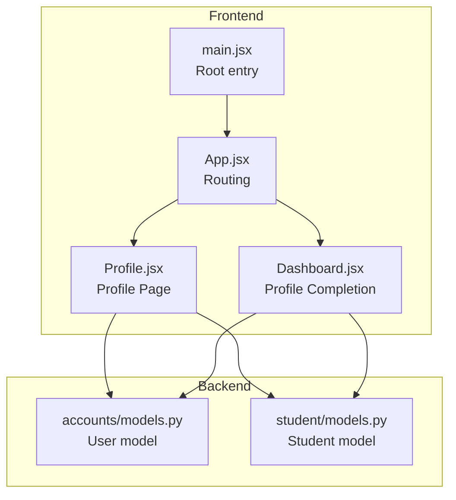
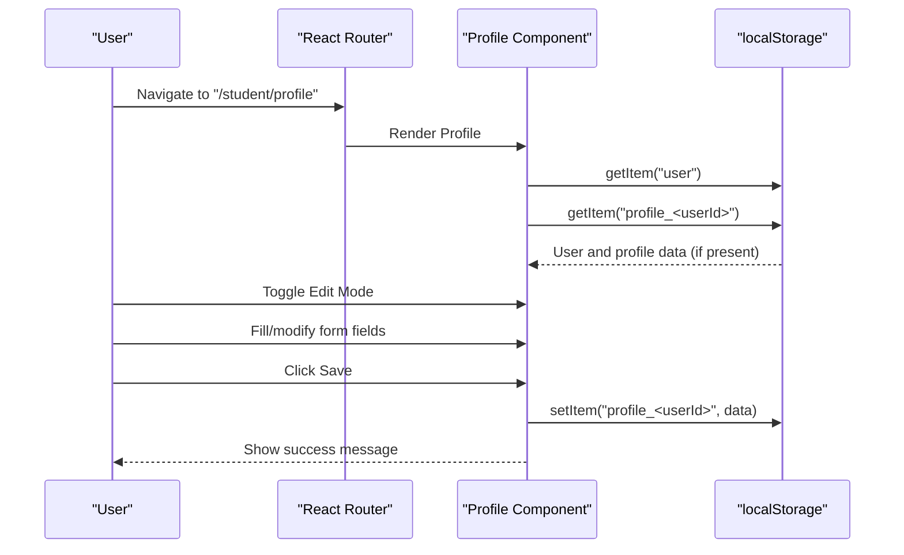
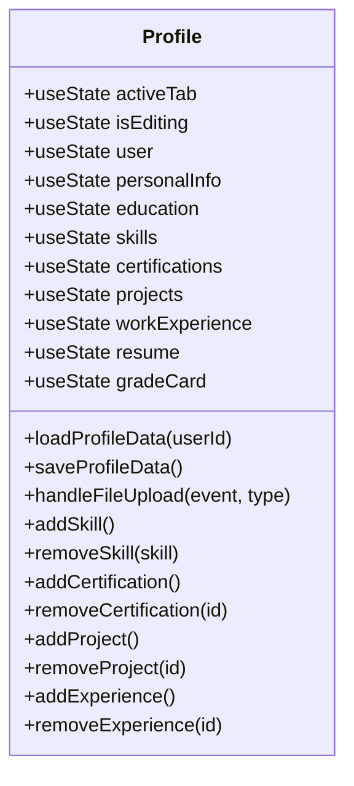
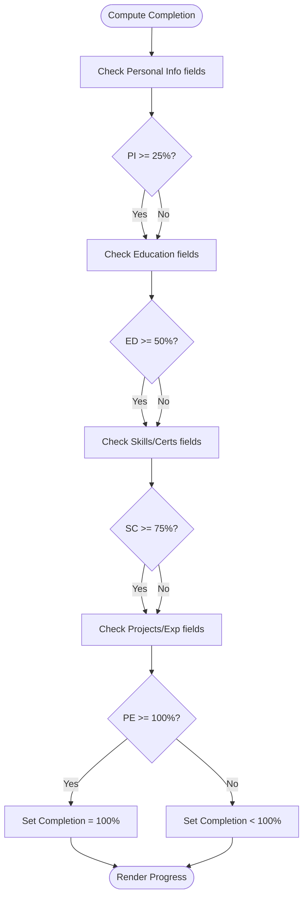
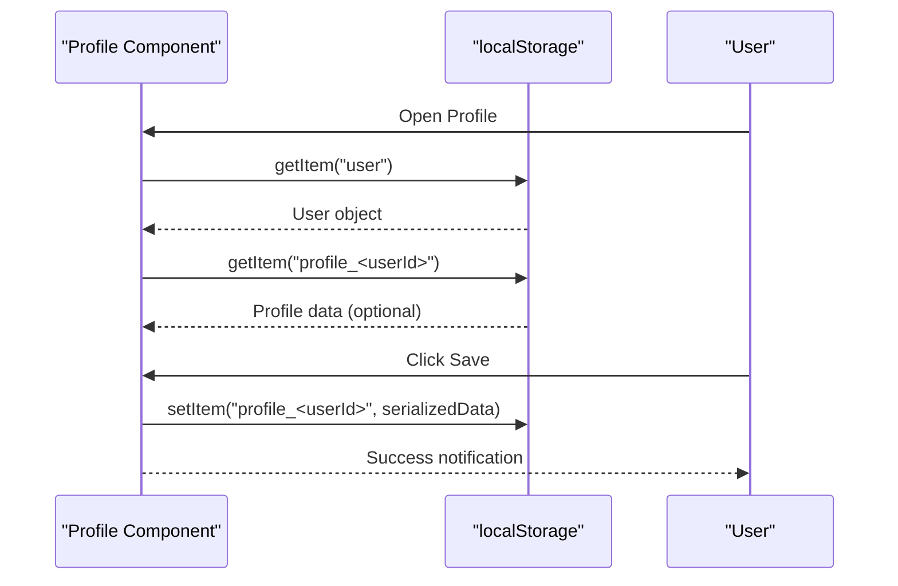
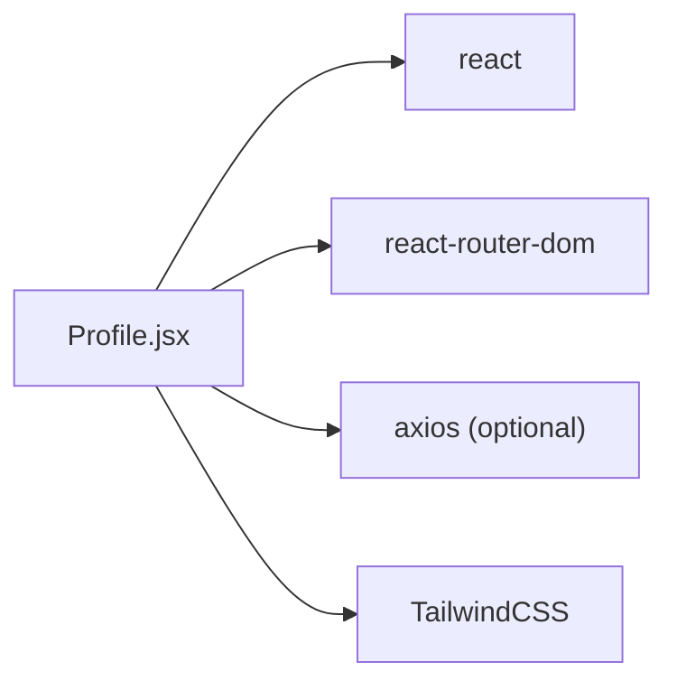

# Profile Management

<cite>
**Referenced Files in This Document**
- [Profile.jsx](file://frontend/src/Pages/Student/Profile.jsx)
- [App.jsx](file://frontend/src/App.jsx)
- [main.jsx](file://frontend/src/main.jsx)
- [Dashboard.jsx](file://frontend/src/Pages/Student/Dashboard.jsx)
- [accounts/models.py](file://backend/accounts/models.py)
- [student/models.py](file://backend/student/models.py)
- [package.json](file://frontend/package.json)
- [index.css](file://frontend/src/index.css)
</cite>

## Table of Contents
1. [Introduction](#introduction)
2. [Project Structure](#project-structure)
3. [Core Components](#core-components)
4. [Architecture Overview](#architecture-overview)
5. [Detailed Component Analysis](#detailed-component-analysis)
6. [Dependency Analysis](#dependency-analysis)
7. [Performance Considerations](#performance-considerations)
8. [Troubleshooting Guide](#troubleshooting-guide)
9. [Conclusion](#conclusion)

## Introduction
This document describes the Student Profile Management system, focusing on the profile editing interface, form handling, validation patterns, and data persistence. It explains the component structure for managing personal information, education details, skills and certifications, projects and experience sections, and documents the profile completion calculation logic. It also covers conditional rendering based on completion status, integration with localStorage for data storage, accessibility considerations, responsive design patterns, and the end-to-end user workflow from profile access to updates and saving.

## Project Structure
The profile management feature is implemented as a React page component integrated into the application routing. The frontend uses Vite and TailwindCSS for build tooling and styling. The backend currently defines user roles but does not expose dedicated profile endpoints in the provided files.

**Diagram sources**
- [main.jsx:1-11](file://frontend/src/main.jsx#L1-L11)
- [App.jsx:1-55](file://frontend/src/App.jsx#L1-L55)
- [Profile.jsx:1-1122](file://frontend/src/Pages/Student/Profile.jsx#L1-L1122)
- [Dashboard.jsx:269-311](file://frontend/src/Pages/Student/Dashboard.jsx#L269-L311)
- [accounts/models.py:1-25](file://backend/accounts/models.py#L1-L25)
- [student/models.py:1-4](file://backend/student/models.py#L1-L4)

**Section sources**
- [main.jsx:1-11](file://frontend/src/main.jsx#L1-L11)
- [App.jsx:1-55](file://frontend/src/App.jsx#L1-L55)
- [package.json:1-34](file://frontend/package.json#L1-L34)
- [index.css:1-1](file://frontend/src/index.css#L1-L1)

## Core Components
- Profile page component orchestrating editing state, tabbed sections, and data persistence.
- Personal info, education, skills/certifications, projects, experience, and documents sections.
- Dashboard integration displaying profile completion progress.

Key responsibilities:
- Manage editing mode and save actions.
- Persist profile data to localStorage keyed by user ID.
- Render tabbed sections with conditional editing and display modes.
- Provide file upload handlers for resume and grade card.
- Calculate and display profile completion percentage.

**Section sources**
- [Profile.jsx:1-1122](file://frontend/src/Pages/Student/Profile.jsx#L1-L1122)
- [Dashboard.jsx:269-311](file://frontend/src/Pages/Student/Dashboard.jsx#L269-L311)

## Architecture Overview
The profile page is rendered under the "/student/profile" route and integrates with the global routing configuration. The component loads user data from localStorage and attempts to load saved profile data for the user. On save, it writes profile data back to localStorage. The dashboard consumes the same persisted data to compute and display completion metrics.

**Diagram sources**
- [App.jsx:34-40](file://frontend/src/App.jsx#L34-L40)
- [Profile.jsx:55-94](file://frontend/src/Pages/Student/Profile.jsx#L55-L94)

## Detailed Component Analysis

### Profile Page Component
The Profile component manages:
- Editing state and tab navigation.
- Form state for personal info, education, skills, certifications, projects, work experience, and documents.
- Local data loading/saving via localStorage.
- Conditional rendering for edit/display modes.
- File upload handling for resume and grade card.

**Diagram sources**
- [Profile.jsx:4-158](file://frontend/src/Pages/Student/Profile.jsx#L4-L158)

**Section sources**
- [Profile.jsx:4-158](file://frontend/src/Pages/Student/Profile.jsx#L4-L158)

### Personal Information Section
- Renders a grid of editable fields for name, email, phone, date of birth, gender, address, city, state, pincode, LinkedIn, GitHub, and portfolio.
- Uses input types appropriate to field semantics (email, tel, date).
- Displays placeholders and links for social profiles.

Validation and UX:
- Validation occurs on the client side during save; no runtime validation messages are shown in the component.
- Edits are applied immediately to state when typing.

Accessibility:
- Uses semantic labels and native input controls.

Responsive design:
- Grid layout adapts to available width using CSS Grid.

**Section sources**
- [Profile.jsx:159-318](file://frontend/src/Pages/Student/Profile.jsx#L159-L318)

### Education Details Section
- Three-tier education blocks: 10th standard, 12th standard/diploma, and graduation.
- Each block displays labeled inputs for board, school/college, percentage/CGPA, and year of passing.
- Graduation block includes additional fields for degree, branch, college, university, current CGPA/year, expected graduation, and backlog count.

Validation and UX:
- No inline validation; edits update state immediately.

Responsive design:
- Grid layout per section ensures readability across devices.

**Section sources**
- [Profile.jsx:321-447](file://frontend/src/Pages/Student/Profile.jsx#L321-L447)

### Skills and Certifications Section
- Skills: Add/remove skills with a single-line input and Enter key support.
- Certifications: Add certification entries with name, issuer, and year; remove by ID.

Validation and UX:
- Duplicate skills are prevented by checking membership before adding.
- Inline removal buttons are available in edit mode.

**Section sources**
- [Profile.jsx:449-617](file://frontend/src/Pages/Student/Profile.jsx#L449-L617)

### Projects Section
- Edit mode allows adding a new project with title, description, technologies (comma-separated), and link.
- Display mode shows projects with technology tags and optional external link.

Validation and UX:
- Required fields enforced by requiring a title before adding.
- Technologies are split and rendered as tags.

**Section sources**
- [Profile.jsx:619-756](file://frontend/src/Pages/Student/Profile.jsx#L619-L756)

### Work Experience Section
- Edit mode enables adding company, role, duration, and description.
- Display mode shows role, company, duration, and description.

Validation and UX:
- Minimal validation; relies on user-entered free-form text.

**Section sources**
- [Profile.jsx:758-873](file://frontend/src/Pages/Student/Profile.jsx#L758-L873)

### Documents Section
- Resume upload area supports PDF and DOC/DOCX with remove capability.
- Grade card upload area supports PDF/JPG/PNG with remove capability.
- Shows file name, size, and guidelines.

Validation and UX:
- Accept attributes restrict file types.
- No size checks are implemented in the component.

**Section sources**
- [Profile.jsx:875-996](file://frontend/src/Pages/Student/Profile.jsx#L875-L996)

### Profile Completion Calculation
The dashboard computes profile completion based on filled sections and displays a progress bar and checklist. The logic compares completion thresholds to section completeness flags.

**Diagram sources**
- [Dashboard.jsx:269-311](file://frontend/src/Pages/Student/Dashboard.jsx#L269-L311)

**Section sources**
- [Dashboard.jsx:269-311](file://frontend/src/Pages/Student/Dashboard.jsx#L269-L311)

### Data Persistence and Storage
- Loading: On mount, the component reads the stored user and profile data from localStorage.
- Saving: On save, the component serializes the current profile state and writes it to localStorage under a key derived from the user ID.
- Logout: Clears user-related localStorage keys and navigates to login.

**Diagram sources**
- [Profile.jsx:55-94](file://frontend/src/Pages/Student/Profile.jsx#L55-L94)

**Section sources**
- [Profile.jsx:55-94](file://frontend/src/Pages/Student/Profile.jsx#L55-L94)

### Routing and Navigation
- The profile page is mounted under the "/student/profile" route.
- The navbar includes a back-to-dashboard button and a logout action.

**Section sources**
- [App.jsx:34-40](file://frontend/src/App.jsx#L34-L40)
- [Profile.jsx:1007-1050](file://frontend/src/Pages/Student/Profile.jsx#L1007-L1050)

## Dependency Analysis
External dependencies influencing the profile management system:
- react and react-router-dom for UI and routing.
- axios for potential backend API communication (not used in profile component).
- TailwindCSS for styling and responsive design.

**Diagram sources**
- [package.json:12-32](file://frontend/package.json#L12-L32)
- [Profile.jsx:1-1122](file://frontend/src/Pages/Student/Profile.jsx#L1-L1122)

**Section sources**
- [package.json:12-32](file://frontend/package.json#L12-L32)

## Performance Considerations
- Client-side persistence avoids network latency for profile saves.
- Large profile objects are serialized and deserialized on each save/load; consider debouncing or partial updates for very large datasets.
- Rendering many projects or experiences can impact performance; virtualization is not implemented.
- File uploads are handled locally; consider chunked uploads for large documents.

## Troubleshooting Guide
Common issues and resolutions:
- Profile not loading: Verify "user" exists in localStorage and matches the expected shape.
- Save fails silently: Confirm the user state is set and the save function is invoked.
- Empty fields after reload: Ensure the loadProfileData function is called with the correct user ID.
- Logout not working: Check that localStorage keys for user/session are cleared and navigation occurs to the login route.

**Section sources**
- [Profile.jsx:55-102](file://frontend/src/Pages/Student/Profile.jsx#L55-L102)

## Conclusion
The Student Profile Management system provides a comprehensive, client-driven solution for students to maintain personal, academic, professional, and supporting documents. It leverages React hooks for state management, localStorage for persistence, and a tabbed UI for organized editing. The dashboard complements the profile by surfacing completion metrics. While the current implementation focuses on local storage, integrating backend APIs would enable server synchronization and richer validation patterns.