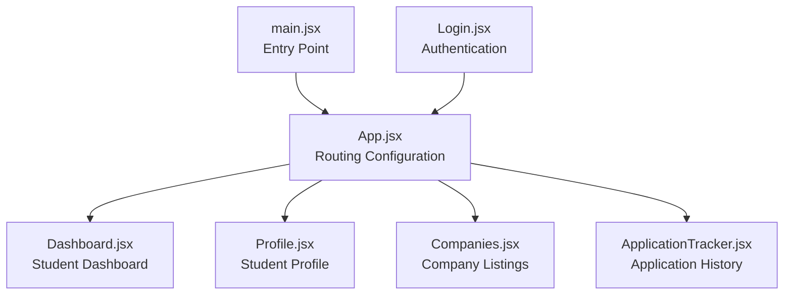
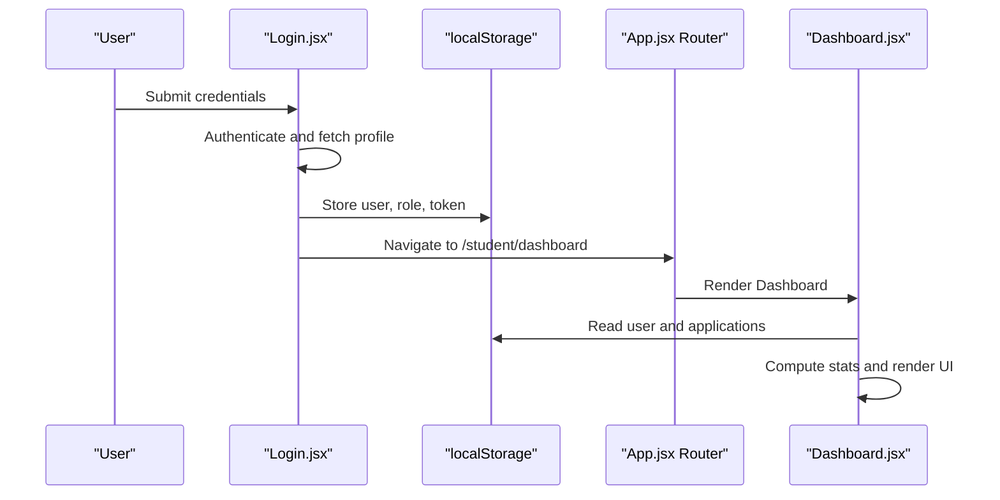
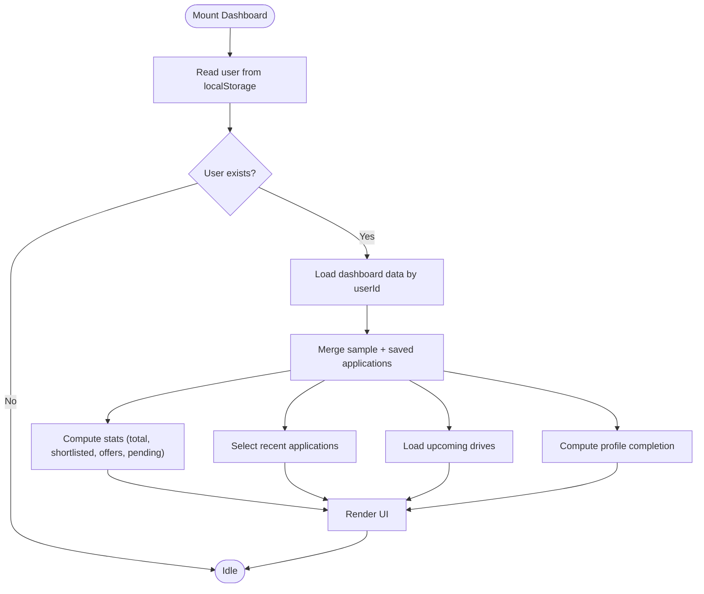
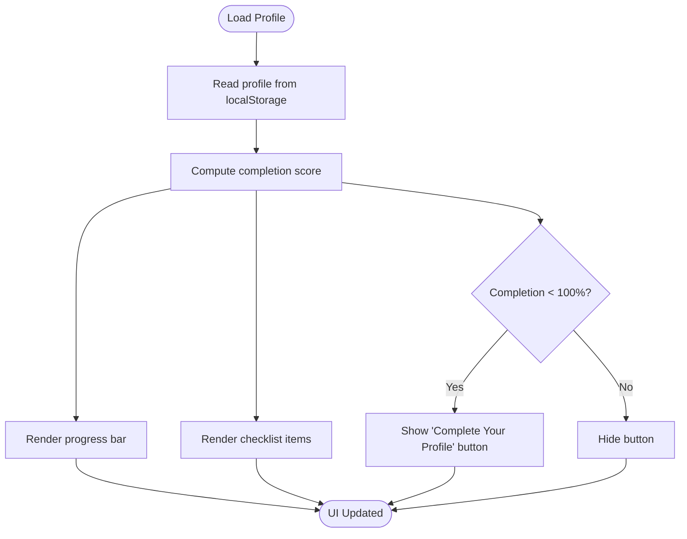
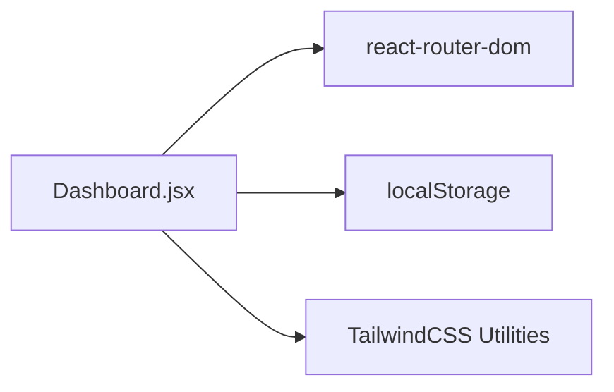

# Student Dashboard

<cite>
**Referenced Files in This Document**
- [Dashboard.jsx](file://frontend/src/Pages/Student/Dashboard.jsx)
- [App.jsx](file://frontend/src/App.jsx)
- [Login.jsx](file://frontend/src/Pages/Public/Login.jsx)
- [Profile.jsx](file://frontend/src/Pages/Student/Profile.jsx)
- [Companies.jsx](file://frontend/src/Pages/Student/Companies.jsx)
- [ApplicationTracker.jsx](file://frontend/src/Pages/Student/ApplicationTracker.jsx)
- [package.json](file://frontend/package.json)
- [main.jsx](file://frontend/src/main.jsx)
- [Index.css](file://frontend/src/Index.css)
</cite>

## Table of Contents
1. [Introduction](#introduction)
2. [Project Structure](#project-structure)
3. [Core Components](#core-components)
4. [Architecture Overview](#architecture-overview)
5. [Detailed Component Analysis](#detailed-component-analysis)
6. [Dependency Analysis](#dependency-analysis)
7. [Performance Considerations](#performance-considerations)
8. [Troubleshooting Guide](#troubleshooting-guide)
9. [Conclusion](#conclusion)

## Introduction
The Student Dashboard is the primary landing page for students after successful authentication. It consolidates key placement journey insights including application metrics, profile completion progress, recent application statuses, and upcoming campus drive schedules. The component emphasizes a clean, responsive layout with intuitive navigation, interactive elements, and a consistent color-coded status system to enhance usability and reduce cognitive load.

## Project Structure
The dashboard resides within the frontend application and integrates with routing, local storage, and related student pages. The routing configuration defines the dashboard route and connects it to the broader application flow.

**Diagram sources**
- [main.jsx:1-11](file://frontend/src/main.jsx#L1-L11)
- [App.jsx:25-52](file://frontend/src/App.jsx#L25-L52)
- [Dashboard.jsx:6-29](file://frontend/src/Pages/Student/Dashboard.jsx#L6-L29)
- [Profile.jsx:1007-1118](file://frontend/src/Pages/Student/Profile.jsx#L1007-L1118)
- [Companies.jsx:201-244](file://frontend/src/Pages/Student/Companies.jsx#L201-L244)
- [ApplicationTracker.jsx:201-244](file://frontend/src/Pages/Student/ApplicationTracker.jsx#L201-L244)
- [Login.jsx:4-55](file://frontend/src/Pages/Public/Login.jsx#L4-L55)

**Section sources**
- [App.jsx:25-52](file://frontend/src/App.jsx#L25-L52)
- [main.jsx:6-10](file://frontend/src/main.jsx#L6-L10)

## Core Components
The dashboard orchestrates several key areas:
- Navigation bar with welcome message and logout action
- Statistics cards summarizing application metrics
- Quick actions for immediate navigation
- Profile completion tracker with progress visualization
- Recent applications display with status badges
- Upcoming drives listing with countdowns

It leverages React hooks for state and lifecycle management, localStorage for user and application persistence, and React Router for navigation.

**Section sources**
- [Dashboard.jsx:6-29](file://frontend/src/Pages/Student/Dashboard.jsx#L6-L29)
- [Dashboard.jsx:103-452](file://frontend/src/Pages/Student/Dashboard.jsx#L103-L452)

## Architecture Overview
The dashboard participates in a client-side routed application. Authentication occurs via a separate login page, which stores user profile and role in localStorage. The dashboard reads this data to personalize content and drive navigation to related features.

**Diagram sources**
- [Login.jsx:17-55](file://frontend/src/Pages/Public/Login.jsx#L17-L55)
- [App.jsx:35-35](file://frontend/src/App.jsx#L35-L35)
- [Dashboard.jsx:22-71](file://frontend/src/Pages/Student/Dashboard.jsx#L22-L71)

## Detailed Component Analysis

### State Management and Lifecycle
- Initial mount effect retrieves the stored user profile and loads dashboard data using the user ID.
- Application data is merged from localStorage and sample data for demonstration.
- Profile completion is computed from locally stored profile segments.
- Stats are derived from application statuses with predefined categories.

**Diagram sources**
- [Dashboard.jsx:22-71](file://frontend/src/Pages/Student/Dashboard.jsx#L22-L71)

**Section sources**
- [Dashboard.jsx:22-71](file://frontend/src/Pages/Student/Dashboard.jsx#L22-L71)

### Statistics Cards
The dashboard presents four summary cards:
- Total Applications
- Shortlisted
- Offers Received
- Pending Review

Each card displays an icon, label, and numeric value, styled with subtle shadows and rounded corners for depth.

**Section sources**
- [Dashboard.jsx:173-210](file://frontend/src/Pages/Student/Dashboard.jsx#L173-L210)

### Quick Actions
A grid of actionable buttons provides direct navigation to:
- My Profile
- Browse Companies
- My Applications

Each action button includes an icon, label, and description, with hover effects that animate the border and background color.

**Section sources**
- [Dashboard.jsx:213-267](file://frontend/src/Pages/Student/Dashboard.jsx#L213-L267)
- [Dashboard.jsx:97-101](file://frontend/src/Pages/Student/Dashboard.jsx#L97-L101)

### Profile Completion Tracker
The tracker visualizes profile completion as a percentage with a progress bar and checklist items. The progress bar color adapts based on completion level, and a call-to-action button appears when completion is below 100%.

**Diagram sources**
- [Dashboard.jsx:60-71](file://frontend/src/Pages/Student/Dashboard.jsx#L60-L71)
- [Dashboard.jsx:270-339](file://frontend/src/Pages/Student/Dashboard.jsx#L270-L339)

**Section sources**
- [Dashboard.jsx:60-71](file://frontend/src/Pages/Student/Dashboard.jsx#L60-L71)
- [Dashboard.jsx:270-339](file://frontend/src/Pages/Student/Dashboard.jsx#L270-L339)

### Recent Applications Display
Displays the most recent applications with:
- Company name and role
- Status badge with color-coded background and text
- Applied date

Status colors are mapped to semantic meanings for quick recognition.

**Section sources**
- [Dashboard.jsx:341-398](file://frontend/src/Pages/Student/Dashboard.jsx#L341-L398)
- [Dashboard.jsx:84-95](file://frontend/src/Pages/Student/Dashboard.jsx#L84-L95)

### Upcoming Drives
Lists upcoming campus drives with:
- Company name, role, and location
- Drive date and countdown (days remaining)

Navigation is provided to browse all companies.

**Section sources**
- [Dashboard.jsx:400-449](file://frontend/src/Pages/Student/Dashboard.jsx#L400-L449)

### Color-Coded Status System
A centralized mapping assigns:
- Background color
- Text color
- Border color (for related components)

This ensures consistent visual semantics across applications and trackers.

**Section sources**
- [Dashboard.jsx:84-95](file://frontend/src/Pages/Student/Dashboard.jsx#L84-L95)
- [ApplicationTracker.jsx:155-168](file://frontend/src/Pages/Student/ApplicationTracker.jsx#L155-L168)

### Interactive Button Styling and Hover Effects
Buttons implement smooth transitions:
- Logout button: background color change on hover
- Quick action buttons: border highlight and background shift on hover
- Progress button: full-width CTA with hover feedback

These effects improve interactivity and user feedback.

**Section sources**
- [Dashboard.jsx:140-157](file://frontend/src/Pages/Student/Dashboard.jsx#L140-L157)
- [Dashboard.jsx:221-265](file://frontend/src/Pages/Student/Dashboard.jsx#L221-L265)
- [Dashboard.jsx:321-338](file://frontend/src/Pages/Student/Dashboard.jsx#L321-L338)

### Responsive Grid Layout Implementation
The dashboard uses CSS Grid with:
- Automatic column sizing based on viewport width
- Minimum column widths and gaps for readability
- Flexible layouts for stats, quick actions, and content panels

This ensures optimal presentation across devices.

**Section sources**
- [Dashboard.jsx:173](file://frontend/src/Pages/Student/Dashboard.jsx#L173)
- [Dashboard.jsx:213](file://frontend/src/Pages/Student/Dashboard.jsx#L213)

### Navigation Patterns with React Router
- Dashboard routes to:
  - Profile editing
  - Company listings
  - Application history
- Logout clears authentication keys and navigates to the login page

**Section sources**
- [Dashboard.jsx:223](file://frontend/src/Pages/Student/Dashboard.jsx#L223)
- [Dashboard.jsx:322](file://frontend/src/Pages/Student/Dashboard.jsx#L322)
- [Dashboard.jsx:348](file://frontend/src/Pages/Student/Dashboard.jsx#L348)
- [Dashboard.jsx:80](file://frontend/src/Pages/Student/Dashboard.jsx#L80)
- [App.jsx:35-39](file://frontend/src/App.jsx#L35-L39)

### Authentication Flow and Data Persistence
- Login stores user profile, role, and token in localStorage
- Dashboard reads user and application data from localStorage
- ApplicationTracker mirrors similar patterns for application history

**Section sources**
- [Login.jsx:33-44](file://frontend/src/Pages/Public/Login.jsx#L33-L44)
- [Dashboard.jsx:23-28](file://frontend/src/Pages/Student/Dashboard.jsx#L23-L28)
- [ApplicationTracker.jsx:12-19](file://frontend/src/Pages/Student/ApplicationTracker.jsx#L12-L19)

## Dependency Analysis
The dashboard depends on:
- React Router for navigation
- localStorage for user and application data
- TailwindCSS utilities for styling (via imported CSS)

**Diagram sources**
- [Dashboard.jsx:3](file://frontend/src/Pages/Student/Dashboard.jsx#L3)
- [Dashboard.jsx:4](file://frontend/src/Pages/Student/Dashboard.jsx#L4)
- [Index.css:1](file://frontend/src/Index.css#L1)
- [package.json:17](file://frontend/package.json#L17)

**Section sources**
- [package.json:12-17](file://frontend/package.json#L12-L17)
- [Index.css:1](file://frontend/src/Index.css#L1)

## Performance Considerations
- Local data loading avoids network latency; ensure localStorage sizes remain reasonable.
- Computation of stats and progress is lightweight; avoid unnecessary re-renders by keeping state granular.
- Grid layouts are efficient; consider virtualization for very large lists in future enhancements.

## Troubleshooting Guide
Common issues and resolutions:
- User not loaded: Verify localStorage contains the user profile after login.
- Empty stats or applications: Confirm application data exists under the expected key pattern.
- Navigation failures: Ensure routes are defined and paths match the intended destinations.
- Styling inconsistencies: Confirm TailwindCSS is properly configured and imported.

**Section sources**
- [Login.jsx:33-44](file://frontend/src/Pages/Public/Login.jsx#L33-L44)
- [Dashboard.jsx:23-28](file://frontend/src/Pages/Student/Dashboard.jsx#L23-L28)
- [App.jsx:35-39](file://frontend/src/App.jsx#L35-L39)

## Conclusion
The Student Dashboard provides a comprehensive, user-friendly overview of a student’s placement journey. Through structured state management, persistent data access, and a responsive grid layout, it delivers actionable insights and seamless navigation to related features. The consistent color-coded status system and interactive UI elements contribute to an efficient and engaging user experience.