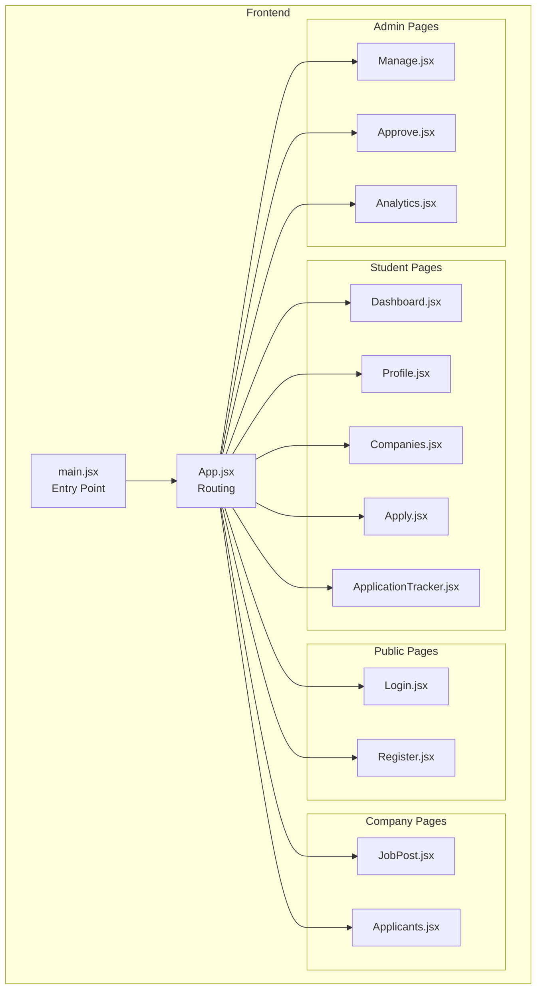
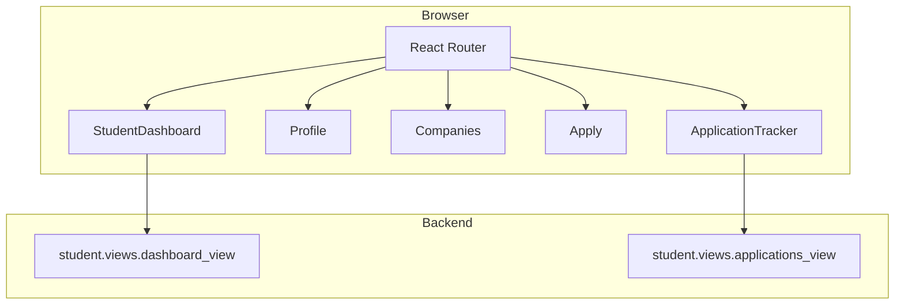
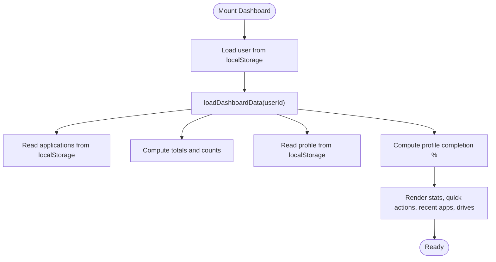
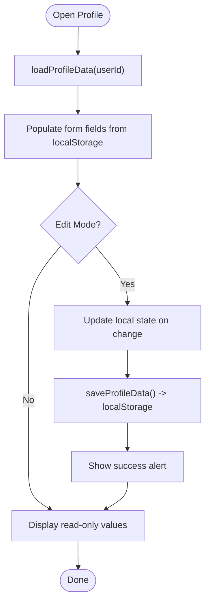
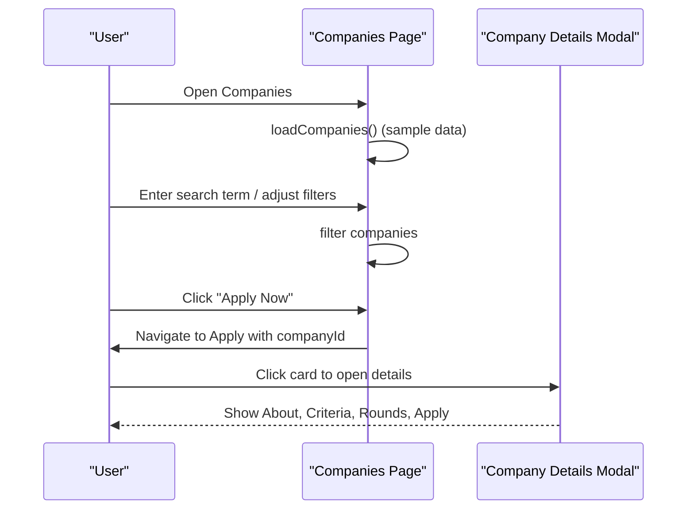
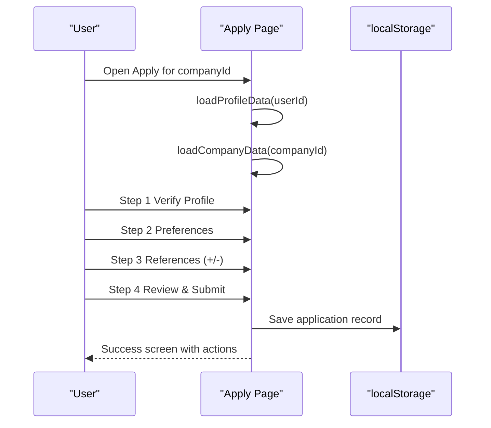
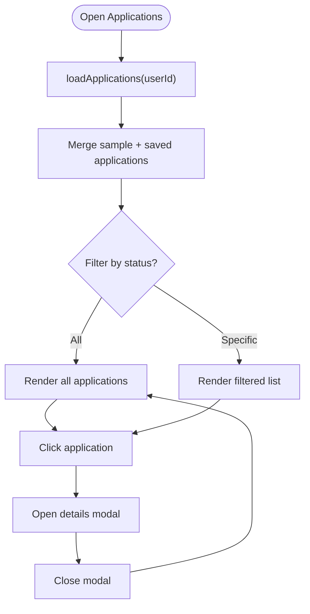
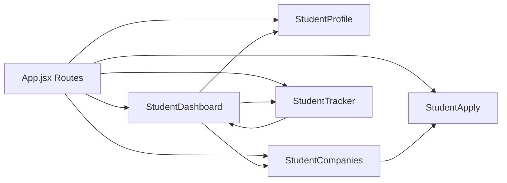
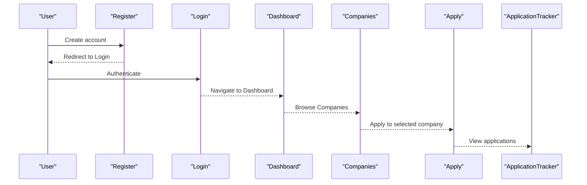

# Student Portal

<cite>
**Referenced Files in This Document**
- [App.jsx](file://frontend/src/App.jsx)
- [Dashboard.jsx](file://frontend/src/Pages/Student/Dashboard.jsx)
- [Profile.jsx](file://frontend/src/Pages/Student/Profile.jsx)
- [Companies.jsx](file://frontend/src/Pages/Student/Companies.jsx)
- [Apply.jsx](file://frontend/src/Pages/Student/Apply.jsx)
- [ApplicationTracker.jsx](file://frontend/src/Pages/Student/ApplicationTracker.jsx)
- [Login.jsx](file://frontend/src/Pages/Public/Login.jsx)
- [Register.jsx](file://frontend/src/Pages/Public/Register.jsx)
- [Applicants.jsx](file://frontend/src/Pages/Company/Applicants.jsx)
- [JobPost.jsx](file://frontend/src/Pages/Company/JobPost.jsx)
- [Analytics.jsx](file://frontend/src/Pages/TPOAdmin/Analytics.jsx)
- [Approve.jsx](file://frontend/src/Pages/TPOAdmin/Approve.jsx)
- [Manage.jsx](file://frontend/src/Pages/TPOAdmin/Manage.jsx)
- [main.jsx](file://frontend/src/main.jsx)
- [views.py](file://backend/student/views.py)
</cite>

## Table of Contents
1. [Introduction](#introduction)
2. [Project Structure](#project-structure)
3. [Core Components](#core-components)
4. [Architecture Overview](#architecture-overview)
5. [Detailed Component Analysis](#detailed-component-analysis)
6. [Dependency Analysis](#dependency-analysis)
7. [Performance Considerations](#performance-considerations)
8. [Troubleshooting Guide](#troubleshooting-guide)
9. [Conclusion](#conclusion)
10. [Appendices](#appendices)

## Introduction
This document describes the Student Portal features in the TPO Portal React application. It covers the student dashboard overview, profile management, company browsing interface, job application process, and application tracking system. It explains component architecture, state management patterns, and the end-to-end user workflow from registration through job application completion. It also outlines how the frontend integrates with backend APIs for fetching company listings, submitting applications, and tracking application status, along with form handling, error handling strategies, loading states, responsive design, component reusability, and accessibility considerations.

## Project Structure
The frontend is organized by feature pages under a Pages hierarchy, with separate folders for Student, Public, Company, and TPOAdmin areas. Routing is configured centrally in App.jsx. The main entry point initializes the React application and mounts the router.

**Diagram sources**
- [main.jsx:1-11](file://frontend/src/main.jsx#L1-L11)
- [App.jsx:1-55](file://frontend/src/App.jsx#L1-L55)

**Section sources**
- [main.jsx:1-11](file://frontend/src/main.jsx#L1-L11)
- [App.jsx:1-55](file://frontend/src/App.jsx#L1-L55)

## Core Components
- StudentDashboard: Renders the student landing page with stats, quick actions, profile completion indicator, recent applications, and upcoming drives.
- Profile: Manages personal, education, skills, certifications, projects, and work experience data; supports editing and persistence via localStorage.
- Companies: Displays available companies, allows filtering/searching, and opens a modal with company details and an apply action.
- Apply: Multi-step application form wizard with profile verification, preferences, references, and submission with validation and feedback.
- ApplicationTracker: Lists all applications, filters by status, and shows detailed timeline and next steps per application.

**Section sources**
- [Dashboard.jsx:1-456](file://frontend/src/Pages/Student/Dashboard.jsx#L1-L456)
- [Profile.jsx:1-1122](file://frontend/src/Pages/Student/Profile.jsx#L1-L1122)
- [Companies.jsx:1-646](file://frontend/src/Pages/Student/Companies.jsx#L1-L646)
- [Apply.jsx:1-893](file://frontend/src/Pages/Student/Apply.jsx#L1-L893)
- [ApplicationTracker.jsx:1-570](file://frontend/src/Pages/Student/ApplicationTracker.jsx#L1-L570)

## Architecture Overview
The frontend uses React with client-side routing. Components are self-contained and rely on localStorage for persistence during this prototype phase. The backend exposes endpoints for student dashboard and applications, which can be integrated later.

**Diagram sources**
- [App.jsx:25-51](file://frontend/src/App.jsx#L25-L51)
- [Dashboard.jsx:22-71](file://frontend/src/Pages/Student/Dashboard.jsx#L22-L71)
- [ApplicationTracker.jsx:21-136](file://frontend/src/Pages/Student/ApplicationTracker.jsx#L21-L136)
- [views.py:3-7](file://backend/student/views.py#L3-L7)

## Detailed Component Analysis

### Student Dashboard
- Purpose: Central hub for students to view application statistics, upcoming drives, and quick actions.
- State Management: Uses local storage to hydrate user profile and calculates stats and recent applications.
- UI Patterns: Responsive grid layout, status badges with theme-aware colors, and interactive cards with hover effects.
- Navigation: Quick action buttons and logout via localStorage cleanup.

**Diagram sources**
- [Dashboard.jsx:22-71](file://frontend/src/Pages/Student/Dashboard.jsx#L22-L71)

**Section sources**
- [Dashboard.jsx:1-456](file://frontend/src/Pages/Student/Dashboard.jsx#L1-L456)

### Profile Management
- Purpose: Edit and persist personal, education, skills, certifications, projects, and experience data.
- State Management: Local state per form section; data persisted to localStorage under a user-specific key.
- Forms: Controlled inputs, dynamic lists (skills, certifications, projects, experiences), and file upload placeholders.
- UX: Tabbed sections, inline editing toggle, and clear save feedback.

**Diagram sources**
- [Profile.jsx:55-94](file://frontend/src/Pages/Student/Profile.jsx#L55-L94)

**Section sources**
- [Profile.jsx:1-1122](file://frontend/src/Pages/Student/Profile.jsx#L1-L1122)

### Company Browsing Interface
- Purpose: Discover companies, filter by job type and CTC range, search by name/role/skill, and view company details.
- State Management: Search term, filters, and selection state for modal details.
- UX: Grid layout with hover effects, eligibility indicator, and apply button with eligibility check.

**Diagram sources**
- [Companies.jsx:17-194](file://frontend/src/Pages/Student/Companies.jsx#L17-L194)

**Section sources**
- [Companies.jsx:1-646](file://frontend/src/Pages/Student/Companies.jsx#L1-L646)

### Job Application Process
- Purpose: Guided multi-step application with profile verification, preferences, references, and submission.
- State Management: Wizard steps, application data, profile verification status, and submission state.
- Validation: Terms and accuracy checkboxes required before submission; controlled inputs for dynamic references.
- Persistence: Submits to localStorage with a generated ID and timestamp.

**Diagram sources**
- [Apply.jsx:40-180](file://frontend/src/Pages/Student/Apply.jsx#L40-L180)

**Section sources**
- [Apply.jsx:1-893](file://frontend/src/Pages/Student/Apply.jsx#L1-L893)

### Application Tracking System
- Purpose: View all applications, filter by status, and inspect detailed timeline and next steps.
- State Management: Loads applications from localStorage, maintains filtered list, and toggles a details modal.
- UX: Status cards with color-coded badges, timeline visualization, and navigation to browse more companies.

**Diagram sources**
- [ApplicationTracker.jsx:12-136](file://frontend/src/Pages/Student/ApplicationTracker.jsx#L12-L136)

**Section sources**
- [ApplicationTracker.jsx:1-570](file://frontend/src/Pages/Student/ApplicationTracker.jsx#L1-L570)

### Public Authentication Pages
- Login: Entry point for student authentication; clears auth keys on logout.
- Register: Registration page for new users.

**Section sources**
- [Login.jsx](file://frontend/src/Pages/Public/Login.jsx)
- [Register.jsx](file://frontend/src/Pages/Public/Register.jsx)

### Company and Admin Pages (Context)
- Company pages: Job posting and applicant management for recruiters.
- Admin pages: Manage companies, approve drives, and analytics.

**Section sources**
- [JobPost.jsx](file://frontend/src/Pages/Company/JobPost.jsx)
- [Applicants.jsx](file://frontend/src/Pages/Company/Applicants.jsx)
- [Manage.jsx](file://frontend/src/Pages/TPOAdmin/Manage.jsx)
- [Approve.jsx](file://frontend/src/Pages/TPOAdmin/Approve.jsx)
- [Analytics.jsx](file://frontend/src/Pages/TPOAdmin/Analytics.jsx)

## Dependency Analysis
- Routing: App.jsx defines all routes and maps them to page components.
- Navigation: Components use react-router-dom’s useNavigate for internal navigation.
- Persistence: All student data is stored in localStorage under user-scoped keys.
- Backend Integration: Backend student endpoints are defined; currently unimplemented in frontend.

**Diagram sources**
- [App.jsx:25-51](file://frontend/src/App.jsx#L25-L51)

**Section sources**
- [App.jsx:1-55](file://frontend/src/App.jsx#L1-L55)

## Performance Considerations
- Rendering: Components use minimal state and avoid unnecessary re-renders; localStorage reads occur on mount.
- Filtering: Client-side filtering is efficient for small datasets; pagination or server-side filtering should be considered as data grows.
- Images: Company logos are rendered as initials; consider lazy-loading and caching for larger images.
- Storage: Batch writes to localStorage; avoid frequent writes by debouncing or saving on exit.

## Troubleshooting Guide
- Authentication Issues:
  - Logging out removes all auth keys from localStorage; ensure navigation to login occurs after logout.
- Application Submission:
  - Submission requires both terms checkboxes; ensure they are checked before enabling submit.
  - Loading spinner indicates submission in progress; disable navigation until complete.
- Data Not Persisting:
  - Profile and applications are stored in localStorage; verify keys exist for the current user ID.
- Backend Integration:
  - Backend endpoints exist for dashboard and applications; integrate API calls to replace localStorage usage.

**Section sources**
- [Dashboard.jsx:73-82](file://frontend/src/Pages/Student/Dashboard.jsx#L73-L82)
- [Apply.jsx:860-884](file://frontend/src/Pages/Student/Apply.jsx#L860-L884)
- [ApplicationTracker.jsx:147-153](file://frontend/src/Pages/Student/ApplicationTracker.jsx#L147-L153)
- [views.py:3-7](file://backend/student/views.py#L3-L7)

## Conclusion
The Student Portal provides a cohesive, step-by-step experience for students to manage profiles, discover companies, apply to positions, and track outcomes. The current implementation relies on localStorage for simplicity, while the backend exposes endpoints ready for integration. The modular component architecture, consistent navigation, and clear state management patterns support maintainability and future enhancements.

## Appendices

### User Workflow: From Registration to Application Completion

[No sources needed since this diagram shows conceptual workflow, not actual code structure]