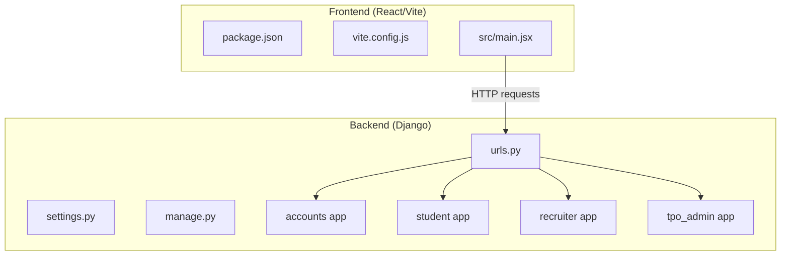
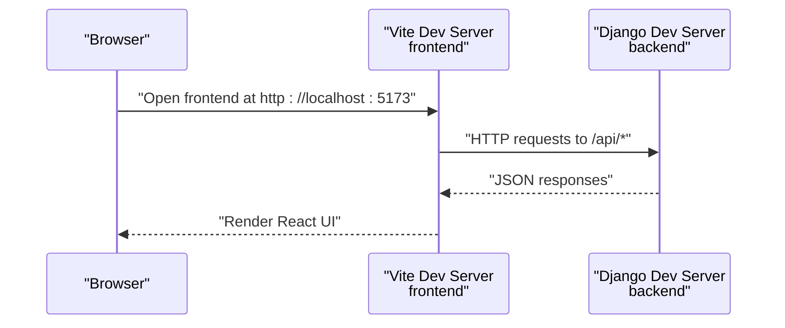
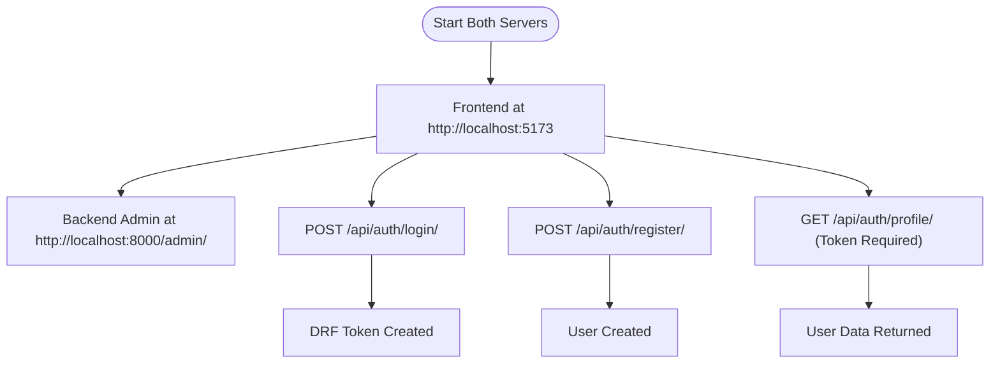

# Getting Started

<cite>
**Referenced Files in This Document**
- [backend/manage.py](file://backend/manage.py)
- [backend/backend/settings.py](file://backend/backend/settings.py)
- [backend/backend/urls.py](file://backend/backend/urls.py)
- [backend/accounts/models.py](file://backend/accounts/models.py)
- [backend/accounts/views.py](file://backend/accounts/views.py)
- [backend/accounts/urls.py](file://backend/accounts/urls.py)
- [backend/accounts/migrations/0001_initial.py](file://backend/accounts/migrations/0001_initial.py)
- [frontend/package.json](file://frontend/package.json)
- [frontend/vite.config.js](file://frontend/vite.config.js)
- [frontend/src/main.jsx](file://frontend/src/main.jsx)
- [frontend/README.md](file://frontend/README.md)
</cite>

## Table of Contents
1. [Introduction](#introduction)
2. [Project Structure](#project-structure)
3. [Prerequisites](#prerequisites)
4. [Installation](#installation)
5. [Environment Setup](#environment-setup)
6. [Database Configuration](#database-configuration)
7. [Initial Project Setup](#initial-project-setup)
8. [Development Servers](#development-servers)
9. [Verification](#verification)
10. [Troubleshooting](#troubleshooting)
11. [IDE Recommendations](#ide-recommendations)
12. [Conclusion](#conclusion)

## Introduction
This guide helps you set up and run the TPO Portal locally. It covers prerequisites, backend and frontend installation, environment configuration, database setup, running development servers, verification steps, and troubleshooting. The portal consists of:
- Backend: Django application with Django REST Framework and token-based authentication
- Frontend: React application built with Vite and Tailwind CSS

## Project Structure
The repository is split into two main parts:
- backend: Django project with apps for accounts, student, recruiter, and tpo_admin
- frontend: React SPA with routing, services, and UI components

**Diagram sources**
- [backend/backend/urls.py:1-11](file://backend/backend/urls.py#L1-L11)
- [backend/manage.py:1-23](file://backend/manage.py#L1-L23)
- [frontend/package.json:1-34](file://frontend/package.json#L1-L34)
- [frontend/vite.config.js:1-9](file://frontend/vite.config.js#L1-L9)
- [frontend/src/main.jsx:1-11](file://frontend/src/main.jsx#L1-L11)

**Section sources**
- [backend/backend/urls.py:1-11](file://backend/backend/urls.py#L1-L11)
- [frontend/package.json:1-34](file://frontend/package.json#L1-L34)

## Prerequisites
Ensure your machine meets the following requirements before proceeding:
- Python 3.8 or newer
- Node.js 16 or newer
- Git (recommended for cloning and version control)
- A modern browser for testing the frontend

These versions satisfy the project’s dependencies:
- Backend uses Django and Django REST Framework
- Frontend uses React, Vite, and Tailwind CSS

**Section sources**
- [backend/backend/settings.py:1-126](file://backend/backend/settings.py#L1-L126)
- [frontend/package.json:1-34](file://frontend/package.json#L1-L34)

## Installation
Follow these steps to install the project locally.

### Clone the Repository
Clone the repository to your local machine using Git.

### Backend (Django)
1. Navigate to the backend directory.
2. Create a virtual environment and activate it.
3. Install Python dependencies using pip.

Key backend configuration files:
- Settings: [backend/backend/settings.py:1-126](file://backend/backend/settings.py#L1-L126)
- URLs: [backend/backend/urls.py:1-11](file://backend/backend/urls.py#L1-L11)
- Management script: [backend/manage.py:1-23](file://backend/manage.py#L1-L23)

### Frontend (React)
1. Navigate to the frontend directory.
2. Install Node.js dependencies using npm.

Key frontend configuration files:
- Scripts and dependencies: [frontend/package.json:1-34](file://frontend/package.json#L1-L34)
- Vite config: [frontend/vite.config.js:1-9](file://frontend/vite.config.js#L1-L9)
- Entry point: [frontend/src/main.jsx:1-11](file://frontend/src/main.jsx#L1-L11)

**Section sources**
- [backend/manage.py:1-23](file://backend/manage.py#L1-L23)
- [backend/backend/settings.py:1-126](file://backend/backend/settings.py#L1-L126)
- [backend/backend/urls.py:1-11](file://backend/backend/urls.py#L1-L11)
- [frontend/package.json:1-34](file://frontend/package.json#L1-L34)
- [frontend/vite.config.js:1-9](file://frontend/vite.config.js#L1-L9)
- [frontend/src/main.jsx:1-11](file://frontend/src/main.jsx#L1-L11)

## Environment Setup
Configure environment variables and static/media handling for development.

- Backend settings:
  - Secret key and debug mode are configured in [backend/backend/settings.py:10-16](file://backend/backend/settings.py#L10-L16)
  - Installed apps include third-party packages for REST and CORS in [backend/backend/settings.py:27-45](file://backend/backend/settings.py#L27-L45)
  - Static files configuration is defined in [backend/backend/settings.py:122-126](file://backend/backend/settings.py#L122-L126)

- Frontend build and scripts:
  - Development, build, and preview commands are defined in [frontend/package.json:6-11](file://frontend/package.json#L6-L11)
  - Vite plugin configuration for React and Tailwind is in [frontend/vite.config.js:1-9](file://frontend/vite.config.js#L1-L9)

**Section sources**
- [backend/backend/settings.py:10-16](file://backend/backend/settings.py#L10-L16)
- [backend/backend/settings.py:27-45](file://backend/backend/settings.py#L27-L45)
- [backend/backend/settings.py:122-126](file://backend/backend/settings.py#L122-L126)
- [frontend/package.json:6-11](file://frontend/package.json#L6-L11)
- [frontend/vite.config.js:1-9](file://frontend/vite.config.js#L1-L9)

## Database Configuration
The project uses SQLite by default for development. The database configuration is located in the backend settings.

- Default database configuration:
  - Engine and database path are defined in [backend/backend/settings.py:81-86](file://backend/backend/settings.py#L81-L86)

- User model customization:
  - The custom User model extends AbstractUser and adds a role field in [backend/accounts/models.py:1-25](file://backend/accounts/models.py#L1-L25)

- Initial migration:
  - An initial migration for the User model is present in [backend/accounts/migrations/0001_initial.py:1-46](file://backend/accounts/migrations/0001_initial.py#L1-L46)

Notes:
- SQLite is suitable for local development.
- No external database service is required for basic setup.

**Section sources**
- [backend/backend/settings.py:81-86](file://backend/backend/settings.py#L81-L86)
- [backend/accounts/models.py:1-25](file://backend/accounts/models.py#L1-L25)
- [backend/accounts/migrations/0001_initial.py:1-46](file://backend/accounts/migrations/0001_initial.py#L1-L46)

## Initial Project Setup
Perform the following steps to prepare the project for development.

### Backend
1. Apply migrations to create database tables:
   - Run the migration command from the backend directory using the manage.py script.
   - Reference: [backend/manage.py:1-23](file://backend/manage.py#L1-L23)
2. Verify installed apps and middleware:
   - Confirm REST framework and CORS-related apps are included in [backend/backend/settings.py:27-45](file://backend/backend/settings.py#L27-L45)
3. Confirm URL routing:
   - Ensure API routes for accounts, student, recruiter, and admin are included in [backend/backend/urls.py:4-10](file://backend/backend/urls.py#L4-L10)

### Frontend
1. Install dependencies:
   - Use npm to install dependencies defined in [frontend/package.json:1-34](file://frontend/package.json#L1-L34)
2. Verify Vite configuration:
   - React and Tailwind plugins are configured in [frontend/vite.config.js:1-9](file://frontend/vite.config.js#L1-L9)
3. Confirm entry point:
   - The React root is initialized in [frontend/src/main.jsx:1-11](file://frontend/src/main.jsx#L1-L11)

**Section sources**
- [backend/manage.py:1-23](file://backend/manage.py#L1-L23)
- [backend/backend/settings.py:27-45](file://backend/backend/settings.py#L27-L45)
- [backend/backend/urls.py:4-10](file://backend/backend/urls.py#L4-L10)
- [frontend/package.json:1-34](file://frontend/package.json#L1-L34)
- [frontend/vite.config.js:1-9](file://frontend/vite.config.js#L1-L9)
- [frontend/src/main.jsx:1-11](file://frontend/src/main.jsx#L1-L11)

## Development Servers
Start the backend and frontend servers to run the application locally.

### Backend (Django)
- Use the manage.py script to run the development server.
- Reference: [backend/manage.py:1-23](file://backend/manage.py#L1-L23)
- The server listens on the default Django port (commonly 8000).

### Frontend (React/Vite)
- Use the dev script defined in [frontend/package.json:6-11](file://frontend/package.json#L6-L11) to start Vite’s development server.
- Vite is configured with React and Tailwind in [frontend/vite.config.js:1-9](file://frontend/vite.config.js#L1-L9)
- The frontend runs on port 5173 by default.

### CORS Configuration
- The backend allows origins for the frontend development server in [backend/backend/settings.py:18-22](file://backend/backend/settings.py#L18-L22)
- Ensure the frontend runs on http://localhost:5173 or http://127.0.0.1:5173 during development.

**Diagram sources**
- [backend/backend/settings.py:18-22](file://backend/backend/settings.py#L18-L22)
- [backend/backend/urls.py:4-10](file://backend/backend/urls.py#L4-L10)
- [frontend/package.json:6-11](file://frontend/package.json#L6-L11)

**Section sources**
- [backend/manage.py:1-23](file://backend/manage.py#L1-L23)
- [frontend/package.json:6-11](file://frontend/package.json#L6-L11)
- [frontend/vite.config.js:1-9](file://frontend/vite.config.js#L1-L9)
- [backend/backend/settings.py:18-22](file://backend/backend/settings.py#L18-L22)
- [backend/backend/urls.py:4-10](file://backend/backend/urls.py#L4-L10)

## Verification
After starting both servers, verify the setup by checking the following:

- Backend health:
  - Visit the Django admin route at /admin/ on the backend server.
  - Confirm the accounts app routes are reachable via /api/auth/.

- Frontend rendering:
  - Open http://localhost:5173 in your browser.
  - Ensure the React application loads without build errors.

- Authentication endpoints:
  - The accounts app exposes login, register, profile, and logout endpoints defined in [backend/accounts/urls.py:1-10](file://backend/accounts/urls.py#L1-L10).
  - Example flows:
    - Login: [backend/accounts/views.py:13-45](file://backend/accounts/views.py#L13-L45)
    - Registration: [backend/accounts/views.py:48-75](file://backend/accounts/views.py#L48-L75)
    - Protected profile: [backend/accounts/views.py:78-89](file://backend/accounts/views.py#L78-L89)

- User model:
  - The custom User model supports roles and is defined in [backend/accounts/models.py:1-25](file://backend/accounts/models.py#L1-L25).

**Diagram sources**
- [backend/accounts/urls.py:1-10](file://backend/accounts/urls.py#L1-L10)
- [backend/accounts/views.py:13-45](file://backend/accounts/views.py#L13-L45)
- [backend/accounts/views.py:48-75](file://backend/accounts/views.py#L48-L75)
- [backend/accounts/views.py:78-89](file://backend/accounts/views.py#L78-L89)
- [backend/accounts/models.py:1-25](file://backend/accounts/models.py#L1-L25)

**Section sources**
- [backend/accounts/urls.py:1-10](file://backend/accounts/urls.py#L1-L10)
- [backend/accounts/views.py:13-45](file://backend/accounts/views.py#L13-L45)
- [backend/accounts/views.py:48-75](file://backend/accounts/views.py#L48-L75)
- [backend/accounts/views.py:78-89](file://backend/accounts/views.py#L78-L89)
- [backend/accounts/models.py:1-25](file://backend/accounts/models.py#L1-L25)

## Troubleshooting
Common setup issues and resolutions:

- Django import error on Windows:
  - Symptom: ImportError when running manage.py.
  - Cause: Missing or inactive virtual environment.
  - Resolution: Activate your virtual environment and rerun the manage.py command.
  - Reference: [backend/manage.py:10-17](file://backend/manage.py#L10-L17)

- CORS errors in development:
  - Symptom: Frontend requests blocked by CORS policy.
  - Cause: Frontend origin not allowed by backend.
  - Resolution: Ensure frontend runs at http://localhost:5173 or http://127.0.0.1:5173 as configured in [backend/backend/settings.py:18-22](file://backend/backend/settings.py#L18-L22)

- Port conflicts:
  - Symptom: Port 5173 or 8000 already in use.
  - Resolution: Stop the conflicting process or configure Vite to use another port via [frontend/package.json:6-11](file://frontend/package.json#L6-L11) and adjust backend ALLOWED_HOSTS accordingly.

- Missing migrations:
  - Symptom: Database errors after fresh clone.
  - Resolution: Apply migrations using the manage.py script in the backend directory.
  - Reference: [backend/manage.py:1-23](file://backend/manage.py#L1-L23)

- Node/npm issues:
  - Symptom: npm install fails.
  - Resolution: Clear npm cache and retry; ensure Node.js version meets the requirement.
  - Reference: [frontend/package.json:1-34](file://frontend/package.json#L1-L34)

**Section sources**
- [backend/manage.py:10-17](file://backend/manage.py#L10-L17)
- [backend/backend/settings.py:18-22](file://backend/backend/settings.py#L18-L22)
- [frontend/package.json:6-11](file://frontend/package.json#L6-L11)
- [backend/manage.py:1-23](file://backend/manage.py#L1-L23)
- [frontend/package.json:1-34](file://frontend/package.json#L1-L34)

## IDE Recommendations
Recommended IDEs and extensions for a smooth development experience:
- VS Code:
  - Extensions: Prettier, ESLint, Tailwind CSS IntelliSense, Python
- WebStorm:
  - Built-in support for React, Vite, and Tailwind CSS
- Sublime Text:
  - Packages for JSX, Tailwind CSS, and Python

Workflow tips:
- Keep backend and frontend terminals open for concurrent development.
- Use ESLint and Prettier for consistent formatting in the frontend.
- Use Python linters/formatters in the backend.

[No sources needed since this section provides general guidance]

## Conclusion
You now have the TPO Portal running locally with Django serving the backend API and React/Vite serving the frontend. Use the verification steps to confirm functionality and refer to the troubleshooting section for common issues. For further development, follow your team’s branching and deployment practices.

[No sources needed since this section summarizes without analyzing specific files]