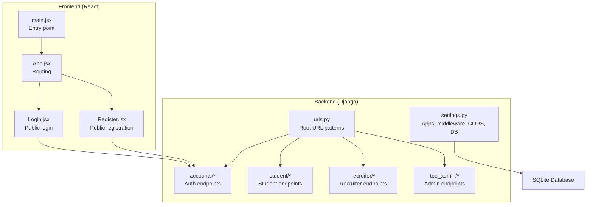
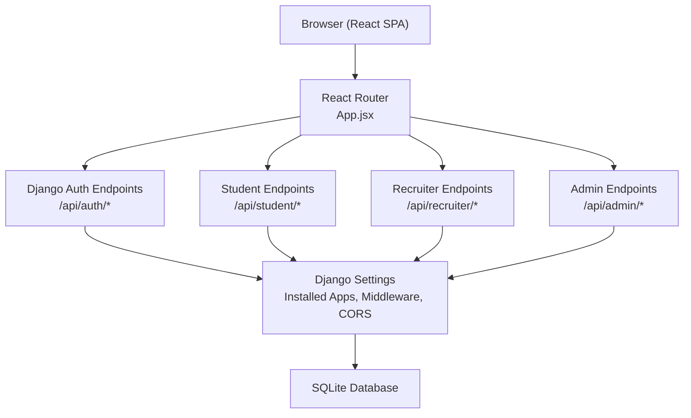
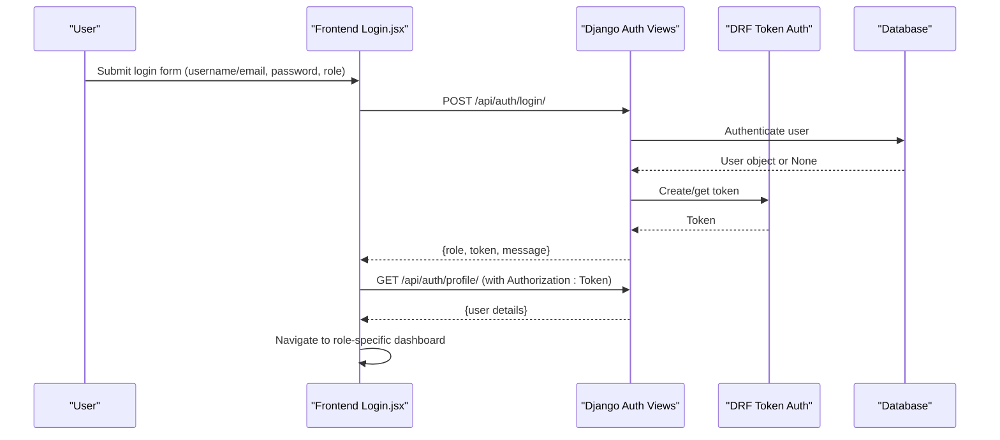
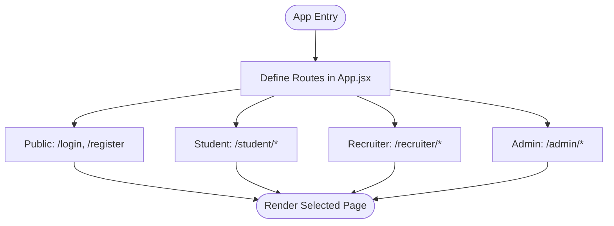
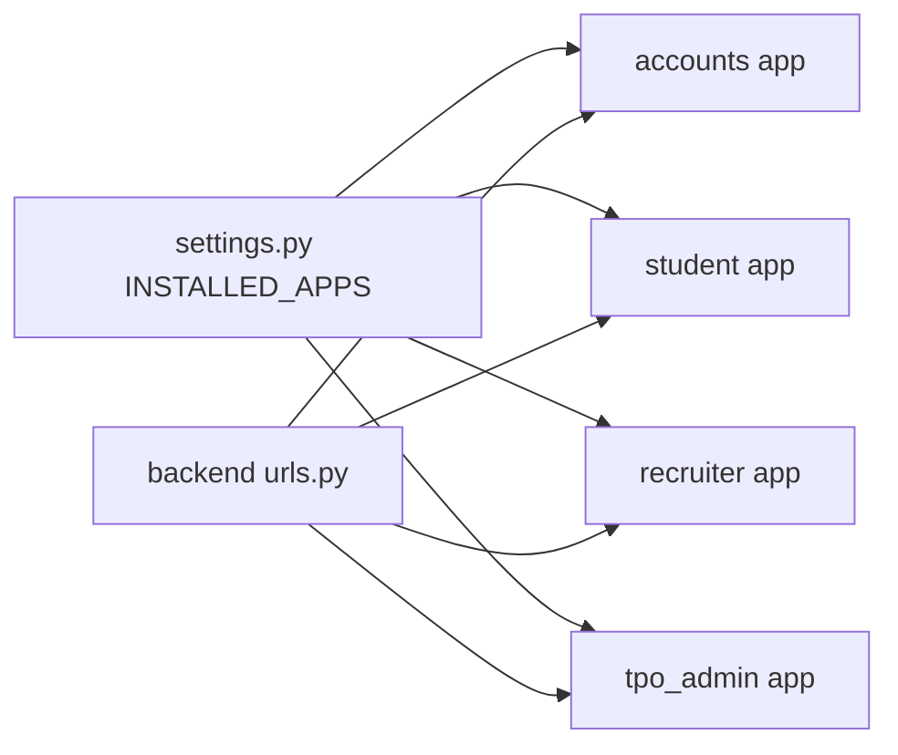

# Project Overview

<cite>
**Referenced Files in This Document**
- [backend/settings.py](file://backend/backend/settings.py)
- [backend/urls.py](file://backend/backend/urls.py)
- [accounts/models.py](file://backend/accounts/models.py)
- [accounts/views.py](file://backend/accounts/views.py)
- [accounts/urls.py](file://backend/accounts/urls.py)
- [student/urls.py](file://backend/student/urls.py)
- [recruiter/urls.py](file://backend/recruiter/urls.py)
- [tpo_admin/urls.py](file://backend/tpo_admin/urls.py)
- [frontend/package.json](file://frontend/package.json)
- [frontend/src/main.jsx](file://frontend/src/main.jsx)
- [frontend/src/App.jsx](file://frontend/src/App.jsx)
- [frontend/src/Pages/Public/Login.jsx](file://frontend/src/Pages/Public/Login.jsx)
- [frontend/src/Pages/Public/Register.jsx](file://frontend/src/Pages/Public/Register.jsx)
</cite>

## Table of Contents
1. [Introduction](#introduction)
2. [Project Structure](#project-structure)
3. [Core Components](#core-components)
4. [Architecture Overview](#architecture-overview)
5. [Detailed Component Analysis](#detailed-component-analysis)
6. [Dependency Analysis](#dependency-analysis)
7. [Performance Considerations](#performance-considerations)
8. [Troubleshooting Guide](#troubleshooting-guide)
9. [Conclusion](#conclusion)
10. [Appendices](#appendices)

## Introduction
The TPO Portal is a campus placement management system designed for educational institutions to streamline interactions among students, recruiters, and Training & Placement (T&P) administrators. It provides a centralized platform to publish job drives, manage applications, track outcomes, and analyze placement analytics. The system supports a multi-role authentication model with distinct workflows for students, recruiters, and TPO administrators, enabling efficient coordination during campus recruitment.

Key benefits include:
- Centralized job posting and application tracking
- Role-specific dashboards and permissions
- Analytics and reporting for placement insights
- Seamless integration between frontend and backend for a responsive user experience

Target audience:
- Students: Browse companies, apply to jobs, track application status
- Recruiters: Post job drives, review applicants, manage hiring workflows
- TPO Administrators: Approve drives, manage companies, analyze placement metrics

Real-world application:
- Automates manual placement processes
- Reduces administrative overhead
- Enhances transparency and data-driven decision-making for placement teams

Educational value:
- Demonstrates full-stack development with Django and React
- Highlights role-based access control and token-authenticated APIs
- Serves as a practical example of building scalable web applications for institutional use

## Project Structure
The project follows a clear separation of concerns:
- Backend: Django application exposing REST endpoints for authentication and feature modules
- Frontend: React SPA with client-side routing and local storage-based session management
- Shared configuration: Settings define installed apps, middleware, CORS, and database

**Diagram sources**
- [backend/backend/settings.py:27-45](file://backend/backend/settings.py#L27-L45)
- [backend/backend/urls.py:4-10](file://backend/backend/urls.py#L4-L10)
- [backend/accounts/urls.py:4-9](file://backend/accounts/urls.py#L4-L9)
- [frontend/src/main.jsx:1-11](file://frontend/src/main.jsx#L1-L11)
- [frontend/src/App.jsx:25-52](file://frontend/src/App.jsx#L25-L52)
- [frontend/src/Pages/Public/Login.jsx:17-55](file://frontend/src/Pages/Public/Login.jsx#L17-L55)
- [frontend/src/Pages/Public/Register.jsx:20-40](file://frontend/src/Pages/Public/Register.jsx#L20-L40)

**Section sources**
- [backend/backend/settings.py:27-45](file://backend/backend/settings.py#L27-L45)
- [backend/backend/urls.py:4-10](file://backend/backend/urls.py#L4-L10)
- [frontend/src/main.jsx:1-11](file://frontend/src/main.jsx#L1-L11)
- [frontend/src/App.jsx:25-52](file://frontend/src/App.jsx#L25-L52)

## Core Components
- Multi-role user model with roles: student, recruiter, and TPO admin
- Token-based authentication via Django REST Framework
- Public pages for login and registration
- Protected routes for each role’s domain
- Feature modules for student, recruiter, and admin domains

Technology stack overview:
- Backend: Django, Django REST Framework, djangorestframework-simple-token, django-cors-headers, SQLite
- Frontend: React, react-router-dom, axios, Tailwind CSS via Vite
- Development: Vite for bundling and hot reload

**Section sources**
- [accounts/models.py:4-25](file://backend/accounts/models.py#L4-L25)
- [accounts/views.py:13-95](file://backend/accounts/views.py#L13-L95)
- [accounts/urls.py:4-9](file://backend/accounts/urls.py#L4-L9)
- [frontend/package.json:12-18](file://frontend/package.json#L12-L18)
- [frontend/src/Pages/Public/Login.jsx:17-55](file://frontend/src/Pages/Public/Login.jsx#L17-L55)
- [frontend/src/Pages/Public/Register.jsx:20-40](file://frontend/src/Pages/Public/Register.jsx#L20-L40)

## Architecture Overview
High-level architecture:
- Frontend (React) communicates with backend (Django) via REST endpoints
- Authentication endpoints issue tokens; subsequent requests include Authorization headers
- URLs are grouped by role to maintain clean separation of concerns
- SQLite serves as the default database for development

**Diagram sources**
- [backend/backend/urls.py:4-10](file://backend/backend/urls.py#L4-L10)
- [backend/backend/settings.py:27-45](file://backend/backend/settings.py#L27-L45)
- [frontend/src/App.jsx:25-52](file://frontend/src/App.jsx#L25-L52)

## Detailed Component Analysis

### Authentication and Authorization
- User model extends AbstractUser with a role field and convenience methods
- Login supports dual input (username or email) and returns a token upon success
- Registration creates users with specified roles
- Profile endpoint requires a valid token and returns user details
- Logout clears the current session

**Diagram sources**
- [frontend/src/Pages/Public/Login.jsx:17-55](file://frontend/src/Pages/Public/Login.jsx#L17-L55)
- [backend/accounts/views.py:13-95](file://backend/accounts/views.py#L13-L95)
- [backend/accounts/urls.py:4-9](file://backend/accounts/urls.py#L4-L9)

**Section sources**
- [accounts/models.py:4-25](file://backend/accounts/models.py#L4-L25)
- [accounts/views.py:13-95](file://backend/accounts/views.py#L13-L95)
- [accounts/urls.py:4-9](file://backend/accounts/urls.py#L4-L9)
- [frontend/src/Pages/Public/Login.jsx:17-55](file://frontend/src/Pages/Public/Login.jsx#L17-L55)

### Routing and Navigation
- Client-side routing defines public, student, recruiter, and admin routes
- Default route redirects to login
- Navigation depends on the returned role after successful login

**Diagram sources**
- [frontend/src/App.jsx:25-52](file://frontend/src/App.jsx#L25-L52)

**Section sources**
- [frontend/src/App.jsx:25-52](file://frontend/src/App.jsx#L25-L52)

### Technology Stack Details
- Backend
  - Django: Web framework
  - Django REST Framework: API framework and token authentication
  - django-cors-headers: Cross-origin support for local development
  - SQLite: Lightweight database for development
- Frontend
  - React: UI library
  - react-router-dom: Client-side routing
  - axios: HTTP client (present in dependencies)
  - Tailwind CSS via Vite: Styling and build tooling

**Section sources**
- [backend/backend/settings.py:27-45](file://backend/backend/settings.py#L27-L45)
- [frontend/package.json:12-18](file://frontend/package.json#L12-L18)

## Dependency Analysis
- Installed apps include core Django apps plus custom apps for accounts, student, recruiter, and tpo_admin
- Middleware includes CORS and session-related middlewares
- Root URLs include namespace prefixes for auth, student, recruiter, and admin
- Authentication relies on DRF token authentication and a custom user model

**Diagram sources**
- [backend/backend/settings.py:27-45](file://backend/backend/settings.py#L27-L45)
- [backend/backend/urls.py:4-10](file://backend/backend/urls.py#L4-L10)

**Section sources**
- [backend/backend/settings.py:27-45](file://backend/backend/settings.py#L27-L45)
- [backend/backend/urls.py:4-10](file://backend/backend/urls.py#L4-L10)

## Performance Considerations
- SQLite is suitable for development and small-scale deployments; consider scaling to PostgreSQL or MySQL for production
- Token-based authentication reduces server-side session overhead
- Client-side routing minimizes server round trips for navigation
- Keep frontend and backend on the same origin during development to avoid CORS complexities

## Troubleshooting Guide
Common issues and resolutions:
- CORS errors: Ensure frontend origin matches configured CORS allowed origins
- Authentication failures: Verify token presence in Authorization header for protected endpoints
- Database connectivity: Confirm SQLite path and permissions
- Routing issues: Validate route definitions and navigation logic

**Section sources**
- [backend/backend/settings.py:18-22](file://backend/backend/settings.py#L18-L22)
- [accounts/views.py:78-95](file://backend/accounts/views.py#L78-L95)

## Conclusion
The TPO Portal demonstrates a practical, full-stack solution for campus placement management. Its multi-role architecture, token-based authentication, and modular backend design provide a solid foundation for educational institutions to digitize and optimize their placement processes. The project’s structure and technologies offer strong educational value for learning modern web development patterns and real-world application design.

## Appendices
- Use case scenarios:
  - Students browse available drives, submit applications, and track results
  - Recruiters post job drives, review applicant profiles, and manage shortlists
  - TPO administrators approve drives, manage company listings, and generate analytics reports