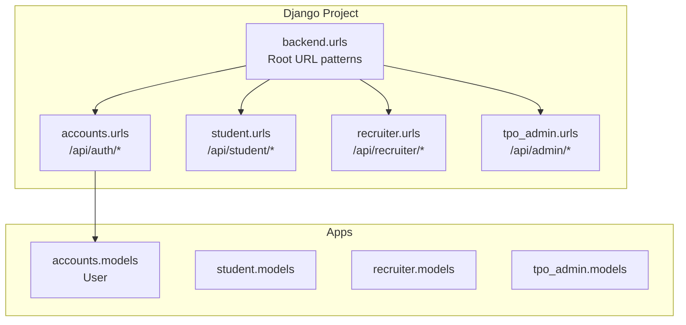
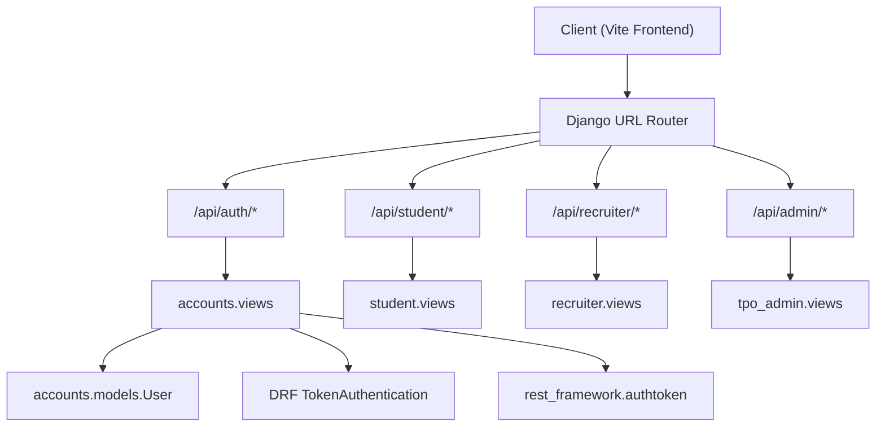
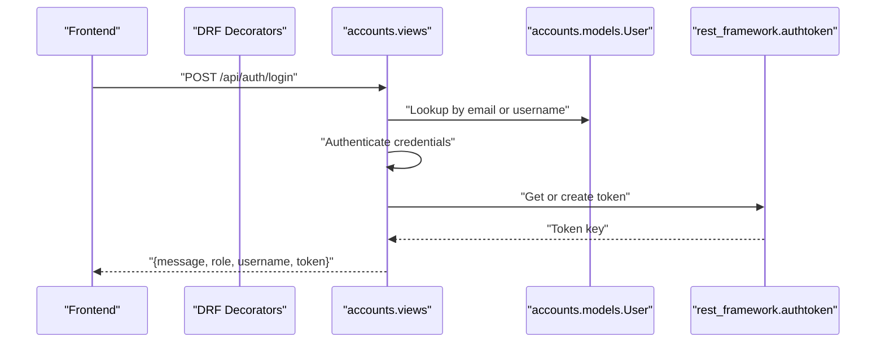
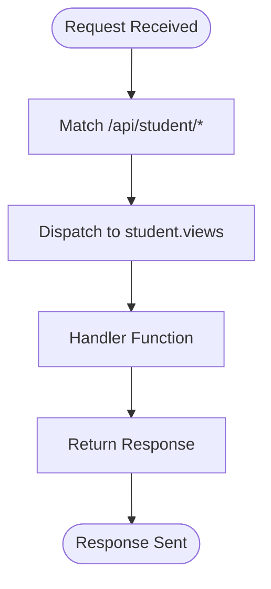
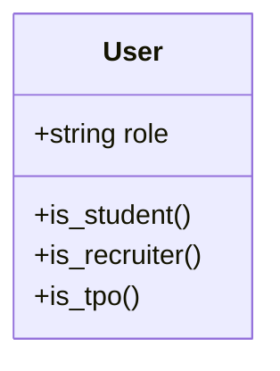
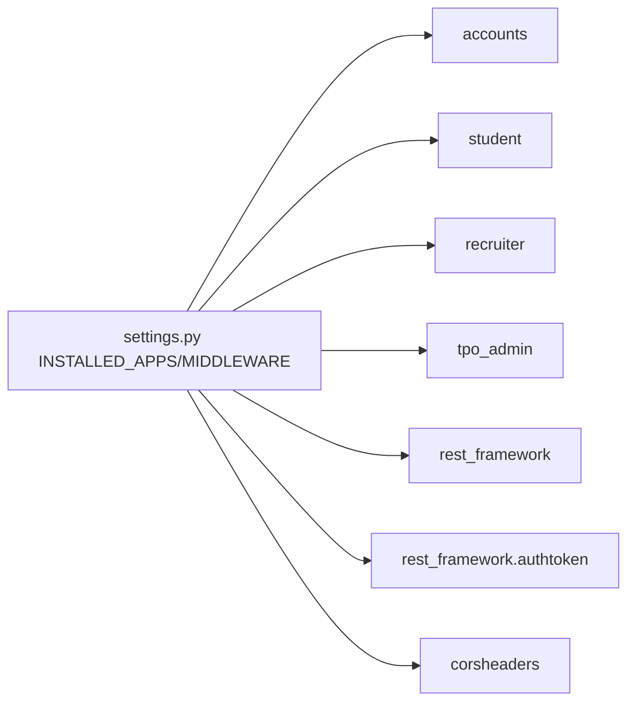

# Backend Architecture

<cite>
**Referenced Files in This Document**
- [settings.py](file://backend/backend/settings.py)
- [urls.py](file://backend/backend/urls.py)
- [wsgi.py](file://backend/backend/wsgi.py)
- [asgi.py](file://backend/backend/asgi.py)
- [models.py](file://backend/accounts/models.py)
- [views.py](file://backend/accounts/views.py)
- [urls.py](file://backend/accounts/urls.py)
- [models.py](file://backend/student/models.py)
- [urls.py](file://backend/student/urls.py)
- [models.py](file://backend/recruiter/models.py)
- [urls.py](file://backend/recruiter/urls.py)
- [models.py](file://backend/tpo_admin/models.py)
- [urls.py](file://backend/tpo_admin/urls.py)
- [apps.py](file://backend/accounts/apps.py)
- [apps.py](file://backend/student/apps.py)
- [apps.py](file://backend/recruiter/apps.py)
- [apps.py](file://backend/tpo_admin/apps.py)
</cite>

## Table of Contents
1. [Introduction](#introduction)
2. [Project Structure](#project-structure)
3. [Core Components](#core-components)
4. [Architecture Overview](#architecture-overview)
5. [Detailed Component Analysis](#detailed-component-analysis)
6. [Dependency Analysis](#dependency-analysis)
7. [Performance Considerations](#performance-considerations)
8. [Troubleshooting Guide](#troubleshooting-guide)
9. [Conclusion](#conclusion)

## Introduction
This document describes the Django backend architecture for the TPO portal. It explains how the system follows an MVC-like pattern, the modular app structure (accounts, student, recruiter, tpo_admin), URL routing, Django REST Framework integration, authentication and CORS configuration, database abstraction and models, WSGI/ASGI deployment, environment settings, and separation of concerns across apps. It also outlines API design principles, request-response flow, and error handling patterns.

## Project Structure
The backend is organized around a central Django project with four primary pluggable apps:
- accounts: Centralized authentication and user roles
- student: Student-centric features
- recruiter: Recruiter-centric features
- tpo_admin: Administration features

Routing is centralized under the project’s root URLs, which include each app’s URL patterns under API prefixes. Settings define installed apps, middleware, CORS, authentication model, and database configuration.

**Diagram sources**
- [urls.py:1-11](file://backend/backend/urls.py#L1-L11)
- [urls.py:1-10](file://backend/accounts/urls.py#L1-L10)
- [urls.py:1-8](file://backend/student/urls.py#L1-L8)
- [urls.py:1-8](file://backend/recruiter/urls.py#L1-L8)
- [urls.py:1-9](file://backend/tpo_admin/urls.py#L1-L9)
- [models.py:1-25](file://backend/accounts/models.py#L1-L25)

**Section sources**
- [urls.py:1-11](file://backend/backend/urls.py#L1-L11)
- [settings.py:27-45](file://backend/backend/settings.py#L27-L45)

## Core Components
- Authentication and User Model
  - A custom User model extends Django’s AbstractUser and adds a role field with choices for student, recruiter, and TPO admin. The AUTH_USER_MODEL setting points to this custom model.
  - The accounts app exposes login, registration, profile retrieval, and logout endpoints.

- REST Framework and Token Authentication
  - The accounts views integrate DRF decorators and TokenAuthentication for protected endpoints. Token creation occurs upon successful login.

- Middleware and CORS
  - CORS middleware is configured to allow requests from the local Vite dev server origin. Security, session, CSRF, and message middlewares are enabled.

- Database and Models
  - SQLite is configured as the default database. The accounts app defines the User model; other apps currently have empty models.py files.

- WSGI and ASGI
  - Both WSGI and ASGI applications are configured via standard Django entry points.

**Section sources**
- [models.py:1-25](file://backend/accounts/models.py#L1-L25)
- [settings.py:119-126](file://backend/backend/settings.py#L119-L126)
- [views.py:1-95](file://backend/accounts/views.py#L1-L95)
- [settings.py:18-22](file://backend/backend/settings.py#L18-L22)
- [settings.py:47-56](file://backend/backend/settings.py#L47-L56)
- [settings.py:81-86](file://backend/backend/settings.py#L81-L86)
- [wsgi.py:1-17](file://backend/backend/wsgi.py#L1-L17)
- [asgi.py:1-17](file://backend/backend/asgi.py#L1-L17)

## Architecture Overview
The system follows a layered MVC-like structure:
- Views handle HTTP requests and responses, delegating to models and returning serialized data.
- Models encapsulate data and business rules (currently minimal in most apps).
- Templates are configured but not actively used; the app acts as an API backend.
- Routing directs API traffic to app-specific URL patterns.

**Diagram sources**
- [urls.py:1-11](file://backend/backend/urls.py#L1-L11)
- [urls.py:1-10](file://backend/accounts/urls.py#L1-L10)
- [urls.py:1-8](file://backend/student/urls.py#L1-L8)
- [urls.py:1-8](file://backend/recruiter/urls.py#L1-L8)
- [urls.py:1-9](file://backend/tpo_admin/urls.py#L1-L9)
- [views.py:1-95](file://backend/accounts/views.py#L1-L95)
- [models.py:1-25](file://backend/accounts/models.py#L1-L25)
- [settings.py:42-44](file://backend/backend/settings.py#L42-L44)

## Detailed Component Analysis

### Accounts App
- Purpose: Authentication and user profile management
- Key endpoints:
  - POST /api/auth/login: Accepts username/email and password; supports dual-login; returns role, username, and token on success.
  - POST /api/auth/register: Creates a new user with validated inputs.
  - GET /api/auth/profile: Protected endpoint using DRF token authentication.
  - POST /api/auth/logout: Logs out current session.

**Diagram sources**
- [views.py:13-45](file://backend/accounts/views.py#L13-L45)
- [models.py:1-25](file://backend/accounts/models.py#L1-L25)

**Section sources**
- [urls.py:1-10](file://backend/accounts/urls.py#L1-L10)
- [views.py:1-95](file://backend/accounts/views.py#L1-L95)
- [models.py:1-25](file://backend/accounts/models.py#L1-L25)

### Student App
- Purpose: Student dashboard and application tracking
- Endpoints:
  - GET /api/student/dashboard
  - GET /api/student/applications

**Diagram sources**
- [urls.py:1-8](file://backend/student/urls.py#L1-L8)

**Section sources**
- [urls.py:1-8](file://backend/student/urls.py#L1-L8)
- [models.py:1-4](file://backend/student/models.py#L1-L4)

### Recruiter App
- Purpose: Job posting and applicant management
- Endpoints:
  - POST /api/recruiter/post-job
  - GET /api/recruiter/applicants

**Section sources**
- [urls.py:1-8](file://backend/recruiter/urls.py#L1-L8)
- [models.py:1-4](file://backend/recruiter/models.py#L1-L4)

### TPO Admin App
- Purpose: Administration of companies, drives, and analytics
- Endpoints:
  - GET /api/admin/companies
  - GET /api/admin/drives
  - GET /api/admin/results

**Section sources**
- [urls.py:1-9](file://backend/tpo_admin/urls.py#L1-L9)
- [models.py:1-4](file://backend/tpo_admin/models.py#L1-L4)

### Shared Models and Utilities
- Custom User model resides in the accounts app and is referenced by the project settings as the AUTH_USER_MODEL.
- Other apps currently do not define domain models; they rely on shared utilities and cross-app references if needed.

**Diagram sources**
- [models.py:1-25](file://backend/accounts/models.py#L1-L25)

**Section sources**
- [models.py:1-25](file://backend/accounts/models.py#L1-L25)
- [settings.py:119-126](file://backend/backend/settings.py#L119-L126)

## Dependency Analysis
Installed apps and third-party integrations:
- Core Django apps: admin, auth, contenttypes, sessions, messages, staticfiles
- Internal apps: accounts, student, recruiter, tpo_admin
- Third-party: djangorestframework, djangorestframework.authtoken, corsheaders

Middleware stack:
- corsheaders.middleware.CorsMiddleware
- django.middleware.security.SecurityMiddleware
- Session, Common, CSRF, Authentication, Message, XFrameOptions middlewares

**Diagram sources**
- [settings.py:27-56](file://backend/backend/settings.py#L27-L56)

**Section sources**
- [settings.py:27-56](file://backend/backend/settings.py#L27-L56)

## Performance Considerations
- Token-based authentication reduces repeated credential checks for subsequent requests.
- SQLite is suitable for development; consider migrating to a production-grade database for scaling.
- Keep API endpoints lightweight; avoid heavy ORM queries in views until optimized.
- Enable caching for read-heavy endpoints (e.g., company listings) using Django cache framework.

## Troubleshooting Guide
Common issues and resolutions:
- CORS errors: Ensure frontend origin matches CORS_ALLOWED_ORIGINS.
- Authentication failures: Verify token presence and validity for protected endpoints.
- Registration conflicts: Username uniqueness is enforced; handle 400 responses gracefully.
- JSON parsing errors: Malformed JSON payloads return 400; validate payload structure.

**Section sources**
- [settings.py:18-22](file://backend/backend/settings.py#L18-L22)
- [views.py:42-44](file://backend/accounts/views.py#L42-L44)
- [views.py:60-61](file://backend/accounts/views.py#L60-L61)
- [views.py:72-73](file://backend/accounts/views.py#L72-L73)

## Conclusion
The backend employs a clean, modular Django architecture with a central authentication app and feature-specific apps. REST Framework and token authentication streamline API access, while CORS and middleware provide secure, cross-origin communication. The current model layer centers on a shared User model, with feature apps prepared for future domain modeling. The routing and settings files establish a scalable foundation for growth and deployment.