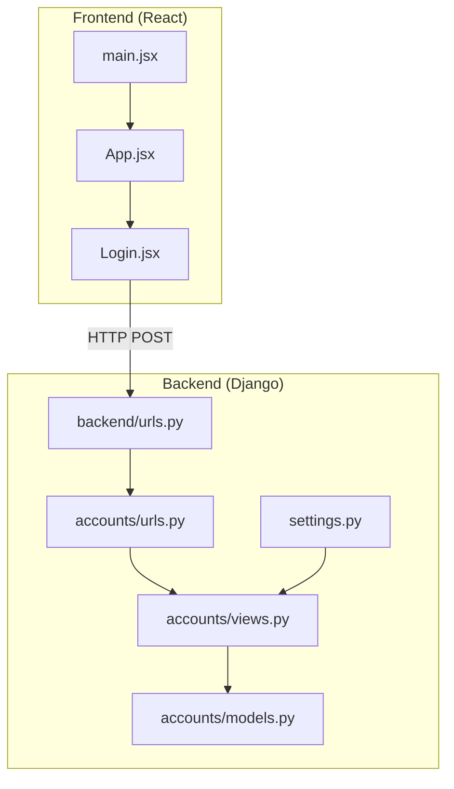
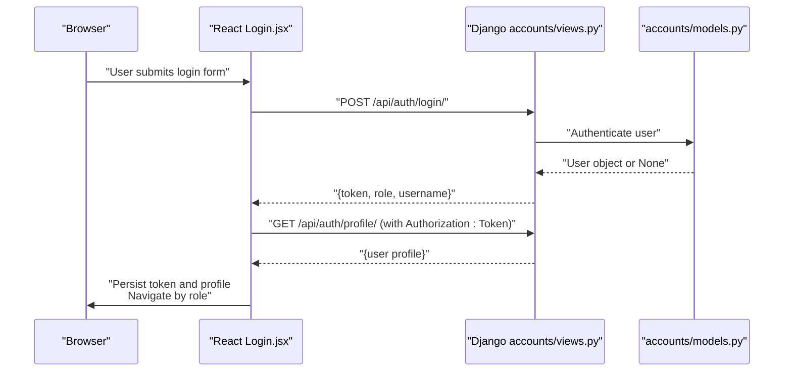
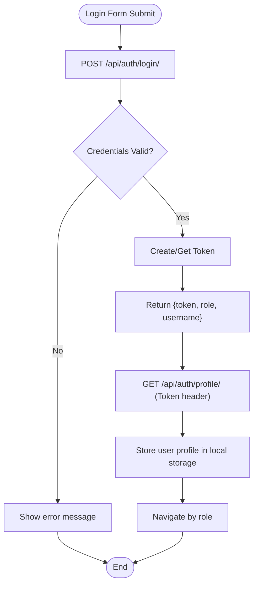
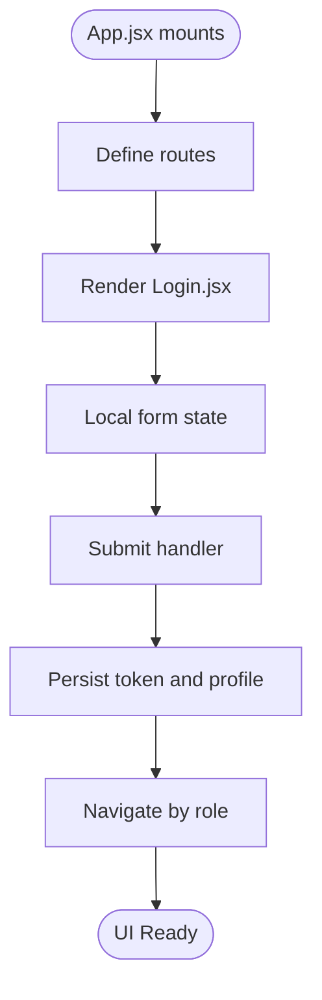
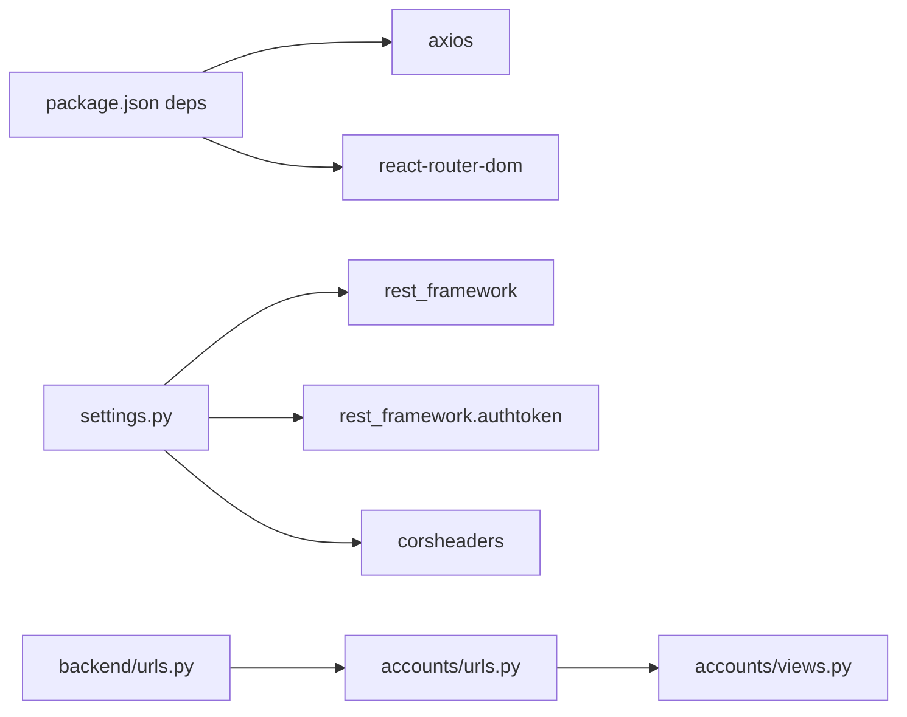

# Data Flow Patterns

<cite>
**Referenced Files in This Document**
- [settings.py](file://backend/backend/settings.py)
- [urls.py](file://backend/backend/urls.py)
- [accounts/models.py](file://backend/accounts/models.py)
- [accounts/views.py](file://backend/accounts/views.py)
- [accounts/urls.py](file://backend/accounts/urls.py)
- [App.jsx](file://frontend/src/App.jsx)
- [main.jsx](file://frontend/src/main.jsx)
- [Login.jsx](file://frontend/src/Pages/Public/Login.jsx)
- [package.json](file://frontend/package.json)
</cite>

## Table of Contents
1. [Introduction](#introduction)
2. [Project Structure](#project-structure)
3. [Core Components](#core-components)
4. [Architecture Overview](#architecture-overview)
5. [Detailed Component Analysis](#detailed-component-analysis)
6. [Dependency Analysis](#dependency-analysis)
7. [Performance Considerations](#performance-considerations)
8. [Troubleshooting Guide](#troubleshooting-guide)
9. [Conclusion](#conclusion)

## Introduction
This document describes the data flow patterns across the TPO Portal system, focusing on the end-to-end request-response lifecycle from the React frontend to Django backend. It covers authentication token handling, API endpoints, state management patterns, data transformation between frontend and backend, real-time update strategies, caching, optimistic updates, error propagation, loading states, user feedback, validation, input sanitization, and security considerations during data transmission.

## Project Structure
The system comprises:
- A Django backend with Django REST Framework (DRF) and token authentication.
- A React frontend using Vite, Axios for HTTP requests, and React Router for navigation.
- Cross-Origin Resource Sharing (CORS) configured to allow the frontend origin.

**Diagram sources**
- [main.jsx:1-11](file://frontend/src/main.jsx#L1-L11)
- [App.jsx:1-55](file://frontend/src/App.jsx#L1-L55)
- [Login.jsx:1-160](file://frontend/src/Pages/Public/Login.jsx#L1-L160)
- [settings.py:1-126](file://backend/backend/settings.py#L1-L126)
- [urls.py:1-11](file://backend/backend/urls.py#L1-L11)
- [accounts/views.py:1-95](file://backend/accounts/views.py#L1-L95)
- [accounts/urls.py:1-10](file://backend/accounts/urls.py#L1-L10)
- [accounts/models.py:1-25](file://backend/accounts/models.py#L1-L25)

**Section sources**
- [settings.py:1-126](file://backend/backend/settings.py#L1-L126)
- [urls.py:1-11](file://backend/backend/urls.py#L1-L11)
- [App.jsx:1-55](file://frontend/src/App.jsx#L1-L55)
- [main.jsx:1-11](file://frontend/src/main.jsx#L1-L11)
- [package.json:1-34](file://frontend/package.json#L1-L34)

## Core Components
- Frontend entry point initializes the React app and routes.
- Authentication pages submit credentials to backend endpoints and persist tokens and user metadata in local storage.
- Backend exposes authentication endpoints (login, register, profile, logout) with token-based protection for protected routes.
- User model supports role-based access control (student, recruiter, admin).

Key implementation references:
- Frontend routing and page composition: [App.jsx:25-52](file://frontend/src/App.jsx#L25-L52)
- Frontend entry point: [main.jsx:6-10](file://frontend/src/main.jsx#L6-L10)
- Frontend dependencies (Axios, React Router): [package.json:12-18](file://frontend/package.json#L12-L18)
- Backend settings (CORS, DRF, token auth): [settings.py:18-45](file://backend/backend/settings.py#L18-L45)
- Backend URLs composition: [urls.py:4-10](file://backend/backend/urls.py#L4-L10)
- Authentication endpoints: [accounts/urls.py:4-9](file://backend/accounts/urls.py#L4-L9)
- Authentication logic and protected profile endpoint: [accounts/views.py:13-89](file://backend/accounts/views.py#L13-L89)
- User model with roles: [accounts/models.py:4-25](file://backend/accounts/models.py#L4-L25)

**Section sources**
- [App.jsx:1-55](file://frontend/src/App.jsx#L1-L55)
- [main.jsx:1-11](file://frontend/src/main.jsx#L1-L11)
- [package.json:12-18](file://frontend/package.json#L12-L18)
- [settings.py:18-45](file://backend/backend/settings.py#L18-L45)
- [urls.py:4-10](file://backend/backend/urls.py#L4-L10)
- [accounts/urls.py:4-9](file://backend/accounts/urls.py#L4-L9)
- [accounts/views.py:13-89](file://backend/accounts/views.py#L13-L89)
- [accounts/models.py:4-25](file://backend/accounts/models.py#L4-L25)

## Architecture Overview
The request-response flow for authentication follows a predictable pattern:
- The frontend sends credentials to the backend login endpoint.
- On success, the backend responds with a token and user role.
- The frontend stores the token and retrieves the user profile via a protected endpoint.
- Navigation is performed based on role.

**Diagram sources**
- [Login.jsx:17-55](file://frontend/src/Pages/Public/Login.jsx#L17-L55)
- [accounts/views.py:13-89](file://backend/accounts/views.py#L13-L89)
- [accounts/models.py:4-25](file://backend/accounts/models.py#L4-L25)

## Detailed Component Analysis

### Authentication Endpoints and Token Flow
- Login endpoint accepts either email or username and returns a token upon successful authentication.
- Registration endpoint creates a new user with role selection.
- Profile endpoint requires a valid token and returns user details.
- Logout endpoint clears session state.

**Diagram sources**
- [accounts/views.py:13-89](file://backend/accounts/views.py#L13-L89)
- [Login.jsx:17-55](file://frontend/src/Pages/Public/Login.jsx#L17-L55)

**Section sources**
- [accounts/views.py:13-89](file://backend/accounts/views.py#L13-L89)
- [accounts/urls.py:4-9](file://backend/accounts/urls.py#L4-L9)
- [Login.jsx:17-55](file://frontend/src/Pages/Public/Login.jsx#L17-L55)

### Frontend State Management and Routing
- The React app uses client-side routing to render different pages based on the URL.
- The login page manages form state locally and performs network requests on submission.
- Tokens and user metadata are persisted in local storage for subsequent requests.

**Diagram sources**
- [App.jsx:25-52](file://frontend/src/App.jsx#L25-L52)
- [Login.jsx:7-55](file://frontend/src/Pages/Public/Login.jsx#L7-L55)

**Section sources**
- [App.jsx:1-55](file://frontend/src/App.jsx#L1-L55)
- [Login.jsx:1-160](file://frontend/src/Pages/Public/Login.jsx#L1-L160)

### Data Transformation Between Frontend and Backend
- Frontend serializes form data to JSON and sends Content-Type: application/json.
- Backend deserializes JSON bodies and validates fields.
- Backend returns structured JSON responses for token, role, and profile data.
- Frontend deserializes responses and persists relevant fields.

References:
- JSON serialization in login submission: [Login.jsx:20-24](file://frontend/src/Pages/Public/Login.jsx#L20-L24)
- JSON parsing and response handling: [Login.jsx:31-44](file://frontend/src/Pages/Public/Login.jsx#L31-L44)
- Backend JSON parsing and response construction: [accounts/views.py:16-41](file://backend/accounts/views.py#L16-L41)

**Section sources**
- [Login.jsx:17-55](file://frontend/src/Pages/Public/Login.jsx#L17-L55)
- [accounts/views.py:13-41](file://backend/accounts/views.py#L13-L41)

### Real-Time Updates, Caching, and Optimistic Updates
- Current implementation uses direct HTTP requests per action without explicit real-time subscriptions.
- Local storage is used for caching tokens and user profiles across sessions.
- No optimistic updates are implemented in the provided code; all state changes occur after server acknowledgment.

Recommendations (conceptual):
- Introduce a lightweight cache layer for frequently accessed resources.
- Implement optimistic UI updates for actions like marking applications as submitted, followed by reconciliation on server response.
- Consider adding a WebSocket or polling mechanism for live feed updates (e.g., new job drives).

[No sources needed since this section provides general guidance]

### Error Propagation, Loading States, and User Feedback
- Frontend surfaces errors via alerts and logs to the console.
- Backend returns structured messages for invalid JSON, invalid credentials, and other failures.
- Loading states are not explicitly handled in the login page; consider adding spinner indicators and disabled buttons during requests.

References:
- Error handling in login submission: [Login.jsx:51-54](file://frontend/src/Pages/Public/Login.jsx#L51-L54)
- Backend error responses: [accounts/views.py:42-45](file://backend/accounts/views.py#L42-L45)

**Section sources**
- [Login.jsx:51-54](file://frontend/src/Pages/Public/Login.jsx#L51-L54)
- [accounts/views.py:42-45](file://backend/accounts/views.py#L42-L45)

### Validation, Sanitization, and Security Considerations
- Backend enforces CSRF exemptions for authentication endpoints but still applies JSON parsing and field validation.
- Frontend validates presence of required fields at the UI level.
- CORS is configured to allow the development frontend origin.
- Token authentication is enforced for protected endpoints.

References:
- CSRF exemption and JSON parsing: [accounts/views.py:13-19](file://backend/accounts/views.py#L13-L19)
- CORS configuration: [settings.py:18-22](file://backend/backend/settings.py#L18-L22)
- Protected profile endpoint: [accounts/views.py:78-89](file://backend/accounts/views.py#L78-L89)

**Section sources**
- [accounts/views.py:13-19](file://backend/accounts/views.py#L13-L19)
- [accounts/views.py:78-89](file://backend/accounts/views.py#L78-L89)
- [settings.py:18-22](file://backend/backend/settings.py#L18-L22)

## Dependency Analysis
- Frontend depends on Axios for HTTP requests and React Router for navigation.
- Backend integrates DRF, token authentication, and CORS middleware.
- URL routing composes API namespaces for auth, student, recruiter, and admin modules.

**Diagram sources**
- [package.json:12-18](file://frontend/package.json#L12-L18)
- [settings.py:27-45](file://backend/backend/settings.py#L27-L45)
- [urls.py:4-10](file://backend/backend/urls.py#L4-L10)
- [accounts/urls.py:4-9](file://backend/accounts/urls.py#L4-L9)
- [accounts/views.py:1-11](file://backend/accounts/views.py#L1-L11)

**Section sources**
- [package.json:12-18](file://frontend/package.json#L12-L18)
- [settings.py:27-45](file://backend/backend/settings.py#L27-L45)
- [urls.py:4-10](file://backend/backend/urls.py#L4-L10)
- [accounts/urls.py:4-9](file://backend/accounts/urls.py#L4-L9)

## Performance Considerations
- Minimize payload sizes by requesting only necessary fields from backend endpoints.
- Debounce rapid user inputs in forms to reduce unnecessary requests.
- Cache static resources and avoid redundant profile fetches by checking local storage first.
- Use pagination for lists (e.g., companies, applicants) to limit initial load.

[No sources needed since this section provides general guidance]

## Troubleshooting Guide
Common issues and resolutions:
- Login fails with invalid credentials: Verify username/email and password match backend expectations; check backend error messages returned in the response body.
- Token not recognized: Ensure Authorization header is present with the format "Token <token>" when calling protected endpoints.
- CORS errors: Confirm the frontend origin is included in CORS_ALLOWED_ORIGINS and the backend is running on the expected port.
- Profile retrieval fails: Confirm the token is stored and passed correctly in the Authorization header.

References:
- Login error handling: [Login.jsx:51-54](file://frontend/src/Pages/Public/Login.jsx#L51-L54)
- Protected profile endpoint: [accounts/views.py:78-89](file://backend/accounts/views.py#L78-L89)
- CORS configuration: [settings.py:18-22](file://backend/backend/settings.py#L18-L22)

**Section sources**
- [Login.jsx:51-54](file://frontend/src/Pages/Public/Login.jsx#L51-L54)
- [accounts/views.py:78-89](file://backend/accounts/views.py#L78-L89)
- [settings.py:18-22](file://backend/backend/settings.py#L18-L22)

## Conclusion
The TPO Portal implements a straightforward, token-authenticated data flow between a React frontend and a Django backend. Authentication uses a dual-login approach and DRF token authentication. The current design relies on direct HTTP requests with local storage caching and basic error handling. Enhancements such as optimistic updates, structured loading states, and real-time capabilities would improve user experience and system responsiveness.