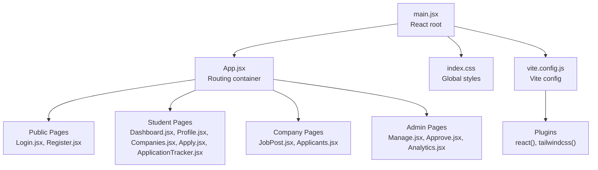
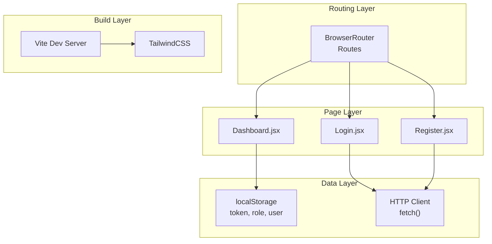
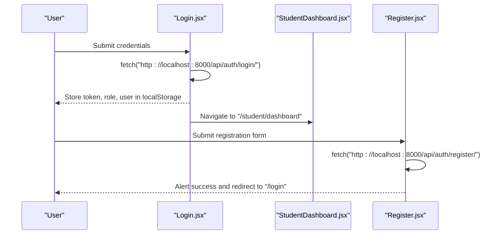
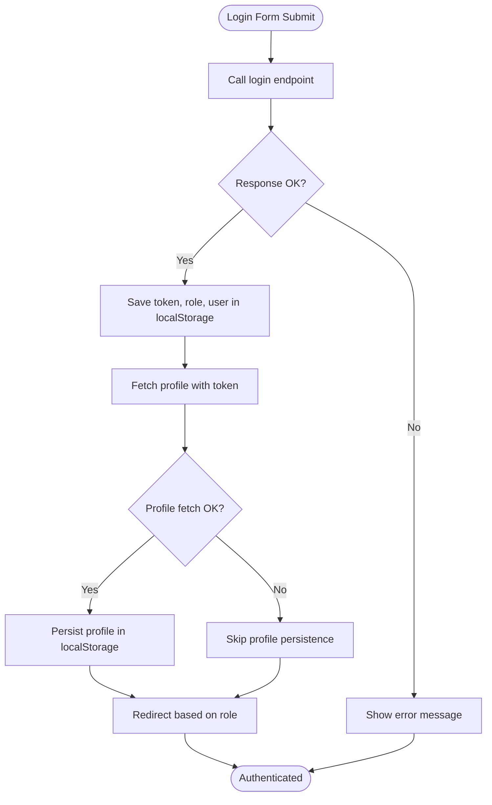
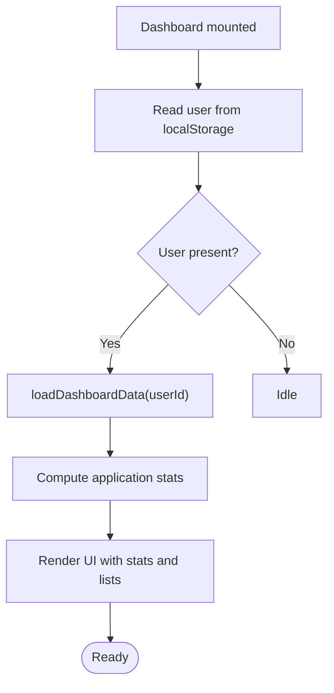
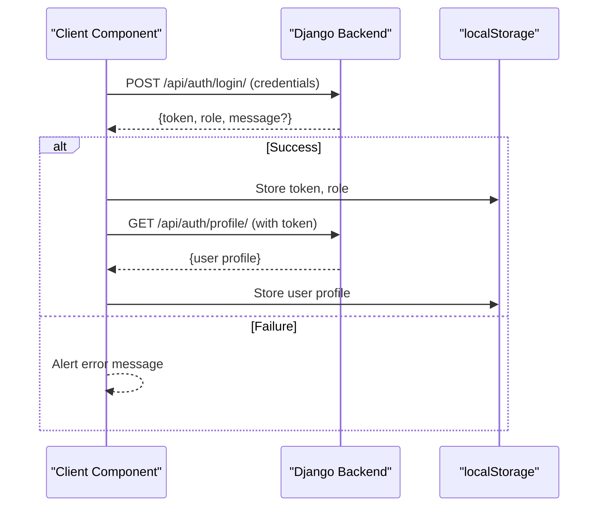
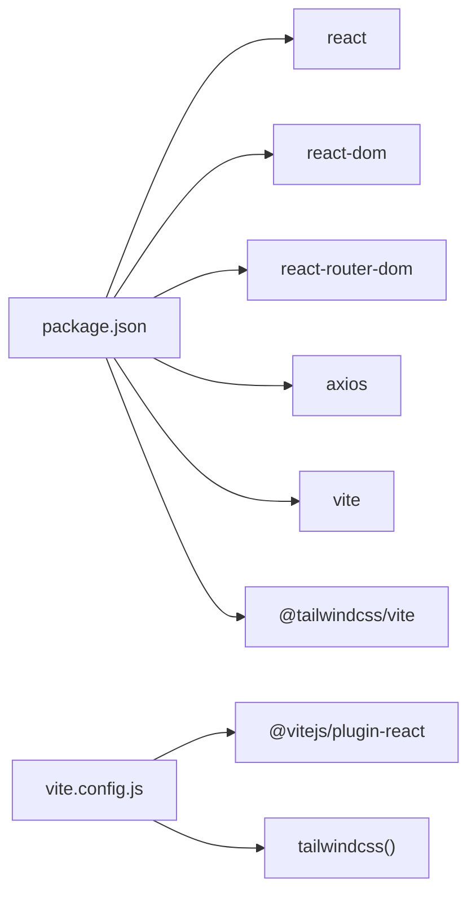

# Frontend Architecture

<cite>
**Referenced Files in This Document**
- [App.jsx](file://frontend/src/App.jsx)
- [main.jsx](file://frontend/src/main.jsx)
- [vite.config.js](file://frontend/vite.config.js)
- [package.json](file://frontend/package.json)
- [Login.jsx](file://frontend/src/Pages/Public/Login.jsx)
- [Register.jsx](file://frontend/src/Pages/Public/Register.jsx)
- [Dashboard.jsx](file://frontend/src/Pages/Student/Dashboard.jsx)
</cite>

## Table of Contents
1. [Introduction](#introduction)
2. [Project Structure](#project-structure)
3. [Core Components](#core-components)
4. [Architecture Overview](#architecture-overview)
5. [Detailed Component Analysis](#detailed-component-analysis)
6. [Dependency Analysis](#dependency-analysis)
7. [Performance Considerations](#performance-considerations)
8. [Troubleshooting Guide](#troubleshooting-guide)
9. [Conclusion](#conclusion)
10. [Appendices](#appendices)

## Introduction
This document describes the frontend architecture for the React-based TPO Portal. It covers the component-based structure, routing configuration with React Router DOM, the Vite build pipeline, and the integration with the Django backend via HTTP requests. It also outlines styling approaches, state management patterns, and performance considerations derived from the current implementation.

## Project Structure
The frontend is organized around a classic React layout with feature-based grouping:
- Entry point initializes the React root and global styles.
- Routing is configured centrally in App.jsx.
- Pages are grouped by role (Public, Student, Company, TPOAdmin).
- Build and dev tooling are configured via Vite.

**Diagram sources**
- [main.jsx:1-11](file://frontend/src/main.jsx#L1-L11)
- [App.jsx:1-55](file://frontend/src/App.jsx#L1-L55)
- [vite.config.js:1-9](file://frontend/vite.config.js#L1-L9)

**Section sources**
- [main.jsx:1-11](file://frontend/src/main.jsx#L1-L11)
- [App.jsx:1-55](file://frontend/src/App.jsx#L1-L55)
- [vite.config.js:1-9](file://frontend/vite.config.js#L1-L9)

## Core Components
- App.jsx defines routes for Public, Student, Recruiter, and Admin contexts. It uses React Router DOM’s BrowserRouter and Routes to declaratively map paths to page components.
- main.jsx creates the React root and mounts App, ensuring StrictMode is enabled for stricter checks during development.
- Vite configuration integrates React Fast Refresh and TailwindCSS via dedicated plugins.

Key observations:
- Routing is centralized and explicit, enabling easy navigation and future extension.
- Global styles are imported at the root level.
- Build scripts are defined in package.json for development, production build, preview, and linting.

**Section sources**
- [App.jsx:1-55](file://frontend/src/App.jsx#L1-L55)
- [main.jsx:1-11](file://frontend/src/main.jsx#L1-L11)
- [vite.config.js:1-9](file://frontend/vite.config.js#L1-L9)
- [package.json:1-34](file://frontend/package.json#L1-L34)

## Architecture Overview
The frontend follows a component-driven architecture with clear separation of concerns:
- Routing layer: App.jsx orchestrates navigation.
- Page layer: Role-specific pages encapsulate UI and local state.
- Data layer: Pages perform HTTP requests to the backend and persist tokens and user data in localStorage.
- Build layer: Vite compiles JSX and CSS, with TailwindCSS supporting utility-first styling.

**Diagram sources**
- [App.jsx:1-55](file://frontend/src/App.jsx#L1-L55)
- [Login.jsx:1-160](file://frontend/src/Pages/Public/Login.jsx#L1-L160)
- [Register.jsx:1-172](file://frontend/src/Pages/Public/Register.jsx#L1-L172)
- [Dashboard.jsx:1-456](file://frontend/src/Pages/Student/Dashboard.jsx#L1-L456)
- [vite.config.js:1-9](file://frontend/vite.config.js#L1-L9)

## Detailed Component Analysis

### Routing and Navigation Flow
The routing configuration maps URLs to page components. On successful authentication, the Login page redirects users to role-specific dashboards. The Register page handles new user creation and navigates back to the login screen upon success.

**Diagram sources**
- [Login.jsx:17-55](file://frontend/src/Pages/Public/Login.jsx#L17-L55)
- [Register.jsx:20-40](file://frontend/src/Pages/Public/Register.jsx#L20-L40)
- [App.jsx:34-49](file://frontend/src/App.jsx#L34-L49)

**Section sources**
- [App.jsx:1-55](file://frontend/src/App.jsx#L1-L55)
- [Login.jsx:1-160](file://frontend/src/Pages/Public/Login.jsx#L1-L160)
- [Register.jsx:1-172](file://frontend/src/Pages/Public/Register.jsx#L1-L172)

### Authentication and Token Management
- Login stores the authentication token, user role, and user profile in localStorage. It then fetches the profile using the token and persists it for later use.
- Logout clears all auth-related entries from localStorage and returns the user to the login page.
- The Dashboard reads the user profile from localStorage and uses it to render personalized content.

**Diagram sources**
- [Login.jsx:17-55](file://frontend/src/Pages/Public/Login.jsx#L17-L55)

**Section sources**
- [Login.jsx:17-55](file://frontend/src/Pages/Public/Login.jsx#L17-L55)
- [Dashboard.jsx:73-82](file://frontend/src/Pages/Student/Dashboard.jsx#L73-L82)

### State Management Patterns
- Local state per component: Login and Register maintain form state using useState.
- Component lifecycle: Dashboard uses useEffect to initialize data on mount by reading from localStorage.
- Derived state: Dashboard computes stats and profile completion percentages from persisted data.

**Diagram sources**
- [Dashboard.jsx:20-71](file://frontend/src/Pages/Student/Dashboard.jsx#L20-L71)

**Section sources**
- [Login.jsx:7-15](file://frontend/src/Pages/Public/Login.jsx#L7-L15)
- [Register.jsx:7-18](file://frontend/src/Pages/Public/Register.jsx#L7-L18)
- [Dashboard.jsx:6-29](file://frontend/src/Pages/Student/Dashboard.jsx#L6-L29)
- [Dashboard.jsx:31-71](file://frontend/src/Pages/Student/Dashboard.jsx#L31-L71)

### Styling Approach and Responsive Design
- Inline styles dominate the current implementation, with computed styles for dynamic attributes (e.g., button colors based on selected role).
- Responsive layout is achieved using CSS grid and minmax-based column sizing in Dashboard.
- Global styles are imported at the root via index.css.

Recommendations for improvement:
- Introduce Tailwind utility classes for consistent spacing, colors, and responsive breakpoints.
- Extract reusable styled components or CSS modules to reduce inline style duplication.

**Section sources**
- [Login.jsx:57-160](file://frontend/src/Pages/Public/Login.jsx#L57-L160)
- [Register.jsx:42-172](file://frontend/src/Pages/Public/Register.jsx#L42-L172)
- [Dashboard.jsx:173-449](file://frontend/src/Pages/Student/Dashboard.jsx#L173-L449)
- [main.jsx:3](file://frontend/src/main.jsx#L3)

### Backend Integration and HTTP Client Configuration
- HTTP requests are performed using the browser fetch API against localhost endpoints.
- Error handling is basic: non-OK responses trigger an alert with the returned message.
- Authentication relies on bearer-style token passing via Authorization header.

**Diagram sources**
- [Login.jsx:20-44](file://frontend/src/Pages/Public/Login.jsx#L20-L44)

**Section sources**
- [Login.jsx:20-55](file://frontend/src/Pages/Public/Login.jsx#L20-L55)
- [Register.jsx:22-40](file://frontend/src/Pages/Public/Register.jsx#L22-L40)

### Component Composition Patterns
- Page components are self-contained and encapsulate UI, state, and navigation.
- Dashboard composes multiple UI sections (stats cards, quick actions, recent applications, upcoming drives) using a grid layout.
- Navigation is handled via react-router-dom’s useNavigate, keeping navigation logic close to the UI that triggers it.

**Section sources**
- [Dashboard.jsx:103-452](file://frontend/src/Pages/Student/Dashboard.jsx#L103-L452)

### Custom Hook Usage
- Current implementation does not include custom hooks. Consider extracting authentication and data-fetching logic into custom hooks to improve reusability and testability.

[No sources needed since this section provides general guidance]

## Dependency Analysis
External dependencies and their roles:
- react, react-dom: Core React runtime and DOM renderer.
- react-router-dom: Client-side routing.
- axios: Present in dependencies but not currently used in the codebase.
- @tailwindcss/vite: TailwindCSS integration for Vite.
- @vitejs/plugin-react: React Fast Refresh support.

**Diagram sources**
- [package.json:12-32](file://frontend/package.json#L12-L32)
- [vite.config.js:1-9](file://frontend/vite.config.js#L1-L9)

**Section sources**
- [package.json:12-32](file://frontend/package.json#L12-L32)
- [vite.config.js:1-9](file://frontend/vite.config.js#L1-L9)

## Performance Considerations
- Prefer Tailwind utility classes for responsive and scalable UI to reduce custom CSS and improve maintainability.
- Defer heavy computations to useMemo/useCallback where appropriate to avoid unnecessary re-renders.
- Lazy-load route components to reduce initial bundle size.
- Centralize HTTP client configuration (headers, base URL, interceptors) to streamline error handling and caching strategies.

[No sources needed since this section provides general guidance]

## Troubleshooting Guide
Common issues and remedies:
- CORS errors when calling backend endpoints: Ensure the backend allows requests from http://localhost:5173.
- Authentication failures: Verify token storage and Authorization header usage in requests.
- Styling inconsistencies: Migrate inline styles to Tailwind classes for predictable rendering.
- Build-time errors: Confirm Vite and Tailwind plugins are properly installed and configured.

**Section sources**
- [Login.jsx:26-29](file://frontend/src/Pages/Public/Login.jsx#L26-L29)
- [Login.jsx:38-44](file://frontend/src/Pages/Public/Login.jsx#L38-L44)

## Conclusion
The frontend employs a straightforward, component-based architecture with centralized routing and localStorage-backed authentication. The Vite build pipeline integrates React and TailwindCSS, while HTTP communication is handled via fetch. To scale, consider adopting custom hooks, a shared HTTP client, and Tailwind utility classes for consistent styling and responsive design.

## Appendices
- Development commands:
  - npm run dev: Start Vite dev server.
  - npm run build: Produce optimized production assets.
  - npm run preview: Preview built assets locally.
  - npm run lint: Run ESLint across the codebase.

**Section sources**
- [package.json:6-10](file://frontend/package.json#L6-L10)