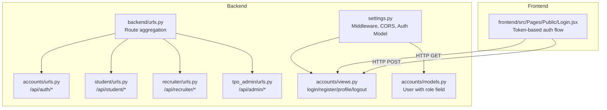
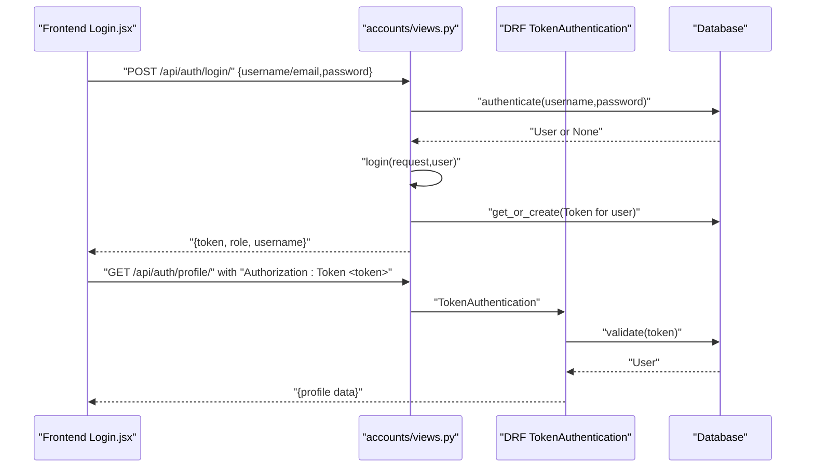
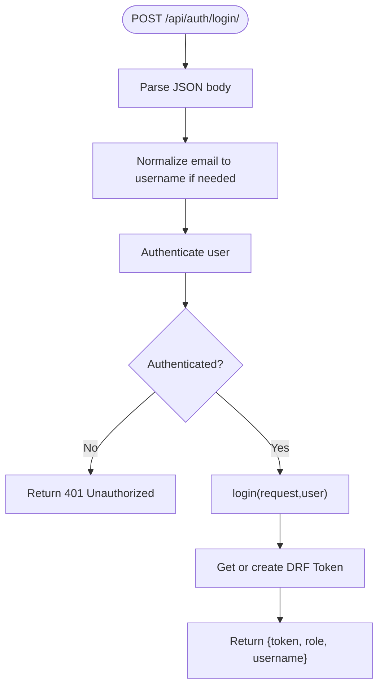
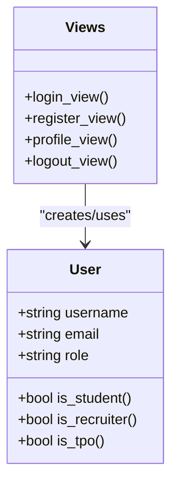
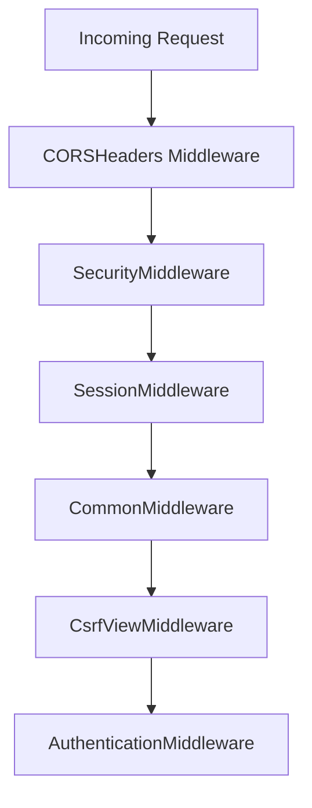
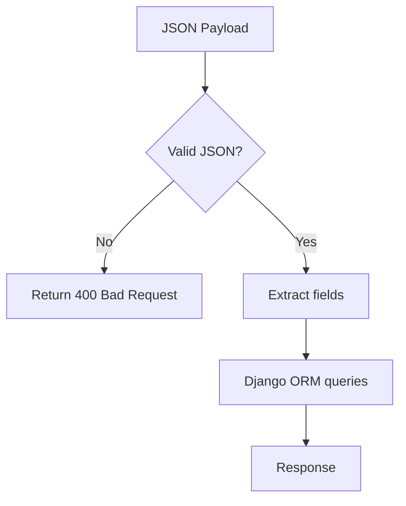
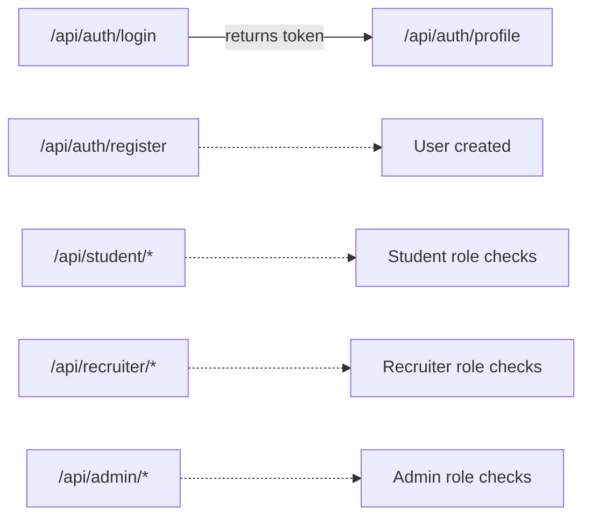

# Security Architecture

<cite>
**Referenced Files in This Document**
- [settings.py](file://backend/backend/settings.py)
- [urls.py](file://backend/backend/urls.py)
- [accounts/urls.py](file://backend/accounts/urls.py)
- [accounts/views.py](file://backend/accounts/views.py)
- [accounts/models.py](file://backend/accounts/models.py)
- [accounts/migrations/0001_initial.py](file://backend/accounts/migrations/0001_initial.py)
- [student/urls.py](file://backend/student/urls.py)
- [student/views.py](file://backend/student/views.py)
- [recruiter/urls.py](file://backend/recruiter/urls.py)
- [recruiter/views.py](file://backend/recruiter/views.py)
- [tpo_admin/urls.py](file://backend/tpo_admin/urls.py)
- [tpo_admin/views.py](file://backend/tpo_admin/views.py)
- [frontend/src/Pages/Public/Login.jsx](file://frontend/src/Pages/Public/Login.jsx)
</cite>

## Table of Contents
1. [Introduction](#introduction)
2. [Project Structure](#project-structure)
3. [Core Components](#core-components)
4. [Architecture Overview](#architecture-overview)
5. [Detailed Component Analysis](#detailed-component-analysis)
6. [Dependency Analysis](#dependency-analysis)
7. [Performance Considerations](#performance-considerations)
8. [Troubleshooting Guide](#troubleshooting-guide)
9. [Conclusion](#conclusion)
10. [Appendices](#appendices)

## Introduction
This document describes the security architecture of the TPO Portal system. It focuses on the token-based authentication model, authorization patterns by role, CORS and CSRF protections, secure headers, input validation, SQL injection prevention, XSS safeguards, password hashing and storage, audit logging, middleware configuration, rate limiting, and secure communication practices. The backend is a Django application with Django REST Framework (DRF) and token authentication. The frontend is a React application that communicates with the backend via HTTP APIs.

## Project Structure
The security-relevant parts of the system are organized into:
- Backend Django settings and middleware stack
- Authentication app (accounts) handling login, registration, profile, and logout
- Feature apps (student, recruiter, tpo_admin) exposing protected endpoints
- Frontend React app performing authenticated requests with tokens

**Diagram sources**
- [settings.py:1-126](file://backend/backend/settings.py#L1-L126)
- [backend/urls.py:1-11](file://backend/backend/urls.py#L1-L11)
- [accounts/urls.py:1-10](file://backend/accounts/urls.py#L1-L10)
- [student/urls.py:1-8](file://backend/student/urls.py#L1-L8)
- [recruiter/urls.py:1-8](file://backend/recruiter/urls.py#L1-L8)
- [tpo_admin/urls.py:1-9](file://backend/tpo_admin/urls.py#L1-L9)
- [accounts/views.py:1-95](file://backend/accounts/views.py#L1-L95)
- [accounts/models.py:1-25](file://backend/accounts/models.py#L1-L25)
- [frontend/src/Pages/Public/Login.jsx:1-128](file://frontend/src/Pages/Public/Login.jsx#L1-L128)

**Section sources**
- [settings.py:1-126](file://backend/backend/settings.py#L1-L126)
- [backend/urls.py:1-11](file://backend/backend/urls.py#L1-L11)
- [accounts/urls.py:1-10](file://backend/accounts/urls.py#L1-L10)
- [student/urls.py:1-8](file://backend/student/urls.py#L1-L8)
- [recruiter/urls.py:1-8](file://backend/recruiter/urls.py#L1-L8)
- [tpo_admin/urls.py:1-9](file://backend/tpo_admin/urls.py#L1-L9)
- [accounts/views.py:1-95](file://backend/accounts/views.py#L1-L95)
- [accounts/models.py:1-25](file://backend/accounts/models.py#L1-L25)
- [frontend/src/Pages/Public/Login.jsx:1-128](file://frontend/src/Pages/Public/Login.jsx#L1-L128)

## Core Components
- Authentication and Authorization
  - Token-based authentication using Django REST Framework TokenAuthentication
  - Role-based access control via a User model with role choices
  - Protected endpoints enforced by DRF decorators and middleware
- Middleware Stack
  - CORSHeaders, SecurityMiddleware, Session, CSRF, XFrameOptions
- Input Validation and Sanitization
  - JSON parsing with explicit error handling
  - Password validators configured by Django
- Secure Storage
  - Django’s built-in password hashing and storage
- Audit Logging
  - Not implemented in the current codebase; recommended extension
- Rate Limiting
  - Not implemented in the current codebase; recommended extension
- Secure Communication
  - Localhost endpoints; HTTPS and certificate management not configured in settings

**Section sources**
- [accounts/views.py:1-95](file://backend/accounts/views.py#L1-L95)
- [accounts/models.py:1-25](file://backend/accounts/models.py#L1-L25)
- [settings.py:47-56](file://backend/backend/settings.py#L47-L56)
- [settings.py:89-105](file://backend/backend/settings.py#L89-L105)
- [frontend/src/Pages/Public/Login.jsx:1-128](file://frontend/src/Pages/Public/Login.jsx#L1-L128)

## Architecture Overview
The authentication flow uses token-based sessions:
- Clients POST credentials to the login endpoint
- On success, the server authenticates the user, creates or retrieves a DRF Token, and returns it
- Subsequent requests include the token in the Authorization header
- DRF enforces IsAuthenticated for protected endpoints

**Diagram sources**
- [accounts/views.py:13-45](file://backend/accounts/views.py#L13-L45)
- [accounts/views.py:78-89](file://backend/accounts/views.py#L78-L89)
- [frontend/src/Pages/Public/Login.jsx:17-44](file://frontend/src/Pages/Public/Login.jsx#L17-L44)

## Detailed Component Analysis

### Token-Based Authentication System
- Login
  - Accepts either username or email; normalizes email to username for authentication
  - Returns token, role, and username on success
  - Uses CSRF exemption for API endpoints; CSRF protection is handled by middleware for browser-originated requests
- Registration
  - Creates a new User with validated inputs and default role “student”
- Profile Retrieval
  - Protected by DRF TokenAuthentication and IsAuthenticated
- Logout
  - Clears session; token remains valid until revoked

**Diagram sources**
- [accounts/views.py:13-45](file://backend/accounts/views.py#L13-L45)

**Section sources**
- [accounts/views.py:13-45](file://backend/accounts/views.py#L13-L45)
- [accounts/views.py:48-75](file://backend/accounts/views.py#L48-L75)
- [accounts/views.py:78-89](file://backend/accounts/views.py#L78-L89)
- [accounts/views.py:92-95](file://backend/accounts/views.py#L92-L95)

### Authorization Patterns and Role-Based Access Control
- Roles
  - User model defines three roles: student, recruiter, tpo
- Authorization
  - Current protected endpoints use DRF IsAuthenticated
  - No role-specific permission classes are applied in the provided views
- Recommendations
  - Add custom permission classes per role for each app
  - Enforce permissions at the view level for endpoints like /api/recruiter/post-job/ and /api/admin/*

**Diagram sources**
- [accounts/models.py:1-25](file://backend/accounts/models.py#L1-L25)
- [accounts/views.py:1-95](file://backend/accounts/views.py#L1-L95)

**Section sources**
- [accounts/models.py:4-25](file://backend/accounts/models.py#L4-L25)
- [accounts/views.py:78-89](file://backend/accounts/views.py#L78-L89)

### CORS Configuration
- Allowed origins configured for local development (localhost:5173)
- Middleware order includes corsheaders before common middleware

**Diagram sources**
- [settings.py:18-22](file://backend/backend/settings.py#L18-L22)
- [settings.py:47-56](file://backend/backend/settings.py#L47-L56)

**Section sources**
- [settings.py:18-22](file://backend/backend/settings.py#L18-L22)
- [settings.py:47-56](file://backend/backend/settings.py#L47-L56)

### CSRF Protection
- CSRF middleware enabled
- Login and registration endpoints are decorated with csrf_exempt to allow API-style POST
- For browser-originated requests, CSRF cookies and tokens are enforced by Django

**Section sources**
- [settings.py:52-52](file://backend/backend/settings.py#L52-L52)
- [accounts/views.py:2-2](file://backend/accounts/views.py#L2-L2)

### Secure Headers Implementation
- SecurityMiddleware enabled
- X-Frame-Options enforced by XFrameOptionsMiddleware
- Additional headers (e.g., Content-Security-Policy, HSTS) are not configured in settings

**Section sources**
- [settings.py:49-55](file://backend/backend/settings.py#L49-L55)

### Input Validation and SQL Injection Prevention
- JSON parsing with explicit error handling prevents malformed payloads
- Django ORM usage avoids raw SQL; database queries are performed via ORM
- Password validators configured to enforce strong passwords

**Diagram sources**
- [accounts/views.py:16-44](file://backend/accounts/views.py#L16-L44)
- [accounts/views.py:50-75](file://backend/accounts/views.py#L50-L75)

**Section sources**
- [accounts/views.py:16-44](file://backend/accounts/views.py#L16-L44)
- [accounts/views.py:50-75](file://backend/accounts/views.py#L50-L75)
- [settings.py:89-105](file://backend/backend/settings.py#L89-L105)

### XSS Protection Measures
- No explicit XSS sanitization or CSP headers are configured in settings
- Recommendation: Add Content-Security-Policy header via SecurityMiddleware and sanitize dynamic content in templates if used

**Section sources**
- [settings.py:49-55](file://backend/backend/settings.py#L49-L55)

### Password Hashing and Secure Storage
- Django’s default password hashing and storage mechanisms apply
- Password validators configured to prevent weak passwords

**Section sources**
- [settings.py:89-105](file://backend/backend/settings.py#L89-L105)

### Audit Logging
- Not present in the current codebase
- Recommendation: Implement structured logging for authentication events, failed attempts, and sensitive actions

**Section sources**
- [accounts/views.py:29-41](file://backend/accounts/views.py#L29-L41)

### Security Middleware Configuration
- Order ensures CORS, security, sessions, CSRF, and clickjacking protections are applied consistently

**Section sources**
- [settings.py:47-56](file://backend/backend/settings.py#L47-L56)

### Rate Limiting
- Not implemented in the current codebase
- Recommendation: Integrate DRF Throttling or a third-party solution for IP-based limits

**Section sources**
- [accounts/views.py:1-10](file://backend/accounts/views.py#L1-L10)

### Protection Against Common Web Vulnerabilities
- CSRF: Enabled via middleware and csrf_exempt only for API endpoints
- Clickjacking: Mitigated by X-Frame-Options
- SQL Injection: Prevented by ORM usage
- XSS: Not currently mitigated by CSP; recommended addition
- Sensitive Data Exposure: Tokens returned on login; ensure transport security and client-side storage hygiene

**Section sources**
- [settings.py:47-56](file://backend/backend/settings.py#L47-L56)
- [accounts/views.py:13-45](file://backend/accounts/views.py#L13-L45)

### Secure Communication Protocols and Certificate Management
- Settings indicate local development mode; HTTPS and certificates are not configured
- Recommendation: Enable HTTPS in production, configure proper TLS, and manage certificates via trusted CA

**Section sources**
- [settings.py:11-14](file://backend/backend/settings.py#L11-L14)

## Dependency Analysis
Endpoints and their protection levels:
- /api/auth/login/: csrf_exempt, authentication via DRF token on success
- /api/auth/register/: csrf_exempt, basic validation
- /api/auth/profile/: protected by DRF TokenAuthentication and IsAuthenticated
- /api/student/*: currently unprotected; should enforce role-based permissions
- /api/recruiter/*: currently unprotected; should enforce role-based permissions
- /api/admin/*: currently unprotected; should enforce role-based permissions

**Diagram sources**
- [accounts/urls.py:1-10](file://backend/accounts/urls.py#L1-L10)
- [student/urls.py:1-8](file://backend/student/urls.py#L1-L8)
- [recruiter/urls.py:1-8](file://backend/recruiter/urls.py#L1-L8)
- [tpo_admin/urls.py:1-9](file://backend/tpo_admin/urls.py#L1-L9)
- [accounts/views.py:78-89](file://backend/accounts/views.py#L78-L89)

**Section sources**
- [accounts/urls.py:1-10](file://backend/accounts/urls.py#L1-L10)
- [student/urls.py:1-8](file://backend/student/urls.py#L1-L8)
- [recruiter/urls.py:1-8](file://backend/recruiter/urls.py#L1-L8)
- [tpo_admin/urls.py:1-9](file://backend/tpo_admin/urls.py#L1-L9)
- [accounts/views.py:78-89](file://backend/accounts/views.py#L78-L89)

## Performance Considerations
- Token retrieval on login is O(1) database operation
- Profile endpoint performs a single user lookup
- Recommendations: Add caching for profile data, enable connection pooling, and consider pagination for large datasets

[No sources needed since this section provides general guidance]

## Troubleshooting Guide
- Login fails with invalid credentials
  - Ensure username or email is correct and password matches
  - Verify that the account exists and is active
- Token not accepted
  - Confirm Authorization header format: Token <token>
  - Check that the token exists and is not expired (tokens are not scoped to expire by default)
- CORS errors
  - Verify origin is included in CORS_ALLOWED_ORIGINS
  - Ensure the frontend runs on http://localhost:5173
- CSRF errors
  - For API endpoints, ensure csrf_exempt is appropriate; for browser-originated requests, CSRF cookies must be present

**Section sources**
- [accounts/views.py:13-45](file://backend/accounts/views.py#L13-L45)
- [accounts/views.py:78-89](file://backend/accounts/views.py#L78-L89)
- [settings.py:18-22](file://backend/backend/settings.py#L18-L22)
- [frontend/src/Pages/Public/Login.jsx:17-44](file://frontend/src/Pages/Public/Login.jsx#L17-L44)

## Conclusion
The TPO Portal employs a straightforward token-based authentication model with DRF TokenAuthentication and a role field on the User model. The middleware stack provides CSRF, CORS, and clickjacking protections suitable for development. To harden the system for production, implement role-based permissions, add CSP headers, introduce rate limiting and audit logging, and enable HTTPS with proper certificate management.

[No sources needed since this section summarizes without analyzing specific files]

## Appendices

### Permission Matrix (Proposed)
- Student
  - /api/student/dashboard/
  - /api/student/applications/
- Recruiter
  - /api/recruiter/post-job/
  - /api/recruiter/applicants/
- Admin
  - /api/admin/companies/
  - /api/admin/drives/
  - /api/admin/results/

[No sources needed since this section proposes general guidance]