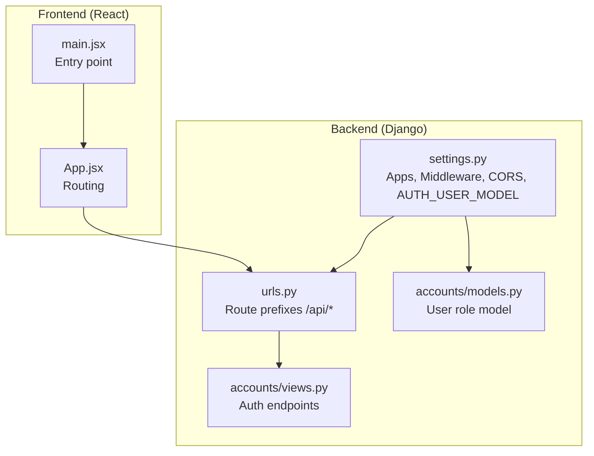
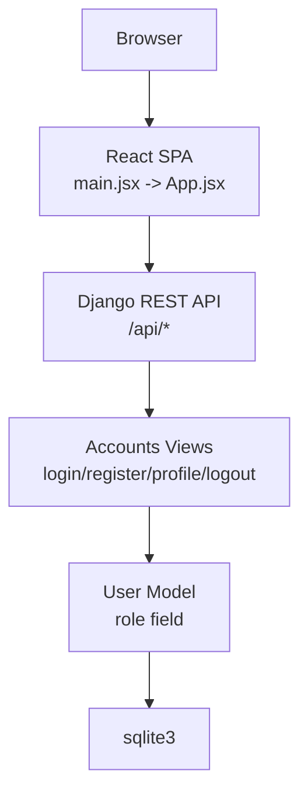
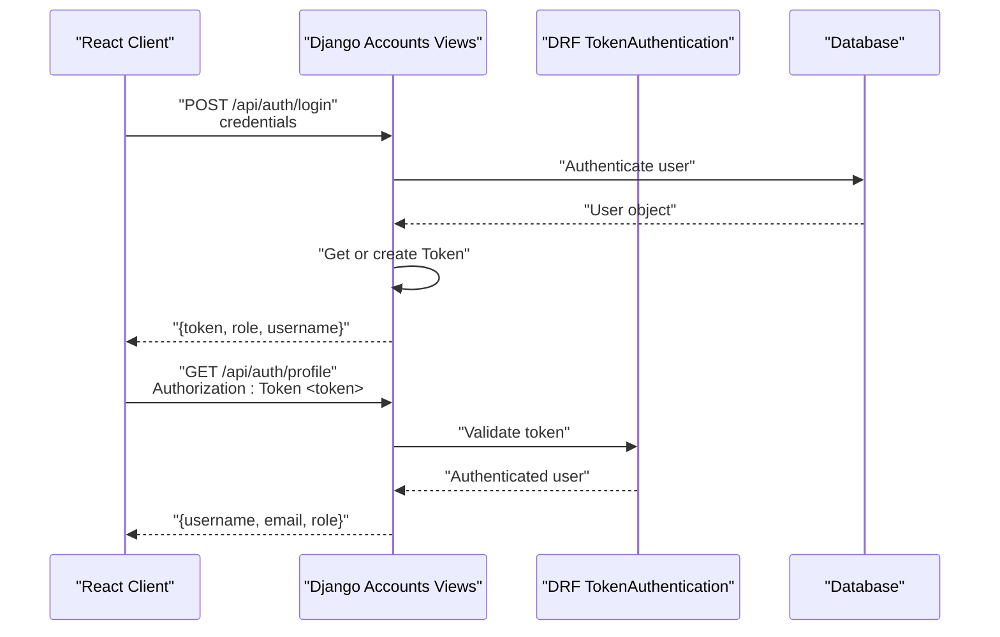
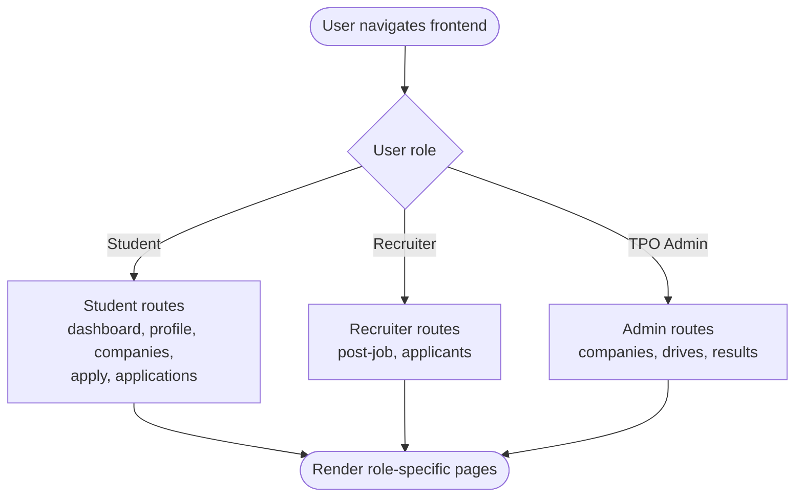
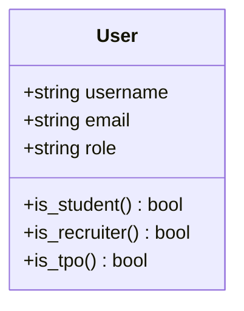
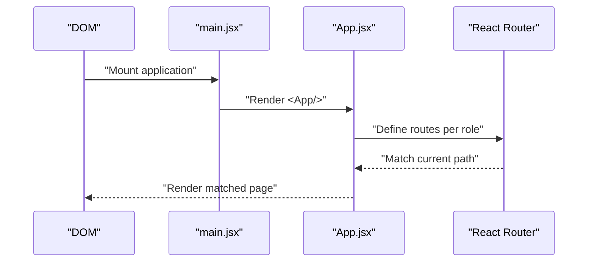
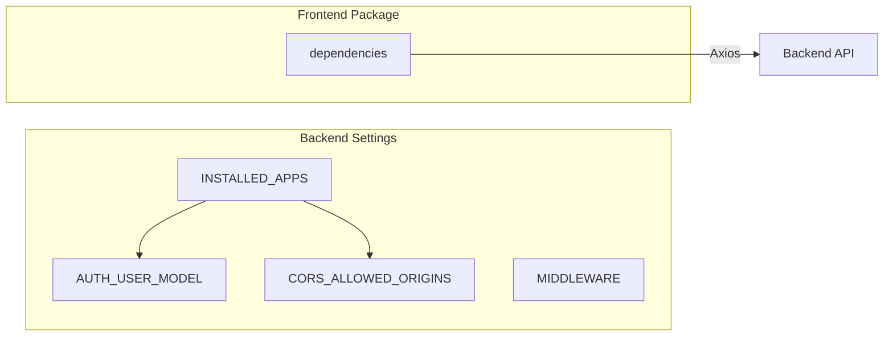
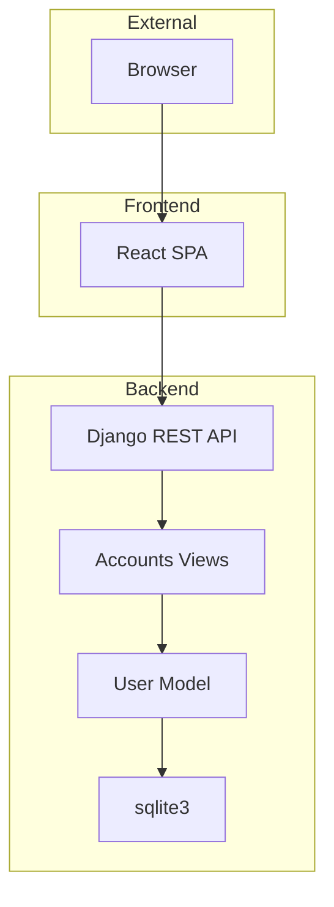

# System Architecture

<cite>
**Referenced Files in This Document**
- [backend/settings.py](file://backend/backend/settings.py)
- [backend/urls.py](file://backend/backend/urls.py)
- [backend/manage.py](file://backend/manage.py)
- [accounts/models.py](file://backend/accounts/models.py)
- [accounts/views.py](file://backend/accounts/views.py)
- [accounts/urls.py](file://backend/accounts/urls.py)
- [student/models.py](file://backend/student/models.py)
- [recruiter/models.py](file://backend/recruiter/models.py)
- [tpo_admin/models.py](file://backend/tpo_admin/models.py)
- [frontend/package.json](file://frontend/package.json)
- [frontend/src/main.jsx](file://frontend/src/main.jsx)
- [frontend/src/App.jsx](file://frontend/src/App.jsx)
</cite>

## Table of Contents
1. [Introduction](#introduction)
2. [Project Structure](#project-structure)
3. [Core Components](#core-components)
4. [Architecture Overview](#architecture-overview)
5. [Detailed Component Analysis](#detailed-component-analysis)
6. [Dependency Analysis](#dependency-analysis)
7. [Performance Considerations](#performance-considerations)
8. [Troubleshooting Guide](#troubleshooting-guide)
9. [Conclusion](#conclusion)
10. [Appendices](#appendices)

## Introduction
This document describes the system architecture of the TPO Portal, a platform connecting students, recruiters, and TPO administrators. The backend follows Django’s model-view-controller pattern with a RESTful API built using Django REST Framework and token-based authentication. The frontend is a React single-page application using client-side routing and integrates with the backend via HTTP requests. Cross-origin resource sharing is configured to allow local development from the React Vite server. The system supports a multi-role user model with role-specific routes and capabilities.

## Project Structure
The repository is organized into two primary directories:
- backend: Django project containing Django apps for accounts, student, recruiter, and tpo_admin, plus Django settings and URL configuration.
- frontend: React application bootstrapped with Vite, using React Router for client-side navigation and Tailwind CSS for styling.

High-level structure and boundaries:
- Backend boundary: Django application exposing REST endpoints under /api/* and serving as the authoritative source of user roles and authentication state.
- Frontend boundary: React SPA hosted locally during development and served statically; communicates with backend APIs using Axios.
- External boundaries: No third-party integrations are evident in the current codebase; CORS is configured for local development origins.

**Diagram sources**
- [backend/backend/settings.py:19-45](file://backend/backend/settings.py#L19-L45)
- [backend/backend/urls.py:4-10](file://backend/backend/urls.py#L4-L10)
- [backend/accounts/views.py:13-95](file://backend/accounts/views.py#L13-L95)
- [backend/accounts/models.py:4-25](file://backend/accounts/models.py#L4-L25)
- [frontend/src/main.jsx:1-11](file://frontend/src/main.jsx#L1-L11)
- [frontend/src/App.jsx:1-55](file://frontend/src/App.jsx#L1-L55)

**Section sources**
- [backend/backend/settings.py:19-45](file://backend/backend/settings.py#L19-L45)
- [backend/backend/urls.py:4-10](file://backend/backend/urls.py#L4-L10)
- [frontend/src/main.jsx:1-11](file://frontend/src/main.jsx#L1-L11)
- [frontend/src/App.jsx:1-55](file://frontend/src/App.jsx#L1-L55)

## Core Components
- Authentication and Authorization
  - User model extends Django’s AbstractUser and defines role choices for student, recruiter, and TPO admin.
  - Token-based authentication via Django REST Framework authtoken.
  - Login supports dual credential input (username or email), registration endpoint, protected profile retrieval, and logout.
- Multi-role Routing and Access
  - Frontend routes are defined per role with dedicated pages for each persona.
  - Backend exposes role-aware endpoints under /api/auth/, /api/student/, /api/recruiter/, and /api/admin/.
- Cross-Origin Resource Sharing
  - CORS is configured to allow development from localhost:5173 and 127.0.0.1:5173.
- Technology Stack
  - Backend: Django, Django REST Framework, django-cors-headers, sqlite3 for development.
  - Frontend: React 19, React Router 7, Axios for HTTP, Vite for build tooling.

**Section sources**
- [accounts/models.py:4-25](file://backend/accounts/models.py#L4-L25)
- [accounts/views.py:13-95](file://backend/accounts/views.py#L13-L95)
- [accounts/urls.py:4-9](file://backend/accounts/urls.py#L4-L9)
- [backend/backend/settings.py:18-45](file://backend/backend/settings.py#L18-L45)
- [frontend/package.json:12-18](file://frontend/package.json#L12-L18)
- [frontend/src/App.jsx:25-52](file://frontend/src/App.jsx#L25-L52)

## Architecture Overview
The system follows a classic client-server architecture:
- Frontend (React SPA) handles UI rendering and client-side navigation.
- Backend (Django) serves REST endpoints, manages authentication tokens, and stores user data.
- Data persistence uses sqlite3 in development; production-grade databases can be swapped via Django settings.
- CORS middleware enables local development from the Vite dev server.

**Diagram sources**
- [frontend/src/main.jsx:1-11](file://frontend/src/main.jsx#L1-L11)
- [frontend/src/App.jsx:1-55](file://frontend/src/App.jsx#L1-L55)
- [backend/backend/urls.py:4-10](file://backend/backend/urls.py#L4-L10)
- [backend/accounts/views.py:13-95](file://backend/accounts/views.py#L13-L95)
- [backend/accounts/models.py:4-25](file://backend/accounts/models.py#L4-L25)
- [backend/backend/settings.py:81-86](file://backend/backend/settings.py#L81-L86)

## Detailed Component Analysis

### Authentication and Token-Based Flow
The authentication flow uses token-based sessions:
- Clients send credentials to the login endpoint, which authenticates and issues a token.
- Subsequent requests include the token for protected endpoints.
- The profile endpoint demonstrates token-protected access returning user metadata.

**Diagram sources**
- [accounts/views.py:13-95](file://backend/accounts/views.py#L13-L95)
- [accounts/urls.py:4-9](file://backend/accounts/urls.py#L4-L9)
- [backend/backend/urls.py:6-6](file://backend/backend/urls.py#L6-L6)

**Section sources**
- [accounts/views.py:13-95](file://backend/accounts/views.py#L13-L95)
- [accounts/urls.py:4-9](file://backend/accounts/urls.py#L4-L9)

### Multi-Role System and Routing
The system defines three roles via the User model and exposes role-specific routes in the frontend:
- Students: dashboard, profile, companies, apply, applications.
- Recruiters: post jobs, view applicants.
- TPO Administrators: manage companies, approve drives, analytics.

**Diagram sources**
- [frontend/src/App.jsx:25-52](file://frontend/src/App.jsx#L25-L52)
- [accounts/models.py:4-25](file://backend/accounts/models.py#L4-L25)

**Section sources**
- [frontend/src/App.jsx:25-52](file://frontend/src/App.jsx#L25-L52)
- [accounts/models.py:4-25](file://backend/accounts/models.py#L4-L25)

### Data Model for Users
The User model centralizes role information and provides convenience methods to check roles.

**Diagram sources**
- [accounts/models.py:4-25](file://backend/accounts/models.py#L4-L25)

**Section sources**
- [accounts/models.py:4-25](file://backend/accounts/models.py#L4-L25)

### Frontend Bootstrapping and Routing
The React application initializes the root and sets up client-side routes for all personas.

**Diagram sources**
- [frontend/src/main.jsx:1-11](file://frontend/src/main.jsx#L1-L11)
- [frontend/src/App.jsx:1-55](file://frontend/src/App.jsx#L1-L55)

**Section sources**
- [frontend/src/main.jsx:1-11](file://frontend/src/main.jsx#L1-L11)
- [frontend/src/App.jsx:1-55](file://frontend/src/App.jsx#L1-L55)

## Dependency Analysis
Backend dependencies and configuration:
- Installed apps include accounts, student, recruiter, tpo_admin, rest_framework, rest_framework.authtoken, and corsheaders.
- Middleware includes corsheaders and standard Django middleware.
- AUTH_USER_MODEL points to the custom User model in accounts.
- CORS_ALLOWED_ORIGINS permits development from Vite’s default port.

Frontend dependencies:
- Core runtime: react, react-dom, react-router-dom.
- HTTP client: axios.
- Build tooling: vite, tailwindcss, @vitejs/plugin-react.

**Diagram sources**
- [backend/backend/settings.py:27-45](file://backend/backend/settings.py#L27-L45)
- [backend/backend/settings.py:47-56](file://backend/backend/settings.py#L47-L56)
- [backend/backend/settings.py:119-120](file://backend/backend/settings.py#L119-L120)
- [backend/backend/settings.py:18-22](file://backend/backend/settings.py#L18-L22)
- [frontend/package.json:12-18](file://frontend/package.json#L12-L18)

**Section sources**
- [backend/backend/settings.py:27-45](file://backend/backend/settings.py#L27-L45)
- [backend/backend/settings.py:47-56](file://backend/backend/settings.py#L47-L56)
- [backend/backend/settings.py:119-120](file://backend/backend/settings.py#L119-L120)
- [backend/backend/settings.py:18-22](file://backend/backend/settings.py#L18-L22)
- [frontend/package.json:12-18](file://frontend/package.json#L12-L18)

## Performance Considerations
- Token-based authentication avoids session overhead on the server and simplifies horizontal scaling.
- SQLite is suitable for development but may require migration to a production database for concurrency and reliability.
- Client-side routing reduces server load by delegating navigation to the browser.
- CORS configuration should be restricted in production environments to trusted origins only.

## Troubleshooting Guide
Common issues and resolutions:
- Login failures: Verify credentials and ensure the login endpoint receives POST requests with JSON payload.
- Token errors: Confirm Authorization header includes the issued token for protected endpoints.
- CORS errors: Ensure the frontend origin matches the configured CORS_ALLOWED_ORIGINS.
- Database connectivity: Confirm sqlite3 path and permissions in development settings.

**Section sources**
- [accounts/views.py:13-95](file://backend/accounts/views.py#L13-L95)
- [backend/backend/settings.py:18-22](file://backend/backend/settings.py#L18-L22)

## Conclusion
The TPO Portal employs a clean separation of concerns: Django handles authentication, authorization, and role-based access control, while React delivers a responsive, role-aware user interface. The RESTful API and token-based authentication enable scalable integration, and CORS is configured for seamless local development. Future enhancements could include role-based permissions, production database migration, and centralized API documentation.

## Appendices

### System Context Diagram

**Diagram sources**
- [frontend/src/App.jsx:1-55](file://frontend/src/App.jsx#L1-L55)
- [backend/backend/urls.py:4-10](file://backend/backend/urls.py#L4-L10)
- [backend/accounts/views.py:13-95](file://backend/accounts/views.py#L13-L95)
- [backend/accounts/models.py:4-25](file://backend/accounts/models.py#L4-L25)
- [backend/backend/settings.py:81-86](file://backend/backend/settings.py#L81-L86)